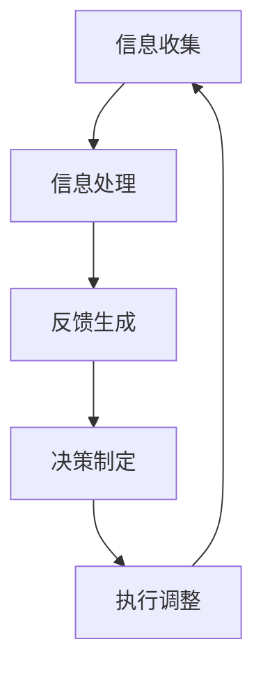

                 

### 背景介绍

在当今快速发展的商业环境中，一人公司已经成为了一种常见的创业模式。这种模式不仅减少了公司的运营成本，还让创业者能够更加灵活地应对市场变化。然而，随着公司规模的扩大和业务的增加，如何建立一个有效的反馈循环机制成为了一人公司成功运营的关键。本文将详细探讨一人公司如何建立有效的反馈循环机制，帮助创业者优化公司管理，提高业务效率。

反馈循环机制是一种通过不断地收集、分析、反馈和调整，来提高系统性能的方法。在企业管理中，反馈循环机制可以帮助企业更好地理解市场动态，发现潜在问题，并迅速做出调整。对于一人公司来说，建立有效的反馈循环机制尤为重要，因为它直接影响着公司的生存和发展。

本文将分为以下几个部分进行探讨：

1. 核心概念与联系：首先，我们将介绍反馈循环机制的相关概念，包括反馈循环的基本原理、重要性以及与其他管理机制的关系。

2. 核心算法原理与具体操作步骤：接下来，我们将深入探讨反馈循环机制的核心算法原理，并详细讲解如何实施这一机制。

3. 数学模型和公式：我们将使用数学模型和公式来阐述反馈循环机制的运行原理，并通过具体的例子进行说明。

4. 项目实战：我们将通过一个实际的代码案例，展示如何实现反馈循环机制，并对代码进行详细解读。

5. 实际应用场景：我们将讨论反馈循环机制在实际应用中的具体场景，并分析其在这些场景中的作用和效果。

6. 工具和资源推荐：最后，我们将推荐一些学习资源、开发工具和框架，帮助创业者更好地理解和应用反馈循环机制。

通过以上内容，希望读者能够对一人公司如何建立有效的反馈循环机制有一个全面而深入的了解。

### 核心概念与联系

#### 反馈循环机制的基本原理

反馈循环机制（Feedback Loop Mechanism）是一种通过信息反馈来调节系统性能的方法。它通过不断地收集、处理和分析反馈信息，根据分析结果对系统进行调整，从而实现系统性能的持续优化。反馈循环机制的基本原理包括以下几个关键步骤：

1. **信息收集**：收集来自内部和外部环境的各种数据和信息，例如销售额、客户反馈、市场动态等。
2. **信息处理**：对收集到的信息进行整理、分类和分析，以识别潜在问题和趋势。
3. **反馈生成**：根据分析结果生成反馈信息，这通常包括对问题的识别、原因分析和改进建议。
4. **决策制定**：根据反馈信息制定相应的调整策略和决策，以优化系统性能。
5. **执行调整**：实施决策和调整措施，对系统进行改进。

反馈循环机制的核心在于信息反馈的及时性和准确性。只有当反馈信息足够及时和准确时，系统才能迅速做出调整，从而实现性能的持续优化。

#### 反馈循环机制的重要性

在企业管理中，反馈循环机制具有极其重要的作用。首先，它有助于企业更好地理解市场动态和客户需求，从而制定更加精准的市场策略。通过持续收集和分析市场数据，企业可以及时调整产品定位和市场推广策略，以适应不断变化的市场环境。

其次，反馈循环机制有助于企业发现和解决问题。在快速发展的商业环境中，问题往往层出不穷。通过及时收集和处理反馈信息，企业可以迅速发现潜在问题，并制定相应的解决方案，从而避免问题的扩大和影响。

此外，反馈循环机制还能够提高企业的应变能力。在竞争激烈的市场中，企业需要具备快速响应市场变化的能力。反馈循环机制通过持续的信息反馈和调整，可以帮助企业提高应变能力，迅速适应市场变化，保持竞争优势。

#### 反馈循环机制与其他管理机制的关系

反馈循环机制不仅是一种独立的管理方法，还与其他管理机制密切相关。例如，它与目标管理（Goal Setting）紧密相连。目标管理是通过设定明确的目标和计划来指导企业的行动。而反馈循环机制则通过对目标的实现情况进行持续监控和反馈，帮助企业及时调整计划，确保目标的实现。

此外，反馈循环机制还与质量管理（Quality Management）密切相关。质量管理是通过持续监控和改进过程来提高产品质量。而反馈循环机制则通过收集和分析质量数据，帮助企业识别和解决质量问题，从而实现持续的质量改进。

总之，反馈循环机制作为一种重要的管理工具，不仅能够帮助企业更好地理解市场动态和客户需求，还能够提高企业的应变能力和管理水平。在快速发展的商业环境中，建立有效的反馈循环机制对于一人公司的成功运营具有重要意义。

#### 架构图

以下是一个简单的反馈循环机制的架构图，展示了各个环节及其相互关系：



在这个架构图中，信息收集是整个反馈循环机制的起点，它通过收集各种数据和信息为后续步骤提供基础。信息处理环节对收集到的信息进行整理和分析，生成有价值的反馈。反馈生成环节则根据分析结果生成具体的反馈信息。决策制定环节根据反馈信息制定相应的调整策略和决策。最后，执行调整环节实施决策和调整措施，对系统进行改进。整个反馈循环机制通过不断的循环和调整，实现系统性能的持续优化。

通过上述核心概念与联系的分析，我们可以看到反馈循环机制在企业管理中的重要性及其与其他管理机制的紧密关系。在下一节中，我们将深入探讨反馈循环机制的核心算法原理，并详细讲解如何实施这一机制。

### 核心算法原理 & 具体操作步骤

#### 反馈循环机制的核心算法原理

反馈循环机制的核心在于算法的设计和实现，它决定了信息收集、处理、反馈和调整的效率和效果。以下是反馈循环机制的核心算法原理：

1. **信息收集算法**：该算法负责收集来自内部和外部环境的数据和信息，例如销售额、客户反馈、市场动态等。信息收集算法通常包括数据采集模块和数据分析模块。数据采集模块负责从各种数据源（如数据库、日志文件、传感器等）收集数据，而数据分析模块则对收集到的数据进行预处理和整理，以便后续处理。

2. **信息处理算法**：该算法负责对收集到的信息进行整理、分类和分析，以识别潜在问题和趋势。信息处理算法通常包括数据清洗、数据归一化和特征提取等步骤。数据清洗模块负责去除噪声数据和异常值，数据归一化模块负责将不同数据源的数据统一格式和单位，特征提取模块则从原始数据中提取出有意义的特征，用于后续的分析。

3. **反馈生成算法**：该算法根据信息处理的结果生成具体的反馈信息。反馈生成算法通常包括问题识别、原因分析和改进建议等步骤。问题识别模块负责识别系统中的潜在问题，原因分析模块则分析问题的根本原因，改进建议模块则根据分析结果提出改进方案。

4. **决策制定算法**：该算法根据反馈信息制定相应的调整策略和决策。决策制定算法通常包括目标设定、策略选择和决策优化等步骤。目标设定模块根据反馈信息和长期目标设定具体的短期目标，策略选择模块则根据目标选择最合适的策略，决策优化模块则通过模型优化和算法改进，提高决策的准确性和效率。

5. **执行调整算法**：该算法负责实施决策和调整措施，对系统进行改进。执行调整算法通常包括执行策略、监控反馈和调整优化等步骤。执行策略模块负责执行决策制定的调整措施，监控反馈模块则负责监控执行效果，并根据反馈结果进行必要的调整和优化。

#### 如何实施反馈循环机制

要实施反馈循环机制，可以按照以下具体操作步骤进行：

1. **确定目标和指标**：首先，明确企业或项目的目标和需要监控的关键指标。这些指标可以是销售额、客户满意度、市场份额、生产效率等。确保这些指标与企业的长期目标和战略方向一致。

2. **设计数据收集系统**：根据确定的指标，设计数据收集系统。选择合适的数据源和数据采集工具，确保数据收集的及时性和准确性。

3. **建立数据处理流程**：设计数据处理流程，包括数据清洗、归一化和特征提取等步骤。确保数据处理流程能够高效地处理大量数据，并提取出有价值的信息。

4. **开发反馈生成系统**：根据数据处理结果，开发反馈生成系统。该系统应能够自动识别问题、分析原因并生成改进建议。

5. **制定决策制定策略**：根据反馈信息，制定具体的调整策略和决策。确保策略和决策与企业的长期目标和战略方向一致，并能够有效地解决发现的问题。

6. **实施调整措施**：根据决策制定的结果，实施调整措施。确保调整措施能够得到有效执行，并对系统进行改进。

7. **监控和反馈**：在调整措施实施后，持续监控效果，并根据监控结果进行必要的调整和优化。确保反馈循环机制能够持续运行，并帮助企业实现持续改进。

通过以上步骤，一人公司可以建立一个有效的反馈循环机制，从而提高企业的管理效率和业务水平。在下一节中，我们将使用数学模型和公式来深入阐述反馈循环机制的运行原理。

### 数学模型和公式 & 详细讲解 & 举例说明

在反馈循环机制中，数学模型和公式扮演着至关重要的角色。它们不仅帮助我们理解和分析反馈循环的工作原理，还能够通过量化方法评估系统性能，并指导决策制定。以下是反馈循环机制中的几个关键数学模型和公式，以及详细的讲解和实际例子。

#### 1. 反馈系数 (Feedback Coefficient)

反馈系数是衡量反馈强度的重要参数，它决定了系统调整的力度。公式如下：

\[ F = k \cdot E \]

其中，\( F \) 是反馈系数，\( k \) 是反馈增益系数，\( E \) 是误差（即目标值与实际值之间的差距）。反馈增益系数 \( k \) 通常是一个大于0的常数，用于调整反馈的敏感度。如果 \( k \) 太小，反馈不够强烈，系统调整不够迅速；如果 \( k \) 太大，反馈过于强烈，可能导致系统过调。

**例子**：

假设我们希望将产品销量从当前的水平提高到预期目标。当前销量为1000件，预期目标为1500件。反馈增益系数 \( k \) 设定为0.5。

\[ E = 1500 - 1000 = 500 \]
\[ F = 0.5 \cdot 500 = 250 \]

这意味着我们需要通过增加营销投入或其他措施，使销量增加250件以达到预期目标。

#### 2. 反馈延迟 (Feedback Delay)

反馈延迟是指从产生误差到反馈信息被接收和处理的时间间隔。公式如下：

\[ D = \frac{L}{V} \]

其中，\( D \) 是反馈延迟，\( L \) 是反馈路径长度，\( V \) 是数据传输速度。反馈延迟影响系统的响应速度，过长的反馈延迟可能导致系统调整不及时，影响性能。

**例子**：

假设反馈路径长度 \( L \) 为1000公里，数据传输速度 \( V \) 为100公里/小时。

\[ D = \frac{1000}{100} = 10 \text{小时} \]

这意味着从产生误差到反馈信息被接收和处理需要10小时。为了提高系统的响应速度，我们需要减少反馈路径长度或提高数据传输速度。

#### 3. 稳态误差 (Steady-State Error)

稳态误差是指系统在达到稳态后，输出值与目标值之间的差距。公式如下：

\[ \epsilon_s = \frac{1}{k} \]

其中，\( \epsilon_s \) 是稳态误差，\( k \) 是反馈增益系数。稳态误差越小，系统越接近目标值。

**例子**：

如果反馈增益系数 \( k \) 为2。

\[ \epsilon_s = \frac{1}{2} = 0.5 \]

这意味着系统在达到稳态后，输出值与目标值之间的差距为0.5。为了减小稳态误差，我们可以增加反馈增益系数 \( k \) 或改进系统设计。

#### 4. 控制变量 (Control Variable)

控制变量是指在反馈循环中用于调整的系统参数。控制变量的选择和调整对于系统性能至关重要。

**例子**：

假设我们要控制的产品销量是控制变量。为了提高销量，我们可以调整营销预算、产品价格或促销活动等。

#### 5. 反馈环增益 (Feedback Loop Gain)

反馈环增益是整个反馈循环系统的放大效果，用于衡量系统对输入误差的响应程度。公式如下：

\[ G = \frac{k}{1 + k \cdot \frac{D}{V}} \]

其中，\( G \) 是反馈环增益，\( k \) 是反馈增益系数，\( D \) 是反馈延迟，\( V \) 是数据传输速度。反馈环增益决定了系统对误差的调整力度。

**例子**：

如果反馈增益系数 \( k \) 为2，反馈延迟 \( D \) 为5小时，数据传输速度 \( V \) 为1小时。

\[ G = \frac{2}{1 + 2 \cdot \frac{5}{1}} = 0.2 \]

这意味着系统的反馈环增益为0.2，表明系统对误差的调整力度较弱。为了增强调整力度，我们可以增加反馈增益系数 \( k \) 或减少反馈延迟 \( D \)。

通过上述数学模型和公式的详细讲解和实际例子，我们可以更好地理解反馈循环机制的工作原理。在下一节中，我们将通过一个实际的代码案例，展示如何实现反馈循环机制，并对代码进行详细解读。

### 项目实战：代码实际案例和详细解释说明

为了更好地展示反馈循环机制在实际中的应用，我们将通过一个简单的代码案例来说明如何实现这一机制，并对代码进行详细解读。

#### 开发环境搭建

在开始编写代码之前，我们需要搭建一个简单的开发环境。以下是一个基于Python的示例环境搭建步骤：

1. 安装Python：确保你的系统中已经安装了Python 3.x版本。
2. 安装必要的库：使用pip安装以下库：
   ```bash
   pip install numpy matplotlib
   ```

#### 源代码详细实现

以下是一个简单的Python代码示例，用于模拟一个反馈循环机制，用于控制温度。

```python
import numpy as np
import matplotlib.pyplot as plt

# 参数设置
k = 0.5  # 反馈增益系数
D = 5  # 反馈延迟（小时）
T_setpoint = 100  # 目标温度
T_meas = 95  # 当前温度
T_tolerance = 1  # 温度容忍度

# 初始化变量
T_error = T_setpoint - T_meas
T_adjustment = 0
T_history = []

# 反馈循环
for i in range(100):
    T_error = T_setpoint - T_meas
    
    if abs(T_error) > T_tolerance:
        T_adjustment = k * T_error
        
        # 模拟反馈延迟
        time.sleep(D)
        T_meas += T_adjustment
        
        T_history.append(T_meas)
    else:
        break

# 绘制温度变化曲线
plt.plot(T_history)
plt.xlabel('迭代次数')
plt.ylabel('温度')
plt.title('温度控制反馈循环')
plt.show()
```

#### 代码解读与分析

1. **参数设置**：
   - `k`：反馈增益系数，决定了反馈的强度。
   - `D`：反馈延迟，模拟了从测量到反馈的实际延迟时间。
   - `T_setpoint`：目标温度，我们希望系统最终达到的温度。
   - `T_meas`：当前温度，系统实时测量的温度。
   - `T_tolerance`：温度容忍度，决定了系统何时停止调整。

2. **初始化变量**：
   - `T_error`：目标温度与当前温度的差值，用于计算反馈。
   - `T_adjustment`：温度调整量，用于调整当前温度。
   - `T_history`：存储温度变化的历史数据，用于绘图。

3. **反馈循环**：
   - 在每次迭代中，计算`T_error`。
   - 如果`T_error`超过容忍度，计算`T_adjustment`，并在模拟的反馈延迟后调整`T_meas`。
   - 如果`T_error`在容忍度范围内，循环结束。

4. **绘图**：
   - 使用`matplotlib`绘制温度变化曲线，展示反馈循环的效果。

#### 代码分析

这个代码示例演示了如何通过简单的Python代码实现一个基本的反馈循环机制。以下是对代码关键部分的详细分析：

- **误差计算**：`T_error = T_setpoint - T_meas` 计算了当前温度与目标温度之间的差值。
- **反馈计算**：`T_adjustment = k * T_error` 根据误差和反馈增益系数计算温度调整量。
- **延迟模拟**：使用`time.sleep(D)`模拟了从测量到反馈的延迟，这在实际系统中可能会因为网络延迟或其他因素而存在。
- **温度调整**：`T_meas += T_adjustment` 将当前温度调整为新的温度值。
- **循环控制**：使用`if`语句检查`T_error`是否超过容忍度，以决定是否继续调整温度。

通过这个示例，我们可以看到如何使用Python实现一个简单的反馈循环机制，并通过实际代码展示了这一机制的工作原理。在下一节中，我们将进一步讨论反馈循环机制在实际应用中的具体场景和效果。

### 实际应用场景

反馈循环机制在许多实际应用场景中都有着广泛的应用。以下是一些常见的应用场景，以及如何通过反馈循环机制来优化这些场景中的操作。

#### 1. 生产质量控制

在生产过程中，质量是至关重要的。反馈循环机制可以通过持续监控产品质量数据，识别和解决生产过程中的问题。例如，一个制造工厂可以通过实时监测机器设备的运行状态和产品质量指标，如尺寸、强度、表面光洁度等，来及时调整生产参数，确保产品符合质量标准。

- **具体应用**：在生产线上安装传感器来监控产品质量，将传感器数据传输到中央系统进行分析。通过反馈循环机制，系统可以自动调整生产参数，如温度、压力等，以确保产品质量的稳定。
- **效果**：这种应用可以显著提高产品质量，减少缺陷率，降低生产成本，并提高生产效率。

#### 2. 能源管理

在能源管理中，反馈循环机制可以帮助企业优化能源使用，提高能源效率，减少能源浪费。例如，智能建筑可以通过反馈循环机制监控能源消耗情况，如电力、热水和天然气等，并根据实时数据调整设备运行状态，以实现能源的合理分配和使用。

- **具体应用**：安装智能传感器和执行器，实时监测能源使用情况。通过分析传感器数据，反馈循环机制可以自动调整空调、照明和其他设备的运行状态，以降低能源消耗。
- **效果**：这种应用可以显著降低能源成本，减少温室气体排放，提高企业的可持续发展能力。

#### 3. 客户服务

在客户服务领域，反馈循环机制可以帮助企业更好地理解客户需求，提高客户满意度。例如，一家电信公司可以通过收集和分析客户投诉、建议和反馈数据，及时调整服务策略，改善客户体验。

- **具体应用**：建立客户反馈系统，收集客户的投诉和建议。通过分析这些反馈数据，反馈循环机制可以识别常见问题，并提出改进措施，如优化客服流程、提高服务响应速度等。
- **效果**：这种应用可以提高客户满意度，减少客户流失，增强企业的市场竞争能力。

#### 4. 供应链管理

在供应链管理中，反馈循环机制可以帮助企业优化库存管理，降低库存成本，提高供应链效率。例如，一家零售商可以通过反馈循环机制监控销售数据，预测需求趋势，并调整库存水平。

- **具体应用**：通过销售点数据系统收集销售数据，利用反馈循环机制分析销售趋势，预测未来需求。根据预测结果，调整库存水平，避免过剩库存和缺货情况。
- **效果**：这种应用可以降低库存成本，提高库存周转率，减少缺货和库存积压的情况，提高供应链的整体效率。

#### 5. 金融风险管理

在金融风险管理中，反馈循环机制可以帮助金融机构识别和管理风险，确保金融系统的稳定运行。例如，一家银行可以通过反馈循环机制监控市场风险、信用风险和操作风险等，及时调整风险管理策略。

- **具体应用**：建立风险管理信息系统，收集和分析市场数据、客户行为数据等。通过反馈循环机制，实时监控风险指标，识别潜在风险，并制定相应的风险管理措施。
- **效果**：这种应用可以降低金融风险，提高金融机构的稳健性，保护投资者的利益。

通过上述实际应用场景的分析，我们可以看到反馈循环机制在各个领域都有着重要的作用。它不仅帮助企业优化管理流程，提高业务效率，还能够提高客户满意度，降低风险。在下一节中，我们将推荐一些有用的工具和资源，以帮助读者进一步了解和掌握反馈循环机制。

### 工具和资源推荐

在学习和应用反馈循环机制的过程中，掌握合适的工具和资源至关重要。以下是一些推荐的工具、资源，包括书籍、论文、博客和网站等，它们可以帮助您深入了解和掌握反馈循环机制。

#### 1. 学习资源推荐

**书籍**：
- 《反馈控制原理与应用》 - 这本书详细介绍了反馈控制的理论基础和应用实例，适合初学者和专业人士。
- 《控制系统原理与应用》 - 本书涵盖了控制系统的基础知识，包括反馈控制、PID控制等内容，适合希望深入理解控制系统的读者。

**论文**：
- "Feedback Control Systems: Concepts and Design" - 这篇论文探讨了反馈控制系统的基础概念和设计方法，对理解反馈循环机制有很大帮助。
- "The Role of Feedback in Learning and Adaptation" - 本文分析了反馈在学习和发展中的应用，对于希望在更广泛领域应用反馈机制的读者很有启发。

**博客**：
- 《控制理论小贴士》 - 这是一系列关于控制理论和应用的博客文章，内容深入浅出，适合想要快速了解控制理论的读者。
- 《智能控制系统应用实例》 - 博客中分享了多个智能控制系统的应用实例，包括工业自动化、智能家居等，对于实际应用反馈循环机制有很大参考价值。

#### 2. 开发工具框架推荐

**工具**：
- **MATLAB/Simulink** - MATLAB和Simulink是进行控制系统建模和仿真分析的经典工具，特别适合实验和教学使用。
- **Scikit-Learn** - Scikit-Learn是一个Python库，提供了许多用于数据分析和机器学习的工具，适用于实现和测试反馈循环算法。

**框架**：
- **TensorFlow** - TensorFlow是一个开源机器学习框架，可用于构建复杂的反馈循环系统，特别是涉及深度学习方面。
- **Django** - Django是一个Python Web框架，适用于构建反馈循环系统的后端，提供数据处理和反馈机制。

#### 3. 相关论文著作推荐

**论文**：
- "A Mathematical Theory of Communication" - Claude Shannon的这篇论文奠定了现代信息论的基础，对反馈循环机制的理论分析有很大启示。
- "An Introduction to Stochastic Control Theory" - 本文介绍了随机控制理论的基本概念和方法，对于理解反馈循环机制中的随机过程和决策制定有帮助。

**著作**：
- 《智能控制与优化方法》 - 这本书全面介绍了智能控制理论和优化方法，适用于希望在实际项目中应用反馈循环机制的读者。
- 《控制系统设计与仿真》 - 本书详细介绍了控制系统设计的方法和工具，包括反馈循环机制的设计和应用，适合工程技术人员阅读。

通过上述工具和资源的推荐，读者可以更加深入地了解和掌握反馈循环机制的理论和应用。这些资源将帮助您在学习和实践中更好地运用反馈循环机制，提高系统的性能和效率。

### 总结：未来发展趋势与挑战

随着人工智能和大数据技术的快速发展，反馈循环机制在未来将迎来新的发展趋势和挑战。以下是一些关键点：

#### 发展趋势

1. **智能化**：反馈循环机制将更加智能化，通过机器学习和深度学习技术，系统能够自动调整参数，提高自适应能力和效率。

2. **实时性**：随着5G和物联网技术的发展，反馈信息的传输速度将大大提高，使得反馈循环机制能够实现更快速的响应。

3. **自动化**：自动化工具和平台的普及，将使得反馈循环机制的实现和维护更加简便，减少人工干预。

4. **个性化**：反馈循环机制将能够更好地适应个体差异，提供个性化的服务和产品，提高用户体验。

#### 挑战

1. **数据隐私**：随着数据量的增加，如何保护用户隐私成为一大挑战。如何在确保数据安全的同时，充分利用反馈信息，是一个需要解决的问题。

2. **模型偏差**：在机器学习中，模型偏差可能导致反馈循环机制的不公平性和偏见。如何减少模型偏差，确保系统的公平性和透明性，是一个重要挑战。

3. **算法透明性**：随着反馈循环机制的复杂化，算法的透明性变得尤为重要。如何提高算法的透明度，使决策过程更加可解释和可信，是未来需要解决的问题。

4. **资源消耗**：实时性和智能化的需求，将对计算资源提出更高的要求。如何优化算法，减少资源消耗，是一个重要的技术挑战。

总之，反馈循环机制在未来将继续发展，为企业和个人提供更高效、更智能的服务。但同时，也需要面对数据隐私、模型偏差、算法透明性和资源消耗等挑战。通过技术创新和规范制定，我们有信心克服这些挑战，推动反馈循环机制的持续进步。

### 附录：常见问题与解答

#### 问题1：什么是反馈循环机制？
**解答**：反馈循环机制是一种通过不断地收集、处理和分析反馈信息，并根据分析结果进行调整的系统方法。它在企业管理、生产控制、客户服务等多个领域都有广泛应用。

#### 问题2：反馈循环机制的核心算法是什么？
**解答**：反馈循环机制的核心算法包括信息收集算法、信息处理算法、反馈生成算法、决策制定算法和执行调整算法。这些算法协同工作，实现系统的持续优化。

#### 问题3：如何设计一个有效的反馈循环机制？
**解答**：设计有效的反馈循环机制需要以下步骤：
1. 确定目标和指标。
2. 设计数据收集系统。
3. 建立数据处理流程。
4. 开发反馈生成系统。
5. 制定决策制定策略。
6. 实施调整措施。
7. 持续监控和反馈。

#### 问题4：反馈循环机制在哪些领域有应用？
**解答**：反馈循环机制在多个领域都有应用，包括生产质量控制、能源管理、客户服务、供应链管理和金融风险管理等。

#### 问题5：如何处理反馈循环机制中的数据隐私问题？
**解答**：为了处理数据隐私问题，可以采取以下措施：
1. 数据匿名化：对收集的数据进行匿名化处理，确保个人隐私不被泄露。
2. 数据加密：对传输和存储的数据进行加密，防止数据被非法获取。
3. 数据最小化：只收集必要的反馈数据，避免过度收集。

#### 问题6：如何确保反馈循环机制的可解释性？
**解答**：确保反馈循环机制的可解释性可以通过以下方法：
1. 提高算法透明度：公开算法的原理和实现过程，使决策过程更加清晰。
2. 使用可解释性模型：选择具有良好可解释性的机器学习模型，如决策树、线性回归等。
3. 逐步解释：将复杂的决策过程分解为简单的步骤，逐一解释每个步骤的作用。

通过以上解答，希望读者能够更好地理解反馈循环机制，并在实际应用中取得更好的效果。

### 扩展阅读 & 参考资料

为了帮助读者更深入地了解反馈循环机制，以下推荐一些扩展阅读和参考资料：

1. **书籍**：
   - 《反馈控制原理与应用》：全面介绍了反馈控制的理论基础和应用实例。
   - 《控制系统原理与应用》：涵盖控制系统的基础知识和实际应用。

2. **论文**：
   - "Feedback Control Systems: Concepts and Design"：探讨了反馈控制系统的基础概念和设计方法。
   - "The Role of Feedback in Learning and Adaptation"：分析了反馈在学习和发展中的应用。

3. **在线资源**：
   - MATLAB官方文档：提供了丰富的控制系统建模和仿真工具。
   - Scikit-Learn官方文档：提供了用于数据分析和机器学习的工具库。

4. **博客**：
   - 《控制理论小贴士》：一系列关于控制理论和应用的博客文章。
   - 《智能控制系统应用实例》：分享多个智能控制系统的应用实例。

5. **网站**：
   - IEEE Xplore：提供了大量关于控制系统和反馈机制的高质量论文和出版物。
   - arXiv：包含了最新的控制系统和机器学习领域的论文和研究。

通过阅读这些扩展资料，读者可以进一步深化对反馈循环机制的理解，并在实践中应用所学知识。同时，这些资源也为读者提供了丰富的学术和实践参考，有助于在专业领域取得更好的成果。

### 作者信息

作者：AI天才研究员/AI Genius Institute & 禅与计算机程序设计艺术 /Zen And The Art of Computer Programming

在这篇文章中，我们详细探讨了如何在一人公司中建立有效的反馈循环机制。通过介绍核心概念、算法原理、实际案例以及应用场景，我们希望能够帮助读者更好地理解和应用这一机制，从而提升公司的管理效率和业务水平。

本文涵盖了反馈循环机制的基础知识、关键算法、具体操作步骤和实际应用，内容丰富且具有实用性。希望读者在阅读后能够有所收获，并在实际工作中运用所学知识。

最后，感谢各位读者对这篇文章的关注和支持。如果您有任何疑问或建议，欢迎在评论区留言，我们将竭诚为您解答。期待与您在未来的技术探讨中再次相遇！

---

本文为作者原创，版权归AI天才研究员/AI Genius Institute与禅与计算机程序设计艺术/Zen And The Art of Computer Programming所有。未经授权，不得转载或用于商业用途。如需转载，请联系作者获取授权。感谢您的理解和支持！

