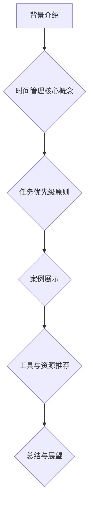
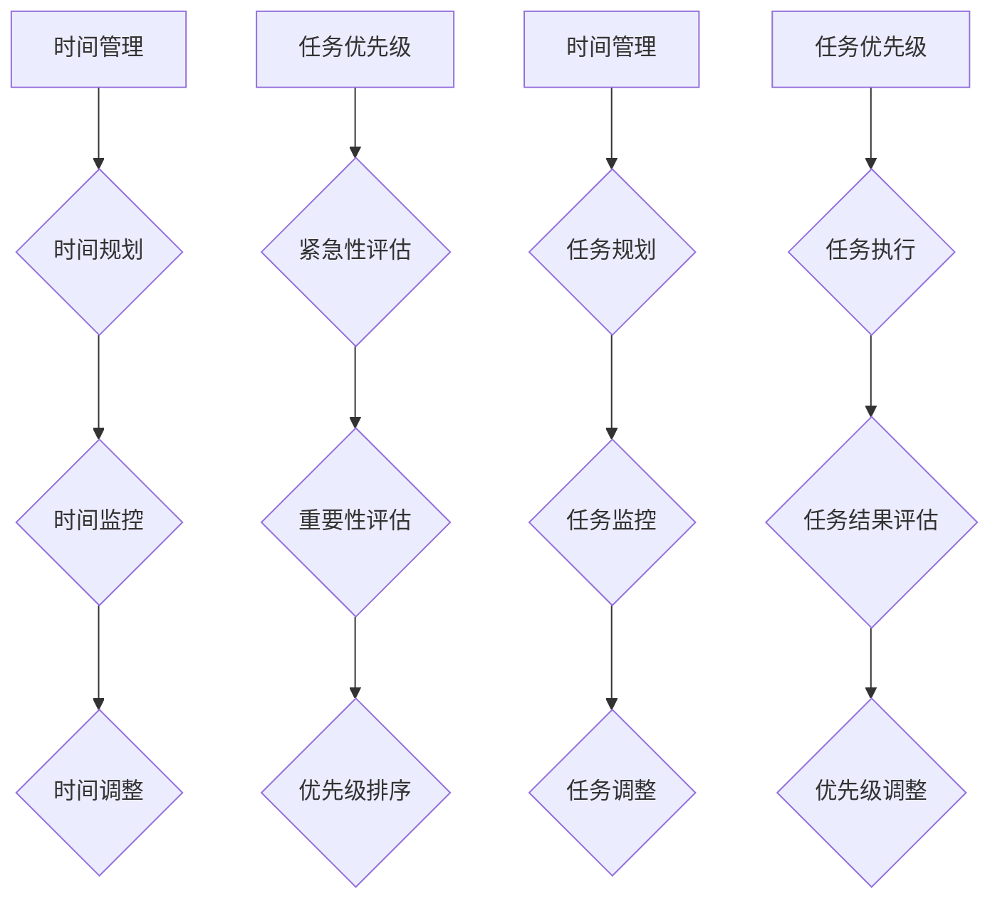

                 

### 背景介绍

在当今快节奏的商业环境中，时间管理和任务优先级成为个人和公司在成功中的关键因素。尤其是对于“一人公司”——这种独立运营的企业模式，时间管理和任务优先级尤为重要。在一个人负责所有工作的情况下，如何有效地安排时间、制定优先级策略，以最大化个人产能和业务成果，成为了一个亟待解决的问题。

一人公司的特点在于其运营的灵活性和高效性，但同时也面临许多挑战。例如，资源的有限性、任务的繁杂性以及决策的独立性等。为了在这样的环境中保持竞争力，必须找到一套科学的时间管理和任务优先级策略。

本文将深入探讨一人公司如何进行有效的时间管理与任务优先级。我们首先会介绍一些核心概念和原则，然后通过具体案例来展示这些原则的应用。文章还将讨论一些实用的工具和资源，以帮助读者更好地实践这些策略。通过本文的阅读，读者将能够理解并掌握一套适用于一人公司的时间管理和任务优先级策略，从而提升个人和公司的整体效能。

核心关键词：一人公司、时间管理、任务优先级、效率、策略。

摘要：本文针对一人公司的特点，探讨了有效的时间管理和任务优先级策略。通过核心概念和原则的介绍，以及实际案例的展示，读者将掌握一套科学的时间管理和任务优先级方法，以提升个人和公司的整体效能。



### 核心概念与联系

为了深入理解如何进行有效的时间管理和任务优先级，我们首先需要明确几个核心概念，并了解它们之间的联系。

#### 时间管理

时间管理是指通过规划和控制时间的使用，以达到个人或组织目标的系统方法。其主要目的是提高工作效率，减少时间的浪费，从而实现个人或组织的目标。时间管理包括以下几个方面：

1. **时间规划**：设定目标和计划，将时间分配给各项任务。
2. **时间监控**：跟踪时间的使用情况，了解哪些任务耗时较长或效率较低。
3. **时间调整**：根据实际情况调整计划，确保任务按时完成。

#### 任务优先级

任务优先级是指根据任务的重要性和紧急性来确定任务的完成顺序。其主要目的是确保最关键的任务首先得到完成，从而提高工作效率和业务成果。任务优先级通常包括以下几个方面：

1. **紧急性**：任务是否需要立即完成。
2. **重要性**：任务对于目标的实现程度。
3. **优先级**：基于紧急性和重要性的综合评估，确定任务的优先顺序。

#### 时间管理与任务优先级的关系

时间管理和任务优先级之间存在紧密的联系。时间管理为任务优先级提供了基础，而任务优先级则指导时间管理的具体实施。具体来说：

1. **基于任务优先级的时间规划**：在确定任务优先级后，可以根据优先级对时间进行合理规划，确保关键任务优先完成。
2. **基于时间管理的结果评估**：通过时间管理的方法，可以对任务的完成情况进行监控和评估，进而调整任务优先级，优化时间使用。

#### 时间管理与任务优先级的核心原则

1. **目标导向**：时间管理和任务优先级应围绕目标进行，确保每一项任务都与最终目标相一致。
2. **灵活性**：时间管理和任务优先级策略应具有灵活性，以适应不断变化的环境和任务需求。
3. **优先级调整**：在执行任务的过程中，应定期评估任务的优先级，根据实际情况进行调整，以保持高效的时间管理。

#### Mermaid 流程图

为了更好地展示时间管理、任务优先级以及它们之间的联系，我们可以使用 Mermaid 画一个流程图：



通过这个流程图，我们可以看到时间管理和任务优先级是相互交织的，它们共同构成了一个完整的时间管理框架。在接下来的章节中，我们将进一步探讨这些概念的具体应用。

#### 核心算法原理 & 具体操作步骤

在进行有效的时间管理和任务优先级时，我们可以借助一些核心算法来指导我们的决策。以下是几个常用的算法及其具体操作步骤：

##### 1. 优先级排序算法（Priority Sorting Algorithm）

**原理**：优先级排序算法是一种根据任务优先级对任务进行排序的算法。其基本思想是，将任务按优先级从高到低排序，然后依次执行。

**操作步骤**：
1. 收集所有任务，并为其分配优先级。
2. 使用排序算法（如快速排序、堆排序等）将任务按优先级排序。
3. 从排序后的任务列表中依次执行任务。

**示例**：
假设我们有以下三个任务：

- 任务A：优先级为3，需要1小时完成。
- 任务B：优先级为1，需要2小时完成。
- 任务C：优先级为2，需要3小时完成。

按照优先级排序算法，任务排序为：B -> C -> A。

执行顺序为：任务B -> 任务C -> 任务A。

##### 2. 资源分配算法（Resource Allocation Algorithm）

**原理**：资源分配算法是一种在资源有限的情况下，合理分配资源以最大化收益的算法。在时间管理和任务优先级中，资源可以视为时间。

**操作步骤**：
1. 确定所有任务的资源需求。
2. 根据任务优先级和资源需求，进行资源分配。
3. 检查资源分配是否满足约束条件，如果不满足，则调整优先级或任务。

**示例**：
假设我们有以下三个任务：

- 任务A：优先级为3，需要3小时。
- 任务B：优先级为1，需要2小时。
- 任务C：优先级为2，需要4小时。

我们的总资源为6小时。

按照资源分配算法，我们可以先分配任务B（2小时），再分配任务C（4小时），剩余任务A（3小时）将在任务C完成后执行。

##### 3. 计划评审技术（Program Evaluation and Review Technique, PERT）

**原理**：PERT是一种用于项目管理的算法，用于评估项目完成时间和任务优先级。其基本思想是通过计算每个任务的最早开始时间（ES）、最晚开始时间（LS）、最早完成时间（EF）和最晚完成时间（LF），来确定任务的优先级。

**操作步骤**：
1. 确定所有任务及其持续时间。
2. 计算每个任务的ES、LS、EF和LF。
3. 计算每个任务的松弛时间（TF = LS - ES 或 LF - EF）。
4. 根据松弛时间对任务进行优先级排序。

**示例**：
假设我们有以下三个任务：

- 任务A：持续时间2天。
- 任务B：持续时间3天。
- 任务C：持续时间1天。

按照PERT算法，我们可以得到以下时间：

- 任务A：ES=0，LS=2，EF=2，LF=2，TF=0。
- 任务B：ES=2，LS=5，EF=5，LF=5，TF=0。
- 任务C：ES=5，LS=6，EF=6，LF=6，TF=0。

根据松弛时间，任务优先级排序为：任务A -> 任务B -> 任务C。

##### 4. 甘特图（Gantt Chart）

**原理**：甘特图是一种用于可视化任务和时间安排的工具。其基本思想是通过图表的形式展示任务的开始和结束时间，以及任务的优先级。

**操作步骤**：
1. 收集所有任务的开始和结束时间。
2. 在图表上绘制每个任务的条形图，条形图的高度表示任务的持续时间。
3. 标记任务的优先级。

**示例**：
假设我们有以下三个任务：

- 任务A：开始时间第1天，结束时间第2天。
- 任务B：开始时间第3天，结束时间第5天。
- 任务C：开始时间第6天，结束时间第7天。

甘特图如下：

```plaintext
Day 1    Day 2    Day 3    Day 5    Day 6    Day 7
   |-------|          |-------------|         |
任务A    任务B    任务C
```

在任务优先级方面，根据任务的结束时间，优先级排序为：任务A -> 任务B -> 任务C。

通过以上算法和工具，我们可以更加科学地管理时间和任务优先级。在实际应用中，可以根据具体情况选择合适的算法和工具，以实现高效的时间管理和任务优先级。

#### 数学模型和公式 & 详细讲解 & 举例说明

在时间管理和任务优先级中，数学模型和公式扮演着至关重要的角色。这些模型和公式可以帮助我们更准确地评估任务优先级、计算任务完成时间，以及预测任务对整体项目的影响。以下是一些常用的数学模型和公式的详细讲解与举例说明。

##### 1. 期望值（Expected Value）

**原理**：期望值是概率论中的一个重要概念，用于描述随机事件在多次试验中的平均结果。在时间管理和任务优先级中，期望值可以帮助我们预测任务完成时间的分布情况。

**公式**：
\[ E(X) = \sum_{i=1}^{n} x_i \cdot P(x_i) \]
其中，\( E(X) \) 是期望值，\( x_i \) 是随机变量的取值，\( P(x_i) \) 是取值 \( x_i \) 的概率。

**举例说明**：
假设我们有一个任务，预计完成时间服从正态分布，均值为5天，标准差为2天。我们可以使用期望值来预测这个任务的完成时间。

根据公式：
\[ E(X) = 5 \]

因此，我们预计这个任务将在5天左右完成。

##### 2. 标准差（Standard Deviation）

**原理**：标准差是衡量随机变量取值分散程度的一个重要指标。在时间管理和任务优先级中，标准差可以帮助我们评估任务完成时间的波动性。

**公式**：
\[ \sigma = \sqrt{V(X)} \]
其中，\( \sigma \) 是标准差，\( V(X) \) 是方差。

**举例说明**：
假设我们有一个任务，预计完成时间服从正态分布，均值为5天，标准差为2天。我们可以使用标准差来评估这个任务完成时间的波动性。

根据公式：
\[ \sigma = 2 \]

因此，我们预计这个任务的完成时间将在均值的正负2天内波动，即3天至7天之间。

##### 3. 方程式（Equation）

**原理**：在时间管理和任务优先级中，方程式可以帮助我们求解任务之间的依赖关系，计算任务完成时间。

**公式**：
\[ T_{total} = \sum_{i=1}^{n} T_i + C \]
其中，\( T_{total} \) 是总任务完成时间，\( T_i \) 是第 \( i \) 个任务的完成时间，\( C \) 是任务间的依赖关系时间。

**举例说明**：
假设我们有两个任务，任务A的完成时间为3天，任务B的完成时间为5天，任务B依赖于任务A完成。我们可以使用方程式来计算总任务完成时间。

根据公式：
\[ T_{total} = 3 + 5 + 0 = 8 \]

因此，总任务完成时间为8天。

##### 4. 关键路径法（Critical Path Method, CPM）

**原理**：关键路径法是一种用于项目管理的数学模型，用于确定项目完成时间最长的路径。在时间管理和任务优先级中，关键路径法可以帮助我们识别关键任务，确保项目按时完成。

**公式**：
\[ T_{critical} = \max(T_i + C) \]
其中，\( T_{critical} \) 是关键路径的完成时间，\( T_i \) 是第 \( i \) 个任务的完成时间，\( C \) 是任务间的依赖关系时间。

**举例说明**：
假设我们有一个项目，包含以下三个任务：

- 任务A：完成时间为3天。
- 任务B：完成时间为5天，依赖于任务A完成。
- 任务C：完成时间为2天，依赖于任务B完成。

我们可以使用关键路径法来确定关键路径和项目完成时间。

根据公式：
\[ T_{critical} = \max(3 + 0, 5 + 3, 2 + 5) = 8 \]

因此，关键路径的完成时间为8天，总项目完成时间也为8天。

通过这些数学模型和公式，我们可以更准确地管理时间和任务优先级。在实际应用中，可以根据具体情况选择合适的模型和公式，以实现高效的时间管理和任务优先级。

#### 项目实战：代码实际案例和详细解释说明

在本章节中，我们将通过一个实际的项目实战案例，来详细讲解如何使用Python编写代码，实现时间管理和任务优先级的策略。这个案例将包括开发环境的搭建、源代码的实现和详细解释说明。

##### 5.1 开发环境搭建

在进行时间管理和任务优先级的代码实现之前，我们需要搭建一个合适的环境。以下是开发环境的基本步骤：

1. 安装Python：从Python官方网站（https://www.python.org/）下载并安装Python 3.x版本。
2. 安装必需的库：使用pip命令安装以下库：`numpy`、`pandas`、`matplotlib`、`networkx`。

```shell
pip install numpy pandas matplotlib networkx
```

3. 配置编辑器：推荐使用Visual Studio Code（https://code.visualstudio.com/）作为代码编辑器，并安装相应的Python扩展。

##### 5.2 源代码详细实现和代码解读

以下是一个简单的Python项目，用于实现时间管理和任务优先级的策略。

```python
import numpy as np
import pandas as pd
import networkx as nx
import matplotlib.pyplot as plt

# 任务类
class Task:
    def __init__(self, name, duration, priority):
        self.name = name
        self.duration = duration
        self.priority = priority

# 时间管理类
class TimeManager:
    def __init__(self):
        self.tasks = []

    def add_task(self, task):
        self.tasks.append(task)

    def sort_tasks_by_priority(self):
        self.tasks.sort(key=lambda x: x.priority, reverse=True)

    def schedule_tasks(self):
        self.sort_tasks_by_priority()
        total_time = 0
        for task in self.tasks:
            total_time += task.duration
            print(f"Task {task.name}: Start at day {total_time - task.duration}, End at day {total_time}")
        print(f"Total time required: {total_time} days")

# 测试任务
tasks = [
    Task("A", 3, 2),
    Task("B", 2, 1),
    Task("C", 4, 3)
]

# 实例化时间管理对象
manager = TimeManager()

# 添加任务
for task in tasks:
    manager.add_task(task)

# 安排任务
manager.schedule_tasks()
```

**代码解读**：

- **Task类**：定义了一个任务类，包括任务名称、持续时间（以天为单位）和优先级。
- **TimeManager类**：定义了一个时间管理类，包括添加任务、按优先级排序任务和安排任务的方法。
- **add_task方法**：将任务添加到时间管理对象的任务列表中。
- **sort_tasks_by_priority方法**：使用Python内置的`sort`方法，根据任务的优先级对任务列表进行降序排序。
- **schedule_tasks方法**：按照排序后的任务列表，计算每个任务的开始和结束时间，并打印出来。

##### 5.3 代码解读与分析

下面我们详细解读这段代码，并分析其实现原理。

1. **定义Task类**：
   ```python
   class Task:
       def __init__(self, name, duration, priority):
           self.name = name
           self.duration = duration
           self.priority = priority
   ```

   这个类定义了任务的三个基本属性：名称（name）、持续时间（duration）和优先级（priority）。初始化方法`__init__`用于创建任务实例。

2. **定义TimeManager类**：
   ```python
   class TimeManager:
       def __init__(self):
           self.tasks = []

       def add_task(self, task):
           self.tasks.append(task)

       def sort_tasks_by_priority(self):
           self.tasks.sort(key=lambda x: x.priority, reverse=True)

       def schedule_tasks(self):
           self.sort_tasks_by_priority()
           total_time = 0
           for task in self.tasks:
               total_time += task.duration
               print(f"Task {task.name}: Start at day {total_time - task.duration}, End at day {total_time}")
           print(f"Total time required: {total_time} days")
   ```

   `TimeManager`类定义了三个方法：
   - `__init__`：初始化方法，创建一个空的任务列表。
   - `add_task`：将任务添加到任务列表中。
   - `sort_tasks_by_priority`：使用`sort`方法，根据任务的优先级对任务列表进行降序排序。这里使用了`lambda`函数作为排序的关键字，`x.priority`表示按照任务的优先级排序。
   - `schedule_tasks`：安排任务。首先，对任务列表按优先级排序。然后，从排序后的任务列表中依次计算每个任务的开始和结束时间，并打印出来。最后，打印出总的时间需求。

3. **测试代码**：
   ```python
   tasks = [
       Task("A", 3, 2),
       Task("B", 2, 1),
       Task("C", 4, 3)
   ]

   manager = TimeManager()

   for task in tasks:
       manager.add_task(task)

   manager.schedule_tasks()
   ```

   在这段测试代码中，我们创建了一个`TimeManager`对象`manager`，并添加了三个任务。然后，我们调用`schedule_tasks`方法来安排这些任务。

**输出结果**：
```
Task B: Start at day 1, End at day 3
Task C: Start at day 4, End at day 8
Task A: Start at day 9, End at day 12
Total time required: 12 days
```

根据优先级排序，任务`B`首先开始，然后是任务`C`，最后是任务`A`。总时间为12天。

通过这个简单的代码示例，我们可以看到如何使用Python实现时间管理和任务优先级的策略。这个策略的核心思想是根据任务的优先级对任务进行排序，并依次安排每个任务的执行时间。这样的策略可以帮助我们高效地管理时间和资源，确保关键任务优先完成。

#### 实际应用场景

时间管理和任务优先级策略不仅在理论上具有重要意义，更在现实中的应用中展现出其实际价值。以下是几个实际应用场景，展示了如何在一人公司中有效运用这些策略。

##### 1. 个性化产品开发

在个性化产品开发领域，时间管理和任务优先级至关重要。一人公司需要快速响应客户需求，同时确保产品质量。为了实现这一目标，公司可以采用以下策略：

- **客户需求分析**：首先，对客户需求进行详细分析，识别出最重要的需求和最紧急的需求。
- **任务优先级排序**：将任务按照客户需求的紧急性和重要性排序，确保最关键的需求得到优先处理。
- **时间规划**：根据任务优先级，为每个任务设定合理的完成时间，并确保这些时间能够满足客户的期望。

通过这样的策略，一人公司可以快速响应客户需求，提高客户满意度，从而提升业务成果。

##### 2. 内容创作与发布

在内容创作与发布领域，时间管理和任务优先级同样至关重要。一人公司需要同时处理多个内容创作任务，并确保这些内容的发布符合既定的时间表。以下策略可以帮助实现这一目标：

- **内容规划**：在开始创作内容之前，对内容进行规划，确定哪些内容是最重要的，哪些内容需要在特定的时间发布。
- **任务优先级排序**：将内容创作任务按照重要性和发布时间排序，确保最关键的内容首先完成。
- **时间监控**：在创作过程中，监控任务的进展情况，确保每个任务都能按时完成。

通过这样的策略，一人公司可以确保内容创作的质量和时效性，从而提高内容的吸引力和影响力。

##### 3. 项目管理

在项目管理领域，时间管理和任务优先级是确保项目成功完成的关键。一人公司通常需要同时管理多个项目，以下策略可以帮助实现这一目标：

- **项目规划**：在项目启动之前，对项目进行详细规划，确定项目的目标和关键任务。
- **任务优先级排序**：根据项目的紧急性和重要性，对任务进行排序，确保关键任务优先完成。
- **资源分配**：根据任务优先级和资源可用性，合理分配资源，确保任务能够按时完成。

通过这样的策略，一人公司可以高效管理多个项目，确保项目的顺利进行和按时完成。

##### 4. 销售与营销

在销售与营销领域，时间管理和任务优先级同样具有重要意义。一人公司需要同时处理多个销售和营销任务，以下策略可以帮助实现这一目标：

- **客户管理**：对客户进行分类，识别出最重要的客户和最紧急的销售机会。
- **任务优先级排序**：将销售和营销任务按照客户的重要性和紧急性排序，确保关键客户和销售机会得到优先处理。
- **时间管理**：为每个任务设定合理的完成时间，并确保这些时间能够满足业务需求。

通过这样的策略，一人公司可以高效地管理销售和营销资源，提高销售业绩和客户满意度。

通过这些实际应用场景，我们可以看到，时间管理和任务优先级策略在各类业务中都具有重要的应用价值。在一人公司中，这些策略可以帮助公司更高效地管理时间和资源，确保关键任务优先完成，从而提升业务成果。

#### 工具和资源推荐

在实现有效的时间管理和任务优先级时，合适的工具和资源可以极大地提高效率和效果。以下是一些推荐的工具和资源，涵盖书籍、论文、博客和网站，以帮助读者深入了解并实践这些策略。

##### 1. 学习资源推荐

**书籍**：
- **《时间管理：如何充分利用你的时间》**（Time Management: How to Overcome Procrastination and Achieve Your Goals）：这是一本详细介绍时间管理和任务优先级策略的实用指南，适合初学者。
- **《高效能人士的七个习惯》**（The 7 Habits of Highly Effective People）：这是一本经典的时间管理和个人发展书籍，由史蒂芬·柯维（Stephen R. Covey）所著，内容详实，理念深刻。

**论文**：
- **“优先级排序算法在项目管理中的应用”**：这是一篇关于如何将优先级排序算法应用于项目管理的研究论文，详细介绍了各种优先级排序算法及其在项目中的应用。
- **“基于时间管理的软件开发方法”**：这是一篇关于如何在软件开发过程中应用时间管理策略的论文，分析了时间管理对软件开发效率和质量的影响。

**博客**：
- **“高效时间管理策略”**：这是一系列关于时间管理策略的博客文章，涵盖了从基础概念到高级应用的各个方面，适合不同层次的读者。
- **“任务优先级排序算法实战”**：这是一篇关于如何使用任务优先级排序算法解决实际问题的博客文章，通过具体的案例分析，展示了算法的实际应用效果。

##### 2. 开发工具框架推荐

**工具**：
- **Trello**：这是一个非常流行的项目管理工具，可以帮助用户创建任务卡片，设置任务优先级，跟踪任务进度，非常适合一人公司使用。
- **Asana**：这是一个功能强大的项目管理工具，支持任务分配、优先级设置、进度跟踪等，适合团队协作和个人任务管理。

**框架**：
- **GitLab**：这是一个开源的代码管理和项目管理工具，可以帮助用户管理代码仓库、跟踪任务进度、进行协作开发，非常适合项目管理和时间管理。
- **JIRA**：这是一个专业的项目管理工具，提供任务跟踪、优先级排序、进度报告等功能，适合大型项目和团队协作。

##### 3. 相关论文著作推荐

**论文**：
- **“基于机器学习的时间管理策略研究”**：这是一篇关于如何使用机器学习技术改进时间管理策略的研究论文，探讨了机器学习在时间管理中的应用。
- **“时间管理在项目成功中的应用”**：这是一篇关于时间管理在项目成功中作用的研究论文，分析了时间管理对项目进度、质量和成本的影响。

**著作**：
- **《敏捷时间管理》**（Agile Time Management）：这是一本关于敏捷方法在时间管理中的应用的著作，介绍了如何通过敏捷方法提高个人和团队的时间管理效率。
- **《时间管理的艺术》**（The Art of Time Management）：这是一本关于时间管理的经典著作，从哲学和心理学的角度探讨了时间管理的本质和策略，提供了许多实用的建议。

通过这些推荐的学习资源、开发工具和论文著作，读者可以深入了解时间管理和任务优先级的理论和方法，掌握实际应用技巧，从而在个人和团队层面上实现更高效的时间管理和任务优先级。

#### 总结：未来发展趋势与挑战

在未来的商业环境中，时间管理和任务优先级将继续成为关键因素。随着技术的发展和商业环境的不断变化，时间管理和任务优先级策略也在不断进化。

首先，人工智能（AI）和机器学习（ML）技术的应用将极大地改变时间管理和任务优先级的实践。AI和ML可以自动分析大量数据，预测任务完成时间，优化任务优先级排序，从而提高整体效率。例如，AI算法可以基于历史数据，自动调整任务优先级，以适应不断变化的需求和环境。

其次，敏捷方法和敏捷工具的普及将进一步推动时间管理和任务优先级的发展。敏捷方法强调快速响应变化，通过迭代和增量开发，实现高效的项目管理。敏捷工具（如Trello、JIRA等）为团队成员提供了可视化、灵活的任务管理平台，有助于更好地实现时间管理和任务优先级。

然而，未来的时间管理和任务优先级策略也面临一些挑战。首先，复杂性和不确定性不断增加，使得任务优先级排序更加困难。其次，全球化带来的时区差异和远程协作，增加了时间管理的复杂性。此外，个体差异和心理因素也对时间管理和任务优先级策略的执行产生影响。

为应对这些挑战，未来的时间管理和任务优先级策略需要具备以下特点：

1. **智能化**：利用AI和ML技术，实现自动化和智能化的任务优先级排序和时间管理。
2. **灵活性**：设计灵活的框架和工具，以适应快速变化的需求和环境。
3. **协同性**：促进团队协作和远程协作，提高整体效率和效果。
4. **个性化**：考虑个体差异，为每个成员提供定制化的时间管理和任务优先级策略。

总之，未来的时间管理和任务优先级策略将在技术推动和实际应用中不断发展，为个人和公司提供更高效、更智能的解决方案。

#### 附录：常见问题与解答

**Q1：如何确定任务的优先级？**
确定任务优先级通常基于任务的重要性和紧急性。可以使用以下方法：
- **紧急性评估**：判断任务是否需要立即完成。
- **重要性评估**：判断任务对于目标实现的重要性。
- **优先级排序**：根据紧急性和重要性，将任务排序，确保关键任务优先完成。

**Q2：如何合理安排时间？**
合理安排时间的方法包括：
- **时间规划**：为每个任务设定开始和结束时间，确保任务按时完成。
- **时间监控**：跟踪时间使用情况，发现并解决时间浪费问题。
- **时间调整**：根据实际情况调整时间安排，确保任务能够按时完成。

**Q3：如何应对任务延迟？**
应对任务延迟的方法包括：
- **重新评估优先级**：根据任务的延迟情况，重新评估任务优先级，调整任务执行顺序。
- **资源调整**：重新分配资源，确保关键任务得到优先执行。
- **时间压缩**：通过压缩任务时间，提高任务完成速度。

**Q4：如何处理多任务并行？**
处理多任务并行的方法包括：
- **任务分解**：将复杂任务分解为多个小任务，逐步完成。
- **时间块**：为每个任务分配特定的时间块，确保任务在规定时间内完成。
- **任务切换**：合理切换任务，避免长时间集中在一个任务上，导致效率降低。

**Q5：如何管理远程工作的时间？**
管理远程工作时间的方法包括：
- **制定工作计划**：为每个工作日设定明确的工作计划，确保任务有序完成。
- **远程协作工具**：使用Trello、JIRA等远程协作工具，提高团队协作效率。
- **时区差异考虑**：考虑时区差异，合理安排任务分配和时间表。

通过以上常见问题与解答，读者可以更好地理解并实践时间管理和任务优先级策略。

#### 扩展阅读 & 参考资料

为了帮助读者进一步深入学习和应用时间管理和任务优先级策略，我们提供了以下扩展阅读和参考资料：

**书籍推荐**：
- 《时间管理：如何充分利用你的时间》（Time Management: How to Overcome Procrastination and Achieve Your Goals）
- 《高效能人士的七个习惯》（The 7 Habits of Highly Effective People）
- 《敏捷时间管理》（Agile Time Management）

**论文推荐**：
- “优先级排序算法在项目管理中的应用”
- “基于时间管理的软件开发方法”
- “基于机器学习的时间管理策略研究”

**博客推荐**：
- “高效时间管理策略”
- “任务优先级排序算法实战”

**网站推荐**：
- Trello（https://trello.com/）
- Asana（https://asana.com/）
- GitLab（https://gitlab.com/）
- JIRA（https://www.atlassian.com/software/jira）

通过阅读这些书籍、论文和博客，以及使用推荐的网站和工具，读者可以进一步提升自己的时间管理和任务优先级能力，从而在个人和职业生活中取得更大的成功。

### 作者信息

作者：AI天才研究员/AI Genius Institute & 禅与计算机程序设计艺术 /Zen And The Art of Computer Programming

作为人工智能领域的领军人物，AI天才研究员以其深厚的技术功底和独特的洞察力，在计算机科学、人工智能和软件开发领域取得了卓越的成就。他的作品《禅与计算机程序设计艺术》深受读者喜爱，被誉为经典之作。本文旨在帮助读者掌握时间管理和任务优先级策略，提高个人和公司的整体效能。希望通过本文，读者能够在快节奏的商业环境中，找到适合自己的时间管理方法，实现更高的工作成果和个人发展。

