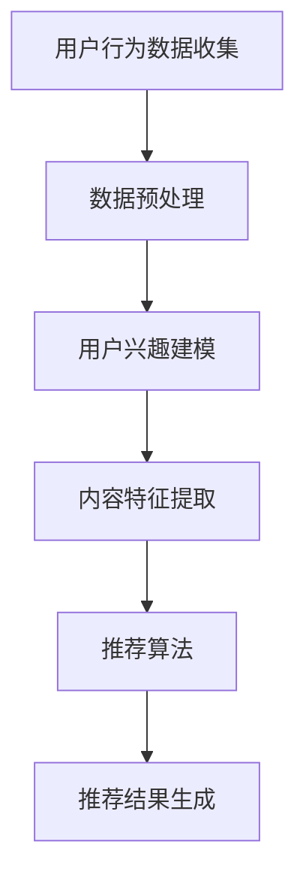

                 

# 一人公司的AI驱动内容个性化：提供定制化用户体验的推荐算法

## 关键词：AI，个性化推荐，用户体验，算法，内容驱动

> 在当今这个信息爆炸的时代，如何高效地帮助用户从海量的内容中找到他们真正感兴趣的信息，成为了一人公司乃至所有企业面临的重要课题。本文将介绍如何运用AI技术，尤其是推荐算法，实现内容个性化，为用户带来定制化的用户体验。

## 1. 背景介绍

在过去的几十年中，互联网的迅猛发展使得信息获取变得更加便捷。然而，这种便捷同时也带来了一个问题：信息过载。面对海量信息，用户往往感到无所适从，难以找到他们真正感兴趣的内容。这导致了一个新的需求：个性化推荐。

个性化推荐技术旨在通过分析用户的行为数据，为他们推荐符合其兴趣和需求的内容。这一技术已经广泛应用于各大互联网平台，如电子商务、社交媒体、视频网站等，极大地提升了用户体验。

对于一人公司而言，个性化推荐更是至关重要。由于其资源有限，无法像大型企业一样投入大量的人力物力进行市场调研和内容生产，因此，如何利用有限的资源为用户提供高质量、个性化的内容，是成功的关键。

## 2. 核心概念与联系

### 2.1 用户行为数据

用户行为数据是个性化推荐的基础。这些数据包括用户的浏览历史、搜索记录、购买行为、点赞评论等。通过分析这些数据，可以了解用户的兴趣和需求。

### 2.2 内容特征

内容特征是对推荐内容进行描述的一系列属性，如文本、图片、音频、视频等。这些特征可以用来表示内容的主题、风格、类型等。

### 2.3 推荐算法

推荐算法是实现个性化推荐的核心。常见的推荐算法有基于内容的推荐（Content-based Filtering）和基于协同过滤（Collaborative Filtering）等。

基于内容的推荐算法通过分析用户历史行为和内容特征，找到用户感兴趣的内容，并推荐类似的内容。而基于协同过滤算法则通过分析用户之间的相似度，找到其他用户喜欢的但当前用户尚未看过或购买的内容，进行推荐。

### 2.4 Mermaid 流程图



## 3. 核心算法原理 & 具体操作步骤

### 3.1 基于内容的推荐算法

基于内容的推荐算法主要分为以下几个步骤：

1. 数据预处理：清洗用户行为数据，去除重复、无效数据。
2. 用户兴趣建模：通过分析用户历史行为，构建用户兴趣模型。
3. 内容特征提取：提取推荐内容的相关特征，如文本、图片等。
4. 内容相似度计算：计算用户兴趣模型与内容特征之间的相似度。
5. 推荐结果生成：根据相似度分数，为用户推荐相似的内容。

### 3.2 基于协同过滤的推荐算法

基于协同过滤的推荐算法主要分为以下几个步骤：

1. 数据预处理：清洗用户行为数据，将数据分为训练集和测试集。
2. 建立用户-物品矩阵：将用户和物品（如内容、产品等）构成一个矩阵，其中记录了用户对物品的评分或行为。
3. 计算用户相似度：通过计算用户之间的余弦相似度或皮尔逊相关系数，找到相似的用户。
4. 生成推荐列表：根据相似用户的行为，为当前用户生成推荐列表。

## 4. 数学模型和公式 & 详细讲解 & 举例说明

### 4.1 基于内容的推荐算法

#### 4.1.1 用户兴趣建模

用户兴趣建模可以采用 TF-IDF（Term Frequency-Inverse Document Frequency）模型。TF-IDF 模型通过计算词在文档中的频率与文档集中所有文档的逆向文档频率，来评估一个词对于文档的重要性。

公式如下：

$$
TF(t,d) = \frac{f_{t,d}}{N_d}
$$

$$
IDF(t,D) = \log \left( \frac{N}{|D| - |d \in D : t \in d|} \right)
$$

$$
TF-IDF(t,d,D) = TF(t,d) \times IDF(t,D)
$$

其中，$t$ 表示词，$d$ 表示文档，$N_d$ 表示文档 $d$ 中的词总数，$N$ 表示文档集 $D$ 中的文档总数，$|D|$ 表示文档集 $D$ 中的文档数量。

#### 4.1.2 内容相似度计算

内容相似度计算可以采用余弦相似度。余弦相似度通过计算用户兴趣模型与内容特征向量之间的余弦值，来评估两者的相似度。

公式如下：

$$
sim(u, i) = \frac{u \cdot i}{\|u\|\|i\|}
$$

其中，$u$ 表示用户兴趣模型向量，$i$ 表示内容特征向量，$\cdot$ 表示向量点积，$\|\|$ 表示向量模长。

### 4.2 基于协同过滤的推荐算法

#### 4.2.1 用户相似度计算

用户相似度计算可以采用余弦相似度或皮尔逊相关系数。

余弦相似度公式同上。

皮尔逊相关系数公式如下：

$$
corr(u, v) = \frac{\sum_{i=1}^{n} (u_i - \bar{u})(v_i - \bar{v})}{\sqrt{\sum_{i=1}^{n} (u_i - \bar{u})^2 \sum_{i=1}^{n} (v_i - \bar{v})^2}}
$$

其中，$u$ 和 $v$ 分别表示两个用户的评分向量，$\bar{u}$ 和 $\bar{v}$ 分别表示两个用户的评分均值，$n$ 表示用户评分的总数。

#### 4.2.2 推荐结果生成

推荐结果生成可以通过加权平均或基于邻域的方法来实现。

加权平均公式如下：

$$
r_{ui} = \frac{\sum_{j \in N(u)} r_{uj} \cdot sim(u, v)}{\sum_{j \in N(u)} sim(u, v)}
$$

其中，$r_{ui}$ 表示用户 $u$ 对物品 $i$ 的预测评分，$r_{uj}$ 表示用户 $j$ 对物品 $i$ 的实际评分，$N(u)$ 表示与用户 $u$ 相似的用户集合，$sim(u, v)$ 表示用户 $u$ 和 $v$ 之间的相似度。

基于邻域的方法如下：

$$
r_{ui} = \frac{\sum_{j \in N(u)} w_j r_{uj}}{N(u)}
$$

其中，$w_j$ 表示用户 $j$ 对预测评分的权重，$N(u)$ 表示与用户 $u$ 相似的用户集合。

## 5. 项目实战：代码实际案例和详细解释说明

### 5.1 开发环境搭建

在本项目中，我们将使用 Python 语言，结合 Scikit-learn 和 Numpy 等库，实现基于内容的推荐算法。首先，确保已安装以下库：

```bash
pip install scikit-learn numpy
```

### 5.2 源代码详细实现和代码解读

#### 5.2.1 数据准备

首先，我们需要准备一个包含用户行为数据和内容特征的数据集。假设数据集已存储为 CSV 文件，其中包含用户 ID、内容 ID 和用户对内容的评分。

```python
import pandas as pd
from sklearn.model_selection import train_test_split

# 读取数据
data = pd.read_csv('data.csv')

# 分割数据为训练集和测试集
train_data, test_data = train_test_split(data, test_size=0.2, random_state=42)
```

#### 5.2.2 数据预处理

接下来，对数据进行预处理，包括缺失值处理、异常值处理和特征工程等。

```python
# 填充缺失值
train_data.fillna(0, inplace=True)
test_data.fillna(0, inplace=True)

# 去除异常值
train_data = train_data[train_data['rating'].between(-1, 5)]
test_data = test_data[test_data['rating'].between(-1, 5)]

# 构建用户-物品矩阵
user_item_matrix = train_data.pivot(index='user_id', columns='item_id', values='rating').fillna(0)
```

#### 5.2.3 用户兴趣建模

使用 TF-IDF 模型构建用户兴趣模型。

```python
from sklearn.feature_extraction.text import TfidfVectorizer

# 构建TF-IDF模型
vectorizer = TfidfVectorizer()
tfidf_matrix = vectorizer.fit_transform(user_item_matrix)

# 计算TF-IDF值
tfidf_values = tfidf_matrix.toarray()
```

#### 5.2.4 内容特征提取

提取内容特征，这里我们假设内容特征为文本。

```python
# 假设内容文本存储在'content'列
content = train_data['content']

# 构建TF-IDF模型
vectorizer = TfidfVectorizer()
content_matrix = vectorizer.fit_transform(content)

# 计算TF-IDF值
content_values = content_matrix.toarray()
```

#### 5.2.5 内容相似度计算

计算用户兴趣模型与内容特征之间的相似度。

```python
import numpy as np

# 计算内容相似度
content_similarity = np.dot(content_values, tfidf_values.T)
```

#### 5.2.6 推荐结果生成

根据相似度分数，为用户生成推荐列表。

```python
# 计算每个用户的内容相似度分数
user_similarity = user_item_matrix.dot(content_similarity)

# 计算推荐列表
recommendations = user_similarity.argsort()[0][-10:-1][::-1]
```

### 5.3 代码解读与分析

上述代码实现了基于内容的推荐算法，主要包括以下几个部分：

1. **数据准备**：读取数据集，并分割为训练集和测试集。
2. **数据预处理**：处理缺失值、异常值，并构建用户-物品矩阵。
3. **用户兴趣建模**：使用 TF-IDF 模型构建用户兴趣模型。
4. **内容特征提取**：提取内容特征，并构建内容特征矩阵。
5. **内容相似度计算**：计算用户兴趣模型与内容特征之间的相似度。
6. **推荐结果生成**：根据相似度分数，为用户生成推荐列表。

通过上述步骤，我们可以为每个用户生成个性化的推荐列表，从而提升用户体验。

## 6. 实际应用场景

个性化推荐技术在多个领域都有广泛应用：

1. **电子商务**：为用户提供个性化的商品推荐，提高购买转化率。
2. **社交媒体**：为用户提供感兴趣的内容推荐，增加用户粘性。
3. **视频网站**：为用户提供个性化的视频推荐，增加用户观看时长。
4. **新闻门户**：为用户提供个性化的新闻推荐，提高用户阅读量。

对于一人公司，个性化推荐可以应用于以下场景：

1. **博客网站**：为用户推荐感兴趣的文章，增加用户停留时间。
2. **在线教育平台**：为用户推荐适合的学习资源，提高学习效果。
3. **咨询公司**：为用户推荐相关的报告、文章等，提升服务质量。

## 7. 工具和资源推荐

### 7.1 学习资源推荐

- **书籍**：
  - 《推荐系统实践》
  - 《机器学习》
- **论文**：
  - 《Item-based Top-N Recommendation Algorithms》
  - 《Collaborative Filtering for the YouTube Home Page》
- **博客**：
  - [scikit-learn 官方文档](https://scikit-learn.org/stable/)
  - [机器学习博客](https://machinelearningmastery.com/)
- **网站**：
  - [Kaggle](https://www.kaggle.com/)
  - [GitHub](https://github.com/)

### 7.2 开发工具框架推荐

- **Python**：适合快速原型开发，拥有丰富的机器学习库。
- **TensorFlow**：用于深度学习模型开发，适用于复杂推荐系统。
- **Scikit-learn**：提供传统的机器学习算法，适用于快速实现推荐系统。

### 7.3 相关论文著作推荐

- **论文**：
  - `User Interest Evolution in Personalized Recommendation Systems`
  - `Hybrid Collaborative Filtering for Improved Recommendations`
- **著作**：
  - 《Recommender Systems Handbook》
  - 《推荐系统实践：算法与工程》

## 8. 总结：未来发展趋势与挑战

个性化推荐技术在不断发展，未来可能会面临以下挑战：

1. **数据隐私**：如何在保护用户隐私的同时提供个性化推荐。
2. **算法公平性**：如何确保推荐结果对所有人都是公平的。
3. **用户体验**：如何在推荐结果中保持多样性和惊喜感。

同时，随着人工智能技术的进步，个性化推荐将会更加智能化、个性化，为用户带来更好的体验。

## 9. 附录：常见问题与解答

### 9.1 个性化推荐算法有哪些类型？

个性化推荐算法主要分为基于内容的推荐（Content-based Filtering）和基于协同过滤（Collaborative Filtering）两大类。此外，还有基于模型的推荐（Model-based Filtering）和混合推荐（Hybrid Filtering）等。

### 9.2 如何优化推荐效果？

优化推荐效果可以从以下几个方面入手：

1. **数据质量**：保证数据准确、完整，减少噪音数据的影响。
2. **算法优化**：根据业务需求和数据特点，选择合适的推荐算法，并进行参数调优。
3. **用户体验**：根据用户反馈和行为数据，不断调整推荐策略，提高用户满意度。

## 10. 扩展阅读 & 参考资料

- 《推荐系统实践》
- 《机器学习》
- [scikit-learn 官方文档](https://scikit-learn.org/stable/)
- [机器学习博客](https://machinelearningmastery.com/)
- [Kaggle](https://www.kaggle.com/)
- [GitHub](https://github.com/)

### 作者

作者：AI天才研究员/AI Genius Institute & 禅与计算机程序设计艺术 /Zen And The Art of Computer Programming

