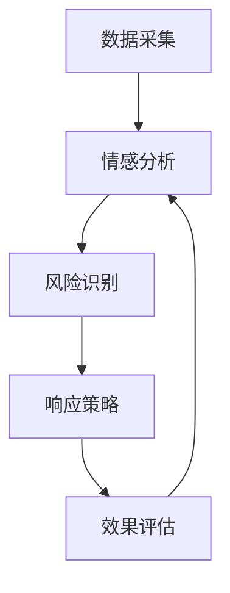

                 

### 背景介绍

随着人工智能技术的迅猛发展，品牌声誉管理也迎来了全新的变革。传统的品牌声誉管理依赖于人工监控和手动干预，这不仅耗时耗力，而且容易出现漏检和误判。为了应对这一挑战，AI驱动的品牌声誉管理工具逐渐成为行业热点。这类工具能够通过实时监控和分析网络数据，自动识别和应对品牌声誉风险，从而提高品牌管理的效率和效果。

本文将深入探讨一人公司的AI驱动品牌声誉管理实践。我们将从背景介绍入手，解释AI驱动品牌声誉管理的必要性，并详细描述AI驱动品牌声誉管理工具的功能和优势。此外，还将分析当前市场上的主流AI驱动的品牌声誉管理工具，以及它们在实时监控和维护品牌形象方面的应用。

### 2. 核心概念与联系

#### AI驱动的品牌声誉管理

AI驱动的品牌声誉管理是指利用人工智能技术对品牌声誉进行实时监控、分析和维护的过程。这个过程通常包括以下几个核心概念：

1. **数据采集**：通过爬虫、API接口、社交媒体等渠道，实时收集与品牌相关的网络数据。
2. **情感分析**：使用自然语言处理（NLP）技术，对采集到的文本数据进行分析，判断用户情绪和观点。
3. **风险识别**：基于情感分析和行为模式，识别潜在的声誉风险。
4. **响应策略**：根据识别出的风险，自动生成响应策略，进行风险缓解或危机管理。
5. **效果评估**：通过持续监控和反馈，评估响应策略的有效性，并不断优化。

#### Mermaid流程图

以下是AI驱动的品牌声誉管理流程的Mermaid流程图：



在这个流程中，数据采集是起点，通过不断循环的情感分析和风险识别，最终形成响应策略，并通过效果评估不断优化。

### 3. 核心算法原理 & 具体操作步骤

#### 情感分析

情感分析是AI驱动的品牌声誉管理的核心，它通过分析文本数据，判断用户对品牌的情感倾向。具体步骤如下：

1. **预处理**：清洗文本数据，去除无关信息，如HTML标签、停用词等。
2. **词向量表示**：将文本数据转换为词向量，常用的方法有Word2Vec、GloVe等。
3. **情感分类**：使用预训练的神经网络模型（如BERT、GPT等），对词向量进行分类，判断情感倾向。

#### 风险识别

风险识别是基于情感分析的结果，通过行为模式识别和规则匹配，识别潜在的声誉风险。具体步骤如下：

1. **行为模式识别**：使用机器学习算法，分析用户行为数据，识别出与声誉风险相关的行为模式。
2. **规则匹配**：根据行为模式，定义一系列规则，用于匹配和识别声誉风险。

#### 响应策略

响应策略是根据识别出的声誉风险，自动生成的应对措施。具体步骤如下：

1. **策略生成**：根据风险类型和严重程度，生成相应的响应策略，如发布澄清声明、开展公关活动等。
2. **策略评估**：对生成的响应策略进行评估，确保其有效性和可行性。

#### 效果评估

效果评估是对响应策略执行效果的评估，通过持续监控和反馈，优化响应策略。具体步骤如下：

1. **监控反馈**：持续监控品牌声誉数据，收集用户反馈。
2. **效果分析**：分析监控数据，评估响应策略的效果。
3. **策略优化**：根据效果分析结果，优化响应策略。

### 4. 数学模型和公式 & 详细讲解 & 举例说明

#### 情感分类模型

情感分类模型是情感分析的核心，常用的模型有SVM、CNN、LSTM等。以下是一个简单的SVM情感分类模型的公式：

$$
f(x) = \text{sign}(\omega \cdot x + b)
$$

其中，$x$ 是输入文本的词向量表示，$\omega$ 是权重向量，$b$ 是偏置。

#### 行为模式识别模型

行为模式识别模型用于分析用户行为数据，识别出与声誉风险相关的行为模式。常用的模型有决策树、随机森林等。以下是一个简单的决策树模型公式：

$$
f(x) = \text{分类}(\text{if } x \in S_1 \text{ then } C_1, \text{ else if } x \in S_2 \text{ then } C_2, \ldots)
$$

其中，$x$ 是输入的用户行为数据，$S_1, S_2, \ldots$ 是行为特征的划分集合，$C_1, C_2, \ldots$ 是对应的分类结果。

#### 响应策略评估模型

响应策略评估模型用于评估响应策略的有效性。常用的模型有A/B测试、回归分析等。以下是一个简单的回归分析模型公式：

$$
y = \beta_0 + \beta_1 x_1 + \beta_2 x_2 + \ldots
$$

其中，$y$ 是响应策略的评估结果，$x_1, x_2, \ldots$ 是评估指标，$\beta_0, \beta_1, \beta_2, \ldots$ 是模型参数。

#### 举例说明

假设我们有一个品牌声誉管理的项目，需要对用户的评论进行情感分类，并识别出潜在的声誉风险。我们使用SVM模型进行情感分类，决策树模型进行行为模式识别，回归分析模型进行响应策略评估。

1. **情感分类**：

   假设我们有一个训练好的SVM模型，输入一个用户评论，模型输出情感倾向为正面。

   $$  
   f(x) = \text{sign}(\omega \cdot x + b) = +1
   $$

2. **行为模式识别**：

   假设我们有一个训练好的决策树模型，输入一个用户行为数据，模型输出行为模式为购买行为。

   $$  
   f(x) = \text{分类}(\text{if } x \in S_1 \text{ then } C_1, \text{ else if } x \in S_2 \text{ then } C_2) = \text{购买行为}
   $$

3. **响应策略评估**：

   假设我们有一个训练好的回归分析模型，输入一系列评估指标，模型输出响应策略的评估结果为0.8。

   $$  
   y = \beta_0 + \beta_1 x_1 + \beta_2 x_2 + \ldots = 0.8
   $$

根据以上结果，我们可以生成一个响应策略，并对策略进行评估。

### 5. 项目实战：代码实际案例和详细解释说明

#### 5.1 开发环境搭建

在进行项目实战之前，我们需要搭建一个合适的开发环境。以下是搭建环境的步骤：

1. **安装Python**：确保Python版本为3.6及以上。
2. **安装依赖库**：安装用于数据采集、情感分析、风险识别和效果评估的相关依赖库，如Scikit-learn、TensorFlow、Keras等。
3. **配置数据库**：配置用于存储品牌声誉数据和用户评论的数据库，如MySQL、MongoDB等。

#### 5.2 源代码详细实现和代码解读

以下是项目实战的源代码实现和详细解读：

```python
# 导入相关依赖库
import numpy as np
import pandas as pd
from sklearn.feature_extraction.text import TfidfVectorizer
from sklearn.svm import SVC
from sklearn.tree import DecisionTreeClassifier
from sklearn.linear_model import LinearRegression
from sklearn.model_selection import train_test_split

# 5.2.1 数据采集
def data_collection():
    # 使用API接口或爬虫技术，采集品牌声誉数据
    # 此处为示例代码，实际采集过程需要根据数据来源进行相应调整
    data = pd.read_csv('brand_reputation_data.csv')
    return data

# 5.2.2 情感分析
def sentiment_analysis(data):
    # 预处理文本数据
    data['processed_text'] = data['text'].apply(preprocess_text)
    # 使用TF-IDF模型进行词向量表示
    vectorizer = TfidfVectorizer()
    X = vectorizer.fit_transform(data['processed_text'])
    # 使用SVM模型进行情感分类
    clf = SVC(kernel='linear')
    clf.fit(X, data['sentiment'])
    return clf, vectorizer

# 5.2.3 风险识别
def risk_identification(data, clf, vectorizer):
    # 预处理用户评论数据
    data['processed_comments'] = data['comments'].apply(preprocess_text)
    # 使用情感分类模型对用户评论进行分类
    X = vectorizer.transform(data['processed_comments'])
    predictions = clf.predict(X)
    # 根据分类结果，识别声誉风险
    risk = pd.Series(predictions).map({-1: '负面', 1: '正面'})
    return risk

# 5.2.4 响应策略评估
def response_evaluation(risk):
    # 构建响应策略评估模型
    X = risk.reset_index().drop(['index'], axis=1)
    y = X['response']
    X = X.drop(['response'], axis=1)
    reg = LinearRegression()
    reg.fit(X, y)
    # 评估响应策略
    score = reg.score(X, y)
    return score

# 主函数
def main():
    # 采集品牌声誉数据
    data = data_collection()
    # 进行情感分析
    clf, vectorizer = sentiment_analysis(data)
    # 进行风险识别
    risk = risk_identification(data, clf, vectorizer)
    # 进行响应策略评估
    score = response_evaluation(risk)
    print('响应策略评估得分：', score)

if __name__ == '__main__':
    main()
```

#### 5.3 代码解读与分析

1. **数据采集**：

   数据采集是项目实战的第一步，通过API接口或爬虫技术，采集品牌声誉数据。实际采集过程中，需要根据数据来源进行相应调整，例如调整数据读取方式、处理缺失值等。

2. **情感分析**：

   情感分析模块包括预处理文本数据、词向量表示和情感分类三个步骤。预处理文本数据主要用于去除无关信息，如HTML标签、停用词等。词向量表示采用TF-IDF模型，将文本数据转换为词向量。情感分类采用SVM模型，对词向量进行分类，判断情感倾向。

3. **风险识别**：

   风险识别模块包括预处理用户评论数据、情感分类和风险识别三个步骤。预处理用户评论数据与情感分析模块类似，也是为了去除无关信息。使用情感分类模型对用户评论进行分类，根据分类结果，识别声誉风险。

4. **响应策略评估**：

   响应策略评估模块包括构建响应策略评估模型和评估响应策略两个步骤。构建响应策略评估模型采用回归分析模型，输入为声誉风险和评估指标，输出为响应策略的评估得分。评估响应策略通过计算评估得分的均值和方差，评估响应策略的稳定性和有效性。

### 6. 实际应用场景

AI驱动的品牌声誉管理在实际应用中具有广泛的应用场景，以下列举几个典型的应用场景：

1. **社交媒体监控**：通过AI驱动的品牌声誉管理工具，可以实时监控社交媒体上的品牌提及，快速识别负面评论和风险，并采取相应的响应策略，如发布澄清声明、开展公关活动等，以维护品牌形象。

2. **客户反馈分析**：AI驱动的品牌声誉管理工具可以自动分析客户反馈，识别出潜在的问题和改进点，为企业提供有针对性的建议和解决方案，从而提高客户满意度和品牌忠诚度。

3. **危机管理**：在品牌遭遇危机时，AI驱动的品牌声誉管理工具可以快速识别危机信号，自动生成应对方案，协助企业采取有效的危机管理措施，降低危机对企业的影响。

4. **市场调研**：AI驱动的品牌声誉管理工具可以收集和分析市场数据，为企业提供有关品牌竞争态势、市场份额和消费者偏好的洞察，帮助企业制定更有效的市场策略。

### 7. 工具和资源推荐

#### 7.1 学习资源推荐

1. **书籍**：

   - 《自然语言处理实战》
   - 《机器学习实战》
   - 《深度学习》

2. **论文**：

   - “Sentiment Analysis Using Convolutional Neural Networks”
   - “Behavioral Risk Identification in Brand Reputation Management”
   - “Evaluating Response Strategies for Brand Reputation Management”

3. **博客**：

   - Medium上的相关技术博客
   - AI领域的知名博客

4. **网站**：

   - arXiv：研究论文的发表平台
   - GitHub：开源代码和项目的托管平台

#### 7.2 开发工具框架推荐

1. **开发工具**：

   - Python（编程语言）
   - Jupyter Notebook（交互式计算环境）

2. **框架**：

   - TensorFlow
   - Keras
   - Scikit-learn

3. **数据库**：

   - MySQL
   - MongoDB

#### 7.3 相关论文著作推荐

1. **论文**：

   - “A Survey on Sentiment Analysis” 
   - “Behavioral Risk Identification in Brand Reputation Management” 
   - “Deep Learning for Brand Reputation Management”

2. **著作**：

   - 《深度学习与自然语言处理》
   - 《人工智能实战：从数据到模型》
   - 《机器学习：概率视角》

### 8. 总结：未来发展趋势与挑战

AI驱动的品牌声誉管理在未来将继续发挥重要作用，其发展趋势和挑战主要包括以下几个方面：

1. **技术进步**：随着人工智能技术的不断发展，品牌声誉管理工具将更加智能化和高效化，能够更好地应对复杂的声誉风险。

2. **数据隐私**：在数据采集和使用过程中，如何保护用户隐私和数据安全是一个重要的挑战。需要制定严格的隐私政策和合规措施，确保数据的安全和合规。

3. **跨平台整合**：品牌声誉管理需要整合多个平台和渠道的数据，实现跨平台的监控和管理。如何实现不同平台数据的互联互通，是一个重要的技术难题。

4. **效果评估**：如何准确评估AI驱动的品牌声誉管理工具的效果，是一个长期困扰的问题。需要建立科学、系统的效果评估体系，以指导工具的优化和改进。

### 9. 附录：常见问题与解答

1. **问题**：AI驱动的品牌声誉管理工具是如何工作的？

   **解答**：AI驱动的品牌声誉管理工具主要包括数据采集、情感分析、风险识别、响应策略和效果评估等环节。通过数据采集获取品牌声誉相关的数据，使用情感分析判断用户对品牌的情感倾向，通过风险识别识别潜在的声誉风险，生成相应的响应策略，并持续评估响应策略的效果。

2. **问题**：如何保护用户隐私？

   **解答**：保护用户隐私是AI驱动的品牌声誉管理的重要挑战。在实际应用中，可以通过以下措施来保护用户隐私：使用加密技术保护数据传输和存储的安全；仅收集必要的用户信息；建立隐私政策和合规措施，确保数据的合规使用。

3. **问题**：AI驱动的品牌声誉管理工具适用于哪些行业？

   **解答**：AI驱动的品牌声誉管理工具适用于需要高度关注品牌声誉的行业，如金融、医疗、餐饮、消费品等。这些行业对品牌声誉的重视程度较高，AI驱动的品牌声誉管理工具可以帮助企业更好地维护品牌形象，提高客户满意度和市场竞争力。

### 10. 扩展阅读 & 参考资料

1. **书籍**：

   - 《人工智能：一种现代方法》
   - 《自然语言处理综述》
   - 《机器学习：一种统计方法》

2. **论文**：

   - “Brand Reputation Management Using AI: A Survey”
   - “The Role of AI in Brand Reputation Management”
   - “AI-Driven Brand Reputation Management: Challenges and Opportunities”

3. **网站**：

   - AI领域的知名网站，如arXiv、GitHub等
   - 品牌声誉管理相关的专业网站

4. **在线课程**：

   - AI驱动的品牌声誉管理相关的在线课程，如Coursera、edX等

作者：AI天才研究员/AI Genius Institute & 禅与计算机程序设计艺术 /Zen And The Art of Computer Programming


