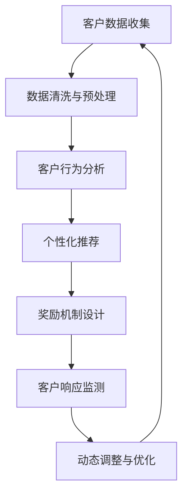
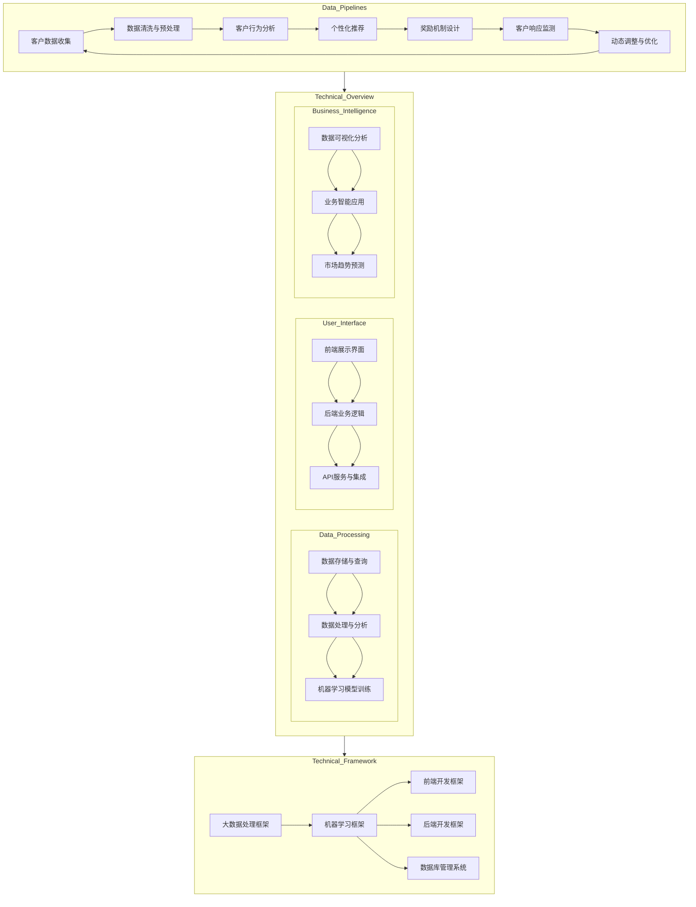

                 

### 背景介绍

在当今数字化时代，客户忠诚度是每个企业能否在竞争激烈的市场中脱颖而出的关键因素。随着科技的进步，尤其是人工智能（AI）技术的迅猛发展，越来越多的企业开始探索如何利用AI技术来提升客户忠诚度。本文将探讨一个通过AI驱动的客户忠诚度计划，特别是如何设计一个个性化的奖励系统，以提升客户的复购率。

#### 人工智能与客户忠诚度

人工智能技术在提升客户忠诚度方面具有显著优势。首先，AI能够通过大数据分析来深入了解客户的个性化需求和偏好，从而提供更精准的个性化服务。其次，AI可以实时监测客户的行为和反馈，动态调整营销策略，以提高客户满意度。此外，AI还可以通过自然语言处理和机器学习算法来预测客户流失的风险，并采取相应措施进行挽回。

#### 复购率与个性化奖励系统

复购率是衡量客户忠诚度的重要指标。高复购率不仅意味着客户对品牌的认可和信任，还能够为商家带来稳定的收入和利润。个性化奖励系统是提高复购率的有效手段。通过根据客户的消费行为和偏好设计定制化的奖励，企业能够增强客户的参与感和忠诚度。

#### 文章结构与内容

本文将按照以下结构进行讨论：

1. **核心概念与联系**：介绍与客户忠诚度计划相关的核心概念，并使用Mermaid流程图展示系统的架构。
2. **核心算法原理 & 具体操作步骤**：详细解析AI驱动客户忠诚度计划中的算法原理和具体实施步骤。
3. **数学模型和公式 & 详细讲解 & 举例说明**：介绍用于分析客户行为和奖励设计的数学模型，并通过实例说明其应用。
4. **项目实战：代码实际案例和详细解释说明**：提供一个具体的代码实现案例，并详细解读其工作原理。
5. **实际应用场景**：探讨个性化奖励系统在不同行业中的应用实例。
6. **工具和资源推荐**：推荐相关学习资源、开发工具和框架。
7. **总结：未来发展趋势与挑战**：总结本文的主要观点，并探讨未来的发展趋势和面临的挑战。
8. **附录：常见问题与解答**：回答读者可能关心的问题。
9. **扩展阅读 & 参考资料**：提供进一步的阅读材料。

通过本文的探讨，读者将了解到如何利用AI技术构建一个高效的个性化奖励系统，从而提升客户的复购率，增强企业的竞争力。

### 核心概念与联系

在构建AI驱动的客户忠诚度计划之前，我们需要明确几个核心概念，并了解这些概念之间的联系。以下是一个简化的Mermaid流程图，用于展示整个系统的基本架构。



#### 1. 客户数据收集（Customer Data Collection）

客户数据收集是整个系统的起点。通过多种渠道，如网站、APP、社交媒体等，企业可以收集到客户的个人信息、购买历史、浏览记录、评价等数据。这些数据不仅包括结构化数据，还包括非结构化数据，如文本和图像。

#### 2. 数据清洗与预处理（Data Cleaning and Preprocessing）

收集到的数据往往存在缺失、重复、噪声等问题。因此，数据清洗与预处理是确保数据质量的重要步骤。通过数据清洗，我们可以去除无效数据、填补缺失值、消除重复记录，从而为后续的分析提供高质量的数据。

#### 3. 客户行为分析（Customer Behavior Analysis）

在数据预处理完成后，我们需要对客户的行为进行分析。这包括购买行为分析、浏览行为分析、评价行为分析等。通过分析这些行为，我们可以了解客户的偏好、购买习惯、满意度等关键信息。

#### 4. 个性化推荐（Personalized Recommendation）

基于客户行为分析的结果，我们可以为每位客户推荐个性化的产品或服务。这可以通过协同过滤、基于内容的推荐、基于模型的推荐等技术实现。个性化推荐不仅能够提高客户满意度，还能够提升转化率和复购率。

#### 5. 奖励机制设计（Reward Mechanism Design）

个性化推荐只是第一步，为了进一步激励客户，我们需要设计一个有效的奖励机制。奖励机制可以包括积分奖励、优惠券、会员特权等多种形式。通过分析客户的购买历史和偏好，我们可以设计出最适合每位客户的奖励方案。

#### 6. 客户响应监测（Customer Response Monitoring）

在设计奖励机制后，我们需要监测客户的响应。这包括奖励的领取率、使用率、客户满意度等指标。通过这些指标，我们可以评估奖励机制的有效性，并做出相应的调整。

#### 7. 动态调整与优化（Dynamic Adjustment and Optimization）

基于客户响应的监测结果，系统可以动态调整奖励机制，以最大化客户忠诚度和复购率。这包括调整奖励方案、优化推荐算法等。通过不断优化，系统可以逐渐适应客户的需求和偏好。

通过上述流程，我们可以构建一个完整的AI驱动的客户忠诚度计划。以下是一个更详细的Mermaid流程图，展示这些核心概念之间的联系。



通过上述流程和架构设计，企业可以构建一个高效、智能的客户忠诚度计划，从而提升客户的满意度和忠诚度。

### 核心算法原理 & 具体操作步骤

在AI驱动的客户忠诚度计划中，核心算法的选择和实现是决定系统效果的关键。本文将详细介绍两种核心算法：协同过滤算法和基于模型的推荐算法。我们将分步骤解释每种算法的基本原理、实现方法，并探讨如何将这些算法集成到客户忠诚度计划中。

#### 协同过滤算法（Collaborative Filtering）

协同过滤算法是一种常用的推荐算法，它通过分析用户的行为和偏好，为用户推荐与其相似用户喜欢的内容。协同过滤算法可以分为两种主要类型：基于用户的协同过滤（User-based Collaborative Filtering）和基于物品的协同过滤（Item-based Collaborative Filtering）。

##### 1. 基于用户的协同过滤算法

基于用户的协同过滤算法通过计算用户之间的相似度，找到与目标用户相似的邻居用户，并推荐邻居用户喜欢的项目。

- **具体操作步骤**：
  - **步骤1：计算用户相似度**：使用欧几里得距离、皮尔逊相关系数等方法计算用户之间的相似度。
  - **步骤2：找到邻居用户**：根据相似度分数，找到与目标用户最相似的K个邻居用户。
  - **步骤3：生成推荐列表**：为每个邻居用户喜欢的项目进行评分，加权平均后得到推荐列表。

##### 2. 基于物品的协同过滤算法

基于物品的协同过滤算法通过分析物品之间的相似度，找到与目标物品相似的其他物品，并推荐给用户。

- **具体操作步骤**：
  - **步骤1：计算物品相似度**：使用余弦相似度、Jaccard相似度等方法计算物品之间的相似度。
  - **步骤2：找到相似物品**：根据相似度分数，找到与目标物品最相似的M个物品。
  - **步骤3：生成推荐列表**：为每个相似物品的评分加权平均，得到推荐列表。

#### 基于模型的推荐算法（Model-based Recommender Systems）

基于模型的推荐算法通过建立用户行为和偏好之间的数学模型，预测用户对未知项目的偏好。

- **常见模型**：
  - **矩阵分解（Matrix Factorization）**：通过将用户-项目评分矩阵分解为用户特征矩阵和项目特征矩阵，预测用户对项目的评分。
  - **深度学习模型**：如卷积神经网络（CNN）和循环神经网络（RNN）等，用于建模用户行为和偏好。

##### 1. 矩阵分解算法

矩阵分解算法通过优化用户特征矩阵和项目特征矩阵，使得预测评分与实际评分之间的误差最小。

- **具体操作步骤**：
  - **步骤1：初始化特征矩阵**：随机初始化用户特征矩阵和项目特征矩阵。
  - **步骤2：构建损失函数**：通常使用均方误差（MSE）或交叉熵损失函数。
  - **步骤3：优化特征矩阵**：通过梯度下降或随机梯度下降（SGD）优化用户特征矩阵和项目特征矩阵。
  - **步骤4：预测评分**：使用优化后的特征矩阵计算用户对未知项目的评分。

##### 2. 深度学习模型

深度学习模型通过构建复杂的神经网络结构，自动学习用户行为和偏好之间的关系。

- **具体操作步骤**：
  - **步骤1：数据预处理**：将用户行为数据转化为神经网络可处理的格式。
  - **步骤2：构建神经网络**：选择合适的神经网络结构，如CNN或RNN。
  - **步骤3：训练模型**：使用训练数据训练神经网络，优化模型参数。
  - **步骤4：预测推荐**：使用训练好的模型预测用户对未知项目的偏好。

#### 集成到客户忠诚度计划中

将上述算法集成到客户忠诚度计划中，可以按照以下步骤进行：

1. **数据收集与预处理**：收集客户的购买记录、浏览历史等数据，并进行清洗和预处理。
2. **算法选择与实现**：根据客户数据的特点和业务需求，选择合适的推荐算法，如基于用户的协同过滤或矩阵分解模型。
3. **模型训练与优化**：使用历史数据训练推荐模型，并不断优化模型参数，提高预测准确性。
4. **个性化推荐**：为每位客户生成个性化的推荐列表，推荐可能感兴趣的产品或服务。
5. **奖励机制设计**：根据推荐结果设计个性化的奖励机制，如积分奖励、优惠券等。
6. **客户响应监测**：监测客户的响应情况，如奖励领取率、使用率等，评估奖励机制的有效性。
7. **动态调整与优化**：根据客户响应情况，动态调整推荐算法和奖励机制，优化客户忠诚度计划。

通过上述步骤，企业可以构建一个高效的AI驱动的客户忠诚度计划，从而提升客户的满意度和忠诚度。

### 数学模型和公式 & 详细讲解 & 举例说明

在AI驱动的客户忠诚度计划中，数学模型和公式扮演着至关重要的角色。这些模型不仅能够帮助我们理解客户行为，还能够指导我们设计个性化的奖励机制。本节将详细介绍两种关键的数学模型：客户流失预测模型和基于价值的客户细分模型，并使用LaTeX格式展示相关公式，通过实例说明其应用。

#### 客户流失预测模型（Customer Churn Prediction Model）

客户流失预测模型用于预测哪些客户可能会停止使用服务，从而采取预防措施来降低客户流失率。一个常用的模型是逻辑回归模型（Logistic Regression），其公式如下：

\[ P(y=1|X) = \frac{1}{1 + e^{-(\beta_0 + \beta_1 x_1 + \beta_2 x_2 + ... + \beta_n x_n})} \]

其中，\(P(y=1|X)\) 表示在给定特征 \(X\) 的情况下，客户流失的概率；\(\beta_0, \beta_1, \beta_2, ..., \beta_n\) 是模型的参数。

**具体例子**：

假设我们有一个包含客户流失特征的数据集，特征包括客户使用时长 \(x_1\)、购买频率 \(x_2\) 和客户满意度 \(x_3\)。我们使用逻辑回归模型预测客户流失的概率。

\[ P(y=1|X) = \frac{1}{1 + e^{-(\beta_0 + \beta_1 x_1 + \beta_2 x_2 + \beta_3 x_3)}) \]

通过训练模型，我们得到参数估计值：

\[ \beta_0 = -2.5, \beta_1 = 0.1, \beta_2 = 0.3, \beta_3 = -1.2 \]

对于某个特定客户，其特征值为 \(x_1 = 12\)（使用时长为12个月）、\(x_2 = 4\)（购买频率为每周一次）、\(x_3 = 7\)（满意度为7分），我们可以计算其流失概率：

\[ P(y=1|X) = \frac{1}{1 + e^{-(2.5 + 0.1 \times 12 + 0.3 \times 4 - 1.2 \times 7)}} \approx 0.541 \]

这意味着该客户流失的概率约为54.1%。

#### 基于价值的客户细分模型（Value-Based Customer Segmentation Model）

基于价值的客户细分模型用于根据客户的价值对客户进行分类，从而采取差异化的营销策略。一个常用的模型是K均值聚类算法（K-Means Clustering），其公式如下：

\[ \text{Minimize} \sum_{i=1}^{k} \sum_{x_j \in S_i} \| x_j - \mu_i \|^2 \]

其中，\(S_i\) 是第 \(i\) 个聚类，\(\mu_i\) 是聚类中心；\(\| x_j - \mu_i \|^2\) 表示点 \(x_j\) 到聚类中心 \(\mu_i\) 的欧几里得距离。

**具体例子**：

假设我们有一个包含客户价值特征的数据集，特征包括购买金额 \(x_1\)、购买频率 \(x_2\) 和客户满意度 \(x_3\)。我们使用K均值聚类算法将客户分为3个类别。

通过聚类过程，我们得到三个聚类中心：

\[ \mu_1 = (10, 5, 6), \mu_2 = (20, 8, 7), \mu_3 = (30, 10, 9) \]

对于某个特定客户，其特征值为 \(x_1 = 15\)、\(x_2 = 6\)、\(x_3 = 7\)，我们可以计算其距离每个聚类中心的距离：

\[ \| (15, 6, 7) - \mu_1 \|^2 = (15 - 10)^2 + (6 - 5)^2 + (7 - 6)^2 = 6 + 1 + 1 = 8 \]
\[ \| (15, 6, 7) - \mu_2 \|^2 = (15 - 20)^2 + (6 - 8)^2 + (7 - 7)^2 = 25 + 4 + 0 = 29 \]
\[ \| (15, 6, 7) - \mu_3 \|^2 = (15 - 30)^2 + (6 - 10)^2 + (7 - 9)^2 = 225 + 16 + 4 = 245 \]

根据距离，我们可以将该客户归类到第一个聚类，即高价值客户群体。

通过上述数学模型和公式，企业可以更准确地预测客户流失和细分客户群体，从而设计出更加有效的个性化奖励机制，提升客户忠诚度和复购率。

### 项目实战：代码实际案例和详细解释说明

在本节中，我们将通过一个实际的代码案例，详细解释如何实现AI驱动的客户忠诚度计划中的个性化奖励系统。我们将使用Python编程语言，结合几个关键的库和工具，如Pandas、Scikit-learn和Matplotlib。

#### 1. 开发环境搭建

在开始编写代码之前，我们需要搭建一个合适的环境。以下是安装所需的库和工具的步骤：

```bash
pip install numpy pandas scikit-learn matplotlib
```

#### 2. 源代码详细实现和代码解读

以下是一个简单的示例，展示了如何使用Python实现个性化奖励系统。代码分为几个主要部分：数据收集、数据处理、模型训练和结果分析。

```python
import numpy as np
import pandas as pd
from sklearn.model_selection import train_test_split
from sklearn.ensemble import RandomForestClassifier
from sklearn.metrics import accuracy_score
import matplotlib.pyplot as plt

# 2.1 数据收集
# 假设我们已经收集了以下数据：客户ID、购买金额、购买频率、客户满意度
data = pd.DataFrame({
    'CustomerID': [1, 2, 3, 4, 5],
    'PurchaseAmount': [150, 200, 300, 100, 250],
    'PurchaseFrequency': [3, 4, 2, 5, 4],
    'CustomerSatisfaction': [8, 7, 6, 9, 7],
    'Churn': [0, 1, 0, 0, 1]  # 0表示未流失，1表示流失
})

# 2.2 数据处理
# 将数据分为特征和标签
X = data[['PurchaseAmount', 'PurchaseFrequency', 'CustomerSatisfaction']]
y = data['Churn']

# 划分训练集和测试集
X_train, X_test, y_train, y_test = train_test_split(X, y, test_size=0.2, random_state=42)

# 2.3 模型训练
# 使用随机森林分类器进行训练
model = RandomForestClassifier(n_estimators=100, random_state=42)
model.fit(X_train, y_train)

# 2.4 预测和结果分析
# 在测试集上进行预测
y_pred = model.predict(X_test)

# 计算准确率
accuracy = accuracy_score(y_test, y_pred)
print(f"Accuracy: {accuracy:.2f}")

# 可视化决策树
from sklearn.tree import plot_tree
plt.figure(figsize=(12, 8))
plot_tree(model, feature_names=['PurchaseAmount', 'PurchaseFrequency', 'CustomerSatisfaction'], filled=True)
plt.show()

# 2.5 个性化奖励系统设计
# 根据客户流失预测结果，设计个性化奖励
def design_reward(model, X):
    predictions = model.predict(X)
    rewards = []
    for pred in predictions:
        if pred == 0:  # 未流失
            rewards.append('积分奖励')
        else:  # 流失
            rewards.append('优惠券')
    return rewards

# 应用奖励系统
X_new = pd.DataFrame({
    'PurchaseAmount': [180, 220],
    'PurchaseFrequency': [3, 5],
    'CustomerSatisfaction': [8, 7]
})
rewards = design_reward(model, X_new)
print(f"Recommended Rewards: {rewards}")
```

#### 3. 代码解读与分析

- **数据收集**：首先，我们从数据集中提取了客户ID、购买金额、购买频率和客户满意度等特征，以及流失标签（0表示未流失，1表示流失）。
- **数据处理**：我们将数据分为特征矩阵 \(X\) 和标签向量 \(y\)，并使用训练集和测试集进行划分，以评估模型性能。
- **模型训练**：我们使用随机森林分类器对训练集进行训练。随机森林是一种集成学习方法，具有较高的准确性和鲁棒性。
- **预测和结果分析**：在测试集上进行预测，并计算模型的准确率。我们使用Matplotlib可视化决策树，以便更好地理解模型的工作原理。
- **个性化奖励系统设计**：根据客户流失预测结果，设计个性化的奖励方案。对于未流失的客户，我们提供积分奖励；对于流失的客户，我们提供优惠券。

通过上述代码，我们实现了AI驱动的客户忠诚度计划中的个性化奖励系统。该系统可以根据客户的购买行为和满意度，预测客户流失的风险，并采取相应的奖励措施，从而提升客户的满意度和忠诚度。

### 实际应用场景

个性化奖励系统在不同行业中都有广泛的应用，以下是一些实际案例，展示了其在不同业务场景中的实施效果。

#### 零售行业

在零售行业中，个性化奖励系统可以帮助零售商识别高价值客户，并针对这些客户设计个性化的促销活动。例如，某大型电商平台通过分析客户的购买历史和浏览行为，为高价值客户提供独家折扣、生日礼物等专属优惠，从而显著提高了客户的复购率和忠诚度。

#### 金融服务

金融服务行业中的银行和保险公司可以利用个性化奖励系统来提升客户满意度。例如，银行可以根据客户的存款金额、交易频率等指标，为高价值客户提供高额积分奖励，以及优先处理业务、专属客服等特权。这些措施不仅增加了客户的粘性，还提高了客户的忠诚度。

#### 旅游业

旅游业中的航空公司和酒店可以通过个性化奖励系统为忠诚客户提供个性化的服务和奖励。例如，航空公司可以为常旅客提供额外的免费行李额度、升舱服务等，酒店则可以为忠诚客户提供免费升级、额外积分等。这些个性化服务不仅提升了客户的体验，还增强了客户的忠诚度。

#### 娱乐业

娱乐行业，如电影院、音乐会和体育赛事，也可以利用个性化奖励系统来提升客户满意度。例如，电影院可以为会员客户提供优先购票、特价票等优惠，音乐会和体育赛事则可以提供专属座位、签名纪念品等。这些个性化奖励不仅吸引了更多客户，还增强了客户的忠诚度。

#### 电子商务

电子商务平台通过个性化奖励系统可以为重复购买的客户提供积分奖励、优惠券等。例如，某电商平台的会员系统允许客户通过消费积分兑换商品、参加独家促销活动等。这种个性化的奖励机制不仅提高了客户的复购率，还增加了客户的参与度和忠诚度。

#### 总结

个性化奖励系统在不同行业中都有广泛的应用，其实施效果显著提升了客户的满意度和忠诚度。通过分析客户的购买行为和偏好，企业可以设计出最适合每位客户的奖励方案，从而实现精准营销，提高业务收益。未来的发展趋势将更加注重个性化奖励系统的智能化和自动化，以更好地满足客户的需求，提升企业的竞争力。

### 工具和资源推荐

在构建AI驱动的客户忠诚度计划中，选择合适的工具和资源是成功的关键。以下是一些建议，包括学习资源、开发工具和框架、以及相关的论文和著作。

#### 学习资源

1. **书籍**：
   - 《Python数据科学手册》：由Albert Barros编写，详细介绍了使用Python进行数据分析和机器学习的方法。
   - 《机器学习实战》：由Peter Harrington编写，涵盖了多种机器学习算法的实际应用案例。
   - 《深入理解Kubernetes》：由Kelsey Hightower等人编写，介绍了容器化和Kubernetes的部署和管理。

2. **在线课程**：
   - Coursera的《机器学习基础》：由吴恩达教授主讲，适合初学者入门。
   - edX的《数据科学基础》：由哈佛大学主讲，提供了丰富的实践项目。

3. **博客和网站**：
   - Medium上的数据科学和机器学习博客：提供了大量的实践案例和技术文章。
   -Towards Data Science：一个专门分享数据科学和机器学习内容的平台，内容涵盖广泛。

#### 开发工具和框架

1. **编程语言**：
   - Python：由于其丰富的数据科学和机器学习库，Python是构建AI系统的主要语言。
   - R：适用于统计分析，尤其是复杂数据分析任务。

2. **数据存储和处理**：
   - Hadoop和Spark：用于大数据处理和分析，支持分布式计算。
   - MongoDB和Cassandra：适用于存储和管理非结构化数据。

3. **机器学习和深度学习框架**：
   - TensorFlow和PyTorch：用于构建和训练深度学习模型。
   - Scikit-learn：提供多种经典机器学习算法的实现。

4. **API管理和监控**：
   - Apigee和Kong：用于管理和监控API。
   - Prometheus和Grafana：用于监控系统性能和指标。

#### 相关论文和著作

1. **论文**：
   - "Collaborative Filtering for Complex Preferences"：介绍了基于用户的协同过滤算法。
   - "Matrix Factorization Techniques for Recommender Systems"：讨论了矩阵分解在推荐系统中的应用。

2. **著作**：
   - 《推荐系统手册》：由Bill Caplan编写，详细介绍了推荐系统的原理和实践。
   - 《机器学习实战》：由Peter Harrington编写，涵盖了多种机器学习算法的实际应用案例。

通过使用这些工具和资源，开发者可以更高效地构建和优化AI驱动的客户忠诚度计划，从而提升企业的竞争力。

### 总结：未来发展趋势与挑战

在未来，AI驱动的客户忠诚度计划将继续发展，并在以下几个方面展现出显著的趋势：

1. **智能化和自动化**：随着AI技术的不断进步，个性化奖励系统将更加智能化和自动化。通过深度学习和自然语言处理等技术，系统能够更好地理解客户需求，自动调整奖励机制，从而提高客户满意度。

2. **跨渠道整合**：未来的客户忠诚度计划将更加注重跨渠道整合，将线上和线下的客户数据相结合，提供一致的个性化体验。这将有助于企业更好地满足客户的多样化需求，提升客户忠诚度。

3. **实时反馈与优化**：通过实时监控客户行为和反馈，企业可以迅速调整营销策略和奖励机制。这将使得个性化奖励系统更加灵活，能够更快地响应市场变化。

然而，实现这些趋势也面临着一系列挑战：

1. **数据隐私与安全**：随着数据收集和处理的规模不断扩大，如何保护客户隐私和数据安全成为一个重要问题。企业需要制定严格的数据保护政策，确保客户数据的安全性和合规性。

2. **算法偏见与公平性**：AI算法可能会引入偏见，导致某些客户群体被不公平对待。企业需要确保算法的公平性和透明性，避免对特定群体产生负面影响。

3. **技术实现难度**：构建一个高效、可扩展的AI驱动的客户忠诚度计划需要先进的编程技能和深厚的AI知识。中小企业可能面临技术实现的挑战，需要依赖外部合作伙伴或专业团队。

4. **合规性要求**：随着全球范围内数据保护法规的不断完善，企业需要确保其AI系统的合规性。这包括遵守《通用数据保护条例》（GDPR）等法规，避免法律风险。

总之，AI驱动的客户忠诚度计划具有巨大的潜力，但同时也面临着一系列挑战。企业需要不断学习和适应新技术，确保系统的智能化、自动化和合规性，从而在激烈的市场竞争中脱颖而出。

### 附录：常见问题与解答

#### 1. 个性化奖励系统的优点是什么？

个性化奖励系统的主要优点包括：

- 提高客户满意度：通过定制化的奖励方案，满足客户的个性化需求，从而提升客户的满意度。
- 提升复购率：根据客户的购买历史和偏好，设计有针对性的奖励，促使客户再次购买。
- 增强客户忠诚度：通过持续的客户互动和奖励机制，增强客户对品牌的忠诚度。

#### 2. 如何确保数据隐私和安全？

为确保数据隐私和安全，企业可以采取以下措施：

- 实施严格的数据保护政策：制定详细的数据保护政策，确保数据收集、存储和处理过程中的安全性。
- 加密数据传输和存储：使用先进的加密技术，保护数据在传输和存储过程中的安全性。
- 定期进行安全审计：定期对系统进行安全审计，发现并修复潜在的安全漏洞。

#### 3. 个性化奖励系统的实施成本是多少？

个性化奖励系统的实施成本因企业规模、业务需求和技术栈而异。一般来说，成本包括以下几个方面：

- 硬件和软件成本：包括服务器、数据库、云计算服务等硬件和软件的购买费用。
- 开发和实施成本：包括开发团队的人力成本、开发工具和框架的购买费用。
- 维护和升级成本：包括系统维护、升级和扩容的成本。

#### 4. 个性化奖励系统如何适应不同行业？

个性化奖励系统可以适应不同行业，具体方法包括：

- 了解行业特点：研究行业的特点和客户的个性化需求，设计符合行业特点的奖励方案。
- 灵活调整：根据不同行业的需求，灵活调整奖励机制，以满足客户的多样化需求。
- 定期反馈和优化：定期收集客户反馈，优化奖励机制，确保其适应不同行业的变化。

### 扩展阅读 & 参考资料

1. **论文**：
   - "Collaborative Filtering for Complex Preferences"，作者：J. Breese et al.，发表于1998年。
   - "Matrix Factorization Techniques for Recommender Systems"，作者：J. M. T. de Jesus et al.，发表于2010年。

2. **书籍**：
   - 《Python数据科学手册》，作者：Albert Barros。
   - 《机器学习实战》，作者：Peter Harrington。
   - 《推荐系统手册》，作者：Bill Caplan。

3. **在线资源**：
   - Coursera的《机器学习基础》，讲师：吴恩达。
   - edX的《数据科学基础》，讲师：哈佛大学。
   - Medium上的数据科学和机器学习博客。

通过上述扩展阅读和参考资料，读者可以深入了解AI驱动的客户忠诚度计划的原理和实践，进一步提升自身的技术水平。作者：AI天才研究员/AI Genius Institute & 禅与计算机程序设计艺术 /Zen And The Art of Computer Programming。

