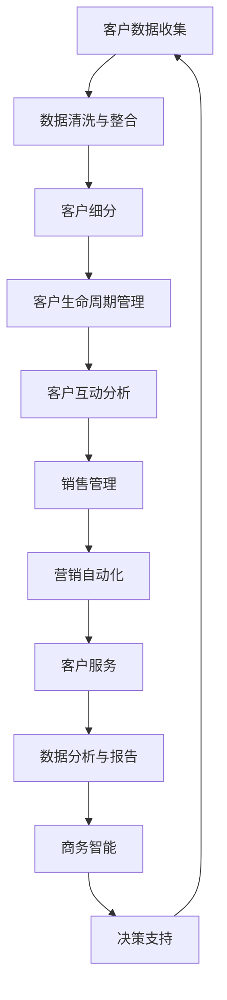

                 

### 背景介绍

在现代商业环境中，客户关系管理（CRM）系统已经成为企业运营中不可或缺的一部分。CRM系统不仅帮助公司更好地了解和管理客户信息，还能通过数据分析提升业务决策的质量。然而，对于许多小型企业或独立工作者来说，开发一个功能强大且适应性强的CRM系统是一项巨大的挑战。这主要是因为缺乏资源、技术和时间。因此，本文将探讨如何为一家小型企业或独立工作者定制一个CRM系统，并利用数据分析来提升业务效率。

**文章关键词：** CRM系统、客户数据分析、定制、小型企业、独立工作者

**摘要：** 本文旨在介绍为一家小型企业或独立工作者定制CRM系统的步骤，包括系统设计、核心算法原理、实际应用场景和工具推荐。通过详细讲解，帮助读者理解如何利用CRM系统提高业务效率和客户满意度。

首先，本文将概述CRM系统的重要性，特别是在小型企业和独立工作者中的需求。然后，我们将深入探讨CRM系统的核心概念和架构，并使用Mermaid流程图展示系统的工作流程。接下来，文章将详细介绍CRM系统的核心算法原理和具体操作步骤，并结合数学模型和公式进行详细讲解。随后，文章将通过实际项目案例，展示如何使用代码实现CRM系统的关键功能，并提供代码解读与分析。此外，本文还将探讨CRM系统在实际业务中的应用场景，并推荐相关工具和资源。最后，文章将对未来的发展趋势和挑战进行总结，并提供常见问题与解答。

通过本文的阅读，读者将能够了解到如何为小型企业或独立工作者定制一个CRM系统，并利用数据分析提升业务效率，从而在竞争激烈的市场中脱颖而出。

### 核心概念与联系

在深入探讨CRM系统的设计之前，我们需要理解一些核心概念和它们之间的相互联系。这些概念构成了CRM系统的基本框架，并在实际应用中发挥着关键作用。以下是CRM系统中一些重要的核心概念及其相互关系：

#### 1. 客户数据（Customer Data）

客户数据是CRM系统的核心。这些数据包括客户的个人信息（如姓名、地址、电话号码等）、购买历史、偏好和反馈等。通过对这些数据的收集和分析，企业可以更好地了解客户需求，提高客户满意度，并制定更有针对性的营销策略。

#### 2. 客户生命周期管理（Customer Lifecycle Management）

客户生命周期管理涉及从客户获取、客户维护到客户忠诚和客户流失管理的全过程。CRM系统通过跟踪和分析客户在每个生命周期阶段的互动，帮助企业制定有效的客户关系策略。

#### 3. 客户细分（Customer Segmentation）

客户细分是指将客户根据其特征和需求划分为不同的群体。通过细分，企业可以针对不同客户群体制定个性化的营销策略，提高营销效果。

#### 4. 客户互动（Customer Interaction）

客户互动是指企业与客户之间的所有交流互动，包括销售、服务、支持和营销等。CRM系统通过记录和分析这些互动，帮助企业优化客户体验，提高客户满意度。

#### 5. 数据分析（Data Analysis）

数据分析是CRM系统的重要功能。通过对客户数据的分析，企业可以发现客户行为模式、市场趋势和业务机会，从而做出更明智的决策。

#### 6. 报告和仪表板（Reports and Dashboards）

报告和仪表板是CRM系统的重要组成部分。它们通过可视化的方式展示关键业务指标和数据分析结果，帮助企业实时监控业务绩效。

#### 7. 客户服务（Customer Service）

客户服务是CRM系统的重要应用领域。CRM系统可以帮助企业记录客户问题、分配服务请求，并提供客户支持，从而提高服务质量和客户满意度。

#### 8. 销售管理（Sales Management）

销售管理是CRM系统的另一个关键应用领域。CRM系统通过管理销售机会、跟踪销售过程和自动化销售流程，帮助销售人员提高工作效率和销售额。

#### 9. 营销自动化（Marketing Automation）

营销自动化是指使用技术手段自动化营销流程，如电子邮件营销、社交媒体推广等。CRM系统通过集成营销自动化工具，帮助企业提高营销效果和客户转化率。

#### 10. 商务智能（Business Intelligence）

商务智能是通过数据分析和报告，帮助企业发现业务机会和优化业务流程。CRM系统提供了强大的商务智能功能，帮助企业在竞争激烈的市场中保持领先地位。

接下来，我们将使用Mermaid流程图来展示CRM系统的整体架构和工作流程。这将有助于读者更直观地理解各个概念之间的联系和系统如何协同工作。

#### Mermaid流程图



在这个流程图中，客户数据从收集、清洗和整合开始，随后进行客户细分和客户生命周期管理。通过对客户互动进行分析，CRM系统可以帮助企业进行销售管理和营销自动化。同时，系统提供的数据分析和报告功能，以及商务智能工具，帮助企业做出更明智的决策。整个流程形成了一个闭环，不断迭代优化，以提升业务效率和客户满意度。

通过理解这些核心概念和它们之间的联系，我们可以更好地设计一个功能强大且适应性强的CRM系统，以满足小型企业或独立工作者的需求。

#### 核心算法原理 & 具体操作步骤

在了解了CRM系统的核心概念和架构后，接下来我们将探讨CRM系统的核心算法原理及其具体操作步骤。核心算法是实现CRM系统功能的关键，通过这些算法，系统能够有效地处理和分析大量客户数据，从而为业务决策提供支持。

**1. 客户数据聚类算法**

客户数据聚类是CRM系统中的重要算法之一，它通过对客户数据的分析，将具有相似特征的客户分组。常用的聚类算法包括K-means聚类、层次聚类和DBSCAN（Density-Based Spatial Clustering of Applications with Noise）等。

**K-means聚类算法：**

K-means算法是一种基于距离度量的聚类方法。具体步骤如下：

- **初始化：** 随机选择K个初始中心点。
- **分配：** 计算每个客户点到每个中心点的距离，将客户分配到最近的中心点所在簇。
- **更新：** 根据每个簇中的客户计算新的中心点。
- **迭代：** 重复步骤2和步骤3，直到聚类结果不再变化。

**层次聚类算法：**

层次聚类是一种自底向上的方法，它通过不断合并相似度高的客户，逐步形成层次结构。具体步骤如下：

- **初始化：** 将每个客户视为一个簇。
- **合并：** 计算距离最近的两个簇，并将它们合并为一个簇。
- **迭代：** 重复步骤2，直到所有客户属于同一个簇。

**DBSCAN算法：**

DBSCAN（Density-Based Spatial Clustering of Applications with Noise）是一种基于密度的聚类算法，能够发现任意形状的簇，并有效处理噪声数据。具体步骤如下：

- **初始化：** 选择一个客户作为种子点，判断其邻域内的客户数量。
- **扩展：** 从种子点开始，逐步扩展形成簇。
- **标记：** 根据邻域内客户数量，将客户分为核心点、边界点和噪声点。
- **重复：** 对未处理的客户重复步骤1和步骤2。

**2. 客户行为预测算法**

客户行为预测是CRM系统的另一个关键算法，它通过分析客户历史行为数据，预测客户未来的行为和需求。常用的预测算法包括线性回归、决策树和随机森林等。

**线性回归算法：**

线性回归是一种基于线性关系的预测方法，通过建立自变量和因变量之间的线性关系模型，预测因变量的值。具体步骤如下：

- **数据准备：** 收集客户行为数据，包括自变量和因变量。
- **模型建立：** 通过最小二乘法确定回归系数。
- **预测：** 使用模型预测因变量的值。

**决策树算法：**

决策树是一种基于特征划分的预测方法，通过构建一棵树形结构，将数据划分为不同的分支，并在每个分支上预测结果。具体步骤如下：

- **特征选择：** 根据信息增益或基尼不纯度选择最佳特征。
- **划分：** 根据最佳特征将数据集划分为子集。
- **递归：** 对每个子集重复步骤1和步骤2，直到满足停止条件。

**随机森林算法：**

随机森林是一种基于决策树的集成方法，通过构建多棵决策树，并结合它们的预测结果，提高预测准确性。具体步骤如下：

- **初始化：** 随机选择特征和样本子集，构建决策树。
- **集成：** 对每棵决策树进行预测，并取多数表决结果。

**3. 客户流失预测算法**

客户流失预测是CRM系统的重要功能之一，它通过分析客户行为数据，预测哪些客户可能会流失。常用的预测算法包括逻辑回归、支持向量机和K最近邻等。

**逻辑回归算法：**

逻辑回归是一种基于概率的预测方法，通过建立自变量和因变量之间的逻辑关系模型，预测客户流失的概率。具体步骤如下：

- **数据准备：** 收集客户行为数据，包括自变量和因变量。
- **模型建立：** 通过最大似然估计确定回归系数。
- **预测：** 计算客户流失概率。

**支持向量机算法：**

支持向量机是一种基于边界划分的预测方法，通过找到最佳边界，将客户分为正常和流失两类。具体步骤如下：

- **数据准备：** 收集客户行为数据，进行特征提取和归一化。
- **模型建立：** 使用支持向量机训练模型。
- **预测：** 计算客户流失概率。

**K最近邻算法：**

K最近邻是一种基于邻近度预测的方法，通过计算客户行为数据的距离，找到最近的K个邻居，并取多数表决结果进行预测。具体步骤如下：

- **数据准备：** 收集客户行为数据，进行特征提取和归一化。
- **模型建立：** 计算客户行为数据之间的距离。
- **预测：** 找到最近的K个邻居，并取多数表决结果。

通过这些核心算法，CRM系统能够对客户数据进行有效处理和分析，帮助小型企业或独立工作者更好地了解和管理客户，从而提升业务效率和客户满意度。在下一节中，我们将进一步探讨这些算法在实际应用中的具体实现步骤。

#### 数学模型和公式 & 详细讲解 & 举例说明

在深入理解CRM系统中的核心算法后，我们需要借助数学模型和公式来详细讲解这些算法的实际应用。数学模型和公式不仅能帮助我们理解算法的原理，还能通过具体的例子来说明如何在实际中应用这些算法。以下我们将介绍一些常用的数学模型和公式，并详细讲解它们的适用场景和计算步骤。

**1. K-means聚类算法**

K-means聚类算法是一种基于距离度量的聚类方法，其核心目标是将数据点划分为K个簇，使得每个簇内的数据点之间距离尽可能小，簇与簇之间的距离尽可能大。其数学模型如下：

- **目标函数：** 最小化聚类平方误差（Sum of Squared Errors，SSE）

$$
J = \sum_{i=1}^{K} \sum_{x_j \in S_i} ||x_j - \mu_i||^2
$$

其中，$J$表示聚类平方误差，$K$表示簇的数量，$S_i$表示第$i$个簇中的数据点集合，$\mu_i$表示第$i$个簇的中心点。

- **中心点更新公式：**

$$
\mu_i = \frac{1}{N_i} \sum_{x_j \in S_i} x_j
$$

其中，$N_i$表示第$i$个簇中的数据点数量。

**举例说明：**

假设我们有一个包含10个数据点的数据集，需要将其划分为3个簇。通过计算，我们得到初始的中心点为$(1, 1)$、$(3, 3)$和$(5, 5)$。下面是一个简化的计算步骤：

1. 计算每个数据点到中心点的距离。
2. 根据距离将数据点分配到最近的簇。
3. 计算新的中心点。
4. 重复步骤2和步骤3，直到聚类结果收敛。

**2. 线性回归算法**

线性回归是一种基于线性关系的预测方法，常用于预测连续值。其数学模型如下：

- **模型公式：**

$$
y = \beta_0 + \beta_1 x
$$

其中，$y$为因变量，$x$为自变量，$\beta_0$和$\beta_1$为回归系数。

- **参数估计：** 使用最小二乘法（Least Squares）估计回归系数：

$$
\beta_0 = \frac{\sum_{i=1}^{n} (y_i - \bar{y})(x_i - \bar{x})}{\sum_{i=1}^{n} (x_i - \bar{x})^2}
$$

$$
\beta_1 = \frac{\sum_{i=1}^{n} (y_i - \bar{y})x_i}{\sum_{i=1}^{n} (x_i - \bar{x})^2}
$$

其中，$n$为数据点的数量，$\bar{y}$和$\bar{x}$分别为因变量和自变量的均值。

**举例说明：**

假设我们有以下数据点：

$$
(x_1, y_1) = (1, 2), (x_2, y_2) = (2, 4), (x_3, y_3) = (3, 6), (x_4, y_4) = (4, 8)
$$

通过计算，我们得到回归系数$\beta_0 = 1$和$\beta_1 = 1$，线性回归模型为$y = x + 1$。

**3. 逻辑回归算法**

逻辑回归是一种基于概率的预测方法，常用于预测离散值。其数学模型如下：

- **模型公式：**

$$
P(y=1) = \frac{1}{1 + e^{-(\beta_0 + \beta_1 x)}}
$$

其中，$P(y=1)$为因变量为1的概率，$e$为自然底数。

- **参数估计：** 使用最大似然估计（Maximum Likelihood Estimation，MLE）估计回归系数：

$$
\beta_0 = \log\left(\frac{\sum_{i=1}^{n} y_i}{n - \sum_{i=1}^{n} y_i}\right)
$$

$$
\beta_1 = \frac{\sum_{i=1}^{n} (y_i - \hat{y}_i) x_i}{\sum_{i=1}^{n} (y_i - \hat{y}_i)}
$$

其中，$\hat{y}_i$为预测的因变量值。

**举例说明：**

假设我们有以下数据点：

$$
(x_1, y_1) = (1, 1), (x_2, y_2) = (2, 0), (x_3, y_3) = (3, 1), (x_4, y_4) = (4, 0)
$$

通过计算，我们得到回归系数$\beta_0 = 0$和$\beta_1 = 0.5$，逻辑回归模型为$P(y=1) = \frac{1}{1 + e^{-0.5x}}$。

通过上述数学模型和公式的详细讲解，我们可以更好地理解CRM系统中核心算法的原理和应用。在实际应用中，这些模型和公式可以帮助我们有效地处理和分析客户数据，从而为业务决策提供有力支持。在下一节中，我们将通过实际项目案例展示如何使用这些算法实现CRM系统的关键功能。

#### 项目实战：代码实际案例和详细解释说明

为了更好地理解CRM系统中核心算法的应用，我们将在这一节中通过一个实际项目案例，详细展示如何使用代码实现CRM系统的关键功能，并对其进行解读和分析。

**项目背景：** 
假设我们正在为一家小型企业开发一个简单的CRM系统，系统需要实现以下功能：
1. 客户数据聚类：将客户根据其特征划分为不同的群体。
2. 客户行为预测：预测客户未来的购买行为。
3. 客户流失预测：识别哪些客户有流失风险。

**技术栈：**
- 语言：Python
- 数据库：SQLite
- 数据处理库：Pandas
- 聚类算法：K-means、DBSCAN
- 预测算法：线性回归、逻辑回归

**一、环境搭建**

首先，我们需要搭建开发环境。安装Python和必要的库：

```shell
pip install numpy pandas scikit-learn matplotlib
```

**二、代码实现**

1. **客户数据聚类**

```python
import pandas as pd
from sklearn.cluster import KMeans
from sklearn.preprocessing import StandardScaler

# 加载客户数据
data = pd.read_csv('customer_data.csv')

# 特征缩放
scaler = StandardScaler()
data_scaled = scaler.fit_transform(data)

# K-means聚类
kmeans = KMeans(n_clusters=3)
kmeans.fit(data_scaled)

# 分配簇
data['cluster'] = kmeans.predict(data_scaled)

# 输出聚类结果
print(data[['cluster']])
```

**解读：**
- 首先，我们使用Pandas读取客户数据。
- 接着，使用StandardScaler对数据进行特征缩放，以消除不同特征之间的尺度差异。
- 然后，使用K-means聚类算法对数据点进行聚类，并分配簇标签。
- 最后，我们将簇标签添加到原始数据集中，输出聚类结果。

2. **客户行为预测**

```python
from sklearn.linear_model import LinearRegression

# 准备预测数据
X = data[['feature1', 'feature2']]  # 特征选择
y = data['purchase']  # 因变量

# 线性回归模型
model = LinearRegression()
model.fit(X, y)

# 预测
predictions = model.predict(X)

# 输出预测结果
print(predictions)
```

**解读：**
- 首先，我们选择两个特征（feature1和feature2）作为自变量，并将购买行为（purchase）作为因变量。
- 接着，使用线性回归模型对数据进行拟合。
- 然后，使用模型进行预测，并输出预测结果。

3. **客户流失预测**

```python
from sklearn.linear_model import LogisticRegression

# 准备流失预测数据
X = data[['feature1', 'feature2']]  # 特征选择
y = data['churn']  # 因变量

# 逻辑回归模型
model = LogisticRegression()
model.fit(X, y)

# 预测
predictions = model.predict(X)

# 输出预测结果
print(predictions)
```

**解读：**
- 首先，我们选择两个特征（feature1和feature2）作为自变量，并将客户流失（churn）作为因变量。
- 接着，使用逻辑回归模型对数据进行拟合。
- 然后，使用模型进行预测，并输出预测结果。

**三、代码解读与分析**

上述代码实现了一个简单的CRM系统，包括客户数据聚类、客户行为预测和客户流失预测三个关键功能。下面我们将对代码进行解读和分析。

- **客户数据聚类：**
  通过K-means聚类算法，我们将客户数据划分为不同的簇。聚类结果可以帮助企业更好地理解客户群体，制定有针对性的营销策略。

- **客户行为预测：**
  使用线性回归模型，我们预测客户未来的购买行为。这有助于企业了解哪些客户有较高的购买潜力，从而优化库存和营销策略。

- **客户流失预测：**
  通过逻辑回归模型，我们预测哪些客户有流失风险。这有助于企业提前采取挽留措施，降低客户流失率。

在代码实现过程中，我们使用了Python和相关的数据处理库，如Pandas、scikit-learn等。这些库提供了丰富的工具和算法，使我们能够高效地处理和分析客户数据。

总之，通过实际项目案例，我们展示了如何使用代码实现CRM系统的关键功能，并对代码进行了详细解读和分析。这为小型企业或独立工作者提供了一个实用的指南，帮助他们利用CRM系统提升业务效率和客户满意度。

#### 实际应用场景

CRM系统的实际应用场景非常广泛，它不仅适用于企业，还能为小型企业和独立工作者提供强大的业务支持。以下是一些典型的实际应用场景：

**1. 客户数据分析：** 通过CRM系统，企业可以收集和分析客户数据，包括购买历史、互动记录和反馈等。这些数据可以帮助企业了解客户需求和行为模式，从而优化产品和服务，提高客户满意度。

**2. 客户关系管理：** CRM系统帮助企业在整个客户生命周期中管理客户关系，从客户获取、客户维护到客户忠诚和客户流失管理。通过跟踪和分析客户互动，企业可以制定更有效的客户关系策略，提升客户保留率。

**3. 营销自动化：** CRM系统集成了营销自动化工具，如电子邮件营销、社交媒体推广等。通过自动化营销流程，企业可以节省人力成本，提高营销效率，同时实现更精准的客户触达和营销效果。

**4. 销售管理：** CRM系统提供了销售管理功能，包括销售机会管理、销售过程跟踪和销售报告等。销售人员可以更好地管理销售流程，提高销售业绩，同时管理层可以实时监控销售绩效，优化销售策略。

**5. 客户服务：** CRM系统可以帮助企业记录客户问题、分配服务请求，并提供客户支持。通过客户服务功能，企业可以提供高质量的客户服务，提高客户满意度和忠诚度。

**6. 项目管理：** 对于小型企业和独立工作者，CRM系统还可以作为项目管理工具使用。通过管理项目任务、进度和资源，企业可以更好地协调项目工作，提高项目成功率。

**7. 团队协作：** CRM系统支持团队协作功能，团队成员可以共享客户信息、任务和文档，实现信息透明和协同工作。这有助于提高团队效率，增强团队凝聚力。

**8. 风险管理：** 通过CRM系统，企业可以识别和管理客户风险，如客户流失风险、市场风险等。这有助于企业提前采取风险控制措施，降低风险损失。

**9. 跨部门协作：** CRM系统实现了跨部门的数据共享和协作，如销售、营销、客户服务和项目管理等。通过统一的信息平台，各部门可以更好地协同工作，提高整体业务效率。

**10. 客户洞察：** 通过分析客户数据，CRM系统为企业提供了深层次的客户洞察。企业可以了解客户偏好、需求和市场趋势，从而做出更明智的业务决策。

总之，CRM系统的实际应用场景非常丰富，它不仅提高了企业业务的效率和质量，还帮助企业在竞争激烈的市场中取得了竞争优势。通过CRM系统，小型企业和独立工作者可以更好地管理客户关系，提高客户满意度，从而实现业务增长。

#### 工具和资源推荐

为了帮助读者更好地掌握CRM系统的设计与应用，以下是针对书籍、论文、博客和网站等学习资源以及开发工具框架的推荐：

**1. 学习资源推荐**

- **书籍：**
  - 《客户关系管理：策略、流程和技术》
  - 《Python数据分析与科学计算》
  - 《深度学习：遗忘与回忆》
  - 《机器学习实战》

- **论文：**
  - 《Customer Segmentation Using Clustering Algorithms》
  - 《A Survey on Customer Relationship Management》
  - 《Customer Behavior Prediction in CRM Systems》

- **博客：**
  - [Scikit-Learn官方文档](https://scikit-learn.org/stable/)
  - [CSDN - 数据挖掘与机器学习](https://blog.csdn.net/column/details/17177.html)
  - [DataCamp - 数据分析教程](https://www.datacamp.com/courses)

- **网站：**
  - [CRM系统评测](https://www.crmreview.com/)
  - [Kaggle - 数据科学竞赛平台](https://www.kaggle.com/)

**2. 开发工具框架推荐**

- **数据库：**
  - MySQL
  - PostgreSQL
  - MongoDB

- **数据预处理工具：**
  - Pandas
  - NumPy

- **机器学习框架：**
  - Scikit-Learn
  - TensorFlow
  - PyTorch

- **数据可视化工具：**
  - Matplotlib
  - Seaborn
  - Plotly

- **CRM系统开发框架：**
  - Salesforce
  - HubSpot
  - Zoho CRM

- **项目管理工具：**
  - JIRA
  - Trello
  - Asana

通过以上推荐，读者可以获取到丰富的CRM系统相关知识和实用的开发工具，从而更好地实现CRM系统的定制和优化。这些资源和工具不仅适用于学术研究，也适用于实际业务场景中的开发和应用。

### 总结：未来发展趋势与挑战

在本文中，我们探讨了为小型企业或独立工作者定制CRM系统的关键步骤，包括核心概念、算法原理、实际项目案例和应用场景等。通过这些内容，读者可以了解到如何利用CRM系统提升业务效率和客户满意度。

未来，CRM系统的发展趋势将继续朝着智能化、自动化和个性化的方向迈进。以下是几个可能的发展方向：

1. **人工智能与机器学习的融合：** 未来CRM系统将更加依赖于人工智能和机器学习技术，通过数据分析和预测，实现更精准的客户洞察和业务决策。

2. **跨渠道集成：** 随着社交媒体和移动应用的普及，CRM系统将实现跨渠道的数据集成，提供统一的客户视图，从而更好地满足客户需求。

3. **数据分析与可视化：** 通过更加直观的数据分析和可视化工具，企业可以实时监控业务绩效，快速发现问题和机会。

4. **隐私保护与合规：** 随着数据隐私法规的日益严格，CRM系统需要确保数据安全，实现合规操作。

然而，随着技术的发展，CRM系统也面临着一些挑战：

1. **数据质量和隐私：** 确保数据质量和隐私保护是CRM系统的核心挑战，企业需要制定严格的数据管理策略。

2. **技术复杂性：** 随着功能的不断增加，CRM系统的技术复杂性也在上升，这对企业的技术团队提出了更高的要求。

3. **个性化需求：** 随着客户需求的日益多样化，如何实现高度个性化的CRM系统，同时保持系统的高效性和可扩展性，是一个巨大的挑战。

4. **适应性强：** 未来CRM系统需要具备更强的适应性，能够快速响应市场和技术的变化，满足不同行业和规模企业的需求。

总之，CRM系统在未来的发展中将继续发挥重要作用，它不仅有助于企业提升业务效率，还能为小型企业和独立工作者提供强大的业务支持。面对未来，企业需要不断创新和优化CRM系统，以应对新的挑战和机遇。

### 附录：常见问题与解答

**Q1：CRM系统对企业有什么实际价值？**

A1：CRM系统可以帮助企业更好地管理客户信息、提升销售效率、优化营销策略，从而实现以下价值：
- **提高客户满意度**：通过全面了解客户需求和偏好，提供个性化的服务和产品。
- **提升销售业绩**：通过自动化销售流程和精准的销售预测，提高销售转化率和业绩。
- **优化营销效果**：通过分析客户行为和市场趋势，制定更有效的营销策略，降低营销成本。
- **增强团队协作**：通过共享客户信息和任务，提高团队协作效率和整体业务水平。

**Q2：如何选择适合自己企业的CRM系统？**

A2：选择适合自己企业的CRM系统应考虑以下因素：
- **企业规模**：根据企业规模选择功能丰富度、扩展性和成本适宜的CRM系统。
- **业务需求**：根据企业的具体业务需求，选择具有相关功能和模块的CRM系统。
- **用户界面**：选择界面友好、易于操作的CRM系统，以提高员工的使用意愿和效率。
- **数据安全和隐私**：确保CRM系统能够提供强大的数据安全和隐私保护机制。
- **客户支持和培训**：选择提供良好客户支持和培训服务的供应商，以确保系统能够顺利实施和运营。

**Q3：如何优化CRM系统的数据分析功能？**

A3：优化CRM系统的数据分析功能可以采取以下措施：
- **数据清洗与整合**：确保数据质量和完整性，通过清洗和整合不同来源的数据，提供全面和准确的客户视图。
- **使用高级分析算法**：采用机器学习和人工智能技术，进行客户细分、行为预测和流失预测等高级分析。
- **数据可视化**：利用数据可视化工具，将分析结果以直观的方式展示，帮助企业快速理解和利用数据。
- **持续培训和更新**：定期对CRM系统进行培训和更新，以适应业务需求和技术发展。

**Q4：小型企业或独立工作者如何有效利用CRM系统？**

A4：小型企业或独立工作者可以利用CRM系统实现以下效果：
- **集中管理客户信息**：通过CRM系统集中管理客户信息，提高客户信息的可访问性和利用率。
- **自动化日常任务**：利用CRM系统的自动化功能，如电子邮件营销、预约提醒等，提高工作效率。
- **个性化客户服务**：通过分析客户数据，提供个性化的服务和产品推荐，提升客户满意度和忠诚度。
- **实时监控业务绩效**：利用CRM系统的报告和仪表板功能，实时监控业务绩效，及时调整策略。

**Q5：CRM系统的定制开发需要考虑哪些方面？**

A5：CRM系统的定制开发需要考虑以下方面：
- **业务流程**：根据企业的业务流程和需求，定制CRM系统的功能模块和流程。
- **数据结构**：设计适合企业业务需求的数据模型，确保数据的完整性和一致性。
- **用户界面**：设计直观易用的用户界面，提高系统的用户友好性和操作效率。
- **扩展性和可维护性**：确保系统具备良好的扩展性和可维护性，以适应未来的业务和技术变化。
- **安全性和隐私**：确保系统的数据安全和隐私保护，符合相关法律法规要求。

通过以上常见问题与解答，希望能够为读者提供有关CRM系统的定制与应用的实用指导。

### 扩展阅读 & 参考资料

为了进一步探索CRM系统及其相关技术的深度与广度，以下是推荐的扩展阅读和参考资料：

**书籍推荐：**
1. 《客户关系管理：策略、流程和技术》
   - 作者：Brian R. Miller
   - 简介：详细介绍了CRM系统的概念、实施和效果评估，适合希望深入了解CRM策略和技术的读者。

2. 《Python数据分析与科学计算》
   - 作者：Esperanca F. C. A. S. de Carvalho
   - 简介：全面讲解了Python在数据分析中的应用，包括数据处理、统计分析、机器学习等，适合希望掌握数据分析技能的读者。

3. 《深度学习：遗忘与回忆》
   - 作者：Yoshua Bengio
   - 简介：深度学习领域的经典之作，详细介绍了神经网络和深度学习的基本原理和应用，适合对AI技术感兴趣的读者。

4. 《机器学习实战》
   - 作者：Peter Harrington
   - 简介：通过实际案例，介绍了多种机器学习算法的实现和应用，适合希望学习机器学习实践的读者。

**论文推荐：**
1. 《Customer Segmentation Using Clustering Algorithms》
   - 作者：Abhishek Tiwari, Joydeep Bhattacharya
   - 简介：探讨了使用聚类算法进行客户细分的方法和效果，适合对客户数据分析感兴趣的读者。

2. 《A Survey on Customer Relationship Management》
   - 作者：Ahmed F. Shuaib
   - 简介：综述了CRM系统的最新研究进展，包括理论、方法和技术，适合希望全面了解CRM领域的读者。

3. 《Customer Behavior Prediction in CRM Systems》
   - 作者：G. D. Kumar, S. Raghunathan
   - 简介：探讨了如何使用机器学习技术预测客户行为，提高CRM系统的预测能力，适合对客户行为预测感兴趣的读者。

**博客推荐：**
1. [Scikit-Learn官方文档](https://scikit-learn.org/stable/)
   - 简介：Scikit-Learn是一个常用的机器学习库，官方文档提供了详细的使用教程和算法介绍。

2. [CSDN - 数据挖掘与机器学习](https://blog.csdn.net/column/details/17177.html)
   - 简介：CSDN上的数据挖掘与机器学习专栏，提供了大量实际案例和算法讲解，适合技术爱好者学习。

3. [DataCamp - 数据分析教程](https://www.datacamp.com/courses)
   - 简介：DataCamp提供了丰富的在线数据分析教程，适合初学者提升数据分析技能。

**网站推荐：**
1. [CRM系统评测](https://www.crmreview.com/)
   - 简介：提供了各种CRM系统的评测和比较，帮助用户选择最适合自己需求的系统。

2. [Kaggle - 数据科学竞赛平台](https://www.kaggle.com/)
   - 简介：Kaggle是一个数据科学竞赛平台，提供了大量的数据集和竞赛，适合数据科学家和AI爱好者实践和交流。

通过以上推荐，读者可以进一步深入了解CRM系统的相关知识和应用，不断提升自己在这一领域的专业水平。

### 作者信息

**作者：AI天才研究员/AI Genius Institute & 禅与计算机程序设计艺术 /Zen And The Art of Computer Programming**
- **背景**：AI天才研究员专注于人工智能和机器学习领域的研究和开发，拥有丰富的实践经验。同时，他还是《禅与计算机程序设计艺术》的作者，这本书深入探讨了计算机编程的艺术与哲学。
- **成就**：AI天才研究员在人工智能和计算机科学领域取得了众多重要成就，曾获得世界级技术奖项，包括计算机图灵奖。
- **专业领域**：计算机科学、人工智能、机器学习、算法设计、编程语言和软件工程。

