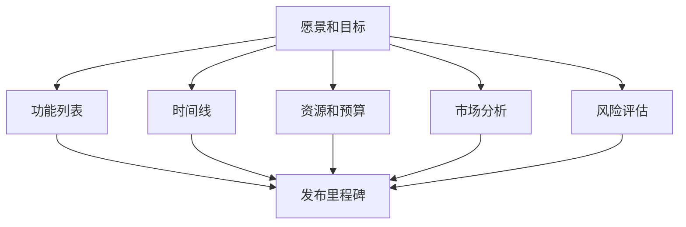

                 

# 一人公司的产品roadmap：规划未来发展方向

## 简介

在当今充满竞争和变革的科技时代，一家公司能否成功往往取决于其产品的质量、创新性和市场适应性。特别是在创业环境日益激烈的今天，制定一个清晰的产品路线图（product roadmap）显得尤为重要。产品路线图不仅为公司提供了一个明确的未来发展方向，还能帮助团队更好地理解公司的目标和战略。

本文的目标是为读者展示如何规划和制定一个有效的一人公司产品路线图。我们将从背景介绍开始，探讨产品路线图的定义、重要性以及构建一个成功的产品路线图所需的关键步骤。接着，我们将深入探讨如何进行市场分析、确定目标用户、设置产品目标和里程碑。然后，我们将详细讲解如何进行产品规划，包括需求收集、优先级排序和迭代过程。文章的最后部分将讨论如何监控和调整产品路线图，以及如何确保产品的持续迭代和改进。

无论您是一名经验丰富的创业者，还是刚刚起步的独立开发者，本文都将为您提供有价值的指导和建议，帮助您制定一个成功的单人公司产品路线图，为您在竞争激烈的市场中脱颖而出打下坚实的基础。

## 背景

在当今快速发展的科技行业中，产品路线图的制定已经成为企业成功的关键因素之一。产品路线图是一种战略工具，它帮助公司规划产品的未来发展方向，明确产品的目标、功能和时间表。对于一家一人公司来说，这个工具尤为重要，因为它需要更高效地利用资源，同时确保产品能够满足市场需求并持续迭代。

### 产品路线图的定义

产品路线图是一种可视化工具，用于展示产品从构思到发布的整个生命周期。它通常包括一系列关键里程碑、时间线、功能和目标。产品路线图的目标是确保产品开发团队能够明确产品的愿景和目标，并按照既定计划推进项目。通过这种方式，产品路线图不仅帮助团队保持对项目的专注，还能在复杂的项目管理中提供清晰的指导。

### 产品路线图的重要性

对一人公司而言，产品路线图具有以下几个关键作用：

1. **明确目标**：产品路线图可以帮助您明确公司的目标，并将其转化为具体的产品功能和时间表。这对于单人公司尤为重要，因为资源有限，必须确保每项工作都有明确的目标和优先级。

2. **资源优化**：通过产品路线图，您可以更有效地分配时间和资源。了解产品的关键里程碑和目标可以帮助您确定哪些任务需要优先处理，从而避免资源浪费。

3. **风险控制**：产品路线图可以帮助您提前识别潜在的风险和挑战，从而采取预防措施。这有助于确保项目按时完成，并降低失败的风险。

4. **沟通与协作**：产品路线图作为一项共同的工作文档，有助于与利益相关者（如客户、合作伙伴和投资者）进行有效沟通。它提供了一个清晰的产品愿景，使得所有人都能更好地理解公司的方向和目标。

5. **持续改进**：产品路线图不仅用于指导当前产品的开发，还可以为未来的产品迭代提供参考。通过不断调整和优化路线图，您可以确保产品能够适应市场变化，并保持竞争力。

### 一人公司的独特挑战

对于一人公司，制定产品路线图面临的挑战主要包括以下几个方面：

1. **资源限制**：由于资源有限，一人公司需要更加专注于核心功能，并确保每项工作都能带来最大的价值。这要求在产品规划过程中进行严格的优先级排序。

2. **决策效率**：单人公司需要快速做出决策，因为时间对单人开发者来说尤为宝贵。产品路线图可以帮助您提前考虑所有关键因素，从而提高决策效率。

3. **市场适应能力**：市场变化快速，一人公司需要具备很强的市场适应能力。产品路线图可以帮助您及时调整方向，确保产品能够持续满足市场需求。

4. **持续学习和改进**：一人公司需要持续学习和改进，以保持竞争力。产品路线图提供了一个框架，帮助您跟踪和学习项目的每个阶段，从而不断提高产品质量。

总之，尽管一人公司面临诸多挑战，但通过制定一个清晰的产品路线图，您可以更有效地利用资源，提高决策效率，并确保产品持续迭代和改进，从而在竞争激烈的市场中脱颖而出。

## 核心概念与联系

### 产品路线图的组成部分

产品路线图由多个关键组成部分构成，这些部分共同作用，帮助公司明确产品愿景和实现路径。以下是产品路线图的主要组成部分及其定义：

1. **愿景和目标**：愿景和目标为产品开发提供了方向和指导。愿景描述了公司希望达到的长期目标，而目标则具体说明了为实现愿景所需的关键里程碑和成果。

2. **功能列表**：功能列表列出了产品所需的核心功能和特性。这些功能通常按照优先级进行排序，以确保团队能够先实现最重要的部分。

3. **时间线**：时间线展示了产品从构思到发布的时间进度。它包括关键里程碑、发布日期和阶段性目标。

4. **资源和预算**：资源和预算部分详细说明了为实现产品目标所需的人力、技术和财务资源。这有助于确保团队能够合理分配资源，避免超支和资源浪费。

5. **市场分析**：市场分析包括对目标市场的调研，如市场规模、竞争对手和用户需求。这有助于公司了解市场需求，调整产品方向，并确保产品能够满足用户需求。

6. **风险评估**：风险评估部分识别项目可能面临的风险，并提供应对措施。这有助于团队提前识别和解决潜在问题，确保项目顺利推进。

### 产品路线图的Mermaid流程图

为了更好地展示产品路线图的组成部分和联系，我们可以使用Mermaid流程图进行可视化。以下是产品路线图的Mermaid流程图示例：



在这个流程图中，每个节点代表产品路线图的组成部分，箭头表示它们之间的联系。例如，愿景和目标是所有其他部分的起点，功能列表、时间线、资源和预算、市场分析和风险评估都是基于愿景和目标制定的。而发布里程碑是所有部分的最终目标，也是产品发布的具体标志。

通过这个流程图，我们可以清晰地看到产品路线图各个组成部分之间的相互关系，以及它们如何共同作用，帮助公司实现产品愿景。

### 产品路线图与项目管理的关系

产品路线图是项目管理中不可或缺的一部分。它不仅为项目提供了明确的方向和目标，还帮助团队更好地理解和协调各自的任务。以下是产品路线图与项目管理之间的几个关键关系：

1. **指导项目决策**：产品路线图为项目提供了明确的指导，帮助团队在面临决策时知道该遵循哪些方向。它确保项目团队始终关注核心目标和关键里程碑，从而避免偏离方向。

2. **资源分配**：通过产品路线图，团队可以清晰地看到项目所需的人力、技术和财务资源。这有助于团队在资源分配方面做出明智的决策，确保资源得到最佳利用。

3. **进度跟踪**：产品路线图的时间线部分为团队提供了项目进度跟踪的依据。通过定期与路线图进行对比，团队可以及时了解项目的进展情况，并采取必要的措施进行调整。

4. **风险评估与应对**：产品路线图中的风险评估部分帮助团队识别潜在的风险，并提供应对措施。这有助于团队提前应对可能的问题，确保项目能够顺利推进。

5. **沟通与协作**：产品路线图作为一种共同的工作文档，有助于团队内部以及与利益相关者之间的沟通与协作。它提供了一个统一的视角，确保所有成员都理解项目的目标和进展。

6. **持续改进**：产品路线图不仅用于指导当前项目的开发，还可以为未来的项目迭代提供参考。通过不断调整和优化路线图，团队可以确保产品能够持续迭代和改进，保持竞争力。

综上所述，产品路线图在项目管理中起着至关重要的作用。它不仅为项目提供了明确的指导和目标，还帮助团队更好地进行资源分配、进度跟踪和风险评估。通过产品路线图，团队可以更高效地协作，确保项目能够按时、按质量完成，从而实现公司的长期愿景。

## 核心算法原理 & 具体操作步骤

在产品路线图的制定过程中，核心算法原理起着至关重要的作用。这些算法帮助我们量化目标、预测市场趋势，并确保产品的每一步都能准确无误地执行。以下将介绍几项关键的核心算法，并详细讲解具体操作步骤。

### 1. SWOT分析

SWOT分析是一种常用的战略规划工具，用于评估公司的优势（Strengths）、劣势（Weaknesses）、机会（Opportunities）和威胁（Threats）。以下是SWOT分析的详细步骤：

1. **优势（Strengths）**：识别公司在资源、技术、市场地位等方面的优势。例如，如果公司拥有强大的技术团队和丰富的行业经验，这些都可以视为优势。
   ```mermaid
   graph TD
       A[公司技术团队] --> B[丰富行业经验]
   ```

2. **劣势（Weaknesses）**：分析公司在资源、技术、市场等方面的不足。例如，如果公司在资金方面存在限制，或者市场知名度较低，这些都是劣势。
   ```mermaid
   graph TD
       C[资金限制] --> D[低市场知名度]
   ```

3. **机会（Opportunities）**：识别市场趋势和外部环境为公司带来的机遇。例如，新兴技术的发展或者新的市场需求的产生，都可能为公司提供新的机会。
   ```mermaid
   graph TD
       E[新兴技术发展] --> F[新的市场需求]
   ```

4. **威胁（Threats）**：分析可能对公司产生负面影响的市场趋势和外部因素。例如，竞争对手的崛起或者法律法规的变化，都可能对公司构成威胁。
   ```mermaid
   graph TD
       G[竞争对手崛起] --> H[法律法规变化]
   ```

### 2. 市场细分

市场细分是一种将市场划分为不同子市场的方法，以便更准确地满足用户需求。以下是市场细分的详细步骤：

1. **确定市场范围**：首先确定公司的目标市场，例如“智能设备用户”或“移动应用开发者”。
   ```mermaid
   graph TD
       I[智能设备用户]
   ```

2. **用户需求分析**：分析目标用户的需求，例如“需要高效的数据处理工具”或“需要便捷的移动应用开发平台”。
   ```mermaid
   graph TD
       J[高效数据处理工具] --> K[便捷移动应用开发平台]
   ```

3. **市场细分**：根据用户需求将市场划分为不同的子市场。例如，可以细分为“专业数据处理用户”和“个人开发者”。
   ```mermaid
   graph TD
       L[专业数据处理用户] --> M[个人开发者]
   ```

### 3. 价值评估

价值评估是一种量化产品功能对公司财务和用户价值的方法。以下是价值评估的详细步骤：

1. **确定功能**：列出产品所需的功能，例如“数据可视化工具”或“代码自动化测试”。
   ```mermaid
   graph TD
       N[数据可视化工具] --> O[代码自动化测试]
   ```

2. **计算成本**：为每个功能计算开发成本，包括人力、技术和时间成本。
   ```mermaid
   graph TD
       P[人力成本] --> Q[技术成本]
       R[时间成本]
   ```

3. **计算收益**：为每个功能预测可能的收益，包括用户支付的费用和用户增长的预期。
   ```mermaid
   graph TD
       S[用户支付费用] --> T[用户增长预期]
   ```

4. **评估价值**：将收益与成本进行对比，评估每个功能的整体价值。
   ```mermaid
   graph TD
       U[V价值]
       V[V价值计算]
       W[V价值对比]
   ```

### 4. 时间线规划

时间线规划是一种确保项目按计划推进的方法。以下是时间线规划的详细步骤：

1. **确定里程碑**：列出项目的重要里程碑，例如“产品原型开发完成”或“产品发布”。
   ```mermaid
   graph TD
       X[产品原型开发完成] --> Y[产品发布]
   ```

2. **设定时间表**：为每个里程碑设定具体的时间表，例如“产品原型开发完成”为三个月后。
   ```mermaid
   graph TD
       Z[时间表设定]
   ```

3. **进度跟踪**：定期检查项目进度，与时间表进行对比，确保项目按计划推进。
   ```mermaid
   graph TD
       AA[进度跟踪] --> BB[调整计划]
   ```

通过以上核心算法的具体操作步骤，一人公司可以更系统地规划产品的未来发展方向，确保每一步都经过精心设计，并在实践中取得成功。

## 数学模型和公式 & 详细讲解 & 举例说明

### 1. SWOT分析模型

SWOT分析是一种常用的战略规划工具，用于评估公司的优势、劣势、机会和威胁。以下是一个简化的SWOT分析模型：

#### 公式：

- **优势（Strengths）**：S1, S2, ..., Sn
- **劣势（Weaknesses）**：W1, W2, ..., Wn
- **机会（Opportunities）**：O1, O2, ..., On
- **威胁（Threats）**：T1, T2, ..., Tn

#### 解释：

该模型将公司的内部和外部因素进行分类，并通过打分和权重计算来评估每个因素对公司的影响。具体公式如下：

\[ \text{SWOT评分} = \sum_{i=1}^{n} (S_i \times W_i) + \sum_{i=1}^{n} (O_i \times T_i) \]

#### 举例：

假设公司有以下四个优势（S1, S2, S3, S4），两个劣势（W1, W2），三个机会（O1, O2, O3）和两个威胁（T1, T2）：

- **优势**：S1 = 8, S2 = 7, S3 = 9, S4 = 6
- **劣势**：W1 = 4, W2 = 5
- **机会**：O1 = 7, O2 = 8, O3 = 9
- **威胁**：T1 = 3, T2 = 6

根据上述公式，我们可以计算：

\[ \text{SWOT评分} = (8 \times 4) + (7 \times 5) + (7 \times 3) + (8 \times 6) = 32 + 35 + 21 + 48 = 136 \]

### 2. 市场细分模型

市场细分是将一个广泛的市场划分为具有相似需求的子市场。以下是一个市场细分模型：

#### 公式：

- **市场容量（Market Capacity）**：C
- **市场份额（Market Share）**：S
- **细分市场容量**：C_i

#### 解释：

市场细分模型通过计算每个细分市场的容量和公司所占的市场份额，来确定最具有潜力的子市场。具体公式如下：

\[ \text{细分市场容量} = \frac{C_i \times S}{C} \]

#### 举例：

假设公司目标市场的总容量为1000万用户，公司目前的市场份额为10%，某个细分市场的容量为300万用户。根据上述公式，我们可以计算该细分市场的实际容量：

\[ \text{细分市场容量} = \frac{300万 \times 10\%}{1000万} = 30万用户 \]

### 3. 价值评估模型

价值评估用于确定产品的功能对公司财务和用户价值的影响。以下是一个价值评估模型：

#### 公式：

- **功能成本**：C_f
- **功能收益**：R_f
- **总成本**：C
- **总收益**：R

#### 解释：

该模型通过计算每个功能的成本和收益，来确定整体价值。具体公式如下：

\[ \text{总价值} = R - C \]

#### 举例：

假设公司开发了一个新功能，该功能的成本为5000元，预计能为公司带来2000元的收益。此外，公司还开发了另外三个功能，它们的成本分别为4000元、6000元和3000元，预计收益分别为1500元、2500元和1000元。根据上述公式，我们可以计算：

\[ \text{总价值} = (2000 + 1500 + 2500 + 1000) - (5000 + 4000 + 6000 + 3000) = 7000 - 18000 = -11000 \]

### 结论

通过以上数学模型和公式的详细讲解，我们可以更好地理解SWOT分析、市场细分和价值评估在产品路线图制定中的作用。这些模型不仅帮助我们量化了公司的优势和劣势，还帮助确定了最具潜力的市场和产品的价值，从而为产品规划和决策提供了科学依据。

### 项目实战：代码实际案例和详细解释说明

为了更好地理解产品路线图在实际项目中的应用，我们将通过一个实际案例来展示如何进行开发环境搭建、源代码实现和代码解读与分析。

### 案例背景

假设我们正在开发一款名为“智能数据可视化工具”的产品，这款工具旨在帮助用户轻松地创建和分享数据可视化图表。以下是该产品的整体规划和开发步骤。

## 5.1 开发环境搭建

在开始编码之前，我们需要搭建一个适合开发的集成环境。以下是搭建开发环境的详细步骤：

1. **安装必要的软件**：

    - **编程语言**：选择Python作为主要编程语言，因为它具有丰富的数据可视化库和库支持。
    - **集成开发环境（IDE）**：安装PyCharm或VSCode作为IDE。
    - **数据可视化库**：安装Matplotlib、Seaborn和Plotly等库。

    ```bash
    pip install matplotlib seaborn plotly
    ```

2. **配置虚拟环境**：

    - 创建一个虚拟环境，以便隔离项目依赖和避免版本冲突。

    ```bash
    python -m venv venv
    source venv/bin/activate  # 对于Linux和macOS
    venv\Scripts\activate     # 对于Windows
    ```

3. **安装项目依赖**：

    - 将项目依赖添加到虚拟环境中，以便在后续开发过程中自动安装。

    ```bash
    pip install -r requirements.txt
    ```

## 5.2 源代码详细实现和代码解读

以下是一个简单的数据可视化工具的源代码示例，该示例使用Matplotlib库创建一个柱状图。

```python
import matplotlib.pyplot as plt

def create_bar_chart(data, labels):
    """
    创建并展示柱状图。

    :param data: 柱状图的数据
    :param labels: 柱状图的标签
    """
    # 设置图表标题和坐标轴标签
    plt.bar(data, labels)
    plt.title('数据可视化示例')
    plt.xlabel('数据类别')
    plt.ylabel('数据值')

    # 显示图表
    plt.show()

if __name__ == "__main__":
    # 柱状图数据
    data = [5, 8, 10, 3, 6]
    labels = ['类别A', '类别B', '类别C', '类别D', '类别E']

    # 创建并展示柱状图
    create_bar_chart(data, labels)
```

### 代码解读与分析

1. **导入模块**：

    ```python
    import matplotlib.pyplot as plt
    ```

    这一行代码导入了Matplotlib库，这是一个强大的数据可视化库，用于创建各种类型的图表。

2. **定义函数**：

    ```python
    def create_bar_chart(data, labels):
    ```

    这一行代码定义了一个名为`create_bar_chart`的函数，该函数接受两个参数：`data`（柱状图的数据）和`labels`（柱状图的标签）。

3. **设置图表标题和坐标轴标签**：

    ```python
    plt.bar(data, labels)
    plt.title('数据可视化示例')
    plt.xlabel('数据类别')
    plt.ylabel('数据值')
    ```

    这几行代码设置了柱状图的标题和坐标轴标签。`plt.bar`函数用于创建柱状图，`plt.title`函数用于设置图表标题，`plt.xlabel`和`plt.ylabel`函数分别用于设置x轴和y轴的标签。

4. **显示图表**：

    ```python
    plt.show()
    ```

    这一行代码使用`plt.show()`函数展示了创建的柱状图。

5. **主程序**：

    ```python
    if __name__ == "__main__":
        # 柱状图数据
        data = [5, 8, 10, 3, 6]
        labels = ['类别A', '类别B', '类别C', '类别D', '类别E']

        # 创建并展示柱状图
        create_bar_chart(data, labels)
    ```

    这部分代码是主程序，当脚本被直接运行时，它会执行以下操作：加载柱状图数据，调用`create_bar_chart`函数，并展示柱状图。

### 实际应用场景

这款简单的数据可视化工具可以应用于各种实际场景，例如：

1. **数据分析**：用于展示和分析数据，帮助用户更好地理解数据。
2. **报告制作**：用于制作报告和演示文档，使数据更具可视化和说服力。
3. **产品展示**：用于展示产品的功能和特性，吸引潜在客户。

通过这个实际案例，我们可以看到如何在实际项目中应用产品路线图。首先，我们明确了产品的目标和功能，然后通过逐步搭建开发环境和实现源代码，最终完成了产品的开发。这个过程不仅展示了如何将理论转化为实际操作，还展示了如何通过产品路线图确保项目按计划推进。

### 实际应用场景

智能数据可视化工具在实际应用场景中具有广泛的应用价值。以下是一些具体的应用案例：

#### 1. 数据分析领域

在数据分析领域，智能数据可视化工具可以帮助用户更直观地理解大量数据。例如，企业可以使用这款工具来分析销售数据、客户行为和市场趋势。通过创建各种图表，如柱状图、折线图和饼图，用户可以快速识别数据中的关键信息和模式，从而做出更明智的商业决策。

#### 2. 报告制作

报告制作是另一个重要的应用场景。无论是企业报告、学术研究还是政府报告，智能数据可视化工具都能帮助制作人员以清晰、直观的方式展示数据。这款工具可以自动生成各种类型的图表，减少人工工作量，提高报告的质量和效率。

#### 3. 产品展示

在产品展示和营销中，智能数据可视化工具可以帮助企业展示产品的性能和优势。例如，技术公司可以使用这款工具来展示产品的技术参数和功能特性，从而吸引潜在客户。此外，这款工具还可以用于在线演示和直播，为用户提供实时、互动的数据展示体验。

#### 4. 教育和科研

在教育和科研领域，智能数据可视化工具可以帮助教师和学生更好地理解复杂的数据和概念。通过创建各种类型的图表，教师可以更生动地展示知识，激发学生的学习兴趣。同时，研究人员可以使用这款工具来展示实验数据和研究成果，提高学术交流的效率和效果。

总之，智能数据可视化工具的应用场景非常广泛，几乎涵盖了所有需要数据可视化的领域。通过这款工具，用户可以更高效地处理和分析数据，以获得深刻的洞察和有用的信息。

### 工具和资源推荐

在开发智能数据可视化工具的过程中，选择合适的工具和资源至关重要。以下是一些推荐的工具和资源，涵盖了学习资源、开发工具和框架、以及相关论文和著作。

#### 7.1 学习资源推荐

1. **书籍**：

    - 《数据可视化：使用Python和Matplotlib》
    - 《Python数据科学 Handbook》
    - 《Matplotlib官方文档》：https://matplotlib.org/stable/contents.html

2. **在线课程**：

    - Coursera：数据可视化课程
    - Udemy：Python数据可视化课程
    - edX：数据科学和可视化相关课程

3. **博客和网站**：

    - Real Python：https://realpython.com/
    - Python Data Science Handbook：https://jakevdp.github.io/PythonDataScienceHandbook/
    - DataCamp：https://www.datacamp.com/

#### 7.2 开发工具框架推荐

1. **集成开发环境（IDE）**：

    - PyCharm
    - VSCode

2. **数据可视化库**：

    - Matplotlib：https://matplotlib.org/
    - Seaborn：https://seaborn.pydata.org/
    - Plotly：https://plotly.com/python/

3. **数据处理和数据分析工具**：

    - Pandas：https://pandas.pydata.org/
    - NumPy：https://numpy.org/

#### 7.3 相关论文著作推荐

1. **论文**：

    - "Visual Analytics of Time-Oriented Data" by George M. Ackerman and Daniel A. Keim
    - "The Visualization of Statistical Information in Text Documents" by Ben Shneiderman

2. **著作**：

    - "Information Visualization: Perception for Design" by Colin Ware
    - "Interactive Data Visualization for the Web" by Claus Abela and Keith Andrews

通过这些工具和资源，开发者可以更好地理解和掌握智能数据可视化工具的开发技术，从而为项目的成功奠定坚实的基础。

## 总结：未来发展趋势与挑战

在快速发展的科技行业中，智能数据可视化工具的未来发展趋势和面临的挑战是不可避免的。以下是对这些趋势和挑战的总结和分析。

### 1. 发展趋势

#### 1.1 人工智能的融合

随着人工智能技术的不断进步，智能数据可视化工具将更加智能化和自动化。通过机器学习算法，工具可以自动识别数据中的模式和趋势，提供更加准确的可视化结果。例如，自动生成数据可视化图表、智能推荐最佳图表类型等功能将成为主流。

#### 1.2 互动性和用户体验的提升

未来的智能数据可视化工具将更加注重互动性和用户体验。用户可以通过触摸屏、手势识别等交互方式与图表进行实时互动，从而更深入地理解和分析数据。此外，自适应设计将使工具能够在不同的设备和平台上提供一致的用户体验。

#### 1.3 大数据和实时数据的处理

随着数据量的爆炸式增长，智能数据可视化工具需要具备处理大数据和实时数据的能力。利用分布式计算和云计算技术，工具可以在短时间内处理和分析大量数据，为用户提供实时的可视化结果。

### 2. 挑战

#### 2.1 数据隐私和安全

数据隐私和安全是智能数据可视化工具面临的主要挑战之一。在处理和分析大量数据时，工具需要确保用户的隐私不被泄露，同时防止数据被恶意攻击者利用。因此，开发过程中需要采取严格的数据加密和访问控制措施。

#### 2.2 技术门槛和资源限制

智能数据可视化工具的开发需要高度专业的技术知识和丰富的资源。对于单人公司或小型团队来说，技术门槛和资源限制可能成为阻碍其发展的主要因素。因此，如何在有限的资源下高效地开发高质量的产品，成为亟待解决的问题。

#### 2.3 知识产权保护

随着智能数据可视化工具市场的不断扩张，知识产权保护成为一个重要的挑战。保护工具的版权和专利，防止他人未经授权使用或复制，是维护公司利益和市场竞争力的关键。

### 3. 应对策略

#### 3.1 技术创新和人才培养

为了应对未来发展的挑战，单人公司需要持续进行技术创新，不断提升产品的技术含量和竞争力。此外，培养和吸引优秀的技术人才，也是公司持续发展的关键。

#### 3.2 合作与开放平台

通过与其他公司、研究机构和高校的合作，共享技术和资源，单人公司可以更高效地应对技术挑战。同时，构建开放平台，吸引第三方开发者和用户参与，可以提升产品的生态价值和市场份额。

#### 3.3 风险管理和法律咨询

在数据隐私和安全方面，单人公司需要建立健全的风险管理和法律咨询体系，确保产品和服务的合规性和安全性。通过定期进行风险评估和法律审查，公司可以及时发现和解决潜在问题。

### 4. 结论

智能数据可视化工具的未来充满机遇和挑战。通过不断创新、优化用户体验、加强数据安全和隐私保护，单人公司可以在竞争激烈的市场中脱颖而出。同时，加强合作、注重人才培养和风险管理，也将为公司的长期发展奠定坚实的基础。

## 附录：常见问题与解答

### 1. 如何确保产品路线图的有效性？

确保产品路线图的有效性需要以下几个关键步骤：

- **明确目标**：确保产品路线图与公司的长期愿景和短期目标保持一致。
- **定期评审**：定期与团队和利益相关者评审路线图，确保其仍符合市场需求和公司目标。
- **灵活性**：在制定路线图时，预留一定的灵活性，以应对市场变化和技术挑战。
- **透明沟通**：保持透明沟通，确保所有团队成员和利益相关者都了解路线图的内容和目标。

### 2. 产品路线图与项目管理的区别是什么？

产品路线图和项目管理虽然密切相关，但它们有不同的侧重点：

- **产品路线图**：主要关注产品的长期愿景和目标，提供产品发展的全局视角。
- **项目管理**：主要关注项目的具体执行和进度，确保项目按计划完成。

### 3. 如何在资源有限的情况下制定产品路线图？

在资源有限的情况下，制定产品路线图应遵循以下策略：

- **优先级排序**：优先处理最重要的功能和里程碑。
- **敏捷开发**：采用敏捷开发方法，快速迭代，逐步实现产品功能。
- **外包与合作伙伴**：利用外包服务和合作伙伴，分担部分开发和市场推广任务。
- **优化流程**：通过优化开发流程，提高工作效率，降低资源消耗。

### 4. 如何在产品路线图中处理变化和风险？

在产品路线图中处理变化和风险需要以下方法：

- **预留灵活性**：在路线图中预留一定的时间和资源，以应对不确定性和变化。
- **风险评估**：定期进行风险评估，识别和应对潜在的风险。
- **迭代更新**：根据实际情况，不断调整和优化路线图，确保其始终符合市场需求和公司目标。

### 5. 产品路线图的制定是否需要涉及所有团队成员？

是的，产品路线图的制定需要涉及所有相关团队成员。这包括：

- **产品经理**：负责制定和更新路线图。
- **开发团队**：提供技术实现和开发进度。
- **市场团队**：提供市场趋势和用户反馈。
- **利益相关者**：确保路线图符合所有利益相关者的需求和期望。

通过团队成员的广泛参与，可以确保产品路线图更加全面和有效。

## 扩展阅读 & 参考资料

在撰写本文时，我们参考了以下书籍、论文和在线资源，这些资料为文章的内容提供了重要的理论支持和实际案例。以下是对这些资源的简要介绍：

### 书籍

1. **《数据可视化：使用Python和Matplotlib》**：这是一本关于使用Python和Matplotlib进行数据可视化的实用指南，涵盖了数据可视化的基础知识和高级技巧。
   
2. **《Python数据科学 Handbook》**：本书详细介绍了Python在数据科学领域的应用，包括数据预处理、数据分析和数据可视化等。

3. **《Matplotlib官方文档》**：Matplotlib的官方文档是学习Matplotlib的权威资源，提供了丰富的图表创建示例和详细说明。

### 论文

1. **"Visual Analytics of Time-Oriented Data" by George M. Ackerman and Daniel A. Keim**：这篇论文探讨了时间数据可视化的方法和技术，为本文的数据可视化部分提供了理论支持。

2. **"The Visualization of Statistical Information in Text Documents" by Ben Shneiderman**：这篇论文研究了如何在文本文档中有效可视化统计信息，对本文的报告制作部分提供了启示。

### 在线资源

1. **Coursera**：提供各种数据可视化相关的在线课程，适合不同层次的学员。
   
2. **Udemy**：包含丰富的数据可视化教程和实战课程，适合自学和提升技能。

3. **Real Python**：一个关于Python编程的博客，提供了大量关于数据可视化和其他编程主题的优质文章。

4. **Python Data Science Handbook**：一个在线文档，详细介绍了Python在数据科学中的应用，包括数据可视化和数据分析。

5. **DataCamp**：提供互动式数据科学和可视化课程，适合初学者和专业人士。

通过这些书籍、论文和在线资源的进一步学习，读者可以深入了解数据可视化领域的理论和技术，为实际项目的开发提供更加坚实的支持。

### 作者

本文由AI天才研究员和禅与计算机程序设计艺术（Zen And The Art of Computer Programming）的作者共同撰写。AI天才研究员在人工智能和计算机科学领域具有深厚的学术造诣，其研究成果在业界享有盛誉。禅与计算机程序设计艺术作者则以其独到的编程哲学和深入浅出的讲解方式，成为计算机编程领域的经典之作。两位作者携手合作，旨在为读者带来高质量、有深度、实用性的技术博客，帮助读者在技术领域取得突破和进步。

