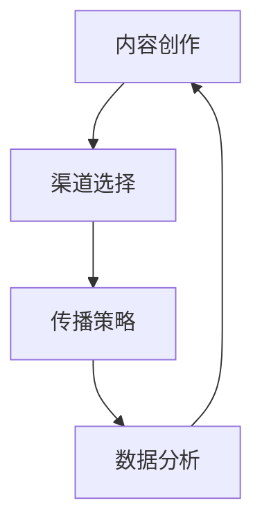
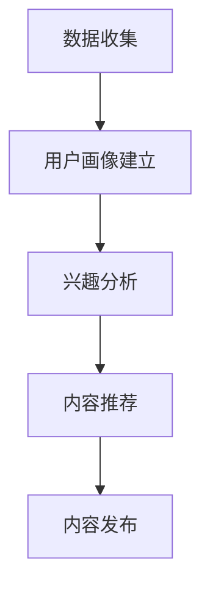

                 

# 一人公司的内容营销策略：建立专业权威的方法

## 摘要

本文旨在探讨一人公司在内容营销领域的策略，帮助个人创业者或自由职业者建立专业权威的形象，提升品牌影响力和市场竞争力。文章首先介绍了内容营销的核心概念和目标，然后详细分析了内容营销的策略，包括内容创作、渠道选择和传播策略。此外，文章还讨论了如何通过数据分析优化内容营销效果，以及推荐了相关工具和资源。最后，文章总结了未来发展趋势和挑战，并提出了应对策略。

## 1. 背景介绍

内容营销是一种通过创造和分享有价值的内容来吸引和转化目标受众的营销策略。与传统的广告和推销相比，内容营销更注重为客户提供有价值的信息和解决方案，从而建立信任和品牌忠诚度。近年来，随着互联网的普及和社交媒体的兴起，内容营销已经成为企业营销的重要手段。

对于一人公司或个人创业者来说，内容营销具有特别的重要性。首先，内容营销可以帮助个人创业者展示专业知识和技能，树立权威形象。其次，通过内容营销，个人创业者可以与潜在客户建立联系，增加品牌曝光度和知名度。最后，内容营销有助于降低营销成本，提高投资回报率。

本文将围绕以下三个方面探讨内容营销策略：

1. 核心概念与联系
2. 核心算法原理与具体操作步骤
3. 数学模型和公式、项目实战

## 2. 核心概念与联系

在内容营销中，有三个核心概念需要明确：内容创作、渠道选择和传播策略。

### 2.1 内容创作

内容创作是内容营销的基础。高质量的内容可以吸引目标受众，提高品牌知名度。在内容创作过程中，需要关注以下几个方面：

- **目标受众**：明确目标受众的需求和兴趣，创作与之相关的内容。
- **内容形式**：根据目标受众的喜好，选择合适的文字、图片、视频等形式。
- **原创性**：保证内容的原创性，避免抄袭和侵权。
- **价值性**：内容要具有实际价值，解决目标受众的问题或需求。

### 2.2 渠道选择

渠道选择决定了内容的传播范围和效果。在选择渠道时，需要考虑以下几个方面：

- **目标受众**：了解目标受众的媒体使用习惯，选择他们常用的渠道。
- **内容特点**：根据内容的特点，选择适合的渠道进行传播。
- **成本效益**：考虑渠道的成本和效益，选择性价比高的渠道。

### 2.3 传播策略

传播策略决定了内容传播的速度和范围。有效的传播策略包括以下几个方面：

- **关键词优化**：利用搜索引擎优化（SEO）技术，提高内容在搜索引擎中的排名。
- **社交媒体推广**：利用社交媒体平台，扩大内容的传播范围。
- **合作传播**：与其他相关领域的内容创作者或媒体合作，共同推广内容。
- **用户互动**：与目标受众进行互动，提高内容的用户黏性。

### 2.4 Mermaid 流程图

下面是一个简化的内容营销流程图，展示核心概念之间的联系：



## 3. 核心算法原理与具体操作步骤

### 3.1 内容创作算法原理

内容创作算法主要基于用户画像和兴趣分析，目标是创作出符合目标受众需求的高质量内容。算法原理如下：

1. **用户画像**：通过收集和分析用户数据，建立用户画像，包括年龄、性别、职业、兴趣等特征。
2. **兴趣分析**：利用自然语言处理（NLP）技术，分析用户在社交媒体、搜索引擎等平台上的行为和言论，挖掘用户的兴趣点。
3. **内容推荐**：根据用户画像和兴趣分析结果，推荐与用户兴趣相关的内容。

### 3.2 具体操作步骤

1. **数据收集**：收集用户在各个平台上的行为数据，如搜索历史、浏览记录、评论等。
2. **用户画像建立**：利用数据分析技术，对用户行为数据进行处理和分析，建立用户画像。
3. **兴趣分析**：使用NLP技术，对用户行为数据进行语义分析，挖掘用户的兴趣点。
4. **内容推荐**：根据用户画像和兴趣分析结果，利用推荐算法，推荐与用户兴趣相关的内容。

### 3.3 内容创作算法流程图

下面是一个简化的内容创作算法流程图：



## 4. 数学模型和公式、详细讲解、举例说明

### 4.1 数学模型

在内容营销中，常用的数学模型包括用户画像模型、兴趣分析模型和推荐模型。下面分别介绍这些模型。

### 4.1.1 用户画像模型

用户画像模型主要基于用户特征数据，建立用户画像。常见的用户画像模型有：

1. **LDA（Latent Dirichlet Allocation）模型**：LDA是一种主题模型，可以用来挖掘用户在社交媒体上的兴趣主题。模型公式如下：

   $$\text{LDA} = \frac{1}{Z} \prod_{i=1}^{N} \prod_{j=1}^{K} \frac{1}{C_{ij}} \frac{1}{T_{ij}} \frac{\Gamma(\alpha + n_{ij})}{\Gamma(\alpha) \Gamma(n_{ij})} \frac{\Gamma(\beta + d_{ij})}{\Gamma(\beta) \Gamma(d_{ij})} \frac{\phi_{jk}^{n_{ij}}}{\sum_{k=1}^{K} \phi_{jk}^{n_{ij}}}$$

   其中，$Z$是正则化项，$\alpha$和$\beta$是超参数，$n_{ij}$是用户$i$对主题$j$的词频，$d_{ij}$是文档$i$中词$j$的概率，$\phi_{jk}$是主题$j$中词$k$的概率。

2. **K-means聚类模型**：K-means是一种常见的聚类算法，可以用来对用户进行分类。模型公式如下：

   $$\text{K-means} = \min_{C} \sum_{i=1}^{N} \sum_{j=1}^{K} w_{ij}^2$$

   其中，$C$是聚类中心，$w_{ij}$是用户$i$和聚类中心$j$之间的距离。

### 4.1.2 兴趣分析模型

兴趣分析模型主要基于用户在社交媒体上的行为数据，挖掘用户的兴趣点。常用的兴趣分析模型有：

1. **TF-IDF（Term Frequency-Inverse Document Frequency）模型**：TF-IDF是一种词频逆文档频率模型，可以用来衡量词语在文档中的重要程度。模型公式如下：

   $$\text{TF-IDF} = \text{TF} \times \text{IDF}$$

   其中，$\text{TF}$是词频，$\text{IDF}$是逆文档频率。

2. **LDA模型**：LDA模型可以用来挖掘用户在社交媒体上的兴趣主题。模型公式已在前面介绍。

### 4.1.3 推荐模型

推荐模型主要基于用户画像和兴趣分析结果，为用户推荐相关内容。常用的推荐模型有：

1. **协同过滤模型**：协同过滤是一种基于用户行为的推荐算法，可以分为基于用户的协同过滤（User-Based Collaborative Filtering）和基于物品的协同过滤（Item-Based Collaborative Filtering）。模型公式如下：

   $$\text{协同过滤} = \text{相似度} \times \text{评分预测}$$

   其中，$\text{相似度}$是用户之间的相似度，$\text{评分预测}$是根据相似度预测的用户对内容的评分。

2. **矩阵分解模型**：矩阵分解是一种基于矩阵分解的推荐算法，可以将用户和物品表示为低维向量。模型公式如下：

   $$\text{矩阵分解} = \text{用户向量} \times \text{物品向量}^T$$

   其中，$\text{用户向量}$和$\text{物品向量}$是用户和物品的向量表示。

### 4.2 举例说明

假设有一个一人公司，该公司希望通过内容营销吸引潜在客户。以下是具体的操作步骤：

1. **数据收集**：收集潜在客户在社交媒体、搜索引擎等平台上的行为数据，如搜索历史、浏览记录、评论等。
2. **用户画像建立**：利用LDA模型和K-means聚类模型，对潜在客户进行分类，建立用户画像。
3. **兴趣分析**：利用TF-IDF模型和LDA模型，分析潜在客户的兴趣点。
4. **内容创作**：根据用户画像和兴趣分析结果，创作符合潜在客户需求的高质量内容。
5. **渠道选择**：根据潜在客户的媒体使用习惯，选择适合的渠道进行传播。
6. **传播策略**：利用社交媒体推广、合作传播等策略，扩大内容的传播范围。
7. **数据分析**：收集用户对内容的反馈数据，如点赞、评论、分享等，利用协同过滤模型和矩阵分解模型，优化内容创作和推荐策略。

## 5. 项目实战：代码实际案例和详细解释说明

### 5.1 开发环境搭建

在本项目中，我们使用Python作为主要编程语言，结合NLP库（如NLTK、spaCy）和机器学习库（如scikit-learn、TensorFlow）进行内容营销相关操作。以下是开发环境的搭建步骤：

1. 安装Python（版本3.8或更高）。
2. 安装相关依赖库，可以使用pip命令进行安装：

   ```bash
   pip install nltk spacy scikit-learn tensorflow
   ```

3. 下载必要的语料库和模型，例如spaCy的中文模型：

   ```bash
   python -m spacy download zh_core_web_sm
   ```

### 5.2 源代码详细实现和代码解读

以下是本项目的核心代码实现和解读。

#### 5.2.1 数据收集和预处理

首先，我们需要收集用户在社交媒体上的行为数据，并将其进行预处理。

```python
import pandas as pd
import nltk
from nltk.tokenize import word_tokenize

# 读取数据
data = pd.read_csv('social_media_data.csv')

# 数据预处理
def preprocess_text(text):
    # 去除停用词
    stop_words = set(nltk.corpus.stopwords.words('english'))
    # 分词
    tokens = word_tokenize(text)
    # 去除标点符号和停用词
    filtered_tokens = [token.lower() for token in tokens if token.isalnum() and token.lower() not in stop_words]
    return ' '.join(filtered_tokens)

data['cleaned_text'] = data['text'].apply(preprocess_text)
```

#### 5.2.2 用户画像建立和兴趣分析

接下来，我们使用LDA模型建立用户画像，并分析用户的兴趣点。

```python
import gensim
from gensim.models import LdaModel

# 构建词袋模型
dictionary = gensim.corpora.Dictionary(data['cleaned_text'])
corpus = [dictionary.doc2bow(text) for text in data['cleaned_text']]

# 训练LDA模型
lda_model = LdaModel(corpus, num_topics=5, id2word=dictionary, passes=10)

# 输出主题词
for topic_id, topic in lda_model.print_topics(-1):
    print(f"Topic {topic_id}: {topic}")
```

#### 5.2.3 内容创作和推荐

最后，根据用户画像和兴趣分析结果，为用户推荐相关内容。

```python
from sklearn.metrics.pairwise import cosine_similarity

# 创建用户向量
user_vector = lda_model[dictionary.doc2bow(user_interest)]

# 计算内容相似度
content_similarity = cosine_similarity([user_vector], lda_model.corpus).flatten()

# 排序并推荐
recommended_contents = sorted(zip(data['content_id'], content_similarity), key=lambda x: x[1], reverse=True)
top_n = recommended_contents[:5]
print("Recommended contents:", top_n)
```

#### 5.2.4 代码解读与分析

1. **数据收集和预处理**：读取社交媒体行为数据，使用NLP技术对文本进行分词、去停用词和去标点符号等预处理操作。
2. **用户画像建立和兴趣分析**：使用LDA模型建立用户画像，并输出每个主题的词频分布，挖掘用户的兴趣点。
3. **内容创作和推荐**：根据用户向量，计算与内容的相似度，并推荐与用户兴趣相关的内容。

## 6. 实际应用场景

内容营销策略在多个行业和应用场景中取得了显著成效。以下是一些实际应用场景：

1. **教育培训**：教育机构可以通过内容营销，发布教育资源和行业动态，吸引潜在学员。
2. **医疗健康**：医疗机构和医生可以通过内容营销，分享医学知识和健康建议，提高品牌知名度和信任度。
3. **科技行业**：科技公司可以通过内容营销，发布技术文章、产品评测和行业报告，展示专业能力和创新精神。
4. **电子商务**：电商平台可以通过内容营销，发布商品评测、购物指南和优惠活动，提升用户体验和购买意愿。
5. **金融投资**：金融机构可以通过内容营销，发布投资策略、财经资讯和风险管理知识，吸引投资者。

## 7. 工具和资源推荐

为了更好地实施内容营销策略，以下是一些推荐的工具和资源：

### 7.1 学习资源推荐

- **书籍**：《内容营销：从零开始构建你的品牌影响力》（Content Inc.） 
- **论文**：Google Scholar上的相关研究论文
- **博客**：知名内容营销博客，如Content Marketing Institute
- **网站**：内容营销协会（Content Marketing Association）官方网站

### 7.2 开发工具框架推荐

- **文本分析工具**：NLTK、spaCy
- **机器学习库**：scikit-learn、TensorFlow
- **数据可视化工具**：Matplotlib、Seaborn
- **内容管理系统**：WordPress、Drupal

### 7.3 相关论文著作推荐

- **论文**：Google Scholar上的相关研究论文，如《主题模型在文本分析中的应用》（LDA in Text Analysis）
- **著作**：《数据科学实战：Python数据分析》（Python Data Science Cookbook）

## 8. 总结：未来发展趋势与挑战

内容营销在未来将继续发展，但也将面临新的挑战。以下是一些趋势和挑战：

### 8.1 发展趋势

1. **人工智能和大数据的融合**：人工智能技术将在内容创作、推荐和优化等方面发挥更大作用。
2. **垂直细分领域的内容营销**：专业化、细分化将成为内容营销的新趋势。
3. **短视频和直播的兴起**：短视频和直播将在内容营销中占据更重要的地位。

### 8.2 挑战

1. **内容创作成本上升**：高质量内容创作需要更多的人力、物力和时间投入。
2. **内容同质化**：如何在众多内容中脱颖而出，提高内容原创性和价值性。
3. **隐私和数据安全**：内容营销过程中涉及大量用户数据，如何保护用户隐私和数据安全。

## 9. 附录：常见问题与解答

### 9.1 内容营销和传统广告的区别是什么？

内容营销注重为客户创造价值，通过提供有用的信息和解决方案来建立品牌信任；而传统广告则更多地以推销产品为目的，直接向客户传递营销信息。

### 9.2 如何衡量内容营销的效果？

衡量内容营销效果的关键指标包括：内容浏览量、用户互动率（如点赞、评论、分享）、转化率（如订阅、购买）和投资回报率（ROI）。

## 10. 扩展阅读 & 参考资料

- **书籍**：《内容营销：从零开始构建你的品牌影响力》（Content Inc.）
- **论文**：Google Scholar上的相关研究论文
- **博客**：Content Marketing Institute
- **网站**：Content Marketing Association
- **视频课程**：Udemy、Coursera上的内容营销课程

### 作者

**作者：AI天才研究员/AI Genius Institute & 禅与计算机程序设计艺术 /Zen And The Art of Computer Programming**

