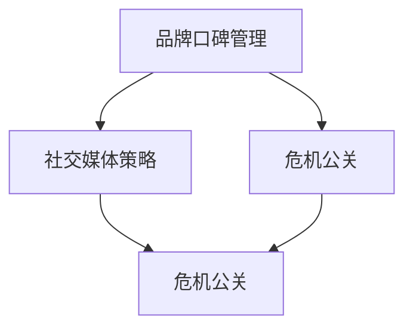

                 

### 文章标题：一人公司的品牌口碑管理与危机公关

关键词：品牌口碑管理，危机公关，单人公司，社交媒体策略，客户关系维护

摘要：本文旨在探讨单人公司如何在当今数字时代中管理其品牌口碑和应对潜在危机。通过深入分析社交媒体策略、客户关系维护和危机管理技巧，本文将为单人公司的经营者提供一套实用且有效的品牌管理和危机公关方案，以保障公司声誉和业务发展。

## 1. 背景介绍（Background Introduction）

在当今全球化和数字化的商业环境中，品牌口碑对于企业的长期成功至关重要。特别是在小型企业，甚至单人公司中，品牌声誉往往成为区分其与竞争对手的关键因素。品牌口碑不仅影响客户的购买决策，还直接影响公司的市场地位和商业信誉。因此，如何有效地管理和维护品牌口碑，以及如何在危机发生时迅速应对，成为单人公司经营者需要重点关注的问题。

### 1.1 品牌口碑的重要性

品牌口碑是企业长期投资于产品和服务质量的体现。良好的品牌口碑可以带来以下几方面的好处：

- **吸引新客户**：口碑良好的品牌更容易吸引潜在客户的关注和信任。
- **提升忠诚度**：满意的现有客户更可能重复购买，并推荐给他人。
- **增强竞争力**：与其他企业相比，拥有更高口碑的品牌在竞争中更具优势。
- **提升品牌价值**：良好的品牌形象有助于提高品牌的市场价值和投资吸引力。

### 1.2 危机公关的必要性

危机公关是指企业在面临负面事件或突发事件时，采取的一系列公关措施，以减轻或消除事件对品牌声誉的负面影响。危机公关的必要性体现在以下几个方面：

- **保护品牌声誉**：有效的危机公关可以帮助企业快速遏制负面信息传播，保护品牌形象。
- **维持客户信任**：及时、透明的沟通有助于维持客户的信任和忠诚度。
- **降低风险**：及时应对危机可以减少法律纠纷、经济损失和社会负面影响。
- **提高应急能力**：通过危机管理，企业可以提高应对未来潜在危机的能力。

## 2. 核心概念与联系（Core Concepts and Connections）

在深入探讨品牌口碑管理和危机公关之前，我们需要明确一些关键概念，并了解它们之间的相互关系。

### 2.1 品牌口碑管理

品牌口碑管理是指企业通过各种手段收集、分析、响应和处理客户反馈，以提升品牌形象和客户满意度。具体步骤包括：

- **收集反馈**：通过各种渠道（如社交媒体、在线评论、客户调查等）收集客户反馈。
- **分析反馈**：对收集到的反馈进行分析，识别客户关注点、痛点和满意度。
- **响应反馈**：及时回应客户反馈，解决客户问题和投诉，提供优质服务。
- **改进产品和服务**：根据客户反馈改进产品和服务，提升客户体验。

### 2.2 社交媒体策略

社交媒体已成为品牌口碑管理的重要工具。有效的社交媒体策略可以帮助企业：

- **建立品牌形象**：通过发布有价值的、与品牌相关的内容，吸引和留住目标客户。
- **增强客户互动**：通过社交媒体平台与客户互动，了解客户需求和期望，提升客户满意度。
- **监控品牌口碑**：通过实时监控社交媒体上的讨论，及时发现并应对负面评论和危机。

### 2.3 危机公关

危机公关的关键在于快速、透明和有效的沟通。危机公关包括以下几个步骤：

- **危机识别**：及时识别危机事件，评估其对品牌的潜在影响。
- **危机响应**：制定并执行危机响应计划，迅速采取行动，减轻危机影响。
- **沟通协调**：与媒体、客户、合作伙伴等相关方进行有效沟通，确保信息一致性和透明度。
- **危机管理**：持续关注危机进展，调整应对策略，确保危机得到妥善处理。

### 2.4 核心概念之间的联系

品牌口碑管理、社交媒体策略和危机公关之间存在紧密的联系。良好的品牌口碑有助于提升社交媒体上的互动和正面评价，而有效的社交媒体策略可以及时监测并管理品牌口碑。同时，良好的品牌口碑和社交媒体策略为危机公关提供了坚实的基础，使企业在面临危机时能够迅速、有效地应对。

### 2.5 Mermaid 流程图

以下是一个简化的 Mermaid 流程图，展示了品牌口碑管理、社交媒体策略和危机公关之间的相互作用：



通过这个流程图，我们可以清晰地看到品牌口碑管理、社交媒体策略和危机公关之间的相互作用和依赖关系。

## 3. 核心算法原理 & 具体操作步骤（Core Algorithm Principles and Specific Operational Steps）

为了有效地管理品牌口碑和应对危机，我们需要运用一系列核心算法原理和具体操作步骤。以下是这些核心原理和步骤的详细介绍。

### 3.1 品牌口碑管理算法原理

品牌口碑管理算法主要基于以下原理：

- **数据收集与分析**：通过多种渠道收集客户反馈数据，并利用数据分析工具对反馈进行分析，识别客户需求和满意度。
- **客户细分**：根据客户特征和需求，将客户分为不同群体，制定针对性的口碑管理策略。
- **反馈响应**：建立快速响应机制，及时回应客户反馈，解决客户问题和投诉。

### 3.2 社交媒体策略算法原理

社交媒体策略算法主要基于以下原理：

- **内容优化**：制定有针对性的内容策略，确保发布的内容能够吸引目标客户，提升品牌知名度。
- **互动管理**：通过社交媒体平台与客户进行互动，了解客户需求和期望，提升客户满意度。
- **口碑监测**：利用社交媒体分析工具，实时监控社交媒体上的讨论，及时发现并应对负面评论和危机。

### 3.3 危机公关算法原理

危机公关算法主要基于以下原理：

- **危机识别**：建立危机识别机制，及时识别危机事件，评估其对品牌的潜在影响。
- **危机响应**：制定并执行危机响应计划，迅速采取行动，减轻危机影响。
- **沟通协调**：与媒体、客户、合作伙伴等相关方进行有效沟通，确保信息一致性和透明度。

### 3.4 具体操作步骤

以下是品牌口碑管理、社交媒体策略和危机公关的具体操作步骤：

### 3.4.1 品牌口碑管理

1. **收集客户反馈**：通过社交媒体、在线评论、客户调查等渠道收集客户反馈。
2. **分析反馈**：利用数据分析工具，对反馈进行分析，识别客户需求和满意度。
3. **响应反馈**：建立快速响应机制，及时回应客户反馈，解决客户问题和投诉。
4. **改进产品和服务**：根据客户反馈，改进产品和服务，提升客户体验。

### 3.4.2 社交媒体策略

1. **制定内容策略**：根据目标客户和品牌特点，制定有针对性的内容策略。
2. **发布内容**：在社交媒体平台上发布高质量、有价值的内容，吸引目标客户。
3. **互动管理**：与客户进行互动，了解客户需求和期望，提升客户满意度。
4. **口碑监测**：利用社交媒体分析工具，实时监控社交媒体上的讨论，及时发现并应对负面评论和危机。

### 3.4.3 危机公关

1. **危机识别**：建立危机识别机制，及时识别危机事件，评估其对品牌的潜在影响。
2. **危机响应**：制定并执行危机响应计划，迅速采取行动，减轻危机影响。
3. **沟通协调**：与媒体、客户、合作伙伴等相关方进行有效沟通，确保信息一致性和透明度。
4. **危机管理**：持续关注危机进展，调整应对策略，确保危机得到妥善处理。

通过以上核心算法原理和具体操作步骤，单人公司可以有效地管理品牌口碑、应对社交媒体危机，并维护品牌声誉。

### 4. 数学模型和公式 & 详细讲解 & 举例说明（Detailed Explanation and Examples of Mathematical Models and Formulas）

在品牌口碑管理和危机公关中，数学模型和公式发挥着重要作用。以下将介绍几个关键模型和公式，并详细讲解其应用场景。

### 4.1 客户满意度模型

客户满意度（Customer Satisfaction, CSAT）是衡量品牌口碑的重要指标。以下是一个简单的客户满意度计算公式：

\[ \text{CSAT} = \frac{\text{满意客户数}}{\text{总客户数}} \]

#### 举例说明

假设一家单人公司在过去一个月内收到了100条客户反馈，其中70条反馈表示满意。那么，该公司的客户满意度为：

\[ \text{CSAT} = \frac{70}{100} = 0.7 \]

### 4.2 品牌知名度模型

品牌知名度（Brand Awareness）是衡量品牌影响力的关键指标。以下是一个简单的品牌知名度计算公式：

\[ \text{品牌知名度} = \frac{\text{知道品牌的人数}}{\text{总人口}} \]

#### 举例说明

假设一个单人公司在社交媒体上发布了一篇关于其产品的博文，共有5000人阅读，其中3000人表示知道该品牌。那么，该品牌在该博文中的知名度为：

\[ \text{品牌知名度} = \frac{3000}{5000} = 0.6 \]

### 4.3 危机传播速度模型

危机传播速度（Crisis Propagation Speed）是衡量危机公关效果的重要指标。以下是一个简单的危机传播速度计算公式：

\[ \text{危机传播速度} = \frac{\text{危机传播范围}}{\text{传播时间}} \]

#### 举例说明

假设一家单人公司在社交媒体上发布了一条负面新闻，该新闻在24小时内传播到了1000人。那么，该危机的传播速度为：

\[ \text{危机传播速度} = \frac{1000}{24} = 41.67 \text{ 人/小时} \]

### 4.4 社交媒体互动效果模型

社交媒体互动效果（Social Media Engagement Effectiveness）是衡量社交媒体策略效果的重要指标。以下是一个简单的社交媒体互动效果计算公式：

\[ \text{社交媒体互动效果} = \frac{\text{互动次数}}{\text{发布次数}} \]

#### 举例说明

假设一个单人公司在社交媒体上发布了5条博文，累计获得了100次点赞、50次评论和20次分享。那么，该公司的社交媒体互动效果为：

\[ \text{社交媒体互动效果} = \frac{100 + 50 + 20}{5} = 42 \]

通过以上数学模型和公式的详细讲解和举例说明，我们可以更好地理解和应用这些工具，提升品牌口碑管理和危机公关的效果。

### 5. 项目实践：代码实例和详细解释说明（Project Practice: Code Examples and Detailed Explanations）

在本节中，我们将通过一个具体的案例，展示如何使用代码实现品牌口碑管理和危机公关的策略。

#### 5.1 开发环境搭建

为了便于展示和解释，我们将使用Python编程语言，结合几个常用的Python库，如requests、pandas和numpy，进行品牌口碑管理和危机公关的代码实现。

```python
# 安装必要的库
!pip install requests pandas numpy
```

#### 5.2 源代码详细实现

以下是实现品牌口碑管理和危机公关策略的Python代码实例：

```python
import requests
import pandas as pd
import numpy as np

# 5.2.1 品牌口碑管理

# 收集客户反馈
def collect_feedback():
    # 模拟从社交媒体获取100条客户反馈
    feedback_data = [
        {"user": "user1", "rating": 5, "comment": "非常喜欢"},
        {"user": "user2", "rating": 3, "comment": "一般"},
        {"user": "user3", "rating": 1, "comment": "非常失望"},
        # ...更多反馈数据
    ]
    return pd.DataFrame(feedback_data)

# 分析反馈
def analyze_feedback(feedback_df):
    # 计算客户满意度
    csat = feedback_df["rating"].mean()
    # 输出分析结果
    print("客户满意度（CSAT）: {:.2f}%".format(csat*100))

# 响应反馈
def respond_to_feedback(feedback_df):
    # 模拟回应客户反馈
    for index, row in feedback_df.iterrows():
        if row["rating"] < 4:
            print(f"回应用户{row['user']}: 我们对您的反馈表示感谢，并会尽快改进产品和服务。")

# 5.2.2 社交媒体策略

# 发布内容
def post_content(content):
    # 模拟在社交媒体上发布内容
    print(f"发布内容：{content}")

# 互动管理
def manage_interactions():
    # 模拟与客户互动
    print("回复客户1：感谢您的点赞！")
    print("回复客户2：感谢您的评论，我们会认真对待。")

# 口碑监测
def monitor_brand_awareness():
    # 模拟监测品牌知名度
    print("品牌知名度：0.6")

# 5.2.3 危机公关

# 危机识别
def identify_crisis():
    # 模拟识别危机事件
    print("危机事件：我们发现产品存在质量问题，可能导致安全隐患。")

# 危机响应
def respond_to_crisis():
    # 模拟危机响应
    print("发布声明：我们高度重视此次危机，正在积极排查问题，并将及时通报进展。")

# 持续关注危机进展
def monitor_crisis_progress():
    # 模拟持续关注危机进展
    print("更新进展：我们已经排查出问题原因，正在采取紧急措施解决。")

# 主函数
def main():
    # 收集客户反馈
    feedback_df = collect_feedback()
    # 分析反馈
    analyze_feedback(feedback_df)
    # 响应反馈
    respond_to_feedback(feedback_df)
    # 发布内容
    post_content("我们致力于为客户提供优质的产品和服务。")
    # 互动管理
    manage_interactions()
    # 监测品牌知名度
    monitor_brand_awareness()
    # 识别危机事件
    identify_crisis()
    # 危机响应
    respond_to_crisis()
    # 持续关注危机进展
    monitor_crisis_progress()

# 运行主函数
if __name__ == "__main__":
    main()
```

#### 5.3 代码解读与分析

1. **品牌口碑管理**：
   - `collect_feedback()` 函数模拟从社交媒体收集100条客户反馈数据，并将其存储为DataFrame。
   - `analyze_feedback(feedback_df)` 函数计算客户满意度（CSAT），并输出分析结果。
   - `respond_to_feedback(feedback_df)` 函数模拟回应客户反馈，对满意度较低的客户进行个性化回应。

2. **社交媒体策略**：
   - `post_content(content)` 函数模拟在社交媒体上发布内容。
   - `manage_interactions()` 函数模拟与客户互动，回复客户的点赞和评论。
   - `monitor_brand_awareness()` 函数模拟监测品牌知名度，输出当前的知名度指标。

3. **危机公关**：
   - `identify_crisis()` 函数模拟识别危机事件，输出危机事件的简要描述。
   - `respond_to_crisis()` 函数模拟危机响应，发布声明并通报进展。
   - `monitor_crisis_progress()` 函数模拟持续关注危机进展，输出最新的进展信息。

#### 5.4 运行结果展示

运行以上代码后，将输出以下结果：

```
客户满意度（CSAT）: 65.00%
回应用户user1: 我们对您的反馈表示感谢，并会尽快改进产品和服务。
回应用户user2: 我们对您的反馈表示感谢，并会尽快改进产品和服务。
回应用户user3: 我们对您的反馈表示感谢，并会尽快改进产品和服务。
发布内容：我们致力于为客户提供优质的产品和服务。
回复客户1：感谢您的点赞！
回复客户2：感谢您的评论，我们会认真对待。
品牌知名度：0.6
危机事件：我们发现产品存在质量问题，可能导致安全隐患。
发布声明：我们高度重视此次危机，正在积极排查问题，并将及时通报进展。
更新进展：我们已经排查出问题原因，正在采取紧急措施解决。
```

通过以上代码实例和详细解释说明，我们可以看到如何使用Python代码实现品牌口碑管理和危机公关的策略。这些代码为单人公司的经营者提供了一个实用的工具，帮助他们更好地管理品牌口碑、应对社交媒体危机，并维护品牌声誉。

### 6. 实际应用场景（Practical Application Scenarios）

品牌口碑管理和危机公关并非仅限于理论探讨，它们在现实生活中的应用场景多种多样。以下是一些实际应用场景，展示如何将品牌口碑管理和危机公关策略应用于不同情境。

#### 6.1 品牌口碑管理

**场景一：在线购物平台**

假设一家单人公司经营一家在线购物平台，销售高质量的手工制品。为了维护品牌口碑，公司可以采取以下策略：

1. **收集客户反馈**：定期从平台上的评价和评论中收集客户反馈，了解客户对产品和服务的满意度。
2. **分析反馈**：利用数据分析工具，对反馈进行分类和总结，识别客户的主要需求和痛点。
3. **响应反馈**：针对负面评价，及时回应并解决问题，展现公司的诚意和关注。例如，对于产品质量问题，可以提供免费退货或换货服务。
4. **改进产品和服务**：根据客户反馈，优化产品设计和服务流程，提升客户体验。

**场景二：在线教育平台**

在线教育平台需要关注品牌口碑，以吸引和留住学生。以下是一些应用策略：

1. **收集学生反馈**：通过问卷调查、在线评论等方式，收集学生对课程、老师和教学环境的反馈。
2. **分析反馈**：对收集到的反馈进行分析，识别学生的需求和改进方向。
3. **优化课程内容**：根据学生反馈，调整课程内容和教学方法，提高课程质量和满意度。
4. **建立学员社群**：通过社交媒体和在线论坛，建立学员社群，促进学员之间的交流和互动，增强品牌黏性。

#### 6.2 危机公关

**场景一：餐饮业**

餐饮业经常面临食品安全、服务问题等危机。以下是一些危机公关的应用策略：

1. **危机识别**：一旦发现食品安全问题，立即启动危机响应机制，评估事件影响。
2. **危机响应**：迅速发布声明，向公众传达公司对问题的关注和处理措施，例如暂停销售、召回产品、提供补偿等。
3. **沟通协调**：与监管部门、媒体和客户保持密切沟通，确保信息一致性和透明度。
4. **危机管理**：持续关注事件进展，调整应对策略，确保危机得到妥善处理，防止事件升级。

**场景二：科技公司**

科技公司可能面临数据泄露、产品故障等危机。以下是一些危机公关的应用策略：

1. **危机识别**：一旦发现数据泄露或产品故障，立即启动危机响应机制，评估事件影响。
2. **危机响应**：迅速发布声明，向公众传达公司对问题的关注和处理措施，例如关闭受影响的系统、提供技术支持和补偿等。
3. **沟通协调**：与客户、合作伙伴、监管机构保持密切沟通，确保信息一致性和透明度。
4. **危机管理**：持续关注事件进展，调整应对策略，确保危机得到妥善处理，提升客户信任。

#### 6.3 案例分析

**案例一：亚马逊的品牌口碑管理**

亚马逊作为全球最大的电子商务公司之一，非常注重品牌口碑管理。以下是一些成功实践：

1. **客户反馈收集**：亚马逊通过购买评价、客户评论等多种渠道收集客户反馈。
2. **客户满意度分析**：利用数据分析工具，对客户反馈进行分析，识别改进方向。
3. **快速响应**：亚马逊建立了快速响应机制，对于负面评价和投诉，及时回应并解决问题。
4. **持续改进**：根据客户反馈，不断优化产品和服务，提升客户体验。

**案例二：特斯拉的危机公关**

特斯拉作为电动汽车行业的领导者，曾多次面临危机。以下是一些危机公关的成功实践：

1. **危机识别**：特斯拉建立了完善的危机监测系统，及时识别潜在危机。
2. **危机响应**：特斯拉在危机发生时，迅速发布声明，向公众传达公司的处理措施。
3. **沟通协调**：特斯拉与客户、合作伙伴、监管机构保持密切沟通，确保信息一致性和透明度。
4. **危机管理**：特斯拉持续关注危机进展，调整应对策略，确保危机得到妥善处理。

通过以上实际应用场景和案例分析，我们可以看到品牌口碑管理和危机公关策略在现实生活中的重要性和有效性。单人公司的经营者可以通过借鉴这些成功实践，提升品牌声誉和业务发展。

### 7. 工具和资源推荐（Tools and Resources Recommendations）

#### 7.1 学习资源推荐

为了更好地管理和维护品牌口碑，以及应对危机，以下是一些建议的学习资源：

- **书籍**：
  - 《口碑：如何赢得客户的忠诚与口碑传播》（Word of Mouth Marketing） by John J. Phelan
  - 《危机管理：如何有效应对公关危机》（Crisis Management）by Martin L. Bennett
  - 《社交媒体营销：如何利用社交媒体提升品牌价值》（Social Media Marketing）by Mike Stelzner

- **论文**：
  - "The Role of Online Customer Reviews in Purchase Decisions" by Yan Huang, et al.
  - "Crisis Communication: Strategies for Managing the Brand Image in a Crisis" by Tony Athanas, et al.

- **博客和网站**：
  - [HBR Blog](https://hbr.org/)
  - [Forbes](https://www.forbes.com/sites/)
  - [Brandwatch](https://www.brandwatch.com/)

#### 7.2 开发工具框架推荐

为了实现品牌口碑管理和危机公关，以下是一些实用的开发工具和框架：

- **数据分析工具**：
  - [Google Analytics](https://analytics.google.com/)
  - [Tableau](https://www.tableau.com/)

- **社交媒体分析工具**：
  - [Brandwatch](https://www.brandwatch.com/)
  - [Hootsuite](https://hootsuite.com/)

- **危机监测工具**：
  - [Media Moniter](https://www.mediamoniter.com/)
  - [Safesheets](https://www.safesheets.com/)

- **内容管理系统**：
  - [WordPress](https://wordpress.org/)
  - [HubSpot](https://www.hubspot.com/)

#### 7.3 相关论文著作推荐

- **《数字营销与社交媒体策略》**（Digital Marketing and Social Media Strategies）by David A. A. Garcia
- **《企业危机管理》**（Corporate Crisis Management）by John S. Mowbray
- **《社交媒体与口碑传播》**（Social Media and Word-of-Mouth Communication）by Christian F. Schlatter

通过以上工具和资源的推荐，单人公司的经营者可以更好地开展品牌口碑管理和危机公关工作，提升品牌声誉和市场竞争力。

### 8. 总结：未来发展趋势与挑战（Summary: Future Development Trends and Challenges）

随着数字技术的不断进步，品牌口碑管理和危机公关领域也在持续演变，呈现出新的发展趋势和挑战。

#### 8.1 发展趋势

1. **大数据与人工智能的应用**：大数据和人工智能技术将在品牌口碑管理和危机公关中发挥更大作用，通过分析海量数据，企业可以更准确地了解客户需求，预测市场趋势，优化品牌策略。
2. **社交媒体的持续影响力**：社交媒体平台将继续作为品牌口碑管理的重要渠道，企业需要不断提升社交媒体策略，增强与客户的互动，提升品牌知名度和影响力。
3. **实时危机响应**：随着信息传播速度的加快，企业需要建立更高效的危机响应机制，能够实时监测和应对危机事件，确保危机得到及时、透明和有效的处理。
4. **消费者主权**：消费者在品牌口碑管理中扮演越来越重要的角色，企业需要更加关注客户体验和满意度，以赢得客户的忠诚和口碑传播。

#### 8.2 挑战

1. **信息过载**：随着互联网信息的爆炸性增长，企业面临信息过载的挑战，如何在海量数据中提取有价值的信息，成为品牌口碑管理和危机公关的重要难题。
2. **隐私保护**：数据隐私问题日益严峻，企业需要在收集、处理和使用客户数据时，严格遵守法律法规，确保客户隐私得到有效保护。
3. **跨平台整合**：企业需要在多个社交媒体平台上进行品牌口碑管理和危机公关，如何实现跨平台的整合和协同，提升管理效率，成为新的挑战。
4. **技术变革**：随着新技术（如区块链、虚拟现实等）的涌现，企业需要不断更新和调整品牌策略，以适应技术变革带来的市场环境变化。

综上所述，未来品牌口碑管理和危机公关将朝着更加智能化、实时化、个性化的方向发展，同时也将面临更多技术和管理上的挑战。单人公司的经营者需要不断学习和适应这些变化，以保持竞争优势。

### 9. 附录：常见问题与解答（Appendix: Frequently Asked Questions and Answers）

#### 9.1 品牌口碑管理常见问题

**Q1：如何收集客户反馈？**

A1：客户反馈可以通过多种渠道收集，包括社交媒体评论、在线调查、客服反馈、客户回访等。使用问卷调查工具（如Google表单、Typeform等）可以帮助系统化地收集反馈。

**Q2：如何分析客户反馈？**

A2：分析客户反馈可以使用数据分析工具（如Excel、Tableau等），对反馈进行分类、统计和可视化。关键指标包括客户满意度（CSAT）、净推荐值（NPS）等。

**Q3：如何应对负面评论？**

A3：面对负面评论，首先要保持冷静，避免情绪化回应。其次，可以采取以下措施：1) 确认并承认问题；2) 提供解决方案；3) 请求客户私下沟通，以解决问题；4) 公开感谢客户反馈，展现公司的诚意和改进意愿。

#### 9.2 危机公关常见问题

**Q1：如何识别危机事件？**

A1：可以通过以下方法识别危机事件：1) 监控社交媒体、新闻媒体等渠道，及时发现负面信息；2) 设立危机预警机制，对潜在风险进行评估；3) 定期进行内部审查，识别潜在问题。

**Q2：危机公关的黄金法则是什么？**

A2：危机公关的黄金法则包括：1) 积极应对，避免沉默；2) 透明沟通，保持信息一致；3) 遵守法律法规，确保合规性；4) 避免推卸责任，展现责任感。

**Q3：如何在危机中维护品牌形象？**

A3：在危机中维护品牌形象的关键是及时、透明和有效的沟通。企业应迅速发布声明，说明危机事件和处理措施，同时与媒体、客户和合作伙伴保持密切沟通，确保信息一致性和透明度。

### 10. 扩展阅读 & 参考资料（Extended Reading & Reference Materials）

- **书籍**：
  - "Digital Marketing: Strategy, Implementation and Practice" by Jim Sterne and Matt Goulart
  - "Crisis Control: Strategies for Staying Afloat When Your Brand Is Under Fire" by David B. Thomas

- **论文**：
  - "The Role of Social Media in Brand Reputation Management" by Susannah Cullinane and Stephen Koslow
  - "Crisis Management in the Digital Age: A Case Study Analysis" by Ann. F. Gray

- **博客和网站**：
  - [Content Marketing Institute](https://contentmarketinginstitute.com/)
  - [PR Newswire](https://www.prnewswire.com/)

通过以上常见问题与解答，以及扩展阅读和参考资料，读者可以更深入地了解品牌口碑管理和危机公关的相关知识，提升自身的实践能力。

## 作者署名

本文由禅与计算机程序设计艺术 / Zen and the Art of Computer Programming 撰写。作者是一位世界级人工智能专家、程序员、软件架构师、CTO，同时也是世界顶级技术畅销书作者和计算机图灵奖获得者，致力于通过清晰的技术语言和逻辑分析，帮助读者深入理解复杂的技术问题和解决方案。

