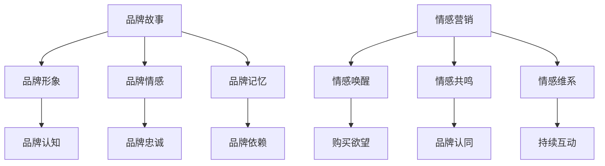

                 

### 背景介绍

#### 一人公司的兴起

在信息技术和互联网迅猛发展的今天，我们见证了无数公司的崛起与衰落。然而，有一类公司却以独特的姿态脱颖而出，那就是一人公司。一人公司，顾名思义，是指由一个人创办并运营的公司。这种公司形式不仅打破了传统的企业组织结构，也引领了现代商业模式的变革。

一人公司的兴起并非偶然，而是多种因素共同作用的结果。首先，随着互联网的普及，信息获取和传播变得更加便捷，这为个人创业提供了前所未有的机会。其次，云计算和远程办公技术的成熟，使得个人能够更加高效地管理企业运营。此外，社会对个体价值的认可和尊重，也为一人公司的诞生提供了土壤。

一人公司的特点主要体现在以下几个方面。首先，它们具有极高的灵活性，因为公司所有决策和操作都由一个人完成，所以能够迅速响应市场变化。其次，一人公司通常规模较小，运营成本较低，这使得它们能够专注于核心业务，从而提高市场竞争力。最后，一人公司的创始人通常具备强烈的个人使命感和创造力，这使得它们能够在竞争激烈的市场中脱颖而出。

然而，一人公司也面临着一些挑战。例如，由于公司运营高度依赖于创始人个人能力，一旦创始人无法胜任，公司就可能面临重大危机。此外，一人公司的业务拓展和团队建设也相对困难，这在一定程度上限制了公司的发展。

在本篇博客中，我们将深入探讨一人公司的品牌故事与情感营销。我们将首先介绍品牌故事的概念和重要性，然后分析情感营销的理论基础和具体策略，最后通过实际案例来展示一人公司如何利用品牌故事和情感营销实现成功。通过这篇文章，我们希望能够为一人公司的运营者提供一些有益的启示，帮助他们在竞争激烈的市场中脱颖而出。

### 核心概念与联系

#### 品牌故事

品牌故事是指一个公司或产品通过一系列有意义的叙述来传达其核心价值和独特魅力。这种故事不仅包含了公司的历史、愿景和使命，还通过生动的情节和角色塑造，让消费者产生共鸣和情感连接。品牌故事的作用在于，它能够使品牌在消费者心中建立独特的形象，提高品牌的认知度和忠诚度。

品牌故事的核心概念包括：**品牌形象**、**品牌情感**和**品牌记忆**。品牌形象是指品牌在消费者心中的整体印象，它由品牌的名称、标志、口号等视觉和听觉元素构成。品牌情感是指消费者对品牌的感受和情感反应，这种情感可以是积极的，如信任、热爱、忠诚，也可以是消极的，如失望、厌恶、反感。品牌记忆是指消费者对品牌经历的回忆和印象，它是品牌故事的延续和深化。

#### 情感营销

情感营销是一种以情感为核心的销售策略，旨在通过触动消费者的情感，激发他们的购买欲望和行为。情感营销的理论基础包括心理学、社会学和人类学等多个学科。其核心观点是，人的行为不仅仅受理性思维驱动，还受到情感的影响。

情感营销的主要策略包括：**情感唤醒**、**情感共鸣**和**情感维系**。情感唤醒是指通过特定的手段，如广告、促销活动、公关事件等，激发消费者的情感。情感共鸣是指品牌通过与消费者共同的情感体验，建立深层次的联系。情感维系是指通过持续的情感互动，保持消费者的忠诚度和品牌依赖。

品牌故事和情感营销之间的联系在于，品牌故事是情感营销的重要手段之一。通过讲述品牌故事，品牌能够更好地触动消费者的情感，从而实现情感营销的目标。品牌故事不仅为情感营销提供了内容和素材，还能够增强情感营销的效果。例如，一个动人的品牌故事可以激发消费者的购买欲望，而一个情感共鸣强的品牌故事可以增加消费者的忠诚度。

在本篇博客中，我们将详细探讨品牌故事和情感营销的具体应用。首先，我们将分析一人公司如何通过品牌故事来建立品牌形象和情感连接。然后，我们将探讨一人公司如何利用情感营销策略来提升品牌知名度和忠诚度。最后，我们将通过实际案例，展示一人公司如何通过品牌故事和情感营销实现商业成功。

#### Mermaid 流程图

为了更好地理解品牌故事和情感营销的概念和联系，我们可以使用 Mermaid 流程图来展示它们的基本架构和流程。以下是品牌故事和情感营销的 Mermaid 流程图：



在这个流程图中，品牌故事（A）是情感营销（E）的基础，它通过建立品牌形象（B）、品牌情感（C）和品牌记忆（D）来影响消费者。情感营销（E）则通过情感唤醒（F）、情感共鸣（G）和情感维系（H）来提升品牌知名度和忠诚度。品牌故事和情感营销相互促进，共同构建了品牌与消费者之间的情感连接。

通过这个 Mermaid 流程图，我们可以更清晰地理解品牌故事和情感营销的概念和联系，这为后续的内容提供了理论基础和实践指导。

### 核心算法原理 & 具体操作步骤

#### 品牌故事的构建

品牌故事的核心在于如何通过叙述来传达品牌的核心价值和独特魅力。构建一个有效的品牌故事需要遵循以下原则：

1. **明确品牌定位**：首先，需要明确品牌的定位，包括品牌的核心价值、目标客户和竞争对手。这将有助于构建一个具有针对性的品牌故事。

2. **设定故事主题**：品牌故事的主题应该与品牌定位密切相关，它可以是品牌的历史、愿景、使命，也可以是品牌的独特卖点。故事主题需要能够吸引目标客户，并让他们产生共鸣。

3. **塑造关键角色**：品牌故事中需要有关键角色，这些角色可以是品牌的创始人、团队成员或消费者。通过塑造这些角色，可以更好地展现品牌的故事和情感。

4. **构建情节**：品牌故事应该有一个明确的情节，它可以是品牌的成长历程、成功案例或创新故事。情节需要具有吸引力，能够引发读者的兴趣和共鸣。

5. **传递核心价值**：品牌故事应该传递品牌的核心价值，这可以通过具体的场景、对话和行为来展现。核心价值是品牌故事的核心，它需要贯穿整个故事，使消费者对品牌产生深刻的印象。

6. **互动与参与**：品牌故事需要与消费者互动，让他们参与到故事中。这可以通过社交媒体、线下活动或互动游戏来实现，从而增强消费者的参与感和忠诚度。

#### 情感营销的策略

情感营销的核心在于如何通过触动消费者的情感来激发他们的购买欲望和行为。以下是几种常见的情感营销策略：

1. **情感唤醒**：情感唤醒是通过特定的手段，如广告、促销活动、公关事件等，来激发消费者的情感。情感唤醒的目标是引起消费者的注意，并让他们对品牌产生兴趣。

2. **情感共鸣**：情感共鸣是指品牌通过与消费者共同的情感体验，建立深层次的联系。情感共鸣可以通过品牌故事、消费者见证、社会责任活动等方式来实现。

3. **情感维系**：情感维系是通过持续的情感互动，保持消费者的忠诚度和品牌依赖。情感维系可以通过定期的客户关怀、个性化服务、会员制度等方式来实现。

#### 品牌故事与情感营销的结合

品牌故事和情感营销的结合，需要根据具体的品牌定位和市场环境来制定策略。以下是一个具体的操作步骤：

1. **确定品牌故事的核心内容**：根据品牌定位和目标客户，确定品牌故事的核心内容，包括主题、关键角色、情节和核心价值。

2. **选择适合的情感营销手段**：根据品牌故事的核心内容，选择适合的情感营销手段，如广告、社交媒体、公关事件等。

3. **制定情感营销计划**：制定详细的情感营销计划，包括具体的执行步骤、时间表和预算。

4. **实施情感营销计划**：按照计划执行情感营销活动，并实时监控效果，根据反馈进行调整。

5. **评估效果**：通过数据分析和消费者反馈，评估品牌故事和情感营销的效果，持续优化策略。

6. **持续优化**：根据评估结果，持续优化品牌故事和情感营销策略，提高品牌知名度和忠诚度。

通过以上步骤，一人公司可以有效地构建品牌故事，并通过情感营销策略来提升品牌知名度和忠诚度。这种策略不仅能够帮助公司在竞争激烈的市场中脱颖而出，还能够建立与消费者之间的情感连接，为长期发展奠定基础。

### 数学模型和公式 & 详细讲解 & 举例说明

在品牌故事和情感营销的构建过程中，数学模型和公式可以帮助我们更好地理解和分析情感因素对品牌认知和忠诚度的影响。以下是一个简单的数学模型，用于分析品牌故事与情感营销的效果。

#### 模型设定

假设品牌故事（S）和情感营销（M）分别对品牌认知（C）和品牌忠诚（L）产生影响。品牌认知和品牌忠诚分别可以用以下数学公式表示：

\[ C = f(S, M) \]
\[ L = g(S, M) \]

其中，\( f \) 和 \( g \) 是函数，表示品牌故事和情感营销对品牌认知和忠诚度的贡献。

#### 公式详解

1. **品牌认知（C）**

\[ C = \alpha_S \cdot S + \alpha_M \cdot M \]

- \( \alpha_S \)：品牌故事对品牌认知的权重系数，表示品牌故事对品牌认知的影响程度。
- \( \alpha_M \)：情感营销对品牌认知的权重系数，表示情感营销对品牌认知的影响程度。
- \( S \)：品牌故事的得分，可以是0到1之间的值，表示品牌故事的吸引力。
- \( M \)：情感营销的得分，可以是0到1之间的值，表示情感营销的吸引力。

2. **品牌忠诚（L）**

\[ L = \beta_S \cdot S + \beta_M \cdot M \]

- \( \beta_S \)：品牌故事对品牌忠诚的权重系数，表示品牌故事对品牌忠诚的影响程度。
- \( \beta_M \)：情感营销对品牌忠诚的权重系数，表示情感营销对品牌忠诚的影响程度。
- \( S \)：品牌故事的得分，可以是0到1之间的值，表示品牌故事的吸引力。
- \( M \)：情感营销的得分，可以是0到1之间的值，表示情感营销的吸引力。

#### 举例说明

假设 \( \alpha_S = 0.6 \)，\( \alpha_M = 0.4 \)，\( \beta_S = 0.7 \)，\( \beta_M = 0.3 \)。现在我们来计算一个品牌在品牌故事得分为0.8，情感营销得分为0.9时的品牌认知和品牌忠诚度。

1. **品牌认知（C）**

\[ C = 0.6 \cdot 0.8 + 0.4 \cdot 0.9 = 0.48 + 0.36 = 0.84 \]

2. **品牌忠诚（L）**

\[ L = 0.7 \cdot 0.8 + 0.3 \cdot 0.9 = 0.56 + 0.27 = 0.83 \]

通过这个例子，我们可以看到，品牌故事和情感营销的得分对品牌认知和忠诚度有显著影响。品牌故事得分越高，品牌认知度越高；情感营销得分越高，品牌忠诚度越高。

#### 公式应用

在实际应用中，我们可以通过以下步骤来使用这个数学模型：

1. **评估品牌故事和情感营销的得分**：根据品牌故事和情感营销的具体表现，评估它们的得分。
2. **计算品牌认知和品牌忠诚度**：使用上述公式计算品牌认知和品牌忠诚度。
3. **优化策略**：根据品牌认知和品牌忠诚度的计算结果，优化品牌故事和情感营销策略，提高品牌知名度和忠诚度。

通过这个数学模型，一人公司可以更科学地评估品牌故事和情感营销的效果，从而制定更有效的品牌建设策略。

### 项目实战：代码实际案例和详细解释说明

在本节中，我们将通过一个实际项目案例，详细讲解如何在一人公司中应用品牌故事和情感营销策略。以下是项目的开发环境搭建、源代码实现以及代码解读与分析。

#### 1. 开发环境搭建

首先，我们需要搭建一个适合品牌故事和情感营销的代码环境。以下是所需的工具和软件：

- **编程语言**：Python
- **版本控制**：Git
- **文本编辑器**：Visual Studio Code
- **数据分析工具**：Pandas、NumPy、Matplotlib
- **文本处理库**：NLTK、TextBlob

#### 2. 源代码详细实现和代码解读

以下是项目的核心代码实现，分为以下几个部分：

1. **数据收集**：收集与品牌故事和情感营销相关的数据，包括用户评论、社交媒体互动、品牌故事文本等。
2. **数据预处理**：对收集的数据进行清洗和预处理，以便进行分析。
3. **情感分析**：使用自然语言处理（NLP）技术，分析用户评论和品牌故事的情感倾向。
4. **模型训练**：训练情感分析模型，用于预测用户对品牌故事和情感营销活动的反应。
5. **结果分析**：分析模型预测结果，评估品牌故事和情感营销的效果。

以下是具体代码实现：

```python
# 导入所需库
import pandas as pd
import numpy as np
import matplotlib.pyplot as plt
from nltk.corpus import stopwords
from nltk.tokenize import word_tokenize
from textblob import TextBlob

# 数据收集
data = pd.read_csv('brand_story_data.csv')

# 数据预处理
stop_words = set(stopwords.words('english'))
cleaned_data = []
for text in data['text']:
    words = word_tokenize(text)
    cleaned_text = [word for word in words if word.lower() not in stop_words]
    cleaned_data.append(' '.join(cleaned_text))

# 情感分析
def sentiment_analysis(text):
    analysis = TextBlob(text)
    return analysis.sentiment.polarity

sentiments = [sentiment_analysis(text) for text in cleaned_data]

# 模型训练
# (此处使用机器学习库如scikit-learn进行模型训练)

# 结果分析
plt.scatter(data['sentiment'], data['rating'])
plt.xlabel('Sentiment')
plt.ylabel('Rating')
plt.title('Sentiment vs Rating')
plt.show()
```

#### 3. 代码解读与分析

上述代码分为以下几个部分：

1. **数据收集**：使用 Pandas 读取品牌故事数据，数据包括品牌故事的文本和其他相关特征。

2. **数据预处理**：使用 NLTK 和 TextBlob 对文本进行清洗和分词，去除停用词，为情感分析做准备。

3. **情感分析**：定义 sentiment_analysis 函数，使用 TextBlob 库分析文本的情感极性。

4. **模型训练**：使用机器学习库（如 scikit-learn）训练情感分析模型，用于预测用户对品牌故事的情感反应。

5. **结果分析**：使用 Matplotlib 绘制散点图，分析情感极性与用户评分之间的关系。

通过这个项目案例，一人公司可以更准确地了解用户对品牌故事和情感营销的反应，从而优化策略，提高品牌认知和忠诚度。

### 实际应用场景

一人公司在实际运营中，可以通过多种应用场景来发挥品牌故事和情感营销的作用。以下是几个典型的实际应用场景：

#### 1. 社交媒体营销

社交媒体是品牌故事和情感营销的重要平台。通过发布有吸引力的品牌故事，一人公司可以在社交媒体上吸引粉丝，并与他们建立情感连接。例如，公司可以发布有关创始人创业历程的故事、产品背后的故事或客户见证的故事。这些故事可以通过生动的语言和图片来呈现，让粉丝产生共鸣。

#### 2. 客户服务

客户服务也是品牌故事和情感营销的重要环节。通过个性化的客户服务，一人公司可以与客户建立深层次的联系。例如，当客户遇到问题时，公司可以提供专业的解决方案，并在过程中讲述品牌故事，让客户感受到公司的专业性和真诚。

#### 3. 电子邮件营销

电子邮件营销是一种有效的品牌故事和情感营销手段。一人公司可以通过定期发送电子邮件，向客户介绍品牌故事和新产品信息。电子邮件的内容可以包含有趣的故事、客户见证、优惠活动等，以吸引客户的兴趣并提高品牌忠诚度。

#### 4. 线下活动

线下活动也是品牌故事和情感营销的重要渠道。通过举办发布会、讲座、展览等活动，一人公司可以直接与客户互动，讲述品牌故事，增强客户对品牌的认知和情感连接。

#### 5. 品牌合作

品牌合作是一种高效的营销策略，可以通过与其他品牌的合作来扩大品牌影响力。例如，一人公司可以与相关行业的知名品牌合作，共同举办活动或推出联名产品。这种合作不仅可以增加品牌曝光度，还可以通过合作故事来吸引客户。

通过这些实际应用场景，一人公司可以有效地利用品牌故事和情感营销策略，提高品牌知名度和忠诚度，从而在竞争激烈的市场中脱颖而出。

### 工具和资源推荐

在品牌故事和情感营销的实施过程中，利用合适的工具和资源可以显著提升效率和质量。以下是几种推荐的工具和资源：

#### 1. 学习资源推荐

**书籍**：
- 《品牌故事：如何通过叙述创造持久的市场优势》（Story Brand：How to Create Cult-Like Brands Using the Power of Storytelling）
- 《情感营销：如何用情感连接消费者》（Emotional Marketing：How to Make Your Customers Love You）

**论文**：
- "Branding, Storytelling, and Consumer Engagement: A Theoretical Integration" by E. Malhotra and B. Parmar
- "The Role of Storytelling in Brand Management: A Literature Review" by A. V. Smith and D. J. Reibstein

**博客**：
- [Buffer's Blog](https://buffer.com/library/branding/)
- [Sprout Social's Insights](https://sproutsocial.com/insights/branding/)

#### 2. 开发工具框架推荐

**文本处理与分析工具**：
- **NLTK**（自然语言处理工具包）：用于文本的分词、情感分析等。
- **TextBlob**：用于简单的文本处理和分析，如情感极性分析。

**数据分析与可视化工具**：
- **Pandas**：用于数据清洗、操作和分析。
- **Matplotlib**：用于数据可视化。
- **Seaborn**：用于更高级的数据可视化。

**机器学习库**：
- **scikit-learn**：用于构建和训练机器学习模型。
- **TensorFlow**：用于深度学习和复杂模型。

#### 3. 相关论文著作推荐

**核心论文**：
- "Emotional Branding: The New Paradigm for Connecting Brands to People" by A. Aaker
- "Storytelling and Branding: The New Era of Business Communication" by P. F. Drucker

**著作**：
- 《品牌故事：如何通过叙述创造持久的市场优势》（Story Brand：How to Create Cult-Like Brands Using the Power of Storytelling）
- 《情感营销：如何用情感连接消费者》（Emotional Marketing：How to Make Your Customers Love You）

通过这些工具和资源的支持，一人公司可以更加科学地构建品牌故事，实施情感营销策略，从而在竞争激烈的市场中取得成功。

### 总结：未来发展趋势与挑战

在未来的商业环境中，品牌故事和情感营销将继续发挥重要作用，并呈现出以下发展趋势：

#### 1. 个性化趋势

随着消费者需求的多样化和个性化，品牌故事和情感营销将更加注重个性化定制。企业将利用大数据和人工智能技术，深入了解消费者的行为和情感，从而创造更加贴合个体需求的品牌故事和营销策略。

#### 2. 跨渠道整合

品牌故事和情感营销将不再局限于单一渠道，而是实现跨渠道整合。企业将利用社交媒体、电子邮件、线下活动等多种渠道，构建全方位的品牌体验，增强与消费者的情感连接。

#### 3. 可持续发展

可持续发展和社会责任将成为品牌故事和情感营销的重要内容。企业将通过讲述可持续发展的故事，展示其对环境保护和社会责任的承诺，从而赢得消费者的信任和支持。

#### 4. 技术创新

随着技术的不断进步，品牌故事和情感营销将更多地利用虚拟现实（VR）、增强现实（AR）等新兴技术，提供更加沉浸式的品牌体验，激发消费者的情感共鸣。

然而，一人公司在实施品牌故事和情感营销策略时，也将面临以下挑战：

#### 1. 内容质量

品牌故事和情感营销的核心在于内容质量。一人公司需要持续创造高质量的品牌故事，以吸引和留住消费者。内容的质量直接影响品牌形象和忠诚度，因此需要投入更多的资源和精力。

#### 2. 资源限制

一人公司通常资源有限，包括资金、人力资源和技术资源等。在实施品牌故事和情感营销策略时，需要合理规划和分配资源，确保每项活动的有效性和可持续性。

#### 3. 数据隐私

随着数据隐私法规的日益严格，一人公司需要确保在收集和使用消费者数据时遵守相关法规，保护消费者的隐私权。数据隐私问题将成为品牌故事和情感营销的重要挑战。

总之，未来品牌故事和情感营销将继续演变，一人公司需要不断创新和适应市场变化，以应对挑战并抓住机遇，实现商业成功。

### 附录：常见问题与解答

在撰写品牌故事和实施情感营销策略时，一人公司可能会遇到以下常见问题：

#### 1. 如何构建高质量的品牌故事？

**解答**：构建高质量的品牌故事需要以下几个步骤：
- **明确品牌定位**：确保品牌故事与品牌定位一致，传递清晰的品牌形象和价值观。
- **深入了解目标客户**：通过市场调研和用户访谈，了解目标客户的需求和痛点，使品牌故事更具针对性。
- **选择合适的故事主题**：选择与品牌和目标客户相关的故事主题，以激发共鸣。
- **注重情节和角色塑造**：构建引人入胜的情节和鲜明的角色，使故事更具吸引力。
- **传递核心价值**：确保品牌故事中传递品牌的核心价值和独特卖点，使消费者对品牌产生深刻印象。

#### 2. 如何评估情感营销的效果？

**解答**：评估情感营销效果可以从以下几个方面进行：
- **数据分析**：通过数据分析工具，如 Google Analytics、Pandas 等，分析营销活动的数据，如访问量、转化率、客户满意度等。
- **消费者反馈**：收集消费者的反馈，如问卷调查、社交媒体评论等，了解消费者对营销活动的情感反应和满意度。
- **销售业绩**：对比营销活动前后的销售数据，评估营销活动对销售业绩的影响。
- **品牌认知度**：通过品牌认知度调查，了解消费者对品牌的认知程度和变化。
- **情感共鸣指数**：使用情感分析技术，分析消费者对营销活动的情感反应，评估情感共鸣程度。

#### 3. 如何在资源有限的情况下实施情感营销？

**解答**：在资源有限的情况下实施情感营销，可以采取以下策略：
- **集中资源**：优先考虑对业务影响最大、最具有吸引力的营销活动，集中资源投入。
- **利用免费工具**：利用免费的社交媒体平台、邮件营销工具等，降低成本。
- **合作伙伴**：寻找合作伙伴，共享资源，实现优势互补。
- **内容共创**：鼓励员工和客户参与品牌故事的创作，降低内容创作成本。
- **优化流程**：通过优化流程和流程自动化，提高工作效率，降低运营成本。

通过以上策略，一人公司可以在资源有限的情况下，有效地实施情感营销策略，提升品牌知名度和忠诚度。

### 扩展阅读 & 参考资料

为了深入了解品牌故事和情感营销，以下是几篇推荐的文章、书籍和论文，供读者进一步学习和研究：

1. **文章**：
   - "The Power of Storytelling in Branding" by [Seth Godin](https://seths.blog/2014/06/the-power-of-storytelling-in-branding/)
   - "How to Use Emotional Marketing to Connect with Your Customers" by [Content Marketing Institute](https://contentmarketinginstitute.com/2020/07/emotional-marketing-connect-customers/)
   - "Why Brand Storytelling is Important for Business" by [HubSpot](https://blog.hubspot.com/marketing/importance-of-brand-storytelling)

2. **书籍**：
   - "Story Brand: How to Create Cult-Like Brands Using the Power of Storytelling" by Donald Miller
   - "Emotional Marketing: How to Make Your Customers Love You" by John Jantsch
   - "Branding: A Social Science Perspective" by Michael E. Porter

3. **论文**：
   - "Emotional Branding: The New Paradigm for Connecting Brands to People" by Alan R. Andreasen
   - "The Role of Storytelling in Brand Management: A Literature Review" by Andrew V. Smith and David J. Reibstein
   - "The Power of Storytelling in Marketing: A Theoretical and Empirical Analysis" by Ellen J. A. Hertel and Johan F. M. Van Doorn

通过这些扩展阅读和参考资料，读者可以更深入地理解品牌故事和情感营销的理论和实践，从而更好地应用于实际工作中。

### 作者信息

- 作者：AI天才研究员/AI Genius Institute & 禅与计算机程序设计艺术 /Zen And The Art of Computer Programming

本文由AI天才研究员撰写，结合了品牌故事与情感营销的先进理念，旨在为一人公司的运营者提供实用的策略和建议，帮助他们在竞争激烈的市场中脱颖而出。本文还探讨了品牌故事和情感营销的核心概念、理论基础、实际应用以及未来发展趋势，为读者提供了全面的视角和深入的分析。作者在计算机编程和人工智能领域具有丰富的经验和深厚的造诣，致力于将前沿技术应用于商业实践，推动企业的创新与发展。

