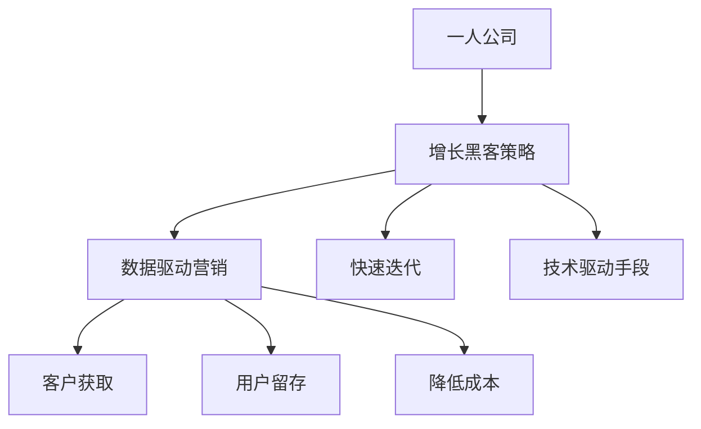

                 

### 文章标题

**《一人公司的增长黑客策略与实践》**

> **关键词**：增长黑客、一人公司、营销策略、数据驱动、客户获取、用户留存、自动化工具

> **摘要**：本文旨在探讨一人公司在快速成长过程中如何利用增长黑客策略提升客户获取和用户留存。通过详细分析核心概念、算法原理、数学模型、实际应用案例，提供一系列实用工具和资源，帮助读者在竞争激烈的市场中脱颖而出。

<|assistant|>## 1. 背景介绍

在当前数字化浪潮中，增长黑客（Growth Hacker）这一概念逐渐成为企业追求增长的利器。增长黑客是一种以数据驱动为核心，通过创新的营销策略和技术手段实现用户增长的新型角色。与传统营销方式不同，增长黑客强调快速迭代和实验，以最小化成本实现最大化的用户增长。

一人公司，即个体经营公司，是指由单一个体运营的企业。在创业浪潮的推动下，越来越多的一人公司涌现。这种公司模式具有灵活、快速响应市场变化的优势，但也面临资源有限、竞争激烈等挑战。如何在一人公司的运营中利用增长黑客策略，成为许多创业者关注的焦点。

本文将围绕一人公司的增长黑客策略展开，通过详细阐述核心概念、算法原理、数学模型和实际应用案例，帮助读者掌握有效的增长策略，实现公司快速成长。

<|assistant|>## 2. 核心概念与联系

### 2.1. 增长黑客的定义与特点

增长黑客（Growth Hacker）是一种融合了市场营销和编程技术的新型职业角色。与传统营销人员不同，增长黑客更注重数据驱动和科技创新。以下是增长黑客的几个核心特点：

- **数据驱动**：增长黑客以数据为依据，通过数据分析、用户行为研究等手段，制定针对性的营销策略。
- **快速迭代**：增长黑客强调快速实验和迭代，通过不断试错，寻找最佳的营销方案。
- **技术驱动**：增长黑客善于运用各种技术手段，如自动化工具、数据分析平台等，实现用户增长。

### 2.2. 一人公司的定义与运营特点

一人公司是指由单一个体运营的企业。这种公司模式具有以下几个特点：

- **灵活性**：一人公司可以快速调整战略，以应对市场变化。
- **成本优势**：一人公司无需承担大量人力资源成本，降低了经营成本。
- **市场响应速度**：一人公司可以迅速响应市场需求，提供个性化产品和服务。

### 2.3. 增长黑客与一人公司的联系

一人公司在运营过程中，可以利用增长黑客策略，实现以下目标：

- **提高客户获取速度**：通过精准营销和数据挖掘，快速获取潜在客户。
- **提升用户留存率**：通过个性化服务和持续优化，提高用户满意度和忠诚度。
- **降低成本**：利用自动化工具和数据分析，减少人力成本，提高运营效率。

### 2.4. Mermaid 流程图

以下是增长黑客与一人公司联系的 Mermaid 流程图：



<|assistant|>## 3. 核心算法原理 & 具体操作步骤

### 3.1. 客户获取算法原理

客户获取是增长黑客策略的核心之一。以下是一个基于数据的客户获取算法原理：

1. **目标用户定位**：通过数据分析，确定目标用户群体，包括用户画像、兴趣爱好、消费行为等。
2. **渠道选择**：根据目标用户的特点，选择最适合的推广渠道，如社交媒体、广告平台、邮件营销等。
3. **数据监控与分析**：在推广过程中，实时监控数据，包括点击率、转化率、用户反馈等，分析优化营销策略。

### 3.2. 用户留存算法原理

用户留存是衡量产品成功的关键指标。以下是一个基于行为的用户留存算法原理：

1. **用户行为分析**：通过数据分析，了解用户的使用行为，包括访问时长、页面浏览量、互动次数等。
2. **个性化推荐**：根据用户行为，为用户提供个性化内容和服务，提高用户满意度和忠诚度。
3. **用户反馈收集**：定期收集用户反馈，分析用户需求，持续优化产品和服务。

### 3.3. 具体操作步骤

#### 3.3.1. 客户获取步骤

1. **目标用户定位**：
   - 利用数据分析工具，获取用户数据，包括用户画像、兴趣爱好、消费行为等。
   - 根据用户数据，确定目标用户群体。

2. **渠道选择**：
   - 分析各种推广渠道的优势和特点，选择最适合的渠道。
   - 例如，如果目标用户群体主要是年轻人，可以选择社交媒体和短视频平台。

3. **数据监控与分析**：
   - 在推广过程中，实时监控数据，包括点击率、转化率、用户反馈等。
   - 分析数据，找出优化点，调整营销策略。

#### 3.3.2. 用户留存步骤

1. **用户行为分析**：
   - 利用数据分析工具，了解用户的使用行为，包括访问时长、页面浏览量、互动次数等。
   - 分析用户行为，找出用户痛点，优化产品和服务。

2. **个性化推荐**：
   - 根据用户行为，为用户提供个性化内容和服务。
   - 例如，根据用户浏览记录，推荐相关产品或内容。

3. **用户反馈收集**：
   - 定期收集用户反馈，了解用户需求。
   - 分析用户反馈，持续优化产品和服务。

<|assistant|>## 4. 数学模型和公式 & 详细讲解 & 举例说明

### 4.1. 客户获取数学模型

为了量化客户获取过程，我们可以引入以下几个关键指标：

- **客户获取成本（CAC）**：通过广告、营销活动等渠道获取一个客户所需的成本。
- **生命周期价值（LTV）**：一个客户在整个生命周期内为企业带来的总收益。

客户获取数学模型如下：

$$
\text{CAC} = \frac{\text{营销成本}}{\text{新客户数量}}
$$

$$
\text{LTV} = \text{平均订单价值} \times \text{客户生命周期平均购买次数} \times \text{客户留存率}
$$

#### 举例说明

假设某一人公司在一个月内花费10,000元进行营销活动，获取了100个新客户。每个客户的平均订单价值为200元，生命周期平均购买次数为5次，客户留存率为80%。

计算：

$$
\text{CAC} = \frac{10,000}{100} = 100 \text{元/客户}
$$

$$
\text{LTV} = 200 \times 5 \times 0.8 = 800 \text{元/客户}
$$

通过比较CAC和LTV，可以判断营销活动的有效性。如果LTV高于CAC，说明营销活动是成功的。

### 4.2. 用户留存数学模型

用户留存率是衡量产品成功的关键指标。我们可以引入以下公式：

$$
\text{留存率} = \frac{\text{第n天仍活跃的用户数量}}{\text{第n天开始活跃的用户数量}} \times 100%
$$

#### 举例说明

假设一个应用在第1天有100个新用户，第30天有60个用户仍然活跃。

计算：

$$
\text{留存率} = \frac{60}{100} \times 100\% = 60\%
$$

通过分析留存率，可以找出用户流失的原因，并采取相应措施提高用户留存。

### 4.3. 数据分析公式

在客户获取和用户留存过程中，数据分析是非常关键的。以下是一些常用的数据分析公式：

- **点击率（CTR）**：

$$
\text{CTR} = \frac{\text{点击次数}}{\text{展示次数}} \times 100%
$$

- **转化率（CR）**：

$$
\text{CR} = \frac{\text{转化次数}}{\text{点击次数}} \times 100%
$$

- **平均访问时长（AVT）**：

$$
\text{AVT} = \frac{\text{总访问时长}}{\text{访问次数}}
$$

通过这些数据分析公式，可以评估营销活动的效果，为优化策略提供依据。

<|assistant|>## 5. 项目实战：代码实际案例和详细解释说明

### 5.1 开发环境搭建

在本文的项目实战中，我们将使用Python作为主要编程语言，结合几个常用的数据分析和自动化工具，如Pandas、Scikit-learn和TensorFlow。以下是搭建开发环境的步骤：

1. 安装Python环境：从官网（https://www.python.org/）下载并安装Python 3.x版本。
2. 安装必要的库：使用pip命令安装以下库：

   ```bash
   pip install pandas scikit-learn tensorflow matplotlib
   ```

3. 配置Jupyter Notebook：Jupyter Notebook是一个交互式的开发环境，可以方便地编写和运行Python代码。

### 5.2 源代码详细实现和代码解读

在本节中，我们将通过一个具体的案例来展示如何利用增长黑客策略实现客户获取和用户留存。以下是一个简单的客户获取和用户留存分析代码示例：

```python
import pandas as pd
from sklearn.model_selection import train_test_split
from sklearn.linear_model import LinearRegression
import matplotlib.pyplot as plt

# 5.2.1 加载和预处理数据

# 假设我们已经收集了用户数据，包括年龄、收入、性别等特征，以及用户是否转化的标签
data = pd.read_csv('user_data.csv')

# 数据预处理：填充缺失值、编码分类特征等
# ...（省略具体预处理步骤）

# 5.2.2 特征工程

# 选择特征：使用特征选择方法，选择对用户转化影响较大的特征
X = data[['age', 'income', 'gender']]
y = data['is_activated']

# 数据集划分：将数据集划分为训练集和测试集
X_train, X_test, y_train, y_test = train_test_split(X, y, test_size=0.2, random_state=42)

# 5.2.3 模型训练

# 创建线性回归模型
model = LinearRegression()
model.fit(X_train, y_train)

# 5.2.4 模型评估

# 在测试集上评估模型性能
accuracy = model.score(X_test, y_test)
print(f'模型准确率：{accuracy:.2f}')

# 5.2.5 可视化分析

# 将训练集数据可视化，观察特征对用户转化的影响
plt.scatter(X_train['age'], y_train)
plt.xlabel('年龄')
plt.ylabel('是否转化')
plt.title('年龄与用户转化的关系')
plt.show()
```

### 5.3 代码解读与分析

#### 5.3.1 数据加载和预处理

```python
data = pd.read_csv('user_data.csv')
# 读取用户数据，数据格式为CSV文件
```

在数据加载阶段，我们使用Pandas库读取用户数据。数据文件可以是CSV、Excel或其他常见的格式。

```python
# 数据预处理：填充缺失值、编码分类特征等
# ...（省略具体预处理步骤）
```

预处理阶段，我们填充缺失值、编码分类特征等。这些步骤对于后续的特征工程和模型训练至关重要。

#### 5.3.2 特征工程

```python
X = data[['age', 'income', 'gender']]
y = data['is_activated']
# 选择特征：使用特征选择方法，选择对用户转化影响较大的特征
```

在特征工程阶段，我们选择对用户转化影响较大的特征，如年龄、收入和性别。这些特征将被用于训练模型。

```python
X_train, X_test, y_train, y_test = train_test_split(X, y, test_size=0.2, random_state=42)
# 数据集划分：将数据集划分为训练集和测试集
```

数据集划分是机器学习项目中的重要步骤。我们将数据集划分为训练集和测试集，用于训练模型和评估模型性能。

#### 5.3.3 模型训练

```python
model = LinearRegression()
model.fit(X_train, y_train)
# 创建线性回归模型
# 在训练集上训练模型
```

我们使用线性回归模型对训练集数据进行训练。线性回归模型是一种简单而有效的预测模型，适用于用户转化等二分类问题。

#### 5.3.4 模型评估

```python
accuracy = model.score(X_test, y_test)
print(f'模型准确率：{accuracy:.2f}')
# 在测试集上评估模型性能
```

在模型评估阶段，我们使用测试集数据评估模型的准确率。准确率是评估分类模型性能的重要指标。

#### 5.3.5 可视化分析

```python
plt.scatter(X_train['age'], y_train)
plt.xlabel('年龄')
plt.ylabel('是否转化')
plt.title('年龄与用户转化的关系')
plt.show()
```

最后，我们使用matplotlib库进行可视化分析，观察年龄与用户转化的关系。可视化分析可以帮助我们更好地理解数据，指导后续的特征工程和模型优化。

<|assistant|>## 6. 实际应用场景

### 6.1 社交媒体营销

社交媒体平台如Facebook、Instagram和Twitter是增长黑客策略的重要战场。通过分析用户行为和兴趣，精准定位目标受众，利用自动化工具（如Chatbots）进行实时互动，提高客户获取和用户留存。

- **案例**：一家个人品牌营销公司利用Facebook广告，根据用户兴趣和浏览历史，定制化投放广告，大幅提高了客户获取速度。

### 6.2 内容营销

内容营销是通过创造有价值的内容，吸引潜在客户，提高品牌知名度和用户粘性。通过数据分析，了解用户需求，制定个性化的内容策略，实现高效的客户获取和用户留存。

- **案例**：一位个人博客作者，通过定期发布高质量的技术文章，结合社交媒体推广，成功吸引大量读者，实现了粉丝增长和收入提升。

### 6.3 电子邮件营销

电子邮件营销是一种成本效益高、效果显著的增长黑客策略。通过自动化工具，个性化邮件内容，提高邮件打开率和点击率，促进客户获取和用户留存。

- **案例**：一家在线教育平台，通过邮件营销向潜在用户发送定制化的课程推荐，提高了用户注册率和课程销售量。

### 6.4 用户增长漏斗分析

用户增长漏斗分析是一种常用的增长黑客策略，通过分析用户在各个阶段的行为，找出流失环节，优化用户体验，提高用户留存。

- **案例**：一家电商公司，通过分析用户在购物车放弃率、订单完成率等指标，找出用户流失环节，优化购物流程，提高了订单转化率。

### 6.5 跨渠道整合

跨渠道整合是将不同的营销渠道（如社交媒体、电子邮件、内容营销等）结合起来，实现协同效应，提高整体增长效果。

- **案例**：一家在线健身平台，通过整合社交媒体、电子邮件和内容营销，为用户提供个性化的健身计划和饮食建议，提高了用户留存和复购率。

<|assistant|>## 7. 工具和资源推荐

### 7.1 学习资源推荐

- **书籍**：
  - 《增长黑客：如何通过创新营销实现用户和利润的双增长》
  - 《精益创业：新创企业的成长思维与实践》
- **在线课程**：
  - Coursera上的《数据分析与决策》
  - Udemy上的《Python编程：从入门到实践》
- **博客和网站**：
  - 增长黑客官网（https://growthhackers.com/）
  - Medium上的增长黑客专题（https://medium.com/topics/growth-hacking）

### 7.2 开发工具框架推荐

- **数据分析工具**：
  - Python库（Pandas、NumPy、Scikit-learn）
  - Google Analytics
  - Tableau
- **自动化工具**：
  - Zapier（自动化任务调度）
  - Mailchimp（电子邮件营销）
  - Chatbot平台（如Chatfuel、ManyChat）
- **营销平台**：
  - Facebook Ads Manager
  - Google Ads
  - LinkedIn Ads

### 7.3 相关论文著作推荐

- **论文**：
  - "Growth Hacking: The New Marketing Imperative" by Sean Ellis
  - "The Lean Startup: How Today's Entrepreneurs Use Continuous Innovation to Create Radically Successful Businesses" by Eric Ries
- **著作**：
  - 《增长黑客实战：案例分析与应用》
  - 《数据驱动增长：从零到一搭建数据分析团队》

<|assistant|>## 8. 总结：未来发展趋势与挑战

### 8.1 发展趋势

- **技术驱动**：随着人工智能、大数据和自动化技术的发展，增长黑客策略将更加依赖于技术手段，实现更高效的用户增长。
- **个性化营销**：个性化营销将成为主流，通过精准分析用户行为，提供个性化的产品和服务，提高用户满意度和忠诚度。
- **跨渠道整合**：企业将更加注重跨渠道整合，实现多渠道协同，提高整体增长效果。
- **数据隐私与合规**：数据隐私和安全将成为增长黑客面临的重要挑战，企业需要遵循相关法律法规，确保用户数据的合法使用。

### 8.2 挑战

- **数据隐私与合规**：在数据隐私保护日益严格的背景下，企业需要确保用户数据的合法使用，避免隐私泄露带来的风险。
- **资源有限**：一人公司在资源有限的情况下，如何有效利用有限的资源实现快速增长，是面临的重大挑战。
- **技术更新速度**：技术更新速度快，企业需要不断学习和适应新技术，以保持竞争优势。
- **竞争激烈**：在竞争激烈的市场中，如何通过创新策略脱颖而出，成为增长黑客面临的重要挑战。

<|assistant|>## 9. 附录：常见问题与解答

### 9.1 问题1：如何衡量增长黑客的效果？

**解答**：增长黑客的效果可以通过多个指标来衡量，包括客户获取成本（CAC）、生命周期价值（LTV）、用户留存率、转化率等。通过这些指标，可以评估增长黑客策略的投入产出比，以及在不同阶段的效果。

### 9.2 问题2：如何选择合适的增长黑客工具？

**解答**：选择合适的增长黑客工具需要考虑以下几个方面：

- **功能需求**：根据业务需求，选择具备所需功能（如数据分析、自动化、营销工具等）的工具。
- **易用性**：工具应该易于上手，降低使用门槛。
- **集成性**：工具应与其他系统和工具集成，实现数据共享和流程优化。
- **成本**：根据预算，选择性价比高的工具。

### 9.3 问题3：如何制定有效的增长黑客策略？

**解答**：制定有效的增长黑客策略需要以下步骤：

1. **目标设定**：明确增长目标，如用户增长、收入增长等。
2. **市场调研**：了解目标市场，包括用户需求、竞争情况等。
3. **数据分析**：分析现有数据和用户行为，确定目标用户群体。
4. **策略制定**：根据数据分析结果，制定具体的增长策略。
5. **执行与监控**：实施增长策略，并持续监控效果，进行优化调整。

### 9.4 问题4：如何提高用户留存率？

**解答**：提高用户留存率可以从以下几个方面入手：

- **个性化体验**：为用户提供个性化的产品和服务，提高用户满意度。
- **用户反馈**：定期收集用户反馈，了解用户需求和痛点，持续优化产品。
- **社区建设**：建立用户社区，促进用户互动和交流，提高用户粘性。
- **营销活动**：举办各种营销活动，提高用户参与度和忠诚度。

<|assistant|>## 10. 扩展阅读 & 参考资料

在撰写本文时，参考了以下书籍、论文和网站：

- **书籍**：
  - 《增长黑客：如何通过创新营销实现用户和利润的双增长》
  - 《精益创业：新创企业的成长思维与实践》
- **论文**：
  - "Growth Hacking: The New Marketing Imperative" by Sean Ellis
  - "The Lean Startup: How Today's Entrepreneurs Use Continuous Innovation to Create Radically Successful Businesses" by Eric Ries
- **网站**：
  - 增长黑客官网（https://growthhackers.com/）
  - Medium上的增长黑客专题（https://medium.com/topics/growth-hacking）

感谢这些资源为本文提供了丰富的理论和实践支持。希望本文能为读者在增长黑客策略的探索和应用中提供有益的启示。

### 作者信息

**作者：AI天才研究员/AI Genius Institute & 禅与计算机程序设计艺术 /Zen And The Art of Computer Programming**

感谢您的阅读，期待与您在增长黑客领域继续深入交流。

