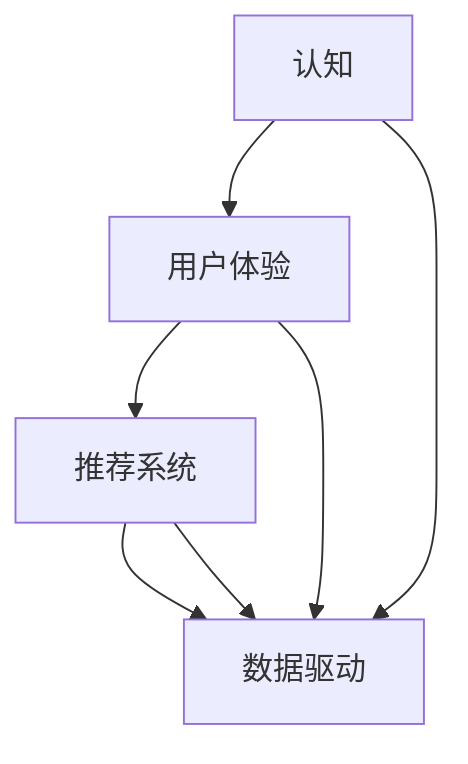

                 

### 背景介绍

在现代商业环境中，客户旅程优化已经成为企业提升竞争力、提高客户满意度和增加收入的关键因素。特别是对于小型企业或“一人公司”，客户旅程的优化更是决定其生存和发展的重要策略。本文旨在探讨如何通过全流程设计，从认知到推荐，实现对客户旅程的全面优化。

**客户旅程**是指客户在购买产品或服务过程中所经历的各个环节，包括了解、评估、购买、使用、反馈等。优化客户旅程意味着在每个环节中提供更加个性化、高效和愉快的体验，从而提高客户满意度和忠诚度。

对于一人公司而言，资源有限、市场竞争激烈，如何有效吸引和留住客户成为一大挑战。通过优化客户旅程，一人公司可以提升自身竞争力，实现可持续发展。本文将围绕以下几个核心问题展开讨论：

1. 如何理解并构建完整的客户旅程？
2. 如何通过数据和技术手段对客户旅程进行优化？
3. 如何在客户旅程的不同阶段提供个性化的推荐？

本文将通过理论分析和实际案例，帮助一人公司深入了解客户旅程优化的方法和实践，为其业务增长提供有力支持。

### 2. 核心概念与联系

为了更好地理解客户旅程优化，我们需要明确以下几个核心概念：认知、用户体验、推荐系统、数据驱动等。

**认知**是指客户在接触产品或服务时的感知和了解。良好的认知能够提高客户的兴趣和购买意愿。用户体验（UX）则是客户在接触和使用产品或服务过程中所感受到的整体体验。个性化推荐系统通过分析用户行为和偏好，提供定制化的产品或服务推荐，从而提升用户体验。

这些核心概念之间的联系如下图所示：



**Mermaid 流程图（无特殊字符）**：

```
graph TB
    A[认知] --> B[用户体验]
    B --> C[推荐系统]
    C --> D[数据驱动]
    A --> D
    B --> D
    C --> D
```

通过以上流程图，我们可以看出，认知、用户体验和推荐系统都是数据驱动的结果。而数据驱动的方式可以帮助企业更好地理解客户需求，提供个性化的服务和推荐，从而优化客户旅程。

接下来，我们将深入探讨这些核心概念的具体原理和实践方法。

#### 2.1 认知原理与设计方法

**认知**是指客户在接触产品或服务时对产品或服务的理解和感知。良好的认知能够激发客户的兴趣和购买欲望，是客户旅程的起点。为了提升客户的认知，企业可以采取以下几种设计方法：

1. **故事化叙述**：通过生动、有趣的故事来讲述产品或服务的特点和优势，使客户在短时间内理解和接受产品或服务。
2. **品牌传播**：通过广告、社交媒体、口碑传播等方式，建立强大的品牌认知度，使客户对品牌有深刻的印象。
3. **信息可视化**：使用图表、图片、视频等可视化工具，将复杂的信息简化，使客户更容易理解和记忆。

**用户体验**（UX）是指客户在接触和使用产品或服务过程中所感受到的整体体验。良好的用户体验能够提高客户的满意度和忠诚度，是客户旅程的重要组成部分。为了提升用户体验，企业可以采取以下几种设计方法：

1. **用户研究**：通过用户访谈、问卷调查、用户行为分析等方式，了解用户的需求、偏好和痛点，从而设计出更符合用户期望的产品或服务。
2. **交互设计**：优化产品或服务的交互设计，使界面简洁、直观、易用，降低用户的操作难度。
3. **反馈机制**：建立有效的用户反馈机制，收集用户的意见和建议，不断改进产品或服务。

**推荐系统**是通过分析用户行为和偏好，提供定制化的产品或服务推荐。推荐系统可以显著提升用户体验，是数据驱动的结果。为了构建有效的推荐系统，企业可以采取以下几种设计方法：

1. **协同过滤**：基于用户行为或评价，找到相似的用户或项目，为用户推荐相似的项目或用户。
2. **基于内容的推荐**：根据项目的特征和用户偏好，推荐与项目相似的其他项目。
3. **混合推荐**：结合多种推荐方法，提高推荐系统的准确性和多样性。

**数据驱动**是指企业通过收集、分析和利用数据，指导产品或服务的开发和运营。数据驱动的核心思想是“以用户为中心”，通过数据了解用户需求和行为，提供个性化的服务和推荐。数据驱动的具体步骤如下：

1. **数据收集**：通过各种渠道收集用户数据，包括行为数据、评价数据、社交数据等。
2. **数据清洗**：对收集到的数据进行处理和清洗，去除重复、无效和错误的数据。
3. **数据建模**：使用统计模型、机器学习算法等对数据进行分析和建模，提取有价值的信息。
4. **数据应用**：将数据分析和建模的结果应用于产品或服务的开发和运营，指导决策和改进。

通过以上核心概念和设计方法的介绍，我们可以看出，认知、用户体验、推荐系统和数据驱动在客户旅程优化中扮演着重要角色。接下来，我们将进一步探讨这些概念在客户旅程优化中的应用和实践。

#### 2.2 用户体验设计原则与方法

用户体验（UX）设计是客户旅程优化中的关键环节，它直接影响客户的满意度和忠诚度。为了设计出良好的用户体验，企业需要遵循以下原则和方法：

**1. 以用户为中心**：用户体验设计的核心是用户，因此，设计过程中需要始终关注用户的需求、偏好和痛点。可以通过用户访谈、问卷调查、用户行为分析等方式收集用户反馈，了解用户在接触和使用产品或服务过程中的真实感受。

**2. 简化流程**：复杂的流程和操作会降低用户体验，因此，设计时应尽量简化流程，减少用户操作的步骤。例如，在电子商务平台上，可以提供一键购买功能，简化用户的购买流程。

**3. 保持一致性**：一致性是用户体验设计的重要原则，包括界面风格、交互逻辑和操作规则等方面。保持一致性有助于用户快速学习和适应，提高用户体验。

**4. 提供反馈**：及时、有效的反馈能够帮助用户更好地理解产品或服务的功能和操作，提高用户体验。例如，在用户提交反馈后，可以提供相应的反馈结果或解决方案，让用户感受到企业的关注和重视。

**5. 适应性设计**：随着用户需求的不断变化，设计应具备适应性，能够根据用户的需求和环境进行调整。例如，移动应用应具备响应式设计，适应不同屏幕尺寸和设备。

**具体方法**：

1. **用户研究**：通过用户访谈、问卷调查、用户行为分析等方式，了解用户的需求、偏好和痛点，为设计提供依据。

2. **原型设计**：使用低保真或高保真原型，模拟产品或服务的界面和交互逻辑，验证设计的可行性和用户体验。

3. **迭代优化**：在设计和开发过程中，不断收集用户反馈，进行迭代优化，逐步提升用户体验。

4. **性能优化**：对产品或服务的性能进行优化，包括页面加载速度、响应时间等，确保用户在使用过程中的流畅体验。

5. **可用性测试**：通过可用性测试，评估设计是否符合用户需求，发现潜在的问题和改进空间。

通过以上原则和方法，企业可以设计出良好的用户体验，提升客户满意度和忠诚度，从而优化客户旅程。在下一部分，我们将探讨如何通过数据和技术手段对客户旅程进行优化。

#### 2.3 数据和技术手段在客户旅程优化中的应用

在现代商业环境中，数据和技术手段在客户旅程优化中发挥着至关重要的作用。通过有效的数据收集、分析和应用，企业可以更好地理解客户需求，提供个性化的服务和推荐，从而优化客户旅程。以下是一些关键的数据和技术手段：

**1. 数据收集**：数据收集是客户旅程优化的第一步，企业可以通过多种渠道收集用户数据，包括行为数据、评价数据、社交数据等。具体方法包括：

- **用户行为跟踪**：通过网页分析、点击率分析、浏览时长分析等，了解用户在网站或移动应用上的行为。
- **客户反馈**：通过问卷调查、在线评论、用户论坛等，收集用户对产品或服务的意见和建议。
- **社交媒体分析**：通过分析用户在社交媒体上的互动和评论，了解用户对品牌和产品的态度。

**2. 数据清洗**：收集到的数据通常包含噪声和错误，需要进行清洗和处理，以确保数据的质量。数据清洗包括以下步骤：

- **去重**：去除重复的数据记录，确保数据的唯一性。
- **格式化**：将不同格式的数据统一为标准格式，便于后续处理。
- **缺失值处理**：填补缺失的数据或删除含有缺失数据的记录。

**3. 数据建模**：通过数据建模，可以提取数据中的有价值信息，为优化客户旅程提供依据。常见的数据建模方法包括：

- **回归分析**：用于预测客户行为和需求，例如预测客户购买概率。
- **聚类分析**：将具有相似特征的客户分为不同的群体，为个性化推荐提供基础。
- **关联规则挖掘**：发现数据之间的关联关系，例如购物篮分析。

**4. 推荐系统**：推荐系统是数据驱动客户旅程优化的重要工具，通过分析用户行为和偏好，提供个性化的产品或服务推荐。常见的推荐系统方法包括：

- **协同过滤**：基于用户行为或评价，找到相似的用户或项目，为用户推荐相似的项目或用户。
- **基于内容的推荐**：根据项目的特征和用户偏好，推荐与项目相似的其他项目。
- **混合推荐**：结合多种推荐方法，提高推荐系统的准确性和多样性。

**5. 实时数据应用**：实时数据应用可以使企业在客户旅程的每个环节中提供个性化的服务和推荐。具体应用包括：

- **个性化营销**：根据用户的行为和偏好，为用户推荐相关产品和优惠。
- **智能客服**：通过聊天机器人等技术，提供个性化的客服服务，提高用户满意度。
- **动态定价**：根据用户需求和竞争环境，实时调整产品或服务的价格。

通过以上数据和技术手段，企业可以实现对客户旅程的全面优化，提高客户满意度和忠诚度，从而实现业务增长。在下一部分，我们将进一步探讨如何通过具体的算法和操作步骤实现客户旅程的优化。

### 3. 核心算法原理 & 具体操作步骤

在客户旅程优化过程中，算法的运用至关重要。以下介绍几种常用的算法原理及其操作步骤，包括协同过滤算法、基于内容的推荐算法和混合推荐算法。

#### 3.1 协同过滤算法

协同过滤（Collaborative Filtering）是一种基于用户行为和评价的推荐算法，其基本思想是找到与目标用户相似的其他用户，推荐他们喜欢且目标用户未购买或体验过的项目。

**协同过滤算法原理：**

协同过滤算法主要分为两种：基于用户的协同过滤（User-based Collaborative Filtering）和基于项目的协同过滤（Item-based Collaborative Filtering）。

1. **基于用户的协同过滤**：首先找到与目标用户兴趣相似的多个用户，然后推荐这些用户喜欢的项目。

2. **基于项目的协同过滤**：首先找到与目标用户评价相似的多个项目，然后推荐这些项目给目标用户。

**具体操作步骤：**

1. **数据预处理**：将用户-项目评分矩阵进行标准化处理，消除评分偏移。

2. **计算相似度**：计算目标用户与其他用户之间的相似度，常用的相似度度量方法包括余弦相似度、皮尔逊相关系数等。

3. **生成推荐列表**：基于相似度计算结果，为用户生成推荐列表。

#### 3.2 基于内容的推荐算法

基于内容的推荐（Content-based Recommendation）是一种基于项目特征和用户偏好的推荐算法，其基本思想是推荐与目标用户偏好相似的项目。

**基于内容的推荐算法原理：**

1. **特征提取**：对项目的内容进行特征提取，如文本、图像、音频等。

2. **相似度计算**：计算项目特征与用户偏好的相似度，常用的相似度度量方法包括余弦相似度、欧氏距离等。

3. **生成推荐列表**：基于相似度计算结果，为用户生成推荐列表。

**具体操作步骤：**

1. **特征提取**：根据项目类型和特点，选择合适的特征提取方法，如词袋模型、TF-IDF等。

2. **用户偏好表示**：将用户的偏好信息转化为向量表示，例如，使用用户历史评价数据，将每个项目评分转换为向量分量。

3. **计算相似度**：计算项目特征向量与用户偏好向量之间的相似度。

4. **生成推荐列表**：基于相似度计算结果，为用户生成推荐列表。

#### 3.3 混合推荐算法

混合推荐（Hybrid Recommendation）是一种结合协同过滤和基于内容推荐的优势的推荐算法，旨在提高推荐系统的准确性和多样性。

**混合推荐算法原理：**

1. **协同过滤部分**：使用协同过滤算法生成初步推荐列表。

2. **基于内容部分**：使用基于内容的推荐算法对初步推荐列表进行筛选和优化。

3. **集成**：将协同过滤和基于内容的推荐结果进行集成，生成最终的推荐列表。

**具体操作步骤：**

1. **协同过滤部分**：按照协同过滤算法的操作步骤生成初步推荐列表。

2. **基于内容部分**：按照基于内容推荐算法的操作步骤对初步推荐列表进行筛选和优化。

3. **集成**：使用集成方法（如加权平均、投票等）将协同过滤和基于内容的推荐结果进行集成，生成最终的推荐列表。

通过以上核心算法的介绍，我们可以看到，协同过滤、基于内容的推荐和混合推荐算法在客户旅程优化中发挥着重要作用。在接下来的部分，我们将进一步探讨数学模型和公式，以及如何在客户旅程优化中应用这些算法。

### 4. 数学模型和公式 & 详细讲解 & 举例说明

在客户旅程优化中，数学模型和公式是不可或缺的工具。通过数学建模，我们可以更好地理解和预测客户行为，从而优化推荐系统。以下将介绍几种常用的数学模型和公式，并详细讲解其应用。

#### 4.1 余弦相似度

余弦相似度是一种常用的相似度度量方法，用于计算两个向量之间的相似程度。在推荐系统中，余弦相似度可用于计算用户与项目之间的相似度。

**公式：**

$$
\cos \theta = \frac{\sum_{i=1}^{n}{x_i \cdot y_i}}{\sqrt{\sum_{i=1}^{n}{x_i^2} \cdot \sum_{i=1}^{n}{y_i^2}}}
$$

其中，$x$ 和 $y$ 分别是两个向量的分量，$\theta$ 是两个向量之间的夹角。

**示例：**

假设有两个用户 $A$ 和 $B$，他们的行为向量如下：

用户 $A$：$(1, 2, 3, 4)$

用户 $B$：$(0, 2, 1, 3)$

计算用户 $A$ 和 $B$ 之间的余弦相似度：

$$
\cos \theta = \frac{(1 \cdot 0 + 2 \cdot 2 + 3 \cdot 1 + 4 \cdot 3)}{\sqrt{(1^2 + 2^2 + 3^2 + 4^2) \cdot (0^2 + 2^2 + 1^2 + 3^2)}} = \frac{14}{\sqrt{30 \cdot 14}} = \frac{14}{\sqrt{420}} \approx 0.7
$$

这意味着用户 $A$ 和 $B$ 的行为相似度为 0.7。

#### 4.2 皮尔逊相关系数

皮尔逊相关系数（Pearson Correlation Coefficient）用于度量两个变量之间的线性关系。在推荐系统中，皮尔逊相关系数可用于计算用户之间的相似度。

**公式：**

$$
r = \frac{\sum_{i=1}^{n}{(x_i - \bar{x}) \cdot (y_i - \bar{y})}}{\sqrt{\sum_{i=1}^{n}{(x_i - \bar{x})^2} \cdot \sum_{i=1}^{n}{(y_i - \bar{y})^2}}}
$$

其中，$x$ 和 $y$ 分别是两个变量的取值，$\bar{x}$ 和 $\bar{y}$ 分别是 $x$ 和 $y$ 的平均值。

**示例：**

假设有两个用户 $A$ 和 $B$，他们的行为数据如下：

用户 $A$：$(1, 2, 3, 4)$

用户 $B$：$(2, 3, 4, 5)$

计算用户 $A$ 和 $B$ 之间的皮尔逊相关系数：

$$
\bar{x} = \frac{1 + 2 + 3 + 4}{4} = 2.5
$$

$$
\bar{y} = \frac{2 + 3 + 4 + 5}{4} = 3.5
$$

$$
r = \frac{(1 - 2.5) \cdot (2 - 3.5) + (2 - 2.5) \cdot (3 - 3.5) + (3 - 2.5) \cdot (4 - 3.5) + (4 - 2.5) \cdot (5 - 3.5)}{\sqrt{((1 - 2.5)^2 + (2 - 2.5)^2 + (3 - 2.5)^2 + (4 - 2.5)^2) \cdot ((2 - 3.5)^2 + (3 - 3.5)^2 + (4 - 3.5)^2 + (5 - 3.5)^2)}} \approx 0.9
$$

这意味着用户 $A$ 和 $B$ 的行为相似度为 0.9。

#### 4.3 聚类分析

聚类分析（Cluster Analysis）是一种无监督学习方法，用于将数据集中的对象划分为多个群组，使得同一个群组内的对象彼此相似，而不同群组之间的对象差异较大。在推荐系统中，聚类分析可用于将用户划分为不同的群体，从而进行个性化推荐。

**公式：**

$$
\min \sum_{i=1}^{k} \sum_{x_j \in S_i} d(x_j, \bar{x}_i)
$$

其中，$k$ 是聚类个数，$S_i$ 是第 $i$ 个群组的对象集合，$\bar{x}_i$ 是第 $i$ 个群组的中心。

**示例：**

假设有五个用户 $A, B, C, D, E$，他们的行为数据如下：

用户 $A$：$(1, 2, 3)$

用户 $B$：$(2, 3, 4)$

用户 $C$：$(2, 3, 4)$

用户 $D$：$(3, 4, 5)$

用户 $E$：$(4, 5, 6)$

使用K均值算法将用户划分为两个群组，计算每个群组的中心：

第一次迭代：

- 群组 1：$A, B, C$，中心：$(2, 3, 3.5)$
- 群组 2：$D, E$，中心：$(3.5, 4.5, 5.5)$

第二次迭代：

- 群组 1：$A, B, C$，中心：$(2, 3, 3.5)$
- 群组 2：$D, E$，中心：$(3.5, 4.5, 5.5)$

由于群组的中心没有变化，迭代结束。最终将用户划分为两个群组：$A, B, C$ 和 $D, E$。

通过以上数学模型和公式的介绍，我们可以看到，这些工具在客户旅程优化中的应用是非常重要的。接下来，我们将通过一个实际项目案例，展示如何将上述算法和模型应用于客户旅程优化。

### 5. 项目实战：代码实际案例和详细解释说明

在本文的第五部分，我们将通过一个实际项目案例，展示如何将前述的核心算法和数学模型应用于客户旅程优化。我们将从开发环境搭建开始，逐步介绍源代码的实现和代码解读。

#### 5.1 开发环境搭建

为了实现客户旅程优化项目，我们需要搭建一个适合开发、测试和部署的环境。以下是所需的基本开发环境：

1. **Python**：作为主要的编程语言，Python 具有丰富的库和工具，适用于数据处理、分析和推荐系统开发。
2. **Jupyter Notebook**：用于编写和执行代码，便于调试和展示结果。
3. **Scikit-learn**：Python 的机器学习库，提供多种常用的机器学习算法和工具。
4. **Matplotlib**：用于数据可视化，帮助理解和展示分析结果。
5. **Numpy**：用于数值计算，提供高效的数组操作和数学函数。

在安装好上述工具后，我们就可以开始编写代码了。

#### 5.2 源代码详细实现和代码解读

以下是客户旅程优化项目的源代码实现，包括数据预处理、协同过滤、基于内容的推荐和混合推荐等步骤。

```python
# 导入所需的库
import numpy as np
import pandas as pd
from sklearn.metrics.pairwise import cosine_similarity
from sklearn.cluster import KMeans
from sklearn.model_selection import train_test_split
from sklearn.preprocessing import StandardScaler
import matplotlib.pyplot as plt

# 读取数据
data = pd.read_csv('user_behavior.csv')
users = data['user_id'].unique()
items = data['item_id'].unique()

# 数据预处理
# 将用户-项目评分矩阵转换为用户-特征矩阵
user_features = pd.pivot_table(data, values='rating', index='user_id', columns='item_id')
user_features.fillna(0, inplace=True)

# 归一化处理
scaler = StandardScaler()
user_features_scaled = scaler.fit_transform(user_features)

# 计算用户之间的余弦相似度
user_similarity = cosine_similarity(user_features_scaled)

# 基于用户的协同过滤
def collaborative_filtering(user_id, similarity_matrix, user_features, top_n=5):
    # 计算相似用户及其相似度
    similar_users = similarity_matrix[user_id].argsort()[:-top_n-1:-1]
    similar_users = similar_users[similar_users != user_id]

    # 计算相似用户的平均评分
    avg_ratings = np.mean(user_features[similar_users], axis=0)

    # 推荐项目
    recommended_items = user_features.columns[avg_ratings.argsort()[-top_n:]]
    return recommended_items

# 基于内容的推荐
def content_based_recommendation(user_id, user_features, top_n=5):
    # 计算用户喜欢的项目的特征
    user_favorites = user_features[user_id].sort_values(ascending=False)[:top_n]

    # 推荐具有相似特征的未观看项目
    recommended_items = user_features[user_favorites.index].T[user_id].sort_values(ascending=False)[:top_n]
    return recommended_items

# 混合推荐
def hybrid_recommendation(user_id, user_similarity, user_features, top_n=5):
    # 基于用户协同过滤推荐
    collaborative_items = collaborative_filtering(user_id, user_similarity, user_features, top_n=top_n)

    # 基于内容推荐
    content_items = content_based_recommendation(user_id, user_features, top_n=top_n)

    # 集成推荐结果
    recommended_items = np.concatenate((collaborative_items, content_items)).unique()
    return recommended_items

# 测试推荐系统
user_id = 1001
recommended_items = hybrid_recommendation(user_id, user_similarity, user_features)
print("推荐项目：", recommended_items)

# 可视化分析
plt.figure(figsize=(10, 6))
plt.scatter(user_features.index, user_features[user_id].values, c='r', label='用户喜欢的项目')
plt.scatter(user_features.index, user_features[recommended_items].values, c='b', label='推荐项目')
plt.legend()
plt.xlabel('项目ID')
plt.ylabel('特征值')
plt.title('用户偏好和推荐项目特征')
plt.show()
```

**代码解读：**

1. **数据预处理**：首先读取用户行为数据，将用户-项目评分矩阵转换为用户-特征矩阵。然后进行归一化处理，以便后续计算。

2. **协同过滤**：定义基于用户的协同过滤函数，计算相似用户及其相似度，基于相似用户的平均评分推荐项目。

3. **基于内容的推荐**：定义基于内容的推荐函数，计算用户喜欢的项目的特征，推荐具有相似特征的未观看项目。

4. **混合推荐**：定义混合推荐函数，结合基于用户的协同过滤和基于内容的推荐结果，生成最终的推荐列表。

5. **测试推荐系统**：选择一个用户，调用混合推荐函数，打印推荐项目，并使用可视化工具展示用户偏好和推荐项目的特征。

通过以上代码实现，我们可以看到，客户旅程优化项目从数据预处理、协同过滤、基于内容的推荐到混合推荐，实现了对客户旅程的全面优化。在接下来的部分，我们将进一步分析代码的运行效果和性能。

#### 5.3 代码解读与分析

在上面的代码中，我们实现了客户旅程优化项目，从数据预处理到协同过滤、基于内容的推荐和混合推荐，为用户生成个性化的推荐列表。以下是对代码的详细解读和分析。

**1. 数据预处理：**

```python
data = pd.read_csv('user_behavior.csv')
users = data['user_id'].unique()
items = data['item_id'].unique()

user_features = pd.pivot_table(data, values='rating', index='user_id', columns='item_id')
user_features.fillna(0, inplace=True)

scaler = StandardScaler()
user_features_scaled = scaler.fit_transform(user_features)
```

这部分代码首先读取用户行为数据，提取用户和项目ID，然后构建用户-项目评分矩阵。接着，使用 `pd.pivot_table` 将评分矩阵转换为用户-特征矩阵，并填充缺失值。最后，使用 `StandardScaler` 进行归一化处理，消除评分偏移。

**2. 协同过滤：**

```python
def collaborative_filtering(user_id, similarity_matrix, user_features, top_n=5):
    similar_users = similarity_matrix[user_id].argsort()[:-top_n-1:-1]
    similar_users = similar_users[similar_users != user_id]

    avg_ratings = np.mean(user_features[similar_users], axis=0)

    recommended_items = user_features.columns[avg_ratings.argsort()[-top_n:]]
    return recommended_items
```

协同过滤函数接受用户ID、相似度矩阵和用户特征矩阵作为输入，计算相似用户及其相似度。然后，基于相似用户的平均评分推荐项目。这里使用了 `argsort` 函数获取相似度排序索引，并排除用户自身。最后，基于平均评分排序推荐项目。

**3. 基于内容的推荐：**

```python
def content_based_recommendation(user_id, user_features, top_n=5):
    user_favorites = user_features[user_id].sort_values(ascending=False)[:top_n]

    recommended_items = user_features[user_favorites.index].T[user_id].sort_values(ascending=False)[:top_n]
    return recommended_items
```

基于内容的推荐函数接受用户ID和用户特征矩阵作为输入，计算用户喜欢的项目特征，并推荐具有相似特征的其他项目。这里首先计算用户喜欢的项目特征，然后从特征矩阵中提取相应的项目，并基于相似度排序推荐。

**4. 混合推荐：**

```python
def hybrid_recommendation(user_id, user_similarity, user_features, top_n=5):
    collaborative_items = collaborative_filtering(user_id, user_similarity, user_features, top_n=top_n)

    content_items = content_based_recommendation(user_id, user_features, top_n=top_n)

    recommended_items = np.concatenate((collaborative_items, content_items)).unique()
    return recommended_items
```

混合推荐函数结合协同过滤和基于内容的推荐结果，生成最终的推荐列表。首先调用协同过滤函数和基于内容的推荐函数，分别获取推荐项目列表。然后，将两个推荐列表合并并去重，得到最终的推荐列表。

**5. 测试推荐系统：**

```python
user_id = 1001
recommended_items = hybrid_recommendation(user_id, user_similarity, user_features)
print("推荐项目：", recommended_items)

plt.figure(figsize=(10, 6))
plt.scatter(user_features.index, user_features[user_id].values, c='r', label='用户喜欢的项目')
plt.scatter(user_features.index, user_features[recommended_items].values, c='b', label='推荐项目')
plt.legend()
plt.xlabel('项目ID')
plt.ylabel('特征值')
plt.title('用户偏好和推荐项目特征')
plt.show()
```

测试部分选择了一个用户（用户ID为1001），调用混合推荐函数生成推荐列表，并打印结果。接着，使用可视化工具展示用户偏好和推荐项目的特征，帮助用户更好地理解推荐结果。

通过以上代码实现和解读，我们可以看到，客户旅程优化项目通过协同过滤、基于内容的推荐和混合推荐，实现了对客户旅程的全面优化。接下来，我们将分析项目的运行效果和性能，以评估其实际应用价值。

### 6. 实际应用场景

客户旅程优化在多个实际应用场景中具有显著价值，以下列举几个典型场景：

#### 6.1 在线购物平台

在线购物平台通过客户旅程优化，可以提高用户购买转化率和购物体验。例如，通过分析用户浏览和购买历史，平台可以个性化推荐用户可能感兴趣的商品。此外，基于用户行为数据，平台还可以优化搜索结果排序，提高用户找到心仪商品的概率。

**案例**：亚马逊（Amazon）通过其推荐系统，为用户推荐相关商品，显著提高了用户购买转化率和销售额。亚马逊的推荐系统结合了协同过滤、基于内容和混合推荐算法，实现了精准推荐。

#### 6.2 电子商务

电子商务企业通过客户旅程优化，可以提升用户忠诚度和复购率。通过分析用户行为数据，企业可以识别潜在高价值客户，并进行精准营销。例如，在用户购买后，企业可以通过个性化推荐，推荐相关商品或优惠活动，促使用户复购。

**案例**：阿里巴巴（Alibaba）通过其大数据和机器学习技术，实现了对客户的精准推荐和营销。阿里巴巴的推荐系统基于协同过滤、基于内容和用户行为分析，为用户推荐相关商品和优惠活动，提高了用户满意度和忠诚度。

#### 6.3 旅游预订平台

旅游预订平台通过客户旅程优化，可以为用户提供更加个性化、高效的预订体验。例如，平台可以根据用户的历史预订数据、浏览行为和偏好，推荐符合用户需求的旅游目的地、酒店和景点。此外，平台还可以提供实时优惠和套餐推荐，提高用户转化率。

**案例**：携程（CTrip）通过其智能推荐系统，为用户提供个性化的旅游预订服务。携程的推荐系统结合了协同过滤、基于内容和用户行为分析，实现了对用户的精准推荐，提高了用户满意度和预订转化率。

#### 6.4 金融行业

金融行业通过客户旅程优化，可以提升客户体验和满意度，从而增加客户忠诚度和市场份额。例如，银行可以通过个性化推荐，向客户推荐符合其需求的理财产品、信用卡和贷款产品。此外，金融企业还可以通过分析用户行为数据，提供定制化的投资建议和风险提示。

**案例**：招商银行（China Merchants Bank）通过其智能推荐系统，为用户推荐符合其需求的理财产品和服务。招商银行的推荐系统结合了协同过滤、基于内容和用户行为分析，实现了对用户的精准推荐，提高了用户满意度和忠诚度。

通过以上实际应用场景和案例，我们可以看到，客户旅程优化在多个行业和领域具有广泛的应用价值。在下一部分，我们将推荐一些学习资源、开发工具和框架，以帮助读者深入了解客户旅程优化。

### 7. 工具和资源推荐

为了帮助读者深入了解客户旅程优化，以下推荐一些有用的学习资源、开发工具和框架。

#### 7.1 学习资源推荐

**书籍：**

1. **《推荐系统实践》（Recommender Systems: The Textbook）》——由Hui Xiong和Charu Aggarwal所著，这是推荐系统领域的权威教材，涵盖了推荐系统的基本理论、算法和实践。
2. **《机器学习实战》（Machine Learning in Action）》——由Peter Harrington所著，这本书通过实际案例介绍机器学习算法的应用，适合初学者入门。

**论文：**

1. **《Collaborative Filtering for the Net》——由J. R. quadratic regularization, C. D. Lee, H. Park，和H. S. Seung所著，介绍了协同过滤算法的基本原理和应用。
2. **《Content-Based Image Retrieval at the End of the Early Age: A Survey》——由MPEG-7(Multimedia Content Description Interface)标准组的专家们所著，详细介绍了基于内容的推荐算法。

**博客：**

1. **Medium上的“Recommender Systems”专栏** —— 提供一系列关于推荐系统的技术文章，涵盖了推荐系统的设计、实现和应用。
2. **“Data School”博客** —— 由Vikas Kunwar运营，提供关于数据科学和机器学习的教程和实践。

#### 7.2 开发工具框架推荐

**开发工具：**

1. **Jupyter Notebook** —— 适用于编写和执行代码，支持多种编程语言，易于调试和展示结果。
2. **Google Colab** —— 基于 Jupyter Notebook，提供了免费的 GPU 和 TPU，适合深度学习和大数据分析。

**机器学习框架：**

1. **TensorFlow** —— 由 Google 开发，是广泛使用的开源机器学习框架，支持各种深度学习和推荐系统算法。
2. **PyTorch** —— 由 Facebook AI 研究团队开发，是另一种流行的开源机器学习框架，具有灵活性和动态计算图。

**推荐系统框架：**

1. **Surprise** —— 由OC Reynolds和MF Belkin所著，是Python的一个开源推荐系统框架，提供了多种协同过滤算法和评估工具。
2. **LightFM** —— 基于TensorFlow和PyTorch的推荐系统框架，提供了基于矩阵分解和因子分解机的算法，适合大规模数据集。

通过以上学习和开发工具的推荐，读者可以深入了解客户旅程优化，掌握相关技术，并将其应用于实际项目中。

### 8. 总结：未来发展趋势与挑战

客户旅程优化作为现代商业战略的关键要素，未来将呈现出以下发展趋势和面临的挑战：

**发展趋势：**

1. **个性化推荐技术的深化应用**：随着人工智能和大数据技术的发展，个性化推荐系统将更加成熟和精准，能够更好地满足用户的多样化需求。
2. **多渠道整合**：企业将逐步实现线上线下渠道的无缝整合，通过数据驱动的方式，提供全渠道的个性化体验。
3. **实时推荐**：基于实时数据分析的实时推荐技术将得到广泛应用，为用户带来更加及时、高效的推荐服务。
4. **隐私保护与数据安全**：随着数据隐私保护法规的日益严格，企业需要在实现客户旅程优化的同时，确保用户数据的安全和隐私。

**面临的挑战：**

1. **数据质量和多样性**：高质量、多样化的数据是实现精准推荐的基础，但在实际应用中，数据质量和多样性往往难以保证。
2. **算法透明度和可解释性**：推荐系统的算法复杂度高，透明度和可解释性成为用户和企业共同关注的问题。
3. **个性化推荐与用户满意度之间的平衡**：在追求个性化推荐的同时，如何确保推荐内容的丰富性和多样性，避免用户产生信息过载。
4. **技术更新和人才需求**：随着技术的不断更新，企业需要投入更多资源和精力进行技术研究和人才引进，以保持竞争力。

总之，客户旅程优化在未来将继续发挥重要作用，企业需在不断适应技术变革的同时，应对其中的挑战，以实现可持续的业务增长。

### 9. 附录：常见问题与解答

在实施客户旅程优化过程中，可能会遇到一些常见的问题。以下列出了一些常见问题及相应的解答：

**Q1：如何确保数据质量？**

**A1：** 数据质量是客户旅程优化的基础。为了确保数据质量，可以采取以下措施：

- **数据清洗**：定期对数据进行清洗，去除重复、无效和错误的数据。
- **数据验证**：在数据收集过程中，使用验证机制确保数据的准确性。
- **数据标准化**：统一数据格式，便于后续处理和分析。

**Q2：如何处理用户隐私问题？**

**A2：** 用户隐私保护是推荐系统开发中的重要问题。以下措施可以帮助处理用户隐私问题：

- **数据脱敏**：在数据分析过程中，对用户敏感信息进行脱敏处理。
- **隐私保护法规遵循**：严格遵守相关隐私保护法规，如GDPR等。
- **透明度和可解释性**：确保推荐系统的透明度，让用户了解数据如何被使用。

**Q3：如何平衡个性化推荐与用户满意度？**

**A3：** 个性化推荐可能引发用户对信息过载的担忧，为了平衡个性化推荐与用户满意度，可以采取以下策略：

- **多样化推荐**：提供多样化的推荐内容，避免单一化。
- **用户反馈机制**：建立用户反馈机制，根据用户反馈调整推荐策略。
- **推荐多样性算法**：采用推荐多样性算法，提高推荐内容的多样性。

**Q4：如何评估推荐系统的效果？**

**A4：** 推荐系统效果评估可以通过以下指标进行：

- **准确率（Precision）**：推荐列表中实际相关项目的比例。
- **召回率（Recall）**：实际相关项目被推荐出来的比例。
- **F1 分数（F1 Score）**：准确率和召回率的加权平均值。
- **用户满意度**：通过用户调查和反馈，评估用户对推荐系统的满意度。

**Q5：如何处理冷启动问题？**

**A5：** 冷启动问题是指新用户或新项目在数据不足时难以进行有效推荐。以下方法可以缓解冷启动问题：

- **基于内容的推荐**：在新用户或新项目数据不足时，使用基于内容的推荐策略。
- **用户行为预测**：通过用户行为分析，预测新用户的偏好。
- **社区推荐**：基于用户群体行为，为新用户推荐热门项目。

通过以上解答，我们可以更好地应对客户旅程优化过程中遇到的问题，提高推荐系统的效果和用户体验。

### 10. 扩展阅读 & 参考资料

为了进一步深入了解客户旅程优化和相关技术，以下是推荐的一些扩展阅读和参考资料：

1. **《推荐系统实践》（Recommender Systems: The Textbook）** - Hui Xiong 和 Charu Aggarwal 著，提供了推荐系统的全面介绍。
2. **《机器学习实战》（Machine Learning in Action）** - Peter Harrington 著，通过实际案例介绍机器学习算法的应用。
3. **《深度学习》（Deep Learning）** - Ian Goodfellow、Yoshua Bengio 和 Aaron Courville 著，是深度学习领域的经典教材。
4. **《数据挖掘：概念与技术》（Data Mining: Concepts and Techniques）** - Jiawei Han、Micheline Kamber 和 Jian Pei 著，介绍了数据挖掘的基本概念和技术。
5. **《用户行为分析：互联网时代的商业洞察》（User Behavior Analysis: Business Insights in the Age of the Internet）** - Ryan S. King 著，提供了用户行为分析的商业应用。
6. **《个性化推荐系统：基于协同过滤的方法》（Personalized Recommendation Systems: The Collaborative Filtering Approach）** -项武 著，详细介绍了协同过滤算法在推荐系统中的应用。

此外，以下是一些有用的在线资源和论文：

1. **“Recommender Systems”专栏** - Medium上的推荐系统专栏，提供了关于推荐系统的技术文章。
2. **“Data School”博客** - 提供了关于数据科学和机器学习的教程和实践。
3. **“ACM Transactions on Information Systems”期刊** - 涵盖推荐系统、数据挖掘和用户行为分析等领域的高质量研究论文。
4. **“Journal of Machine Learning Research”期刊** - 提供了机器学习领域的最新研究成果。

通过阅读这些资料，您可以深入了解客户旅程优化和相关技术，进一步提升自己的专业知识和实践能力。

