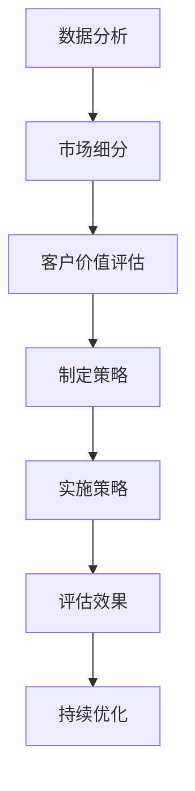

                 

# 一人公司的客户细分：精准定位高价值用户

> **关键词：** 一人公司、客户细分、高价值用户、精准定位、数据分析、商业策略

> **摘要：** 本文将探讨如何通过深入分析数据，实现一人公司对于高价值客户的精准定位，从而制定出有效的商业策略，提升公司盈利能力和市场竞争力。

在当今这个信息爆炸的时代，精准的客户定位已成为企业成功的关键。对于一人公司而言，由于其资源和人力相对有限，如何高效地识别和吸引高价值客户显得尤为重要。本文将围绕这一主题，通过以下章节展开详细讨论：

## 1. 背景介绍

一人公司，顾名思义，是指由单一个人或小团队运营的企业。这种模式在当今创业环境中越来越受欢迎，尤其适合那些追求自由、独立和创新精神的创业者。然而，相对于大企业，一人公司在资源、规模和影响力方面存在明显劣势。因此，如何在竞争激烈的市场中生存和发展，成为一人公司需要面对的挑战。

### 1.1 市场环境

当前市场环境瞬息万变，消费者需求日益多样化和个性化。传统的营销策略已经无法满足现代市场的需求。一人公司必须具备敏锐的市场洞察力，能够迅速适应市场变化，抓住商机。

### 1.2 客户细分的重要性

客户细分是指将市场中的潜在客户根据不同的特征进行分类，以便更有效地进行营销和服务。对于一人公司来说，精准的客户细分有助于：

- **提高营销效率：** 针对不同客户群体制定个性化的营销策略，降低营销成本。
- **提升客户满意度：** 提供符合客户需求的产品和服务，增强客户忠诚度。
- **增加盈利能力：** 通过识别高价值客户，实现资源的最大化利用。

## 2. 核心概念与联系

在探讨如何进行客户细分之前，我们需要了解一些核心概念，包括数据分析、市场细分和客户价值评估。

### 2.1 数据分析

数据分析是指通过收集、处理和解释数据，从中提取有价值的信息和洞见。对于一人公司而言，数据分析是精准定位高价值客户的基础。

### 2.2 市场细分

市场细分是指将整个市场按照某种标准划分为若干个具有相似需求和特征的小市场。市场细分有助于一人公司识别出目标客户群体，制定有针对性的营销策略。

### 2.3 客户价值评估

客户价值评估是指根据客户的购买行为、消费习惯、支付能力等因素，评估客户对公司盈利的贡献度。对于一人公司来说，客户价值评估有助于识别高价值客户，实现资源的最优配置。

### 2.4 Mermaid 流程图

以下是一个简单的 Mermaid 流程图，展示了一人公司客户细分的过程：



通过这个流程图，我们可以看到数据分析、市场细分和客户价值评估在客户细分过程中的关键作用。

## 3. 核心算法原理 & 具体操作步骤

### 3.1 数据收集

首先，我们需要收集相关数据，包括客户的基本信息、购买历史、行为数据等。这些数据可以从企业的CRM系统、电商平台、社交媒体等渠道获取。

### 3.2 数据清洗

收集到的数据往往存在不完整、不一致或错误的情况，因此需要进行数据清洗。数据清洗包括去除重复记录、填补缺失值、处理异常值等。

### 3.3 数据分析

通过数据分析，我们可以识别出客户的购买行为、偏好和需求。常见的数据分析方法包括：

- **描述性分析：** 描述客户群体的基本特征和购买行为。
- **关联分析：** 分析客户之间的关联关系，找出潜在的购买关联。
- **聚类分析：** 根据客户的特征将其划分为不同的群体。

### 3.4 市场细分

根据数据分析的结果，我们可以将客户划分为不同的市场细分群体。市场细分的方法包括：

- **基于人口统计学特征：** 如年龄、性别、收入等。
- **基于行为特征：** 如购买频率、购买金额等。
- **基于心理特征：** 如价值观、兴趣爱好等。

### 3.5 客户价值评估

通过客户价值评估，我们可以识别出高价值客户。常见的客户价值评估方法包括：

- **RFM 模型：** 根据客户的最近一次购买时间（Recency）、购买频率（Frequency）和购买金额（Monetary）进行评估。
- **CLV 模型：** 根据客户的生命周期价值（Customer Lifetime Value）进行评估。

### 3.6 制定策略

根据市场细分和客户价值评估的结果，我们可以制定相应的营销策略。例如：

- **高价值客户：** 提供个性化服务、优惠折扣等，增强客户忠诚度。
- **一般客户：** 提供常规服务，维护客户关系。
- **潜在客户：** 通过营销活动吸引其转化为实际购买。

## 4. 数学模型和公式 & 详细讲解 & 举例说明

### 4.1 RFM 模型

RFM 模型是一种常用的客户价值评估方法，其公式如下：

$$
\text{RFM 评分} = \text{最近一次购买时间} \times \text{购买频率} \times \text{购买金额}
$$

假设我们有以下客户的购买数据：

- 客户A：最近一次购买时间为 1 个月前，购买频率为 5 次，购买金额为 1000 元。
- 客户B：最近一次购买时间为 3 个月前，购买频率为 3 次，购买金额为 500 元。

根据 RFM 模型，我们可以计算出两位客户的 RFM 评分：

- 客户A：\(1 \times 5 \times 1000 = 5000\)
- 客户B：\(3 \times 3 \times 500 = 4500\)

显然，客户A的 RFM 评分更高，因此可以认为客户A是高价值客户。

### 4.2 CLV 模型

CLV 模型（Customer Lifetime Value）是一种基于客户生命周期价值的评估方法。其公式如下：

$$
\text{CLV} = \sum_{t=1}^{n} \frac{\text{购买金额}}{(1 + \text{折扣率})^t}
$$

其中，n 为客户的生命周期（以年为单位），折扣率通常取 10%。

假设我们有以下客户的购买数据：

- 客户C：一年内购买了 3 次，每次购买金额为 2000 元。
- 客户D：一年内购买了 1 次，购买金额为 5000 元。

根据 CLV 模型，我们可以计算出两位客户的 CLV：

- 客户C：\( \frac{2000}{1.1} + \frac{2000}{1.1^2} + \frac{2000}{1.1^3} = 5543.89 \)
- 客户D：\( \frac{5000}{1.1} = 4545.45 \)

显然，客户C的 CLV 更高，因此可以认为客户C是高价值客户。

## 5. 项目实战：代码实际案例和详细解释说明

### 5.1 开发环境搭建

为了演示如何实现一人公司的客户细分，我们使用 Python 编写了一个简单的代码示例。首先，我们需要搭建开发环境。

- 安装 Python 3.8 或以上版本。
- 安装必要的库，如 NumPy、Pandas、Matplotlib 等。

### 5.2 源代码详细实现和代码解读

以下是一个简单的 Python 代码示例，用于计算客户的 RFM 评分和 CLV：

```python
import pandas as pd
import numpy as np

# 读取客户数据
data = pd.DataFrame({
    '客户ID': [1, 2, 3, 4],
    '最近一次购买时间': [1, 3, 2, 1],
    '购买频率': [5, 3, 5, 2],
    '购买金额': [1000, 500, 1000, 500]
})

# 计算 RFM 评分
data['RFM 评分'] = data['最近一次购买时间'] * data['购买频率'] * data['购买金额']

# 计算 CLV
def calculate_clv(purchase_amount, discount_rate, life_time):
    return sum(purchase_amount / ((1 + discount_rate) ** t) for t in range(1, life_time + 1))

data['CLV'] = data.apply(lambda x: calculate_clv(x['购买金额'], 0.1, 1), axis=1)

# 打印结果
print(data)
```

### 5.3 代码解读与分析

这段代码首先读取了客户数据，包括客户ID、最近一次购买时间、购买频率和购买金额。然后，我们计算了每个客户的 RFM 评分和 CLV。

- **RFM 评分：** 通过计算最近一次购买时间、购买频率和购买金额的乘积得到。RFM 评分越高，表示客户的价值越高。
- **CLV：** 通过递归计算每个客户的生命周期价值。CLV 越高，表示客户对公司盈利的贡献越大。

通过这段代码，我们可以轻松地实现一人公司的客户细分，识别出高价值客户。

## 6. 实际应用场景

### 6.1 咖啡馆

一家咖啡馆可以通过客户细分，识别出常客和一次性客户。针对常客，咖啡馆可以提供会员卡、优惠折扣等，增强客户忠诚度。对于一次性客户，咖啡馆可以推出限时优惠活动，吸引其再次光顾。

### 6.2 电子商务平台

电子商务平台可以通过客户细分，识别出高价值客户和潜在客户。对于高价值客户，平台可以提供定制化的推荐服务和优惠活动，提升客户满意度。对于潜在客户，平台可以通过精准营销，引导其完成购买。

### 6.3 教育培训机构

教育培训机构可以通过客户细分，识别出学习需求强烈的客户和观望的客户。对于学习需求强烈的客户，培训机构可以提供个性化的课程推荐和学习计划。对于观望的客户，培训机构可以提供试听课、免费学习资源等，吸引其报名。

## 7. 工具和资源推荐

### 7.1 学习资源推荐

- **书籍：** 《大数据营销：如何通过数据驱动营销策略提升销售额》
- **论文：** 《精准营销：基于客户细分和大数据分析的方法研究》
- **博客：** 《数据分析实战：如何用数据分析提升客户满意度》
- **网站：** Coursera、edX 等在线课程平台，提供相关课程和资源。

### 7.2 开发工具框架推荐

- **数据分析工具：** Pandas、NumPy、Matplotlib、Seaborn 等。
- **机器学习框架：** Scikit-learn、TensorFlow、PyTorch 等。
- **数据可视化工具：** Matplotlib、Seaborn、Plotly 等。

### 7.3 相关论文著作推荐

- **论文：** 《基于客户细分的大数据营销策略研究》
- **著作：** 《精准营销：基于数据挖掘和客户细分的方法》

## 8. 总结：未来发展趋势与挑战

随着大数据和人工智能技术的不断发展，客户细分在商业策略中的应用将越来越广泛。然而，这也带来了一些挑战：

- **数据隐私问题：** 在进行客户细分时，如何保护客户隐私是一个重要问题。
- **数据质量：** 数据质量对客户细分的准确性有重要影响，如何确保数据质量是一个挑战。
- **模型适应性：** 随着市场环境的变化，如何调整和优化客户细分模型也是一个挑战。

## 9. 附录：常见问题与解答

### 9.1 什么是客户细分？

客户细分是指将市场中的潜在客户根据不同的特征进行分类，以便更有效地进行营销和服务。

### 9.2 客户细分有哪些方法？

客户细分的方法包括基于人口统计学特征、行为特征和心理特征等。

### 9.3 如何计算 RFM 评分和 CLV？

RFM 评分的计算公式为：最近一次购买时间 × 购买频率 × 购买金额。CLV 的计算公式为：∑(购买金额 / (1 + 折扣率)^t)。

## 10. 扩展阅读 & 参考资料

- 《大数据营销：如何通过数据驱动营销策略提升销售额》
- 《精准营销：基于数据挖掘和客户细分的方法》
- 《数据分析实战：如何用数据分析提升客户满意度》
- Coursera、edX 等在线课程平台的相关课程和资源

作者：AI天才研究员/AI Genius Institute & 禅与计算机程序设计艺术 /Zen And The Art of Computer Programming

