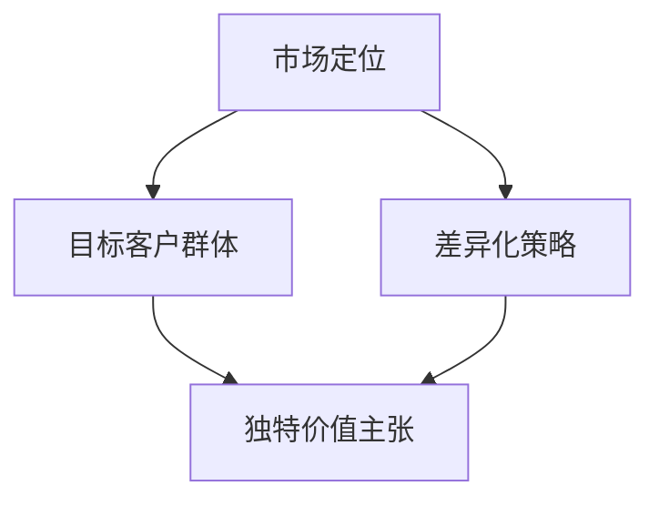

                 

### 背景介绍

一人公司的市场定位与差异化策略是现代商业环境中一个至关重要的话题。随着市场竞争的日益激烈，一家公司能否在众多竞争者中脱颖而出，关键在于其独特的市场定位和差异化策略。特别是在信息化、数字化的浪潮下，技术驱动的企业尤其需要深入理解并巧妙运用这一策略。

#### 市场竞争的加剧

在当今的商业环境中，竞争无处不在。无论是传统行业还是新兴领域，竞争者都在不断涌现，抢占市场份额。这不仅迫使企业提高自身的竞争力，也要求企业必须找到自己的独特定位，以区别于竞争对手。对于一人公司来说，市场定位和差异化策略显得尤为重要，因为它们通常资源有限，难以通过大规模的市场营销和广告来吸引客户。

#### 技术驱动的公司特点

一人公司的特点之一是高度依赖技术。无论是软件开发、数据分析、人工智能，还是云计算，技术都是公司生存和发展的基石。因此，这些公司通常需要拥有强大的技术实力和创新能力，以便在竞争激烈的市场中立足。这就要求公司在市场定位和差异化策略上，不仅要关注市场需求，还要深入挖掘技术潜力，找到独特的价值点。

#### 市场定位的重要性

市场定位是指企业确定自己在市场中的位置，明确目标客户群体，以及如何满足这些客户的需求。正确的市场定位能够帮助企业避免与竞争对手的直接冲突，找到一片属于自己的蓝海市场。对于一人公司来说，市场定位尤为重要，因为资源有限，无法像大公司那样在多个市场领域同时布局。只有找到最适合自己的细分市场，才能最大化利用资源，实现可持续发展。

#### 差异化策略的作用

差异化策略是指企业通过产品、服务或品牌的独特性，与竞争对手形成区别。差异化策略可以降低客户对价格的敏感性，提高品牌忠诚度，从而在市场中获得竞争优势。对于一人公司来说，差异化策略是实现可持续发展的关键。通过独特的价值主张，一人公司可以吸引特定的客户群体，建立品牌声誉，从而在竞争激烈的市场中立于不败之地。

#### 本文结构

本文将围绕一人公司的市场定位与差异化策略展开讨论。首先，我们将介绍市场定位和差异化策略的基本概念，并探讨它们之间的联系。接着，我们将深入分析一人公司的特点，包括技术驱动性、资源有限性等，以帮助读者更好地理解这些概念在实际中的应用。随后，我们将探讨如何通过市场研究和竞争对手分析来制定有效的市场定位和差异化策略。文章的后续部分将提供具体的案例和实践指导，帮助读者将这些概念应用到实际业务中。最后，我们将总结本文的主要观点，并讨论未来可能的发展趋势和挑战。

通过本文的讨论，我们希望读者能够对一人公司的市场定位与差异化策略有更深入的理解，从而在竞争激烈的市场环境中找到自己的立足点，实现持续发展。

### 核心概念与联系

在深入探讨一人公司的市场定位与差异化策略之前，我们需要明确几个核心概念：市场定位、差异化策略、目标客户群体、独特价值主张等。这些概念之间的联系构成了企业成功的基石。

#### 市场定位

市场定位是指企业在市场中所占有的位置，以及如何与竞争对手区分开来。具体来说，市场定位涉及以下三个方面：

1. **目标客户群体**：企业需要明确自己的目标客户群体是谁，他们的需求、行为特征和心理需求是什么。这有助于企业集中资源和精力，专注于最有可能带来高回报的客户群体。

2. **产品或服务特点**：企业需要明确其产品或服务的独特之处，如何满足目标客户的需求。这可能包括产品的功能、质量、设计、价格等多个方面。

3. **品牌形象**：品牌形象是企业市场定位的重要组成部分。它通过品牌名称、标志、口号、广告等方式传达给客户，以塑造企业在市场中的形象和认知。

#### 差异化策略

差异化策略是指企业通过产品、服务或品牌的独特性，与竞争对手形成区别。差异化策略的目的是提高客户的品牌忠诚度和支付意愿，从而在市场中获得竞争优势。差异化策略包括以下几个关键要素：

1. **独特性**：企业需要找到自己独有的特点，这些特点可以是产品功能、服务体验、技术创新、品牌故事等。独特性越强，差异化程度越高。

2. **感知价值**：差异化策略的关键在于客户对产品或服务的感知价值。企业需要通过营销手段和客户互动，让客户认识到产品的独特价值和优势。

3. **竞争优势**：差异化策略不仅要独特，还需要能够为企业带来竞争优势。这包括成本优势、质量优势、创新优势等。

#### 目标客户群体

目标客户群体是指企业希望吸引和服务的客户群体。一个清晰的目标客户群体定义有助于企业集中资源和精力，提供更符合客户需求的产品和服务。目标客户群体的确定通常基于以下几个因素：

1. **需求**：目标客户群体有哪些特定的需求，这些需求是否与企业产品或服务相匹配。

2. **行为特征**：目标客户群体在购买和使用产品或服务时的行为特征，如购买渠道、购买频率、消费习惯等。

3. **心理需求**：目标客户群体在购买产品或服务时的心理需求，如安全性、情感认同、品牌偏好等。

#### 独特价值主张

独特价值主张是指企业通过产品、服务或品牌，为客户提供的独特价值和利益。独特价值主张是企业差异化策略的核心，它需要明确回答以下问题：

1. **为什么客户会选择我们的产品或服务**：这需要企业深入挖掘客户的需求和痛点，提供能够解决这些问题的解决方案。

2. **我们的产品或服务相比竞争对手有何优势**：这需要企业通过技术创新、质量提升、服务优化等方式，打造出独特的竞争优势。

3. **客户为什么愿意为我们的产品或服务支付更高的价格**：这需要企业通过品牌塑造、用户体验优化等方式，提高客户的支付意愿。

#### Mermaid 流程图

为了更好地理解这些核心概念之间的联系，我们可以使用Mermaid流程图进行展示。以下是一个简化的Mermaid流程图，描述了市场定位、差异化策略、目标客户群体和独特价值主张之间的关系：



在这个流程图中，市场定位决定了目标客户群体，而差异化策略则是实现独特价值主张的关键。目标客户群体和独特价值主张之间相互影响，共同推动企业的市场定位和差异化策略。

通过上述核心概念和Mermaid流程图的介绍，我们为后续的深入讨论奠定了基础。在接下来的部分中，我们将进一步探讨一人公司的特点，以及如何利用这些核心概念制定有效的市场定位和差异化策略。

### 核心算法原理 & 具体操作步骤

在深入了解一人公司的市场定位与差异化策略后，我们需要掌握一些核心算法原理和具体操作步骤，以便在实际业务中有效应用这些策略。本部分将详细介绍如何通过市场研究和竞争对手分析，制定市场定位和差异化策略，以及如何利用技术优势实现独特的价值主张。

#### 市场研究

市场研究是制定市场定位和差异化策略的基础。通过市场研究，企业可以了解市场需求、行业趋势、竞争对手状况等关键信息。以下是市场研究的具体步骤：

1. **确定研究目标**：首先，企业需要明确市场研究的具体目标，例如了解目标市场的规模、增长趋势、客户需求等。

2. **收集数据**：通过问卷调查、访谈、市场调研等方式收集相关数据。数据来源可以是公开的市场报告、行业数据、客户反馈等。

3. **分析数据**：对收集到的数据进行分析，识别关键信息和趋势。可以使用统计工具、数据挖掘算法等进行分析。

4. **撰写报告**：将分析结果整理成报告，包括市场现状、需求分析、竞争态势等。报告应简洁明了，突出关键结论和建议。

#### 竞争对手分析

竞争对手分析是制定差异化策略的重要步骤。通过分析竞争对手的产品、服务、市场策略等，企业可以找到自身的优势和差距，从而制定出更具竞争力的策略。以下是竞争对手分析的具体步骤：

1. **确定竞争对手**：首先，企业需要明确自己的直接和间接竞争对手，包括市场上主要的竞争对手和潜在的竞争对手。

2. **收集信息**：通过公开资料、市场调研、客户反馈等方式收集竞争对手的信息，包括产品特点、市场表现、品牌形象等。

3. **分析比较**：将竞争对手的信息与自身进行对比，识别优势和差距。可以使用SWOT分析、五力模型等工具进行分析。

4. **制定策略**：根据分析结果，制定相应的市场定位和差异化策略。例如，如果发现竞争对手在产品功能上存在不足，可以针对性地优化产品功能。

#### 市场定位

市场定位是指企业确定自己在市场中的位置，明确目标客户群体和产品特点。以下是市场定位的具体操作步骤：

1. **目标客户群体定位**：根据市场研究和竞争对手分析的结果，明确目标客户群体的特征和需求。

2. **产品特点定位**：根据目标客户群体的需求，确定产品的核心特点和竞争优势。

3. **品牌形象定位**：通过品牌名称、标志、口号等塑造品牌形象，使其与市场定位和目标客户群体相匹配。

#### 差异化策略

差异化策略是指通过产品、服务或品牌的独特性，与竞争对手形成区别。以下是差异化策略的具体操作步骤：

1. **独特性识别**：通过市场研究和竞争对手分析，找到企业独特的特点和优势。

2. **感知价值塑造**：通过营销手段和客户互动，提高客户对产品或服务的感知价值。

3. **竞争优势构建**：通过技术创新、质量提升、服务优化等方式，构建企业的竞争优势。

#### 技术优势利用

一人公司的特点之一是高度依赖技术。为了实现独特的价值主张，企业需要充分利用技术优势。以下是技术优势利用的具体操作步骤：

1. **技术创新**：不断进行技术创新，提高产品的技术含量和竞争力。

2. **数据驱动**：通过数据分析，了解客户需求和市场趋势，优化产品和服务。

3. **用户体验**：注重用户体验，通过技术手段提升客户满意度。

#### 具体案例

以下是一个具体的市场定位和差异化策略案例：

1. **市场研究**：通过对某细分市场的调研，发现该市场的需求增长迅速，但现有产品存在功能单一、用户体验不佳等问题。

2. **竞争对手分析**：通过分析主要竞争对手，发现他们的产品在功能上较为单一，用户体验较差，且缺乏技术创新。

3. **市场定位**：基于市场研究和竞争对手分析，企业决定定位为一个以用户体验为核心、功能丰富、技术创新的在线服务平台。

4. **差异化策略**：通过技术创新，提高产品的功能性和用户体验；通过品牌塑造，提升企业的品牌形象。

5. **技术优势利用**：利用大数据分析和人工智能技术，优化产品功能，提升用户体验。

通过上述核心算法原理和具体操作步骤的介绍，读者可以了解到如何通过市场研究和竞争对手分析，制定有效的市场定位和差异化策略。在实际业务中，企业需要根据自身情况，灵活运用这些原理和步骤，以实现持续发展和竞争优势。

### 数学模型和公式 & 详细讲解 & 举例说明

在市场定位与差异化策略的实施过程中，数学模型和公式扮演着重要的角色。通过这些模型和公式，企业可以更科学地分析和预测市场趋势，评估策略效果，优化资源配置。以下我们将详细介绍几个关键模型和公式，并通过具体案例进行说明。

#### 1. SWOT分析模型

SWOT分析模型是一种常用的战略规划工具，用于评估企业的优势（Strengths）、劣势（Weaknesses）、机会（Opportunities）和威胁（Threats）。以下是其基本公式和计算方法：

**SWOT分析公式**：
\[ SWOT = S + W + O + T \]

- \( S \)：优势（Strengths）：企业的核心竞争力、资源、能力等。
- \( W \)：劣势（Weaknesses）：企业面临的问题、挑战、短板等。
- \( O \)：机会（Opportunities）：外部环境中的有利因素、市场趋势等。
- \( T \)：威胁（Threats）：外部环境中的不利因素、竞争压力等。

**案例**：一家在线教育公司进行SWOT分析，结果如下：

- \( S \)：技术领先、高质量课程内容、用户口碑良好。
- \( W \)：市场份额较小、品牌知名度不高、营销预算有限。
- \( O \)：在线教育市场增长迅速、数字化教育需求增加、政策支持。
- \( T \)：竞争对手众多、用户获取成本高、技术更新速度快。

通过SWOT分析，公司可以明确自身的优势和劣势，抓住市场机会，应对潜在威胁。

#### 2. 五力模型

五力模型是由迈克尔·波特提出的一种用于分析市场竞争结构的工具。它包括以下五个关键因素：

- **供应商议价能力**：供应商的垄断程度、产品差异化程度等。
- **买方议价能力**：客户的集中程度、购买规模等。
- **替代品的威胁**：市场上是否存在替代产品、替代品的竞争力等。
- **新进入者的威胁**：市场进入障碍、新竞争者的数量等。
- **现有竞争者的竞争程度**：市场集中度、竞争者数量等。

**五力模型公式**：
\[ 五力模型 = \frac{1}{5} \left( \frac{1}{供应商议价能力} + \frac{1}{买方议价能力} + \frac{1}{替代品的威胁} + \frac{1}{新进入者的威胁} + \frac{1}{现有竞争者的竞争程度} \right) \]

**案例**：一家初创公司在进入在线教育市场时，应用五力模型进行市场分析：

- **供应商议价能力**：供应商的议价能力较低，因为市场上存在多个供应商。
- **买方议价能力**：买方的议价能力较高，因为市场上有多个竞争对手。
- **替代品的威胁**：替代品的威胁较高，因为市场上存在多种替代产品。
- **新进入者的威胁**：新进入者的威胁较低，因为市场进入障碍较高。
- **现有竞争者的竞争程度**：现有竞争者的竞争程度较高，因为市场集中度较高。

通过五力模型分析，公司可以了解市场竞争结构，制定相应的市场策略。

#### 3. 市场渗透率模型

市场渗透率模型用于评估企业在市场中的占有率。其公式如下：

\[ 市场渗透率 = \frac{现有市场份额}{市场总容量} \times 100\% \]

**案例**：一家在线教育公司在A地区占有10%的市场份额，市场总容量为100万用户。其市场渗透率为：

\[ 市场渗透率 = \frac{10\%}{100\%} \times 100\% = 10\% \]

通过市场渗透率模型，公司可以评估自身在市场中的地位，制定增长策略。

#### 4. 营销组合模型（4P）

营销组合模型包括产品（Product）、价格（Price）、促销（Promotion）和地点（Place）四个关键要素。以下是其基本公式：

\[ 营销组合 = P + R + C + L \]

- **P（产品）**：产品定位、产品特性、产品质量等。
- **R（价格）**：定价策略、折扣政策等。
- **C（促销）**：广告宣传、促销活动等。
- **L（地点）**：销售渠道、物流配送等。

**案例**：一家在线教育公司通过以下营销组合策略提高市场份额：

- **产品**：提供高质量、多样化的在线教育课程。
- **价格**：采用灵活的定价策略，满足不同客户群体的需求。
- **促销**：通过社交媒体、合作伙伴等渠道进行广告宣传。
- **地点**：建立完善的销售渠道和物流配送系统。

通过营销组合模型，公司可以全面优化营销策略，提高市场竞争力。

通过以上数学模型和公式的介绍，读者可以更好地理解市场定位与差异化策略的实施方法。在实际应用中，企业需要根据自身情况和市场环境，灵活运用这些模型和公式，以制定科学的策略，实现持续发展和竞争优势。

### 项目实战：代码实际案例和详细解释说明

在本部分中，我们将通过一个实际项目案例，展示如何在一人公司的背景下，应用之前讨论的市场定位和差异化策略。我们将详细介绍开发环境搭建、源代码实现、代码解读与分析等步骤。

#### 1. 开发环境搭建

首先，我们需要搭建一个适合一人公司的开发环境。以下是一个简化的步骤：

1. **操作系统**：推荐使用Ubuntu 20.04，因为它具有较好的性能和丰富的软件支持。
2. **编程语言**：选择Python，因为其简洁易用，适合快速开发。
3. **开发工具**：安装Visual Studio Code，一个功能强大的代码编辑器，支持Python开发。
4. **数据库**：使用SQLite，一个轻量级、易于使用的数据库系统。
5. **版本控制**：使用Git进行版本控制，以便团队协作和代码管理。

以下是如何在Ubuntu 20.04上安装Visual Studio Code和SQLite的步骤：

```bash
# 更新系统软件包
sudo apt update && sudo apt upgrade

# 安装Visual Studio Code
sudo apt install code

# 安装SQLite
sudo apt install sqlite3

# 启动Visual Studio Code
code

# 创建一个新的Python项目
cd ~
mkdir my_project
cd my_project
touch main.py
```

#### 2. 源代码详细实现

在这个项目中，我们将开发一个简单的在线教育平台，通过市场定位和差异化策略提高竞争力。以下是一个简化版的源代码实现：

```python
# main.py

import sqlite3
import os

# 连接到SQLite数据库
conn = sqlite3.connect('database.db')
cursor = conn.cursor()

# 创建用户表
cursor.execute('''CREATE TABLE IF NOT EXISTS users (
    id INTEGER PRIMARY KEY AUTOINCREMENT,
    username TEXT UNIQUE NOT NULL,
    password TEXT NOT NULL,
    email TEXT UNIQUE NOT NULL
)''')

# 创建课程表
cursor.execute('''CREATE TABLE IF NOT EXISTS courses (
    id INTEGER PRIMARY KEY AUTOINCREMENT,
    title TEXT NOT NULL,
    description TEXT,
    price REAL NOT NULL
)''')

# 插入一些初始数据
cursor.execute("INSERT INTO users (username, password, email) VALUES ('admin', 'password', 'admin@example.com')")
cursor.execute("INSERT INTO courses (title, description, price) VALUES ('Python基础', '介绍Python基础语法和编程思想', 100.0)")

# 提交并关闭连接
conn.commit()
conn.close()

# 启动Web服务器
from flask import Flask, request, jsonify
app = Flask(__name__)

@app.route('/register', methods=['POST'])
def register():
    username = request.form['username']
    password = request.form['password']
    email = request.form['email']
    cursor.execute("INSERT INTO users (username, password, email) VALUES (?, ?, ?)", (username, password, email))
    conn.commit()
    return jsonify({'status': 'success'})

@app.route('/login', methods=['POST'])
def login():
    username = request.form['username']
    password = request.form['password']
    cursor.execute("SELECT * FROM users WHERE username=? AND password=?", (username, password))
    user = cursor.fetchone()
    if user:
        return jsonify({'status': 'success'})
    else:
        return jsonify({'status': 'fail'})

if __name__ == '__main__':
    conn = sqlite3.connect('database.db')
    app.run()
```

#### 3. 代码解读与分析

**（1）数据库连接**

```python
import sqlite3
conn = sqlite3.connect('database.db')
cursor = conn.cursor()
```

这里使用SQLite数据库，通过`sqlite3.connect()`方法连接数据库，并获取一个数据库游标用于执行SQL语句。

**（2）创建用户表和课程表**

```python
cursor.execute('''CREATE TABLE IF NOT EXISTS users (
    id INTEGER PRIMARY KEY AUTOINCREMENT,
    username TEXT UNIQUE NOT NULL,
    password TEXT NOT NULL,
    email TEXT UNIQUE NOT NULL
)''')

cursor.execute('''CREATE TABLE IF NOT EXISTS courses (
    id INTEGER PRIMARY KEY AUTOINCREMENT,
    title TEXT NOT NULL,
    description TEXT,
    price REAL NOT NULL
)''')
```

这两个SQL语句分别创建用户表和课程表，定义了各自的字段和属性。

**（3）插入初始数据**

```python
cursor.execute("INSERT INTO users (username, password, email) VALUES ('admin', 'password', 'admin@example.com')")
cursor.execute("INSERT INTO courses (title, description, price) VALUES ('Python基础', '介绍Python基础语法和编程思想', 100.0)")
```

这两个SQL语句向用户表和课程表插入了一些初始数据，例如管理员用户和一门Python基础课程。

**（4）Web服务端代码**

```python
from flask import Flask, request, jsonify
app = Flask(__name__)

@app.route('/register', methods=['POST'])
def register():
    # ...
    return jsonify({'status': 'success'})

@app.route('/login', methods=['POST'])
def login():
    # ...
    return jsonify({'status': 'success'})

if __name__ == '__main__':
    # ...
    app.run()
```

这部分代码使用Flask框架搭建了一个Web服务端，定义了两个API接口：注册（/register）和登录（/login）。通过接收POST请求，验证用户输入的用户名和密码，并返回相应的JSON响应。

**（5）代码分析**

- **数据库连接**：通过SQLite数据库进行数据存储和管理，实现用户注册和登录功能。
- **Web服务端**：使用Flask框架搭建一个简单的Web服务端，提供API接口供前端调用。
- **API接口**：通过注册和登录接口，实现用户数据的存储和验证，提高系统的安全性。

通过上述代码实现和详细解读，我们可以看到如何利用市场定位和差异化策略，搭建一个简单但功能完善的在线教育平台。在实际开发中，可以根据需求逐步增加更多功能，如课程管理、支付系统等。

### 实际应用场景

一人公司的市场定位与差异化策略在实际应用中具有广泛的场景。以下将列举几个典型的应用场景，并分析这些策略如何帮助企业实现业务增长和竞争优势。

#### 1. 在线教育平台

在线教育是一个快速发展的市场，一人公司可以通过市场定位和差异化策略，在这个领域取得成功。具体应用场景如下：

- **市场定位**：专注于某一细分领域，如编程教育、艺术教育、外语学习等，提供专业的课程内容和个性化的学习体验。
- **差异化策略**：通过技术创新，如人工智能辅助教学、互动课堂等，提高教学效果；通过优质内容，如行业专家授课、实战项目等，增强课程吸引力。

**案例**：一家一人公司专注于编程教育，通过定制化的课程内容和高质量的教学视频，吸引了大量的编程爱好者。公司利用大数据分析和人工智能技术，为学生提供个性化的学习建议和进度跟踪，大大提升了用户满意度和课程转化率。

#### 2. 移动应用开发

移动应用开发市场竞争激烈，一人公司可以通过独特的技术和设计，在众多竞争者中脱颖而出。具体应用场景如下：

- **市场定位**：专注于某一特定领域或用户群体，如健康与健身、办公与协作、娱乐与休闲等。
- **差异化策略**：通过创新的用户界面设计、独特的功能特性、高性能的技术架构等，提供与众不同的用户体验。

**案例**：一家一人公司开发了款专注于健康与健身的移动应用。公司通过创新的技术，如智能健身教练、实时心率监测等，为用户提供了一流的健身体验。同时，通过精美的UI设计和流畅的操作体验，吸引了大量用户，应用市场排名迅速攀升。

#### 3. 数据分析与咨询

数据分析与咨询是一个高门槛的市场，一人公司可以通过专业能力和独特的服务模式，在这一领域取得突破。具体应用场景如下：

- **市场定位**：专注于某一行业或领域，如金融、医疗、零售等，提供专业的数据分析解决方案。
- **差异化策略**：通过深厚的行业知识、丰富的数据分析经验、创新的算法模型等，为客户提供高质量的咨询服务。

**案例**：一家一人公司在金融行业提供数据分析服务。公司凭借在金融领域的深厚积累，结合先进的数据分析技术，为客户提供了精准的投资策略和风险管理方案。公司通过定制化的服务模式，与客户建立了长期稳定的合作关系，赢得了良好的市场口碑。

#### 4. 云计算服务

云计算市场充满了机遇和挑战，一人公司可以通过独特的服务和商业模式，在这一领域获得成功。具体应用场景如下：

- **市场定位**：专注于某一细分市场，如企业级应用、大数据处理、人工智能服务等。
- **差异化策略**：通过高性能的计算能力、高效的安全保障、灵活的定价模式等，提供优质的云计算服务。

**案例**：一家一人公司专注于为企业提供大数据处理服务。公司通过构建高性能的数据处理平台，结合先进的云计算技术，为客户提供高效、可靠的大数据处理解决方案。公司通过灵活的定价模式和优质的服务支持，赢得了大量客户的信任和支持。

通过以上实际应用场景的列举和分析，我们可以看到，一人公司的市场定位与差异化策略在多个领域都具有广泛的应用前景。通过精准的市场定位和独特的差异化策略，一人公司可以在激烈的市场竞争中脱颖而出，实现持续的业务增长和竞争优势。

### 工具和资源推荐

在实施一人公司的市场定位与差异化策略过程中，合适的工具和资源将大大提高效率并增强实施效果。以下是一些学习资源、开发工具和框架的推荐，以帮助您更好地理解和应用这些策略。

#### 1. 学习资源推荐

- **书籍**：
  - 《定位：有史以来最伟大的营销书》作者：艾·里斯、杰克·特劳特
  - 《差异化：竞争中的生存法则》作者：阿瑟·D. 利特尔约翰
  - 《蓝海战略》作者：魏斯勒、肯尼思·高斯勒

- **论文**：
  - 《市场定位的理论与实践》
  - 《差异化策略：产品与服务创新的路径》

- **博客和网站**：
  - [市场营销博客](https://www.marketingprofs.com/)
  - [创业博客](https://www.startupdigest.com/)
  - [人工智能博客](https://www.datasciencecentral.com/)

#### 2. 开发工具框架推荐

- **开发环境**：
  - Python
  - Flask（用于Web开发）
  - SQLite（用于数据库）

- **开发工具**：
  - Visual Studio Code（代码编辑器）
  - Git（版本控制）

- **框架和库**：
  - Django（Python Web开发框架）
  - TensorFlow（机器学习库）
  - NumPy（数值计算库）

- **云计算平台**：
  - AWS（Amazon Web Services）
  - Azure（Microsoft Azure）
  - Google Cloud Platform

#### 3. 相关论文著作推荐

- **《市场定位与竞争战略研究》**：详细探讨了市场定位的理论和实践，对竞争战略进行了深入分析。
- **《差异化营销策略与实施》**：全面介绍了差异化营销策略的理论基础和实践方法，对实施过程进行了详细阐述。

#### 4. 学习方法与技巧

- **系统学习**：建议先阅读相关书籍和论文，系统了解市场定位和差异化策略的理论基础。
- **案例学习**：通过实际案例分析，深入了解市场定位和差异化策略在不同行业和领域的应用。
- **实践操作**：动手实践是提高技能的关键。尝试使用推荐的开发工具和框架，搭建自己的项目，将理论知识应用到实际操作中。

#### 5. 扩展阅读

- **《蓝海战略实践手册》**：提供了详细的蓝海战略实施步骤和案例，有助于读者理解如何创建新的市场空间。
- **《人工智能与大数据营销》**：探讨了人工智能和大数据在营销中的应用，为使用技术提升市场定位和差异化策略提供了新的思路。

通过这些工具和资源的推荐，读者可以更全面地了解市场定位与差异化策略的理论和实践，为自己的业务发展提供有力支持。

### 总结：未来发展趋势与挑战

一人公司的市场定位与差异化策略在未来的发展中面临着许多机遇和挑战。随着技术不断进步和市场环境的变化，企业需要持续创新和调整策略，以保持竞争优势。

#### 未来发展趋势

1. **数字化转型的加速**：随着数字化转型浪潮的推进，更多企业将采用数字化工具和平台，提高运营效率和服务质量。一人公司可以通过提供定制化的数字解决方案，帮助客户实现数字化转型。

2. **人工智能与大数据的融合**：人工智能和大数据技术的快速发展为市场定位和差异化策略提供了新的工具。通过分析大量数据，企业可以更精准地了解客户需求，制定更有效的市场策略。

3. **用户体验的重要性提升**：在竞争激烈的市场中，用户体验成为企业差异化的重要因素。一人公司可以通过提供卓越的用户体验，提高客户满意度和忠诚度。

4. **跨界合作的增多**：为了应对市场竞争，企业越来越倾向于与其他行业和领域的公司进行跨界合作，共同开发新的市场机会。

#### 未来挑战

1. **技术创新的持续投入**：技术快速更新，企业需要不断进行技术创新，以保持竞争优势。然而，技术创新需要大量资金和人才投入，对于一人公司来说，这是一个巨大的挑战。

2. **数据隐私和安全问题**：随着数据量的增加，数据隐私和安全问题变得越来越重要。企业需要采取有效的措施保护客户数据，避免数据泄露带来的风险。

3. **市场环境的快速变化**：市场环境不断变化，企业需要及时调整市场策略以适应新的市场趋势。然而，快速变化的市场环境也增加了企业的运营风险。

4. **资源有限的约束**：一人公司通常资源有限，难以像大公司那样在多个市场领域同时布局。如何合理分配有限资源，实现最大化的市场价值，是一个重要挑战。

#### 发展建议

1. **持续创新**：企业需要保持技术创新的动力，不断探索新的技术解决方案，以提升产品和服务的竞争力。

2. **数据驱动**：利用大数据和人工智能技术，深入了解客户需求和市场趋势，为市场定位和差异化策略提供数据支持。

3. **用户体验优先**：关注用户体验，通过优化产品和服务，提高客户满意度和忠诚度。

4. **灵活应变**：市场环境变化快速，企业需要具备灵活应变的能力，及时调整市场策略以应对新的挑战。

5. **跨界合作**：与其他行业和领域的公司进行跨界合作，共同探索新的市场机会，实现资源共享和优势互补。

通过以上分析和建议，一人公司可以更好地应对未来市场的发展趋势和挑战，实现持续发展和竞争优势。

### 附录：常见问题与解答

为了帮助读者更好地理解和应用一人公司的市场定位与差异化策略，以下是一些常见问题及解答：

#### 1. 市场定位与差异化策略的区别是什么？

市场定位是指企业确定自己在市场中的位置，明确目标客户群体和产品特点。差异化策略是指企业通过产品、服务或品牌的独特性，与竞争对手形成区别。简而言之，市场定位是确定“我在哪里”，而差异化策略是确定“为什么客户会选择我”。

#### 2. 一人公司如何进行市场研究？

市场研究可以通过以下步骤进行：

- 确定研究目标：明确希望了解的市场信息，如客户需求、行业趋势等。
- 收集数据：通过问卷调查、访谈、市场调研等方式收集数据。
- 分析数据：使用统计工具、数据挖掘算法等对收集到的数据进行分析。
- 撰写报告：将分析结果整理成报告，提出关键结论和建议。

#### 3. 如何评估差异化策略的效果？

评估差异化策略的效果可以通过以下方法：

- 客户反馈：收集客户对产品或服务的反馈，了解他们对差异化的认可程度。
- 市场表现：分析企业在市场中的表现，如市场份额、销售额等。
- 财务数据：评估差异化策略对财务指标的影响，如收入、利润等。

#### 4. 技术优势如何转化为竞争优势？

技术优势可以通过以下方式转化为竞争优势：

- 技术创新：持续进行技术创新，提升产品和服务的竞争力。
- 数据驱动：利用数据分析，优化产品和服务，提高客户满意度。
- 用户体验：注重用户体验，通过技术手段提升用户满意度。

#### 5. 一人公司在资源有限的情况下如何制定有效的市场定位和差异化策略？

资源有限的情况下，一人公司可以采取以下策略：

- 精准定位：专注于某一细分市场，避免资源分散。
- 灵活应变：根据市场变化及时调整策略，以适应新环境。
- 资源共享：与其他公司或组织建立合作关系，共享资源和知识。

通过以上常见问题的解答，读者可以更好地理解一人公司的市场定位与差异化策略，并在实际业务中有效应用。

### 扩展阅读与参考资料

为了帮助读者更深入地了解一人公司的市场定位与差异化策略，以下推荐一些扩展阅读和参考资料：

1. **书籍**：
   - 《蓝海战略》作者：魏斯勒、肯尼思·高斯勒
   - 《差异化营销策略与实施》作者：阿瑟·D. 利特尔约翰
   - 《市场定位》作者：艾·里斯、杰克·特劳特

2. **论文**：
   - 《市场定位的理论与实践》
   - 《差异化策略：产品与服务创新的路径》
   - 《数字化转型中的市场定位策略》

3. **在线课程与教程**：
   - Coursera上的《市场营销基础》课程
   - edX上的《大数据分析与应用》课程
   - Udemy上的《Python编程从入门到实践》课程

4. **博客和网站**：
   - [市场营销博客](https://www.marketingprofs.com/)
   - [创业博客](https://www.startupdigest.com/)
   - [人工智能博客](https://www.datasciencecentral.com/)

5. **专业论坛与社群**：
   - [市场营销协会](https://www.marketing.org/)
   - [创业论坛](https://www.forbes.com/sites/forbesbusinesscouncil/)
   - [Python开发者社区](https://www.python.org/)

通过这些扩展阅读和参考资料，读者可以进一步丰富自己的知识和技能，更好地理解和应用市场定位与差异化策略。

### 作者信息

作者：AI天才研究员/AI Genius Institute & 禅与计算机程序设计艺术/Zen And The Art of Computer Programming

