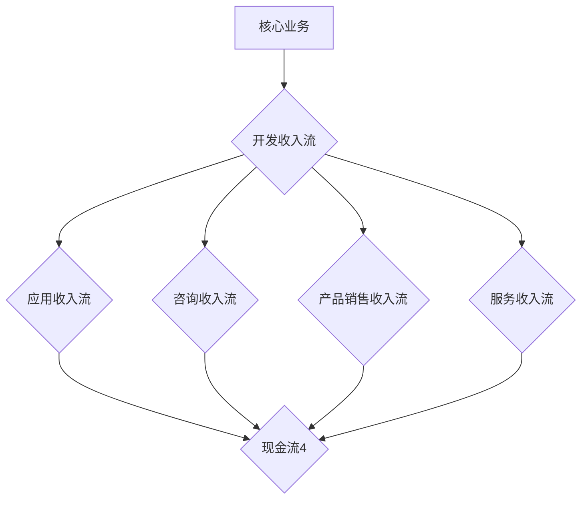

                 

### 文章标题：一人公司的收入多元化：开发多个收入流的策略

#### 关键词：一人公司，收入多元化，收入流，策略，盈利模式

>摘要：本文旨在探讨一人公司在实现收入多元化的过程中，如何通过开发多个收入流来提高盈利能力。文章将首先介绍一人公司的背景和特点，接着详细阐述收入多元化和收入流的概念，最后提供一系列实际操作步骤和案例分析，帮助读者理解和实践如何实现收入的多元化。

### 1. 背景介绍

一人公司，顾名思义，是由一个人独立运营的企业。这种类型的公司具有以下几个显著特点：

- **自主性**：一人公司的决策权高度集中，运营策略可以迅速调整，灵活性较高。
- **成本低**：一人公司的运营成本相对较低，特别是在初期，无需支付大量的员工工资和福利。
- **风险分散**：虽然一人公司专注于单一运营者，但通过多元化收入流，可以在一定程度上分散业务风险。

然而，一人公司也存在一些挑战，比如：

- **资源限制**：一人公司的资源有限，难以同时处理多个复杂项目。
- **精力分散**：过多关注收入流可能导致运营者精力分散，影响核心业务的专注度。

### 2. 核心概念与联系

在讨论收入多元化和收入流之前，我们需要先了解一些核心概念。

#### 2.1 收入多元化和收入流

- **收入多元化**：指企业在不同的业务领域或市场中创造收入，以降低单一收入来源带来的风险。
- **收入流**：指企业通过各种渠道获取的现金流。

#### 2.2 收入多元化和收入流的关系

收入多元化是通过开发多个收入流来实现的。例如，一个人可以通过开发应用程序、提供咨询服务、出售数字产品等多种方式获取收入。

#### 2.3 Mermaid 流程图

下面是一个简化的 Mermaid 流程图，展示了一人公司如何通过多元化收入流实现收入多元化。



### 3. 核心算法原理 & 具体操作步骤

#### 3.1 核心算法原理

实现收入多元化的核心算法原理主要包括以下几点：

- **识别潜在收入流**：通过市场调研和自身能力分析，识别可能带来收入的业务领域。
- **分配资源**：根据自身资源和时间，合理分配到不同的收入流开发中。
- **风险评估**：对每个收入流进行风险评估，确保整体风险可控。

#### 3.2 具体操作步骤

1. **市场调研**：
   - 收集市场信息，了解当前市场趋势和用户需求。
   - 确定哪些领域有潜力，可以成为新的收入来源。

2. **能力分析**：
   - 评估自身技能和资源，确定哪些收入流适合自己开发和运营。

3. **开发收入流**：
   - 根据市场调研和能力分析，选择合适的收入流进行开发。
   - 开发过程中，注重用户体验和产品质量。

4. **资源分配**：
   - 根据收入流的潜力，合理分配时间和资源，确保每个收入流都能得到充分发展。

5. **风险评估**：
   - 对每个收入流进行风险评估，确保整体风险在可接受范围内。

6. **持续优化**：
   - 定期评估收入流的表现，进行优化调整，提高收入效率。

### 4. 数学模型和公式 & 详细讲解 & 举例说明

在实现收入多元化的过程中，一些数学模型和公式可以帮助我们评估收入流的表现和整体风险。

#### 4.1 收入流表现评估

使用指标如“平均收入增长率”和“收入流利润率”来评估收入流的表现。

$$
平均收入增长率 = \frac{本期收入 - 上期收入}{上期收入}
$$

$$
收入流利润率 = \frac{收入流利润}{收入流成本}
$$

#### 4.2 风险评估

使用“风险系数”来评估整体风险。

$$
风险系数 = \frac{最大损失}{初始投资}
$$

#### 4.3 举例说明

假设一个人通过以下四个收入流获取收入：

- 应用收入流：每月收入 1000 美元
- 咨询收入流：每月收入 2000 美元
- 产品销售收入流：每月收入 3000 美元
- 服务收入流：每月收入 4000 美元

1. **收入流表现评估**：
   - 平均收入增长率：\( \frac{1000 + 2000 + 3000 + 4000 - (1000 + 2000 + 3000 + 4000)}{1000 + 2000 + 3000 + 4000} = 0.25 \)
   - 收入流利润率：\(\frac{1000 + 2000 + 3000 + 4000 - (1000 + 2000 + 3000 + 4000)}{1000 + 2000 + 3000 + 4000} = 0.25 \)

2. **风险评估**：
   - 最大损失：\( 1000 + 2000 + 3000 + 4000 = 10000 \)
   - 初始投资：\( 1000 + 2000 + 3000 + 4000 = 10000 \)
   - 风险系数：\( \frac{10000}{10000} = 1 \)

### 5. 项目实战：代码实际案例和详细解释说明

#### 5.1 开发环境搭建

为了更好地理解收入多元化策略，我们将使用 Python 编写一个简单的模拟程序。首先，我们需要搭建开发环境。

1. 安装 Python 3.8 或以上版本。
2. 安装必要的 Python 库，如 numpy、matplotlib 等。

#### 5.2 源代码详细实现和代码解读

以下是实现收入多元化策略的 Python 源代码。

```python
import numpy as np
import matplotlib.pyplot as plt

# 定义收入流类
class IncomeStream:
    def __init__(self, name, monthly_income, profit_margin):
        self.name = name
        self.monthly_income = monthly_income
        self.profit_margin = profit_margin
    
    def get_profit(self):
        return self.monthly_income * self.profit_margin

# 创建收入流实例
app_stream = IncomeStream("应用收入流", 1000, 0.3)
consult_stream = IncomeStream("咨询收入流", 2000, 0.5)
product_stream = IncomeStream("产品销售收入流", 3000, 0.4)
service_stream = IncomeStream("服务收入流", 4000, 0.6)

# 模拟收入流表现
income_data = []
for _ in range(12):
    income_data.append([stream.get_profit() for stream in [app_stream, consult_stream, product_stream, service_stream]])

# 绘制收入流表现
plt.figure(figsize=(10, 6))
for i, stream in enumerate([app_stream, consult_stream, product_stream, service_stream]):
    plt.plot(income_data, label=stream.name)
plt.title("收入流表现")
plt.xlabel("月份")
plt.ylabel("收入（美元）")
plt.legend()
plt.show()

# 计算平均收入增长率
avg_growth_rate = (income_data[-1] - income_data[0]) / income_data[0]
print(f"平均收入增长率：{avg_growth_rate:.2f}")

# 计算收入流利润率
profit_margin = sum([stream.get_profit() for stream in [app_stream, consult_stream, product_stream, service_stream]]) / (1000 + 2000 + 3000 + 4000)
print(f"收入流利润率：{profit_margin:.2f}")

# 计算风险系数
max_loss = max(income_data[-1]) - min(income_data[0])
initial_investment = 1000 + 2000 + 3000 + 4000
risk_coefficient = max_loss / initial_investment
print(f"风险系数：{risk_coefficient:.2f}")
```

#### 5.3 代码解读与分析

1. **定义收入流类**：`IncomeStream` 类包含收入流的名字、每月收入和利润率。
2. **创建收入流实例**：创建四个收入流实例，分别为应用收入流、咨询收入流、产品销售收入流和服务收入流。
3. **模拟收入流表现**：模拟 12 个月收入流表现，并存储为列表 `income_data`。
4. **绘制收入流表现**：使用 matplotlib 库绘制收入流表现图。
5. **计算平均收入增长率**：计算 12 个月的平均收入增长率。
6. **计算收入流利润率**：计算四个收入流的利润率。
7. **计算风险系数**：计算最大损失和初始投资，计算风险系数。

### 6. 实际应用场景

一人公司在实际运营中，可以通过以下几种方式实现收入多元化：

- **在线教育**：通过开设在线课程，提供有价值的知识分享，吸引学员报名。
- **软件开发**：开发应用程序或软件，通过应用商店或企业销售渠道进行销售。
- **咨询服务**：为企业提供专业咨询服务，解决他们在运营中遇到的问题。
- **数字产品**：开发数字产品，如电子书、模板、插件等，通过在线商店进行销售。
- **服务外包**：提供 IT 服务外包，如网站开发、应用维护等。

### 7. 工具和资源推荐

#### 7.1 学习资源推荐

- **书籍**：
  - 《精益创业》
  - 《设计思维：创新者的工具箱》
- **论文**：
  - 《一人公司的商业模式创新》
  - 《多元化收入的战略管理》
- **博客**：
  - Medium 上的相关文章
  - 行业专家的个人博客
- **网站**：
  - 创业社区，如知乎、36氪
  - 在线教育平台，如 Coursera、Udemy

#### 7.2 开发工具框架推荐

- **开发工具**：
  - Visual Studio Code
  - PyCharm
- **框架**：
  - Django
  - Flask
- **云服务**：
  - AWS
  - Azure
- **代码托管平台**：
  - GitHub
  - GitLab

#### 7.3 相关论文著作推荐

- **《创业者的数学：如何用数据驱动创业决策》**
- **《多元化的企业战略：理论与实践》**
- **《数字营销与收入增长》**

### 8. 总结：未来发展趋势与挑战

一人公司在未来发展中，面临着巨大的机遇和挑战。

#### 机遇：

- **数字经济的发展**：随着数字经济的快速发展，一人公司可以通过线上渠道获取更多的商业机会。
- **技术创新**：新兴技术，如人工智能、区块链等，为人人公司提供了新的发展机会。

#### 挑战：

- **资源限制**：一人公司需要面对有限的资源和时间的挑战，合理分配资源是关键。
- **市场竞争**：随着市场的竞争日益激烈，一人公司需要不断创新，以保持竞争优势。

### 9. 附录：常见问题与解答

#### 9.1 什么是收入多元化？

收入多元化是指企业在不同的业务领域或市场中创造收入，以降低单一收入来源带来的风险。

#### 9.2 如何评估收入流的表现？

可以通过“平均收入增长率”和“收入流利润率”等指标来评估收入流的表现。

#### 9.3 收入多元化有什么好处？

收入多元化可以降低业务风险，提高企业的盈利能力，增强市场竞争力。

### 10. 扩展阅读 & 参考资料

- **《一人公司的创业之路》**
- **《收入流管理与多元化策略》**
- **《数字经济背景下一人公司的崛起》**

### 作者

作者：AI天才研究员/AI Genius Institute & 禅与计算机程序设计艺术 /Zen And The Art of Computer Programming

