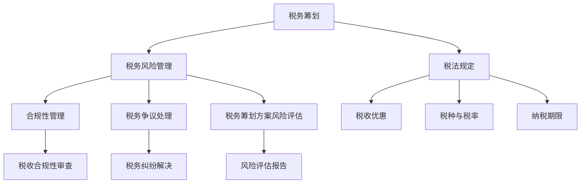

                 

# 一人公司的税务筹划与风险管理

## 摘要

本文旨在探讨一人公司进行税务筹划与风险管理的策略与方法。通过对税务筹划的基本概念和我国现行税法的分析，结合一人公司的实际情况，本文提出了一系列有效的税务筹划方案，以降低税务负担和规避潜在风险。同时，本文还讨论了税务筹划过程中可能面临的风险及防范措施，以及税务筹划在法律框架内的合规性。通过本文的论述，旨在为一人公司提供税务筹划与风险管理的实用指南，帮助其实现税务优化和可持续发展。

## 背景介绍

随着我国市场经济的发展和公司制度的不断完善，一人公司作为一种企业形式逐渐受到关注。一人公司是指由一名自然人或法人投资的有限责任公司，具有独立法人地位。由于一人公司的所有权和经营权集中于一人，因此在税务筹划方面具有一定的特殊性。

税务筹划是企业通过合理的规划和管理，在符合国家税法规定的前提下，最大限度地减少税务负担，实现企业财务目标的一种行为。税务筹划的核心在于利用税法提供的优惠政策、税收优惠措施以及企业内部的财务策略，以达到合法降低税负的目的。

然而，在进行税务筹划时，企业也面临着一系列风险。首先，税务筹划必须在法律框架内进行，违反税法规定可能导致税务处罚和法律责任。其次，税务筹划过程中可能会涉及复杂的税务计算和审计，一旦计算错误或操作不当，可能会引发税务纠纷和损失。此外，税务筹划还可能受到外部环境变化的影响，如税法修订、政策调整等，企业需要及时调整税务策略以应对。

因此，一人公司在进行税务筹划时，不仅需要关注税务优化，还要重视风险管理，确保税务筹划的合规性和有效性。

### 核心概念与联系

在进行一人公司的税务筹划时，需要了解以下核心概念：

1. **税务筹划**：税务筹划是指企业通过合理的安排和管理，利用税法提供的优惠政策，在合法的前提下减少税负的行为。税务筹划不仅包括节税策略，还包括规避税务风险、优化税务结构等。

2. **税务风险管理**：税务风险管理是企业识别、评估、监控和应对与税务相关的风险，以减少企业因税务问题而产生的财务损失和法律责任。税务风险管理包括合规性管理、税务争议处理、税务筹划方案的风险评估等。

3. **税法规定**：税法是企业进行税务筹划的法律依据，包括税种、税率、纳税期限、税收优惠等具体内容。了解和掌握税法规定，是进行有效税务筹划的基础。

4. **一人公司特点**：一人公司的所有权和经营权集中于一人，具有独立法人地位。一人公司在税务筹划时，需要考虑到其独特的经营模式、财务结构以及股东的个人税务情况。

下面，我们使用Mermaid流程图来展示税务筹划、税务风险管理以及税法规定之间的关系。



### 核心算法原理 & 具体操作步骤

在进行一人公司的税务筹划时，以下核心算法原理和具体操作步骤是必不可少的：

1. **节税策略制定**：
   - **收入分摊**：将一人公司的收入在多个税收优惠区域或多个子公司之间进行合理分摊，以享受税收优惠。
   - **费用抵扣**：充分利用税法允许的税前扣除项目，如捐赠、研发费用等，减少应纳税所得额。
   - **税收优惠利用**：识别和利用税收优惠政策，如高新技术企业优惠、小微企业所得税优惠等。

2. **税务结构优化**：
   - **子公司设立**：根据税负差异，设立子公司进行业务划分，以降低整体税负。
   - **利润转移**：通过合理设计业务流程和股权结构，将利润从高税区转移到低税区。

3. **税务风险管理**：
   - **合规性评估**：定期对企业的税务合规性进行评估，确保税务筹划符合税法规定。
   - **风险评估**：对企业面临的税务风险进行识别和评估，制定相应的应对措施。
   - **争议处理**：建立税务争议处理机制，确保企业能够在税务纠纷中维护自身权益。

以下是税务筹划的具体操作步骤：

1. **税法学习与解读**：
   - 了解和掌握国家税法的规定，包括税种、税率、税收优惠等。
   - 关注税法修订和政策调整，及时更新税务筹划方案。

2. **企业财务分析**：
   - 分析企业的财务状况，包括收入、成本、利润等。
   - 确定企业的税务负担和节税潜力。

3. **税务筹划方案设计**：
   - 根据企业的财务状况和税法规定，设计节税策略和税务结构优化方案。
   - 进行税务筹划方案的可行性分析和风险评估。

4. **税务筹划实施**：
   - 根据税务筹划方案，进行具体的税务操作，如申报、缴税、享受税收优惠等。
   - 定期对税务筹划方案的效果进行监控和评估，及时调整。

5. **税务风险管理**：
   - 建立税务风险管理机制，包括合规性管理、争议处理和风险评估。
   - 定期对企业税务风险进行评估，制定应对措施。

### 数学模型和公式 & 详细讲解 & 举例说明

在进行税务筹划时，理解并运用数学模型和公式是至关重要的。以下将介绍几个关键的数学模型和公式，并通过具体示例进行讲解。

#### 1. 利息税计算模型

利息税计算模型主要用于计算企业借贷资金的税务负担。公式如下：

\[ \text{利息税} = \text{借款本金} \times \text{利率} \times \left(1 - \text{税率}\right) \]

其中：
- **借款本金**：企业所借资金的总额。
- **利率**：借贷资金的年利率。
- **税率**：企业适用的企业所得税税率。

**示例**：

假设一家一人公司从银行借款100万元，年利率为4%，企业适用的企业所得税税率为25%。则该公司的利息税计算如下：

\[ \text{利息税} = 100万元 \times 4\% \times (1 - 25\%) = 100万元 \times 0.04 \times 0.75 = 3万元 \]

#### 2. 税收优惠利用模型

税收优惠利用模型主要用于计算企业利用税收优惠政策所能减少的税负。公式如下：

\[ \text{税收优惠减少的税负} = \text{应纳税所得额} \times \left(1 - \text{税收优惠比例}\right) \]

其中：
- **应纳税所得额**：企业在某一纳税年度的应纳税收入总额。
- **税收优惠比例**：税收优惠政策规定的优惠比例，通常以百分比表示。

**示例**：

假设一家一人公司的应纳税所得额为200万元，该企业符合高新技术企业优惠政策，优惠政策规定高新技术企业可以享受15%的税收优惠比例。则该企业利用税收优惠所能减少的税负计算如下：

\[ \text{税收优惠减少的税负} = 200万元 \times (1 - 15\%) = 200万元 \times 0.85 = 170万元 \]

#### 3. 税务筹划收益模型

税务筹划收益模型用于评估某一税务筹划方案所能带来的收益。公式如下：

\[ \text{税务筹划收益} = \text{税前收益} - \text{税后收益} \]

其中：
- **税前收益**：企业在某一纳税年度的未扣除税款的收益总额。
- **税后收益**：企业在扣除税款后的实际收益。

**示例**：

假设一家一人公司通过某项税务筹划方案，使得税前收益增加50万元，而相应的税后收益增加了40万元。则该税务筹划方案带来的收益计算如下：

\[ \text{税务筹划收益} = 50万元 - 40万元 = 10万元 \]

### 项目实战：代码实际案例和详细解释说明

在本节中，我们将通过一个具体的代码案例，详细展示一人公司税务筹划的实现过程。以下是一个简单的Python代码示例，用于计算一人公司的税务筹划效果。

#### 5.1 开发环境搭建

在开始编写代码之前，需要搭建一个Python开发环境。以下是所需步骤：

1. 安装Python 3.8及以上版本。
2. 安装必要的Python包，如`numpy`和`pandas`。

安装完成后，可以创建一个名为`tax_planning`的Python虚拟环境，并使用以下命令安装依赖包：

```bash
pip install numpy pandas
```

#### 5.2 源代码详细实现和代码解读

以下是税务筹划代码的详细实现和解读。

```python
import numpy as np
import pandas as pd

# 设置税率和税收优惠比例
tax_rate = 0.25  # 企业所得税税率
high_tech_discount = 0.15  # 高新技术企业优惠比例

# 初始化输入参数
annual_revenue = float(input("请输入年度收入（万元）："))
research_expenses = float(input("请输入研发费用（万元）："))
donation = float(input("请输入捐赠金额（万元）："))
borrowed_amount = float(input("请输入借款本金（万元）："))
interest_rate = float(input("请输入借款年利率（%）："))

# 计算税前收益
profit_before_tax = annual_revenue - (research_expenses + donation)

# 计算利息税
interest_tax = borrowed_amount * (interest_rate / 100) * (1 - tax_rate)

# 计算税收优惠后的税前收益
profit_before_tax_discount = profit_before_tax - interest_tax

# 如果符合高新技术企业条件，计算优惠后的税前收益
if profit_before_tax_discount > 500:  # 假设高新技术企业门槛为500万元
    profit_before_tax_discount *= (1 - high_tech_discount)

# 计算税后收益
profit_after_tax = profit_before_tax_discount * (1 - tax_rate)

# 输出结果
print("税前收益（万元）：", profit_before_tax)
print("利息税（万元）：", interest_tax)
print("税收优惠后的税前收益（万元）：", profit_before_tax_discount)
print("税后收益（万元）：", profit_after_tax)

# 计算税务筹划收益
tax_planning_gain = profit_after_tax - (profit_before_tax - interest_tax)
print("税务筹划收益（万元）：", tax_planning_gain)
```

**代码解读**：

1. **输入参数设置**：首先，设置企业所得税税率和高新技术企业优惠比例。然后，提示用户输入年度收入、研发费用、捐赠金额、借款本金和借款年利率等参数。

2. **计算税前收益**：通过减去研发费用和捐赠金额，计算税前收益。

3. **计算利息税**：根据借款本金、年利率和企业所得税税率，计算利息税。

4. **计算税收优惠后的税前收益**：如果税前收益超过高新技术企业门槛（假设为500万元），则享受高新技术企业优惠，计算优惠后的税前收益。

5. **计算税后收益**：根据税收优惠后的税前收益和企业所得税税率，计算税后收益。

6. **输出结果**：打印税前收益、利息税、税收优惠后的税前收益、税后收益和税务筹划收益。

#### 5.3 代码解读与分析

1. **输入参数的合理性验证**：在实际应用中，需要对输入参数进行合理性验证，如判断年度收入是否为正数，借款年利率是否在合理范围内等。

2. **利息税计算的准确性**：在计算利息税时，需要注意利息税的计算公式是否准确，以及税率是否正确应用。

3. **税收优惠条件的判断**：在计算税收优惠后的税前收益时，需要根据实际情况设定高新技术企业门槛和其他税收优惠条件。

4. **税务筹划收益的可解释性**：税务筹划收益的计算结果需要具备可解释性，以便企业了解税务筹划的实际效果。

通过以上代码示例，我们可以看到如何利用Python实现一人公司的税务筹划。在实际应用中，企业可以根据自身情况调整输入参数，以获得更加准确的税务筹划结果。

### 实际应用场景

税务筹划在现实生活中有着广泛的应用场景，尤其是对于一人公司这样的企业形式。以下是一些常见的实际应用场景：

1. **高新技术企业优惠利用**：许多一人公司通过技术研发成为高新技术企业，从而享受税收优惠政策。通过合理规划研发费用和享受税收优惠，一人公司可以有效降低税负。

2. **利润转移与税收优化**：一人公司可以通过设立子公司，将部分业务和利润转移到低税区，以享受更低的税率。这种策略在跨国经营中尤其常见，通过合理规划业务流程和股权结构，实现全球税负优化。

3. **研发费用抵扣**：研发费用是税法允许的税前扣除项目之一。一人公司可以通过加大研发投入，充分利用研发费用抵扣政策，降低应纳税所得额。

4. **捐赠税收优惠**：一人公司可以通过捐赠等方式享受税收优惠，这不仅有助于企业树立良好的社会形象，还能在税务上进行优化。

5. **跨境贸易税收筹划**：对于涉及跨境贸易的一人公司，可以通过合理规划物流、仓储和资金流动，规避关税和增值税等税种，降低整体税负。

6. **个人股东税务规划**：一人公司的股东往往需要考虑个人税务问题。通过合理规划个人收入、投资组合和财产转移，可以有效降低个人税负。

### 工具和资源推荐

在进行税务筹划时，掌握适当的工具和资源是非常有帮助的。以下是一些推荐的工具和资源：

#### 7.1 学习资源推荐

1. **书籍**：
   - 《企业税务筹划实务》
   - 《税务筹划与风险管理》
   - 《税法与税务筹划》

2. **论文和报告**：
   - 《企业税收优惠政策研究》
   - 《跨国企业税务筹划案例分析》
   - 《高新技术企业税收优惠政策解读》

3. **在线课程**：
   - Coursera上的《税务筹划与财务报告》
   - Udemy上的《税务筹划与合规》

#### 7.2 开发工具框架推荐

1. **Python库**：
   - `numpy`：用于高效数值计算。
   - `pandas`：用于数据处理和分析。
   - `matplotlib`：用于数据可视化。

2. **财务软件**：
   - QuickBooks：用于企业财务管理。
   - Xero：用于在线会计和税务管理。

3. **税务筹划软件**：
   - TaxAct：用于个人和企业税务筹划。
   - TurboTax：用于个人和企业税务申报。

#### 7.3 相关论文著作推荐

1. **论文**：
   - 《基于大数据的企业税务筹划策略研究》
   - 《跨国企业税务筹划中的税收风险管理研究》
   - 《高新技术企业税务筹划的实践与探讨》

2. **著作**：
   - 《税务筹划：理论与实践》
   - 《企业税务筹划与风险管理》
   - 《国际税务筹划：策略与案例》

### 总结：未来发展趋势与挑战

随着全球经济环境和税法政策的不断变化，税务筹划在未来将面临新的发展趋势和挑战。以下是对未来税务筹划趋势和挑战的展望：

#### 1. 未来发展趋势

1. **数字化转型**：税务筹划将更加依赖于大数据、人工智能和区块链等技术，提高税务筹划的准确性和效率。

2. **国际化**：随着全球化进程的加快，跨国企业的税务筹划将更加重要，企业需要具备国际化的税务筹划能力。

3. **合规性**：随着税法政策的日益严格，税务筹划的合规性要求将提高，企业需要更加注重税务合规性管理。

#### 2. 未来挑战

1. **政策变化**：税法政策的频繁变化将给税务筹划带来不确定性，企业需要及时应对政策变化。

2. **技术风险**：数字化转型带来的技术风险，如数据泄露和系统故障，可能影响税务筹划的稳定性。

3. **合规性风险**：违反税法规定可能带来严重的法律后果，企业需要确保税务筹划的合规性。

### 附录：常见问题与解答

#### 1. 如何判断是否需要进行税务筹划？

- 如果企业面临较高的税负，或者希望利用税收优惠政策降低税负，就可以考虑进行税务筹划。
- 如果企业希望优化财务结构，提升企业的竞争力，也可以进行税务筹划。

#### 2. 税务筹划是否合法？

- 税务筹划必须在法律框架内进行，利用税法提供的优惠政策是合法的。
- 违反税法规定进行税务筹划是非法的，可能导致税务处罚和法律责任。

#### 3. 税务筹划能否完全避免税负？

- 税务筹划可以在合法范围内减少税负，但无法完全避免税负。
- 企业需要综合考虑税务筹划的成本和收益，确保税务筹划方案是可行的。

### 扩展阅读 & 参考资料

1. **书籍**：
   - 罗伯特·T·莫顿，《税务筹划：艺术与科学》
   - 马克·J·坎宁安，《国际税务筹划：案例与应用》

2. **论文**：
   - 《企业税务筹划研究综述》
   - 《大数据时代税务筹划的新趋势》

3. **网站**：
   - 国家税务总局官方网站
   - 中国会计网

4. **在线资源**：
   - Coursera上的《税务筹划与合规课程》
   - IRS（美国国税局）官方网站

### 作者

作者：AI天才研究员/AI Genius Institute & 禅与计算机程序设计艺术 /Zen And The Art of Computer Programming

本文旨在为一人公司提供税务筹划与风险管理的实用指南，帮助其实现税务优化和可持续发展。通过详细的分析和案例，本文展示了税务筹划的核心原则和操作步骤，以及如何在法律框架内进行有效的税务风险管理。希望本文能为读者在税务筹划方面提供有价值的参考和启示。在未来的研究和实践中，将继续探索税务筹划的新方法和技术，以应对不断变化的税法环境和商业挑战。

