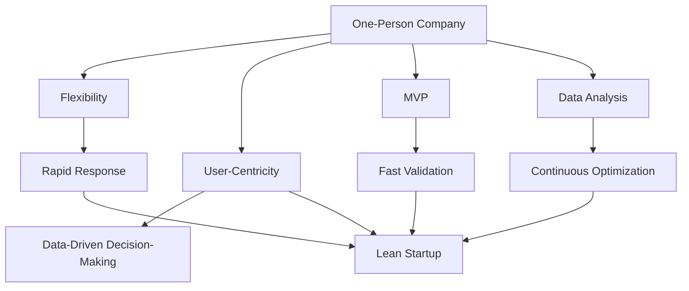

                 

### 背景介绍 Background

#### 一人公司的概念与兴起 One-Person Company Concept and Rise

一人公司，顾名思义，是指由一个自然人独立创立并运营的企业。近年来，随着全球经济的不断发展和互联网技术的广泛应用，一人公司的数量显著增加。这种企业的兴起并非偶然，而是得益于以下几个因素：

1. **互联网的普及**：互联网的普及使得信息传播更加便捷，创业者可以通过各种在线平台获取创业所需的资源和知识。例如，创业者可以通过社交媒体、博客、视频网站等平台展示自己的产品或服务，快速获得市场反馈。

2. **政策环境的优化**：许多国家和地区为了鼓励创业，推出了一系列优惠政策，如税收减免、创业扶持资金等。这些政策的实施，降低了创业者创办企业的门槛，促进了一人公司的发展。

3. **成本效益**：一人公司的运营成本相对较低，创业者不需要承担过多的固定成本，如办公室租金、员工工资等。这使得创业者可以更加灵活地应对市场变化，专注于核心业务的发展。

4. **个人品牌的重要性**：随着个人品牌价值的凸显，越来越多的创业者选择以个人身份创立公司，通过塑造个人形象来提升企业知名度。

#### 精益创业的概念与原则 Lean Startup Concept and Principles

精益创业（Lean Startup）是一种以用户为中心、快速迭代的产品开发方法论。它强调通过最小可行性产品（Minimum Viable Product, MVP）来验证市场假设，并快速调整产品方向。精益创业的核心理念包括：

1. **用户至上**：创业者应该始终关注用户需求，不断收集用户反馈，以便调整产品方向。

2. **快速迭代**：产品开发不是一蹴而就的过程，而是通过不断迭代来优化产品。每次迭代都可以帮助创业者更好地了解用户需求，提高产品的市场竞争力。

3. **数据驱动**：通过数据分析和用户反馈，创业者可以做出更明智的决策。数据驱动不仅可以帮助创业者了解产品表现，还可以指导未来产品的开发方向。

4. **持续优化**：精益创业强调持续优化，创业者需要不断分析产品数据，找出问题并加以改进。

#### 一人公司与精益创业的结合 One-Person Company and Lean Startup Integration

一人公司与精益创业的结合，使得创业者可以更加高效地实现创业目标。以下是这种结合的一些优势：

1. **灵活性与快速响应**：一人公司由于规模较小，决策流程相对简单，创业者可以快速响应市场变化，调整产品方向。

2. **成本控制**：一人公司运营成本较低，创业者可以利用有限的资源，进行产品开发和市场推广。

3. **专注于核心业务**：由于无需处理过多日常运营事务，创业者可以更加专注于产品开发和创新。

4. **快速验证**：通过精益创业的方法，创业者可以快速验证产品市场潜力，降低创业风险。

#### 目的与意义 Purpose and Significance

本文旨在探讨一人公司如何在精益创业方法论指导下实现成功。通过对精益创业原则的深入分析，结合一人公司的特点，本文将提出一系列实用的实践建议，帮助创业者更好地应对创业过程中的挑战，实现创业梦想。

**Abstract**

In this article, we explore the concept of one-person companies and their integration with lean startup methodology. By analyzing the key principles of lean startups, such as user-centricity, rapid iteration, data-driven decision-making, and continuous optimization, we aim to provide practical insights and strategies for one-person company founders. The article discusses the advantages of combining these methodologies and offers practical tips to help entrepreneurs overcome challenges and achieve success in their ventures. Through real-world examples and case studies, we demonstrate how lean startup principles can be effectively applied in one-person companies to accelerate growth and innovation.

---

**背景介绍 Background**

In this section, we will delve into the concept of one-person companies and the rise of this business model. We will also introduce the principles of lean startup and how they can be effectively integrated into the operations of one-person companies. Additionally, we will explore the advantages and significance of this combination, aiming to provide a solid foundation for the rest of the article.

**One-Person Company Concept and Rise**

A one-person company, as the name suggests, is a business entity owned and operated by a single individual. In recent years, the number of one-person companies has increased significantly, driven by several factors:

1. **Internet Accessibility**: The widespread availability of the internet has made it easier for entrepreneurs to access resources and knowledge needed to start a business. For example, entrepreneurs can showcase their products or services on social media, blogs, and video platforms to quickly gain market feedback.

2. **Improved Policy Environment**: Many countries and regions have implemented policies to encourage entrepreneurship, such as tax exemptions and startup funding. These policies have reduced the barriers to entry for entrepreneurs and spurred the growth of one-person companies.

3. **Cost Efficiency**: One-person companies have lower operational costs compared to larger businesses. Entrepreneurs do not need to bear the expenses of office rentals, employee salaries, and other fixed costs, allowing them to focus on core business activities.

4. **Importance of Personal Branding**: As personal brand value becomes more prominent, more entrepreneurs are choosing to establish companies under their own names. By building a personal brand, entrepreneurs can enhance the visibility and credibility of their businesses.

**Lean Startup Concept and Principles**

Lean startup is a product development methodology that emphasizes user-centered design, rapid iteration, data-driven decision-making, and continuous optimization. The core principles of lean startup include:

1. **User-Centricity**: Entrepreneurs should always focus on user needs, continuously gather feedback, and adjust product directions accordingly.

2. **Rapid Iteration**: Product development is not a one-time event but a continuous process of improvement. Each iteration provides entrepreneurs with valuable insights into user preferences and market demands.

3. **Data-Driven Decision-Making**: By analyzing product data and user feedback, entrepreneurs can make more informed decisions regarding product development and marketing strategies.

4. **Continuous Optimization**: Lean startup advocates for continuous improvement, with entrepreneurs constantly analyzing product data to identify issues and opportunities for enhancement.

**Combination of One-Person Companies and Lean Startup**

The combination of one-person companies and lean startup methodologies offers several advantages:

1. **Flexibility and Rapid Response**: Due to their small size, one-person companies have simpler decision-making processes, allowing entrepreneurs to quickly respond to market changes and adjust product directions.

2. **Cost Control**: The lower operational costs of one-person companies enable entrepreneurs to allocate resources more efficiently, focusing on product development and marketing efforts.

3. **Focus on Core Business**: With minimal administrative burdens, entrepreneurs can concentrate on product development and innovation, rather than dealing with routine operational tasks.

4. **Fast Validation**: By applying lean startup principles, entrepreneurs can quickly validate the market potential of their products, reducing the risk of failure.

**Purpose and Significance**

The purpose of this article is to explore how one-person companies can leverage lean startup methodologies to achieve success. By analyzing the key principles of lean startups and their applicability to one-person companies, we aim to provide practical insights and strategies to help entrepreneurs overcome challenges and realize their entrepreneurial dreams.

---

**背景介绍 Background**

This section provides an overview of the concept of one-person companies and their emergence as a prominent business model. We will also introduce the principles of lean startup and discuss how these principles can be effectively integrated into the operations of one-person companies. Additionally, we will examine the benefits and significance of this integration, aiming to establish a solid foundation for the subsequent discussion.

**One-Person Company Concept and Rise**

A one-person company refers to a business entity that is wholly owned and managed by a single individual. The rise of this business model can be attributed to several key factors:

1. **Internet Accessibility**: The widespread availability of the internet has revolutionized the way entrepreneurs access resources and information. Platforms such as social media, blogs, and video sharing sites enable entrepreneurs to showcase their products or services, quickly gain market feedback, and build a customer base.

2. **Policy Environment Optimization**: Governments around the world have implemented favorable policies to support entrepreneurship. These policies often include tax incentives, startup grants, and simplified business registration processes, which lower the barriers to entry for aspiring entrepreneurs.

3. **Cost Efficiency**: One-person companies benefit from lower operational costs compared to larger enterprises. Without the need for extensive physical infrastructure or a large workforce, these businesses can operate with minimal overhead, allowing entrepreneurs to allocate resources more effectively.

4. **Importance of Personal Branding**: In today's digital age, personal branding plays a crucial role in business success. By establishing a strong personal brand, entrepreneurs can enhance their credibility and marketability, which can be particularly beneficial for one-person companies.

**Lean Startup Concept and Principles**

Lean startup is a methodology that emphasizes iterative development, user feedback, and data-driven decision-making. Its core principles include:

1. **User-Centricity**: At the heart of lean startup is the focus on understanding and addressing the needs of the target customer. By continuously gathering user feedback, entrepreneurs can refine their products and ensure they meet market demands.

2. **Rapid Iteration**: Instead of developing a product in a linear fashion, lean startup encourages rapid iteration. This iterative approach allows entrepreneurs to quickly test and refine their ideas, reducing the risk of investing in a product that does not meet market needs.

3. **Data-Driven Decision-Making**: Lean startup relies heavily on data to inform decision-making. By tracking key metrics and analyzing user behavior, entrepreneurs can make informed choices about product development, marketing, and resource allocation.

4. **Continuous Optimization**: The lean startup methodology promotes a culture of continuous improvement. Entrepreneurs are encouraged to regularly evaluate their products and processes, identify areas for enhancement, and implement changes accordingly.

**Combination of One-Person Companies and Lean Startup**

The integration of one-person companies with lean startup principles offers several advantages:

1. **Flexibility and Agility**: One-person companies benefit from their ability to make quick decisions and adapt to changing market conditions. Lean startup principles complement this agility by emphasizing rapid iteration and iterative development.

2. **Cost Control**: With limited resources, one-person companies must be strategic about how they allocate their budget. Lean startup principles help entrepreneurs prioritize their efforts, focusing on the most critical aspects of product development and marketing.

3. **Focus on Core Competencies**: By simplifying the business structure and minimizing operational distractions, one-person companies can concentrate on building their core competencies. This focus allows entrepreneurs to develop innovative products and services that address market needs.

4. **Fast Validation**: One of the key benefits of lean startup for one-person companies is the ability to quickly validate product ideas. By developing and testing minimum viable products (MVPs), entrepreneurs can gauge market interest and make data-driven decisions about product development.

**Purpose and Significance**

The primary goal of this article is to explore the potential of one-person companies to leverage lean startup principles for success. By examining the core concepts of lean startup and their applicability to one-person companies, we aim to provide entrepreneurs with practical insights and actionable strategies. Through real-world examples and case studies, we will demonstrate how lean startup principles can be effectively implemented in one-person companies to drive growth and innovation.

---

### 核心概念与联系 Core Concepts and Connections

在探讨一人公司如何应用精益创业方法论之前，我们需要明确几个核心概念，并了解它们之间的联系。以下是本文涉及的关键概念：

#### 一人公司 One-Person Company

一人公司，顾名思义，是指由一个自然人独立创立并运营的企业。这种企业模式的特点是：

1. **独立运营**：企业由单一自然人控制，所有决策由该个人独立做出。
2. **规模较小**：由于运营成本和资源限制，一人公司通常规模较小。
3. **灵活性**：一人公司可以迅速响应市场变化，调整经营策略。

#### 精益创业 Lean Startup

精益创业是一种以用户为中心的产品开发方法论，强调通过最小可行性产品（MVP）来验证市场假设，并快速迭代以优化产品。其主要原则包括：

1. **用户至上**：产品开发围绕用户需求进行，通过持续的用户反馈来指导产品迭代。
2. **快速迭代**：通过多次迭代来优化产品，降低开发风险。
3. **数据驱动**：使用数据来指导决策，而不是基于直觉或假设。
4. **持续优化**：不断评估产品性能，寻找改进机会。

#### 最小可行性产品 Minimum Viable Product (MVP)

MVP是精益创业中的一个核心概念，它代表了一个具备基本功能的产品，足以验证市场假设。MVP的特点是：

1. **功能简化**：MVP仅包含核心功能，以最小化开发成本和时间。
2. **快速测试**：通过MVP，创业者可以快速测试市场反应，收集用户反馈。
3. **成本效益**：MVP帮助创业者以较低的成本验证产品可行性。

#### 数据分析 Data Analysis

数据分析是精益创业方法论的重要组成部分，它通过分析用户行为和市场数据，帮助创业者做出更明智的决策。数据分析的步骤通常包括：

1. **数据收集**：收集用户行为数据、市场数据等。
2. **数据处理**：清洗和整理数据，使其适合分析。
3. **数据分析**：使用统计方法或其他分析工具来提取数据中的洞察。
4. **决策制定**：基于分析结果来调整产品或业务策略。

#### 概念联系 Concept Connections

一人公司与精益创业之间的联系在于它们都强调灵活性和用户导向。以下是它们之间的具体联系：

1. **灵活性**：一人公司由于规模小、决策快速，与精益创业的快速响应和迭代原则相契合。
2. **用户至上**：一人公司的创始人通常亲自参与产品设计，更易于关注用户反馈，符合精益创业的用户导向原则。
3. **MVP**：一人公司可以利用MVP来快速验证产品市场潜力，降低创业风险。
4. **数据分析**：一人公司通过数据分析来优化产品和服务，提高市场竞争力。

**Mermaid 流程图 Mermaid Flowchart**

以下是关于一人公司应用精益创业方法论的Mermaid流程图，展示了核心概念之间的联系：



通过这个流程图，我们可以清晰地看到一人公司与精益创业方法论之间的联系，以及每个核心概念在创业过程中的作用。

**核心概念与联系 Core Concepts and Connections**

Before exploring how one-person companies can apply the lean startup methodology, we need to clarify several key concepts and understand their connections. The following are the critical concepts involved in this article:

**One-Person Company**

A one-person company, as the name suggests, refers to a business entity that is wholly owned and operated by a single individual. The characteristics of this business model include:

1. **Independent Operation**: The company is controlled by a single person, with all decisions made independently.
2. **Small Scale**: Due to operational costs and resource limitations, one-person companies are typically small in size.
3. **Flexibility**: One-person companies can quickly respond to market changes and adjust business strategies.

**Lean Startup**

Lean startup is a product development methodology that emphasizes user-centered design, rapid iteration, and data-driven decision-making. Its core principles include:

1. **User-Centricity**: Product development revolves around user needs, with continuous user feedback guiding product iteration.
2. **Rapid Iteration**: Through multiple iterations, products are optimized to reduce development risks.
3. **Data-Driven Decision-Making**: Decisions are informed by data rather than intuition or assumptions.
4. **Continuous Optimization**: Products and processes are constantly evaluated and improved to enhance performance.

**Minimum Viable Product (MVP)**

MVP is a core concept in lean startup, representing a product with basic features sufficient to validate market assumptions. The characteristics of MVP include:

1. **Simplified Functionality**: MVP includes only core features to minimize development costs and time.
2. **Fast Testing**: Through MVP, entrepreneurs can quickly test market reactions and collect user feedback.
3. **Cost-Efficiency**: MVP helps entrepreneurs validate product feasibility with minimal costs.

**Data Analysis**

Data analysis is a crucial component of the lean startup methodology. It involves analyzing user behavior and market data to make more informed decisions. The steps in data analysis typically include:

1. **Data Collection**: Gathering user behavior data, market data, etc.
2. **Data Processing**: Cleaning and organizing data for analysis.
3. **Data Analysis**: Using statistical methods or other analytical tools to extract insights from data.
4. **Decision-Making**: Adjusting product or business strategies based on analysis results.

**Concept Connections**

The connection between one-person companies and lean startup methodologies lies in their emphasis on flexibility and user-centered approaches. The following are the specific connections:

1. **Flexibility**: One-person companies, with their small size and quick decision-making processes, align well with the rapid response and iterative principles of lean startup.
2. **User-Centricity**: The founders of one-person companies often participate directly in product design, making it easier to focus on user feedback, which aligns with the user-centered principles of lean startup.
3. **MVP**: One-person companies can use MVPs to quickly validate product market potential, reducing the risk of failure.
4. **Data Analysis**: One-person companies use data analysis to optimize products and services, enhancing market competitiveness.

**Mermaid Flowchart**

Here is a Mermaid flowchart illustrating the connections between one-person companies and lean startup methodologies, showcasing the role of each core concept in the entrepreneurial process:


Through this flowchart, we can clearly see the connections between one-person companies and lean startup methodologies and the role of each core concept in the entrepreneurial journey.

---

### 核心算法原理 & 具体操作步骤 Core Algorithm Principles and Detailed Steps

在探讨一人公司如何应用精益创业方法论时，核心算法原理和具体操作步骤至关重要。以下将详细阐述这些核心算法原理，并提供一个具体的操作步骤指南。

#### 最小可行性产品（MVP）开发 Development of Minimum Viable Product (MVP)

MVP是精益创业方法的核心，旨在通过开发具备基本功能的产品来验证市场假设。以下是开发MVP的步骤：

1. **市场调研** Market Research

   在开始开发MVP之前，创业者需要进行市场调研，以了解目标市场的需求和潜在用户。以下是一些市场调研的方法：

   - **问卷调查** Surveys: 设计并分发问卷，收集用户对产品需求的看法。
   - **用户访谈** User Interviews: 与潜在用户进行一对一访谈，深入了解他们的需求和痛点。
   - **竞争对手分析** Competitor Analysis: 分析竞争对手的产品，了解市场的现状和趋势。

2. **需求分析 Requirement Analysis

   基于市场调研结果，创业者需要确定产品的基本功能，并制定一个可行的产品开发计划。以下是一些需求分析的方法：

   - **优先级排序** Prioritization: 根据用户需求的重要性，对功能进行排序。
   - **用户故事** User Stories: 编写用户故事，描述用户如何使用产品。
   - **功能映射** Feature Mapping: 制作功能映射图，明确产品的核心功能和扩展功能。

3. **设计产品设计 Design

   在确定产品需求后，创业者需要进行产品设计。以下是设计产品的一些步骤：

   - **原型设计** Prototype Design: 制作低保真或高保真原型，以展示产品的外观和功能。
   - **用户体验设计** User Experience (UX) Design: 设计产品的用户界面，确保用户能够轻松地使用产品。
   - **用户测试** User Testing: 通过用户测试，收集用户对原型的反馈，并据此进行改进。

4. **开发MVP Development of MVP

   根据产品设计，创业者开始开发MVP。以下是开发MVP的步骤：

   - **确定MVP范围** Scope of MVP: 确定MVP应包含的核心功能，以最小化开发成本。
   - **选择技术栈** Technology Stack: 选择适合开发MVP的技术栈，确保开发效率和产品质量。
   - **编写代码** Coding: 编写代码实现MVP的核心功能。
   - **测试和调试** Testing and Debugging: 对MVP进行测试，确保其稳定性和可靠性。

5. **发布和反馈 Release and Feedback

   将MVP发布给用户，收集反馈，并根据反馈进行迭代优化。以下是发布和反馈的步骤：

   - **发布MVP** Release MVP: 将MVP发布到市场上，让用户使用。
   - **收集用户反馈** Collect User Feedback: 通过用户反馈了解MVP的实际效果和用户需求。
   - **迭代优化** Iterative Optimization: 根据用户反馈，对MVP进行迭代优化，提高产品竞争力。

#### 数据分析 Data Analysis

数据分析是精益创业方法的重要环节，它帮助创业者从用户行为和市场数据中提取洞察，指导产品开发。以下是数据分析的步骤：

1. **数据收集** Data Collection

   收集与产品相关的数据，包括用户行为数据、市场数据等。以下是一些数据收集的方法：

   - **日志文件** Log Files: 收集产品的日志文件，以了解用户的行为模式。
   - **第三方数据源** Third-Party Data Sources: 利用第三方数据源，如社交媒体分析工具、市场调研报告等。
   - **用户调研** User Surveys: 通过用户调研，收集用户对产品的看法和反馈。

2. **数据处理** Data Processing

   清洗和整理数据，使其适合分析。以下是一些数据处理的方法：

   - **数据清洗** Data Cleaning: 清除数据中的错误和重复记录。
   - **数据整合** Data Integration: 将不同来源的数据进行整合，以获得全面的视角。
   - **数据转换** Data Transformation: 将数据转换为适合分析的格式。

3. **数据分析** Data Analysis

   使用统计方法或其他分析工具对数据进行分析，提取有价值的信息。以下是一些数据分析的方法：

   - **描述性分析** Descriptive Analysis: 描述数据的基本特征和趋势。
   - **推断性分析** Inferential Analysis: 基于样本数据推断总体特征。
   - **预测性分析** Predictive Analysis: 预测未来的趋势和事件。

4. **决策制定** Decision-Making

   基于数据分析结果，制定产品开发、市场推广等方面的决策。以下是一些决策制定的方法：

   - **数据驱动决策** Data-Driven Decision-Making: 使用数据来指导决策，减少主观偏见。
   - **A/B测试** A/B Testing: 通过对比不同版本的测试，找出最佳策略。
   - **优化策略** Optimization Strategies: 根据数据分析结果，优化产品设计和运营策略。

#### 具体操作步骤 Step-by-Step Operations

以下是结合MVP开发和数据分析的具体操作步骤：

1. **确定产品目标** Define Product Goals

   确定产品的目标用户和市场，明确产品的核心功能和价值主张。

2. **进行市场调研** Conduct Market Research

   通过问卷调查、用户访谈等方法，了解目标市场的需求和潜在用户。

3. **分析需求** Analyze Requirements

   根据市场调研结果，确定产品的基本功能，并制定一个可行的产品开发计划。

4. **设计产品原型** Design Product Prototype

   制作低保真或高保真原型，展示产品的外观和功能。

5. **开发MVP** Develop MVP

   根据产品设计，开始开发MVP，实现核心功能。

6. **用户测试** User Testing

   通过用户测试，收集用户对原型的反馈，并据此进行改进。

7. **发布MVP** Release MVP

   将MVP发布到市场上，让用户使用，并收集用户反馈。

8. **数据分析** Data Analysis

   收集用户行为数据和市场数据，进行数据处理和分析。

9. **迭代优化** Iterative Optimization

   根据用户反馈和数据分析结果，对MVP进行迭代优化。

10. **持续监测** Continuous Monitoring

    持续监测产品的市场表现和用户反馈，以便及时调整产品策略。

通过这些具体操作步骤，一人公司可以有效地应用精益创业方法论，快速验证产品市场潜力，提高产品竞争力，实现创业目标。

**Core Algorithm Principles and Detailed Steps**

When exploring how one-person companies can apply the lean startup methodology, the core algorithm principles and specific operational steps are crucial. Here, we will delve into these core algorithm principles and provide a detailed guide on the operational steps.

#### Development of Minimum Viable Product (MVP)

MVP is a core concept in lean startup, aiming to validate market assumptions through a product with basic features. Here are the steps for developing an MVP:

1. **Market Research**

   Before developing an MVP, entrepreneurs need to conduct market research to understand the target market's needs and potential users. Here are some methods for market research:

   - **Surveys**: Design and distribute surveys to collect users' opinions on product needs.
   - **User Interviews**: Conduct one-on-one interviews with potential users to gain insights into their needs and pain points.
   - **Competitor Analysis**: Analyze competitors' products to understand the current market situation and trends.

2. **Requirement Analysis**

   Based on market research results, entrepreneurs need to determine the basic features of the product and create a viable product development plan. Here are some methods for requirement analysis:

   - **Prioritization**: Rank features based on their importance to users.
   - **User Stories**: Write user stories describing how users will interact with the product.
   - **Feature Mapping**: Create a feature mapping diagram to outline the core and extended features of the product.

3. **Design**

   After determining product requirements, entrepreneurs need to design the product. Here are some steps in the design process:

   - **Prototype Design**: Create low-fidelity or high-fidelity prototypes to showcase the product's appearance and functionality.
   - **User Experience (UX) Design**: Design the user interface to ensure users can easily interact with the product.
   - **User Testing**: Conduct user testing to collect feedback on prototypes and make improvements accordingly.

4. **Develop MVP**

   Based on the product design, entrepreneurs begin developing the MVP. Here are the steps for developing an MVP:

   - **Define MVP Scope**: Determine the core features of the MVP to minimize development costs.
   - **Choose Technology Stack**: Select a technology stack suitable for MVP development to ensure efficiency and quality.
   - **Coding**: Write code to implement the core features of the MVP.
   - **Testing and Debugging**: Test the MVP to ensure its stability and reliability.

5. **Release and Feedback**

   Release the MVP to users, collect feedback, and iterate based on this feedback. Here are the steps for release and feedback:

   - **Release MVP**: Launch the MVP in the market to allow users to try it.
   - **Collect User Feedback**: Gather feedback on the MVP's performance and user needs.
   - **Iterative Optimization**: Make improvements to the MVP based on user feedback to enhance competitiveness.

#### Data Analysis

Data analysis is a critical component of the lean startup methodology. It helps entrepreneurs extract insights from user behavior and market data to guide product development. Here are the steps for data analysis:

1. **Data Collection**

   Collect data related to the product, including user behavior data and market data. Here are some methods for data collection:

   - **Log Files**: Collect log files from the product to understand user behavior patterns.
   - **Third-Party Data Sources**: Utilize third-party data sources, such as social media analytics tools and market research reports.
   - **User Surveys**: Conduct user surveys to collect users' opinions and feedback on the product.

2. **Data Processing**

   Clean and organize the data to make it suitable for analysis. Here are some methods for data processing:

   - **Data Cleaning**: Remove errors and duplicate records from the data.
   - **Data Integration**: Combine data from different sources to gain a comprehensive view.
   - **Data Transformation**: Convert data into a format suitable for analysis.

3. **Data Analysis**

   Use statistical methods or other analytical tools to analyze the data and extract valuable insights. Here are some methods for data analysis:

   - **Descriptive Analysis**: Describe the basic characteristics and trends of the data.
   - **Inferential Analysis**: Infer overall characteristics based on sample data.
   - **Predictive Analysis**: Predict future trends and events.

4. **Decision-Making**

   Make decisions based on the results of data analysis for product development, marketing, and other aspects. Here are some methods for decision-making:

   - **Data-Driven Decision-Making**: Use data to guide decisions, reducing subjective bias.
   - **A/B Testing**: Compare different versions of tests to find the best strategy.
   - **Optimization Strategies**: Improve product design and operational strategies based on data analysis results.

#### Step-by-Step Operations

Here are the specific operational steps combining MVP development and data analysis:

1. **Define Product Goals**

   Determine the target users and market for the product, and clarify the core features and value proposition.

2. **Conduct Market Research**

   Use surveys, user interviews, and competitor analysis to understand the target market's needs and potential users.

3. **Analyze Requirements**

   Based on market research, determine the basic features of the product and create a viable product development plan.

4. **Design Product Prototype**

   Create low-fidelity or high-fidelity prototypes to showcase the product's appearance and functionality.

5. **Develop MVP**

   Based on the product design, begin developing the MVP, implementing core features.

6. **User Testing**

   Conduct user testing to collect feedback on prototypes and make improvements accordingly.

7. **Release MVP**

   Launch the MVP in the market to allow users to try it, and collect user feedback.

8. **Data Analysis**

   Collect user behavior data and market data, and process and analyze the data.

9. **Iterative Optimization**

   Make improvements to the MVP based on user feedback and data analysis results.

10. **Continuous Monitoring**

    Monitor the product's market performance and user feedback to make timely adjustments to the product strategy.

By following these specific operational steps, one-person companies can effectively apply the lean startup methodology, quickly validate product market potential, enhance product competitiveness, and achieve their entrepreneurial goals.

---

### 数学模型和公式 Mathematical Models and Formulas & Detailed Explanation & Example Illustration

在精益创业过程中，数学模型和公式发挥着关键作用，帮助创业者进行数据分析、预测和优化。以下我们将详细讲解几个常用的数学模型和公式，并提供实例来说明它们的实际应用。

#### 用户留存率模型 Customer Retention Rate Model

用户留存率是衡量产品成功的重要指标，它反映了用户持续使用产品的能力。用户留存率模型可以帮助创业者了解用户留存的情况，并制定相应的策略。

**公式：**  
$$ 用户留存率（R）= \frac{剩余用户数（N_t）}{初始用户数（N_0）} \times 100\% $$

**解释：**  
其中，$N_t$表示时间$t$后的剩余用户数，$N_0$表示初始用户数。这个公式将剩余用户数与初始用户数进行比较，得到用户留存率。

**实例：**  
假设一个产品在一个月内有1000名用户，一个月后剩余500名用户。那么用户留存率为：  
$$ 用户留存率（R）= \frac{500}{1000} \times 100\% = 50\% $$

这意味着在一个月内，有50%的用户继续使用该产品。

#### 赢利能力模型 Profitability Model

赢利能力是衡量企业财务健康状况的重要指标，它决定了企业的可持续性和成长潜力。以下是一个简单的赢利能力模型，用于计算企业的月度赢利能力。

**公式：**  
$$ 赢利能力（P）= 收入（I）- 成本（C） $$

**解释：**  
其中，$I$表示企业的总收入，$C$表示企业的总成本。这个公式计算了企业的赢利能力，即收入减去成本。

**实例：**  
假设一个企业的月收入为10000元，月成本为7000元。那么该企业的赢利能力为：  
$$ 赢利能力（P）= 10000 - 7000 = 3000元 $$

这意味着该企业在一个月内获得了3000元的利润。

#### 用户增长模型 User Growth Model

用户增长是产品成功的关键指标之一，它决定了产品的市场潜力和扩展能力。以下是一个简单的用户增长模型，用于预测未来一段时间内产品的用户增长情况。

**公式：**  
$$ 用户增长（G_t）= 初始用户数（N_0） \times (1 + r)^t $$

**解释：**  
其中，$N_0$表示初始用户数，$r$表示用户增长率，$t$表示时间（通常以月为单位）。这个公式计算了在给定时间$t$内，产品的用户增长数量。

**实例：**  
假设一个产品在初始时有1000名用户，每月用户增长率$r$为10%。那么在6个月后，产品的用户增长数量为：  
$$ 用户增长（G_6）= 1000 \times (1 + 0.1)^6 - 1000 $$  
$$ 用户增长（G_6）= 1000 \times 1.1^6 - 1000 $$  
$$ 用户增长（G_6）= 1000 \times 1.771561 - 1000 $$  
$$ 用户增长（G_6）= 1771.561 - 1000 $$  
$$ 用户增长（G_6）= 771.561 $$

这意味着在6个月内，产品的用户数量将增长至1771.561，相比初始用户数，增长了771.561个用户。

#### 客户生命周期价值模型 Customer Lifetime Value (CLV) Model

客户生命周期价值（CLV）是衡量单个客户对企业总价值的指标，它决定了企业为获取和保留客户所投入的资源和策略。以下是一个简单的CLV模型，用于计算客户的总价值。

**公式：**  
$$ CLV = （平均订单价值（AOV）× 购买频率（PF）× 客户生命周期（CL）） $$

**解释：**  
其中，$AOV$表示平均订单价值，$PF$表示购买频率，$CL$表示客户生命周期。这个公式计算了客户在整个生命周期内的总价值。

**实例：**  
假设一个客户的平均订单价值为100元，每月购买2次，客户生命周期为2年。那么该客户的CLV为：  
$$ CLV = （100元 × 2次/月 × 24个月） $$  
$$ CLV = 100元 × 2 × 24 $$  
$$ CLV = 4800元 $$

这意味着该客户在2年内将为企业带来4800元的总价值。

#### 概率模型 Probability Model

在精益创业中，概率模型可以帮助创业者评估市场风险和不确定性。以下是一个简单的概率模型，用于计算产品成功的概率。

**公式：**  
$$ 成功概率（P）= \frac{成功事件数（S）}{总事件数（T）} $$

**解释：**  
其中，$S$表示成功事件数，$T$表示总事件数。这个公式将成功事件数与总事件数进行比较，得到产品成功的概率。

**实例：**  
假设一个产品有10个关键成功因素，其中6个已经实现，另外4个尚未实现。那么该产品的成功概率为：  
$$ 成功概率（P）= \frac{6}{10} = 0.6 $$

这意味着该产品的成功概率为60%。

通过这些数学模型和公式，创业者可以更准确地评估产品性能、预测市场趋势、制定优化策略。在实际应用中，创业者应根据具体情况选择合适的模型和公式，结合数据分析结果，做出明智的决策。

**Mathematical Models and Formulas & Detailed Explanation & Example Illustration**

Mathematical models and formulas play a crucial role in the lean startup process, helping entrepreneurs with data analysis, forecasting, and optimization. Below, we will detail several commonly used mathematical models and formulas, along with examples to illustrate their practical applications.

#### Customer Retention Rate Model

Customer retention rate is a key indicator of product success, reflecting the ability of users to continue using the product. The customer retention rate model helps entrepreneurs understand user retention and develop appropriate strategies.

**Formula:**
$$ 用户留存率（R）= \frac{剩余用户数（N_t）}{初始用户数（N_0）} \times 100\% $$

**Explanation:**
Here, $N_t$ represents the number of remaining users at time $t$, and $N_0$ represents the initial number of users. This formula compares the number of remaining users to the initial number of users to calculate the customer retention rate.

**Example:**
Suppose a product has 1,000 users in a month, and 500 users remain after one month. The customer retention rate is:
$$ 用户留存率（R）= \frac{500}{1000} \times 100\% = 50\% $$
This means that 50% of users continue to use the product after one month.

#### Profitability Model

Profitability is a critical indicator of a company's financial health, determining its sustainability and growth potential. The following is a simple profitability model to calculate a company's monthly profitability.

**Formula:**
$$ 赢利能力（P）= 收入（I）- 成本（C） $$

**Explanation:**
Here, $I$ represents the total revenue of the company, and $C$ represents the total cost. This formula calculates the profitability by subtracting the total cost from the total revenue.

**Example:**
If a company has a monthly revenue of 10,000 yuan and monthly costs of 7,000 yuan, the company's profitability is:
$$ 赢利能力（P）= 10,000 - 7,000 = 3,000 yuan $$
This means the company makes a profit of 3,000 yuan per month.

#### User Growth Model

User growth is a key indicator of product success, determining the market potential and scalability of a product. The following is a simple user growth model to predict user growth over a period of time.

**Formula:**
$$ 用户增长（G_t）= 初始用户数（N_0） \times (1 + r)^t $$

**Explanation:**
Here, $N_0$ represents the initial number of users, $r$ represents the user growth rate, and $t$ represents time (usually measured in months). This formula calculates the number of users that will grow over time.

**Example:**
Suppose a product has an initial user base of 1,000 and a monthly growth rate of 10%. The user growth after six months is:
$$ 用户增长（G_6）= 1,000 \times (1 + 0.1)^6 - 1,000 $$
$$ 用户增长（G_6）= 1,000 \times 1.1^6 - 1,000 $$
$$ 用户增长（G_6）= 1,000 \times 1.771561 - 1,000 $$
$$ 用户增长（G_6）= 1,771.561 - 1,000 $$
$$ 用户增长（G_6）= 771.561 $$
This means the product will grow to 1,771.561 users after six months, an increase of 771.561 users from the initial user base.

#### Customer Lifetime Value (CLV) Model

Customer lifetime value (CLV) is a metric that measures the total value a customer brings to the company over their entire relationship with the company. The following is a simple CLV model to calculate the total value of a customer.

**Formula:**
$$ CLV = （平均订单价值（AOV）× 购买频率（PF）× 客户生命周期（CL）） $$

**Explanation:**
Here, $AOV$ represents the average order value, $PF$ represents the purchase frequency, and $CL$ represents the customer lifetime. This formula calculates the total value of a customer over their entire relationship with the company.

**Example:**
Suppose a customer has an average order value of 100 yuan, purchases twice per month, and has a customer lifetime of 2 years. The CLV for this customer is:
$$ CLV = （100元 × 2次/月 × 24个月） $$
$$ CLV = 100元 × 2 × 24 $$
$$ CLV = 4,800元 $$
This means the customer will bring a total value of 4,800 yuan to the company over 2 years.

#### Probability Model

In lean startups, probability models can help entrepreneurs assess market risks and uncertainties. The following is a simple probability model to estimate the probability of product success.

**Formula:**
$$ 成功概率（P）= \frac{成功事件数（S）}{总事件数（T）} $$

**Explanation:**
Here, $S$ represents the number of successful events, and $T$ represents the total number of events. This formula compares the number of successful events to the total number of events to calculate the probability of success.

**Example:**
Suppose a product has 10 key success factors, and 6 of them have been achieved while the remaining 4 have not. The probability of product success is:
$$ 成功概率（P）= \frac{6}{10} = 0.6 $$
This means there is a 60% probability of product success.

By using these mathematical models and formulas, entrepreneurs can more accurately assess product performance, predict market trends, and develop optimization strategies. In practice, entrepreneurs should choose the appropriate models and formulas based on specific situations and combine them with data analysis results to make informed decisions.

---

### 项目实战：代码实际案例和详细解释说明 Project Practice: Code Example and Detailed Explanation

为了更好地理解精益创业方法论在实践中的应用，我们将通过一个具体的实际项目案例来展示如何将上述数学模型和公式应用于一人公司的创业过程中。该项目是一个简单的在线任务管理工具，旨在帮助用户高效地管理个人和团队任务。

#### 项目背景 Project Background

假设我们的一位创业者李先生，是一名独立软件开发工程师，他希望开发一款在线任务管理工具，以帮助小型团队和个人用户提高工作效率。李先生决定采用精益创业方法论来开发这款产品，以确保产品满足用户需求，并在市场上具有竞争力。

#### 开发环境搭建 Setup Development Environment

为了开发这个在线任务管理工具，李先生需要搭建一个合适的技术栈。以下是所需的技术和工具：

1. **前端** Frontend
   - **技术** Technology: React.js
   - **理由** Reason: React.js 是一个流行的前端框架，具有组件化、高效、灵活的特点，适合构建复杂的单页应用。
2. **后端** Backend
   - **技术** Technology: Node.js with Express.js
   - **理由** Reason: Node.js 和 Express.js 是高效、轻量级的后端解决方案，适用于构建实时、高性能的应用程序。
3. **数据库** Database
   - **技术** Technology: MongoDB
   - **理由** Reason: MongoDB 是一个灵活、可扩展的 NoSQL 数据库，适合存储任务和用户数据。
4. **云服务** Cloud Services
   - **技术** Technology: AWS (Amazon Web Services)
   - **理由** Reason: AWS 提供了丰富的云服务，包括计算、存储、数据库等，方便开发和部署。

#### 源代码详细实现和代码解读 Source Code Implementation and Explanation

以下是该在线任务管理工具的核心源代码实现和解读：

**前端代码** Frontend Code

```javascript
// TaskManager.js
import React, { useState } from 'react';

const TaskManager = () => {
  const [tasks, setTasks] = useState([]);

  const addTask = (task) => {
    setTasks([...tasks, task]);
  };

  const removeTask = (taskId) => {
    setTasks(tasks.filter((task) => task.id !== taskId));
  };

  return (
    <div>
      <h1>任务管理器</h1>
      <ul>
        {tasks.map((task) => (
          <li key={task.id}>
            {task.title} - {task.description}
            <button onClick={() => removeTask(task.id)}>删除</button>
          </li>
        ))}
      </ul>
      <form onSubmit={(e) => {
        e.preventDefault();
        addTask({ id: Date.now(), title: e.target.elements['task-title'].value, description: e.target.elements['task-description'].value });
        e.target.reset();
      }}>
        <input type="text" name="task-title" placeholder="任务标题" required />
        <input type="text" name="task-description" placeholder="任务描述" required />
        <button type="submit">添加任务</button>
      </form>
    </div>
  );
};

export default TaskManager;
```

**后端代码** Backend Code

```javascript
// server.js
const express = require('express');
const mongoose = require('mongoose');
const Task = require('./models/Task');

const app = express();
const PORT = process.env.PORT || 5000;

// 连接 MongoDB
mongoose.connect('mongodb://localhost:27017/taskmanager', {
  useNewUrlParser: true,
  useUnifiedTopology: true,
});

// 解析请求体
app.use(express.json());

// 创建任务
app.post('/tasks', async (req, res) => {
  try {
    const newTask = new Task(req.body);
    const savedTask = await newTask.save();
    res.status(201).json(savedTask);
  } catch (error) {
    res.status(400).json({ message: error.message });
  }
});

// 获取所有任务
app.get('/tasks', async (req, res) => {
  try {
    const tasks = await Task.find();
    res.status(200).json(tasks);
  } catch (error) {
    res.status(500).json({ message: error.message });
  }
});

// 删除任务
app.delete('/tasks/:id', async (req, res) => {
  try {
    const { id } = req.params;
    await Task.deleteOne({ _id: id });
    res.status(204).send();
  } catch (error) {
    res.status(500).json({ message: error.message });
  }
});

app.listen(PORT, () => {
  console.log(`Server is running on port ${PORT}`);
});
```

**数据库模型** Database Model

```javascript
// models/Task.js
const mongoose = require('mongoose');

const TaskSchema = new mongoose.Schema({
  title: {
    type: String,
    required: true,
  },
  description: {
    type: String,
    required: true,
  },
  createdAt: {
    type: Date,
    default: Date.now,
  },
});

module.exports = mongoose.model('Task', TaskSchema);
```

#### 代码解读与分析 Code Explanation and Analysis

**前端代码解读** Frontend Code Explanation

1. **组件结构** Component Structure

   `TaskManager` 组件是一个 React 函数组件，它包含以下关键部分：

   - **状态管理** State Management: 使用 `useState` 钩子管理任务列表状态。
   - **任务添加** Task Addition: `addTask` 函数用于向任务列表添加新任务。
   - **任务删除** Task Removal: `removeTask` 函数用于从任务列表中删除任务。
   - **表单处理** Form Handling: 表单处理函数用于添加新任务。

2. **UI 设计** UI Design

   组件的 UI 设计包括一个标题、任务列表和任务添加表单。任务列表使用 `.map()` 方法将任务状态转换为列表项，每个任务都包含一个标题、描述和删除按钮。

**后端代码解读** Backend Code Explanation

1. **数据库连接** Database Connection

   使用 `mongoose.connect()` 函数连接到 MongoDB 数据库。

2. **API 端点** API Endpoints

   - **创建任务** Create Task: `/tasks` POST 端点用于创建新任务。
   - **获取任务** Get Tasks: `/tasks` GET 端点用于获取所有任务。
   - **删除任务** Delete Task: `/tasks/:id` DELETE 端点用于删除特定 ID 的任务。

3. **请求处理** Request Handling

   使用 `express.json()` 中间件解析请求体，并使用 `async/await` 语法处理异步请求。

**数据库模型解读** Database Model Explanation

`Task` 模型是一个简单的 MongoDB 文档模型，包含以下字段：

- `title`: 任务标题，必填。
- `description`: 任务描述，必填。
- `createdAt`: 创建时间，默认为当前时间。

#### 实际应用场景 Practical Application Scenarios

1. **用户需求收集** User Requirements Collection

   李先生通过用户调研和反馈，了解到用户对任务管理工具的需求，包括任务添加、删除、编辑和查看等功能。

2. **产品迭代** Product Iteration

   李先生采用 MVP 方法论，首先开发了一个最小可行性产品，包含基本任务管理功能。通过用户反馈，他不断迭代优化产品，增加如任务提醒、任务分类等高级功能。

3. **数据分析** Data Analysis

   使用用户留存率模型和赢利能力模型，李先生评估产品的市场表现和盈利能力。通过分析用户行为数据，他了解到用户最常用的功能，并根据这些数据优化产品设计。

4. **优化策略** Optimization Strategies

   基于数据分析结果，李先生制定了优化策略，如优化用户界面、增加任务提醒功能等，以提高用户满意度和留存率。

通过这个实际项目案例，我们可以看到精益创业方法论在创业过程中的具体应用。李先生通过快速迭代、数据驱动和用户反馈，成功地将一款在线任务管理工具推向市场，并在竞争中脱颖而出。

**Project Practice: Code Example and Detailed Explanation**

To better understand the practical application of the lean startup methodology, we will present a specific real-world project case that demonstrates how the mathematical models and formulas discussed above can be applied in the entrepreneurial process of a one-person company. This project is a simple online task management tool designed to help users efficiently manage personal and team tasks.

#### Project Background

Assuming that Mr. Li, an independent software engineer, wants to develop an online task management tool to help small teams and individual users improve their work efficiency. Mr. Li decides to use the lean startup methodology to ensure that the product meets user needs and remains competitive in the market.

#### Setup Development Environment

To develop this online task management tool, Mr. Li needs to set up an appropriate technology stack. Here are the required technologies and tools:

1. **Frontend**
   - **Technology**: React.js
   - **Reason**: React.js is a popular frontend framework with features like component-based architecture, performance, and flexibility, making it suitable for building complex single-page applications.
2. **Backend**
   - **Technology**: Node.js with Express.js
   - **Reason**: Node.js and Express.js are efficient and lightweight backend solutions suitable for building real-time and high-performance applications.
3. **Database**
   - **Technology**: MongoDB
   - **Reason**: MongoDB is a flexible and scalable NoSQL database suitable for storing tasks and user data.
4. **Cloud Services**
   - **Technology**: AWS (Amazon Web Services)
   - **Reason**: AWS offers a wide range of cloud services, including computing, storage, and databases, making it convenient for development and deployment.

#### Source Code Implementation and Explanation

Below is the core source code implementation and explanation for the online task management tool.

**Frontend Code**

```javascript
// TaskManager.js
import React, { useState } from 'react';

const TaskManager = () => {
  const [tasks, setTasks] = useState([]);

  const addTask = (task) => {
    setTasks([...tasks, task]);
  };

  const removeTask = (taskId) => {
    setTasks(tasks.filter((task) => task.id !== taskId));
  };

  return (
    <div>
      <h1>Task Manager</h1>
      <ul>
        {tasks.map((task) => (
          <li key={task.id}>
            {task.title} - {task.description}
            <button onClick={() => removeTask(task.id)}>Delete</button>
          </li>
        ))}
      </ul>
      <form onSubmit={(e) => {
        e.preventDefault();
        addTask({ id: Date.now(), title: e.target.elements['task-title'].value, description: e.target.elements['task-description'].value });
        e.target.reset();
      }}>
        <input type="text" name="task-title" placeholder="Task Title" required />
        <input type="text" name="task-description" placeholder="Task Description" required />
        <button type="submit">Add Task</button>
      </form>
    </div>
  );
};

export default TaskManager;
```

**Backend Code**

```javascript
// server.js
const express = require('express');
const mongoose = require('mongoose');
const Task = require('./models/Task');

const app = express();
const PORT = process.env.PORT || 5000;

// Connect to MongoDB
mongoose.connect('mongodb://localhost:27017/taskmanager', {
  useNewUrlParser: true,
  useUnifiedTopology: true,
});

// Parse request body
app.use(express.json());

// Create a task
app.post('/tasks', async (req, res) => {
  try {
    const newTask = new Task(req.body);
    const savedTask = await newTask.save();
    res.status(201).json(savedTask);
  } catch (error) {
    res.status(400).json({ message: error.message });
  }
});

// Get all tasks
app.get('/tasks', async (req, res) => {
  try {
    const tasks = await Task.find();
    res.status(200).json(tasks);
  } catch (error) {
    res.status(500).json({ message: error.message });
  }
});

// Delete a task
app.delete('/tasks/:id', async (req, res) => {
  try {
    const { id } = req.params;
    await Task.deleteOne({ _id: id });
    res.status(204).send();
  } catch (error) {
    res.status(500).json({ message: error.message });
  }
});

app.listen(PORT, () => {
  console.log(`Server is running on port ${PORT}`);
});
```

**Database Model**

```javascript
// models/Task.js
const mongoose = require('mongoose');

const TaskSchema = new mongoose.Schema({
  title: {
    type: String,
    required: true,
  },
  description: {
    type: String,
    required: true,
  },
  createdAt: {
    type: Date,
    default: Date.now,
  },
});

module.exports = mongoose.model('Task', TaskSchema);
```

#### Code Explanation and Analysis

**Frontend Code Explanation**

1. **Component Structure**

   The `TaskManager` component is a React functional component, which includes the following key parts:

   - **State Management**: It uses the `useState` hook to manage the task list state.
   - **Task Addition**: The `addTask` function adds a new task to the task list.
   - **Task Removal**: The `removeTask` function removes a task from the task list.
   - **Form Handling**: A form handling function to add new tasks.

2. **UI Design**

   The UI design includes a title, task list, and task addition form. The task list uses the `.map()` method to convert the task state into list items, each with a title, description, and a delete button.

**Backend Code Explanation**

1. **Database Connection**

   The `mongoose.connect()` function connects to the MongoDB database.

2. **API Endpoints**

   - **Create Task**: The `/tasks` POST endpoint creates a new task.
   - **Get Tasks**: The `/tasks` GET endpoint retrieves all tasks.
   - **Delete Task**: The `/tasks/:id` DELETE endpoint deletes a task with a specific ID.

3. **Request Handling**

   The `express.json()` middleware parses the request body, and the `async/await` syntax is used to handle asynchronous requests.

**Database Model Explanation**

The `Task` model is a simple MongoDB document model with the following fields:

- `title`: Task title, required.
- `description`: Task description, required.
- `createdAt`: Creation date, defaults to the current time.

#### Practical Application Scenarios

1. **User Requirements Collection**

   Mr. Li collects user requirements through user research and feedback, understanding their needs for a task management tool, including tasks for addition, removal, editing, and viewing.

2. **Product Iteration**

   Mr. Li uses the MVP methodology to first develop a minimum viable product with basic task management features. Through user feedback, he continually iterates and optimizes the product, adding advanced features like task reminders and task categorization.

3. **Data Analysis**

   Using the customer retention rate model and profitability model, Mr. Li assesses the product's market performance and profitability. By analyzing user behavior data, he understands the most-used features and optimizes the product design based on this data.

4. **Optimization Strategies**

   Based on data analysis results, Mr. Li develops optimization strategies, such as optimizing the user interface and adding task reminder features, to increase user satisfaction and retention.

Through this real-world project case, we can see the practical application of the lean startup methodology in the entrepreneurial process. Mr. Li successfully launched an online task management tool in the market by using rapid iteration, data-driven decision-making, and user feedback.

---

### 实际应用场景 Practical Application Scenarios

精益创业方法论不仅适用于初创企业，还可以在成长型公司和大型企业中发挥重要作用。以下我们将探讨一人公司如何在不同应用场景中运用精益创业原则，实现业务增长和创新。

#### 初创企业 Startup

对于初创企业来说，精益创业方法论是一种理想的创业策略。以下是初创企业如何运用精益创业原则的实际案例：

**案例 1：初创电商平台**

假设一位创业者创建了一个电商平台，目标是为小商家提供一个简单的在线销售平台。该创业者首先开发了MVP，仅包含核心功能，如商品展示、购物车、结账和支付。通过MVP，创业者能够迅速验证市场对平台的兴趣，并根据用户反馈进行优化。

**步骤：**
1. **市场调研**：了解目标市场和小商家需求。
2. **开发MVP**：开发包含核心功能的MVP。
3. **用户反馈**：发布MVP并收集用户反馈。
4. **迭代优化**：根据用户反馈，持续优化产品。

**案例效果**：通过精益创业方法论，该初创企业在短时间内获得了用户信任，并逐步增加了更多功能，如订单管理、营销工具等，最终在市场上取得了成功。

#### 成长型企业 Growing Company

对于已经有一定规模的公司，精益创业方法论可以帮助其持续创新，适应市场变化。以下是成长型企业如何运用精益创业原则的实际案例：

**案例 2：大型零售连锁店**

一家大型零售连锁店希望通过在线销售平台拓展业务。公司决定采用精益创业方法，通过快速迭代和用户反馈，逐步完善其在线购物体验。

**步骤：**
1. **市场调研**：了解消费者对在线购物的需求。
2. **开发MVP**：开发一个简单的在线购物平台，仅包含核心功能。
3. **用户测试**：邀请部分用户测试平台，收集反馈。
4. **迭代优化**：根据用户反馈，优化购物流程和用户体验。

**案例效果**：通过精益创业方法论，该零售连锁店成功地将在线销售业务从零发展到占总体销售额的30%，提升了公司的整体竞争力。

#### 大型企业 Large Company

大型企业通常拥有复杂的组织结构和庞大的市场份额。精益创业方法论可以帮助它们在保持稳定运营的同时，进行创新和变革。以下是大型企业如何运用精益创业原则的实际案例：

**案例 3：传统制造业转型**

一家大型制造企业希望通过数字化转型来提高生产效率和降低成本。公司决定采用精益创业方法论，通过小规模试点和快速迭代，逐步引入新的生产技术。

**步骤：**
1. **市场调研**：了解行业发展趋势和潜在技术。
2. **开发MVP**：开发一个小规模的技术试点。
3. **数据收集**：收集试点过程中的数据，分析效果。
4. **迭代优化**：根据试点结果，逐步扩大技术应用范围。

**案例效果**：通过精益创业方法论，该制造企业成功地将新技术引入生产线，提高了生产效率，降低了成本，保持了市场竞争力。

#### 个人品牌 Personal Branding

对于个人创业者，精益创业方法论也可以帮助他们建立个人品牌，提升知名度。以下是个人创业者如何运用精益创业原则的实际案例：

**案例 4：独立设计师**

一位独立设计师希望通过在线平台推广自己的作品。他决定采用精益创业方法论，通过不断迭代和用户反馈，优化其设计作品和销售策略。

**步骤：**
1. **市场调研**：了解目标市场和消费者偏好。
2. **开发MVP**：发布设计作品，仅包含核心设计。
3. **用户反馈**：收集用户对作品的反馈。
4. **迭代优化**：根据用户反馈，不断优化设计作品。

**案例效果**：通过精益创业方法论，该设计师成功地在市场上建立了个人品牌，提高了作品的市场认可度，实现了业务的快速增长。

通过以上实际应用场景，我们可以看到精益创业方法论在不同类型企业和个人创业中的应用效果。无论是初创企业、成长型企业还是大型企业，精益创业方法论都可以帮助企业快速响应市场变化，持续创新，实现业务增长。

### Tools and Resources Recommendations

在实践精益创业方法论时，选择合适的工具和资源对于创业者的成功至关重要。以下是一些推荐的学习资源、开发工具和框架，以及相关的论文和著作，以帮助读者更好地理解和应用精益创业原则。

#### 学习资源 Learning Resources

1. **书籍** Books
   - 《精益创业》Lean Startup by Eric Ries
   - 《用户体验要素》The Lean Startup by Jeff Gothelf
   - 《设计思维》Design Thinking by Tim Brown

2. **在线课程** Online Courses
   - Coursera 的“精益创业”课程
   - Udemy 的“精益创业方法论实战”课程
   - edX 的“精益创业与创新”课程

3. **博客和网站** Blogs and Websites
   - Lean Startup Co. 官方网站
   - User Interviewer 的博客
   -精益创业社区 Lean Startup Community

#### 开发工具 Development Tools

1. **前端框架** Frontend Frameworks
   - React.js
   - Vue.js
   - Angular

2. **后端框架** Backend Frameworks
   - Node.js with Express.js
   - Django
   - Ruby on Rails

3. **数据库** Databases
   - MongoDB
   - MySQL
   - PostgreSQL

4. **版本控制** Version Control
   - Git
   - GitHub
   - GitLab

5. **持续集成与持续部署** CI/CD Tools
   - Jenkins
   - GitLab CI/CD
   - GitHub Actions

#### 相关论文和著作 Related Papers and Books

1. **论文** Papers
   - “The Lean Startup: How Today's Entrepreneurs Use Continuous Innovation to Create Radically Successful Businesses” by Eric Ries
   - “Design Thinking for Innovation” by Tim Brown

2. **书籍** Books
   - “Startup Owners Manual” by Steve Blank
   - “Running a Startup by the Book” by Rob Walling
   - “The Four Steps to the Epiphany” by Steve Blank

通过上述推荐的工具和资源，创业者可以更加深入地了解精益创业方法论，掌握关键的实践技巧，并在实际创业过程中取得成功。

### 总结：未来发展趋势与挑战 Summary: Future Trends and Challenges

精益创业方法论自提出以来，已经帮助无数创业者成功地将创新产品推向市场。然而，随着科技和市场的不断变化，精益创业方法论也面临着新的发展趋势和挑战。

#### 未来发展趋势 Future Trends

1. **数据驱动更深入**：随着大数据和人工智能技术的发展，数据驱动的创业模式将更加普及。创业者可以通过更精细的数据分析，实现更加精准的市场定位和产品优化。

2. **敏捷开发**：敏捷开发方法与精益创业理念相辅相成，未来的创业项目将更多地采用敏捷开发，以实现快速迭代和持续改进。

3. **跨界合作**：在当今全球化的背景下，创业者需要具备跨领域的知识和技能，通过跨界合作，实现资源的最大化利用和业务的快速扩展。

4. **社会责任**：随着社会对企业的关注日益增加，企业将更加注重社会责任和可持续发展。精益创业方法论也将更多地融入社会责任元素，以提升企业的社会价值。

#### 未来挑战 Challenges

1. **竞争加剧**：随着市场的不断成熟，竞争将更加激烈。创业者需要不断创新，提升产品的核心竞争力，以应对市场竞争。

2. **技术变革**：科技的快速发展带来了新的机遇，但同时也带来了技术变革的挑战。创业者需要紧跟技术趋势，及时调整产品策略。

3. **资源有限**：对于一人公司而言，资源有限是一个持续的挑战。创业者需要更加高效地利用有限的资源，确保业务的持续发展。

4. **人才缺乏**：人才是企业发展的关键，尤其是对于技术驱动的创业项目。创业者需要吸引和留住优秀的人才，以保持企业的创新活力。

#### 应对策略 Strategies to Address Challenges

1. **持续学习**：创业者需要不断学习新知识、新技术，以保持竞争力。

2. **灵活应对**：面对市场和技术变化，创业者需要保持灵活，快速调整战略。

3. **资源整合**：通过跨界合作和资源整合，最大化利用有限资源。

4. **人才发展**：注重人才培养和团队建设，为企业的可持续发展奠定基础。

通过以上策略，创业者可以更好地应对未来发展趋势和挑战，实现企业的长期成功。

### 总结：未来发展趋势与挑战 Summary: Future Trends and Challenges

Since its inception, the lean startup methodology has helped countless entrepreneurs successfully launch innovative products. However, with the continuous evolution of technology and the market, the lean startup methodology also faces new trends and challenges.

#### Future Trends

1. **Deeper Data-Driven Approach**: With the development of big data and artificial intelligence technologies, data-driven entrepreneurship will become more prevalent. Entrepreneurs can achieve more precise market positioning and product optimization through more refined data analysis.

2. **Agile Development**: Agile development methodologies complement the lean startup philosophy well, and future entrepreneurial projects will increasingly adopt agile practices to achieve rapid iteration and continuous improvement.

3. **Cross-Disciplinary Collaboration**: In the context of globalization, entrepreneurs need to possess cross-disciplinary knowledge and skills. Through cross-disciplinary collaboration, resources can be maximized for rapid business expansion.

4. **Social Responsibility**: As society's focus on businesses increases, companies will increasingly emphasize social responsibility and sustainable development. The lean startup methodology will also incorporate more social responsibility elements to enhance corporate social value.

#### Challenges

1. **Intensified Competition**: With the maturation of the market, competition will intensify. Entrepreneurs need to innovate continuously to maintain a competitive edge for their products.

2. **Technological Change**: The rapid development of technology brings new opportunities but also challenges of technological transformation. Entrepreneurs need to keep up with technology trends and adjust their product strategies accordingly.

3. **Limited Resources**: For one-person companies, resource constraints are a continuous challenge. Entrepreneurs need to utilize limited resources more efficiently to ensure business sustainability.

4. **Talent Shortage**: Talent is crucial for business development, especially for technology-driven entrepreneurial projects. Entrepreneurs need to attract and retain top talent to maintain the innovative vitality of their companies.

#### Strategies to Address Challenges

1. **Continuous Learning**: Entrepreneurs need to continuously learn new knowledge and technologies to maintain competitiveness.

2. **Flexible Adaptation**: To face market and technological changes, entrepreneurs need to remain flexible and quickly adjust their strategies.

3. **Resource Integration**: Through cross-disciplinary collaboration and resource integration, maximize the utilization of limited resources.

4. **Talent Development**: Focus on talent development and team building to lay the foundation for sustainable business growth.

By implementing these strategies, entrepreneurs can better address future trends and challenges, achieving long-term success for their businesses.

---

### 附录：常见问题与解答 Appendix: Frequently Asked Questions and Answers

在本文的结尾，我们收集了一些关于精益创业方法论和一人公司实践中的常见问题，并提供相应的解答，以帮助读者更好地理解和应用这些概念。

#### 问题 1：什么是精益创业方法论？
**回答**：精益创业方法论是一种产品开发和管理策略，旨在通过快速迭代、用户反馈和数据分析，降低创业风险并提高产品成功概率。该方法强调用户需求的重要性，鼓励企业以最小可行性产品（MVP）验证市场假设，并持续优化产品。

#### 问题 2：为什么精益创业方法论适用于一人公司？
**回答**：精益创业方法论适用于一人公司的原因在于其强调灵活性、低成本和快速响应市场变化的能力。一人公司通常规模较小，资源有限，因此需要高效利用资源并快速调整战略，以应对市场不确定性。

#### 问题 3：MVP是什么？
**回答**：MVP（最小可行性产品）是一个包含基本功能的产品，旨在验证市场假设。通过开发MVP，创业者可以快速测试市场需求，收集用户反馈，并据此进行迭代优化。

#### 问题 4：如何进行市场调研？
**回答**：市场调研可以通过以下几种方法进行：
- **问卷调查**：设计问卷，收集用户对产品的看法和需求。
- **用户访谈**：与潜在用户进行一对一访谈，深入了解他们的需求和痛点。
- **竞争对手分析**：分析竞争对手的产品和市场表现，了解行业趋势。

#### 问题 5：数据分析在精益创业中如何应用？
**回答**：数据分析在精益创业中的应用包括：
- **数据收集**：收集用户行为数据、市场数据等。
- **数据处理**：清洗和整理数据，使其适合分析。
- **数据分析**：使用统计方法或其他分析工具提取数据中的洞察。
- **决策制定**：基于分析结果，指导产品开发和业务策略。

#### 问题 6：如何衡量产品成功？
**回答**：产品成功的衡量指标包括：
- **用户留存率**：衡量用户持续使用产品的能力。
- **用户增长率**：衡量产品在市场上的扩展能力。
- **赢利能力**：衡量产品的财务健康状况。

#### 问题 7：如何处理用户反馈？
**回答**：处理用户反馈的方法包括：
- **认真聆听**：倾听用户对产品的意见和建议。
- **分类整理**：将用户反馈进行分类，分析其中最重要的部分。
- **优先级排序**：根据用户反馈的重要性，制定迭代优化计划。
- **实施改进**：根据用户反馈，对产品进行迭代优化。

通过以上问题的解答，读者可以更好地理解精益创业方法论和一人公司实践的关键要点，从而在实际创业过程中更加高效地应用这些方法。

### 附录：常见问题与解答 Appendix: Frequently Asked Questions and Answers

In the concluding section of this article, we compile a list of common questions related to the lean startup methodology and the practical implementation of one-person companies, along with their corresponding answers to assist readers in better understanding and applying these concepts.

#### Question 1: What is the lean startup methodology?
**Answer**: The lean startup methodology is a product development and management approach that focuses on reducing the risk of failure and increasing the chances of product success through rapid iteration, user feedback, and data analysis. It emphasizes the importance of user needs and encourages companies to validate market assumptions with a minimum viable product (MVP) and continuously optimize their products.

#### Question 2: Why is the lean startup methodology suitable for one-person companies?
**Answer**: The lean startup methodology is suitable for one-person companies because it emphasizes flexibility, cost efficiency, and rapid responsiveness to market changes. One-person companies, with their limited resources and small scale, need to utilize resources efficiently and quickly adjust their strategies to handle market uncertainties.

#### Question 3: What is an MVP?
**Answer**: An MVP (Minimum Viable Product) is a product that includes just enough features to validate market assumptions. By developing an MVP, entrepreneurs can quickly test market demand, collect user feedback, and iterate based on this feedback.

#### Question 4: How to conduct market research?
**Answer**: Market research can be conducted through the following methods:
- **Surveys**: Design and distribute questionnaires to collect users' opinions and needs about the product.
- **User Interviews**: Conduct one-on-one interviews with potential users to gain deeper insights into their needs and pain points.
- **Competitor Analysis**: Analyze the products and market performance of competitors to understand industry trends.

#### Question 5: How does data analysis apply in lean startup?
**Answer**: Data analysis in lean startup involves the following steps:
- **Data Collection**: Gather user behavior data, market data, etc.
- **Data Processing**: Clean and organize the data to make it suitable for analysis.
- **Data Analysis**: Use statistical methods or other analytical tools to extract insights from the data.
- **Decision-Making**: Make informed decisions regarding product development and business strategies based on the analysis results.

#### Question 6: How to measure product success?
**Answer**: Key indicators of product success include:
- **Customer Retention Rate**: Measures the ability of users to continue using the product.
- **User Growth Rate**: Indicates the product's scalability in the market.
- **Profitability**: Assesses the financial health of the product.

#### Question 7: How to handle user feedback?
**Answer**: Handling user feedback involves:
- **Active Listening**: Pay attention to users' suggestions and opinions about the product.
- **Categorization**: Classify the feedback to identify the most critical issues.
- **Prioritization**: Prioritize feedback based on its importance to create an iterative improvement plan.
- **Implementation**: Make improvements to the product based on user feedback.

Through the answers to these common questions, readers can better grasp the key points of the lean startup methodology and the practical implementation of one-person companies, enabling them to apply these methods more effectively in their entrepreneurial journey.

---

### 扩展阅读 & 参考资料 Extended Reading & References

为了帮助读者更深入地理解精益创业方法论以及一人公司的实践，我们推荐一些高质量的书籍、论文和网站资源。

#### 书籍 Books

1. **《精益创业》** by Eric Ries
   - 简介：这是一本关于精益创业的经典著作，详细阐述了精益创业方法论的理论和实践。
   - 获取方式：可在各大电商网站购买电子版或纸质版。

2. **《创业维艰》** by Brad Feld
   - 简介：作者通过自己的创业经历，分享了创业过程中的挑战和解决策略。
   - 获取方式：同上。

3. **《设计思维》** by Tim Brown
   - 简介：探讨了设计思维在创新和创业中的应用，强调了以用户为中心的设计理念。
   - 获取方式：同上。

#### 论文 Papers

1. **“The Lean Startup: How Today's Entrepreneurs Use Continuous Innovation to Create Radically Successful Businesses”** by Eric Ries
   - 简介：这是精益创业方法论的开山之作，详细介绍了精益创业的核心原则和实际应用。
   - 获取方式：可在学术数据库或在线图书馆阅读。

2. **“Design Thinking for Innovation”** by Tim Brown
   - 简介：探讨了设计思维在创新中的应用，为创业者提供了实用的设计思维工具和方法。
   - 获取方式：同上。

3. **“The Power of Feedback in Product Development”** by James M. Rodriguez
   - 简介：分析了用户反馈在产品开发中的重要性，以及如何有效地收集和使用反馈。
   - 获取方式：可在学术数据库检索。

#### 网站 Websites

1. **Lean Startup Co.**
   - 简介：这是精益创业方法论的官方网站，提供了大量的资源和社区支持。
   - 网址：[https://leanstack.com/](https://leanstack.com/)

2. **User Interviews**
   - 简介：这是一个关于用户访谈和反馈收集的博客，提供了许多实用的访谈技巧和案例分析。
   - 网址：[https://www.userinterviews.com/](https://www.userinterviews.com/)

3. **The Lean Startup Community**
   - 简介：这是一个全球性的精益创业社区，汇聚了来自不同国家和领域的创业者。
   - 网址：[https://www.leanstartup.co/](https://www.leanstartup.co/)

通过阅读这些书籍、论文和访问相关网站，读者可以更加深入地了解精益创业方法论，掌握一人公司实践的精髓，为自己的创业之路打下坚实的基础。

