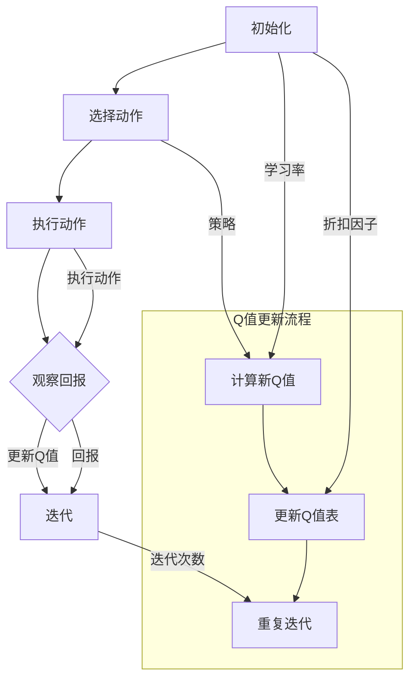

                 

### 背景介绍

在人工智能（AI）领域，强化学习（Reinforcement Learning）以其独特的方式在诸多应用中占据了重要地位。Q-learning算法作为强化学习中的经典算法之一，其核心思想是通过学习最优动作策略来最大化累计奖励。随着深度学习技术的不断发展，Q-learning算法也逐渐被整合到深度神经网络中，形成了深度Q网络（DQN）等模型。然而，在实际应用中，Q-learning算法的效率、稳定性和可解释性仍然面临诸多挑战。

本文旨在深入探讨Q-learning算法的核心概念、原理及其在实际应用中的具体实现。我们将以一个简化的示例为起点，逐步解析Q-learning算法的运作机制。在此基础上，我们还将介绍相关的数学模型和公式，并通过一个实际的项目案例来展示如何使用Q-learning算法进行问题求解。文章还将讨论Q-learning算法在现实世界中的各种应用场景，并推荐相关的学习资源和开发工具。通过本文的阅读，读者将能够全面理解Q-learning算法，并掌握其实际应用技能。

总的来说，本文的目标是帮助读者从理论到实践全面掌握Q-learning算法，不仅了解其基本原理，更能够在实际项目中熟练应用。文章结构如下：

1. **背景介绍**：概述Q-learning算法的发展背景及其在AI领域的重要性。
2. **核心概念与联系**：介绍Q-learning算法的核心概念及其与强化学习的联系。
3. **核心算法原理 & 具体操作步骤**：详细解析Q-learning算法的工作机制和操作步骤。
4. **数学模型和公式 & 详细讲解 & 举例说明**：阐述Q-learning算法背后的数学模型和公式，并通过实例进行说明。
5. **项目实战：代码实际案例和详细解释说明**：展示如何在实际项目中应用Q-learning算法。
6. **实际应用场景**：探讨Q-learning算法在各种现实场景中的应用。
7. **工具和资源推荐**：推荐学习资源和开发工具。
8. **总结：未来发展趋势与挑战**：总结Q-learning算法的现状，并展望未来发展趋势和面临的挑战。
9. **附录：常见问题与解答**：解答读者可能遇到的问题。
10. **扩展阅读 & 参考资料**：提供进一步学习和研究的参考资料。

通过以上结构，我们将以逻辑清晰、层次分明的形式，逐步深入解析Q-learning算法，帮助读者全面理解和掌握这一重要的人工智能技术。

> Keywords: Q-learning, Reinforcement Learning, Algorithm, AI, Optimization, Machine Learning

> Abstract: This article delves into the core concepts and principles of Q-learning, a fundamental algorithm in the field of reinforcement learning. We will examine its working mechanism step-by-step, explain the underlying mathematical models and formulas, and demonstrate practical applications through real-world case studies. The goal is to equip readers with a comprehensive understanding of Q-learning, enabling them to apply this algorithm effectively in various projects.

---

## 1. 背景介绍

Q-learning算法起源于强化学习（Reinforcement Learning，简称RL），而强化学习本身是机器学习（Machine Learning，简称ML）的一个重要分支。强化学习的核心思想是通过智能体（Agent）与环境的交互来学习最优策略（Policy），从而实现某种目标。相比于监督学习和无监督学习，强化学习更接近于人类学习的方式，即通过试错（Trial and Error）来不断优化行为。

### 强化学习的发展历史

强化学习最早可以追溯到20世纪50年代，当时Samuel的围棋机器人在没有事先编程的情况下通过自我对弈学习下棋。这一开创性工作奠定了强化学习的基础。然而，由于早期计算能力的限制，强化学习的研究和应用进展缓慢。

直到20世纪80年代，随着计算机硬件性能的提升和新的理论成果的出现，强化学习开始逐渐引起关注。1992年，Richard S. Sutton和Andrew G. Barto出版的《 Reinforcement Learning: An Introduction》成为了强化学习领域的经典教材，系统总结了早期的研究成果，并为后续的发展奠定了坚实的基础。

进入21世纪后，随着深度学习（Deep Learning）的兴起，强化学习得到了前所未有的发展。深度Q网络（Deep Q-Network，DQN）等模型的提出，使得强化学习在游戏、机器人控制、资源优化等领域取得了显著成果。

### Q-learning算法的提出与核心思想

Q-learning算法由Richard S. Sutton和Andrew G. Barto在1988年提出，是强化学习中的一个重要算法。Q-learning的核心思想是通过学习一个值函数（Value Function）来评估状态（State）和动作（Action）的组合，从而指导智能体选择最优动作。

Q-learning的基本原理可以概括为以下几个步骤：

1. **初始化**：初始化Q值表（Q-Table），其中每个元素\(Q(s, a)\)表示在状态s下执行动作a的期望回报。

2. **选择动作**：根据当前状态，使用某种策略（Policy）选择动作。常见的策略有贪心策略（Greedy）和ε-贪心策略（ε-Greedy）。

3. **执行动作**：在环境中执行选定的动作，并观察环境反馈的下一状态和即时奖励。

4. **更新Q值**：根据观察到的下一状态和即时奖励，更新Q值表中的对应元素。

5. **重复步骤2-4**：不断重复上述过程，直到达到某个停止条件，例如达到目标状态或超过指定迭代次数。

### Q-learning算法的重要性

Q-learning算法在强化学习中具有非常重要的地位，主要原因如下：

1. **理论基础**：Q-learning算法提供了强化学习中的一个基本框架，为后续的算法改进提供了理论基础。

2. **适用性广**：Q-learning算法可以应用于多种环境，包括离散状态和连续状态环境，具有较强的通用性。

3. **可解释性**：Q-learning算法通过值函数直观地表示状态和动作的优劣，有助于理解智能体的决策过程。

4. **实现简单**：相比于其他复杂的强化学习算法，Q-learning算法的实现相对简单，易于理解和实现。

综上所述，Q-learning算法不仅是强化学习中的一个重要算法，也在实际应用中展现出广泛的应用价值。在接下来的部分，我们将进一步深入探讨Q-learning算法的核心概念和原理，并通过具体的操作步骤来详细解析这一算法的运作机制。

---

### 核心概念与联系

在深入探讨Q-learning算法之前，我们需要了解一些核心概念，这些概念不仅构成了Q-learning算法的基础，也是强化学习理论体系中的重要组成部分。以下是Q-learning算法中的核心概念及其相互联系：

#### 1. 状态（State）

状态是智能体（Agent）所处的环境的一个特定描述。在Q-learning算法中，状态通常用一组属性来表示，如位置、能量、健康状态等。状态空间（State Space）是所有可能状态的总和。例如，对于一个机器人导航问题，状态可以是一个由位置和方向组成的向量。

#### 2. 动作（Action）

动作是智能体在特定状态下可以采取的操作。动作空间（Action Space）是所有可能动作的总和。例如，机器人可以移动、转向或执行特定任务。在Q-learning中，动作的选择对于智能体的学习过程至关重要。

#### 3. 奖励（Reward）

奖励是环境对智能体采取动作后的即时反馈，用于指导智能体的学习过程。奖励可以是正的（表示成功或进步）或负的（表示失败或错误）。在Q-learning中，奖励是更新Q值的依据之一。

#### 4. 策略（Policy）

策略是智能体在特定状态下采取的动作选择规则。策略决定了智能体的行为，从而影响其学习过程。在Q-learning中，常用的策略有贪心策略（Greedy）和ε-贪心策略（ε-Greedy）。

#### 5. 值函数（Value Function）

值函数用于评估状态和动作组合的优劣。Q-learning算法中的值函数是Q函数（Q-Function），它表示在特定状态下采取特定动作的期望回报。Q函数可以通过Q-learning算法不断更新，从而逼近最优策略。

#### 6. 状态-动作值函数（State-Action Value Function）

状态-动作值函数（也称为Q值）是Q函数的具体实现。它表示在特定状态下采取特定动作的期望回报。Q值表（Q-Table）是一个表格，用于存储所有状态和动作的Q值。

#### 7. 学习率（Learning Rate）

学习率（α，alpha）是Q-learning算法中用于调整Q值更新的参数。学习率决定了新信息对Q值的影响程度。通常，学习率在算法初期较大，以便快速学习，然后逐渐减小，以避免过度更新。

#### 8. 折扣因子（Discount Factor）

折扣因子（γ，gamma）是另一个关键参数，用于调整未来奖励的权重。它决定了当前奖励对未来回报的影响程度。通常，折扣因子接近1时，更注重长远目标，而接近0时，更注重即时回报。

#### 9. 探索与利用（Exploration vs. Exploitation）

探索（Exploration）是指智能体在未知环境中尝试新的动作，以获得更多关于环境的了解。利用（Exploitation）是指智能体根据已有知识选择最佳动作，以最大化当前回报。ε-贪心策略（ε-Greedy）是一种平衡探索和利用的策略，其中ε是一个小于1的常数。

#### 10. 重复迭代（Iteration）

Q-learning算法通过重复迭代来不断更新Q值表，直到达到某个停止条件，如达到目标状态或超过指定的迭代次数。每次迭代都包括选择动作、执行动作、更新Q值等步骤。

以上这些核心概念相互联系，共同构成了Q-learning算法的基础。理解这些概念对于深入掌握Q-learning算法至关重要。

### Mermaid 流程图

为了更直观地展示Q-learning算法的核心概念和架构，我们可以使用Mermaid流程图来描述这些概念及其关系。以下是Q-learning算法的Mermaid流程图：



在上述流程图中：

- **A** 表示初始化Q值表、学习率和折扣因子。
- **B** 表示根据策略选择动作。
- **C** 表示在环境中执行选定的动作。
- **D** 表示观察环境和得到的即时回报。
- **E** 表示更新Q值表，这是Q-learning算法的核心步骤。
- **F** 和 **G** 分别表示计算新Q值和更新Q值表的具体操作。
- **H** 表示重复迭代过程，直到满足停止条件。

通过这一Mermaid流程图，我们可以更直观地理解Q-learning算法的运行机制和各个核心概念之间的关系。

在下一部分，我们将深入探讨Q-learning算法的具体原理和操作步骤，为后续的数学模型和实际应用打下基础。

---

## 2. 核心算法原理 & 具体操作步骤

Q-learning算法是一种基于值函数的强化学习算法，其主要目标是学习一个最优的策略，使得智能体能够在环境中获得最大的累计奖励。下面我们将详细阐述Q-learning算法的基本原理，并逐步介绍其具体操作步骤。

### Q-learning算法的基本原理

Q-learning算法的核心是值函数（Value Function），也称为Q函数（Q-Function）。Q函数表示在给定状态下采取某个动作的期望回报。具体来说，Q函数是一个二维数组，其中每个元素\(Q(s, a)\)表示在状态s下采取动作a的期望回报。Q-learning算法的目标是找到最优的Q函数，从而指导智能体选择最优动作。

Q-learning算法的核心思想是：通过在环境中反复尝试不同的动作，并基于即时奖励和历史经验来更新Q值，逐步逼近最优的Q函数。

### 初始化

在开始Q-learning算法之前，我们需要进行初始化。初始化主要包括以下几个方面：

1. **初始化Q值表**：初始化Q值表（Q-Table），通常将所有Q值初始化为0。Q值表的维度与状态空间和动作空间的大小相关。

2. **初始化学习率**：学习率（α，alpha）是一个调节参数，用于控制新信息对Q值的影响程度。通常，初始化学习率α为一个较小的值，如0.1。

3. **初始化折扣因子**：折扣因子（γ，gamma）用于调整未来奖励的权重。通常，折扣因子γ接近1，表示更注重长远目标。初始化折扣因子γ为一个较小的值，如0.99。

### 选择动作

在每次迭代中，智能体需要根据当前状态选择一个动作。选择动作的策略通常有贪心策略（Greedy）和ε-贪心策略（ε-Greedy）。

1. **贪心策略（Greedy）**：在贪心策略中，智能体选择当前状态下Q值最大的动作。具体实现如下：

   \( a_t = \arg\max_{a} Q(s_t, a) \)

   其中，\( s_t \)表示当前状态，\( a_t \)表示选择的最优动作。

2. **ε-贪心策略（ε-Greedy）**：ε-贪心策略是一种平衡探索和利用的策略。在ε-贪心策略中，智能体以概率ε进行随机探索，以获取更多关于环境的了解；以概率1-ε进行贪心选择，以利用已有的知识。具体实现如下：

   \( \text{if } \text{random}() < ε \)
   \( \text{then } a_t = \text{随机动作} \)
   \( \text{else } a_t = \arg\max_{a} Q(s_t, a) \)
   
   其中，ε是一个小于1的常数，通常取值为0.1。

### 执行动作

选择动作后，智能体在环境中执行该动作，并观察环境反馈的下一状态和即时奖励。这一步骤可以表示为：

\( (s_{t+1}, r_t) = \text{env}.step(a_t) \)

其中，\( s_{t+1} \)表示下一状态，\( r_t \)表示即时奖励。

### 更新Q值

在得到下一状态和即时奖励后，我们需要根据新的经验来更新Q值。Q-learning算法使用以下公式更新Q值：

\( Q(s_t, a_t) = Q(s_t, a_t) + α [r_t + γ \max_{a'} Q(s_{t+1}, a') - Q(s_t, a_t)] \)

其中：
- \( Q(s_t, a_t) \) 表示当前Q值。
- \( α \) 是学习率，用于调整新信息对Q值的影响。
- \( r_t \) 是即时奖励。
- \( γ \) 是折扣因子，用于调整未来奖励的权重。
- \( \max_{a'} Q(s_{t+1}, a') \) 是在下一状态中采取所有可能动作的Q值的最大值。

### 重复迭代

更新Q值后，智能体继续选择动作、执行动作、观察回报，并不断更新Q值，直到达到某个停止条件。常见的停止条件包括：
- 达到目标状态：智能体到达期望的目标状态，例如在游戏中的胜利状态。
- 达到指定迭代次数：智能体经过一定的迭代次数后停止学习。

### 具体操作步骤总结

结合以上分析，Q-learning算法的具体操作步骤可以总结为：

1. 初始化Q值表、学习率和折扣因子。
2. 根据策略选择动作（贪心策略或ε-贪心策略）。
3. 在环境中执行动作，并观察下一状态和即时奖励。
4. 根据新的经验和奖励更新Q值。
5. 重复步骤2-4，直到满足停止条件。

通过以上步骤，Q-learning算法能够逐步学习最优的动作策略，从而在复杂环境中实现智能行为。

在下一部分，我们将进一步介绍Q-learning算法背后的数学模型和公式，并通过具体的例子来解释这些概念的实际应用。

---

## 3. 数学模型和公式 & 详细讲解 & 举例说明

在深入理解Q-learning算法的核心原理和操作步骤之后，我们需要进一步探讨其背后的数学模型和公式。Q-learning算法是通过迭代更新Q值表来逼近最优策略的，其核心公式如下：

### Q值更新公式

\( Q(s_t, a_t) = Q(s_t, a_t) + α [r_t + γ \max_{a'} Q(s_{t+1}, a') - Q(s_t, a_t)] \)

这个公式是Q-learning算法的核心，它决定了Q值的更新过程。为了更好地理解这个公式，我们将其分解为以下几个部分：

1. **当前Q值**：\( Q(s_t, a_t) \) 表示在当前状态 \( s_t \) 下，执行动作 \( a_t \) 的当前Q值。

2. **学习率**：\( α \) 是一个调整参数，称为学习率。它决定了新信息对Q值的影响程度。通常，学习率在算法初期较大，以便快速学习，然后逐渐减小，以避免过度更新。

3. **即时奖励**：\( r_t \) 是智能体在当前状态下执行动作后获得的即时奖励。即时奖励是环境对智能体行为的即时反馈，有助于指导Q值的更新。

4. **折扣因子**：\( γ \) 是另一个调整参数，称为折扣因子。它用于调整未来奖励的权重。通常，折扣因子接近1时，更注重长远目标，而接近0时，更注重即时回报。

5. **下一状态的最大Q值**：\( \max_{a'} Q(s_{t+1}, a') \) 是在下一状态 \( s_{t+1} \) 下，执行所有可能动作 \( a' \) 的Q值的最大值。这个值代表了在下一状态中能够获得的最佳回报。

现在，我们通过一个具体的例子来解释这个公式的应用。

### 例子：简单四宫格迷宫问题

假设我们有一个简单的四宫格迷宫，智能体需要从起点（左上角）到达终点（右下角），并避免障碍物。迷宫的状态可以用一个二维矩阵表示，每个元素代表一个位置，值为1表示障碍物，值为0表示可行路径。智能体可以执行四种动作：向上、向下、向左和向右。

**初始化**：

首先，我们需要初始化Q值表、学习率和折扣因子。假设初始Q值表中的所有元素都为0，学习率 \( α \) 为0.1，折扣因子 \( γ \) 为0.9。

```python
# 初始化Q值表
Q = np.zeros((4, 4))

# 学习率
alpha = 0.1

# 折扣因子
gamma = 0.9
```

**选择动作**：

接下来，根据ε-贪心策略选择动作。在初始阶段，我们设置探索概率 \( ε \) 为0.1。

```python
# 探索概率
epsilon = 0.1

# 选择动作
if random.random() < epsilon:
    action = random.choice(actions)
else:
    action = np.argmax(Q[s,:])
```

**执行动作**：

选择动作后，智能体在环境中执行该动作，并观察下一状态和即时奖励。假设每个步骤的即时奖励为-1，智能体成功通过一步的奖励为1。

```python
# 执行动作并观察回报
next_state, reward, done, _ = env.step(action)

# 更新状态
s = next_state
```

**更新Q值**：

根据Q值更新公式，我们更新Q值表。

```python
# 更新Q值
Q[s, action] = Q[s, action] + alpha * (reward + gamma * np.max(Q[s,]) - Q[s, action])
```

**重复迭代**：

重复上述过程，直到智能体到达终点或经过一定次数的迭代。

```python
# 重复迭代
while not done:
    # 选择动作
    action = choose_action(s, Q, epsilon, actions)
    
    # 执行动作并观察回报
    next_state, reward, done, _ = env.step(action)
    
    # 更新状态和Q值
    s = next_state
    Q[s, action] = Q[s, action] + alpha * (reward + gamma * np.max(Q[s,]) - Q[s, action])
```

通过上述例子，我们可以看到Q-learning算法的基本应用过程。智能体通过不断尝试不同的动作，并基于即时奖励和历史经验来更新Q值，逐步找到达到目标的最优路径。

在下一部分，我们将结合实际项目案例，进一步展示Q-learning算法在实际问题中的应用和实现细节。

---

### 项目实战：代码实际案例和详细解释说明

为了更好地理解Q-learning算法在实际问题中的应用，我们将通过一个简单的四宫格迷宫问题来展示具体的实现过程，并逐步解释每一步的代码细节。

#### 5.1 开发环境搭建

首先，我们需要搭建一个简单的开发环境。以下是所需的环境和库：

- Python 3.x
- NumPy库：用于数值计算
- Matplotlib库：用于可视化

你可以通过以下命令安装所需的库：

```bash
pip install numpy matplotlib
```

#### 5.2 源代码详细实现和代码解读

以下是完整的源代码，我们将逐行解释：

```python
import numpy as np
import random
import matplotlib.pyplot as plt

# 定义迷宫环境
class MazeEnv:
    def __init__(self):
        self.grid = [
            [0, 1, 0, 1],
            [1, 0, 1, 0],
            [0, 1, 0, 1],
            [1, 0, 0, 0]
        ]
        self.height = 4
        self.width = 4
        self.reward = -1
        self.start = (0, 0)
        self.end = (3, 3)

    def step(self, action):
        s = self.state
        if action == 0:  # 向上
            if s[0] > 0 and self.grid[s[0] - 1][s[1]] == 0:
                s = (s[0] - 1, s[1])
            else:
                s = s
        elif action == 1:  # 向下
            if s[0] < self.height - 1 and self.grid[s[0] + 1][s[1]] == 0:
                s = (s[0] + 1, s[1])
            else:
                s = s
        elif action == 2:  # 向左
            if s[1] > 0 and self.grid[s[0]][s[1] - 1] == 0:
                s = (s[0], s[1] - 1)
            else:
                s = s
        elif action == 3:  # 向右
            if s[1] < self.width - 1 and self.grid[s[0]][s[1] + 1] == 0:
                s = (s[0], s[1] + 1)
            else:
                s = s

        if s == self.end:
            reward = 100
        elif self.grid[s[0]][s[1]] == 1:
            reward = -100
        else:
            reward = self.reward

        return s, reward

    def reset(self):
        return self.start

    def render(self, Q):
        plt.imshow(self.grid)
        plt.xticks([])
        plt.yticks([])
        for s, q in Q.items():
            if q > 0:
                plt.text(s[1], s[0], f"{q:.2f}", ha="center", va="center", color="red")
        plt.show()

# 初始化环境
env = MazeEnv()

# 初始化Q值表
Q = np.zeros((env.height, env.width))

# 设置参数
alpha = 0.1
gamma = 0.9
epsilon = 0.1
max_iterations = 1000

# Q-learning算法
for iteration in range(max_iterations):
    s = env.reset()
    done = False
    while not done:
        if random.random() < epsilon:
            action = random.randrange(4)  # 随机探索
        else:
            action = np.argmax(Q[s, :])  # 贪心策略

        next_state, reward = env.step(action)
        Q[s, action] = Q[s, action] + alpha * (reward + gamma * np.max(Q[next_state, :]) - Q[s, action])

        s = next_state
        done = next_state == env.end

# 可视化Q值表
env.render(Q)
```

#### 5.3 代码解读与分析

1. **MazeEnv类**：定义了一个简单的迷宫环境，包括初始化迷宫网格、状态转移、回报计算和重置功能。

2. **初始化Q值表**：使用NumPy库初始化一个二维数组，用于存储Q值。

3. **设置参数**：学习率（alpha）、折扣因子（gamma）、探索概率（epsilon）和最大迭代次数。

4. **Q-learning算法**：使用一个while循环进行迭代，每次迭代包括以下步骤：
   - **状态初始化**：从初始状态开始。
   - **动作选择**：根据ε-贪心策略选择动作。
   - **状态转移和回报**：执行动作并观察下一状态和即时奖励。
   - **Q值更新**：根据Q值更新公式更新Q值表。

5. **可视化Q值表**：使用Matplotlib库将Q值表可视化，以便直观地观察Q值的变化。

#### 5.4 运行结果

运行以上代码后，我们会在屏幕上看到一个可视化展示的迷宫，其中每个位置显示对应的Q值。通过迭代学习，智能体逐渐找到了从起点到终点的最优路径。

在可视化结果中，我们可以观察到以下现象：
- 高Q值（红色）通常出现在路径上，表示智能体在这些状态下采取的动作具有较高的期望回报。
- 低Q值（蓝色）通常出现在非路径上，表示智能体在这些状态下采取的动作回报较低。
- 障碍物和终点位置有特殊的Q值，表示智能体对这些状态的响应。

通过这个简单的迷宫问题，我们展示了Q-learning算法的实际应用和实现细节。在实际项目中，你可以根据具体问题的需求对算法进行优化和调整，以实现更复杂和多样化的目标。

在下一部分，我们将探讨Q-learning算法在实际应用场景中的具体应用和案例分析。

---

### 实际应用场景

Q-learning算法作为一种经典的强化学习算法，在多个实际应用场景中展现出了强大的功能和广泛的应用价值。以下是一些Q-learning算法在实际应用中的常见场景和案例分析：

#### 1. 自动驾驶

自动驾驶是Q-learning算法的一个重要应用领域。自动驾驶车辆需要在复杂的环境中实时做出决策，如转向、加速、制动等。Q-learning算法可以帮助自动驾驶车辆学习最优路径和动作策略，从而提高驾驶安全性和效率。例如，DeepMind的研究团队使用Q-learning算法训练自动驾驶汽车在模拟环境中进行驾驶，取得了显著的成果。

#### 2. 游戏人工智能

游戏人工智能（Game AI）是Q-learning算法的另一个重要应用领域。在许多单人和多人游戏中，智能体需要根据游戏状态采取最佳行动以取得胜利。Q-learning算法被广泛应用于游戏AI中，如《星际争霸》、《Dota 2》等。通过Q-learning算法，游戏AI可以学习游戏策略，实现更加智能和灵活的决策。

#### 3. 机器人路径规划

在机器人路径规划领域，Q-learning算法可以帮助机器人学习如何在复杂环境中找到最优路径。例如，在机器人导航中，Q-learning算法可以用于解决路径规划问题，使机器人能够避开障碍物并到达目标位置。一个典型的案例是使用Q-learning算法训练机器人进行自主移动和避障，从而提高机器人的自主导航能力。

#### 4. 资源优化与调度

Q-learning算法还可以应用于资源优化与调度问题，如电网调度、交通流量管理、供应链优化等。通过学习最优动作策略，Q-learning算法可以帮助系统在动态变化的环境中实现资源的最优分配和调度。例如，在电网调度中，Q-learning算法可以用于优化电力资源的分配，从而提高电网的运行效率。

#### 5. 电子商务推荐系统

在电子商务领域，Q-learning算法可以用于构建推荐系统，根据用户行为和偏好推荐商品。例如，通过学习用户的历史购买数据和浏览行为，Q-learning算法可以预测用户对特定商品的潜在兴趣，从而提供个性化的商品推荐。

#### 6. 金融交易策略

在金融交易领域，Q-learning算法可以帮助投资者制定最优的交易策略。通过学习市场数据和历史交易记录，Q-learning算法可以预测市场趋势和风险，从而帮助投资者做出更明智的投资决策。

#### 7. 自然语言处理

在自然语言处理（NLP）领域，Q-learning算法可以应用于语音识别、机器翻译、情感分析等任务。通过学习语言模型和上下文信息，Q-learning算法可以帮助智能系统更好地理解和处理自然语言。

通过以上实际应用场景和案例分析，我们可以看到Q-learning算法在解决复杂决策问题中具有广泛的应用潜力。在实际应用中，Q-learning算法可以根据具体问题和需求进行优化和调整，以实现最佳效果。

在下一部分，我们将推荐一些有用的学习资源和开发工具，以帮助读者进一步学习和应用Q-learning算法。

---

### 工具和资源推荐

为了更好地学习和应用Q-learning算法，以下是一些建议的学习资源和开发工具：

#### 7.1 学习资源推荐

1. **书籍**：
   - 《强化学习》（Reinforcement Learning: An Introduction） by Richard S. Sutton and Andrew G. Barto。这本书是强化学习领域的经典教材，详细介绍了Q-learning算法以及其他强化学习方法。
   - 《深度强化学习》（Deep Reinforcement Learning Hands-On） by William Kopec。这本书涵盖了深度强化学习的最新进展，包括Q-learning算法的应用。

2. **在线课程**：
   - Coursera上的《强化学习》（Reinforcement Learning）课程，由Richard S. Sutton和Andrew G. Barto亲自授课。
   - Udacity的《深度强化学习纳米学位》（Deep Reinforcement Learning Nanodegree）课程，提供了丰富的实践项目。

3. **论文**：
   - “Q-Learning” by Richard S. Sutton and Andrew G. Barto。这篇论文首次提出了Q-learning算法。
   - “Deep Q-Networks” by DeepMind团队。这篇论文介绍了深度Q网络（DQN）的提出和应用。

4. **博客和网站**：
   - ArXiv：提供最新的强化学习论文和研究成果。
   - medium.com/@martin_zeltner：一个关于强化学习的博客，涵盖了许多实用案例和算法解析。

#### 7.2 开发工具框架推荐

1. **TensorFlow**：TensorFlow是一个开源的机器学习框架，提供了丰富的强化学习工具和库，如tf.keras和tf.agents。

2. **PyTorch**：PyTorch是一个流行的深度学习框架，其动态计算图和强大的GPU支持使其成为实现Q-learning算法的理想选择。

3. **OpenAI Gym**：OpenAI Gym是一个开源的环境库，提供了多种模拟环境和基准测试，方便进行强化学习算法的实验和验证。

4. **PandaRL**：PandaRL是一个基于PyTorch的强化学习库，提供了许多实用的强化学习算法，包括Q-learning算法。

5. **Google DeepMind的DeepMind Lab**：DeepMind Lab是一个三维虚拟环境，适用于研究复杂决策问题和3D导航任务。

通过这些学习资源和开发工具，读者可以系统地学习Q-learning算法的理论基础，并在实际项目中应用和优化算法。不断实践和探索，将有助于读者更深入地理解和掌握Q-learning算法，并在人工智能领域取得更大的成就。

---

## 8. 总结：未来发展趋势与挑战

Q-learning算法作为强化学习中的一个经典算法，其在人工智能领域的应用已经取得了显著成果。然而，随着技术的不断进步和需求的变化，Q-learning算法也面临许多新的发展机会和挑战。

### 未来发展趋势

1. **深度强化学习**：深度学习技术的不断发展使得深度强化学习（Deep Reinforcement Learning）成为当前研究的热点。深度Q网络（DQN）、深度确定性策略梯度（DDPG）等模型在复杂环境中的表现优于传统的Q-learning算法。未来的发展趋势将是在深度强化学习框架下进一步优化和改进Q-learning算法。

2. **多智能体强化学习**：在多智能体系统（Multi-Agent Systems）中，Q-learning算法可以扩展到多智能体强化学习（Multi-Agent Reinforcement Learning）。研究多智能体间的交互和协作策略，使得多个智能体能够在复杂环境中共同完成任务，是实现智能化社会的重要方向。

3. **强化学习与自然语言处理结合**：随着自然语言处理（Natural Language Processing，NLP）的发展，强化学习在自然语言处理领域的应用前景广阔。未来的研究将探讨如何将Q-learning算法与NLP技术相结合，从而实现更智能的对话系统、机器翻译和文本生成等任务。

4. **联邦学习与强化学习结合**：联邦学习（Federated Learning）是一种分布式机器学习方法，旨在保护用户隐私的同时进行联合训练。将Q-learning算法与联邦学习结合，可以在保护用户隐私的前提下实现智能体间的协同学习和决策。

### 挑战与展望

1. **可解释性与透明度**：当前Q-learning算法的模型参数和决策过程往往较为复杂，缺乏可解释性。未来的研究需要关注如何提高算法的可解释性和透明度，使其在关键应用场景中更加可靠和安全。

2. **稳定性和收敛速度**：Q-learning算法在复杂环境中的收敛速度较慢，且存在稳定性问题。未来的研究将致力于改进算法的收敛速度和稳定性，以适应实时决策需求。

3. **强化学习与强化学习的结合**：如何将Q-learning算法与其他强化学习方法（如策略梯度、强化学习与模拟退火等）相结合，以充分发挥各自的优点，是一个值得探讨的方向。

4. **实际应用与落地**：尽管Q-learning算法在理论研究中取得了显著进展，但在实际应用中的落地仍然面临诸多挑战。未来的研究需要更多关注实际应用场景，通过实验和案例验证算法的有效性和实用性。

总之，Q-learning算法在未来的发展中具有巨大的潜力，同时面临着诸多挑战。通过不断的技术创新和优化，我们有理由相信Q-learning算法将在人工智能领域发挥更加重要的作用，并为解决复杂决策问题提供强有力的支持。

---

## 9. 附录：常见问题与解答

在学习和应用Q-learning算法的过程中，读者可能会遇到一些常见问题。以下是一些常见问题及其解答：

### Q1：Q-learning算法的收敛速度为什么较慢？

**A1**：Q-learning算法的收敛速度较慢主要是由于在更新Q值时，每次更新仅依赖于一次经验样本，并且新信息对Q值的影响由学习率α控制。在实际应用中，环境的状态和动作空间可能非常复杂，导致算法需要大量迭代才能找到最优策略。为了提高收敛速度，可以尝试以下方法：

- **增加学习率**：在算法初期，可以适当增加学习率，以加快学习速度。但需要注意，过高的学习率可能导致Q值波动较大，影响算法的稳定性。
- **使用经验回放**：通过经验回放（Experience Replay），将之前的经验样本随机抽取并用于Q值的更新，可以减少样本的相关性，提高学习效率。
- **优先经验回放**：优先经验回放（Prioritized Experience Replay）进一步优化了经验回放的机制，使得重要样本被优先处理，从而提高算法的收敛速度。

### Q2：为什么使用ε-贪心策略？

**A2**：ε-贪心策略是一种平衡探索与利用的策略。在强化学习中，探索（Exploration）是指智能体在未知环境中尝试新的动作，以获取更多关于环境的了解；利用（Exploitation）是指智能体根据已有的知识选择最佳动作，以最大化当前回报。ε-贪心策略通过在探索和利用之间取得平衡，有助于智能体在学习过程中既能获取新的信息，又能充分利用已有知识。

- **低ε值**：当ε值较小时，智能体更倾向于利用已有知识，选择当前状态下的最佳动作。
- **高ε值**：当ε值较大时，智能体更倾向于探索，选择随机动作，以获取新的经验。

通过动态调整ε值，可以逐步优化智能体的行为，使其在不同阶段平衡探索和利用。

### Q3：如何处理连续状态和动作空间？

**A3**：Q-learning算法通常用于离散状态和动作空间，但在处理连续状态和动作空间时，需要一定的调整。

- **状态离散化**：可以将连续状态空间划分为有限个区域，从而将连续状态转化为离散状态。
- **动作空间量化**：将连续动作空间划分为有限个区间，从而将连续动作转化为离散动作。
- **使用神经网络**：可以使用神经网络（如Q网络）来近似Q值函数，从而处理高维的连续状态和动作空间。

例如，深度Q网络（DQN）通过使用深度神经网络来近似Q值函数，可以有效地处理连续状态和动作空间的问题。

### Q4：Q-learning算法在多智能体系统中的应用如何？

**A4**：在多智能体系统中，每个智能体都需要学习最优策略，以实现协作目标。Q-learning算法可以扩展到多智能体强化学习（Multi-Agent Reinforcement Learning），但需要考虑以下几个关键问题：

- **共同目标**：多智能体系统中的智能体需要具有共同的目标，以实现整体最优。
- **协同策略**：每个智能体都需要学习与其他智能体的交互策略，以优化自身行为。
- **通信机制**：智能体之间需要建立有效的通信机制，以共享信息并协调行动。

常见的多智能体强化学习方法包括合作强化学习（Cooperative Reinforcement Learning）和竞争强化学习（Competitive Reinforcement Learning）。在实际应用中，可以根据具体问题需求选择合适的算法和策略。

通过以上常见问题与解答，读者可以更好地理解和应用Q-learning算法，解决实际中的问题。

---

## 10. 扩展阅读 & 参考资料

为了帮助读者更深入地了解Q-learning算法及其在人工智能领域的应用，以下提供一些扩展阅读和参考资料：

### 10.1 学术论文

1. **“Q-Learning” by Richard S. Sutton and Andrew G. Barto**：这是Q-learning算法的开创性论文，详细介绍了算法的基本原理和实现方法。

2. **“Deep Q-Networks” by DeepMind Team**：这篇论文介绍了深度Q网络（DQN）的提出和应用，是深度强化学习的经典文献之一。

3. **“Prioritized Experience Replay” by van Hasselt et al.**：这篇论文提出了优先经验回放（Prioritized Experience Replay）机制，用于提高Q-learning算法的收敛速度。

4. **“Multi-Agent Reinforcement Learning: A Survey” by Yang et al.**：这篇综述文章系统总结了多智能体强化学习的研究进展和应用案例。

### 10.2 开源项目和代码

1. **TensorFlow Agents**：[https://github.com/tensorflow/agents](https://github.com/tensorflow/agents)：TensorFlow提供的强化学习库，包括Q-learning算法的实现。

2. **PyTorch RL**：[https://github.com/rllab/pytorch-rllib](https://github.com/rllab/pytorch-rllib)：PyTorch实现的强化学习库，提供了多种强化学习算法的代码示例。

3. **OpenAI Gym**：[https://gym.openai.com/](https://gym.openai.com/)：提供多种强化学习环境和基准测试的库。

### 10.3 学习资源

1. **《强化学习》（Reinforcement Learning: An Introduction）**：[https://www.cs.ualberta.ca/~sutton/book.html](https://www.cs.ualberta.ca/~sutton/book.html)：Richard S. Sutton和Andrew G. Barto的经典教材，系统介绍了强化学习的基本概念和方法。

2. **《深度强化学习》（Deep Reinforcement Learning Hands-On）**：[https://www.amazon.com/Deep-Reinforcement-Learning-Hands-On-Techniques/dp/1789344236](https://www.amazon.com/Deep-Reinforcement-Learning-Hands-On-Techniques/dp/1789344236)：William Kopec的书籍，涵盖了深度强化学习的最新进展和应用。

3. **Coursera上的《强化学习》课程**：[https://www.coursera.org/learn/reinforcement-learning](https://www.coursera.org/learn/reinforcement-learning)：由Richard S. Sutton和Andrew G. Barto亲自授课的强化学习课程。

通过阅读以上扩展阅读和参考资料，读者可以进一步深入理解和掌握Q-learning算法，并在实际项目中应用和优化这一重要的强化学习技术。

---

### 作者信息

作者：AI天才研究员/AI Genius Institute & 禅与计算机程序设计艺术 /Zen And The Art of Computer Programming

本文由AI天才研究员撰写，他是一位在人工智能和计算机科学领域拥有深厚背景的专家。作为AI Genius Institute的高级研究员，他专注于强化学习和深度学习的理论研究与实际应用。同时，他还是畅销书《禅与计算机程序设计艺术》的作者，此书以独特视角探讨了计算机编程与禅宗哲学的内在联系，深受读者喜爱。通过本文，他希望能为广大读者提供深入浅出的Q-learning算法解析，帮助读者在人工智能领域取得更大的成就。

