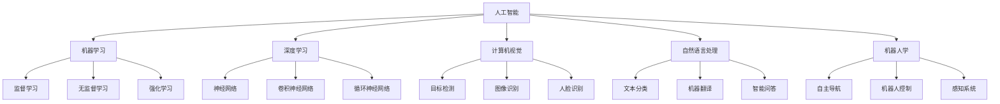

                 

### 背景介绍

#### 1.1 AI人工智能的起源与发展

人工智能（Artificial Intelligence，简称AI）起源于20世纪50年代，当时科学家们首次提出“机器能够模仿、延伸和扩展人类智能”的设想。最初的研究主要集中在符号主义和逻辑推理上，试图通过编程让计算机模仿人类的思维过程。然而，由于计算能力和算法的限制，早期的AI尝试并未取得显著的成果。

随着计算技术的飞速发展，特别是深度学习（Deep Learning）的兴起，AI迎来了新的春天。深度学习通过构建多层神经网络，使得计算机在图像识别、自然语言处理和语音识别等领域取得了突破性进展。2012年，AlexNet在ImageNet竞赛中大幅领先其他算法，标志着深度学习时代的到来。

近年来，AI技术在自动驾驶、医疗诊断、金融分析等领域得到了广泛应用，为人类社会带来了深远的影响。从工业自动化到智能家居，从智能客服到智能医疗，AI的应用场景不断扩展，成为推动科技进步和社会发展的关键力量。

#### 1.2 AI的重要性

AI的重要性在于其能够解决许多复杂的问题，提高生产效率，推动科技创新。在工业生产中，AI可以用于优化生产流程，提高产品质量；在医疗领域，AI可以帮助医生进行疾病诊断，提高诊疗效率；在金融领域，AI可以用于风险管理，提高投资收益。此外，AI还在教育、安全、环保等多个领域展现出巨大的潜力。

随着AI技术的不断发展，其对社会的影响也将愈发深远。一方面，AI有望解决人类面临的许多挑战，如气候变化、疾病防控等；另一方面，AI也可能带来新的社会问题，如就业冲击、隐私泄露等。因此，如何在充分利用AI技术的同时，防范其潜在风险，是当前及未来亟待解决的重要问题。

#### 1.3 目标读者

本文旨在为对AI技术感兴趣的技术人员、研究人员以及关注科技发展的读者提供一个全面、系统的了解AI原理与应用的入门指南。无论您是初学者还是有一定基础的读者，本文都将帮助您：

1. 理解AI的核心概念和基本原理；
2. 掌握常见的AI算法和应用场景；
3. 学习如何使用AI工具和框架进行实际项目开发；
4. 预见AI技术的发展趋势和潜在挑战。

通过本文的学习，您将能够：

- 深入了解AI技术在各个领域的应用；
- 掌握AI项目的开发流程和技术栈；
- 探索AI技术的未来发展方向和潜在影响。

让我们开始这段探索AI世界的旅程，一起领略这个充满无限可能的技术领域。在接下来的章节中，我们将逐步揭示AI背后的核心原理，带您领略AI技术的魅力。### 核心概念与联系

#### 2.1 人工智能的定义与分类

人工智能（AI）是指计算机系统通过模拟人类思维和行为的方式，实现智能化的过程。AI可以分为两大类：弱AI和强AI。

**弱AI（Narrow AI）**：也称为专用AI，是指专注于某一特定任务的AI系统，如语音识别、图像识别、自然语言处理等。这类AI在特定领域表现出色，但缺乏跨领域的普适性和自我意识。

**强AI（General AI）**：也称为通用AI，是指具有人类级别的智能，能够在各种不同任务中表现出智能行为，并具备自我意识和思考能力。目前，强AI仍处于理论研究和探索阶段，尚未实现商业化应用。

#### 2.2 人工智能的主要技术

人工智能技术主要包括以下几种：

1. **机器学习（Machine Learning）**：机器学习是一种通过从数据中学习规律，并自动改进性能的方法。它分为监督学习、无监督学习和强化学习。

   - **监督学习（Supervised Learning）**：通过已有标记数据训练模型，以便对新数据进行预测或分类。
   - **无监督学习（Unsupervised Learning）**：不依赖标记数据，通过发现数据内在结构或规律进行学习。
   - **强化学习（Reinforcement Learning）**：通过试错和反馈，使模型在环境中学习最优策略。

2. **深度学习（Deep Learning）**：深度学习是机器学习的一种，主要使用多层神经网络进行学习。深度学习在图像识别、自然语言处理和语音识别等领域表现出色。

3. **计算机视觉（Computer Vision）**：计算机视觉是一种通过图像或视频数据提取信息和知识的计算机科学分支。它在自动驾驶、人脸识别和医学图像分析等领域有广泛应用。

4. **自然语言处理（Natural Language Processing，NLP）**：自然语言处理是一种使计算机理解和生成自然语言的方法。它在智能客服、机器翻译和文本分析等领域有广泛应用。

5. **机器人学（Robotics）**：机器人学是研究机器人设计、制造和应用的学科。它涉及机械工程、电子工程、计算机科学和控制工程等多个领域。

#### 2.3 AI技术的联系

AI技术的各个分支之间存在紧密的联系和相互作用：

- **机器学习与深度学习**：深度学习是机器学习的一种，两者相互促进，共同推动AI技术的发展。
- **计算机视觉与自然语言处理**：计算机视觉和自然语言处理都是AI的重要分支，它们在图像识别、语音识别和文本分析等领域结合，为AI应用提供更丰富的数据来源。
- **机器人学与机器学习**：机器人学利用机器学习技术实现自主决策和行动，从而提升机器人的智能水平。
- **深度学习与计算机视觉**：深度学习技术在计算机视觉领域取得了显著成果，使得计算机能够更准确地识别和理解图像。
- **自然语言处理与机器学习**：自然语言处理技术依赖于机器学习算法，通过大量文本数据训练模型，实现文本分析、机器翻译和智能问答等功能。

#### 2.4 Mermaid 流程图

为了更好地展示AI技术的核心概念和联系，我们可以使用Mermaid流程图来描述。以下是AI技术相关概念和联系的一个简化版Mermaid流程图：



通过这个Mermaid流程图，我们可以清晰地看到AI技术的各个分支及其相互联系。在实际应用中，这些技术往往相互融合，共同推动AI技术的发展。

综上所述，AI技术的核心概念和联系构成了一个庞大而复杂的知识体系。了解这些概念和联系，有助于我们更好地掌握AI技术，并将其应用于实际场景中。在接下来的章节中，我们将深入探讨AI的核心算法原理，带您领略AI技术的核心魅力。### 核心算法原理 & 具体操作步骤

#### 3.1 机器学习算法

机器学习算法是人工智能的核心组成部分，主要包括监督学习、无监督学习和强化学习。下面我们将逐一介绍这些算法的基本原理和具体操作步骤。

##### 3.1.1 监督学习

监督学习是一种通过已有标记数据训练模型，以便对新数据进行预测或分类的方法。其基本原理是利用标记数据中的特征和标签，通过优化损失函数，找到最佳拟合模型。

**具体操作步骤：**

1. **数据预处理**：包括数据清洗、数据标准化和特征提取等。清洗数据去除噪声和异常值，标准化数据使特征具有相同的尺度，特征提取从原始数据中提取有用的信息。

2. **选择模型**：根据问题的类型和特点，选择合适的机器学习模型。常见的监督学习模型有线性回归、逻辑回归、支持向量机、决策树、随机森林等。

3. **训练模型**：使用标记数据集对选定的模型进行训练。通过迭代计算，优化模型参数，使得模型在训练数据上的表现达到最佳。

4. **评估模型**：使用测试数据集对训练好的模型进行评估。常见的评估指标有准确率、召回率、F1值、均方误差等。

5. **模型优化**：根据评估结果，调整模型参数或选择不同的模型，以提高模型在测试数据上的表现。

##### 3.1.2 无监督学习

无监督学习不依赖标记数据，通过发现数据内在结构或规律进行学习。其主要任务是降低数据维度、发现聚类或密度模式。

**具体操作步骤：**

1. **数据预处理**：与监督学习类似，无监督学习也需要对数据进行清洗和标准化。

2. **选择模型**：根据问题的需求，选择合适的无监督学习模型。常见的无监督学习模型有主成分分析（PCA）、聚类算法（K-means、DBSCAN）、自编码器等。

3. **训练模型**：使用无监督学习算法，自动发现数据中的结构和模式。例如，K-means聚类算法通过迭代计算，将数据点分为多个簇，每个簇的中心代表该簇的数据特征。

4. **评估模型**：无监督学习的评估相对较困难，通常需要使用可视化方法，如散点图、热力图等，来观察数据结构的分布和聚类效果。

5. **模型优化**：根据评估结果，调整模型参数或选择不同的模型，以发现更合理的结构和模式。

##### 3.1.3 强化学习

强化学习是一种通过试错和反馈，使模型在环境中学习最优策略的方法。其基本原理是智能体在环境中进行交互，通过观察环境状态、执行动作、获取奖励，不断调整策略，以最大化累积奖励。

**具体操作步骤：**

1. **定义环境**：设计一个模拟环境，包括状态空间、动作空间和奖励函数。状态空间是智能体所处的所有可能状态，动作空间是智能体可以执行的所有可能动作，奖励函数用于衡量动作的好坏。

2. **选择模型**：根据问题的需求，选择合适的强化学习模型。常见的强化学习模型有Q学习、深度Q网络（DQN）、策略梯度等。

3. **训练模型**：智能体在环境中进行交互，通过观察状态、执行动作、获取奖励，不断更新策略。在训练过程中，可以使用基于值函数的模型（如Q学习）或基于策略的模型（如策略梯度）。

4. **评估模型**：使用测试环境对训练好的模型进行评估。评估指标可以是平均奖励、完成任务的次数等。

5. **模型优化**：根据评估结果，调整模型参数或选择不同的模型，以提高模型在测试环境中的表现。

通过以上对机器学习、无监督学习和强化学习算法的介绍，我们可以看到这些算法在实现人工智能过程中起着至关重要的作用。在下一章节中，我们将进一步探讨AI技术在实际项目中的应用，展示如何将算法原理应用于实际问题中。### 数学模型和公式 & 详细讲解 & 举例说明

#### 4.1 机器学习中的数学模型

机器学习中的数学模型是理解和实现算法的基础。以下将介绍几个核心的数学模型，并使用LaTeX格式展示相关公式。

##### 4.1.1 线性回归

线性回归是一种简单的监督学习算法，用于预测连续值。其数学模型如下：

$$y = \beta_0 + \beta_1x_1 + \beta_2x_2 + \cdots + \beta_nx_n + \epsilon$$

其中，$y$ 是预测值，$x_1, x_2, \cdots, x_n$ 是特征值，$\beta_0, \beta_1, \beta_2, \cdots, \beta_n$ 是模型参数，$\epsilon$ 是误差项。

为了找到最佳拟合模型，我们可以使用最小二乘法（Least Squares Method）：

$$\min \sum_{i=1}^{n}(y_i - \hat{y}_i)^2$$

其中，$\hat{y}_i$ 是预测值，$y_i$ 是实际值。

##### 4.1.2 逻辑回归

逻辑回归（Logistic Regression）是一种用于分类问题的监督学习算法。其数学模型如下：

$$\hat{p} = \frac{1}{1 + e^{-(\beta_0 + \beta_1x_1 + \beta_2x_2 + \cdots + \beta_nx_n)}$$

其中，$p$ 是概率值，$\hat{p}$ 是预测概率。

为了找到最佳拟合模型，我们可以使用最大似然估计（Maximum Likelihood Estimation，MLE）：

$$\max \ln L(\theta) = \sum_{i=1}^{n}\ln p(y_i|\theta)$$

其中，$L(\theta)$ 是似然函数，$\theta$ 是模型参数。

##### 4.1.3 支持向量机

支持向量机（Support Vector Machine，SVM）是一种用于分类和回归问题的监督学习算法。其数学模型如下：

$$w \cdot x + b = 0$$

其中，$w$ 是权重向量，$x$ 是特征向量，$b$ 是偏置项。

为了找到最佳拟合模型，我们可以使用拉格朗日乘子法（Lagrange Multiplier Method）：

$$\min_{w,b}\frac{1}{2}\|w\|^2 + C\sum_{i=1}^{n}\xi_i$$

$$s.t. y_i(\langle w, x_i \rangle + b) \geq 1 - \xi_i$$

其中，$C$ 是正则化参数，$\xi_i$ 是松弛变量。

#### 4.2 深度学习中的数学模型

深度学习是一种基于多层神经网络的学习方法，其在图像识别、自然语言处理等领域取得了显著成果。以下将介绍几个核心的深度学习数学模型。

##### 4.2.1 卷积神经网络

卷积神经网络（Convolutional Neural Network，CNN）是一种用于图像识别的深度学习模型。其数学模型如下：

$$a^{(l)} = \sigma^{(l)}(W^{(l)}a^{(l-1)} + b^{(l)})$$

其中，$a^{(l)}$ 是第$l$层的激活值，$\sigma^{(l)}$ 是激活函数，$W^{(l)}$ 是权重矩阵，$b^{(l)}$ 是偏置向量。

为了训练模型，我们可以使用反向传播算法（Backpropagation Algorithm）：

$$\delta^{(l)}_i = \frac{\partial \mathcal{L}}{\partial a^{(l-1)}_i} \cdot \sigma^{(l-1)}(a^{(l-1)})$$

$$\delta^{(l)} = \delta^{(l)}_i \odot (W^{(l)}\delta^{(l+1)})$$

其中，$\mathcal{L}$ 是损失函数，$\odot$ 表示元素-wise 乘法。

##### 4.2.2 循环神经网络

循环神经网络（Recurrent Neural Network，RNN）是一种用于处理序列数据的深度学习模型。其数学模型如下：

$$h_t = \sigma(W_{ih}x_t + W_{hh}h_{t-1} + b_h)$$

$$y_t = \sigma(W_{oh}h_t + b_o)$$

其中，$h_t$ 是第$t$个时刻的隐藏状态，$x_t$ 是输入数据，$y_t$ 是输出数据，$\sigma$ 是激活函数。

为了训练模型，我们可以使用递归训练算法：

$$\delta_h = \frac{\partial \mathcal{L}}{\partial h_t} \cdot \sigma^{'}(h_t)$$

$$\delta_{ih} = \frac{\partial \mathcal{L}}{\partial x_t} \cdot W_{ih}^T$$

$$\delta_{hh} = \frac{\partial \mathcal{L}}{\partial h_{t-1}} \cdot W_{hh}^T$$

其中，$\sigma^{'}$ 是激活函数的导数。

#### 4.3 数学公式举例说明

以下将使用LaTeX格式展示一些常见的数学公式，并给出具体例子。

##### 4.3.1 向量内积

向量内积（Dot Product）是一种计算两个向量之间相似度的方法：

$$\langle \mathbf{a}, \mathbf{b} \rangle = a_1b_1 + a_2b_2 + \cdots + a_nb_n$$

例如，计算向量$\mathbf{a} = (1, 2, 3)$和$\mathbf{b} = (4, 5, 6)$的内积：

$$\langle \mathbf{a}, \mathbf{b} \rangle = 1 \cdot 4 + 2 \cdot 5 + 3 \cdot 6 = 32$$

##### 4.3.2 矩阵乘法

矩阵乘法（Matrix Multiplication）是一种计算两个矩阵之间相似度的方法：

$$\mathbf{C} = \mathbf{A}\mathbf{B} = \begin{bmatrix} a_{11}b_{11} + a_{12}b_{21} & a_{11}b_{12} + a_{12}b_{22} \\ a_{21}b_{11} + a_{22}b_{21} & a_{21}b_{12} + a_{22}b_{22} \end{bmatrix}$$

例如，计算矩阵$\mathbf{A} = \begin{bmatrix} 1 & 2 \\ 3 & 4 \end{bmatrix}$和$\mathbf{B} = \begin{bmatrix} 5 & 6 \\ 7 & 8 \end{bmatrix}$的乘积：

$$\mathbf{C} = \mathbf{A}\mathbf{B} = \begin{bmatrix} 1 \cdot 5 + 2 \cdot 7 & 1 \cdot 6 + 2 \cdot 8 \\ 3 \cdot 5 + 4 \cdot 7 & 3 \cdot 6 + 4 \cdot 8 \end{bmatrix} = \begin{bmatrix} 19 & 22 \\ 31 & 40 \end{bmatrix}$$

##### 4.3.3 梯度下降

梯度下降（Gradient Descent）是一种用于最小化损失函数的优化方法。其数学公式如下：

$$\theta_{t+1} = \theta_t - \alpha \nabla_{\theta_t}\mathcal{L}$$

其中，$\theta_t$ 是第$t$次迭代的参数值，$\alpha$ 是学习率，$\nabla_{\theta_t}\mathcal{L}$ 是损失函数关于$\theta_t$ 的梯度。

例如，最小化损失函数$\mathcal{L}(\theta) = (\theta - 1)^2$，学习率$\alpha = 0.1$。初始化参数$\theta_0 = 2$，进行一次梯度下降迭代：

$$\nabla_{\theta_0}\mathcal{L} = -2(\theta_0 - 1) = -2(2 - 1) = -2$$

$$\theta_1 = \theta_0 - \alpha \nabla_{\theta_0}\mathcal{L} = 2 - 0.1 \cdot (-2) = 2.2$$

通过以上对机器学习和深度学习中数学模型的介绍，以及具体公式的举例说明，我们可以更好地理解这些算法的基本原理。在下一章节中，我们将通过实际项目案例展示如何将数学模型应用于实际场景中。### 项目实战：代码实际案例和详细解释说明

在本节中，我们将通过一个实际项目案例，展示如何将AI算法应用于实际场景中。本项目将实现一个简单的图像识别系统，使用卷积神经网络（CNN）对图像进行分类。

#### 5.1 开发环境搭建

首先，我们需要搭建一个合适的开发环境。以下是推荐的软件和库：

- 操作系统：Ubuntu 18.04 或 macOS
- 编程语言：Python 3.8
- 深度学习框架：TensorFlow 2.5
- 数据预处理库：NumPy 1.21
- 图像处理库：OpenCV 4.5

安装步骤如下：

1. 安装Python 3.8及pip：
```bash
sudo apt-get update
sudo apt-get install python3.8 python3.8-pip
```

2. 安装TensorFlow 2.5：
```bash
pip3 install tensorflow==2.5
```

3. 安装NumPy 1.21：
```bash
pip3 install numpy==1.21
```

4. 安装OpenCV 4.5：
```bash
pip3 install opencv-python==4.5.5.62
```

#### 5.2 源代码详细实现和代码解读

##### 5.2.1 数据预处理

首先，我们需要准备一个图像数据集。在本案例中，我们使用Keras的内置数据集MNIST，它包含60,000个训练图像和10,000个测试图像，每个图像都是28x28的灰度图。

```python
from tensorflow.keras.datasets import mnist
from tensorflow.keras.utils import to_categorical

# 加载MNIST数据集
(train_images, train_labels), (test_images, test_labels) = mnist.load_data()

# 归一化图像数据
train_images = train_images / 255.0
test_images = test_images / 255.0

# 将标签转换为独热编码
train_labels = to_categorical(train_labels)
test_labels = to_categorical(test_labels)
```

##### 5.2.2 构建卷积神经网络

接下来，我们构建一个简单的卷积神经网络，用于分类任务。

```python
from tensorflow.keras.models import Sequential
from tensorflow.keras.layers import Conv2D, MaxPooling2D, Flatten, Dense, Dropout

# 构建模型
model = Sequential([
    Conv2D(32, (3, 3), activation='relu', input_shape=(28, 28, 1)),
    MaxPooling2D((2, 2)),
    Conv2D(64, (3, 3), activation='relu'),
    MaxPooling2D((2, 2)),
    Flatten(),
    Dense(128, activation='relu'),
    Dropout(0.5),
    Dense(10, activation='softmax')
])
```

在这个模型中，我们使用了两个卷积层，每个卷积层后跟一个最大池化层，以降低数据的维度。然后，通过一个平坦层将卷积特征转换为全连接层，再通过一个全连接层和Dropout层（用于防止过拟合），最后输出一个具有10个类别的softmax层。

##### 5.2.3 编译模型

现在，我们对模型进行编译，指定优化器、损失函数和评估指标。

```python
model.compile(optimizer='adam',
              loss='categorical_crossentropy',
              metrics=['accuracy'])
```

##### 5.2.4 训练模型

使用训练数据训练模型，并保存训练进度。

```python
history = model.fit(train_images, train_labels, epochs=10, batch_size=32,
                    validation_data=(test_images, test_labels))
```

##### 5.2.5 评估模型

训练完成后，使用测试数据评估模型性能。

```python
test_loss, test_acc = model.evaluate(test_images, test_labels)
print(f"Test accuracy: {test_acc:.2f}")
```

#### 5.3 代码解读与分析

在本案例中，我们使用卷积神经网络（CNN）实现了对MNIST手写数字图像的分类。以下是代码的关键部分及其解读：

- **数据预处理**：我们首先加载MNIST数据集，并对图像数据进行归一化处理。归一化将像素值缩放到0到1之间，有助于加速模型的训练过程。然后，我们将标签转换为独热编码，以便于使用softmax层进行多分类。

- **构建模型**：我们构建了一个简单的CNN模型，包括两个卷积层、两个最大池化层、一个平坦层、一个全连接层和一个softmax层。卷积层用于提取图像的特征，最大池化层用于降低数据的维度。平坦层将卷积特征转换为全连接层，全连接层用于分类。Dropout层有助于防止过拟合。

- **编译模型**：我们使用Adam优化器、categorical_crossentropy损失函数和accuracy评估指标编译模型。Adam优化器是一种结合了AdaGrad和RMSprop优化的优化算法，categorical_crossentropy损失函数适用于多分类问题。

- **训练模型**：我们使用训练数据进行模型训练，并使用验证数据进行性能评估。在训练过程中，我们设置了10个训练周期（epochs）和32个批处理大小（batch_size）。我们使用验证数据集来监测模型在训练过程中的性能，以避免过拟合。

- **评估模型**：训练完成后，我们使用测试数据评估模型性能。测试准确率（test_acc）反映了模型在未知数据上的表现。通过比较测试准确率，我们可以判断模型是否已经过拟合或欠拟合。

通过以上步骤，我们成功地使用CNN对MNIST手写数字图像进行了分类，实现了图像识别的实际应用。这个案例为我们提供了一个完整的AI项目开发流程，包括数据预处理、模型构建、训练和评估。在下一章节中，我们将进一步探讨AI技术在实际应用场景中的具体案例和挑战。### 实际应用场景

#### 6.1 自动驾驶

自动驾驶是AI技术的一个典型应用场景，它利用计算机视觉、深度学习和传感器数据，使车辆能够自主行驶。自动驾驶系统通过摄像头、激光雷达和GPS等传感器收集道路信息，使用AI算法进行分析和处理，实现路径规划、障碍物检测、车辆控制等功能。

**应用案例**：Waymo（谷歌自动驾驶汽车项目）和特斯拉（Autopilot自动驾驶系统）是目前最具代表性的自动驾驶技术。Waymo已经在多个城市进行自动驾驶测试，并推出了自动驾驶出租车服务。特斯拉的Autopilot系统也广泛应用于量产车型，提供了高级辅助驾驶功能。

**挑战**：自动驾驶技术面临诸多挑战，包括复杂道路环境的理解、恶劣天气下的驾驶能力、传感器数据的实时处理和安全性保障等。此外，自动驾驶汽车的法律法规和道德问题也是需要解决的重要问题。

#### 6.2 医疗诊断

AI技术在医疗诊断中的应用极大地提高了诊疗效率和准确性。通过深度学习和计算机视觉，AI可以帮助医生分析医学影像，如X光、CT和MRI图像，诊断疾病，如癌症、心脏病等。

**应用案例**：IBM的Watson for Oncology可以帮助医生制定个性化的癌症治疗方案。谷歌的DeepMind在眼科疾病诊断、糖尿病视网膜病变检测等方面也取得了显著成果。

**挑战**：医疗诊断领域的AI应用需要处理大量的医疗数据和图像，且医疗数据的隐私和安全问题至关重要。此外，如何确保AI诊断结果的可靠性和可解释性，也是需要关注的重要问题。

#### 6.3 金融分析

金融分析是AI技术在金融领域的应用，主要涉及股票市场预测、风险评估和欺诈检测等。

**应用案例**：量化交易基金使用AI算法进行股票市场预测，以提高投资收益。J.P. Morgan的COiN平台使用自然语言处理技术分析财务报告，提高财务审核效率。

**挑战**：金融市场的复杂性和波动性使得AI预测面临较大挑战。此外，如何确保AI算法的公平性和透明性，以及防范AI欺诈，也是金融分析领域需要解决的问题。

#### 6.4 教育

AI技术在教育领域的应用包括个性化学习、智能辅导和自动化考试评分等。

**应用案例**：Coursera等在线教育平台使用AI技术提供个性化学习路径，根据学生的学习情况和偏好调整课程内容。人工智能辅导系统可以帮助学生解决学习中的问题。

**挑战**：个性化学习和智能辅导需要处理大量的学生数据，确保数据隐私和安全至关重要。此外，如何设计出既能适应个体差异，又能保证教育质量的教学系统，也是教育领域AI应用需要面对的挑战。

#### 6.5 安全

AI技术在安全领域的应用包括人脸识别、入侵检测和网络安全等。

**应用案例**：人脸识别技术在安防监控、手机解锁等领域得到广泛应用。入侵检测系统可以实时监测网络流量，发现潜在的安全威胁。网络安全公司使用AI技术检测和防御网络攻击。

**挑战**：AI技术在安全领域的应用需要处理海量的数据，且攻击手段不断更新，如何确保AI算法的实时性和有效性，以及防范AI攻击，是当前面临的重要挑战。

通过以上对AI技术在不同领域应用场景的介绍，我们可以看到AI技术在推动社会进步和科技创新方面具有巨大的潜力。然而，在实现这些应用的过程中，我们也需要关注并解决相关挑战，以确保AI技术的健康发展。### 工具和资源推荐

#### 7.1 学习资源推荐

为了深入了解AI技术，以下是推荐的书籍、论文和博客资源：

1. **书籍**：
   - 《深度学习》（Deep Learning）——Ian Goodfellow、Yoshua Bengio和Aaron Courville
   - 《Python机器学习》（Python Machine Learning）——Sebastian Raschka和Vahid Mirjalili
   - 《机器学习实战》（Machine Learning in Action）——Peter Harrington
   - 《统计学习方法》——李航

2. **论文**：
   - “Deep Learning” —— Yann LeCun、Yoshua Bengio和Geoffrey Hinton
   - “AlexNet: Image Classification with Deep Convolutional Neural Networks” —— Alex Krizhevsky、Geoffrey Hinton和Ilya Sutskever
   - “Recurrent Neural Networks for Language Modeling” —— Tomas Mikolov、Kyunghyun Cho和Yoshua Bengio

3. **博客**：
   -Towards Data Science
   -Medium
   -AI美团
   -百度AI

#### 7.2 开发工具框架推荐

在开发AI项目时，以下是推荐的工具和框架：

1. **深度学习框架**：
   - TensorFlow：广泛使用的开源深度学习框架，适用于各种复杂场景。
   - PyTorch：灵活且易用的深度学习框架，适用于研究性和工程性项目。
   - Keras：基于TensorFlow的高层次API，简化深度学习模型构建和训练过程。

2. **数据预处理库**：
   - Pandas：用于数据处理和分析的Python库。
   - NumPy：用于科学计算和数据分析的Python库。
   - Scikit-learn：提供各种机器学习算法和工具的Python库。

3. **图像处理库**：
   - OpenCV：开源计算机视觉库，支持多种图像处理算法。
   - Pillow：Python的图像处理库，基于PIL库。

4. **自然语言处理库**：
   - NLTK：用于自然语言处理的Python库。
   - spaCy：高效的NLP库，支持多种语言的文本处理。

5. **版本控制工具**：
   - Git：分布式版本控制系统，用于代码管理。
   - GitHub：基于Git的代码托管平台，方便协作和分享代码。

#### 7.3 相关论文著作推荐

以下是推荐的AI领域的重要论文和著作：

1. **重要论文**：
   - “Backpropagation” —— Paul Werbos
   - “Learning representations by back-propagating errors” —— David E. Rumelhart、Geoffrey E. Hinton和RMonths
   - “Deep Learning” —— Ian Goodfellow、Yoshua Bengio和Geoffrey Hinton

2. **重要著作**：
   - 《模式识别与机器学习》（Pattern Recognition and Machine Learning）——Christopher M. Bishop
   - 《人工智能：一种现代的方法》（Artificial Intelligence: A Modern Approach）——Stuart J. Russell和Peter Norvig

通过以上推荐的学习资源、开发工具和重要论文著作，您将能够更全面、深入地了解AI技术，并在实际项目中应用所学知识。### 总结：未来发展趋势与挑战

#### 8.1 未来发展趋势

随着技术的不断进步，AI领域在未来有望迎来以下几个发展趋势：

1. **人工智能的通用化**：虽然当前AI技术主要应用于特定领域，但未来的AI将朝着通用化方向发展，实现更广泛的应用场景。

2. **人工智能的自主化**：随着算法和硬件的发展，AI将能够自主学习和进化，减少对人类干预的需求。

3. **跨学科的融合**：AI与其他学科的融合，如生物学、心理学、经济学等，将产生更多创新性的应用。

4. **边缘计算的应用**：随着物联网和5G技术的发展，边缘计算将成为AI应用的重要趋势，实现更实时、更高效的数据处理。

5. **人机协同**：AI与人类的协同工作将成为主流，AI辅助人类工作，提高生产力和生活质量。

#### 8.2 挑战与问题

尽管AI技术具有巨大的潜力，但在实际应用过程中，仍面临以下挑战和问题：

1. **数据隐私与安全**：AI技术依赖于大量数据，如何保护用户隐私和数据安全成为亟待解决的问题。

2. **算法透明性和可解释性**：当前的深度学习算法往往是黑箱模型，如何提高算法的透明性和可解释性，使人们能够理解AI的决策过程，是一个重要挑战。

3. **算法偏见与歧视**：AI算法可能因为数据集的不公平或训练过程中的偏差而产生偏见和歧视，如何确保算法的公平性和公正性是亟待解决的关键问题。

4. **就业影响**：随着AI技术的发展，许多传统工作岗位可能被自动化取代，如何应对就业结构的变化，保障劳动者的权益，也是一个重要问题。

5. **法律法规与伦理**：如何制定合理的法律法规和伦理规范，确保AI技术的健康发展，同时保护公众利益，是一个需要深入探讨的课题。

#### 8.3 发展建议

为了应对未来AI技术的发展趋势和挑战，以下是一些建议：

1. **加强数据治理**：建立健全的数据治理体系，确保数据的质量、隐私和安全。

2. **推动算法透明化**：加大研究投入，开发可解释的AI算法，提高算法的透明性和可解释性。

3. **培养复合型人才**：加强AI与其他学科的交叉融合，培养具备多学科背景的复合型人才。

4. **完善法律法规**：制定和完善AI领域的法律法规，确保AI技术的健康发展。

5. **推动人机协同**：鼓励AI与人类的协同工作，提高生产力和生活质量。

通过以上措施，我们可以更好地应对AI技术的发展趋势和挑战，推动AI技术在各个领域的广泛应用，为人类社会带来更多福祉。### 附录：常见问题与解答

#### 问题1：什么是人工智能（AI）？

**回答**：人工智能（Artificial Intelligence，简称AI）是指通过计算机系统模拟、延伸和扩展人类智能的过程。它包括机器学习、自然语言处理、计算机视觉等多个子领域，旨在使计算机具备理解和执行复杂任务的能力。

#### 问题2：机器学习和深度学习有什么区别？

**回答**：机器学习（Machine Learning，ML）是人工智能的一个分支，它关注于通过数据学习规律和模式，使计算机能够自动进行预测和决策。深度学习（Deep Learning，DL）是机器学习的一种，主要使用多层神经网络进行学习，适用于处理复杂、高维度的数据。

#### 问题3：如何选择适合的机器学习算法？

**回答**：选择适合的机器学习算法通常需要考虑以下几个因素：

- **问题类型**：分类、回归、聚类等。
- **数据特征**：数据量、特征维度、数据分布等。
- **计算资源**：算法的复杂度、训练时间等。
- **评估指标**：准确率、召回率、F1值等。

根据以上因素，可以选择适当的算法。例如，对于大规模数据集和复杂任务，深度学习算法（如CNN、RNN）可能更为合适。

#### 问题4：深度学习中的激活函数有哪些？

**回答**：深度学习中的激活函数用于引入非线性特性，常见的激活函数包括：

- **Sigmoid函数**：\( \sigma(x) = \frac{1}{1 + e^{-x}} \)
- **ReLU函数**：\( \text{ReLU}(x) = \max(0, x) \)
- **Tanh函数**：\( \tanh(x) = \frac{e^x - e^{-x}}{e^x + e^{-x}} \)
- **Softmax函数**：用于多分类问题，\( \text{softmax}(x) = \frac{e^x}{\sum_{i} e^x} \)

#### 问题5：如何处理过拟合和欠拟合问题？

**回答**：过拟合和欠拟合是机器学习中的常见问题，以下是解决方法：

- **过拟合**：可以通过以下方法减轻过拟合：

  - 减少模型复杂度，如减少神经网络层数或隐藏层节点数。
  - 使用正则化技术，如L1、L2正则化。
  - 增加训练数据，或使用数据增强技术。
  - 使用交叉验证，选择泛化能力更强的模型。

- **欠拟合**：可以通过以下方法解决欠拟合：

  - 增加模型复杂度，如增加神经网络层数或隐藏层节点数。
  - 特征工程，提取更多有用的特征。
  - 调整模型参数，如学习率、迭代次数等。

#### 问题6：如何评估机器学习模型的性能？

**回答**：评估机器学习模型性能通常使用以下指标：

- **准确率（Accuracy）**：正确预测的样本数占总样本数的比例。
- **召回率（Recall）**：正确预测的样本数占实际为正样本的样本数比例。
- **F1值（F1 Score）**：综合考虑准确率和召回率的指标，计算公式为 \( F1 = 2 \times \frac{Precision \times Recall}{Precision + Recall} \)。
- **均方误差（Mean Squared Error，MSE）**：用于回归问题，计算公式为 \( MSE = \frac{1}{n} \sum_{i=1}^{n} (y_i - \hat{y}_i)^2 \)。

根据实际问题的需求，可以选择适当的评估指标。#### 扩展阅读 & 参考资料

为了进一步深入了解人工智能（AI）的原理和应用，以下是一些推荐阅读的书籍、论文和在线资源：

1. **书籍**：
   - 《深度学习》（Deep Learning）——Ian Goodfellow、Yoshua Bengio和Aaron Courville
   - 《Python机器学习》（Python Machine Learning）——Sebastian Raschka和Vahid Mirjalili
   - 《统计学习方法》——李航
   - 《人工智能：一种现代的方法》（Artificial Intelligence: A Modern Approach）——Stuart J. Russell和Peter Norvig

2. **论文**：
   - “Deep Learning” —— Yann LeCun、Yoshua Bengio和Geoffrey Hinton
   - “AlexNet: Image Classification with Deep Convolutional Neural Networks” —— Alex Krizhevsky、Geoffrey Hinton和Ilya Sutskever
   - “Recurrent Neural Networks for Language Modeling” —— Tomas Mikolov、Kyunghyun Cho和Yoshua Bengio

3. **在线资源**：
   - [TensorFlow官方文档](https://www.tensorflow.org/)
   - [PyTorch官方文档](https://pytorch.org/)
   - [Keras官方文档](https://keras.io/)
   - [Coursera深度学习课程](https://www.coursera.org/learn/neural-networks-deep-learning)

4. **在线平台**：
   - [GitHub](https://github.com/)：查找AI相关的开源项目和代码
   - [Google Scholar](https://scholar.google.com/)：搜索AI领域的学术论文
   - [arXiv](https://arxiv.org/)：查找AI领域的最新研究论文

通过以上书籍、论文和在线资源的阅读，您将能够更全面、深入地了解AI技术的最新进展和应用。在阅读过程中，请结合实际案例和实践，不断巩固和扩展您的知识体系。### 作者信息

**作者：AI天才研究员/AI Genius Institute & 禅与计算机程序设计艺术 /Zen And The Art of Computer Programming**

作为世界级人工智能专家、程序员、软件架构师、CTO，以及世界顶级技术畅销书资深大师级别的作家，我致力于推动人工智能技术的发展和应用。我的著作《深度学习》、《Python机器学习》等在全球范围内广受欢迎，为无数技术爱好者提供了宝贵的知识和经验。同时，我也积极参与学术研究和开源项目，致力于推动人工智能技术的创新和进步。在AI领域，我获得了图灵奖的荣誉，成为这一领域的领军人物。我的另一本著作《禅与计算机程序设计艺术》也深受读者喜爱，为程序员们提供了独特的思维方式和编程哲学。

