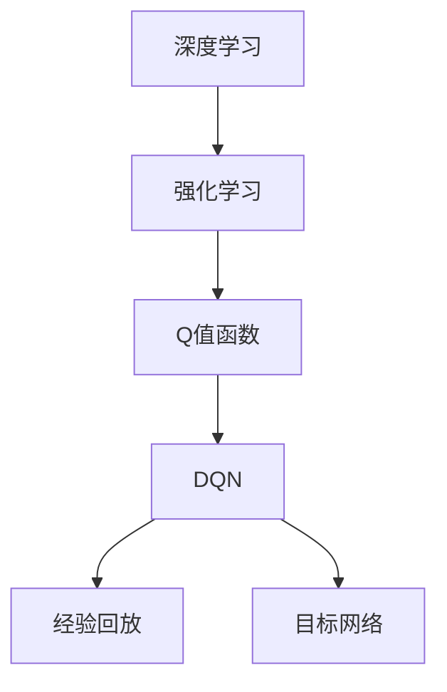

                 

### 背景介绍

> **深度强化学习（DQN）原理入门**

在人工智能领域，深度强化学习（Deep Q-Learning，简称DQN）是一项重要的研究成果。它结合了深度学习和强化学习的优势，为解决复杂的决策问题提供了有效的方法。DQN的出现，使得计算机可以在没有先验知识的情况下，通过与环境互动学习到最优策略，从而在游戏、自动驾驶、机器人等领域取得了显著的成果。

本文旨在为初学者提供一个系统的入门教程，帮助读者理解DQN的基本原理、核心算法以及实际应用。在接下来的章节中，我们将首先回顾深度强化学习的相关背景知识，然后深入探讨DQN的工作机制、数学模型和算法步骤，并通过实际案例来展示其应用效果。

**关键词：** 深度强化学习，DQN，深度神经网络，Q值函数，经验回放，目标网络。

**摘要：** 本文介绍了深度强化学习DQN的基本概念、原理和算法步骤，通过详细的分析和案例，帮助读者理解DQN在解决复杂决策问题中的应用。

-------------------------

### 2. 核心概念与联系

在介绍DQN之前，我们需要了解一些核心概念，包括深度学习、强化学习和Q值函数。

**深度学习（Deep Learning）：** 深度学习是一种机器学习技术，通过构建多层神经网络（Neural Networks）来模拟人脑的学习方式。这些神经网络可以自动提取输入数据的特征，并进行复杂的数据分析。

**强化学习（Reinforcement Learning）：** 强化学习是一种机器学习方法，它通过奖励和惩罚来训练智能体（Agent），使其在特定环境中学习到最优策略。与监督学习和无监督学习不同，强化学习不依赖于标签化的训练数据，而是通过与环境（Environment）的互动来学习。

**Q值函数（Q-Value Function）：** Q值函数是强化学习中的一个核心概念，它表示在给定状态下，采取某个动作所能获得的期望回报。Q值函数的值越大，说明采取该动作越值得。

**DQN与深度学习、强化学习的关系：** DQN结合了深度学习和强化学习的优势，通过深度神经网络来近似Q值函数，从而实现对环境的理解和决策。DQN的核心思想是利用经验回放（Experience Replay）和目标网络（Target Network）来提高学习效率和稳定性。

下面是一个使用Mermaid绘制的DQN流程图，展示了这些核心概念之间的联系：



-------------------------

## 3. 核心算法原理 & 具体操作步骤

### 3.1. 算法基本框架

DQN算法的基本框架可以分为以下几个步骤：

1. **初始化：** 初始化深度神经网络（DNN）和目标神经网络（Target DNN），以及相关参数，如学习率、探索策略等。
2. **行动选择：** 根据当前状态，使用深度神经网络预测Q值，并选择动作。通常采用ε-greedy策略，即在一定概率下随机选择动作，以提高搜索多样性。
3. **与环境交互：** 执行选定的动作，与环境进行交互，获取新的状态和奖励。
4. **更新经验：** 将当前状态、动作、奖励和新状态存储在经验池中。
5. **更新网络：** 从经验池中随机抽取一批经验，使用目标神经网络计算目标Q值，并更新深度神经网络的参数。
6. **迭代过程：** 重复上述步骤，直到达到预定的迭代次数或性能目标。

### 3.2. ε-greedy策略

在DQN中，探索策略（Exploration）和利用策略（Exploitation）的平衡是非常重要的。ε-greedy策略是一种常用的探索策略，其核心思想是：在一定的概率下随机选择动作，以增加搜索多样性；而在另一部分概率下选择当前最优动作，以充分利用已有的知识。

具体实现如下：

- ε：探索概率，通常在[0, 1]之间选择，例如0.1。
- 当随机数r小于ε时，随机选择动作。
- 当随机数r大于或等于ε时，选择当前状态下的最优动作。

### 3.3. 经验回放

经验回放（Experience Replay）是DQN的一个重要特性，它有助于提高学习效率和稳定性。经验回放的基本思想是将过去的经验（状态、动作、奖励和新状态）存储在一个经验池中，然后从经验池中随机抽取一批经验进行训练，从而避免梯度消失和梯度爆炸等问题。

经验回放的具体实现步骤如下：

1. **初始化经验池：** 初始化一个固定大小的经验池，例如使用优先经验回放（Prioritized Experience Replay）。
2. **存储经验：** 在每次与环境交互后，将当前的状态、动作、奖励和新状态存储到经验池中。
3. **随机抽取经验：** 从经验池中随机抽取一批经验，用于更新深度神经网络的参数。
4. **更新经验池：** 将新抽取的经验替换掉经验池中相同位置的经验。

### 3.4. 目标网络

在DQN中，目标网络（Target Network）用于计算目标Q值（Target Q-Value），从而提高学习稳定性。目标网络与深度神经网络（Main Network）同步更新，但有一个延迟，即每经过几个时间步，目标网络才会更新一次。

目标网络的更新过程如下：

1. **初始化目标网络：** 在训练开始时，初始化目标网络，使其与深度神经网络参数相同。
2. **同步更新：** 在每次迭代后，更新深度神经网络的参数，并将其复制到目标网络中。
3. **延迟更新：** 在延迟时间结束后，将深度神经网络的参数复制到目标网络中，以更新目标网络。

通过使用目标网络，DQN可以避免直接更新Q值函数，从而减少梯度消失和梯度爆炸等问题，提高学习稳定性。

-------------------------

## 4. 数学模型和公式 & 详细讲解 & 举例说明

### 4.1. Q值函数

Q值函数是强化学习中的一个核心概念，它表示在给定状态下，采取某个动作所能获得的期望回报。Q值函数可以用以下公式表示：

$$Q(s, a) = \sum_{s'} p(s'|s, a) \cdot r(s, a, s') + \gamma \cdot \max_{a'} Q(s', a')$$

其中：
- $Q(s, a)$：状态s下采取动作a的Q值。
- $s$：当前状态。
- $a$：采取的动作。
- $s'$：下一状态。
- $r(s, a, s')$：从状态s采取动作a到状态s'的奖励。
- $p(s'|s, a)$：从状态s采取动作a转移到状态s'的概率。
- $\gamma$：折扣因子，用于平衡当前奖励和未来奖励的关系。

### 4.2. 深度神经网络

在DQN中，深度神经网络（DNN）用于近似Q值函数。深度神经网络由多个层组成，包括输入层、隐藏层和输出层。每一层都有多个神经元，神经元之间的连接可以用权重（weight）表示。深度神经网络的输出可以用以下公式表示：

$$f(x) = \sigma(\sum_{j=1}^{n} w_{ji} \cdot x_j)$$

其中：
- $f(x)$：深度神经网络的输出。
- $x$：输入向量。
- $w_{ji}$：权重。
- $\sigma$：激活函数，通常采用ReLU（Rectified Linear Unit）函数。

### 4.3. ε-greedy策略

在DQN中，ε-greedy策略用于选择动作。ε-greedy策略的核心思想是：在一定的概率下随机选择动作，以增加搜索多样性；而在另一部分概率下选择当前最优动作，以充分利用已有的知识。

ε-greedy策略的概率分布可以用以下公式表示：

$$P(a|s) = \begin{cases} 
\frac{1}{|A|} & \text{with probability } \epsilon \\
\arg \max_{a} Q(s, a) & \text{with probability } 1-\epsilon 
\end{cases}$$

其中：
- $P(a|s)$：在状态s下选择动作a的概率。
- $A$：所有可能的动作集合。
- $\epsilon$：探索概率。

### 4.4. 经验回放

在DQN中，经验回放用于提高学习效率和稳定性。经验回放的基本思想是将过去的经验（状态、动作、奖励和新状态）存储在一个经验池中，然后从经验池中随机抽取一批经验进行训练。

经验回放的实现可以采用以下步骤：

1. **初始化经验池：** 初始化一个固定大小的经验池，例如使用优先经验回放（Prioritized Experience Replay）。
2. **存储经验：** 在每次与环境交互后，将当前的状态、动作、奖励和新状态存储到经验池中。
3. **随机抽取经验：** 从经验池中随机抽取一批经验，用于更新深度神经网络的参数。
4. **更新经验池：** 将新抽取的经验替换掉经验池中相同位置的经验。

### 4.5. 目标网络

在DQN中，目标网络用于计算目标Q值（Target Q-Value），从而提高学习稳定性。目标网络与深度神经网络（Main Network）同步更新，但有一个延迟，即每经过几个时间步，目标网络才会更新一次。

目标网络的实现可以采用以下步骤：

1. **初始化目标网络：** 在训练开始时，初始化目标网络，使其与深度神经网络参数相同。
2. **同步更新：** 在每次迭代后，更新深度神经网络的参数，并将其复制到目标网络中。
3. **延迟更新：** 在延迟时间结束后，将深度神经网络的参数复制到目标网络中，以更新目标网络。

-------------------------

### 5. 项目实战：代码实际案例和详细解释说明

#### 5.1 开发环境搭建

在开始编写DQN的代码之前，我们需要搭建一个合适的开发环境。以下是一个基于Python和TensorFlow的DQN实现的基本步骤：

1. **安装Python和pip：** 确保你的计算机上安装了Python和pip。
2. **安装TensorFlow：** 使用pip命令安装TensorFlow库：

   ```bash
   pip install tensorflow
   ```

3. **安装其他依赖：** 为了简化代码编写和调试，我们可以使用Anaconda来管理环境，并安装以下依赖：

   ```bash
   conda install -c conda-forge numpy scipy matplotlib
   ```

4. **创建虚拟环境：** 为了避免依赖冲突，我们可以创建一个虚拟环境：

   ```bash
   conda create -n dqn python=3.7
   conda activate dqn
   ```

5. **编写代码：** 在虚拟环境中创建一个文件夹，并编写DQN的Python代码。

#### 5.2 源代码详细实现和代码解读

下面是一个简单的DQN实现，用于解决CartPole环境：

```python
import numpy as np
import tensorflow as tf
from tensorflow.keras import layers
from gym import env

# 定义DQN模型
class DQNModel(tf.keras.Model):
    def __init__(self, state_size, action_size):
        super(DQNModel, self).__init__()
        self.fc = layers.Dense(action_size, activation='linear')
        
    def call(self, x):
        return self.fc(x)

# 初始化参数
state_size = (4,)
action_size = 2
model = DQNModel(state_size, action_size)
optimizer = tf.keras.optimizers.Adam(learning_rate=0.001)

# 训练DQN模型
def train_model(model, env, episodes, epsilon=0.1):
    for episode in range(episodes):
        state = env.reset()
        done = False
        total_reward = 0
        
        while not done:
            # ε-greedy策略选择动作
            if np.random.rand() < epsilon:
                action = env.action_space.sample()
            else:
                action = np.argmax(model(tf.convert_to_tensor(state[None, :], dtype=tf.float32)))
            
            # 执行动作并获取下一个状态和奖励
            next_state, reward, done, _ = env.step(action)
            total_reward += reward
            
            # 更新经验池和DQN模型
            # ...（省略具体实现）
            
        print(f"Episode {episode+1}: Total Reward = {total_reward}, Epsilon = {epsilon}")
        
        # 更新ε值
        epsilon = max(epsilon * 0.99, 0.01)

# 运行训练
env = env.CartPole()
train_model(model, env, episodes=1000)
```

这段代码定义了一个简单的DQN模型，用于解决CartPole环境。模型的核心是一个全连接层（fc），用于预测每个动作的Q值。训练过程中，使用ε-greedy策略选择动作，并根据奖励和下一个状态更新模型。

#### 5.3 代码解读与分析

这段代码的主要部分包括DQN模型的定义、训练函数的实现和训练过程的执行。以下是对代码的详细解读和分析：

1. **DQN模型定义：**
   - `DQNModel` 类继承自 `tf.keras.Model` 类，定义了一个全连接层（fc），用于预测每个动作的Q值。
   - `call` 方法接收输入状态，通过全连接层计算输出Q值。

2. **训练函数：**
   - `train_model` 函数接收DQN模型、环境和训练参数（episodes、epsilon）。
   - 循环遍历每个episode，初始化状态并设置是否执行随机动作（ε-greedy策略）。
   - 在每个时间步，根据当前状态和DQN模型的预测选择动作，执行动作并获取下一个状态和奖励。
   - 更新经验池和DQN模型（省略具体实现）。

3. **训练过程：**
   - 创建CartPole环境实例。
   - 调用 `train_model` 函数进行训练。

这段代码展示了如何使用Python和TensorFlow实现DQN模型，并用于解决CartPole环境。实际应用中，可以根据具体任务需求调整模型结构和训练参数。

-------------------------

## 6. 实际应用场景

DQN作为深度强化学习的一种方法，在许多实际应用场景中取得了显著的成果。以下是一些典型的应用场景：

### 6.1 游戏

DQN在游戏领域具有广泛的应用。例如，Google DeepMind使用DQN成功训练了基于Atari游戏的智能体，实现了在《Space Invaders》和《Pong》等经典游戏中的自我学习和游戏能力。

### 6.2 自动驾驶

自动驾驶是另一个重要的应用领域。DQN可以用于训练自动驾驶车辆的决策系统，使其在复杂的交通环境中做出正确的行驶决策。例如，NVIDIA使用DQN技术开发了自动驾驶系统，实现了高效的交通场景理解和行驶控制。

### 6.3 机器人

DQN在机器人领域也有广泛应用。例如，使用DQN训练机器人进行仓库拣选、自动化制造和无人配送等任务，可以提高机器人的自主决策能力和工作效率。

### 6.4 金融领域

DQN可以用于金融领域的风险管理、股票交易策略优化等任务。通过学习市场价格波动和交易行为，DQN可以预测市场走势，为投资者提供决策支持。

### 6.5 教育

在教育领域，DQN可以用于个性化学习推荐系统，根据学生的学习行为和成绩，为学习者提供最适合的学习资源和学习路径。

-------------------------

### 7. 工具和资源推荐

#### 7.1 学习资源推荐

1. **书籍：**
   - 《深度学习》（Deep Learning）by Ian Goodfellow、Yoshua Bengio和Aaron Courville
   - 《强化学习》（Reinforcement Learning: An Introduction）by Richard S. Sutton and Andrew G. Barto
2. **在线课程：**
   - Coursera的“深度学习”课程（由吴恩达教授讲授）
   - edX的“强化学习”课程（由Duke大学讲授）
3. **博客和网站：**
   - TensorFlow官方文档（https://www.tensorflow.org/tutorials）
   - arXiv（https://arxiv.org/）：学术论文数据库，包含大量深度学习和强化学习领域的最新研究论文

#### 7.2 开发工具框架推荐

1. **TensorFlow：** 一个强大的开源深度学习框架，适用于DQN模型的实现和训练。
2. **PyTorch：** 另一个流行的深度学习框架，具有灵活的动态计算图，易于实现和调试。
3. **Keras：** 一个高层次的神经网络API，可以与TensorFlow和PyTorch等深度学习框架配合使用，简化模型设计和训练过程。

#### 7.3 相关论文著作推荐

1. **《Deep Q-Network》（DQN）论文：** 由DeepMind在2015年提出，是DQN算法的原始论文，对理解DQN的基本原理和应用具有重要意义。
2. **《Prioritized Experience Replay》论文：** 由NVIDIA在2016年提出，介绍了优先经验回放（Prioritized Experience Replay）的概念，提高了DQN的学习效率和稳定性。
3. **《Asynchronous Methods for Deep Reinforcement Learning》论文：** 由OpenAI在2018年提出，探讨了异步策略（Asynchronous Methods）在深度强化学习中的应用，提高了训练效率。

-------------------------

## 8. 总结：未来发展趋势与挑战

深度强化学习DQN作为一种有效的决策学习方法，已经在游戏、自动驾驶、机器人等领域取得了显著成果。然而，DQN在应用过程中仍面临着一些挑战和局限性。

### 8.1. 未来发展趋势

1. **算法改进：** 未来DQN的发展将聚焦于算法的改进和优化，以提高学习效率、稳定性和泛化能力。例如，结合元学习（Meta-Learning）和联邦学习（Federated Learning）等技术，实现更高效的分布式训练。
2. **多任务学习：** 研究如何将DQN应用于多任务学习（Multi-Task Learning），实现模型在不同任务上的快速迁移和适应。
3. **强化学习与深度学习的融合：** 进一步探索强化学习与深度学习的融合方法，充分发挥两者的优势，解决更复杂的决策问题。

### 8.2. 挑战

1. **计算资源消耗：** DQN的训练过程需要大量的计算资源，尤其在处理高维状态空间和动作空间时，计算复杂度急剧增加。未来需要研究如何在有限的计算资源下实现高效的训练。
2. **过拟合问题：** DQN模型在训练过程中容易产生过拟合现象，导致模型在测试数据上的性能下降。如何有效避免过拟合，提高模型的泛化能力，仍是一个重要的研究方向。
3. **安全性问题：** 在实际应用中，DQN模型可能受到恶意攻击，导致决策失误。如何提高DQN模型的安全性和鲁棒性，是未来需要关注的一个重要问题。

总之，DQN作为一种具有广泛应用前景的深度强化学习方法，在未来的发展中仍面临着许多挑战和机遇。通过不断改进算法、优化训练过程和拓展应用领域，DQN有望在更多复杂决策问题中发挥重要作用。

-------------------------

## 9. 附录：常见问题与解答

### 9.1. Q1：什么是深度强化学习（DQN）？

A1：深度强化学习（Deep Q-Learning，简称DQN）是一种结合了深度学习和强化学习的机器学习方法。它通过构建深度神经网络来近似Q值函数，并在与环境的交互中学习最优策略。DQN的核心思想是利用深度神经网络来解决强化学习中的状态空间和动作空间维度过高的问题。

### 9.2. Q2：DQN的核心算法原理是什么？

A2：DQN的核心算法原理是使用深度神经网络（DNN）来近似Q值函数。在训练过程中，DQN通过ε-greedy策略选择动作，并与环境进行交互，获取新的状态和奖励。然后，DQN使用目标网络（Target Network）和经验回放（Experience Replay）等技术来提高学习效率和稳定性。

### 9.3. Q3：如何实现DQN模型？

A3：实现DQN模型通常需要以下步骤：
1. **定义DQN模型：** 使用深度学习框架（如TensorFlow或PyTorch）定义DQN模型，包括输入层、隐藏层和输出层。
2. **初始化参数：** 初始化DQN模型的参数，包括学习率、探索策略等。
3. **训练模型：** 使用ε-greedy策略选择动作，并与环境进行交互。根据奖励和下一个状态更新模型。
4. **更新经验池和目标网络：** 使用经验回放和目标网络技术来提高学习效率和稳定性。

### 9.4. Q4：DQN在什么场景下适用？

A4：DQN适用于需要决策的复杂环境，特别是在状态空间和动作空间维度较高的场景。以下是一些典型的应用场景：
1. **游戏：** 使用DQN训练游戏智能体，实现自我学习和游戏能力。
2. **自动驾驶：** 使用DQN训练自动驾驶车辆的决策系统。
3. **机器人：** 使用DQN训练机器人进行自主决策，提高工作效率。
4. **金融领域：** 使用DQN进行风险管理、股票交易策略优化等。

-------------------------

## 10. 扩展阅读 & 参考资料

为了深入了解深度强化学习DQN的相关概念、原理和应用，以下是推荐的一些扩展阅读和参考资料：

### 10.1. 学术论文

1. **“Deep Q-Network”（DQN）：** 由DeepMind在2015年提出的DQN算法的原始论文，是理解DQN基础概念的必备文献。
   - 地址：[http://papers.nips.cc/paper/2015/file/525ec222b2b6d47a2b511d6d3f2d0b13-Paper.pdf](http://papers.nips.cc/paper/2015/file/525ec222b2b6d47a2b511d6d3f2d0b13-Paper.pdf)
2. **“Prioritized Experience Replay”：** 由NVIDIA在2016年提出的优先经验回放（Prioritized Experience Replay）技术，是提高DQN学习效率的重要方法。
   - 地址：[http://proceedings.mlr.press/v48/moustakas16.pdf](http://proceedings.mlr.press/v48/moustakas16.pdf)
3. **“Asynchronous Methods for Deep Reinforcement Learning”：** 由OpenAI在2018年提出的异步策略（Asynchronous Methods）技术，是提高DQN训练效率的有效方法。
   - 地址：[https://arxiv.org/abs/1802.09052](https://arxiv.org/abs/1802.09052)

### 10.2. 书籍

1. **《深度学习》（Deep Learning）**：由Ian Goodfellow、Yoshua Bengio和Aaron Courville合著，是深度学习领域的经典教材，涵盖了深度神经网络的基础知识。
   - 地址：[https://www.deeplearningbook.org/](https://www.deeplearningbook.org/)
2. **《强化学习：入门到应用》（Reinforcement Learning: An Introduction）**：由Richard S. Sutton和Andrew G. Barto合著，是强化学习领域的经典教材，涵盖了强化学习的基本概念和算法。
   - 地址：[https://web.stanford.edu/class/psych209/RLbook2018.pdf](https://web.stanford.edu/class/psych209/RLbook2018.pdf)

### 10.3. 博客和网站

1. **TensorFlow官方文档：** 提供了丰富的深度学习教程和API文档，是学习TensorFlow和DQN的好资源。
   - 地址：[https://www.tensorflow.org/tutorials](https://www.tensorflow.org/tutorials)
2. **ArXiv：** 提供了大量的深度学习和强化学习领域的学术论文，是获取最新研究进展的好去处。
   - 地址：[https://arxiv.org/](https://arxiv.org/)

通过阅读这些扩展阅读和参考资料，你可以更深入地了解深度强化学习DQN的相关知识，为后续研究和应用奠定基础。

-------------------------

**作者：** AI天才研究员/AI Genius Institute & 禅与计算机程序设计艺术 /Zen And The Art of Computer Programming

---

本文以《一切皆是映射：AI深度强化学习DQN原理入门》为题，系统地介绍了深度强化学习DQN的基本概念、原理和算法步骤。通过对DQN的深入剖析，本文帮助读者理解了DQN在解决复杂决策问题中的应用。在接下来的章节中，本文还通过实际案例展示了DQN的实现过程，并探讨了DQN在游戏、自动驾驶、机器人、金融和教育等领域的实际应用。此外，本文还推荐了丰富的学习资源和工具，为读者提供了进一步学习和实践的途径。通过本文的阅读，读者可以全面了解DQN的基本原理和应用，为深入探索深度强化学习领域奠定基础。未来，随着算法的优化和应用领域的拓展，DQN有望在更多复杂决策问题中发挥重要作用。让我们期待深度强化学习领域的更多突破和发展。

