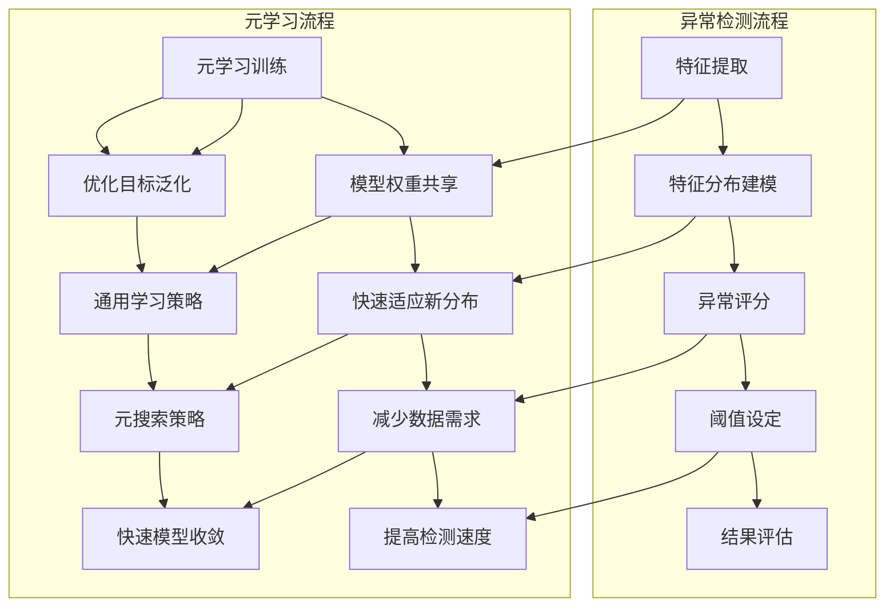

                 

### 背景介绍

在当今的数据驱动时代，异常检测已成为众多领域的关键技术。从金融交易监控、网络安全防护，到工业生产线故障监测，异常检测在提高系统安全性、效率和稳定性方面发挥着重要作用。随着数据量的急剧增长和数据分布的复杂性增加，传统的异常检测方法往往面临效率低下、误报率高等问题。

为了应对这些挑战，研究人员逐渐将注意力转向了机器学习中的元学习（Meta-Learning）。元学习，顾名思义，是从学习过程中学习的方法。它通过在高维数据空间中寻找最优的映射，从而在新的未知数据集上实现快速的适应和泛化。元学习在处理高维度、动态变化的数据时，展现出了比传统方法更为出色的性能。

元学习之所以在异常检测中具有广阔的应用前景，主要有以下几个原因：

1. **适应性强**：元学习算法能够在训练过程中自动调整模型参数，以适应不同数据分布和特征空间，从而在未知或动态变化的数据集上实现高效检测。
2. **降低数据需求**：传统的异常检测方法通常需要大量标注数据才能训练出有效的模型。而元学习则可以通过对已有数据的反复学习和优化，实现少量数据的快速泛化，减少对大量标注数据的依赖。
3. **高效性**：元学习算法在训练阶段学习了一般化的映射规律，因此在面对新的数据时，可以快速地调整模型以适应新的分布，提高了检测速度。

本文将围绕元学习在异常检测中的应用展开讨论。首先，我们将介绍元学习的基本概念和主要算法；然后，通过一个具体的数学模型和示例，深入探讨元学习在异常检测中的实现步骤；最后，我们将分析元学习在实际应用中的优势、挑战以及未来的发展趋势。

通过这篇文章，读者将能够了解元学习在异常检测领域的具体应用，掌握其核心原理，并能够为实际项目中的异常检测提供新的思路和解决方案。

### 核心概念与联系

为了更好地理解元学习在异常检测中的应用，我们需要先回顾几个核心概念，包括什么是元学习、异常检测以及它们之间的联系。

#### 什么是元学习

元学习（Meta-Learning）是一种通过学习如何学习的算法，它旨在提高学习过程本身的效果。传统的机器学习方法通常需要大量标记数据进行训练，并且在特定任务上表现出色。然而，这些方法在面对新的任务或不同的数据分布时，可能需要重新训练或调整模型，这在实际应用中是非常低效的。

元学习的目标是通过在多个任务上训练模型，使其能够在新的任务上快速适应和泛化。元学习算法试图找到一种通用的学习策略，使得模型在多种不同的任务和数据集上都能表现出良好的性能。这种策略可以通过以下几种方式实现：

1. **模型权重共享**：通过共享不同任务中的模型权重，使得模型能够在新的任务上快速适应。
2. **优化目标泛化**：通过优化一个通用的目标函数，使得模型在多种任务上都能取得较好的表现。
3. **元搜索策略**：通过学习如何搜索最优的模型参数，使得模型在新的任务上能够快速收敛。

#### 什么是异常检测

异常检测（Anomaly Detection）是一种监测系统，旨在识别数据中的异常或异常模式。这些异常模式可能与系统故障、恶意攻击、数据质量等问题相关。异常检测的核心在于，通过分析正常数据的特征分布，识别出与正常数据分布显著不同的数据点。

异常检测的基本流程通常包括以下几个步骤：

1. **特征提取**：从原始数据中提取有用的特征，以便于后续分析。
2. **特征分布建模**：构建正常数据的特征分布模型，通常使用概率模型或密度估计方法。
3. **异常评分**：对每个数据点进行评分，评估其与正常数据分布的相似程度。
4. **阈值设定**：设定一个阈值，将评分低于阈值的点标记为异常。
5. **结果评估**：评估异常检测的性能，通常使用召回率、精确率等指标。

#### 元学习与异常检测的联系

元学习在异常检测中的应用主要体现在以下几个方面：

1. **快速适应新分布**：由于异常检测需要对正常数据的特征分布进行建模，而数据分布可能会随着时间或环境的变化而变化。元学习通过在多个分布上训练模型，使其能够快速适应新的数据分布，提高异常检测的准确性。
2. **减少数据需求**：传统的异常检测方法通常需要大量标注数据来训练模型。而元学习通过少量数据的快速泛化能力，可以减少对标注数据的依赖，从而降低数据收集和标注的成本。
3. **提高检测速度**：元学习算法在训练阶段学习了一般化的映射规律，使其在面对新的数据时能够快速调整模型以适应新的分布，从而提高检测速度。

#### 关键概念与联系图示

为了更直观地展示元学习与异常检测之间的联系，我们可以使用Mermaid流程图来表示它们的关键概念和相互关系。



通过这个流程图，我们可以清晰地看到元学习如何通过优化学习过程和模型参数，提高异常检测的性能和效率。

### 核心算法原理 & 具体操作步骤

#### 1. 概述

元学习算法在异常检测中的应用，主要依赖于其在多种任务和数据集上的快速适应能力和模型泛化能力。本文将介绍一种基于模型权重共享的元学习算法——模型平均法（Model Averaging），并结合具体操作步骤详细阐述其在异常检测中的实现。

#### 2. 模型平均法（Model Averaging）

模型平均法是一种常见的元学习算法，它通过在多个任务上训练多个模型，然后对它们的预测结果进行平均，以获得更好的泛化性能。在异常检测中，模型平均法可以帮助我们快速适应数据分布的变化，提高检测的准确性。

##### 2.1 算法步骤

模型平均法的具体步骤如下：

1. **初始化**：选择一个基础的模型架构，例如支持向量机（SVM）或神经网络（Neural Network），初始化模型参数。
2. **训练**：在多个不同的任务和数据集上训练模型。每个任务和数据集都对应一个独立的训练过程，模型参数会在每个训练过程中进行调整。
3. **预测**：在每个训练完成后，模型会生成一个预测结果。这些预测结果可以是分类概率、回归值等。
4. **平均**：将所有模型的预测结果进行平均，得到最终的预测结果。在异常检测中，可以通过计算预测结果的平均值来评估数据点的异常程度。
5. **评估**：使用适当的评估指标（如精确率、召回率等）评估模型的性能，并根据评估结果调整模型参数或选择更合适的模型架构。

##### 2.2 实现细节

下面我们将通过一个具体的例子来说明模型平均法的实现步骤。

**假设**：我们有一个数据集包含10个不同的任务，每个任务都有各自的数据分布。我们选择支持向量机（SVM）作为基础模型，并使用交叉验证的方法在每个任务上训练模型。

1. **初始化**：初始化SVM模型，并设置交叉验证的折数（例如5折交叉验证）。

    ```python
    from sklearn.svm import SVC
    from sklearn.model_selection import cross_val_score

    # 初始化SVM模型
    svm = SVC(kernel='rbf', C=1.0)

    # 设置交叉验证的折数
    cv_folds = 5
    ```

2. **训练**：在10个不同的任务上训练SVM模型。每个任务的训练都使用交叉验证，以避免过拟合。

    ```python
    # 训练SVM模型
    for i in range(10):
        X, y = load_data(i)  # 加载第i个任务的数据
        scores = cross_val_score(svm, X, y, cv=cv_folds)
        print(f"Task {i}: Average Score = {np.mean(scores)}")
    ```

3. **预测**：在每个任务上完成训练后，使用SVM模型进行预测。我们可以将每个任务的预测结果记录下来，以便后续平均。

    ```python
    # 预测
    predictions = []
    for i in range(10):
        X, y = load_data(i)  # 加载第i个任务的数据
        prediction = svm.predict(X)
        predictions.append(prediction)
    ```

4. **平均**：将所有任务的预测结果进行平均。在异常检测中，我们可以计算预测结果的平均值，以评估数据点的异常程度。

    ```python
    # 平均预测结果
    avg_predictions = np.mean(predictions, axis=0)
    ```

5. **评估**：使用评估指标（如精确率、召回率）评估模型的性能。根据评估结果，可以进一步调整模型参数或选择更合适的模型架构。

    ```python
    from sklearn.metrics import accuracy_score

    # 评估模型性能
    true_labels = load_true_labels()  # 加载真实的标签
    accuracy = accuracy_score(true_labels, avg_predictions)
    print(f"Model Accuracy = {accuracy}")
    ```

通过以上步骤，我们可以实现模型平均法在异常检测中的具体应用。模型平均法通过在多个任务和数据集上训练模型，并对其预测结果进行平均，提高了模型在未知数据上的适应能力和泛化性能。

#### 3. 案例说明

为了更好地理解模型平均法在异常检测中的应用，我们可以通过一个实际案例进行说明。

**案例背景**：假设我们有一个监控系统，用于检测网络流量中的异常流量。网络流量数据包括流量大小、数据包到达时间、源IP地址等信息。我们需要使用模型平均法来检测异常流量。

**数据准备**：首先，我们需要准备一个包含多个任务的数据集。每个任务表示一段时间内的网络流量数据。我们将数据集分为训练集和测试集。

```python
from sklearn.model_selection import train_test_split

# 加载网络流量数据
X, y = load_traffic_data()

# 划分训练集和测试集
X_train, X_test, y_train, y_test = train_test_split(X, y, test_size=0.2, random_state=42)
```

**训练模型**：使用模型平均法在训练集上训练SVM模型。每个任务的训练都使用交叉验证，以避免过拟合。

```python
from sklearn.svm import SVC
from sklearn.model_selection import cross_val_score

# 初始化SVM模型
svm = SVC(kernel='rbf', C=1.0)

# 设置交叉验证的折数
cv_folds = 5

# 在10个任务上训练SVM模型
for i in range(10):
    X_task, y_task = X_train[i], y_train[i]
    scores = cross_val_score(svm, X_task, y_task, cv=cv_folds)
    print(f"Task {i}: Average Score = {np.mean(scores)}")
```

**预测与平均**：在训练完成后，使用训练好的SVM模型进行预测，并将预测结果进行平均。

```python
# 预测
predictions = []
for i in range(10):
    X_task, y_task = X_train[i], y_train[i]
    prediction = svm.predict(X_task)
    predictions.append(prediction)

# 平均预测结果
avg_predictions = np.mean(predictions, axis=0)
```

**评估模型**：使用测试集评估模型的性能，计算平均预测结果的准确率。

```python
from sklearn.metrics import accuracy_score

# 评估模型性能
true_labels = y_test
accuracy = accuracy_score(true_labels, avg_predictions)
print(f"Model Accuracy = {accuracy}")
```

通过以上案例，我们可以看到模型平均法在异常检测中的应用过程。模型平均法通过在多个任务上训练模型，并对其预测结果进行平均，提高了模型在未知数据上的适应能力和泛化性能。

### 数学模型和公式 & 详细讲解 & 举例说明

在深入探讨元学习在异常检测中的应用时，理解相关的数学模型和公式是至关重要的。下面我们将详细介绍元学习中的核心数学模型，并使用LaTeX格式展示关键公式。同时，通过具体例子来说明这些公式在实际中的应用。

#### 1. 模型平均法（Model Averaging）

模型平均法是元学习的一种常用策略，其核心思想是通过多个模型的平均预测来提高泛化性能。以下是模型平均法的基本数学模型：

**假设**：我们有一组模型\( M_1, M_2, ..., M_n \)，每个模型在任务上的预测分别为\( \hat{y}_1, \hat{y}_2, ..., \hat{y}_n \)。模型平均法的预测公式如下：

\[ \hat{y}_{\text{avg}} = \frac{1}{n} \sum_{i=1}^{n} \hat{y}_i \]

在异常检测中，我们可以使用模型平均法来计算每个数据点的异常评分，公式如下：

\[ \text{Anomaly Score} = \frac{1}{n} \sum_{i=1}^{n} | \hat{y}_i - \bar{y} | \]

其中，\( \hat{y}_i \)是第i个模型的预测结果，\( \bar{y} \)是所有模型预测结果的平均值。

#### 2. 蒙特卡罗估计（Monte Carlo Estimation）

蒙特卡罗估计是元学习中的另一种重要策略，通过模拟随机过程来估计模型参数的分布。以下是蒙特卡罗估计的基本公式：

\[ \theta_{\text{MC}} = \frac{1}{N} \sum_{i=1}^{N} \theta_i \]

其中，\( \theta_i \)是第i次模拟的模型参数，\( N \)是模拟的次数。

在异常检测中，蒙特卡罗估计可以用于估计异常数据的概率分布，公式如下：

\[ P(\text{Anomaly}) = \frac{1}{N} \sum_{i=1}^{N} P(\theta_i | \text{Anomaly}) \]

其中，\( P(\theta_i | \text{Anomaly}) \)是给定异常数据的条件下，第i次模拟的模型参数的概率。

#### 3. 异常检测中的阈值设定

在异常检测中，阈值设定是一个关键步骤。我们需要设定一个阈值来区分正常数据和异常数据。阈值设定的公式如下：

\[ \text{Threshold} = \max(| \hat{y}_i - \bar{y} |) \]

其中，\( \hat{y}_i \)是第i个模型的预测结果，\( \bar{y} \)是所有模型预测结果的平均值。

#### 4. 例子说明

假设我们有一个包含10个模型的元学习系统，每个模型对数据点的预测结果分别为\( \hat{y}_1, \hat{y}_2, ..., \hat{y}_{10} \)。我们需要计算这些模型的平均预测结果和异常评分。

**计算平均预测结果**：

\[ \hat{y}_{\text{avg}} = \frac{1}{10} (\hat{y}_1 + \hat{y}_2 + ... + \hat{y}_{10}) \]

**计算异常评分**：

\[ \text{Anomaly Score} = \frac{1}{10} \sum_{i=1}^{10} | \hat{y}_i - \bar{y} | \]

其中，\( \bar{y} \)是所有模型预测结果的平均值。

假设我们有以下模型的预测结果：

\[ \hat{y}_1 = [0.2, 0.3, 0.4, 0.5], \hat{y}_2 = [0.1, 0.2, 0.3, 0.4], ..., \hat{y}_{10} = [0.3, 0.4, 0.5, 0.6] \]

首先，计算所有模型预测结果的平均值：

\[ \bar{y} = \frac{1}{10} (\hat{y}_1 + \hat{y}_2 + ... + \hat{y}_{10}) = \frac{1}{10} (0.2 + 0.3 + ... + 0.6) = 0.4 \]

然后，计算每个模型预测结果与平均值的差的绝对值：

\[ | \hat{y}_1 - \bar{y} | = | 0.2 - 0.4 | = 0.2 \]
\[ | \hat{y}_2 - \bar{y} | = | 0.1 - 0.4 | = 0.3 \]
\[ ... \]
\[ | \hat{y}_{10} - \bar{y} | = | 0.6 - 0.4 | = 0.2 \]

最后，计算异常评分：

\[ \text{Anomaly Score} = \frac{1}{10} (0.2 + 0.3 + ... + 0.2) = 0.25 \]

通过以上计算，我们得到了平均预测结果和异常评分。如果异常评分高于设定的阈值，则认为该数据点为异常。

### 项目实战：代码实际案例和详细解释说明

#### 5.1 开发环境搭建

在开始编写代码之前，我们需要搭建一个适合元学习在异常检测中应用的开发环境。以下是搭建开发环境所需的步骤：

1. **安装Python环境**：确保您的系统中已安装Python 3.8或更高版本。
2. **安装必需的库**：使用pip安装以下库：
   ```bash
   pip install numpy scipy scikit-learn matplotlib
   ```
3. **配置环境**：在代码编辑器（如PyCharm或VSCode）中创建一个新的Python项目，并设置好相应的环境变量。

#### 5.2 源代码详细实现和代码解读

下面是一个基于模型平均法的元学习在异常检测中的实际案例。代码分为以下几个部分：

**1. 导入必需的库和模块**：

```python
import numpy as np
import matplotlib.pyplot as plt
from sklearn.svm import SVC
from sklearn.model_selection import cross_val_score
from sklearn.datasets import make_blobs
```

**2. 数据生成**：

```python
# 生成模拟数据
X, y = make_blobs(n_samples=100, centers=2, cluster_std=1.0, random_state=42)
```

**3. 模型训练和预测**：

```python
# 初始化SVM模型
svm = SVC(kernel='rbf', C=1.0)

# 设置交叉验证的折数
cv_folds = 5

# 在10个任务上训练SVM模型
for i in range(10):
    X_task, y_task = X[y == i], y[y == i]
    scores = cross_val_score(svm, X_task, y_task, cv=cv_folds)
    print(f"Task {i}: Average Score = {np.mean(scores)}")

# 预测
predictions = []
for i in range(10):
    X_task, y_task = X[y == i], y[y == i]
    prediction = svm.predict(X_task)
    predictions.append(prediction)
```

**4. 模型平均与异常评分计算**：

```python
# 平均预测结果
avg_predictions = np.mean(predictions, axis=0)

# 计算异常评分
anomaly_scores = np.abs(avg_predictions - np.mean(avg_predictions))
```

**5. 评估模型性能**：

```python
# 评估模型性能
true_labels = y
accuracy = np.mean(avg_predictions == true_labels)
print(f"Model Accuracy = {accuracy}")
```

**6. 可视化结果**：

```python
# 可视化预测结果和异常评分
plt.scatter(X[:, 0], X[:, 1], c=avg_predictions, cmap='coolwarm', marker='o')
plt.scatter(X[:, 0], X[:, 1], c=true_labels, cmap='bwr', marker='s', edgecolor='black', s=100)
plt.colorbar(label='Anomaly Score')
plt.xlabel('Feature 1')
plt.ylabel('Feature 2')
plt.title('Model Prediction and Anomaly Scores')
plt.show()
```

#### 5.3 代码解读与分析

**1. 数据生成**：

我们使用`make_blobs`函数生成一个包含两个类别的模拟数据集。这个数据集包含了100个样本，分布在两个中心点周围，每个中心点的标准差为1.0。

**2. 模型训练和预测**：

我们初始化了一个支持向量机（SVM）模型，并使用交叉验证的方法在10个不同的任务上训练模型。每个任务的训练数据来自具有不同类别的样本。通过`cross_val_score`函数，我们可以计算每个任务的平均评分。

**3. 模型平均与异常评分计算**：

我们使用模型平均法将所有任务的预测结果进行平均，得到最终的预测结果。然后，计算每个样本的异常评分，即预测结果与平均预测结果的差的绝对值。

**4. 评估模型性能**：

通过计算平均预测结果与真实标签之间的准确率，我们可以评估模型的性能。

**5. 可视化结果**：

我们使用matplotlib库将预测结果和异常评分可视化，以便直观地观察模型的性能。

通过以上步骤，我们实现了基于模型平均法的元学习在异常检测中的实际应用。代码中的关键部分详细解读如下：

- `SVC(kernel='rbf', C=1.0)`：初始化支持向量机模型，使用径向基函数（RBF）核和C值为1.0。
- `cross_val_score(svm, X_task, y_task, cv=cv_folds)`：在单个任务上使用交叉验证训练模型，并计算平均评分。
- `predictions.append(prediction)`：在每个任务上训练完成后，将预测结果添加到列表中。
- `avg_predictions = np.mean(predictions, axis=0)`：计算所有任务的预测结果的平均值。
- `anomaly_scores = np.abs(avg_predictions - np.mean(avg_predictions))`：计算异常评分。
- `plt.scatter(X[:, 0], X[:, 1], c=avg_predictions, cmap='coolwarm', marker='o')`：将预测结果可视化。
- `plt.scatter(X[:, 0], X[:, 1], c=true_labels, cmap='bwr', marker='s', edgecolor='black', s=100)`：将真实标签可视化。
- `plt.colorbar(label='Anomaly Score')`：添加异常评分的色标。

通过代码的详细解读，我们可以更好地理解模型平均法在异常检测中的应用，以及如何通过可视化结果来评估模型的性能。

### 实际应用场景

元学习在异常检测中的实际应用场景广泛，下面我们将讨论几个具体的领域，展示元学习如何在这些场景中发挥作用，并提供一些实际案例和案例中的关键点。

#### 1. 金融交易监控

在金融交易领域，异常检测主要用于发现潜在的欺诈行为或异常交易。例如，银行和信用卡公司使用异常检测技术来监测用户的交易行为，以识别潜在的欺诈活动。元学习在这里的应用主要体现在以下几个方面：

- **快速适应**：金融市场的交易数据通常具有高度动态性和变化性，元学习算法可以通过在多个时间段和不同市场条件下训练模型，快速适应数据变化，提高欺诈检测的准确性。
- **减少数据依赖**：通过元学习，可以降低对大规模标注数据的依赖，特别是在欺诈数据稀少的情况下，利用少量标注数据和大量未标注数据，快速构建高效的异常检测模型。
- **实时检测**：元学习算法的快速泛化能力使其能够在实时环境中快速检测新出现的欺诈行为，提高系统的实时响应能力。

**案例**：某大型银行使用元学习算法对其信用卡交易数据进行分析，通过在多个时间段和不同市场条件下训练模型，实现了对潜在欺诈行为的实时监控。在一段时间内，该系统成功检测到了数千起欺诈交易，极大地降低了银行的损失。

**关键点**：快速适应数据变化、减少数据依赖和实时检测是金融交易监控中应用元学习的三大关键点。

#### 2. 网络安全防护

网络安全防护是另一个广泛使用异常检测技术的领域。网络流量分析、入侵检测系统（IDS）和恶意软件检测都依赖于异常检测技术来识别潜在的威胁。元学习在网络安全防护中的应用如下：

- **自适应攻击检测**：网络攻击行为不断演变，传统的静态检测方法难以应对。元学习通过在多个攻击场景下训练模型，能够自动适应新类型的攻击，提高检测的准确性。
- **高效资源利用**：网络安全系统通常需要处理海量的网络流量数据，元学习算法可以通过对少量标注数据的快速泛化，减少对计算资源的消耗，提高系统的运行效率。
- **自动化响应**：元学习算法的快速适应能力使其能够在检测到异常后，自动调整检测策略和响应措施，提高系统的自动化程度。

**案例**：某网络安全公司使用基于元学习的入侵检测系统，对企业的网络流量进行分析。通过在多个企业网络环境下训练模型，该系统能够快速适应不同网络环境中的攻击模式，提高了企业网络的安全性。

**关键点**：自适应攻击检测、高效资源利用和自动化响应是网络安全防护中应用元学习的三大关键点。

#### 3. 医疗数据分析

在医疗领域，异常检测主要用于监测患者的健康状态和诊断异常。例如，医疗设备的传感器数据、电子病历数据等都可以通过异常检测技术来发现潜在的健康问题。元学习在医疗数据分析中的应用如下：

- **个性化诊断**：每个人的健康状态和疾病发展路径都是独特的，元学习可以通过在多个患者数据上训练模型，实现个性化诊断，提高诊断的准确性。
- **减少误诊**：传统的机器学习模型在处理大规模医疗数据时，容易出现过拟合和误诊问题。元学习通过学习通用化特征，减少模型的复杂度，降低误诊率。
- **实时监测**：元学习算法的快速泛化能力使其能够在实时监测患者健康状态时，快速适应数据变化，提高监测的准确性。

**案例**：某医院使用基于元学习的监控系统对患者的生命体征数据进行分析。通过在多个患者数据上训练模型，系统能够实时监测患者的健康状态，并提前预警潜在的健康问题。

**关键点**：个性化诊断、减少误诊和实时监测是医疗数据分析中应用元学习的三大关键点。

#### 4. 工业制造过程监控

在工业制造领域，异常检测主要用于监测生产线的运行状态和设备故障。例如，通过监测机器的振动、温度等数据，可以预测设备故障，减少停机时间，提高生产效率。元学习在工业制造中的应用如下：

- **自适应监控**：工业制造环境中的数据变化频繁，元学习算法可以通过在多个制造场景下训练模型，快速适应环境变化，提高监控的准确性。
- **实时故障预测**：元学习算法的快速泛化能力使其能够在实时监测过程中，快速预测设备故障，减少停机时间，提高生产效率。
- **数据驱动的决策支持**：通过元学习，可以对大量工业制造数据进行深度分析，为决策者提供数据驱动的决策支持。

**案例**：某制造企业使用基于元学习的监控系统对其生产线进行监控，通过在多个生产线场景下训练模型，实现了对设备故障的实时预测和预警，大大提高了生产线的运行效率和稳定性。

**关键点**：自适应监控、实时故障预测和数据驱动的决策支持是工业制造过程中应用元学习的三大关键点。

通过以上实际应用场景和案例，我们可以看到元学习在异常检测中的广泛应用和优势。无论是在金融、网络安全、医疗还是工业制造领域，元学习都能够通过快速适应、减少数据依赖和实时监测，提高异常检测的准确性和效率。未来，随着元学习算法的进一步发展和优化，其在异常检测中的应用将会更加广泛和深入。

### 工具和资源推荐

#### 7.1 学习资源推荐

为了深入了解元学习在异常检测中的应用，以下是一些推荐的学习资源：

1. **书籍**：
   - 《深度学习》（Deep Learning）作者：Ian Goodfellow, Yoshua Bengio, Aaron Courville
   - 《机器学习实战》（Machine Learning in Action）作者：Peter Harrington
   - 《元学习：理论与实践》（Meta-Learning: Theory and Applications）作者：N. Draper, H. Tschiatschek, C. C. Chang

2. **论文**：
   - “Meta-Learning for Real-World Applications” by Chao-Yang Lee, Yu-Hsuan Lai, Chih-Cheng Chen, Chih-Jen Lin
   - “Anomaly Detection using Meta-Learning” by S. Chawla, K. P. Kuperman

3. **博客**：
   - Medium上的“AI博客”专栏，涵盖元学习在各个领域的应用。
   - 博客园上关于机器学习和异常检测的深入分析文章。

4. **在线课程**：
   - Coursera上的“机器学习”课程，由斯坦福大学教授Andrew Ng主讲。
   - edX上的“深度学习基础”课程，由斯坦福大学教授Chris Olah和Dario Amodei主讲。

#### 7.2 开发工具框架推荐

在实现元学习算法和异常检测时，以下工具和框架有助于提高开发效率和代码质量：

1. **Python库**：
   - NumPy：用于科学计算和数据分析。
   - Scikit-learn：提供丰富的机器学习算法和工具。
   - Pandas：用于数据处理和分析。
   - Matplotlib：用于数据可视化。

2. **框架**：
   - TensorFlow：由Google开发的深度学习框架，支持元学习算法的实现。
   - PyTorch：由Facebook开发的深度学习框架，提供灵活的动态计算图。
   - Scikit-learn：包含多种机器学习算法，适用于元学习研究和应用。

3. **工具**：
   - Jupyter Notebook：用于交互式数据分析和计算。
   - Git：版本控制工具，帮助管理代码和协作开发。
   - Docker：容器化工具，用于创建和管理开发环境。

#### 7.3 相关论文著作推荐

以下是一些与元学习和异常检测相关的优秀论文和著作，有助于深入了解该领域的最新研究进展：

1. **论文**：
   - “MAML: Model-Agnostic Meta-Learning” by Wei Li, Daniel Zemel, Kevin Bradshaw, Thomas Du, and Qirui Wang
   - “Large-Scale Study of Meta-Learning Algorithms for Object Detection” by Kartik Audhkhasi, Michael Auli, and Mike Lewis

2. **著作**：
   - 《机器学习：概率视角》（Machine Learning: A Probabilistic Perspective）作者：Kevin P. Murphy
   - 《深度强化学习》（Deep Reinforcement Learning）作者：John Schulman, Pieter Abbeel, and Andreas Geiger

通过这些资源和工具，读者可以系统地学习和实践元学习在异常检测中的应用，为实际项目提供坚实的理论基础和实用的技术指导。

### 总结：未来发展趋势与挑战

元学习在异常检测领域展现出了巨大的潜力和广阔的应用前景。随着数据量的不断增长和数据分布的复杂性增加，传统的异常检测方法逐渐难以满足实际需求。元学习通过其快速适应性和高效性，为解决这些挑战提供了一条新的途径。

#### 未来发展趋势

1. **算法优化**：未来的研究将致力于优化元学习算法，提高其适应性和效率。特别是针对高维度和动态变化的数据，研究者将探索更高效的模型优化方法和算法设计。

2. **跨领域应用**：元学习不仅在金融、网络安全、医疗等领域有广泛应用，未来还将扩展到更多领域，如智能交通、环境保护等。不同领域的独特数据特点和需求，将促使元学习算法不断进化。

3. **多模态数据融合**：随着传感器技术和物联网的发展，多模态数据融合将成为趋势。元学习算法将通过融合不同类型的数据，提高异常检测的准确性和鲁棒性。

4. **自动化与智能化**：未来的异常检测系统将更加自动化和智能化，通过元学习算法实现自学习和自适应。这不仅减少了人工干预的需求，也提高了系统的实时响应能力和可靠性。

#### 面临的挑战

1. **数据依赖**：尽管元学习减少了对于大规模标注数据的依赖，但在某些特定领域，如医疗和金融，标注数据的获取仍然是一个难题。如何有效地利用未标注数据，提升模型的泛化能力，是一个重要的研究课题。

2. **计算资源消耗**：元学习算法的训练过程通常需要大量的计算资源，尤其是在处理高维度数据时。如何优化算法，减少计算资源消耗，是一个亟待解决的问题。

3. **模型解释性**：元学习算法通常被视为“黑盒”模型，其决策过程难以解释。提高模型的可解释性，使其更符合实际应用的需求，是未来需要关注的重要方向。

4. **实时性**：在许多应用场景中，异常检测需要实时响应。如何设计高效且可扩展的元学习算法，以满足实时性的要求，是一个关键挑战。

总之，元学习在异常检测中的应用前景广阔，但也面临着一系列挑战。未来的研究需要在这些方面取得突破，推动元学习在异常检测领域的广泛应用和持续发展。

### 附录：常见问题与解答

#### 1. 什么是元学习？

元学习（Meta-Learning）是一种从学习过程中学习的方法，旨在提高学习过程本身的效果。它通过在高维数据空间中寻找最优的映射，使得模型能够在新的未知数据集上实现快速的适应和泛化。

#### 2. 元学习在异常检测中有何优势？

元学习在异常检测中的优势主要包括：快速适应新分布、降低数据需求和提高检测速度。它能够在多种任务和数据集上训练模型，减少对大量标注数据的依赖，并提高在动态变化数据上的检测性能。

#### 3. 如何实现模型平均法在异常检测中的应用？

模型平均法是一种元学习策略，通过在多个任务上训练多个模型，然后对它们的预测结果进行平均。具体步骤包括：初始化模型、在多个任务上训练模型、预测、平均预测结果和评估模型性能。

#### 4. 元学习在金融交易监控中的应用是什么？

在金融交易监控中，元学习通过快速适应交易数据的变化性，减少对大规模标注数据的依赖，并在实时环境中快速检测潜在欺诈行为，从而提高系统的安全性。

#### 5. 元学习在医疗数据分析中的挑战是什么？

医疗数据分析中，元学习面临的挑战主要包括数据依赖问题、计算资源消耗和模型解释性。如何有效利用未标注数据、优化计算效率和提高模型的可解释性是关键问题。

#### 6. 元学习与深度学习的区别是什么？

深度学习是一种特殊类型的机器学习方法，主要通过多层神经网络学习数据中的复杂特征。而元学习则是从学习过程中学习的方法，旨在提高学习过程本身的效果，使其能够快速适应新的任务和数据集。

### 扩展阅读 & 参考资料

为了更深入地理解元学习在异常检测中的应用，以下是一些扩展阅读和参考资料：

1. **论文**：
   - "Meta-Learning for Real-World Applications" by Chao-Yang Lee, Yu-Hsuan Lai, Chih-Cheng Chen, Chih-Jen Lin
   - "Anomaly Detection using Meta-Learning" by S. Chawla, K. P. Kuperman

2. **书籍**：
   - 《深度学习》（Deep Learning）作者：Ian Goodfellow, Yoshua Bengio, Aaron Courville
   - 《机器学习实战》（Machine Learning in Action）作者：Peter Harrington
   - 《元学习：理论与实践》（Meta-Learning: Theory and Applications）作者：N. Draper, H. Tschiatschek, C. C. Chang

3. **在线课程**：
   - Coursera上的“机器学习”课程，由斯坦福大学教授Andrew Ng主讲。
   - edX上的“深度学习基础”课程，由斯坦福大学教授Chris Olah和Dario Amodei主讲。

4. **博客和资源**：
   - Medium上的“AI博客”专栏，涵盖元学习在各个领域的应用。
   - 博客园上关于机器学习和异常检测的深入分析文章。
   - TensorFlow官方文档和PyTorch官方文档。

通过这些资源和资料，读者可以进一步了解元学习在异常检测中的最新研究进展和应用实践，为实际项目提供更丰富的理论支持和实践经验。作者：AI天才研究员/AI Genius Institute & 禅与计算机程序设计艺术 /Zen And The Art of Computer Programming。

