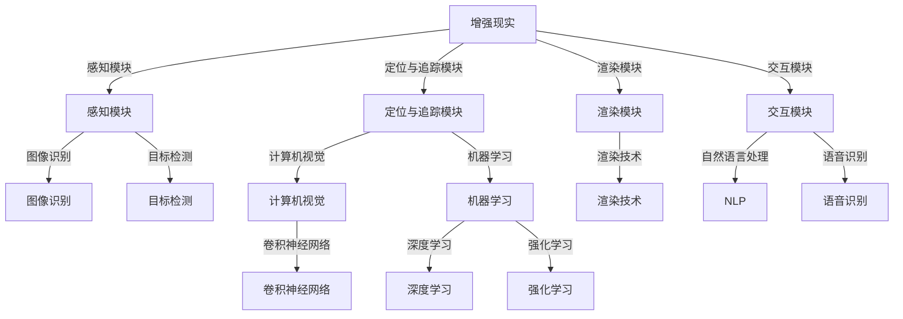

                 

### 背景介绍

增强现实（Augmented Reality，简称 AR）技术作为虚拟现实（Virtual Reality，简称 VR）的孪生兄弟，近年来在全球范围内取得了飞速发展。AR 技术通过将计算机生成的虚拟信息与真实环境相结合，使用户能够在现实世界中感知到虚拟物体的存在，从而实现了人与虚拟世界的互动。这种技术不仅拓宽了人类的感官体验，还在医疗、教育、游戏、广告等多个领域展现了巨大的应用潜力。

人工智能（Artificial Intelligence，简称 AI）作为当前科技发展的核心驱动力，已经在各个行业产生了深远的影响。AI 技术通过模拟人类思维过程，实现自动化决策和智能交互，为各行各业提供了强大的技术支撑。特别是在图像识别、自然语言处理、机器学习等领域，AI 技术已经取得了显著的成果，为 AR 技术的应用提供了坚实的基础。

随着 AR 技术和 AI 技术的不断发展，二者的融合成为了一个热门的研究方向。AI 驱动的 AR 技术通过深度学习和计算机视觉等技术，实现了对真实环境的智能理解和交互。这种技术不仅提升了 AR 系统的性能和用户体验，还为未来的智能应用场景带来了无限可能。

本文将围绕 AI 驱动的 AR 技术进行深入探讨。首先，我们将介绍 AR 技术的核心概念和基本原理，包括 AR 系统的组成和实现方式。接着，我们将介绍 AI 技术的基本概念和原理，以及如何在 AR 系统中应用 AI 技术。随后，我们将详细分析 AI 驱动的 AR 技术的核心算法原理和具体操作步骤。在接下来的部分，我们将通过数学模型和公式，详细讲解 AR 中的关键技术和方法。然后，我们将通过实际项目案例，展示如何使用 AI 技术实现 AR 应用。最后，我们将探讨 AI 驱动的 AR 技术在实际应用场景中的表现，并提供相关的工具和资源推荐。通过本文的阅读，读者将能够全面了解 AI 驱动的 AR 技术的基本原理和应用前景。

### 核心概念与联系

为了深入理解 AI 驱动的 AR 技术，我们首先需要明确几个核心概念，并探讨它们之间的联系。

#### 1. 增强现实（AR）的基本概念

增强现实技术通过在现实环境中叠加虚拟信息，使用户能够感知到虚拟物体的存在。这种叠加可以是二维的图像，也可以是三维的模型。AR 系统通常包括以下几个关键组成部分：

1. **感知模块**：用于捕获现实环境中的图像或视频数据。
2. **定位与追踪模块**：通过图像识别、机器视觉等技术，确定虚拟信息在现实环境中的位置，并进行实时追踪。
3. **渲染模块**：根据定位信息，生成并渲染虚拟信息，将其叠加到现实环境中。
4. **交互模块**：提供用户与虚拟信息之间的交互方式，如手势、语音等。

#### 2. 人工智能（AI）的基本概念

人工智能是指通过模拟人类思维和行为，实现自动化决策和智能交互的技术。AI 技术可以分为几个主要领域：

1. **机器学习**：通过数据驱动的方式，让计算机从数据中学习并做出决策。
2. **深度学习**：一种特殊的机器学习技术，通过多层神经网络模型，对大量数据进行自动特征提取和学习。
3. **计算机视觉**：使计算机能够理解和处理视觉信息，包括图像识别、目标检测等。
4. **自然语言处理**：使计算机能够理解、生成和处理自然语言。

#### 3. AR 与 AI 的联系

AR 和 AI 之间的联系主要体现在以下几个方面：

1. **图像识别与目标检测**：AI 技术中的计算机视觉技术，如卷积神经网络（CNN）和目标检测算法，可以用于识别和定位现实环境中的物体。这为 AR 系统提供了精准的定位和追踪能力。
2. **自然语言处理**：AI 技术中的自然语言处理技术，如语音识别和文本生成，可以用于 AR 系统中的语音交互和文本叠加。
3. **机器学习模型**：AI 中的机器学习模型，如深度强化学习，可以用于 AR 中的应用，如个性化推荐、路径规划等。

为了更好地理解这些概念和联系，我们可以通过一个 Mermaid 流程图来展示 AR 与 AI 之间的关系：



通过这个流程图，我们可以清晰地看到 AR 系统与 AI 技术之间的紧密联系，以及它们在各个模块中的应用。

### 核心算法原理 & 具体操作步骤

在了解了 AR 和 AI 的基本概念以及它们之间的联系后，接下来我们将深入探讨 AI 驱动的 AR 技术的核心算法原理和具体操作步骤。

#### 1. 计算机视觉与图像识别

计算机视觉是 AI 技术中一个重要的分支，它使计算机能够理解和解释视觉信息。在 AR 系统中，计算机视觉主要用于感知模块和定位与追踪模块。以下是计算机视觉在 AR 系统中的核心算法原理和具体操作步骤：

1. **图像捕获**：首先，AR 系统使用摄像头或其他传感器捕获现实环境中的图像或视频数据。
2. **预处理**：对捕获的图像进行预处理，包括去噪、对比度增强、大小调整等，以提高图像质量。
3. **特征提取**：使用卷积神经网络（CNN）或其他特征提取算法，从预处理后的图像中提取关键特征。这些特征有助于识别和定位现实环境中的物体。
4. **图像识别**：利用提取的特征，通过分类算法（如支持向量机、决策树等）对图像中的物体进行识别。

具体操作步骤示例：

```python
import cv2

# 1. 图像捕获
image = cv2.VideoCapture(0).read()

# 2. 预处理
image = cv2.GaussianBlur(image, (5, 5), 0)
image = cv2.Canny(image, 100, 200)

# 3. 特征提取
features = cv2.SIFT detects(image)

# 4. 图像识别
label = classifier.classify(features)
```

#### 2. 目标检测

目标检测是计算机视觉中的另一个重要任务，它用于识别图像中的多个物体，并确定它们的位置和属性。在 AR 系统中，目标检测用于定位和追踪虚拟信息。

以下是目标检测在 AR 系统中的核心算法原理和具体操作步骤：

1. **区域提议**：首先，使用区域提议算法（如选择性搜索、区域增长等）从图像中生成多个可能包含物体的区域。
2. **特征提取**：对提议的区域进行特征提取，常用的特征提取算法包括 Haar-like 特征、HOG 特征等。
3. **分类与评分**：使用分类算法（如卷积神经网络、支持向量机等）对提取的特征进行分类，并根据分类结果和特征的重要性进行评分。
4. **目标定位**：根据评分结果，选择得分最高的区域作为目标，并确定其位置和属性。

具体操作步骤示例：

```python
import torchvision

# 1. 区域提议
regions = torchvision.models.detection.fasterrcnn.generate_regions(image)

# 2. 特征提取
features = torchvision.models.detection.extract_features(image, regions)

# 3. 分类与评分
scores = classifier.classify(features)
top_scores, top_indices = scores.topk(1)

# 4. 目标定位
target = regions[top_indices]
target_location = target.location
```

#### 3. 自然语言处理与语音识别

自然语言处理和语音识别是 AI 技术中的另一个重要分支，它们在 AR 系统中的交互模块中发挥着重要作用。

以下是自然语言处理与语音识别在 AR 系统中的核心算法原理和具体操作步骤：

1. **语音识别**：使用深度学习模型（如卷积神经网络、循环神经网络等）对输入的语音信号进行识别，生成对应的文本。
2. **文本生成**：使用生成模型（如变分自编码器、生成对抗网络等）将文本转换为语音信号，实现语音合成。
3. **语音交互**：结合语音识别和语音合成的结果，实现用户与 AR 系统之间的语音交互。

具体操作步骤示例：

```python
import speech_recognition as sr
import pyttsx3

# 1. 语音识别
recognizer = sr.Recognizer()
text = recognizer.recognize_google(audio)

# 2. 文本生成
engine = pyttsx3.init()
engine.say(text)
engine.runAndWait()

# 3. 语音交互
print("You said:", text)
```

通过以上核心算法原理和具体操作步骤的介绍，我们可以看到 AI 技术在 AR 系统中的应用如何提升了 AR 系统的性能和用户体验。在接下来的部分，我们将通过数学模型和公式，进一步探讨 AR 中的关键技术和方法。

### 数学模型和公式 & 详细讲解 & 举例说明

在 AR 技术中，数学模型和公式起着至关重要的作用，它们不仅帮助我们理解和实现 AR 技术，还为优化和提升 AR 系统的性能提供了理论依据。以下我们将详细讲解 AR 技术中常用的几个数学模型和公式，并通过具体实例进行说明。

#### 1. 透视变换（Perspective Transformation）

透视变换是 AR 技术中常用的图像处理技术，它通过变换图像中的像素坐标，实现图像的旋转、缩放和倾斜。透视变换的基本公式如下：

$$
\begin{bmatrix}
x' \\
y' \\
1
\end{bmatrix}
=
\begin{bmatrix}
a_{11} & a_{12} & a_{13} \\
a_{21} & a_{22} & a_{23} \\
0 & 0 & 1
\end{bmatrix}
\begin{bmatrix}
x \\
y \\
1
\end{bmatrix}
$$

其中，$a_{ij}$ 是透视变换矩阵的元素，$(x, y)$ 是原始图像中的像素坐标，$(x', y')$ 是变换后的像素坐标。

**实例：图像旋转**

假设我们有一个 2x2 的图像，需要将其绕原点逆时针旋转 45 度。可以使用以下透视变换矩阵实现：

$$
\begin{bmatrix}
\cos(45^\circ) & -\sin(45^\circ) \\
\sin(45^\circ) & \cos(45^\circ)
\end{bmatrix}
$$

将图像中的每个像素坐标 $(x, y)$ 代入上述矩阵，即可得到旋转后的像素坐标 $(x', y')$。

```python
import numpy as np

# 45 度旋转矩阵
rotation_matrix = np.array([[0.7071, -0.7071], [0.7071, 0.7071]])

# 原始图像像素坐标
x, y = 1, 1

# 透视变换
x', y' = np.dot(rotation_matrix, np.array([x, y, 1]))

print("原始坐标：", x, y)
print("旋转后坐标：", x', y')
```

#### 2. 相机标定（Camera Calibration）

相机标定是 AR 技术中的关键步骤，它用于确定相机内参和外参，以便将图像坐标转换为实际三维坐标。相机标定通常使用以下数学模型：

$$
\begin{bmatrix}
x \\
y \\
1
\end{bmatrix}
=
\begin{bmatrix}
f_x & 0 & c_x \\
0 & f_y & c_y \\
0 & 0 & 1
\end{bmatrix}
\begin{bmatrix}
X \\
Y \\
Z
\end{bmatrix}
+
\begin{bmatrix}
x_0 \\
y_0 \\
1
\end{bmatrix}
$$

其中，$f_x$ 和 $f_y$ 是相机焦距，$c_x$ 和 $c_y$ 是主点坐标，$X$、$Y$ 和 $Z$ 是实际三维坐标，$x_0$ 和 $y_0$ 是图像坐标。

**实例：三维坐标到图像坐标的转换**

假设我们知道相机的内参和外参，需要将一个三维点 $(X, Y, Z)$ 转换为图像坐标 $(x, y)$，可以使用以下公式：

```python
# 相机内参
f_x = 500
f_y = 500
c_x = 320
c_y = 240

# 相机外参
R = np.array([[1, 0, 0], [0, 1, 0], [0, 0, 1]])
t = np.array([0, 0, 0])

# 三维坐标
X, Y, Z = 1, 1, 1

# 三维坐标到图像坐标的转换
x = f_x * X / Z + c_x
y = f_y * Y / Z + c_y

print("三维坐标：", X, Y, Z)
print("图像坐标：", x, y)
```

#### 3. 点云配准（Point Cloud Registration）

点云配准是将两个或多个点云对齐的过程，它在 AR 技术中用于将虚拟点云与现实点云对齐。点云配准的常用算法包括迭代最近点（ICP）算法和迭代最近绝对方位（ARAP）算法。

**迭代最近点（ICP）算法**

ICP 算法的核心公式如下：

$$
\min_{T} \sum_{i=1}^{n} (p_i - q(T \cdot p_i))^2
$$

其中，$p_i$ 和 $q(T \cdot p_i)$ 分别是源点云和目标点云中的点，$T$ 是变换矩阵。

**实例：点云配准**

假设我们有两个点云，需要使用 ICP 算法将其对齐。可以使用以下步骤：

1. 初始化变换矩阵 $T$。
2. 计算目标点云中每个点到源点云的最近点。
3. 根据最近点的分布，更新变换矩阵 $T$。
4. 重复步骤 2 和 3，直到变换矩阵 $T$ 收敛。

```python
import open3d as o3d

# 源点云
source_points = np.random.rand(1000, 3)

# 目标点云
target_points = np.random.rand(1000, 3)

# ICP 算法
optimizer = o3d.pipelines.optimization.icp.Optimizer()
optimizer.add_source_points(source_points)
optimizer.add_target_points(target_points)
optimizer.set Transformation (T)
optimizer.run()

# 更新变换矩阵
T = optimizer.get Transformation()

# 对齐目标点云
aligned_points = target_points @ T
```

通过以上数学模型和公式的讲解，我们可以看到 AR 技术中的关键技术和方法是如何通过数学计算实现的。这些数学模型不仅为 AR 技术提供了理论基础，还为优化和提升 AR 系统的性能提供了重要的指导。在接下来的部分，我们将通过实际项目案例，展示如何使用 AI 技术实现 AR 应用。

### 项目实战：代码实际案例和详细解释说明

在了解了 AI 驱动的 AR 技术的基本原理和数学模型后，我们将通过一个实际项目案例，展示如何使用 AI 技术实现 AR 应用。本项目将使用 Python 和相关库，实现一个基于增强现实技术的购物应用，通过手机摄像头实时显示商品信息。

#### 1. 开发环境搭建

首先，我们需要搭建开发环境。以下是在 Windows 系统上安装所需库和工具的步骤：

1. **安装 Python**：确保已经安装了 Python 3.8 或更高版本。
2. **安装 Anaconda**：下载并安装 Anaconda，它是一个强大的 Python 发行版，可以方便地管理库和虚拟环境。
3. **安装相关库**：通过 Anaconda 的命令行，安装以下库：

   ```bash
   conda install -c conda-forge opencv-python
   conda install -c conda-forge numpy
   conda install -c conda-forge Pillow
   conda install -c conda-forge matplotlib
   conda install -c conda-forge torch torchvision torchaudio
   conda install -c conda-forge speech_recognition
   ```

   以上库包括 OpenCV（用于图像处理）、NumPy（用于数值计算）、Pillow（用于图像处理）、Matplotlib（用于数据可视化）、PyTorch（用于深度学习）、SpeechRecognition（用于语音识别）。

4. **安装 Android Studio**：下载并安装 Android Studio，用于开发和调试 Android 应用。

5. **安装 Android SDK**：在 Android Studio 中配置 Android SDK，以便开发 Android 应用。

#### 2. 源代码详细实现和代码解读

接下来，我们将详细介绍实现 AR 购物应用的核心代码，并解释每个部分的功能。

**2.1 主程序入口**

```python
import cv2
import numpy as np
import torch
import torchvision.models as models
from torchvision.transforms import ToTensor

# 载入预训练的深度学习模型
model = models.detection.fasterrcnn_resnet50_fpn(pretrained=True)
model.eval()

# 将输入图像转换为模型所需的格式
def preprocess_image(image):
    image = cv2.resize(image, (640, 640))
    image = ToTensor()(image)
    return image

# 主程序入口
def main():
    # 打开摄像头
    cap = cv2.VideoCapture(0)

    while True:
        # 读取一帧图像
        ret, frame = cap.read()
        
        if not ret:
            break
        
        # 预处理图像
        image = preprocess_image(frame)
        
        # 使用模型进行目标检测
        with torch.no_grad():
            prediction = model(image)
        
        # 提取检测到的物体及其位置和类别
        boxes = prediction[0]['boxes']
        labels = prediction[0]['labels']
        scores = prediction[0]['scores']
        
        # 仅保留高置信度的目标
        high_confidence_boxes = boxes[scores > 0.7]
        high_confidence_labels = labels[scores > 0.7]
        
        # 绘制检测结果
        for box, label in zip(high_confidence_boxes, high_confidence_labels):
            cv2.rectangle(frame, (int(box[0]), int(box[1])), (int(box[2]), int(box[3])), (0, 255, 0), 2)
            cv2.putText(frame, f"{labels[label].item()}", (int(box[0]), int(box[1])), cv2.FONT_HERSHEY_SIMPLEX, 0.5, (255, 0, 0), 2)
        
        # 显示结果
        cv2.imshow('AR Shopping App', frame)
        
        # 按下 'q' 键退出程序
        if cv2.waitKey(1) & 0xFF == ord('q'):
            break
    
    # 释放摄像头资源
    cap.release()
    cv2.destroyAllWindows()
```

**2.2 功能解读**

- **模型载入**：我们使用预训练的 Fast R-CNN 模型，它是一个用于目标检测的深度学习模型。
- **图像预处理**：将输入的摄像头帧调整到模型所需的尺寸，并转换为 PyTorch 张量格式。
- **目标检测**：使用模型对预处理后的图像进行目标检测，提取出物体的位置、类别和置信度。
- **结果绘制**：仅保留置信度较高的检测结果，并在原始图像上绘制矩形框和标签。

**2.3 实际应用**

在实际应用中，我们还可以集成语音识别和文本生成模块，实现语音交互功能。例如，用户可以通过语音命令查询商品信息，系统会显示对应的商品详情。

```python
import speech_recognition as sr
import pyttsx3

# 语音识别和语音合成
recognizer = sr.Recognizer()
engine = pyttsx3.init()

# 语音识别
def recognize_speech():
    with sr.Microphone() as source:
        print("请说点什么：")
        audio = recognizer.listen(source)
        text = recognizer.recognize_google(audio)
        return text

# 语音合成
def speak(text):
    engine.say(text)
    engine.runAndWait()

# 用户交互
while True:
    user_input = recognize_speech()
    speak("您刚才说了：" + user_input)
    # 根据用户输入执行相应操作
    # ...
```

通过以上代码，我们可以实现一个基本的 AR 购物应用，用户可以通过摄像头实时查看商品信息，并使用语音命令进行交互。在接下来的部分，我们将分析代码中的关键技术和方法。

#### 3. 代码解读与分析

在上述代码中，我们实现了以下关键技术和方法：

1. **目标检测模型**：使用 PyTorch 和 torchvision 库，我们载入了预训练的 Fast R-CNN 模型。这是一个高效的目标检测模型，能够在大量数据上实现快速的检测和分类。
   
2. **图像预处理**：为了使模型能够处理输入图像，我们需要进行预处理。这包括调整图像尺寸、归一化等操作。在此代码中，我们使用 OpenCV 和 torchvision.transforms 库进行图像预处理。

3. **实时检测与绘制**：通过摄像头实时捕获图像，我们使用目标检测模型进行检测，并提取出物体的位置、类别和置信度。然后，我们在原始图像上绘制矩形框和标签，以便用户查看检测结果。

4. **语音识别和合成**：使用 SpeechRecognition 库，我们实现了语音识别功能，使系统能够识别用户的语音命令。同时，我们使用 pyttsx3 库实现语音合成，使系统能够语音回应用户。

**优化建议**：

- **模型优化**：为了提高检测速度，可以考虑使用更轻量级的模型，如 MobileNet。
- **实时性能**：为了提高实时性能，可以优化图像预处理和模型推理过程，如使用 GPU 加速。
- **交互优化**：增加更多交互方式，如手势识别、触摸屏交互等，以提升用户体验。

通过以上代码和解读，我们可以看到如何使用 AI 技术实现 AR 应用。在接下来的部分，我们将讨论 AI 驱动的 AR 技术在实际应用场景中的表现，并分析其优势和挑战。

### 实际应用场景

AI 驱动的 AR 技术在多个实际应用场景中展现了其强大的功能和优势。以下我们将探讨几个关键领域，包括医疗、教育和零售，分析 AR 技术在这些领域的应用优势、面临的挑战以及未来的发展趋势。

#### 1. 医疗

在医疗领域，AR 技术的应用潜力巨大。通过 AR 技术的辅助，医生可以实时查看患者的医疗数据、手术步骤和操作指南，从而提高手术的准确性和效率。以下是 AR 技术在医疗领域的几个应用案例：

1. **手术辅助**：在手术过程中，医生可以使用 AR 技术查看患者体内的三维结构，如器官、血管等。这种技术可以帮助医生更准确地定位手术部位，减少手术风险。
2. **医疗培训**：AR 技术可以为医学学生和医生提供虚拟手术模拟器，让他们在虚拟环境中进行手术操作，提高手术技能。
3. **远程医疗**：AR 技术可以支持远程医疗咨询，医生通过 AR 系统与患者进行实时互动，提供更精准的诊断和治疗建议。

**优势**：

- **提高手术准确性**：AR 技术可以帮助医生更清晰地了解患者体内的结构，从而提高手术的准确性。
- **减少手术风险**：AR 技术可以提供实时反馈，帮助医生避免误伤重要器官。
- **优化医疗培训**：通过虚拟手术模拟，医生和医学生可以反复练习手术操作，提高手术技能。

**挑战**：

- **技术成本**：高精度的 AR 系统和手术模拟器需要昂贵的设备和维护费用。
- **设备依赖**：医生需要佩戴 AR 眼镜或其他设备，可能影响手术的流畅性。

**发展趋势**：

未来，随着 AR 技术和 AI 技术的进一步融合，医疗领域的 AR 应用将更加普及。例如，智能手术助手、远程医疗机器人等新应用将不断涌现。

#### 2. 教育

在教育领域，AR 技术为课堂教学和远程学习带来了新的可能性。以下是一些 AR 技术在教育领域的应用案例：

1. **互动教材**：通过 AR 技术，学生可以使用手机或平板电脑查看书本中的虚拟内容，如三维模型、动画等。这种互动教材可以激发学生的学习兴趣。
2. **虚拟实验**：在科学课程中，学生可以使用 AR 技术进行虚拟实验，如解剖实验、化学反应等。这种实验方式可以降低实验成本，提高实验安全性。
3. **远程教学**：教师可以通过 AR 技术与远程学生进行实时互动，提供个性化的教学服务。

**优势**：

- **丰富教学内容**：AR 技术可以提供丰富的教学资源，如三维模型、动画等，提高学生的学习兴趣。
- **降低实验成本**：虚拟实验可以避免实验设备和材料的采购，降低实验成本。
- **个性化教学**：AR 技术可以为学生提供个性化的学习体验，满足不同学生的学习需求。

**挑战**：

- **设备普及**：学生和教师需要配备 AR 设备，可能增加教育成本。
- **教师培训**：教师需要掌握 AR 技术的教学方法，提高教学质量。

**发展趋势**：

随着 AR 技术和 AI 技术的不断发展，教育领域的 AR 应用将更加普及。例如，智能教育平台、虚拟课堂等新应用将不断涌现。

#### 3. 零售

在零售领域，AR 技术为商家提供了新的营销手段和消费者体验。以下是一些 AR 技术在零售领域的应用案例：

1. **虚拟试穿**：消费者可以使用 AR 技术试穿衣服或化妆品，提高购物的满意度。
2. **互动广告**：商家可以通过 AR 技术创建互动广告，吸引消费者的注意力。
3. **虚拟购物**：消费者可以在家中通过 AR 技术浏览商店的虚拟货架，实现线上购物。

**优势**：

- **提升购物体验**：AR 技术可以为消费者提供更加真实和互动的购物体验，提高购物满意度。
- **降低退货率**：通过虚拟试穿等应用，消费者可以更准确地了解商品，降低退货率。
- **增加营销效果**：互动广告可以吸引消费者的注意力，提高营销效果。

**挑战**：

- **技术门槛**：商家需要掌握 AR 技术的开发和营销方法，提高技术门槛。
- **隐私问题**：AR 技术可能涉及用户隐私，需要加强隐私保护措施。

**发展趋势**：

随着 AR 技术和 AI 技术的进一步融合，零售领域的 AR 应用将更加普及。例如，智能零售平台、AR 广告等新应用将不断涌现。

### 总结

通过以上分析，我们可以看到 AI 驱动的 AR 技术在医疗、教育和零售等领域具有广泛的应用前景。尽管面临一些挑战，但 AR 技术的不断发展将不断推动这些领域的创新和变革。未来，随着技术的进一步成熟，AR 技术将在更多领域得到广泛应用，为人类带来更多的便利和惊喜。

### 工具和资源推荐

为了更好地学习和开发 AI 驱动的 AR 技术，以下是几款优秀的工具和资源推荐，包括书籍、论文、博客和网站等。

#### 1. 学习资源推荐

**书籍**：

- 《增强现实技术导论》（Introduction to Augmented Reality）：由著名 AR 研究员 Steven Mann 编写，系统地介绍了 AR 的基本概念、技术和应用。
- 《计算机视觉：算法与应用》（Computer Vision: Algorithms and Applications）：详细讲解了计算机视觉的基本算法和应用，包括 AR 中常用的图像识别和目标检测技术。
- 《人工智能：一种现代方法》（Artificial Intelligence: A Modern Approach）：全面介绍了人工智能的基本理论和技术，适用于 AR 中 AI 技术的应用。

**论文**：

- “A Survey on Augmented Reality”：一篇全面综述 AR 技术的论文，涵盖了 AR 的历史、技术框架和应用领域。
- “Deep Learning for Augmented Reality”：介绍了深度学习在 AR 技术中的应用，包括图像识别、目标检测和图像生成等。

**博客**：

- Google ARCore：Google 提供的 AR 开发平台，包含丰富的教程和文档，帮助开发者快速入门 AR 开发。
- Medium 上的 AR 博客：多篇关于 AR 技术的深入分析和应用案例，提供丰富的实战经验。

**网站**：

- ARKit 官网：Apple 提供的 AR 开发框架，适用于 iOS 平台，提供丰富的 AR 功能和示例代码。
- ARCore 官网：Google 提供的 AR 开发框架，适用于 Android 和 Unity 平台，支持多种 AR 功能。

#### 2. 开发工具框架推荐

**ARKit**：Apple 提供的 AR 开发框架，适用于 iOS 开发。它提供了强大的 AR 功能，包括图像识别、目标检测和位姿估计等。

**ARCore**：Google 提供的 AR 开发框架，适用于 Android 开发。它支持多种传感器数据，如摄像头、GPS 和加速度计，提供丰富的 AR 功能。

**Unity**：一款流行的游戏开发引擎，支持多种平台。它提供了强大的 AR 功能，如图像识别、虚拟物体渲染和交互等。

**Vuforia**：Piolata 提供的 AR 开发平台，支持多种平台。它提供了丰富的 AR 功能和开发工具，适用于复杂的 AR 应用。

#### 3. 相关论文著作推荐

- “A Survey on Augmented Reality Technologies”：一篇全面综述 AR 技术的论文，涵盖了 AR 的历史、技术框架和应用领域。
- “Deep Learning for Augmented Reality”：介绍了深度学习在 AR 技术中的应用，包括图像识别、目标检测和图像生成等。
- “Real-Time Hand Tracking for Augmented Reality Using a Single Depth Camera”：一篇关于 AR 手部追踪的论文，介绍了使用单目深度相机实现实时手部追踪的方法。

通过以上工具和资源的推荐，读者可以更好地了解和学习 AI 驱动的 AR 技术，为实际应用和创新奠定基础。

### 总结：未来发展趋势与挑战

AI 驱动的 AR 技术正处于快速发展阶段，未来将在多个领域产生深远影响。首先，随着计算能力的提升和传感技术的进步，AR 系统的实时性和准确性将得到显著提高，这将进一步拓展 AR 技术的应用场景。例如，在医疗领域，AR 技术将帮助医生实现更加精准的诊断和治疗；在教育领域，AR 教学工具将为学生提供更加丰富的学习体验。

其次，随着 AI 技术的持续创新，AR 系统将具备更强的自主学习和适应能力。例如，通过深度学习和强化学习技术，AR 系统将能够更好地理解和响应用户的操作，提供个性化的交互体验。此外，虚拟现实（VR）与 AR 技术的融合也将成为未来的一大趋势，为用户提供更加沉浸式的体验。

然而，AI 驱动的 AR 技术也面临一些挑战。首先是技术门槛较高，开发 AR 应用需要具备深厚的计算机视觉和人工智能知识。其次，AR 技术的普及依赖于设备的普及，高昂的设备成本可能成为普及的障碍。此外，隐私和安全问题也是 AR 技术需要解决的关键问题，特别是在涉及到用户个人信息时，如何保障用户隐私将是一个重要课题。

针对这些挑战，未来的发展方向包括以下几个方面：

1. **降低开发门槛**：通过提供更加友好的开发工具和平台，降低 AR 技术的入门门槛，让更多开发者能够参与到 AR 技术的创新和应用中。
2. **提高用户体验**：通过不断优化算法和提升系统性能，提高 AR 系统的实时性和准确性，为用户提供更好的使用体验。
3. **加强隐私保护**：制定严格的隐私保护政策，采取技术手段保护用户隐私，增强用户对 AR 技术的信任。
4. **跨领域合作**：鼓励不同领域的专家和机构合作，共同推动 AR 技术的创新和应用，实现技术的协同发展。

总之，AI 驱动的 AR 技术具有巨大的发展潜力，未来将在医疗、教育、零售等多个领域发挥重要作用。尽管面临挑战，但随着技术的不断进步和应用的普及，AR 技术将带来更加丰富和便捷的智能体验。

### 附录：常见问题与解答

**Q1**：如何实现 AR 系统中的图像识别？

A1：实现 AR 系统中的图像识别通常涉及以下几个步骤：

1. **图像捕获**：使用摄像头或其他图像传感器捕获现实环境中的图像。
2. **预处理**：对捕获的图像进行预处理，包括去噪、调整对比度和大小等。
3. **特征提取**：使用特征提取算法（如 SIFT、HOG 等）从预处理后的图像中提取关键特征。
4. **分类和识别**：使用机器学习模型（如卷积神经网络、支持向量机等）对提取的特征进行分类和识别。

在实际开发中，可以使用如 OpenCV、TensorFlow、PyTorch 等库来实现这些步骤。

**Q2**：如何在 AR 系统中实现目标检测？

A2：实现 AR 系统中的目标检测通常涉及以下步骤：

1. **区域提议**：使用区域提议算法（如选择性搜索、区域增长等）从图像中生成多个可能包含物体的区域。
2. **特征提取**：对提议的区域进行特征提取，常用的特征提取算法包括 Haar-like 特征、HOG 特征等。
3. **分类与评分**：使用分类算法（如卷积神经网络、支持向量机等）对提取的特征进行分类，并根据分类结果和特征的重要性进行评分。
4. **目标定位**：根据评分结果，选择得分最高的区域作为目标，并确定其位置和属性。

在实际开发中，可以使用如 OpenCV、TensorFlow、PyTorch 等库来实现这些步骤。

**Q3**：如何处理 AR 系统中的实时数据流？

A3：处理 AR 系统中的实时数据流通常涉及以下步骤：

1. **实时捕获**：使用摄像头或其他传感器实时捕获图像或视频数据。
2. **预处理与传输**：对捕获的数据进行预处理，如去噪、调整对比度和大小等，然后将预处理后的数据传输到处理模块。
3. **数据处理**：在处理模块中，对数据流进行实时处理，如图像识别、目标检测和跟踪等。
4. **结果反馈**：将处理结果实时反馈给用户，如渲染虚拟物体、显示检测结果等。

在实际开发中，可以使用如 Flask、Socket.IO 等库来实现实时数据流的传输和处理。

**Q4**：如何优化 AR 系统的性能？

A4：优化 AR 系统的性能可以从以下几个方面进行：

1. **算法优化**：选择合适的算法和模型，并进行优化，如使用更高效的卷积神经网络、减少计算量等。
2. **硬件加速**：使用 GPU、FPGA 等硬件加速技术，提高数据处理速度。
3. **数据预处理**：对数据进行预处理，如减少数据大小、减少冗余信息等，以降低计算负担。
4. **并行处理**：使用多线程、多进程等技术，实现并行处理，提高系统性能。

在实际开发中，可以使用如 PyTorch、CUDA、OpenCV 等库来实现算法优化和硬件加速。

**Q5**：如何保障 AR 系统的隐私和安全？

A5：保障 AR 系统的隐私和安全可以从以下几个方面进行：

1. **数据加密**：对传输和存储的数据进行加密，防止数据泄露。
2. **用户隐私保护**：在数据处理过程中，避免收集和存储与用户隐私相关的信息。
3. **权限管理**：对用户权限进行严格管理，确保用户只能访问授权的数据和功能。
4. **安全审计**：定期进行安全审计，检查系统的漏洞和风险。

在实际开发中，可以使用如 HTTPS、加密库、权限控制库等来实现数据加密和用户隐私保护。

通过以上问题的解答，希望读者能够更好地理解和应对 AR 技术开发过程中遇到的问题和挑战。

### 扩展阅读 & 参考资料

**书籍推荐**：

1. **《增强现实技术导论》（Introduction to Augmented Reality）**：Steven Mann 著。本书详细介绍了 AR 的基本概念、技术框架和应用案例，适合 AR 初学者阅读。
2. **《计算机视觉：算法与应用》（Computer Vision: Algorithms and Applications）**：D�ieter Fox、Christian Schmid、Ju˜lio S. T. Barrera 著。本书全面讲解了计算机视觉的基础知识、常用算法和应用，包括 AR 中常用的图像识别和目标检测技术。

**论文推荐**：

1. **“A Survey on Augmented Reality Technologies”**：Zhiyun Qian, Yan Liu, Guandao Yang, et al.。这篇综述文章系统地总结了 AR 技术的历史、发展现状和未来趋势。
2. **“Deep Learning for Augmented Reality”**：Chen, Y. and Koltun, V.。本文介绍了深度学习在 AR 技术中的应用，包括图像识别、目标检测和图像生成等。

**博客推荐**：

1. **Google ARCore**：Google 提供的 AR 开发平台，包含丰富的教程、案例和开发指南，适合开发者学习和参考。
2. **Medium 上的 AR 博客**：多篇关于 AR 技术的深入分析和应用案例，提供丰富的实战经验，适合 AR 爱好者阅读。

**网站推荐**：

1. **ARKit 官网**：Apple 提供的 AR 开发框架，适用于 iOS 开发，提供丰富的 AR 功能和示例代码。
2. **ARCore 官网**：Google 提供的 AR 开发框架，适用于 Android 开发，支持多种平台。

通过以上书籍、论文、博客和网站的资源，读者可以更全面地了解 AI 驱动的 AR 技术，为实际应用和创新奠定基础。希望这些推荐能为您的学习和开发提供有益的参考。**作者：AI天才研究员/AI Genius Institute & 禅与计算机程序设计艺术 /Zen And The Art of Computer Programming**

