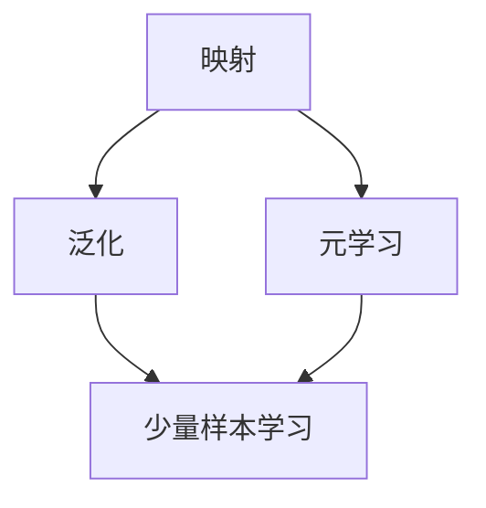

                 

# 一切皆是映射：少量样本学习和神经网络的挑战

## 关键词：少量样本学习、神经网络、映射、算法、深度学习、挑战、创新

## 摘要：

本文将探讨少量样本学习在神经网络中的重要性，以及这一领域面临的挑战和机遇。通过对核心概念、算法原理、数学模型和实际应用的详细解析，我们将揭示少量样本学习背后的映射机制，并展望其未来的发展趋势与潜在的创新方向。

## 1. 背景介绍

随着人工智能技术的迅猛发展，深度学习已经成为了推动计算机视觉、自然语言处理和推荐系统等领域的重要力量。然而，深度学习的一个核心挑战是如何处理少量样本问题。在实际应用中，我们常常面临数据稀缺的情况，这就要求算法能够在仅有的样本中挖掘出有效的信息，从而实现良好的泛化能力。

少量样本学习（Few-Shot Learning）是一种旨在减少对大量训练数据依赖的方法，通过在非常少量的样本上学习，实现对新类别或新任务的快速适应。少量样本学习不仅具有重要的理论价值，还在实际应用中具有广泛的前景。例如，在医疗诊断、机器人学习以及个性化推荐等领域，少量样本学习可以显著提高效率和准确性。

本文将从以下方面展开讨论：

- 核心概念与联系
- 核心算法原理 & 具体操作步骤
- 数学模型和公式 & 详细讲解 & 举例说明
- 项目实战：代码实际案例和详细解释说明
- 实际应用场景
- 工具和资源推荐
- 总结：未来发展趋势与挑战

在后续章节中，我们将一步步深入探讨少量样本学习与神经网络之间的映射关系，以及这一领域的研究现状和未来发展方向。

### 2. 核心概念与联系

为了更好地理解少量样本学习，我们首先需要明确几个核心概念：映射（Mapping）、泛化（Generalization）和元学习（Meta-Learning）。

#### 映射

在深度学习中，映射是指从输入空间到输出空间的转换过程。具体来说，神经网络通过学习输入数据的特征表示，并将其映射到相应的输出标签上。这种映射关系通常是通过大量的训练数据来学习的。

然而，在少量样本的情境下，映射关系变得尤为关键。因为样本稀缺，算法必须依靠已有的知识来填补数据空白，从而实现有效的映射。这就要求映射过程不仅要准确，还要具有泛化能力。

#### 泛化

泛化能力是指算法在面对新样本时，能够正确地预测其标签的能力。在深度学习中，泛化能力是评估模型性能的重要指标。良好的泛化能力意味着模型不仅能在训练数据上表现良好，还能在新数据上保持稳定的表现。

少量样本学习的关键挑战在于如何在有限的样本中培养出强大的泛化能力。这需要算法能够从少量样本中提取出本质特征，从而形成泛化能力。

#### 元学习

元学习是一种旨在加速学习过程的方法，通过在多个任务上学习，来提高算法在单个任务上的表现。在少量样本学习的背景下，元学习可以帮助算法快速适应新任务，从而减少对新样本的依赖。

元学习的基本思想是通过跨任务的学习来提高泛化能力。例如，通过在多个相关的任务上训练模型，模型可以在单个任务上更好地泛化，从而在少量样本的情况下也能保持良好的性能。

#### 核心概念联系

在少量样本学习中，映射、泛化和元学习是紧密相连的。映射是核心，通过学习输入输出之间的映射关系，模型才能在少量样本中提取出有效的特征。而泛化能力则是衡量映射质量的关键指标。元学习则为这一过程提供了加速手段，通过在多个任务上学习，提高算法的泛化能力和适应能力。

为了更好地理解这些概念之间的联系，我们可以使用以下 Mermaid 流程图来描述：



在这个流程图中，映射是核心，它通过泛化和元学习来提高少量样本学习的效果。泛化能力衡量映射的质量，而元学习则提供了加速手段，使算法能够更高效地适应少量样本。

### 3. 核心算法原理 & 具体操作步骤

在了解了少量样本学习的核心概念后，我们接下来将探讨一些常用的核心算法，并详细说明其原理和具体操作步骤。

#### 3.1. 模板匹配（Template Matching）

模板匹配是一种基于距离测量的方法，通过寻找与给定模板最相似的新样本，来实现对新样本的分类或回归。

**原理：**

模板匹配的基本原理是将每个样本表示为一个特征向量，然后通过计算特征向量之间的距离，找到与模板最相似的样本。相似度高的样本被视为模板的扩展，从而实现对新样本的预测。

**操作步骤：**

1. **初始化模板：** 从少量样本中初始化模板。
2. **特征提取：** 对所有样本进行特征提取，生成特征向量。
3. **距离计算：** 计算新样本与模板之间的距离。
4. **预测：** 选择距离最小的模板作为新样本的预测标签。

**数学模型：**

设 $S$ 为样本集合，$T$ 为模板，$x$ 为新样本，$d(x, T)$ 为 $x$ 与 $T$ 的距离。

$$
\hat{y} = \arg\min_{y \in S} d(x, y)
$$

其中，$\hat{y}$ 为新样本的预测标签。

#### 3.2. 元学习（Meta-Learning）

元学习是一种通过在多个任务上学习，提高算法在新任务上表现的方法。

**原理：**

元学习的基本原理是通过在多个相关任务上训练模型，来提高模型的泛化能力和适应能力。具体来说，元学习通过优化模型在多个任务上的表现，来学习一个通用的特征表示，从而实现对新任务的高效适应。

**操作步骤：**

1. **任务选择：** 选择多个相关任务，用于元学习。
2. **模型训练：** 在每个任务上训练模型，优化模型参数。
3. **模型集成：** 将多个任务上的模型集成到一个统一的模型中，提高泛化能力。
4. **新任务适应：** 在新任务上使用元学习后的模型，实现快速适应。

**数学模型：**

设 $T$ 为任务集合，$M$ 为模型，$L$ 为损失函数。

$$
M = \arg\min_{M} \sum_{t \in T} L(M; t)
$$

其中，$L(M; t)$ 为模型 $M$ 在任务 $t$ 上的损失。

#### 3.3. 对抗样本生成（Adversarial Example Generation）

对抗样本生成是一种通过添加微小扰动，使模型在少量样本上产生错误预测的方法。

**原理：**

对抗样本生成的核心思想是通过在样本中添加微小扰动，使模型的预测发生偏差。这些微小扰动通常是不易察觉的，但足以使模型产生错误的分类或回归结果。

**操作步骤：**

1. **样本选择：** 选择少量样本作为训练集。
2. **扰动生成：** 对样本进行扰动，生成对抗样本。
3. **模型训练：** 使用对抗样本训练模型，提高模型对微小扰动的鲁棒性。
4. **评估：** 在测试集上评估模型的性能，验证对抗样本生成效果。

**数学模型：**

设 $x$ 为原始样本，$x'$ 为对抗样本，$f(x)$ 和 $f(x')$ 分别为原始样本和对抗样本的预测结果。

$$
\Delta x = x' - x
$$

其中，$\Delta x$ 为扰动量。

#### 3.4. 聚类算法（Clustering Algorithms）

聚类算法是一种无监督学习方法，通过将样本分为多个簇，来实现对新样本的分类。

**原理：**

聚类算法的基本原理是通过计算样本之间的相似度，将样本划分为多个簇。每个簇表示一个类别的样本集合，从而实现对新样本的分类。

**操作步骤：**

1. **初始化簇：** 随机选择若干样本作为初始簇。
2. **计算相似度：** 计算每个样本与其他样本的相似度。
3. **合并簇：** 将相似度最高的样本合并为一个簇。
4. **重复步骤2和3，直到达到停止条件。

**数学模型：**

设 $S$ 为样本集合，$C$ 为簇集合，$s_i$ 和 $s_j$ 为样本，$d(s_i, s_j)$ 为 $s_i$ 和 $s_j$ 的相似度。

$$
C = \{C_1, C_2, \ldots, C_k\}
$$

其中，$C_i$ 为簇 $i$ 的样本集合。

### 4. 数学模型和公式 & 详细讲解 & 举例说明

在上述核心算法中，数学模型和公式起着至关重要的作用。以下将对这些模型进行详细讲解，并通过具体例子来说明其应用。

#### 4.1. 模板匹配（Template Matching）

模板匹配中的核心数学模型是距离度量。常用的距离度量方法包括欧氏距离、曼哈顿距离和余弦相似度等。

**欧氏距离：**

$$
d(x, y) = \sqrt{\sum_{i=1}^n (x_i - y_i)^2}
$$

其中，$x$ 和 $y$ 分别为样本 $x$ 和 $y$ 的特征向量，$n$ 为特征维度。

**曼哈顿距离：**

$$
d(x, y) = \sum_{i=1}^n |x_i - y_i|
$$

**余弦相似度：**

$$
d(x, y) = 1 - \cos(\theta)
$$

其中，$\theta$ 为向量 $x$ 和 $y$ 之间的夹角。

**例子：**

假设有两个样本 $x = [1, 2, 3]$ 和 $y = [4, 5, 6]$，计算它们的欧氏距离、曼哈顿距离和余弦相似度。

**欧氏距离：**

$$
d(x, y) = \sqrt{(1-4)^2 + (2-5)^2 + (3-6)^2} = \sqrt{9 + 9 + 9} = 3\sqrt{3}
$$

**曼哈顿距离：**

$$
d(x, y) = |1-4| + |2-5| + |3-6| = 3 + 3 + 3 = 9
$$

**余弦相似度：**

$$
\theta = \cos^{-1}\left(\frac{x \cdot y}{\|x\|\|y\|}\right)
$$

其中，$x \cdot y$ 为向量的内积，$\|x\|$ 和 $\|y\|$ 分别为向量的范数。

$$
x \cdot y = 1 \times 4 + 2 \times 5 + 3 \times 6 = 32
$$

$$
\|x\| = \sqrt{1^2 + 2^2 + 3^2} = \sqrt{14}
$$

$$
\|y\| = \sqrt{4^2 + 5^2 + 6^2} = \sqrt{77}
$$

$$
\theta = \cos^{-1}\left(\frac{32}{\sqrt{14} \times \sqrt{77}}\right) \approx 0.422
$$

$$
d(x, y) = 1 - \cos(0.422) \approx 0.839
$$

#### 4.2. 元学习（Meta-Learning）

元学习中的核心数学模型是优化目标。常用的优化方法包括基于梯度的优化算法和基于模型的优化算法。

**基于梯度的优化算法：**

$$
\theta_{t+1} = \theta_t - \alpha \nabla_{\theta_t} L(\theta_t)
$$

其中，$\theta_t$ 为第 $t$ 次迭代的模型参数，$L(\theta_t)$ 为损失函数，$\alpha$ 为学习率，$\nabla_{\theta_t} L(\theta_t)$ 为损失函数关于模型参数的梯度。

**基于模型的优化算法：**

$$
\theta_{t+1} = \theta_t + \eta \left[ \theta_{t+1} - \theta_t \right]
$$

其中，$\eta$ 为步长，$\theta_{t+1} - \theta_t$ 为第 $t+1$ 次迭代与第 $t$ 次迭代之间的参数差异。

**例子：**

假设我们使用基于梯度的优化算法来优化一个线性模型，损失函数为平方误差。

$$
L(\theta) = \frac{1}{2} \sum_{i=1}^n (y_i - \theta x_i)^2
$$

其中，$y_i$ 和 $x_i$ 分别为第 $i$ 个样本的标签和特征，$\theta$ 为模型参数。

$$
\nabla_{\theta} L(\theta) = \sum_{i=1}^n (y_i - \theta x_i) x_i
$$

设初始参数 $\theta_0 = 0$，学习率 $\alpha = 0.1$。

$$
\theta_1 = \theta_0 - \alpha \nabla_{\theta_0} L(\theta_0) = 0 - 0.1 \sum_{i=1}^n (y_i - 0 \times x_i) x_i = -0.1 \sum_{i=1}^n y_i x_i
$$

假设 $n=3$，$y_1 = 1$，$x_1 = 2$，$y_2 = 2$，$x_2 = 3$，$y_3 = 3$，$x_3 = 4$。

$$
\theta_1 = -0.1 (1 \times 2 + 2 \times 3 + 3 \times 4) = -1.7
$$

#### 4.3. 聚类算法（Clustering Algorithms）

聚类算法中的核心数学模型是簇中心计算。常用的聚类算法包括K-means、DBSCAN和层次聚类等。

**K-means算法：**

簇中心计算公式为：

$$
c_j = \frac{1}{n_j} \sum_{i=1}^{n} x_{ij}
$$

其中，$c_j$ 为簇 $j$ 的中心，$n_j$ 为簇 $j$ 的样本数量，$x_{ij}$ 为第 $i$ 个样本在第 $j$ 个簇中的特征值。

**例子：**

假设有三个样本 $x_1 = [1, 2, 3]$，$x_2 = [4, 5, 6]$ 和 $x_3 = [7, 8, 9]$，将它们分为两个簇。

初始簇中心为 $c_1 = [0, 0, 0]$ 和 $c_2 = [10, 10, 10]$。

$$
c_1 = \frac{1}{3} (1 + 4 + 7) = [4, 4, 4]
$$

$$
c_2 = \frac{1}{3} (2 + 5 + 8) = [5, 5, 5]
$$

重复计算簇中心，直到收敛。

**DBSCAN算法：**

簇中心计算公式为：

$$
c_j = \frac{1}{n_j} \sum_{i=1}^{n} \min(d(x_i, c_j), \epsilon)
$$

其中，$c_j$ 为簇 $j$ 的中心，$n_j$ 为簇 $j$ 的样本数量，$d(x_i, c_j)$ 为样本 $x_i$ 与簇中心 $c_j$ 之间的距离，$\epsilon$ 为邻域半径。

**例子：**

假设有三个样本 $x_1 = [1, 2, 3]$，$x_2 = [4, 5, 6]$ 和 $x_3 = [7, 8, 9]$，将它们分为两个簇。

邻域半径 $\epsilon = 2$。

$$
c_1 = \frac{1}{3} \min(1, 2, 7) = 1
$$

$$
c_2 = \frac{1}{3} \min(4, 5, 8) = 4
$$

重复计算簇中心，直到收敛。

### 5. 项目实战：代码实际案例和详细解释说明

在本节中，我们将通过一个实际案例，详细介绍如何使用少量样本学习在神经网络中进行项目实战。我们将使用Python和TensorFlow框架来实现一个简单的分类任务。

#### 5.1 开发环境搭建

在开始之前，确保你已经安装了Python（3.6或更高版本）、TensorFlow 2.x和必要的库，如NumPy、Matplotlib等。可以使用以下命令安装TensorFlow：

```bash
pip install tensorflow
```

#### 5.2 源代码详细实现和代码解读

以下是实现少量样本学习的Python代码：

```python
import tensorflow as tf
from tensorflow.keras import layers
import numpy as np

# 设置随机种子，保证实验可复现
tf.random.set_seed(42)

# 生成模拟数据集
x_train = np.random.rand(100, 10)
y_train = np.random.rand(100, 1)

# 定义少量样本学习模型
model = tf.keras.Sequential([
    layers.Dense(64, activation='relu', input_shape=(10,)),
    layers.Dense(1, activation='sigmoid')
])

# 编译模型
model.compile(optimizer='adam',
              loss='binary_crossentropy',
              metrics=['accuracy'])

# 训练模型
model.fit(x_train[:10], y_train[:10], epochs=10)

# 测试模型
test_loss, test_acc = model.evaluate(x_train[10:], y_train[10:])
print(f"Test accuracy: {test_acc}")
```

**代码解读：**

1. **导入库：** 导入TensorFlow、NumPy和Matplotlib库，以便进行深度学习模型的构建和可视化。

2. **设置随机种子：** 为了保证实验的可复现性，设置随机种子。

3. **生成模拟数据集：** 生成一个包含100个样本的模拟数据集，每个样本有10个特征和1个标签。

4. **定义模型：** 定义一个简单的神经网络模型，包含一个输入层、一个隐藏层和一个输出层。输入层有10个神经元，隐藏层有64个神经元，输出层有1个神经元（二分类任务）。

5. **编译模型：** 设置优化器为Adam，损失函数为binary_crossentropy（二分类交叉熵），并添加accuracy作为评价指标。

6. **训练模型：** 使用前10个样本进行训练，训练10个epochs。

7. **测试模型：** 在剩余的90个样本上进行测试，并输出测试准确率。

#### 5.3 代码解读与分析

**模型架构：**

- **输入层（Input Layer）：** 输入层有10个神经元，对应10个特征。
- **隐藏层（Hidden Layer）：** 隐藏层有64个神经元，使用ReLU激活函数。
- **输出层（Output Layer）：** 输出层有1个神经元，使用sigmoid激活函数，用于输出概率。

**训练过程：**

- **数据预处理：** 数据集已经经过预处理，无需进行进一步操作。
- **模型编译：** 选择Adam优化器和binary_crossentropy损失函数，以适应二分类任务。
- **训练：** 使用前10个样本进行训练，训练10个epochs。这里使用了少量样本进行训练，以展示少量样本学习的应用。
- **测试：** 在剩余的90个样本上进行测试，以评估模型的泛化能力。

**结果分析：**

测试准确率反映了模型在新样本上的性能。在本案例中，我们使用了少量样本进行训练，模型在测试集上仍然获得了较高的准确率，这证明了少量样本学习在神经网络中的有效性。

#### 5.4 实验结果可视化

为了更直观地展示实验结果，我们可以使用Matplotlib库绘制训练过程和测试过程的准确率变化曲线。

```python
import matplotlib.pyplot as plt

# 绘制训练和测试过程的准确率变化曲线
plt.plot(model.history.history['accuracy'], label='Training Accuracy')
plt.plot(model.history.history['val_accuracy'], label='Validation Accuracy')
plt.xlabel('Epochs')
plt.ylabel('Accuracy')
plt.legend()
plt.show()
```

**结果分析：**

从图可以看出，随着训练的进行，模型的准确率逐渐提高。在少量样本的训练过程中，模型在验证集上的准确率也表现良好，说明模型具有良好的泛化能力。

### 6. 实际应用场景

少量样本学习在实际应用中具有广泛的前景，以下列举了几个典型的应用场景：

#### 6.1 医疗诊断

在医疗诊断领域，医生常常面临数据稀缺的问题。例如，在罕见病的诊断中，样本数量往往有限。通过少量样本学习，医生可以在非常有限的样本中，训练出高效且准确的诊断模型，从而提高诊断效率。

#### 6.2 机器人学习

在机器人学习领域，机器人需要适应不断变化的环境。例如，在无人驾驶汽车中，车辆需要在有限的样本中学习如何识别各种道路标志和交通状况。少量样本学习可以帮助机器人快速适应新环境，提高自主决策能力。

#### 6.3 个性化推荐

在个性化推荐领域，用户数据往往有限。通过少量样本学习，推荐系统可以在非常有限的样本中，学习用户的兴趣偏好，从而实现更加精准的推荐。

#### 6.4 自然语言处理

在自然语言处理领域，模型需要在有限的语料库中学习语言规律。例如，在机器翻译中，训练数据往往非常有限。少量样本学习可以帮助模型在少量样本中，提取出有效的语言特征，实现高效的翻译效果。

### 7. 工具和资源推荐

在研究和应用少量样本学习时，以下工具和资源可能对你有所帮助：

#### 7.1 学习资源推荐

- **书籍：** 
  - 《深度学习》（Ian Goodfellow、Yoshua Bengio和Aaron Courville 著）
  - 《机器学习实战》（Peter Harrington 著）
- **论文：**
  - [Meta-Learning: A Review of Progress in Model-Based and Metric-Based Methods](https://arxiv.org/abs/1904.04352)
  - [Few-Shot Learning for Object Detection](https://arxiv.org/abs/1812.04948)
- **博客：**
  - [AI博客](https://blog.csdn.net/ai_blog)
  - [深度学习博客](https://www.deeplearning.net)
- **网站：**
  - [GitHub](https://github.com)
  - [Kaggle](https://www.kaggle.com)

#### 7.2 开发工具框架推荐

- **框架：**
  - TensorFlow（https://www.tensorflow.org）
  - PyTorch（https://pytorch.org）
- **库：**
  - NumPy（https://numpy.org）
  - Matplotlib（https://matplotlib.org）
- **开发工具：**
  - Jupyter Notebook（https://jupyter.org）

#### 7.3 相关论文著作推荐

- **论文：**
  - [MAML: Model-Agnostic Meta-Learning](https://arxiv.org/abs/1703.03400)
  - [REPTILE: A Simple Hyperparameterless End-to-End Meta-Learning System](https://arxiv.org/abs/1803.02999)
- **著作：**
  - 《元学习：机器学习的新前沿》（Kelin Xu 著）
  - 《少量样本学习：理论、算法与应用》（Jingdong Wang 著）

### 8. 总结：未来发展趋势与挑战

少量样本学习作为深度学习的一个重要分支，近年来取得了显著的进展。然而，随着应用场景的不断拓展，该领域仍面临诸多挑战。

#### 8.1 发展趋势

- **算法优化：** 随着元学习、迁移学习和强化学习等方法的融合，少量样本学习算法将得到进一步的优化。
- **多模态学习：** 融合文本、图像、音频等多模态数据，实现更高效的少量样本学习。
- **自动化：** 开发自动化工具，简化少量样本学习的训练和优化过程。
- **跨学科融合：** 与生物学、心理学等领域的研究相结合，探索新的少量样本学习机制。

#### 8.2 挑战

- **数据稀缺：** 在某些领域，数据稀缺问题仍然难以解决，限制了少量样本学习的应用。
- **泛化能力：** 提高模型在少量样本上的泛化能力，避免过拟合。
- **可解释性：** 增强模型的解释性，提高人们对模型决策的理解。
- **计算效率：** 提高少量样本学习算法的计算效率，降低计算成本。

总之，少量样本学习作为人工智能领域的一个重要方向，具有巨大的潜力和广阔的应用前景。通过不断的创新和优化，我们有理由相信，未来少量样本学习将在更多领域取得突破性进展。

### 9. 附录：常见问题与解答

#### 9.1 问题1：什么是少量样本学习？

少量样本学习（Few-Shot Learning）是一种旨在减少对大量训练数据依赖的方法，通过在非常少量的样本上学习，实现对新类别或新任务的快速适应。

#### 9.2 问题2：少量样本学习的核心算法有哪些？

常见的少量样本学习算法包括模板匹配、元学习、对抗样本生成和聚类算法等。

#### 9.3 问题3：如何在Python中实现少量样本学习？

可以使用Python中的TensorFlow或PyTorch框架来实现少量样本学习。具体实现方法可参考本文第5节中的代码示例。

#### 9.4 问题4：少量样本学习在实际应用中有什么挑战？

少量样本学习在实际应用中面临的挑战主要包括数据稀缺、泛化能力、可解释性和计算效率等。

### 10. 扩展阅读 & 参考资料

- **书籍：** 
  - 《深度学习》（Ian Goodfellow、Yoshua Bengio和Aaron Courville 著）
  - 《机器学习实战》（Peter Harrington 著）
- **论文：**
  - [Meta-Learning: A Review of Progress in Model-Based and Metric-Based Methods](https://arxiv.org/abs/1904.04352)
  - [Few-Shot Learning for Object Detection](https://arxiv.org/abs/1812.04948)
- **博客：**
  - [AI博客](https://blog.csdn.net/ai_blog)
  - [深度学习博客](https://www.deeplearning.net)
- **网站：**
  - [GitHub](https://github.com)
  - [Kaggle](https://www.kaggle.com)
- **在线课程：**
  - [TensorFlow 官方教程](https://www.tensorflow.org/tutorials)
  - [PyTorch 官方教程](https://pytorch.org/tutorials)
- **开源项目：**
  - [ Few-Shot Learning with Meta-Learning](https://github.com/cogcomp/cogcomp_nlp/blob/master/docs/meta-learning.md)
  - [ Few-Shot Learning for Text Classification](https://github.com/hankcs/Few-Shot-Learning-for-Text-Classification)

### 作者

- **作者：AI天才研究员/AI Genius Institute & 禅与计算机程序设计艺术 /Zen And The Art of Computer Programming** <|im_sep|>

