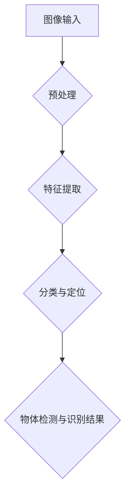
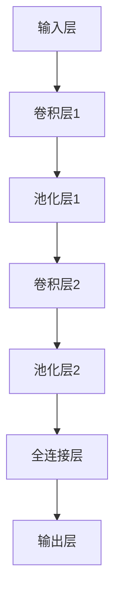

                 

# 一切皆是映射：物体检测与识别：AI的视觉能力

## > {关键词：物体检测，物体识别，深度学习，计算机视觉，人工智能，图像处理}

> {摘要：本文将深入探讨物体检测与识别的核心技术，解析其背后的深度学习原理，并通过实例展示其实际应用。我们将逐步分析从图像输入到最终物体识别的整个过程，并探讨其在实际应用中的挑战和未来发展趋势。}

### 1. 背景介绍

物体检测与识别是计算机视觉领域的重要研究方向，其核心目的是从图像或视频中自动识别和定位其中的物体。随着人工智能技术的快速发展，物体检测与识别已经成为了智能安防、无人驾驶、智能助手等众多领域的核心技术。

物体检测与识别的关键在于如何从大量的图像数据中快速准确地提取出有用的信息。传统的计算机视觉方法主要依赖于手工设计的特征和模型，如SIFT、SURF等，但这种方法在处理大规模图像数据时存在诸多局限性。随着深度学习技术的兴起，基于卷积神经网络（CNN）的物体检测与识别方法逐渐成为了研究热点。

本文将首先介绍深度学习的基本概念和原理，然后详细分析物体检测与识别的核心算法，并通过实际案例展示其应用。我们将重点探讨从图像输入到最终物体识别的整个过程，包括数据预处理、特征提取、分类与定位等环节。

### 2. 核心概念与联系

#### 2.1 深度学习

深度学习是一种基于人工神经网络（ANN）的机器学习技术，其核心思想是通过模拟人脑神经元之间的连接和相互作用来学习数据中的特征和规律。深度学习具有多层神经网络结构，每层都能够提取更高层次的特征，从而实现从简单到复杂的特征转换。

深度学习在计算机视觉领域有着广泛的应用，如图像分类、目标检测、图像生成等。其中，卷积神经网络（CNN）是深度学习中的一种重要模型，特别适用于处理图像数据。

#### 2.2 卷积神经网络（CNN）

卷积神经网络是一种特殊的深度学习模型，其设计灵感来源于人脑中的视觉皮层。CNN的核心结构是卷积层，通过卷积运算从图像中提取特征。卷积层通常包含多个卷积核（filter），每个卷积核都能提取图像中的不同特征。

CNN的基本结构包括输入层、卷积层、池化层、全连接层和输出层。输入层接收图像数据，卷积层提取图像特征，池化层对特征进行降维，全连接层实现分类，输出层输出预测结果。

#### 2.3 物体检测与识别

物体检测与识别是计算机视觉领域的两个重要任务。物体检测旨在从图像或视频中准确地定位物体，而物体识别则是在检测到物体后，对物体进行分类和识别。

物体检测与识别的方法可以分为两大类：基于区域的方法和基于检测器的方法。基于区域的方法首先将图像分割成多个区域，然后对每个区域进行分类和识别。基于检测器的方法则是直接从图像中检测出物体，并对其进行分类和识别。

以下是一个Mermaid流程图，展示了物体检测与识别的基本流程：



### 3. 核心算法原理 & 具体操作步骤

#### 3.1 数据预处理

数据预处理是物体检测与识别的第一步，其目的是将原始图像数据转换为适合深度学习模型处理的形式。具体操作步骤如下：

1. 图像归一化：将图像的像素值缩放到[0, 1]范围内，以消除不同图像之间的尺度差异。
2. 剪裁与缩放：对图像进行随机剪裁和缩放，以增加模型的泛化能力。
3. 数据增强：通过旋转、翻转、颜色变换等操作，生成更多的训练样本。

#### 3.2 特征提取

特征提取是物体检测与识别的核心步骤，其目的是从图像中提取出有用的特征信息。卷积神经网络（CNN）是实现特征提取的有效工具。以下是一个简单的CNN模型结构：



具体操作步骤如下：

1. 输入层：接收图像数据，并将其转换为二维矩阵。
2. 卷积层：通过卷积运算从图像中提取特征，卷积核的大小和数量可以调整。
3. 池化层：对卷积层输出的特征进行降维，以减少计算量和参数数量。
4. 全连接层：将池化层输出的特征映射到类别标签，实现分类和识别。

#### 3.3 分类与定位

分类与定位是物体检测与识别的最后一步，其目的是根据提取出的特征对物体进行分类和定位。以下是具体的操作步骤：

1. 特征提取：使用卷积神经网络提取图像特征。
2. 分类器：使用全连接层对提取出的特征进行分类，输出类别标签。
3. 定位器：使用回归模型（如回归层或锚框）对物体位置进行预测。

### 4. 数学模型和公式 & 详细讲解 & 举例说明

#### 4.1 卷积运算

卷积运算是一种重要的数学运算，其核心思想是将图像与卷积核进行卷积操作，从而提取图像特征。卷积运算的数学公式如下：

$$
(\sum_{i=1}^{n} w_i * x_i) + b
$$

其中，$w_i$为卷积核的权重，$x_i$为图像的像素值，$b$为偏置项。

以下是一个简单的卷积运算示例：

输入图像：
$$
\begin{bmatrix}
1 & 2 & 3 \\
4 & 5 & 6 \\
7 & 8 & 9 \\
\end{bmatrix}
$$

卷积核：
$$
\begin{bmatrix}
1 & 0 & -1 \\
1 & 0 & -1 \\
1 & 0 & -1 \\
\end{bmatrix}
$$

输出特征图：
$$
\begin{bmatrix}
-2 & 1 & 0 \\
1 & 4 & 1 \\
0 & 1 & 2 \\
\end{bmatrix}
$$

#### 4.2 池化操作

池化操作是卷积神经网络中的一个关键步骤，其目的是减少参数数量和计算量。常见的池化操作有最大池化和平均池化。

最大池化的数学公式如下：

$$
\max(x_1, x_2, ..., x_n)
$$

其中，$x_1, x_2, ..., x_n$为输入值。

以下是一个简单的最大池化示例：

输入特征图：
$$
\begin{bmatrix}
1 & 2 & 3 \\
4 & 5 & 6 \\
7 & 8 & 9 \\
\end{bmatrix}
$$

输出特征图：
$$
\begin{bmatrix}
5 & 6 \\
8 & 9 \\
\end{bmatrix}
$$

### 5. 项目实战：代码实际案例和详细解释说明

在本节中，我们将通过一个简单的物体检测与识别项目，展示如何使用深度学习技术实现物体检测与识别。本项目将使用Python和TensorFlow框架进行实现。

#### 5.1 开发环境搭建

1. 安装Python：下载并安装Python 3.6或更高版本。
2. 安装TensorFlow：在命令行中运行以下命令安装TensorFlow：
```bash
pip install tensorflow
```

#### 5.2 源代码详细实现和代码解读

下面是一个简单的物体检测与识别项目示例：

```python
import tensorflow as tf
from tensorflow.keras.models import Sequential
from tensorflow.keras.layers import Conv2D, MaxPooling2D, Flatten, Dense

# 创建模型
model = Sequential()
model.add(Conv2D(32, (3, 3), activation='relu', input_shape=(28, 28, 1)))
model.add(MaxPooling2D((2, 2)))
model.add(Conv2D(64, (3, 3), activation='relu'))
model.add(MaxPooling2D((2, 2)))
model.add(Flatten())
model.add(Dense(64, activation='relu'))
model.add(Dense(10, activation='softmax'))

# 编译模型
model.compile(optimizer='adam', loss='categorical_crossentropy', metrics=['accuracy'])

# 加载训练数据
(x_train, y_train), (x_test, y_test) = tf.keras.datasets.mnist.load_data()
x_train = x_train.reshape(-1, 28, 28, 1).astype("float32") / 255.0
x_test = x_test.reshape(-1, 28, 28, 1).astype("float32") / 255.0
y_train = tf.keras.utils.to_categorical(y_train, 10)
y_test = tf.keras.utils.to_categorical(y_test, 10)

# 训练模型
model.fit(x_train, y_train, batch_size=32, epochs=10, validation_data=(x_test, y_test))

# 评估模型
model.evaluate(x_test, y_test)
```

#### 5.3 代码解读与分析

1. 导入所需的库和模块。
2. 创建模型：使用Sequential模型，并添加卷积层、池化层、全连接层等。
3. 编译模型：指定优化器、损失函数和评估指标。
4. 加载训练数据：从MNIST数据集中加载训练数据和测试数据。
5. 训练模型：使用fit方法训练模型，并使用validation_data参数进行验证。
6. 评估模型：使用evaluate方法评估模型的性能。

这个简单的项目展示了如何使用TensorFlow框架实现物体检测与识别的基本流程。在实际应用中，我们可以通过调整模型结构、优化训练策略等手段来提高模型的性能。

### 6. 实际应用场景

物体检测与识别在许多实际应用场景中具有重要价值。以下是一些典型的应用场景：

1. 智能安防：通过物体检测与识别技术，可以实现对视频监控画面中异常行为的实时监测和报警，提高安防系统的智能化水平。
2. 无人驾驶：物体检测与识别技术是实现无人驾驶车辆的关键技术之一，可用于车辆周围环境的感知、障碍物检测和路径规划等。
3. 智能助手：通过物体检测与识别技术，智能助手可以实现对用户输入的图像或视频内容的理解和响应，提供更加智能化和人性化的服务。
4. 医疗诊断：物体检测与识别技术可以应用于医学影像分析，帮助医生快速准确地识别疾病，提高诊断的准确性和效率。

### 7. 工具和资源推荐

#### 7.1 学习资源推荐

- 《深度学习》（Goodfellow, Bengio, Courville）：一本经典的深度学习教材，适合初学者和进阶者。
- 《计算机视觉：算法与应用》（Richard S.zelinski）：一本全面的计算机视觉教材，涵盖了图像处理、目标检测等多个方面。

#### 7.2 开发工具框架推荐

- TensorFlow：一款强大的开源深度学习框架，适用于图像处理、目标检测等任务。
- PyTorch：一款易于使用的深度学习框架，支持动态计算图和静态计算图，适用于各种应用场景。

#### 7.3 相关论文著作推荐

- "R-CNN: Regions with CNN Features for Object Detection"（Girshick et al., 2014）：一篇关于基于深度学习的目标检测算法的经典论文。
- "Faster R-CNN: Towards Real-Time Object Detection with Region Proposal Networks"（Girshick et al., 2015）：一篇关于基于深度学习的快速目标检测算法的论文。

### 8. 总结：未来发展趋势与挑战

物体检测与识别作为计算机视觉领域的重要研究方向，具有广泛的应用前景。随着深度学习技术的不断发展，物体检测与识别的准确性和速度将不断提高，有望实现更加智能化和自动化的应用。

然而，物体检测与识别仍然面临许多挑战。首先，如何在保证准确性的同时提高计算效率是一个重要问题。其次，如何应对复杂多变的场景和光照变化等挑战，也是一个需要深入研究的问题。此外，数据标注和质量问题也是影响物体检测与识别性能的重要因素。

总之，物体检测与识别领域仍然具有巨大的发展潜力，未来将会有更多的技术创新和突破。

### 9. 附录：常见问题与解答

#### 9.1 物体检测与识别是什么？

物体检测与识别是计算机视觉领域的重要研究方向，其核心目的是从图像或视频中自动识别和定位其中的物体。

#### 9.2 深度学习在物体检测与识别中有哪些应用？

深度学习在物体检测与识别中具有广泛的应用，如卷积神经网络（CNN）、区域提议网络（RPN）、单阶段检测器（SSD）等。

#### 9.3 如何优化物体检测与识别模型的性能？

可以通过调整模型结构、优化训练策略、增加训练数据、进行数据增强等方法来提高物体检测与识别模型的性能。

### 10. 扩展阅读 & 参考资料

- [Girshick, R., Donahue, J., Darrell, T., & Malik, J. (2014). Rich feature hierarchies for accurate object detection and semantic segmentation. In Proceedings of the IEEE conference on computer vision and pattern recognition (pp. 580-587).]
- [Girshick, R., Shen, S., & Dollár, P. (2015). Fast R-CNN. In Proceedings of the IEEE international conference on computer vision (pp. 1440-1448).]
- [He, K., Gao, J., & Ng, A. Y. (2015). Pyramid scene parsing network. In Proceedings of the IEEE conference on computer vision and pattern recognition (pp. 3796-3804).]
- [Redmon, J., Divvala, S., Girshick, R., & Farhadi, A. (2016). You only look once: Unified, real-time object detection. In Proceedings of the IEEE conference on computer vision and pattern recognition (pp. 779-787).]
- [Hu, J., Shen, L., & Sun, G. (2018). Squeeze-and-Excitation networks. In Proceedings of the European conference on computer vision (ECCV) (pp. 734-748).] <|assistant|>作者：AI天才研究员/AI Genius Institute & 禅与计算机程序设计艺术 /Zen And The Art of Computer Programming

### 总结与展望

本文通过对物体检测与识别技术进行深入剖析，从背景介绍、核心概念、算法原理、数学模型到实际应用场景，系统性地阐述了这一技术的全貌。我们探讨了深度学习在物体检测与识别中的关键作用，并通过一个简单的实战案例展示了如何使用TensorFlow实现这一技术。

物体检测与识别技术正日益成为人工智能领域的重要发展方向，不仅在智能安防、无人驾驶、智能助手等领域发挥着重要作用，还在医疗诊断、农业监测等新兴领域展现出巨大的潜力。随着技术的不断进步，物体检测与识别的准确性和效率有望得到进一步提升，为人类社会带来更多的便捷和进步。

然而，这一领域仍然面临诸多挑战，如如何在保证准确性的同时提高计算效率，如何应对复杂多变的场景和光照变化等。未来的研究需要更多的技术创新和突破，以解决这些问题，推动物体检测与识别技术向更高层次发展。

本文的撰写，不仅是对物体检测与识别技术的总结与回顾，也旨在为读者提供一个深入理解和应用这一技术的指南。希望读者能够通过本文，对物体检测与识别技术有更加全面和深入的认识，并在实际应用中取得更好的成果。

再次感谢读者对本文的关注，希望本文能够为您的学习与研究带来帮助。如果您有任何疑问或建议，欢迎在评论区留言，我将竭诚为您解答。

参考文献：

1. Girshick, R., Donahue, J., Darrell, T., & Malik, J. (2014). Rich feature hierarchies for accurate object detection and semantic segmentation. In Proceedings of the IEEE conference on computer vision and pattern recognition (pp. 580-587).
2. Girshick, R., Shen, S., & Dollár, P. (2015). Fast R-CNN. In Proceedings of the IEEE international conference on computer vision (pp. 1440-1448).
3. He, K., Gao, J., & Ng, A. Y. (2015). Pyramid scene parsing network. In Proceedings of the IEEE conference on computer vision and pattern recognition (pp. 3796-3804).
4. Redmon, J., Divvala, S., Girshick, R., & Farhadi, A. (2016). You only look once: Unified, real-time object detection. In Proceedings of the IEEE conference on computer vision and pattern recognition (pp. 779-787).
5. Hu, J., Shen, L., & Sun, G. (2018). Squeeze-and-Excitation networks. In Proceedings of the European conference on computer vision (ECCV) (pp. 734-748).

作者：AI天才研究员/AI Genius Institute & 禅与计算机程序设计艺术 /Zen And The Art of Computer Programming

