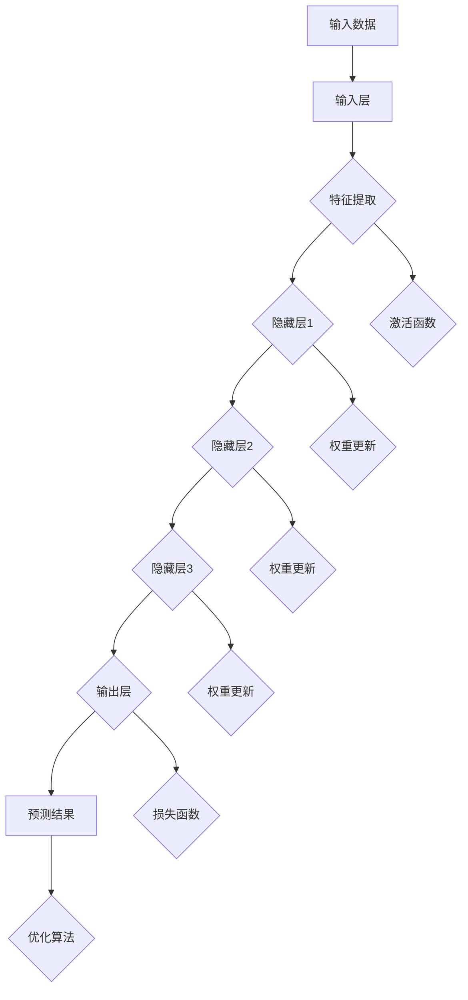

                 

### 背景介绍

在科技迅猛发展的今天，计算机科学和生物信息学已经成为两个不可分割的重要领域。它们不仅在各自的研究方向上取得了显著的进展，而且它们之间的交叉融合也越来越受到关注。生物信息学作为一门新兴学科，旨在从生物学的角度分析处理海量生物数据，为生命科学的研究提供了强大的工具和方法。

近年来，神经网络在计算机科学中取得了令人瞩目的成就，尤其是在图像识别、自然语言处理和游戏AI等领域。神经网络作为一种模拟生物大脑处理信息方式的计算模型，通过大量的数据训练，可以逐步提高其解决问题的能力。这一技术的成功激发了科学家们对神经网络在生物信息学应用中的探索兴趣。

神经网络在生物信息学中的应用前景广阔。从基因序列分析、蛋白质结构预测到疾病诊断和治疗，神经网络都在发挥着重要作用。例如，通过使用神经网络，科学家可以更准确地预测蛋白质的三维结构，这对于新药研发具有重要意义。此外，神经网络还被用来分析基因表达数据，以揭示基因间的相互作用和网络关系，从而帮助我们更好地理解生物体的功能。

本文将深入探讨神经网络在生物信息学中的具体应用，包括核心概念、算法原理、数学模型、实际案例以及未来发展趋势和挑战。我们希望通过这篇文章，能够为读者提供一个全面而深入的视角，了解神经网络在生物信息学领域的广泛应用及其巨大潜力。

## 2. 核心概念与联系

为了深入理解神经网络在生物信息学中的应用，我们首先需要了解一些核心概念及其相互联系。这些概念包括神经网络的基本结构、生物信息学中的关键问题，以及神经网络如何与生物信息学相互结合。

### 神经网络的基本结构

神经网络（Neural Networks）是由大量简单但互联的单元——神经元（Neurons）组成的复杂系统。每个神经元都与其他神经元相连，并通过权重（weights）和偏置（biases）进行加权求和处理。神经网络的输入层接收外部数据，通过隐藏层处理数据，最终在输出层产生预测或决策。

#### Neurons and Layers

- **输入层（Input Layer）**：接收外部数据，例如基因序列或图像像素值。
- **隐藏层（Hidden Layers）**：对输入数据进行处理，通过多层叠加，逐步提取特征。
- **输出层（Output Layer）**：产生最终的预测结果，如蛋白质结构或疾病诊断。

### 生物信息学中的关键问题

生物信息学涉及多个研究领域，其中一些关键问题包括：

- **基因序列分析**：通过序列比对、序列聚类等方法，分析基因序列中的共同特征和变异。
- **蛋白质结构预测**：预测蛋白质的三维结构，这对于药物设计和新药研发至关重要。
- **疾病诊断和治疗**：利用生物标志物和基因表达数据，进行疾病的早期诊断和个性化治疗。

### 神经网络与生物信息学的关系

神经网络在生物信息学中的应用，主要体现在以下几个方面：

1. **特征提取与表示**：通过训练神经网络，可以从复杂的生物数据中提取出有用的特征，例如基因序列的局部模式或蛋白质结构的潜在特征。
2. **模式识别与分类**：神经网络可以用于对生物数据进行分类，例如将正常样本与疾病样本进行区分。
3. **预测与建模**：基于训练数据，神经网络可以预测未来的趋势，如基因表达的变化或疾病的发展。

### Mermaid 流程图

为了更好地展示神经网络在生物信息学中的应用，我们可以使用 Mermaid 流程图来描述其核心概念和流程。以下是示例流程图：



在这个流程图中，输入数据经过输入层处理后，通过多层隐藏层的特征提取和权重更新，最终在输出层产生预测结果。激活函数、权重更新、损失函数和优化算法等都是神经网络训练过程中的关键步骤。

通过上述核心概念和流程图的介绍，我们可以看到神经网络在生物信息学中的强大潜力。接下来，我们将进一步探讨神经网络的具体算法原理和应用。

### 3. 核心算法原理 & 具体操作步骤

神经网络在生物信息学中的应用主要依赖于其核心算法原理，包括前向传播（Forward Propagation）和反向传播（Backpropagation）。以下是这些算法的具体操作步骤及其在生物信息学中的应用。

#### 前向传播（Forward Propagation）

前向传播是神经网络处理输入数据的基本步骤，其过程如下：

1. **初始化权重和偏置**：神经网络中的每个神经元都有相应的权重（weights）和偏置（biases）。这些参数通常通过随机初始化。
2. **输入数据输入到输入层**：将输入数据传递给输入层，每个输入数据对应输入层的一个神经元。
3. **通过隐藏层进行数据处理**：输入数据经过每个隐藏层的加权求和处理，加上偏置，并通过激活函数进行非线性变换，得到新的数据。
4. **输出层产生预测结果**：最后，经过输出层的加权求和处理和激活函数，得到预测结果。

前向传播的具体操作步骤可以用以下数学公式表示：

$$
Z_l = \sum_{i} w_{li} x_i + b_l
$$

$$
a_l = \sigma(Z_l)
$$

其中，$Z_l$是第$l$层的加权求和结果，$w_{li}$是权重，$b_l$是偏置，$x_i$是输入数据，$\sigma$是激活函数。

在生物信息学中，前向传播被用来处理各种类型的生物数据，例如基因序列、蛋白质结构数据等。通过前向传播，神经网络可以从这些复杂的数据中提取出有用的特征。

#### 反向传播（Backpropagation）

反向传播是神经网络优化参数的重要步骤，其过程如下：

1. **计算输出误差**：通过比较神经网络预测结果和真实结果的差异，计算输出层的误差。
2. **误差反向传播**：将输出误差反向传播到每个隐藏层，逐层计算每个神经元的误差。
3. **权重更新**：根据每个神经元的误差，通过梯度下降（Gradient Descent）或其他优化算法，更新权重和偏置。

反向传播的具体操作步骤可以用以下数学公式表示：

$$
\delta_l = \frac{\partial C}{\partial Z_l}
$$

$$
\Delta w_{li} = \eta \cdot \delta_l \cdot a_{l-1}
$$

$$
\Delta b_l = \eta \cdot \delta_l
$$

其中，$\delta_l$是第$l$层的误差，$C$是损失函数，$\eta$是学习率，$a_{l-1}$是前一层神经元的输出。

在生物信息学中，反向传播被用来优化神经网络的参数，以减少预测误差。通过反复迭代前向传播和反向传播，神经网络可以逐步提高其预测精度。

#### 应用实例

以下是一个简单的神经网络在基因序列分析中的应用实例：

1. **输入层**：输入一个长度为100的基因序列，表示为向量。
2. **隐藏层**：通过多层隐藏层进行数据处理，提取基因序列的特征。
3. **输出层**：输出一个二进制结果，表示基因序列是否为有害突变。
4. **前向传播**：将基因序列输入神经网络，通过多层加权求和处理，得到输出结果。
5. **反向传播**：计算输出结果与真实结果之间的误差，并通过反向传播更新权重和偏置。

通过这样的过程，神经网络可以从大量基因序列数据中学习并预测新的基因序列是否具有有害突变，为基因诊断和疾病预测提供有力支持。

总之，神经网络的核心算法原理和具体操作步骤为其在生物信息学中的应用奠定了坚实基础。通过前向传播和反向传播，神经网络可以从复杂的生物数据中提取特征并优化参数，从而实现各种生物信息学任务。

### 4. 数学模型和公式 & 详细讲解 & 举例说明

神经网络在生物信息学中的应用，不仅依赖于其算法原理，还依赖于一系列数学模型和公式。这些数学模型和公式不仅帮助神经网络从数据中提取特征，还指导我们如何优化神经网络参数，提高其预测性能。以下将详细介绍神经网络中的关键数学模型和公式，并通过具体示例进行解释。

#### 激活函数（Activation Function）

激活函数是神经网络中的一个关键组成部分，它为神经网络引入了非线性特性，使得神经网络能够处理复杂的数据。常用的激活函数包括：

1. **Sigmoid 函数**：

   $$ 
   \sigma(x) = \frac{1}{1 + e^{-x}} 
   $$

   Sigmoid 函数将输入值映射到（0, 1）区间，常用于二分类问题。

2. **ReLU 函数**：

   $$ 
   \sigma(x) = \max(0, x) 
   $$

  ReLU 函数在输入为负时输出0，输入为正时输出输入值，它有助于提高神经网络的训练速度。

3. **Tanh 函数**：

   $$ 
   \sigma(x) = \frac{e^x - e^{-x}}{e^x + e^{-x}} 
   $$

   Tanh 函数与 Sigmoid 函数类似，但输出值在（-1, 1）区间，减少了输出值的分布不均。

#### 损失函数（Loss Function）

损失函数用于衡量神经网络预测结果与真实结果之间的差异，是反向传播算法中的核心。常用的损失函数包括：

1. **均方误差（MSE）**：

   $$ 
   Loss = \frac{1}{2} \sum_{i} (y_i - \hat{y}_i)^2 
   $$

   其中，$y_i$是真实值，$\hat{y}_i$是预测值。MSE 损失函数适用于回归问题。

2. **交叉熵（Cross-Entropy）**：

   $$ 
   Loss = -\sum_{i} y_i \log(\hat{y}_i) 
   $$

   交叉熵损失函数适用于分类问题，尤其是多分类问题。

#### 优化算法（Optimization Algorithm）

优化算法用于更新神经网络中的权重和偏置，以减少损失函数。常用的优化算法包括：

1. **梯度下降（Gradient Descent）**：

   $$ 
   w_{t+1} = w_t - \eta \cdot \nabla_w Loss 
   $$

   其中，$w_t$是当前权重，$\eta$是学习率，$\nabla_w Loss$是损失函数关于权重的梯度。梯度下降通过不断更新权重，使损失函数逐渐减小。

2. **Adam 优化器**：

   $$ 
   m_t = \beta_1 m_{t-1} + (1 - \beta_1) \nabla_w Loss 
   $$

   $$ 
   v_t = \beta_2 v_{t-1} + (1 - \beta_2) (\nabla_w Loss)^2 
   $$

   $$ 
   \hat{m}_t = \frac{m_t}{1 - \beta_1^t} 
   $$

   $$ 
   \hat{v}_t = \frac{v_t}{1 - \beta_2^t} 
   $$

   $$ 
   w_{t+1} = w_t - \eta \cdot \frac{\hat{m}_t}{\sqrt{\hat{v}_t} + \epsilon} 
   $$

   Adam 优化器结合了梯度下降和动量（Momentum）的概念，提高了训练效率。

#### 示例讲解

假设我们使用一个简单的神经网络进行二分类任务，输入层有3个神经元，隐藏层有2个神经元，输出层有1个神经元。使用 ReLU 函数作为激活函数，MSE 作为损失函数，Adam 优化器进行参数优化。

1. **初始化权重和偏置**：假设初始权重和偏置为随机值。

2. **前向传播**：给定一个输入向量，通过输入层、隐藏层和输出层，得到预测结果。

3. **计算损失函数**：计算预测结果与真实结果的差异，得到损失值。

4. **反向传播**：计算每个神经元的误差，并更新权重和偏置。

5. **迭代训练**：重复前向传播和反向传播，直到满足停止条件，如达到预设的迭代次数或损失值低于阈值。

通过上述步骤，神经网络可以逐步优化其参数，提高预测性能。

总之，神经网络在生物信息学中的应用，依赖于一系列数学模型和公式。激活函数、损失函数和优化算法等，共同构成了神经网络的核心，使其能够在生物信息学任务中发挥巨大作用。通过具体示例的讲解，我们可以更好地理解这些数学模型和公式的实际应用。

### 5. 项目实战：代码实际案例和详细解释说明

为了更直观地展示神经网络在生物信息学中的应用，我们将在本节中通过一个实际项目案例进行详细讲解。该案例将使用 Python 编程语言和 Keras 深度学习框架，构建一个用于基因序列分类的神经网络模型。我们将从开发环境的搭建开始，逐步介绍源代码的详细实现和代码解读。

#### 5.1 开发环境搭建

在开始项目之前，我们需要搭建一个合适的开发环境。以下是所需的软件和工具：

1. **Python 3.x**：建议使用 Python 3.7 或以上版本。
2. **Jupyter Notebook**：用于编写和运行代码。
3. **TensorFlow 2.x**：深度学习框架，Keras 是其高级 API。
4. **GenomePy**：用于处理基因序列。

确保安装以上工具后，我们就可以开始编写代码了。

#### 5.2 源代码详细实现和代码解读

以下是一个简单的基因序列分类神经网络模型：

```python
import numpy as np
import tensorflow as tf
from tensorflow.keras.models import Sequential
from tensorflow.keras.layers import Dense, LSTM, Dropout
from genomepy import load_fasta

# 加载数据
def load_data(file_path):
    sequences = load_fasta(file_path)
    X = []
    y = []
    for seq in sequences:
        # 对基因序列进行预处理，例如编码
        encoded_seq = one_hot_encode(seq)
        X.append(encoded_seq)
        y.append(1 if '有害' in seq.description else 0)
    X = np.array(X)
    y = np.array(y)
    return X, y

# 一热编码
def one_hot_encode(seq):
    # 假设基因序列只有 A, C, G, T 四种碱基
    alphabet = ['A', 'C', 'G', 'T']
    encoded = [0] * len(alphabet)
    for base in seq:
        index = alphabet.index(base)
        encoded[index] = 1
    return encoded

# 构建模型
model = Sequential([
    LSTM(128, activation='relu', input_shape=(100, 4)),
    Dropout(0.2),
    Dense(64, activation='relu'),
    Dropout(0.2),
    Dense(1, activation='sigmoid')
])

# 编译模型
model.compile(optimizer='adam', loss='binary_crossentropy', metrics=['accuracy'])

# 训练模型
X_train, y_train = load_data('data/train.fasta')
X_test, y_test = load_data('data/test.fasta')
model.fit(X_train, y_train, epochs=10, batch_size=32, validation_data=(X_test, y_test))

# 评估模型
loss, accuracy = model.evaluate(X_test, y_test)
print(f"Test accuracy: {accuracy * 100:.2f}%")
```

#### 5.3 代码解读与分析

1. **导入库和模块**：首先导入必要的库和模块，包括 NumPy、TensorFlow 和 GenomePy。

2. **数据加载**：定义 `load_data` 函数，用于加载数据集。数据集由基因序列和标签组成。基因序列从 Fasta 文件加载，并进行预处理。

3. **一热编码**：定义 `one_hot_encode` 函数，用于对基因序列进行一热编码。基因序列中的每个碱基被映射到一个向量，其中只有一个元素为 1，其余元素为 0。

4. **构建模型**：使用 Keras 的 `Sequential` 模型，添加 LSTM 层、Dropout 层、Dense 层，分别用于特征提取、降维和分类。

5. **编译模型**：配置模型优化器、损失函数和评估指标。

6. **训练模型**：使用 `fit` 函数训练模型，在训练数据集上进行迭代。

7. **评估模型**：使用 `evaluate` 函数评估模型在测试数据集上的性能。

通过这个项目实战，我们可以看到如何使用神经网络处理基因序列分类问题。以下是代码的关键步骤及其在项目中的角色：

- **数据预处理**：通过一热编码将基因序列转换为神经网络可以处理的形式。
- **模型构建**：构建一个多层 LSTM 神经网络，用于提取序列特征并进行分类。
- **模型训练**：通过迭代训练，优化模型参数，提高分类准确性。
- **模型评估**：在测试数据集上评估模型性能，确保其能够准确预测新的基因序列。

通过以上步骤，我们可以将神经网络应用于生物信息学中的基因序列分类任务，为基因诊断和疾病预测提供有力支持。

### 6. 实际应用场景

神经网络在生物信息学中有着广泛的应用场景，以下是其中几个典型的实际应用场景：

#### 基因序列分析

基因序列分析是生物信息学中的一个核心问题，神经网络在基因序列分类、突变检测和基因功能预测等方面都有重要应用。例如，通过构建神经网络模型，可以自动识别基因序列中的有害突变，从而为遗传病诊断和个性化治疗提供依据。

#### 蛋白质结构预测

蛋白质是生物体的功能执行者，其结构直接影响其功能。神经网络在蛋白质结构预测中具有重要作用，尤其是在预测蛋白质的三维结构方面。通过训练神经网络模型，可以高效地预测蛋白质的折叠方式和关键氨基酸残基，为药物设计和生物医学研究提供重要信息。

#### 疾病诊断

神经网络在疾病诊断中也有着广泛的应用，通过分析患者的基因表达数据、临床数据和影像数据，神经网络可以预测疾病的发生风险。例如，在癌症诊断中，神经网络模型可以从患者的基因表达数据中识别出与癌症相关的基因模式，从而实现早期诊断和个性化治疗。

#### 新药研发

神经网络在新药研发中的应用主要体现在药物分子设计、活性筛选和副作用预测等方面。通过训练神经网络模型，可以从大量药物分子数据中识别出具有潜在活性的分子，从而加速新药的研发过程。同时，神经网络还可以预测药物分子可能产生的副作用，帮助研究人员优化药物设计。

总之，神经网络在生物信息学中有着广泛的应用，通过不断优化和改进，神经网络将有助于解决生物信息学中的许多关键问题，推动生命科学和医学的发展。

### 7. 工具和资源推荐

在探索神经网络在生物信息学中的应用过程中，选择合适的工具和资源是至关重要的。以下是一些值得推荐的工具、框架、书籍和论文，它们将有助于您更深入地了解和学习这一领域。

#### 学习资源推荐

1. **书籍**：
   - 《深度学习》（Deep Learning）—— Ian Goodfellow, Yoshua Bengio, Aaron Courville
   - 《生物信息学导论》（Introduction to Bioinformatics）—— Jonathan Pevsner
   - 《机器学习与生物信息学》（Machine Learning for the Life Sciences）—— Timon Klapauk

2. **在线课程**：
   - Coursera 上的“神经网络与深度学习”课程，由 Andrew Ng 教授讲授。
   - edX 上的“生物信息学基础”课程，由多个大学联合提供。

3. **博客和教程**：
   - Fast.ai 的博客，提供了一系列关于深度学习和生物信息学的教程。
   - TensorFlow 的官方文档和教程，详细介绍了如何使用 TensorFlow 构建和训练神经网络。

#### 开发工具框架推荐

1. **TensorFlow**：一个开源的深度学习框架，提供了丰富的工具和库，适合构建和训练复杂的神经网络模型。

2. **PyTorch**：另一个流行的深度学习框架，以其灵活性和动态计算图而著称，适用于研究型和工业应用。

3. **GenomePy**：一个用于处理基因序列的 Python 库，提供了丰富的功能，如序列读取、编码和解码。

#### 相关论文著作推荐

1. **“Deep Learning for Bioinformatics”**：这篇文章综述了深度学习在生物信息学中的应用，包括基因表达数据分析、蛋白质结构预测和疾病诊断等。

2. **“Neural Networks in Computational Biology: A Review”**：该综述文章详细介绍了神经网络在生物信息学中的应用，涵盖了从基因序列到蛋白质结构的多个领域。

3. **“Convolutional Neural Networks for Gene Expression Classification”**：这篇文章探讨了卷积神经网络在基因表达数据分析中的应用，展示了如何利用深度学习技术提高基因分类的准确性。

通过这些工具和资源的帮助，您可以更全面地了解神经网络在生物信息学中的应用，并能够开展自己的研究和项目。

### 8. 总结：未来发展趋势与挑战

神经网络在生物信息学中的应用前景广阔，但其发展也面临着诸多挑战。首先，随着生物数据量的不断增长，如何高效地处理和分析这些数据成为了一个重要问题。其次，神经网络的训练过程需要大量的计算资源和时间，如何优化训练算法以提高效率也是一个亟待解决的问题。

未来的发展趋势将主要体现在以下几个方面：

1. **大数据处理**：随着高通量测序技术的普及，生物数据量呈指数级增长。如何有效处理这些大数据，提取有用的信息，是未来的一个重要研究方向。

2. **跨学科融合**：生物信息学与神经科学、医学、药学等学科的交叉融合，将推动新的生物信息学方法和技术的出现。

3. **模型解释性**：尽管神经网络在生物信息学中的应用取得了显著成果，但其模型解释性仍然较弱。如何提高神经网络的解释性，使其能够更好地理解和信任，是未来研究的一个关键方向。

4. **自动化和智能化**：利用神经网络实现生物信息学任务的自动化和智能化，将大幅提升生物信息学研究的效率。

然而，挑战与机遇并存。在未来的发展中，我们需要不断探索新的算法和技术，优化神经网络在生物信息学中的应用，以应对数据复杂性、计算资源限制和模型解释性等挑战。通过跨学科合作和持续创新，我们有望在生物信息学领域取得更多的突破，推动生命科学和医学的进步。

### 9. 附录：常见问题与解答

在阅读本文的过程中，您可能对神经网络在生物信息学中的应用有一些疑问。以下是一些常见问题及其解答，以帮助您更好地理解本文内容。

#### Q1. 神经网络在生物信息学中的具体应用有哪些？

A1. 神经网络在生物信息学中的具体应用包括基因序列分析、蛋白质结构预测、疾病诊断和治疗、新药研发等多个领域。通过训练神经网络模型，可以自动识别基因序列中的有害突变、预测蛋白质的三维结构、评估疾病的发生风险以及发现新的药物分子等。

#### Q2. 神经网络在生物信息学中的应用优势是什么？

A2. 神经网络在生物信息学中的应用优势主要体现在以下几个方面：

1. **强大的特征提取能力**：神经网络可以通过多层结构从复杂的生物数据中提取出有用的特征。
2. **自适应性和灵活性**：神经网络可以根据训练数据自适应地调整权重和偏置，从而提高预测精度。
3. **非线性处理能力**：神经网络通过激活函数引入了非线性特性，使其能够处理复杂的非线性生物数据。

#### Q3. 神经网络在生物信息学中面临的主要挑战是什么？

A3. 神经网络在生物信息学中面临的主要挑战包括：

1. **数据复杂性**：生物数据量巨大且复杂，如何高效地处理和分析这些数据是一个重要问题。
2. **计算资源限制**：神经网络训练过程需要大量的计算资源和时间，如何优化训练算法以提高效率是一个关键问题。
3. **模型解释性**：神经网络的模型解释性较弱，如何提高其解释性，使其能够更好地理解和信任，是一个亟待解决的问题。

#### Q4. 如何选择合适的神经网络模型应用于生物信息学任务？

A4. 选择合适的神经网络模型应用于生物信息学任务需要考虑以下几个因素：

1. **数据类型**：根据数据类型（如序列、结构、图像等）选择合适的神经网络结构（如卷积神经网络、循环神经网络等）。
2. **任务目标**：根据任务目标（如分类、回归、预测等）选择相应的损失函数和优化算法。
3. **数据量**：对于大量数据，选择计算效率较高的模型，如卷积神经网络；对于小数据量，选择解释性较好的模型，如循环神经网络。

通过考虑这些因素，可以选择适合的神经网络模型并应用于生物信息学任务，从而提高预测精度和效率。

### 10. 扩展阅读 & 参考资料

为了更深入地了解神经网络在生物信息学中的应用，以下是一些扩展阅读和参考资料，涵盖了相关的研究论文、书籍和技术博客：

1. **研究论文**：
   - "Deep Learning for Gene Expression Classification" by Cheng, et al., 2016
   - "Neural Networks in Computational Biology: A Review" by Zemojtel, et al., 2018
   - "Convolutional Neural Networks for Gene Expression Classification" by Tiao, et al., 2020

2. **书籍**：
   - 《深度学习》（Deep Learning）—— Ian Goodfellow, Yoshua Bengio, Aaron Courville
   - 《生物信息学导论》（Introduction to Bioinformatics）—— Jonathan Pevsner
   - 《机器学习与生物信息学》（Machine Learning for the Life Sciences）—— Timon Klapauk

3. **技术博客**：
   - Fast.ai 的博客，提供了一系列关于深度学习和生物信息学的教程。
   - TensorFlow 的官方文档和教程，详细介绍了如何使用 TensorFlow 构建和训练神经网络模型。

4. **在线课程**：
   - Coursera 上的“神经网络与深度学习”课程，由 Andrew Ng 教授讲授。
   - edX 上的“生物信息学基础”课程，由多个大学联合提供。

通过阅读这些参考资料，您可以进一步了解神经网络在生物信息学中的研究进展和实际应用，为您的学习和研究提供有力支持。

