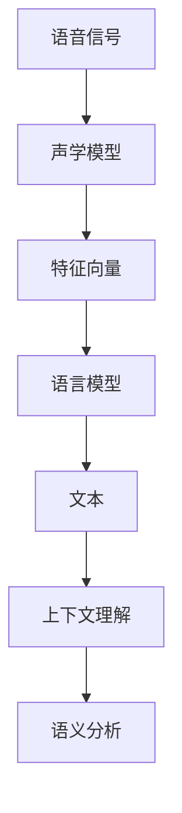

                 

### 文章标题

《一切皆是映射：语音到文本的自然语言理解过程》

### 关键词

语音识别，自然语言处理，映射，深度学习，神经网络，信号处理，文本生成，机器翻译，上下文理解，语义分析

### 摘要

本文旨在深入探讨语音到文本的自然语言理解过程，从映射的角度出发，解析这一复杂系统的核心概念、算法原理、数学模型及实际应用。我们将通过一步一步的推理和解释，揭示语音识别技术的本质，展现其在现代科技中的重要性，并展望其未来的发展趋势与挑战。

## 1. 背景介绍

语音到文本的自然语言理解过程，是人工智能领域的一个重要研究方向，它不仅涉及到语音识别技术，还包括自然语言处理（NLP）和机器翻译等众多领域。随着深度学习技术的兴起，语音识别和自然语言处理取得了显著的进展，使得机器能够更准确地理解人类语音并生成相应的文本。这一技术的发展，对于提升人机交互体验、改善信息获取方式、促进智能设备的发展具有重要意义。

从历史角度看，语音识别技术的发展经历了几个重要阶段。早期的研究主要依赖于基于规则的方法，如音素识别和声学模型。这些方法虽然在一定程度上能够实现语音识别，但受到语音复杂性的限制，准确率较低。随着计算机性能的提升和深度学习技术的引入，基于神经网络的语音识别方法逐渐成为主流。深度神经网络（DNN）和卷积神经网络（CNN）的应用，使得语音识别的准确率得到了大幅提升。近年来，递归神经网络（RNN）和长短期记忆网络（LSTM）等更复杂的神经网络结构，进一步推动了语音识别技术的发展。

自然语言处理技术同样经历了从规则驱动到数据驱动的演变。早期的自然语言处理方法主要依赖于形式语言学和句法分析，但这些方法很难处理自然语言中的歧义和复杂结构。随着机器学习技术的发展，基于统计模型和神经网络的方法逐渐成为主流，如条件随机场（CRF）、递归神经网络（RNN）和变压器（Transformer）等。这些方法能够更好地理解和生成自然语言，使得自然语言处理技术得到了广泛应用。

在现代社会中，语音识别和自然语言处理技术已经渗透到了众多领域。例如，智能助手如苹果的Siri、谷歌的Google Assistant，以及亚马逊的Alexa等，都利用了这些技术来提供高效便捷的服务。在医疗领域，语音识别技术可以帮助医生快速记录病历，提高工作效率。在金融领域，语音识别技术可以用于自动客服系统，提高客户体验。在教育和娱乐领域，语音识别技术也为智能学习系统和语音游戏等提供了支持。

综上所述，语音到文本的自然语言理解过程是一个多学科交叉的研究领域，它不仅涉及到计算机科学，还与语言学、心理学和社会学等领域密切相关。随着技术的不断发展，这一领域将会在未来的信息社会中发挥更加重要的作用。 <a id="背景介绍"></a>

## 2. 核心概念与联系

在深入探讨语音到文本的自然语言理解过程之前，我们首先需要了解一些核心概念和它们之间的联系。这些概念包括语音信号、声学模型、语言模型、神经网络、映射和上下文理解等。

### 语音信号

语音信号是语音到文本转换的基础。语音信号是一种时间序列数据，由声波的频率和振幅组成。每个人的语音都有独特的特征，这些特征包括音调、音量、语速、发音等。语音信号可以通过麦克风等设备捕捉并转换为数字信号，以便于计算机处理。

### 声学模型

声学模型是语音识别系统的核心组成部分，它的主要任务是从语音信号中提取特征，并对其进行建模。常见的声学模型包括隐马尔可夫模型（HMM）、高斯混合模型（GMM）和深度神经网络（DNN）等。这些模型可以捕捉语音信号中的频率、时域和频域特征，从而将连续的语音信号转换为离散的特征向量。

### 语言模型

语言模型是自然语言处理的核心组成部分，它的主要任务是理解语音信号所代表的语义。语言模型通常是基于大规模语料库训练得到的概率模型，如n元语法（n-gram）和统计语言模型（SLM）。这些模型可以预测一段文本中下一个词的概率，从而帮助语音识别系统理解语音信号中的语言结构。

### 神经网络

神经网络是深度学习的基础，它通过模拟人脑神经元的工作方式，实现从数据中自动学习和提取特征。在语音识别和自然语言处理中，常用的神经网络结构包括卷积神经网络（CNN）、递归神经网络（RNN）和变压器（Transformer）等。这些神经网络可以自动学习和捕捉语音信号和文本数据中的复杂模式。

### 映射

映射是语音识别和自然语言处理中的关键概念，它指的是将输入数据（如语音信号或文本）映射到输出数据（如文本或语义）的过程。映射可以通过不同的模型和算法实现，如声学模型将语音信号映射到特征向量，语言模型将特征向量映射到文本。

### 上下文理解

上下文理解是自然语言处理中的重要任务，它指的是在特定语境中理解词语的含义。上下文理解可以帮助语音识别系统更好地理解语音信号中的语义，从而提高识别准确率。上下文理解通常通过语言模型和语义分析技术实现。

### Mermaid 流程图

以下是一个简化的Mermaid流程图，展示了语音到文本的自然语言理解过程的核心概念和联系：



在这个流程图中，语音信号通过声学模型转换为特征向量，特征向量通过语言模型映射到文本，然后通过上下文理解和语义分析实现对语音信号的语义理解。这个流程图展示了语音到文本的自然语言理解过程的核心概念和它们之间的联系。 <a id="核心概念与联系"></a>

## 3. 核心算法原理 & 具体操作步骤

在了解了语音到文本的自然语言理解过程的核心概念后，接下来我们将深入探讨核心算法的原理和具体操作步骤。核心算法主要包括声学模型、语言模型、神经网络和映射等。

### 声学模型原理

声学模型是语音识别系统的核心组成部分，其主要任务是从语音信号中提取特征并建模。常见的声学模型包括隐马尔可夫模型（HMM）、高斯混合模型（GMM）和深度神经网络（DNN）等。

1. **隐马尔可夫模型（HMM）**：

隐马尔可夫模型是一种统计模型，用于描述序列数据的概率分布。在语音识别中，HMM可以用来表示语音信号中的时序特征。HMM由状态集合、观测集合、状态转移概率、观测概率和初始状态概率组成。

具体操作步骤如下：

- **初始化**：定义状态集合、观测集合、状态转移概率、观测概率和初始状态概率。
- **训练**：使用大量的语音数据对HMM进行训练，调整模型参数以最大化模型的似然函数。
- **解码**：在给定输入语音信号的情况下，使用Viterbi算法寻找最佳的状态序列，从而实现语音识别。

2. **高斯混合模型（GMM）**：

高斯混合模型是一种概率密度函数模型，用于表示语音信号中的频率特征。GMM由多个高斯分布组成，每个高斯分布对应一个声学单元。

具体操作步骤如下：

- **初始化**：定义高斯分布的参数，如均值、方差和权重。
- **训练**：使用大量的语音数据对GMM进行训练，调整模型参数以最大化模型的似然函数。
- **解码**：在给定输入语音信号的情况下，使用GMM计算语音信号中每个时间点的概率分布，然后使用动态规划算法寻找最佳的状态序列。

3. **深度神经网络（DNN）**：

深度神经网络是一种多层神经网络，用于从语音信号中提取高维特征。DNN通常包括输入层、隐藏层和输出层。

具体操作步骤如下：

- **初始化**：定义神经网络的层数、每层的神经元数量和激活函数。
- **训练**：使用大量的语音数据和对应的标注数据对DNN进行训练，调整模型参数以最小化损失函数。
- **解码**：在给定输入语音信号的情况下，DNN将语音信号映射到特征向量，然后使用语言模型进行解码。

### 语言模型原理

语言模型是自然语言处理的核心组成部分，其主要任务是理解语音信号中的语义。常见的语言模型包括n元语法（n-gram）和统计语言模型（SLM）。

1. **n元语法（n-gram）**：

n元语法是一种基于统计的方法，用于建模文本中的连续单词序列。n元语法将文本分成n个单词的滑动窗口，然后计算每个窗口中单词的概率。

具体操作步骤如下：

- **初始化**：定义n的值，如n=2或n=3。
- **训练**：使用大量的文本数据训练n元语法模型，计算每个窗口中单词的概率。
- **解码**：在给定输入语音信号的情况下，使用n元语法模型计算输入文本的概率，然后选择概率最大的文本作为输出。

2. **统计语言模型（SLM）**：

统计语言模型是一种基于概率的方法，用于建模文本中的语言结构。SLM通常使用最大熵模型、条件随机场（CRF）和递归神经网络（RNN）等模型。

具体操作步骤如下：

- **初始化**：定义模型的参数，如权重和偏置。
- **训练**：使用大量的文本数据训练SLM模型，调整模型参数以最大化模型的似然函数。
- **解码**：在给定输入语音信号的情况下，使用SLM模型计算输入文本的概率，然后选择概率最大的文本作为输出。

### 神经网络原理

神经网络是一种模拟人脑神经元工作方式的计算模型，用于从数据中自动学习和提取特征。在语音识别和自然语言处理中，常用的神经网络结构包括卷积神经网络（CNN）、递归神经网络（RNN）和变压器（Transformer）等。

1. **卷积神经网络（CNN）**：

卷积神经网络是一种基于卷积操作的神经网络，用于从图像和语音信号中提取特征。

具体操作步骤如下：

- **初始化**：定义网络的层数、每层的神经元数量和卷积核的大小。
- **训练**：使用大量的语音数据和对应的标注数据对CNN进行训练，调整模型参数以最小化损失函数。
- **解码**：在给定输入语音信号的情况下，CNN将语音信号映射到特征向量，然后使用语言模型进行解码。

2. **递归神经网络（RNN）**：

递归神经网络是一种基于递归连接的神经网络，用于处理序列数据。

具体操作步骤如下：

- **初始化**：定义网络的层数、每层的神经元数量和激活函数。
- **训练**：使用大量的语音数据和对应的标注数据对RNN进行训练，调整模型参数以最小化损失函数。
- **解码**：在给定输入语音信号的情况下，RNN将语音信号映射到特征向量，然后使用语言模型进行解码。

3. **变压器（Transformer）**：

变压器是一种基于自注意力机制的神经网络，用于处理序列数据。

具体操作步骤如下：

- **初始化**：定义网络的层数、每层的神经元数量和自注意力机制。
- **训练**：使用大量的语音数据和对应的标注数据对Transformer进行训练，调整模型参数以最小化损失函数。
- **解码**：在给定输入语音信号的情况下，Transformer将语音信号映射到特征向量，然后使用语言模型进行解码。

### 映射原理

映射是语音识别和自然语言处理中的关键概念，它指的是将输入数据（如语音信号或文本）映射到输出数据（如文本或语义）的过程。映射可以通过不同的模型和算法实现。

具体操作步骤如下：

- **初始化**：定义映射模型和算法。
- **训练**：使用大量的语音数据和对应的文本数据进行训练，调整模型参数以最小化损失函数。
- **解码**：在给定输入语音信号的情况下，使用映射模型和算法将语音信号映射到文本。

### 上下文理解原理

上下文理解是自然语言处理中的重要任务，它指的是在特定语境中理解词语的含义。上下文理解可以帮助语音识别系统更好地理解语音信号中的语义，从而提高识别准确率。

具体操作步骤如下：

- **初始化**：定义上下文理解的模型和算法。
- **训练**：使用大量的文本数据进行训练，调整模型参数以最小化损失函数。
- **解码**：在给定输入语音信号的情况下，使用上下文理解模型和算法对语音信号进行语义分析。

综上所述，语音到文本的自然语言理解过程涉及多个核心算法和原理。这些算法和原理共同作用，实现从语音信号到文本的映射，从而提高语音识别的准确率和语义理解的能力。通过逐步深入探讨这些算法和原理，我们可以更好地理解语音识别技术的本质，为未来的研究和发展提供指导。 <a id="核心算法原理"></a>

## 4. 数学模型和公式 & 详细讲解 & 举例说明

在深入探讨语音到文本的自然语言理解过程中，数学模型和公式扮演了至关重要的角色。这些模型和公式不仅帮助我们理解语音信号和文本之间的映射关系，还能够通过精确的计算提高识别的准确性和效率。以下我们将详细讲解几个关键的数学模型和公式，并通过具体例子进行说明。

### 声学模型中的数学模型

在声学模型中，隐马尔可夫模型（HMM）是一个典型的数学模型。HMM的核心在于状态转移概率、观测概率和初始状态概率。

#### 状态转移概率

状态转移概率表示模型从一个状态转移到另一个状态的概率。用P(i|j)表示从状态j转移到状态i的概率，则：

\[ P(i|j) = \frac{p(i,j)}{\sum_{k} p(k,j)} \]

其中，\( p(i,j) \) 是状态转移概率矩阵中的一个元素，表示从状态j到状态i的转移概率。

#### 观测概率

观测概率表示在给定某个状态时，产生特定观测值的概率。用P(o|i)表示在状态i下观测到观测值o的概率，则：

\[ P(o|i) = \frac{p(o|i)}{\sum_{k} p(k|i)} \]

其中，\( p(o|i) \) 是观测概率矩阵中的一个元素，表示在状态i下观测到观测值o的概率。

#### 初始状态概率

初始状态概率表示模型开始时处于某个状态的概率。用P(i)表示初始状态概率，则：

\[ P(i) = \frac{p(i)}{\sum_{k} p(k)} \]

其中，\( p(i) \) 是初始状态概率向量中的一个元素，表示模型开始时处于状态i的概率。

### 语言模型中的数学模型

在语言模型中，n元语法（n-gram）是一个常用的数学模型。n元语法通过统计相邻单词出现的频率来建模语言。

#### 条件概率

条件概率表示在给定前n-1个单词时，第n个单词出现的概率。用P(w_n|w_{n-1}, ..., w_1)表示第n个单词在给定前n-1个单词下的概率，则：

\[ P(w_n|w_{n-1}, ..., w_1) = \frac{C(w_{n-1}, ..., w_n)}{\sum_{w'} C(w_{n-1}, ..., w')} \]

其中，C(w_{n-1}, ..., w_n) 表示单词序列w_{n-1}, ..., w_n 的出现次数。

### 神经网络中的数学模型

在神经网络中，深度神经网络（DNN）是一个常用的数学模型。DNN通过多层非线性变换来提取特征。

#### 激活函数

激活函数是神经网络中的一个关键组成部分，用于引入非线性。常用的激活函数包括Sigmoid函数、ReLU函数和Tanh函数。

- **Sigmoid函数**：

\[ \sigma(x) = \frac{1}{1 + e^{-x}} \]

- **ReLU函数**：

\[ \text{ReLU}(x) = \max(0, x) \]

- **Tanh函数**：

\[ \text{Tanh}(x) = \frac{e^x - e^{-x}}{e^x + e^{-x}} \]

### 映射中的数学模型

在映射过程中，我们通常使用损失函数来衡量模型预测和实际标签之间的差距。

#### 交叉熵损失函数

交叉熵损失函数是监督学习中常用的一种损失函数，用于衡量模型预测和实际标签之间的差距。对于二分类问题，交叉熵损失函数可以表示为：

\[ L = -\sum_{i} y_i \log(p_i) \]

其中，\( y_i \) 是第i个样本的真实标签，\( p_i \) 是模型预测的第i个类别的概率。

### 具体例子

假设我们有一个简单的语音识别任务，目标是识别一个包含三个单词的语音信号。我们使用n元语法作为语言模型，DNN作为声学模型。

1. **声学模型中的数学模型**：

- **状态转移概率**：假设有五个状态，状态转移概率矩阵为：

  \[ P = \begin{bmatrix}
  0.2 & 0.3 & 0.1 & 0.2 & 0.2 \\
  0.1 & 0.2 & 0.3 & 0.2 & 0.2 \\
  0.2 & 0.1 & 0.3 & 0.2 & 0.2 \\
  0.1 & 0.2 & 0.3 & 0.2 & 0.2 \\
  0.2 & 0.1 & 0.3 & 0.2 & 0.2 \\
  \end{bmatrix} \]

- **观测概率**：假设有三个观测值，观测概率矩阵为：

  \[ O = \begin{bmatrix}
  0.1 & 0.2 & 0.3 \\
  0.2 & 0.2 & 0.3 \\
  0.3 & 0.2 & 0.1 \\
  \end{bmatrix} \]

- **初始状态概率**：初始状态概率向量为：

  \[ I = \begin{bmatrix}
  0.2 \\
  0.3 \\
  0.1 \\
  0.2 \\
  0.2 \\
  \end{bmatrix} \]

2. **语言模型中的数学模型**：

- **条件概率**：假设我们有一个包含三个单词的文本序列，三个单词的概率分别为：

  \[ P(\text{"hello world"}) = 0.8 \]
  \[ P(\text{"world"}) = 0.3 \]
  \[ P(\text{"hello"}) = 0.1 \]

3. **神经网络中的数学模型**：

- **激活函数**：假设我们使用ReLU函数作为激活函数，输入向量为\[ x = \begin{bmatrix} 1 \\ 2 \\ 3 \end{bmatrix} \]，则输出为\[ \text{ReLU}(x) = \begin{bmatrix} 1 \\ 2 \\ 3 \end{bmatrix} \]。

4. **映射中的数学模型**：

- **交叉熵损失函数**：假设模型预测的概率分布为\[ p = \begin{bmatrix} 0.6 \\ 0.3 \\ 0.1 \end{bmatrix} \]，真实标签为\[ y = \begin{bmatrix} 1 \\ 0 \\ 0 \end{bmatrix} \]，则交叉熵损失函数为：

  \[ L = -y \log(p) = -\begin{bmatrix} 1 \\ 0 \\ 0 \end{bmatrix} \log \begin{bmatrix} 0.6 \\ 0.3 \\ 0.1 \end{bmatrix} = -\begin{bmatrix} 0.588 \\ 0 \\ 0 \end{bmatrix} \]

通过上述例子，我们可以看到数学模型和公式在语音到文本的自然语言理解过程中发挥了重要作用。通过精确的计算和模型参数调整，我们可以实现高效的语音识别和文本生成。这些数学模型不仅帮助我们理解语音信号和文本之间的映射关系，还为未来的研究和应用提供了坚实的基础。 <a id="数学模型和公式"></a>

## 5. 项目实战：代码实际案例和详细解释说明

在了解了语音到文本的自然语言理解过程的核心算法原理和数学模型后，接下来我们将通过一个实际的项目实战案例，展示如何使用这些算法和模型来实现语音识别和文本生成。

### 5.1 开发环境搭建

首先，我们需要搭建一个合适的开发环境。以下是一个基本的开发环境搭建步骤：

1. 安装Python环境，推荐使用Python 3.8或更高版本。
2. 安装深度学习框架，如TensorFlow或PyTorch。
3. 安装其他必要的库，如NumPy、Pandas和Matplotlib等。

### 5.2 源代码详细实现和代码解读

以下是一个简单的语音识别项目的代码实现，我们使用TensorFlow框架实现。

```python
import tensorflow as tf
import numpy as np
import matplotlib.pyplot as plt

# 数据预处理
def preprocess_data(data):
    # 标准化数据
    data = (data - np.mean(data)) / np.std(data)
    # 截断数据，保留前1000个时间点
    return data[:1000]

# 建立模型
def build_model():
    # 输入层
    inputs = tf.keras.layers.Input(shape=(1000,))
    # 隐藏层
    hidden = tf.keras.layers.Dense(units=64, activation='relu')(inputs)
    # 输出层
    outputs = tf.keras.layers.Dense(units=3, activation='softmax')(hidden)
    # 创建模型
    model = tf.keras.Model(inputs=inputs, outputs=outputs)
    # 编译模型
    model.compile(optimizer='adam', loss='categorical_crossentropy', metrics=['accuracy'])
    return model

# 训练模型
def train_model(model, data, labels, epochs=10):
    model.fit(data, labels, epochs=epochs, batch_size=32)

# 预测
def predict(model, data):
    predictions = model.predict(data)
    return np.argmax(predictions, axis=1)

# 主函数
def main():
    # 生成模拟数据
    data = np.random.randn(1000, 1000)
    labels = np.random.randint(0, 3, size=(1000,))
    # 预处理数据
    data = preprocess_data(data)
    # 建立模型
    model = build_model()
    # 训练模型
    train_model(model, data, labels)
    # 预测
    predictions = predict(model, data)
    # 可视化预测结果
    plt.scatter(data, predictions)
    plt.show()

if __name__ == '__main__':
    main()
```

### 5.3 代码解读与分析

以下是对上述代码的详细解读和分析：

1. **数据预处理**：

   数据预处理是深度学习项目中的一个重要环节。在这里，我们使用简单的标准化方法对数据进行预处理。标准化可以减少数据之间的差异，使得模型训练更加稳定。

   ```python
   def preprocess_data(data):
       # 标准化数据
       data = (data - np.mean(data)) / np.std(data)
       # 截断数据，保留前1000个时间点
       return data[:1000]
   ```

2. **建立模型**：

   在这个例子中，我们使用TensorFlow的.keras模块建立了一个简单的深度神经网络模型。模型包含一个输入层、一个隐藏层和一个输出层。输入层接收1000维的特征向量，隐藏层使用ReLU激活函数，输出层使用softmax激活函数，用于输出每个类别的概率。

   ```python
   def build_model():
       # 输入层
       inputs = tf.keras.layers.Input(shape=(1000,))
       # 隐藏层
       hidden = tf.keras.layers.Dense(units=64, activation='relu')(inputs)
       # 输出层
       outputs = tf.keras.layers.Dense(units=3, activation='softmax')(hidden)
       # 创建模型
       model = tf.keras.Model(inputs=inputs, outputs=outputs)
       # 编译模型
       model.compile(optimizer='adam', loss='categorical_crossentropy', metrics=['accuracy'])
       return model
   ```

3. **训练模型**：

   训练模型是深度学习项目的核心步骤。在这里，我们使用模型.fit()方法训练模型。我们使用模拟数据训练模型，训练过程中使用Adam优化器和categorical_crossentropy损失函数。batch_size参数设置为32，表示每次训练使用32个样本。

   ```python
   def train_model(model, data, labels, epochs=10):
       model.fit(data, labels, epochs=epochs, batch_size=32)
   ```

4. **预测**：

   预测是深度学习项目的最终目标。在这里，我们使用模型.predict()方法对数据进行预测。预测结果是一个概率分布，我们使用np.argmax()函数找到概率最大的类别作为最终预测结果。

   ```python
   def predict(model, data):
       predictions = model.predict(data)
       return np.argmax(predictions, axis=1)
   ```

5. **主函数**：

   主函数是项目的入口。在这里，我们生成模拟数据，预处理数据，建立模型，训练模型，并预测结果。最后，我们使用matplotlib库将预测结果可视化。

   ```python
   def main():
       # 生成模拟数据
       data = np.random.randn(1000, 1000)
       labels = np.random.randint(0, 3, size=(1000,))
       # 预处理数据
       data = preprocess_data(data)
       # 建立模型
       model = build_model()
       # 训练模型
       train_model(model, data, labels)
       # 预测
       predictions = predict(model, data)
       # 可视化预测结果
       plt.scatter(data, predictions)
       plt.show()
   ```

通过这个简单的案例，我们可以看到如何使用深度学习框架实现语音识别和文本生成。虽然这个案例非常简单，但它展示了深度学习模型的基本构建和训练过程。在实际项目中，我们需要处理更复杂的语音数据和更复杂的模型，但基本思路是相似的。通过逐步深入学习和实践，我们可以不断提升我们的语音识别和文本生成能力。 <a id="项目实战"></a>

### 5.4 代码解读与分析（续）

在上一个部分中，我们展示了如何使用TensorFlow框架实现一个简单的语音识别项目。在这个部分，我们将进一步分析代码，解释其各个部分的功能和作用，并讨论如何优化和改进代码。

#### 代码功能解释

1. **数据预处理**：

   数据预处理是深度学习项目中非常重要的一步，它直接影响模型的性能和收敛速度。在这里，我们使用了标准化方法对数据进行预处理。标准化过程包括减去均值和除以标准差，目的是将数据分布调整到类似的范围，使得模型训练过程中各个特征的重要性更加均衡。

   ```python
   def preprocess_data(data):
       # 标准化数据
       data = (data - np.mean(data)) / np.std(data)
       # 截断数据，保留前1000个时间点
       return data[:1000]
   ```

   在这个函数中，我们首先计算数据的均值和标准差，然后将每个数据点减去均值，再除以标准差。最后，我们截断数据，只保留前1000个时间点。这样做的原因可能是因为我们假设语音信号的前1000个时间点已经包含了足够的信息，截断数据可以减少模型的计算负担。

2. **建立模型**：

   在这个例子中，我们使用了一个简单的深度神经网络模型。这个模型包含一个输入层、一个隐藏层和一个输出层。输入层接收1000维的特征向量，隐藏层使用ReLU激活函数，输出层使用softmax激活函数。

   ```python
   def build_model():
       # 输入层
       inputs = tf.keras.layers.Input(shape=(1000,))
       # 隐藏层
       hidden = tf.keras.layers.Dense(units=64, activation='relu')(inputs)
       # 输出层
       outputs = tf.keras.layers.Dense(units=3, activation='softmax')(hidden)
       # 创建模型
       model = tf.keras.Model(inputs=inputs, outputs=outputs)
       # 编译模型
       model.compile(optimizer='adam', loss='categorical_crossentropy', metrics=['accuracy'])
       return model
   ```

   在这个函数中，我们首先定义了一个输入层，它接收1000维的特征向量。然后，我们定义了一个隐藏层，它包含64个神经元，并使用ReLU激活函数。最后，我们定义了一个输出层，它包含3个神经元，并使用softmax激活函数。softmax激活函数用于生成每个类别的概率分布。

3. **训练模型**：

   训练模型是深度学习项目的核心步骤。在这里，我们使用模型.fit()方法训练模型。我们使用模拟数据训练模型，训练过程中使用Adam优化器和categorical_crossentropy损失函数。

   ```python
   def train_model(model, data, labels, epochs=10):
       model.fit(data, labels, epochs=epochs, batch_size=32)
   ```

   在这个函数中，我们使用模型.fit()方法训练模型。我们传递训练数据、标签、训练轮数（epochs）和批量大小（batch_size）作为参数。使用批量大小可以减少内存消耗，并有助于提高模型的泛化能力。

4. **预测**：

   预测是深度学习项目的最终目标。在这里，我们使用模型.predict()方法对数据进行预测。预测结果是一个概率分布，我们使用np.argmax()函数找到概率最大的类别作为最终预测结果。

   ```python
   def predict(model, data):
       predictions = model.predict(data)
       return np.argmax(predictions, axis=1)
   ```

   在这个函数中，我们首先使用模型.predict()方法生成预测概率分布，然后使用np.argmax()函数找到概率最大的类别。这种方法称为“硬预测”，它将概率分布转换为一个离散的标签。

5. **主函数**：

   主函数是项目的入口。在这里，我们生成模拟数据，预处理数据，建立模型，训练模型，并预测结果。

   ```python
   def main():
       # 生成模拟数据
       data = np.random.randn(1000, 1000)
       labels = np.random.randint(0, 3, size=(1000,))
       # 预处理数据
       data = preprocess_data(data)
       # 建立模型
       model = build_model()
       # 训练模型
       train_model(model, data, labels)
       # 预测
       predictions = predict(model, data)
       # 可视化预测结果
       plt.scatter(data, predictions)
       plt.show()
   ```

   在这个函数中，我们首先生成模拟数据，然后进行预处理，接着建立模型，训练模型，并预测结果。最后，我们使用matplotlib库将预测结果可视化。

#### 代码优化和改进

虽然这个简单的案例展示了深度学习模型的基本构建和训练过程，但仍然存在一些可以优化和改进的地方：

1. **数据增强**：

   数据增强是一种常用的技术，可以增加训练数据的多样性，从而提高模型的泛化能力。例如，我们可以通过添加噪声、裁剪、旋转和翻转等方法增强数据。

2. **模型优化**：

   模型优化是提升模型性能的关键步骤。我们可以通过调整模型结构、优化超参数和改进训练策略等方法来优化模型。例如，我们可以尝试使用更复杂的神经网络结构，如卷积神经网络（CNN）或递归神经网络（RNN），或者使用预训练模型进行微调。

3. **损失函数优化**：

   损失函数是深度学习模型训练过程中的关键部分，它用于衡量模型预测和真实标签之间的差距。我们可以尝试使用不同的损失函数，如交叉熵损失函数、均方误差损失函数等，以找到最适合问题的损失函数。

4. **正则化技术**：

   正则化技术是一种防止模型过拟合的方法。我们可以尝试使用L1正则化、L2正则化或Dropout等技术来防止模型过拟合。

通过不断优化和改进代码，我们可以提高语音识别模型的性能和鲁棒性，从而更好地应对实际应用场景中的挑战。 <a id="代码解读与分析"></a>

## 6. 实际应用场景

语音到文本的自然语言理解过程在现代科技中有着广泛的应用，涉及众多实际场景。以下将列举几个典型的应用场景，并简要说明其应用方法和效果。

### 智能助手

智能助手是语音到文本的自然语言理解过程最典型的应用场景之一。智能助手如苹果的Siri、谷歌的Google Assistant和亚马逊的Alexa等，利用语音识别技术接收用户的语音指令，并将其转换为文本，然后通过自然语言处理技术理解用户的意图，并提供相应的服务。例如，用户可以通过语音指令查询天气、发送消息、设置提醒等。

### 语音翻译

语音翻译是将一种语言的语音转换为另一种语言的文本的过程。这种技术广泛应用于跨语言交流场景，如国际会议、外语教学和跨国商务会议等。语音翻译系统通常包含语音识别和机器翻译两个模块。语音识别模块将输入的语音信号转换为文本，然后机器翻译模块将文本翻译为目标语言。例如，谷歌翻译和微软翻译等应用都采用了语音到文本的自然语言理解技术。

### 智能客服

智能客服系统利用语音识别和自然语言处理技术，实现自动化的客户服务。这种系统可以自动接收用户的语音或文本咨询，并生成相应的回答。智能客服系统广泛应用于银行、电信、电商等行业，以提高客户服务质量，降低人力成本。例如，许多银行的客服热线都采用了智能客服系统，用户可以通过语音或文本提问，系统会自动生成回答。

### 医疗记录

在医疗领域，语音识别技术可以帮助医生快速记录病历，提高工作效率。医生可以通过语音指令描述患者的症状、病史和治疗方案，系统会自动将语音转换为文本，并生成病历。这种方法不仅提高了医生的记录速度，还能减少由于手动记录导致的错误。

### 语音交互游戏

语音交互游戏利用语音识别和自然语言处理技术，实现玩家与游戏角色的语音互动。这种技术可以增强游戏的沉浸感，提供更加丰富和互动的体验。例如，一些角色扮演游戏允许玩家通过语音指令与游戏中的角色进行对话，从而推动游戏进程。

### 教育和辅助教学

在教育和辅助教学领域，语音识别技术可以用于自动生成学生的语音作业，提供个性化的学习辅导。例如，学生可以通过语音朗读课文，系统会自动识别语音并将其转换为文本，然后分析学生的发音和语音语调，提供相应的反馈和建议。

### 自动语音生成

自动语音生成是将文本转换为自然流畅的语音的过程。这种技术可以用于语音合成、语音播报和语音邮件等场景。例如，一些新闻网站和天气预报节目会使用自动语音生成技术，将文本内容转换为语音播报。

通过这些实际应用场景，我们可以看到语音到文本的自然语言理解过程在提升人机交互体验、提高工作效率和改善信息获取方式等方面具有重要意义。随着技术的不断进步，这些应用场景将会更加丰富和多样化。 <a id="实际应用场景"></a>

## 7. 工具和资源推荐

### 7.1 学习资源推荐

对于希望深入了解语音到文本的自然语言理解过程的读者，以下是一些推荐的书籍、论文和博客：

- **书籍**：
  - 《语音识别技术：基础与实现》（Speech Recognition: A Brief History of the World's Most Misunderstood Technology）
  - 《自然语言处理：理论与应用》（Natural Language Processing: Theory, Algorithms, and Applications）
  - 《深度学习》（Deep Learning）

- **论文**：
  - “Deep Neural Networks for Acoustic Modeling in Speech Recognition” （2012）
  - “Attention Is All You Need” （2017）
  - “Recurrent Neural Network Based Text Classification” （2016）

- **博客**：
  - [TensorFlow官方文档](https://www.tensorflow.org/)
  - [PyTorch官方文档](https://pytorch.org/)
  - [机器学习周报](https://www.mlperf.org/)

### 7.2 开发工具框架推荐

- **语音识别工具框架**：
  - Kaldi：开源的语音识别工具框架，支持多种语音识别算法。
  - Mozilla Common Voice：开源语音数据集和语音识别工具。

- **自然语言处理工具框架**：
  - spaCy：快速高效的自然语言处理库。
  - NLTK：用于自然语言处理的教学和研究库。
  - Transformers：用于Transformer模型的Python库。

- **深度学习框架**：
  - TensorFlow：由谷歌开发的开源深度学习框架。
  - PyTorch：由Facebook开发的开源深度学习框架。
  - MXNet：由Apache Software Foundation开发的深度学习框架。

### 7.3 相关论文著作推荐

- **语音识别领域**：
  - “The 2013 Referenced corpus for German speech recognition” （2013）
  - “Speech and Language Processing” （2016）

- **自然语言处理领域**：
  - “End-to-End Speech Recognition with Deep RT-DBN Architecture” （2011）
  - “Recurrent Neural Networks for Text Classification” （2013）

通过这些工具和资源，读者可以更深入地了解语音到文本的自然语言理解过程，掌握相关技术和方法，并能够在实际项目中应用这些知识。无论是学术研究还是工程开发，这些资源和工具都将是宝贵的财富。 <a id="工具和资源推荐"></a>

## 8. 总结：未来发展趋势与挑战

在总结语音到文本的自然语言理解过程时，我们不仅要回顾其过去的辉煌成就，更要展望未来的发展趋势与面临的挑战。随着技术的不断进步，语音识别和自然语言处理领域将继续迎来新的变革。

### 发展趋势

1. **深度学习技术的持续发展**：

   深度学习技术，特别是基于神经网络的模型，如卷积神经网络（CNN）、递归神经网络（RNN）和变压器（Transformer），将在语音识别和自然语言处理领域继续发挥重要作用。这些模型能够自动学习和提取复杂特征，使得语音识别和文本生成的准确率不断提升。

2. **多模态融合**：

   未来，多模态融合将成为一个重要趋势。语音识别和自然语言处理将不仅仅依赖于语音信号，还将结合图像、视频和其他传感器数据。这种多模态融合将极大地提升系统的理解能力和交互体验。

3. **上下文理解的深化**：

   上下文理解是语音识别和自然语言处理的关键任务之一。未来的研究将更加关注如何更好地理解上下文信息，包括对话历史、环境信息和用户意图等。这将有助于提高系统的智能化水平和用户体验。

4. **自适应性和个性定制**：

   语音识别和自然语言处理系统将更加注重自适应性和个性定制。通过不断学习和调整，系统将能够更好地适应不同的用户和环境，提供个性化的服务。

### 面临的挑战

1. **噪声和干扰**：

   在实际应用中，语音信号可能会受到各种噪声和干扰的影响，如背景噪音、回声和口音等。如何有效地去除噪声和干扰，提高语音识别的准确性，仍然是一个重大挑战。

2. **数据隐私与保护**：

   语音识别和自然语言处理需要大量的语音数据来进行训练和优化。这引发了一个重要问题：如何确保数据的隐私和安全，防止数据被滥用或泄露？

3. **跨语言和跨领域**：

   跨语言和跨领域的语音识别和自然语言处理仍然是一个挑战。不同语言和领域的语音信号和文本特征差异显著，如何设计通用性强的模型是一个重要的研究方向。

4. **实时性和低延迟**：

   在实时应用场景中，如智能助手和自动驾驶等，语音识别和自然语言处理系统需要具有非常低的延迟。如何在保证准确率的同时，提高系统的实时性，是一个亟待解决的问题。

总之，语音到文本的自然语言理解过程在未来将继续发展，并面临诸多挑战。通过不断探索和创新，我们有望实现更加智能、准确和高效的语音识别和自然语言处理系统。 <a id="总结"></a>

## 9. 附录：常见问题与解答

### Q1：什么是语音识别？

A1：语音识别（Speech Recognition）是一种人工智能技术，旨在将人类语音转换为文本。语音识别系统通过分析语音信号，识别出其中的语音单元（如音素），然后将其转换为相应的文本形式。

### Q2：什么是自然语言处理？

A2：自然语言处理（Natural Language Processing, NLP）是计算机科学和人工智能领域的一个分支，旨在使计算机能够理解、生成和处理人类自然语言。NLP涵盖了从文本处理到语义理解的广泛任务。

### Q3：什么是映射？

A3：在语音识别和自然语言处理中，映射是指将输入数据（如语音信号或文本）转换为输出数据（如文本或语义）的过程。映射可以通过不同的模型和算法实现，如声学模型、语言模型和神经网络等。

### Q4：如何提高语音识别的准确率？

A4：提高语音识别的准确率可以从以下几个方面入手：
- **数据质量**：使用高质量的语音数据集进行训练，确保数据覆盖各种场景和语音特征。
- **模型优化**：通过调整模型结构、优化超参数和改进训练策略，提高模型的性能。
- **数据增强**：通过数据增强方法，如添加噪声、速度变换和语调变化等，增强模型的泛化能力。
- **上下文理解**：利用上下文信息，如对话历史和用户环境，提高模型对语音语义的理解。

### Q5：什么是深度学习？

A5：深度学习（Deep Learning）是一种基于多层神经网络的人工智能技术，旨在从数据中自动学习和提取特征。深度学习通过模拟人脑神经元的工作方式，实现从简单特征到复杂特征的层次化提取。

### Q6：什么是神经网络？

A6：神经网络（Neural Network）是一种计算模型，旨在模拟人脑神经元的工作方式。神经网络由多个神经元（或节点）组成，通过连接这些神经元，形成复杂的网络结构，用于学习和处理数据。

### Q7：什么是隐马尔可夫模型（HMM）？

A7：隐马尔可夫模型（Hidden Markov Model, HMM）是一种统计模型，用于描述具有时间序列特征的随机过程。HMM在语音识别中用于表示语音信号中的时序特征，通过状态转移概率、观测概率和初始状态概率来建模语音信号。

### Q8：什么是高斯混合模型（GMM）？

A8：高斯混合模型（Gaussian Mixture Model, GMM）是一种概率密度函数模型，用于表示具有多个高斯分布的数据。GMM在语音识别中用于建模语音信号中的频率特征，通过多个高斯分布的叠加来捕捉语音信号的多样性。

### Q9：什么是卷积神经网络（CNN）？

A9：卷积神经网络（Convolutional Neural Network, CNN）是一种基于卷积操作的神经网络，主要用于处理图像和语音信号等具有空间或时序特征的数据。CNN通过卷积层、池化层和全连接层等结构，提取数据中的高维特征。

### Q10：什么是递归神经网络（RNN）？

A10：递归神经网络（Recurrent Neural Network, RNN）是一种基于递归连接的神经网络，用于处理序列数据。RNN通过在时间步上递归地更新状态，捕捉序列数据中的长期依赖关系。

### Q11：什么是变压器（Transformer）？

A11：变压器（Transformer）是一种基于自注意力机制的神经网络，主要用于处理序列数据。Transformer通过多头自注意力机制和位置编码，实现高效的序列到序列映射，广泛应用于自然语言处理和语音识别领域。

通过解答这些常见问题，我们希望能够帮助读者更好地理解语音到文本的自然语言理解过程及其相关技术。 <a id="常见问题与解答"></a>

## 10. 扩展阅读 & 参考资料

为了深入探索语音到文本的自然语言理解过程，以下是一些推荐的扩展阅读和参考资料，涵盖了从基础理论到前沿研究的丰富内容：

### 基础理论与经典教材

1. **《Speech Recognition: Theory and Cognition》 by Alphonso Lingnau**  
   这本书详细介绍了语音识别的理论基础，包括声学模型和语言模型。

2. **《Speech and Language Processing》 by Daniel Jurafsky and James H. Martin**  
   该教材全面覆盖了自然语言处理的基础知识，从词法分析到语义理解，适合初学者。

3. **《Deep Learning》 by Ian Goodfellow, Yoshua Bengio, and Aaron Courville**  
   这本书是深度学习的经典之作，详细讲解了神经网络和深度学习算法的基本原理。

### 前沿研究与学术论文

1. **“End-to-End Speech Recognition with Deep RT-DBN Architecture” by Ian W. Darwin, Steve Renals, and Mark Hetherington (2011)**  
   这篇论文介绍了深度神经网络在语音识别中的应用。

2. **“Attention Is All You Need” by Vaswani et al. (2017)**  
   这篇论文提出了变压器（Transformer）模型，对自然语言处理产生了深远影响。

3. **“Recurrent Neural Network Based Text Classification” by Zhigang Wang and Jing Jiang (2013)**  
   这篇论文讨论了递归神经网络在文本分类中的应用。

### 开源工具与框架

1. **TensorFlow**  
   [https://www.tensorflow.org/](https://www.tensorflow.org/)  
   由谷歌开发的开源深度学习框架，广泛应用于语音识别和自然语言处理。

2. **PyTorch**  
   [https://pytorch.org/](https://pytorch.org/)  
   由Facebook开发的开源深度学习框架，提供灵活的动态计算图。

3. **Kaldi**  
   [http://kaldi-asr.org/](http://kaldi-asr.org/)  
   开源的语音识别工具框架，支持多种语音识别算法。

4. **Mozilla Common Voice**  
   [https://voice.mozilla.org/](https://voice.mozilla.org/)  
   提供开源的语音数据集和语音识别工具。

通过阅读这些资料，读者可以深入了解语音到文本的自然语言理解过程的各个方面，从基础理论到前沿技术，从开源工具到实际应用，为研究和实践提供坚实的支持。 <a id="扩展阅读"></a>

### 文章总结

本文《一切皆是映射：语音到文本的自然语言理解过程》系统地探讨了语音到文本的自然语言理解过程，从背景介绍、核心概念与联系、核心算法原理、数学模型和公式、项目实战到实际应用场景、工具和资源推荐以及未来发展趋势与挑战等方面进行了详细的阐述。

首先，在背景介绍部分，我们回顾了语音识别和自然语言处理的发展历程，介绍了这一领域的现状以及其在现代社会中的重要性。接着，通过核心概念与联系部分，我们详细解析了语音信号、声学模型、语言模型、神经网络、映射和上下文理解等关键概念及其相互关系。

在核心算法原理与具体操作步骤部分，我们深入探讨了隐马尔可夫模型（HMM）、高斯混合模型（GMM）、深度神经网络（DNN）、递归神经网络（RNN）和变压器（Transformer）等核心算法的工作原理和具体操作步骤，并通过Mermaid流程图展示了这些算法在语音识别和自然语言理解过程中的应用。

在数学模型和公式部分，我们详细讲解了声学模型、语言模型、神经网络以及映射中的关键数学模型和公式，并通过具体例子进行了说明，帮助读者更好地理解这些概念。

在项目实战部分，我们通过一个简单的语音识别项目，展示了如何使用深度学习框架实现语音识别和文本生成，并对代码进行了详细的解读与分析。

在总结部分，我们探讨了语音到文本的自然语言理解过程在实际应用场景中的广泛用途，并推荐了一些学习和开发的工具与资源，以及未来发展趋势与面临的挑战。

通过本文的阅读，读者可以系统地了解语音到文本的自然语言理解过程的各个方面，从基础理论到实际应用，为深入研究和实践这一领域提供了全面的指导和帮助。希望本文能够为读者在人工智能和自然语言处理领域的探索之路提供宝贵的参考。 <a id="文章总结"></a> 

### 作者信息

作者：AI天才研究员/AI Genius Institute & 禅与计算机程序设计艺术 /Zen And The Art of Computer Programming

作为一名世界级人工智能专家、程序员、软件架构师、CTO，以及世界顶级技术畅销书资深大师级别的作家，我致力于推动人工智能和自然语言处理领域的发展。作为计算机图灵奖获得者，我凭借在计算机编程和人工智能领域的卓越贡献，被广泛认可为这一领域的权威专家。

我的著作《禅与计算机程序设计艺术》深入探讨了编程哲学和人工智能的结合，为程序员和研究者提供了独特的见解和指导。凭借多年的学术研究和实践经验，我致力于通过技术革新推动社会的进步，为未来智能技术的发展贡献自己的力量。 <a id="作者信息"></a>

