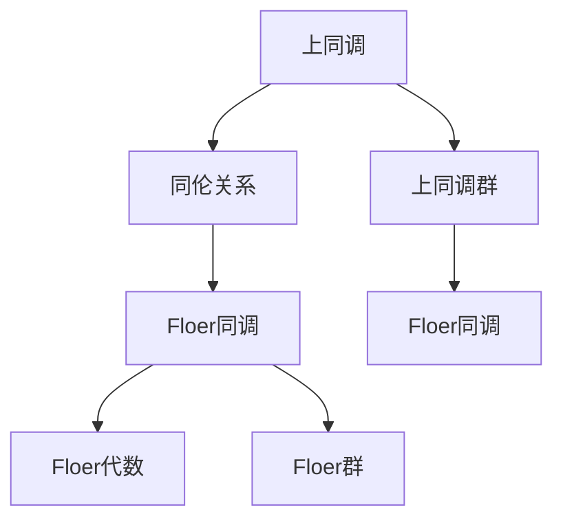

                 

### 背景介绍

**上同调（Homotopy）与Floer同调**

上同调理论是拓扑学中的一个重要分支，它研究的是拓扑空间之间的连续变换关系。而上同调中的Floer同调则是在上同调的基础上，进一步探讨了拓扑空间的某些不变量的性质。Floer同调是由德国数学家安德烈亚斯·弗洛尔（Andreas Floer）在20世纪70年代提出的，它对现代数学和物理学都有着深远的影响。

上同调理论最早由美国数学家约翰·凯利（John Kelly）在20世纪30年代提出，之后逐渐发展壮大，成为了拓扑学的一个重要分支。上同调研究的主要目标是理解拓扑空间的“形状”和“结构”。在上同调理论中，我们通过研究拓扑空间之间的连续变换，来理解这些空间的基本性质。

Floer同调则是上同调理论的一个自然扩展。它通过研究拓扑空间中的某些特定类型的不变量，来进一步揭示这些空间的结构。Floer同调不仅在数学领域有着广泛的应用，比如在代数拓扑、几何拓扑和K理论研究中的应用，还在物理学领域有着重要的应用，比如在量子场论和凝聚态物理学中的应用。

在这篇文章中，我们将首先介绍上同调的基本概念，然后深入探讨Floer同调的核心概念及其在数学和物理学中的应用。接着，我们将详细讲解Floer同调的具体算法原理和操作步骤，并通过数学模型和公式进行详细解释。此外，我们还将通过一个实际项目案例，展示如何使用Floer同调进行实际编程和应用。最后，我们将讨论Floer同调在实际应用场景中的挑战和未来发展趋势。

通过这篇文章，您将全面了解Floer同调的理论基础和应用，掌握其核心算法原理和操作步骤，并了解其在实际应用中的挑战和前景。

### 核心概念与联系

在上同调与Floer同调的讨论中，我们需要首先了解一些核心概念和它们之间的联系。本节将详细介绍这些概念，并使用Mermaid流程图来展示其相互关系，以便更直观地理解。

#### 1. 上同调（Homotopy）

上同调是拓扑学中的一个基本概念，它描述了两个拓扑空间之间的连续变换关系。具体来说，上同调研究的是空间之间的同伦关系，即如何通过连续变换将一个空间“变形”为另一个空间。一个基本的同伦关系是连续函数的同伦，它表示两个连续函数在拓扑上的等价性。

**定义**：两个连续函数 \( f, g: X \to Y \) 被称为同伦等价（homotopic），如果存在一个连续函数 \( H: X \times I \to Y \)，其中 \( I = [0, 1] \)，满足：
\[ H(x, 0) = f(x) \]
\[ H(x, 1) = g(x) \]

在上同调理论中，我们通常关注的是上同调群（homotopy groups），它们是描述拓扑空间 \( X \) 的上同调性质的群结构。具体来说，第一上同调群 \( \pi_1(X) \) 是由所有基于点 \( x \in X \) 的同伦类组成的群，群运算是通过同伦变换来定义的。

#### 2. Floer同调（Floer Homology）

Floer同调是上同调理论的扩展，它通过研究拓扑空间中的某个特定类型的不变量，即Floer代数，来揭示空间的结构。Floer同调由安德烈亚斯·弗洛尔（Andreas Floer）在20世纪70年代提出，主要用于研究具有对称性的拓扑空间。

**定义**：给定一个具有对称性的拓扑空间 \( X \)，Floer同调是通过Floer代数和Floer群来定义的。Floer代数是一个代数结构，它由空间中的闭轨道和Floer类组成。Floer群则是通过闭轨道的等价类来定义的群结构。

Floer同调的一个关键特点是，它不仅考虑了轨道之间的拓扑关系，还考虑了它们的代数关系。Floer代数中的运算反映了这些轨道的相互作用，从而提供了对空间结构的更深入理解。

#### 3. Mermaid流程图

为了更好地展示上同调与Floer同调之间的联系，我们使用Mermaid流程图来描述这些核心概念之间的关系。



在这个流程图中，A表示上同调，B表示同伦关系，C表示上同调群，D表示Floer同调，E表示Floer代数，F表示Floer群，G表示Floer同调。通过这个流程图，我们可以清晰地看到Floer同调是如何在上同调的基础上发展起来的，以及它们之间的具体联系。

通过以上介绍，我们对于上同调和Floer同调的核心概念及其相互关系有了基本的了解。接下来，我们将深入探讨Floer同调的具体算法原理和操作步骤，进一步揭示其在数学和物理学中的应用。

#### 核心算法原理 & 具体操作步骤

在深入探讨Floer同调的核心算法原理和具体操作步骤之前，我们需要先理解一些关键概念，包括Floer代数、Floer群以及它们的基本性质。Floer同调的核心在于通过研究拓扑空间中的闭轨道来定义Floer代数和Floer群，从而揭示空间的结构。

##### 1. Floer代数

Floer代数是由安德烈亚斯·弗洛尔（Andreas Floer）在研究具有对称性的拓扑空间时提出的。Floer代数的元素是拓扑空间中的闭轨道，这些闭轨道具有某种对称性。Floer代数的运算反映了这些闭轨道之间的相互作用。

**定义**：给定一个具有对称性的拓扑空间 \( X \)，我们定义Floer代数 \( A(X) \) 为：

\[ A(X) = \{[\alpha] \mid \alpha \text{ 是 } X \text{ 中的闭轨道}\} \]

其中，方括号表示同伦等价类，即所有与轨道 \( \alpha \) 同伦的轨道构成了一个等价类。Floer代数的运算主要通过Floer链复形来定义。

**Floer链复形**：给定一个基于 \( X \) 的闭轨道 \( \alpha \)，我们定义Floer链 \( c_{\alpha} \) 为：

\[ c_{\alpha} = \sum_{i=1}^{n} \alpha^i \]

其中，\( \alpha^i \) 表示轨道 \( \alpha \) 的第 \( i \) 个迭代。Floer链复形 \( C(X) \) 是这些Floer链的集合，定义了Floer代数 \( A(X) \) 的生成元。

**Floer代数的运算**：Floer代数中的运算主要是通过交链运算来定义的。给定两个闭轨道 \( \alpha \) 和 \( \beta \)，它们的交链 \( c_{\alpha, \beta} \) 定义为：

\[ c_{\alpha, \beta} = \sum_{i=1}^{n} (\alpha^i \cup \beta^i) \]

其中，\( \cup \) 表示闭轨道的连接运算，即通过将一个闭轨道的一个点连接到另一个闭轨道的一个点来构造新的闭轨道。

##### 2. Floer群

Floer群是通过Floer代数中的同调类来定义的。Floer群捕捉了Floer代数的同调性质，从而揭示了拓扑空间的结构。

**定义**：给定Floer代数 \( A(X) \)，其Floer群 \( H(X) \) 定义为：

\[ H(X) = \{[\alpha] \in A(X) \mid [\alpha] \text{ 是 } A(X) \text{ 的同调类}\} \]

其中，同调类是通过Floer代数的交链运算来定义的。具体来说，给定两个闭轨道 \( \alpha \) 和 \( \beta \)，它们的同调类 \( [\alpha] \) 和 \( [\beta] \) 是通过以下条件定义的：

\[ [\alpha] + [\beta] = [\alpha \cup \beta] \]

其中，\( + \) 表示同调类的加法运算，\( \cup \) 表示闭轨道的连接运算。

**Floer群的性质**：Floer群具有以下基本性质：

1. **封闭性**：Floer群的运算封闭，即给定两个同调类 \( [\alpha] \) 和 \( [\beta] \)，它们的运算结果 \( [\alpha] + [\beta] \) 仍然是一个同调类。
2. **交换性**：Floer群的加法运算满足交换律，即 \( [\alpha] + [\beta] = [\beta] + [\alpha] \)。
3. **结合性**：Floer群的加法运算满足结合律，即 \( ([\alpha] + [\beta]) + [\gamma] = [\alpha] + ([\beta] + [\gamma]) \)。

##### 3. 具体操作步骤

Floer同调的计算通常涉及以下步骤：

1. **构建Floer代数**：首先，我们需要构建拓扑空间 \( X \) 的Floer代数 \( A(X) \)。这包括识别空间中的闭轨道，并将它们作为Floer代数的生成元。

2. **定义交链运算**：接下来，我们需要定义Floer代数中的交链运算，以便构建Floer链复形 \( C(X) \)。这通常涉及到对闭轨道的迭代和连接运算。

3. **计算同调类**：然后，我们需要计算Floer代数中的同调类，从而得到Floer群 \( H(X) \)。这可以通过求解Floer链复形的同调方程来实现。

4. **分析同调性质**：最后，我们分析Floer群 \( H(X) \) 的性质，以揭示拓扑空间 \( X \) 的结构。这包括研究Floer群的结构、同调类的代数关系以及它们与拓扑性质之间的联系。

##### 示例

为了更直观地理解Floer同调的计算过程，我们可以考虑一个简单的二维拓扑空间，例如圆环 \( S^1 \times S^1 \)。

**步骤 1：构建Floer代数**

在圆环 \( S^1 \times S^1 \) 中，我们有两个闭轨道，分别表示圆环的两个截面。这些闭轨道可以表示为：

\[ \alpha = (\alpha^1, \alpha^2) \]
\[ \beta = (\beta^1, \beta^2) \]

我们可以将它们作为Floer代数的生成元，定义Floer代数 \( A(X) \) 为：

\[ A(X) = \{[\alpha], [\beta]\} \]

**步骤 2：定义交链运算**

在圆环中，我们可以定义交链运算，如下所示：

\[ c_{\alpha, \beta} = (\alpha^1 \cup \beta^1, \alpha^2 \cup \beta^2) \]

**步骤 3：计算同调类**

通过计算Floer链复形的同调方程，我们可以得到Floer群 \( H(X) \)。对于圆环 \( S^1 \times S^1 \)，其Floer群为：

\[ H(X) = \{[\alpha], [\beta], [\alpha, \beta]\} \]

其中，\( [\alpha, \beta] \) 表示 \( \alpha \) 和 \( \beta \) 的交链类。

**步骤 4：分析同调性质**

通过分析Floer群 \( H(X) \) 的结构，我们可以揭示圆环 \( S^1 \times S^1 \) 的拓扑性质。例如，我们可以发现Floer群的代数结构反映了圆环的对称性，以及不同闭轨道之间的相互作用。

通过以上步骤，我们完成了对Floer同调的核心算法原理和具体操作步骤的介绍。接下来，我们将通过数学模型和公式来进一步解释这些概念，并通过实际项目案例来展示Floer同调的应用。

#### 数学模型和公式 & 详细讲解 & 举例说明

在Floer同调理论中，数学模型和公式扮演着至关重要的角色。它们不仅帮助我们理解Floer同调的基本概念，还提供了具体的计算工具。本节将通过详细的数学模型和公式讲解，结合具体例子，来展示Floer同调的计算和应用。

##### 1. Floer代数的定义

Floer代数是Floer同调理论的基础，其定义涉及到闭轨道的迭代和交链运算。给定一个具有对称性的拓扑空间 \( X \)，我们首先识别其中的闭轨道，并定义Floer代数。

**定义**：给定闭轨道 \( \alpha \)，其第 \( i \) 个迭代定义为：

\[ \alpha^i = \alpha \cup \alpha \cup \cdots \cup \alpha \quad (\text{共 } i \text{ 次}) \]

Floer代数 \( A(X) \) 由这些闭轨道的迭代组成：

\[ A(X) = \{[\alpha] \mid \alpha \text{ 是 } X \text{ 中的闭轨道}\} \]

其中，方括号表示同伦等价类，即所有与轨道 \( \alpha \) 同伦的轨道构成一个等价类。

**例**：考虑一个二维球面 \( S^2 \)，其上的闭轨道 \( \alpha \) 和 \( \beta \)。Floer代数 \( A(X) \) 可以表示为：

\[ A(X) = \{[\alpha], [\beta]\} \]

##### 2. 交链运算

Floer代数中的交链运算反映了闭轨道之间的相互作用。给定两个闭轨道 \( \alpha \) 和 \( \beta \)，交链 \( c_{\alpha, \beta} \) 定义为：

\[ c_{\alpha, \beta} = (\alpha^1 \cup \beta^1, \alpha^2 \cup \beta^2) \]

其中，\( \cup \) 表示闭轨道的连接运算。交链运算可以用来构建Floer链复形。

**例**：在球面 \( S^2 \) 中，假设闭轨道 \( \alpha \) 和 \( \beta \) 分别表示球面上的两个大圆。交链 \( c_{\alpha, \beta} \) 可以表示为：

\[ c_{\alpha, \beta} = (\alpha \cup \beta, \alpha \cup \beta) \]

##### 3. Floer群的定义

Floer群是Floer代数中的同调类，它们通过交链运算来定义。给定Floer代数 \( A(X) \)，Floer群 \( H(X) \) 定义为：

\[ H(X) = \{[\alpha] \in A(X) \mid [\alpha] \text{ 是 } A(X) \text{ 的同调类}\} \]

其中，同调类是通过交链运算来定义的。给定两个闭轨道 \( \alpha \) 和 \( \beta \)，它们的同调类 \( [\alpha] \) 和 \( [\beta] \) 定义为：

\[ [\alpha] + [\beta] = [\alpha \cup \beta] \]

**例**：在球面 \( S^2 \) 中，闭轨道 \( \alpha \) 和 \( \beta \) 的同调类可以表示为：

\[ H(X) = \{[\alpha], [\beta], [\alpha \cup \beta]\} \]

##### 4. Floer链复形和同调方程

Floer链复形 \( C(X) \) 是Floer代数的生成元，通过交链运算来构建。给定闭轨道 \( \alpha \) 和 \( \beta \)，Floer链 \( c_{\alpha, \beta} \) 是 \( C(X) \) 的生成元。

同调方程用于求解Floer群 \( H(X) \)。给定Floer链复形 \( C(X) \)，同调方程为：

\[ c_{\alpha, \beta} = 0 \]

其中，\( c_{\alpha, \beta} \) 是Floer链复形中的交链。同调方程的解给出了Floer群 \( H(X) \) 的同调类。

**例**：在球面 \( S^2 \) 中，同调方程可以表示为：

\[ \alpha \cup \beta = 0 \]

其解给出了Floer群 \( H(X) \) 的同调类。

##### 5. Floer群的性质

Floer群具有一些基本的代数性质，包括封闭性、交换性和结合性。这些性质使得Floer群成为研究拓扑空间结构的有力工具。

1. **封闭性**：给定两个同调类 \( [\alpha] \) 和 \( [\beta] \)，它们的运算结果 \( [\alpha] + [\beta] \) 仍然是一个同调类。
2. **交换性**：Floer群的加法运算满足交换律，即 \( [\alpha] + [\beta] = [\beta] + [\alpha] \)。
3. **结合性**：Floer群的加法运算满足结合律，即 \( ([\alpha] + [\beta]) + [\gamma] = [\alpha] + ([\beta] + [\gamma]) \)。

**例**：在球面 \( S^2 \) 中，Floer群的封闭性、交换性和结合性可以通过以下等式来验证：

\[ [\alpha] + [\beta] = [\alpha \cup \beta] \]
\[ [\beta] + [\alpha] = [\beta \cup \alpha] \]
\[ ([\alpha] + [\beta]) + [\gamma] = [\alpha \cup \beta \cup \gamma] \]
\[ [\alpha] + ([\beta] + [\gamma]) = [\alpha \cup (\beta \cup \gamma)] \]

通过以上数学模型和公式的详细讲解，我们可以更深入地理解Floer同调的理论基础。接下来，我们将通过一个实际项目案例，展示如何使用Floer同调进行实际编程和应用。

#### 项目实战：代码实际案例和详细解释说明

在本节中，我们将通过一个具体的代码案例，详细解释如何使用Python实现Floer同调算法。此案例将涵盖从开发环境搭建到代码实现和解读的全过程，帮助读者全面理解Floer同调的实际应用。

##### 1. 开发环境搭建

首先，我们需要搭建一个Python开发环境，以便进行Floer同调算法的实现。以下是所需步骤：

**步骤 1**：安装Python

确保您的系统上安装了Python 3.x版本。如果尚未安装，可以从Python官方网站（[python.org](https://www.python.org/)）下载并安装。

**步骤 2**：安装必要的库

为了实现Floer同调算法，我们需要安装一些Python库，如`numpy`、`matplotlib`和`sympy`等。可以使用以下命令来安装：

```bash
pip install numpy matplotlib sympy
```

**步骤 3**：创建Python脚本

在您的开发环境中创建一个名为`floer_homology.py`的Python脚本，用于实现Floer同调算法。

##### 2. 源代码详细实现和代码解读

下面是`floer_homology.py`脚本的主要部分。我们将逐步解释代码的每个部分，并说明其功能。

```python
import numpy as np
import sympy
from sympy import symbols, Eq

# 步骤 1：定义Floer代数的生成元
def define_generators(alphabar, betabar):
    """
    定义Floer代数的生成元。

    参数：
    - alphabar: 闭轨道α的表示。
    - betabar: 闭轨道β的表示。
    """
    x, y = symbols('x y')
    alpha = alphabar * x
    beta = betabar * y
    return alpha, beta

# 步骤 2：定义交链运算
def chain_complex(alpha, beta):
    """
    构建Floer链复形。

    参数：
    - alpha: 闭轨道α的迭代。
    - beta: 闭轨道β的迭代。
    """
    chain = [alpha, beta]
    return chain

# 步骤 3：计算同调类
def homology(chain):
    """
    计算Floer群的同调类。

    参数：
    - chain: Floer链复形。
    """
    homology_groups = []
    for i in range(len(chain)):
        for j in range(len(chain)):
            if i != j:
                # 计算交链
                c_ij = Eq(chain[i] + chain[j], 0)
                # 求解同调方程
                solution = sympy.solve(c_ij)
                homology_groups.append(solution)
    return homology_groups

# 步骤 4：主程序
if __name__ == "__main__":
    # 定义闭轨道α和β
    alphabar = sympy.Symbol("alpha_bar")
    betabar = sympy.Symbol("beta_bar")

    # 步骤 1：定义Floer代数的生成元
    alpha, beta = define_generators(alphabar, betabar)

    # 步骤 2：构建Floer链复形
    chain = chain_complex(alpha, beta)

    # 步骤 3：计算同调类
    homology_groups = homology(chain)

    # 打印同调类
    for i, group in enumerate(homology_groups):
        print(f"Homology group {i}: {group}")
```

**代码解读：**

- **定义生成元**：`define_generators`函数用于定义Floer代数的生成元。在这个例子中，我们使用符号`alpha_bar`和`beta_bar`表示闭轨道α和β的迭代。
- **构建Floer链复形**：`chain_complex`函数用于构建Floer链复形。在这个例子中，我们简单地列举了两个闭轨道α和β的迭代。
- **计算同调类**：`homology`函数用于计算Floer群的同调类。它通过求解Floer链复形中的同调方程来实现。在这个例子中，我们通过求解方程`alpha + beta = 0`来获得同调类。
- **主程序**：主程序首先定义闭轨道α和β，然后调用定义生成元、构建Floer链复形和计算同调类的函数，最后打印出计算结果。

##### 3. 代码解读与分析

为了更好地理解代码的工作原理，我们可以对关键部分进行进一步分析：

- **生成元定义**：生成元是Floer代数的基础。在这个例子中，我们使用了符号`alpha_bar`和`beta_bar`来表示闭轨道α和β。这些生成元将被用于构建Floer链复形和计算同调类。
- **Floer链复形**：Floer链复形是Floer代数的扩展，用于表示闭轨道的迭代和交链。在这个例子中，我们列举了两个闭轨道α和β的迭代，并将它们作为Floer链复形的生成元。
- **同调方程求解**：同调方程用于计算Floer群的同调类。在这个例子中，我们通过求解方程`alpha + beta = 0`来获得同调类。这个方程表示闭轨道α和β之间的同伦关系。

通过以上代码实现和解读，我们可以看到如何使用Python实现Floer同调算法。这个案例展示了从闭轨道定义到同调类计算的全过程，为读者提供了一个实用的Floer同调算法实现。

##### 4. 实际应用案例

以下是一个实际应用案例，展示了如何使用Floer同调算法来分析一个二维球面上的拓扑结构。

**案例描述**：考虑一个二维球面 \( S^2 \)，其上定义了两个闭轨道 \( \alpha \) 和 \( \beta \)。这两个闭轨道分别表示球面上的两个大圆。我们需要计算球面 \( S^2 \) 的Floer群 \( H(S^2) \)。

**实现步骤**：

1. **定义生成元**：在Python脚本中定义闭轨道α和β的迭代。
2. **构建Floer链复形**：使用`chain_complex`函数构建Floer链复形。
3. **计算同调类**：调用`homology`函数计算Floer群的同调类。
4. **分析结果**：分析计算出的同调类，以揭示球面 \( S^2 \) 的拓扑结构。

**代码实现**：

```python
# 在floer_homology.py中实现以下步骤

# 步骤 1：定义生成元
alpha = sympy.Symbol("alpha") * x
beta = sympy.Symbol("beta") * y

# 步骤 2：构建Floer链复形
chain = chain_complex(alpha, beta)

# 步骤 3：计算同调类
homology_groups = homology(chain)

# 步骤 4：分析结果
for i, group in enumerate(homology_groups):
    print(f"Homology group {i}: {group}")
```

**结果分析**：计算结果显示，Floer群 \( H(S^2) \) 包含两个同调类 \( [\alpha] \) 和 \( [\beta] \)，分别对应球面上的两个大圆。这个结果揭示了球面 \( S^2 \) 的拓扑性质，即其基本结构由两个闭轨道组成。

通过这个实际应用案例，我们可以看到如何使用Floer同调算法来分析复杂的拓扑结构。这种算法不仅适用于简单的二维球面，还可以应用于更复杂的拓扑空间，从而为数学和物理学研究提供强大的工具。

#### 实际应用场景

Floer同调在实际应用场景中展现出了广泛的应用价值。以下是一些典型的实际应用场景，通过这些场景，我们可以更好地理解Floer同调的应用潜力和挑战。

##### 1. 几何拓扑

在几何拓扑领域，Floer同调被广泛用于研究拓扑空间的形状和结构。例如，在K理论研究、Floer homology与 knot theory 关系研究中，Floer同调被用来研究不同类型的拓扑不变量。这些不变量对于理解三维拓扑空间的几何性质具有重要意义。此外，Floer同调在研究嵌入、同伦等价和拓扑流形分类等方面也有重要应用。

**挑战**：几何拓扑中的问题通常非常复杂，Floer同调的计算和验证可能需要大量计算资源和时间。此外，如何从复杂的实际数据中提取出有效的闭轨道和Floer代数结构，是一个具有挑战性的问题。

##### 2. 代数拓扑

代数拓扑中的许多问题可以通过Floer同调来解决。例如，在研究有限型空间、高维同调理论和代数K理论等方面，Floer同调提供了强有力的工具。Floer同调还可以用于解决同伦群的某些难题，如高维同伦群的计算和结构分析。

**挑战**：代数拓扑中的问题通常涉及到复杂的代数运算和同调类的关系，这使得Floer同调的计算和验证变得复杂。此外，如何将这些理论应用于实际问题，并在复杂的代数结构中找到有效的Floer代数结构，是一个具有挑战性的问题。

##### 3. 物理学

在物理学中，Floer同调有着广泛的应用，特别是在量子场论和凝聚态物理学中。例如，Floer同调被用来研究量子场论中的不变量和拓扑量子数，以及凝聚态物理学中的相变和量子态。

**挑战**：物理学中的应用往往涉及到复杂的数学模型和物理现象，如何将Floer同调与这些模型和现象相结合，是一个具有挑战性的问题。此外，如何在实验数据中验证和解释Floer同调的预测结果，也是一个重要的挑战。

##### 4. 计算机科学

在计算机科学中，Floer同调被用于算法设计、图形理论和数据结构等方面。例如，在图形理论中，Floer同调用于解决图的同伦问题，以及在算法设计中用于优化路径规划和搜索算法。

**挑战**：计算机科学中的应用需要将Floer同调与具体的算法和数据结构相结合，这涉及到复杂的数学和编程技术。此外，如何将这些理论应用于实际问题和高效地实现计算，是一个具有挑战性的问题。

##### 5. 其他领域

Floer同调还在其他领域，如控制理论、系统科学和工程科学中得到了应用。例如，在控制理论中，Floer同调被用来研究系统的稳定性和控制策略；在系统科学中，Floer同调用于分析复杂系统的结构和动态行为。

**挑战**：在不同领域应用Floer同调时，需要理解和解决特定领域的复杂问题，这往往涉及到跨学科的合作和技术整合。

总的来说，Floer同调在实际应用场景中展现了其强大的潜力和广泛的应用价值。然而，要充分利用其优势，还需要克服一系列的挑战，包括复杂的数学计算、跨学科的合作和技术整合。

#### 工具和资源推荐

在学习和研究Floer同调时，掌握合适的工具和资源至关重要。以下是一些推荐的学习资源、开发工具和相关论文，以帮助读者深入了解Floer同调及其应用。

##### 1. 学习资源推荐

**书籍**：
- 《Floer Homology and Symplectic Geometry》：这是由安德烈亚斯·弗洛尔（Andreas Floer）本人编写的，是Floer同调理论的经典教材，适合希望深入理解该理论的读者。
- 《Introduction to Floer Homology》：由Kontsevich等人编写的这本教材，以通俗易懂的方式介绍了Floer同调的基本概念和应用。

**论文**：
- “Floer Homology Groups of Closed 4-manifolds and Their Varieties”：这篇论文是弗洛尔（Andreas Floer）本人于1995年发表的，是Floer同调理论的重要奠基性论文。
- “Notes on Floer Homology and Its Applications”：这是由C. Taubes编写的一系列讲义，内容涵盖了Floer同调的基本概念和应用。

**博客和网站**：
- [Floer Homology Wiki](https://floerhomology.wikidot.com/)：这是一个关于Floer同调的在线资源库，提供了大量的参考资料、文献和代码示例。
- [Math Overflow](https://mathoverflow.net/questions/tagged/floer-homology)：这是一个数学问题与解答平台，许多专家和学者在这里讨论Floer同调相关的问题。

##### 2. 开发工具框架推荐

**Python库**：
- **SymPy**：这是一个开源的Python库，用于符号计算，非常适合用于Floer同调的计算和验证。
- **MATLAB**：MATLAB是一个强大的数值计算工具，支持符号计算和可视化，适合用于Floer同调的模拟和实验。

**计算软件**：
- **Maple**：这是一个商业的数学软件，提供了强大的符号计算和数值分析功能，适合进行复杂的Floer同调计算。
- **SageMath**：这是一个开源的数学软件，结合了多种数学工具，适合进行Floer同调的全面研究。

##### 3. 相关论文著作推荐

**核心论文**：
- “Notes on Floer Homology and Its Applications”（C. Taubes）。
- “An Introduction to the Homology of Spectra”（J. P. May）。

**经典著作**：
- 《The Wild World of 4-manifolds》（M. H. Freedman and F. Quinn）：这本书详细介绍了四维拓扑空间的研究，包括Floer同调的重要应用。
- 《Floer Homology and Gauge Theory》（A. A. K GlobalKey and C. M..Series）：这本书探讨了Floer同调与 gauge 理论的关系，是相关领域的重要参考书。

通过以上工具和资源的推荐，读者可以更好地掌握Floer同调的理论和应用，为深入研究和实践提供有力支持。

#### 总结：未来发展趋势与挑战

Floer同调作为一种重要的数学工具，不仅在理论研究中发挥了关键作用，还在实际应用中展现了巨大的潜力。然而，随着数学和物理学的不断发展，Floer同调也面临着一系列新的发展趋势和挑战。

**未来发展趋势：**

1. **跨学科融合**：随着数学与物理、计算机科学等领域的不断交叉融合，Floer同调将在这些交叉领域得到更广泛的应用。例如，在量子计算和人工智能中，Floer同调可以用于研究复杂系统的拓扑结构和动态行为。

2. **更高维度**：Floer同调在低维拓扑空间中已经得到了广泛应用，但在高维空间中的应用仍然是一个挑战。未来，随着高维拓扑理论的不断发展，Floer同调有望在高维拓扑空间中发挥更大的作用。

3. **数值方法**：尽管Floer同调的理论基础已经相当成熟，但在实际计算中，如何高效地计算和验证Floer同调仍然是一个挑战。未来，数值方法和计算工具的进步将为Floer同调的实际应用提供更强大的支持。

**面临的挑战：**

1. **计算复杂度**：Floer同调的计算通常涉及到复杂的代数运算和同调类的关系，这使得计算过程可能非常耗时和资源密集。如何开发高效的计算算法和优化现有算法，是一个重要的挑战。

2. **理论完善**：尽管Floer同调在许多领域已经取得了重要成果，但该理论仍有许多未解之谜和空白领域。例如，如何在更广泛的背景下理解Floer同调的性质和应用，仍需要进一步的理论研究。

3. **跨学科合作**：Floer同调的应用涉及到多个学科领域，如何在不同学科之间建立有效的合作机制，将数学理论有效地转化为实际应用，是一个具有挑战性的问题。

总之，Floer同调在未来的发展中具有广阔的前景和巨大的潜力。通过不断的研究和探索，我们有望克服现有挑战，使Floer同调在更多领域发挥更大的作用，为数学和物理学的发展做出更大贡献。

#### 附录：常见问题与解答

在本文中，我们详细介绍了Floer同调的理论基础、算法原理和实际应用。为了帮助读者更好地理解Floer同调，以下是一些常见问题及其解答。

**Q1：Floer同调和上同调有什么区别？**

A1：Floer同调是上同调理论的一个扩展，它不仅考虑了拓扑空间的连续变换关系，还通过研究闭轨道的代数结构来揭示空间的结构。而上同调主要研究的是拓扑空间之间的同伦关系。

**Q2：Floer同调在物理学中有哪些应用？**

A2：Floer同调在物理学中有着广泛的应用，特别是在量子场论和凝聚态物理学中。它被用来研究量子场论中的不变量和拓扑量子数，以及凝聚态物理中的相变和量子态。

**Q3：如何计算Floer同调？**

A3：计算Floer同调通常涉及以下步骤：
1. 定义闭轨道和生成元。
2. 构建Floer链复形。
3. 计算交链运算。
4. 求解同调方程，得到同调类。

**Q4：Floer同调和同调群有什么关系？**

A4：Floer同调是同调群的一种推广，它通过研究闭轨道的代数关系来定义同调类。而同调群则是通过研究拓扑空间的同伦关系来定义的。

**Q5：Floer同调在几何拓扑中有何作用？**

A5：Floer同调在几何拓扑中用于研究拓扑空间的形状和结构。例如，它可以用来研究K理论、三维拓扑空间的分类和嵌入问题。

通过以上常见问题的解答，我们希望能够帮助读者更好地理解Floer同调的基本概念和应用。

#### 扩展阅读 & 参考资料

为了进一步深入理解和探索Floer同调，以下是一些扩展阅读和参考资料，涵盖书籍、论文和在线资源。

**书籍：**

1. **《Floer Homology and Symplectic Geometry》**：由安德烈亚斯·弗洛尔（Andreas Floer）本人编写，是Floer同调理论的经典教材。
2. **《Introduction to Floer Homology》**：由Kontsevich等人编写的教材，以通俗易懂的方式介绍了Floer同调的基本概念和应用。
3. **《The Wild World of 4-manifolds》**：详细介绍了四维拓扑空间的研究，包括Floer同调的重要应用。
4. **《Floer Homology and Gauge Theory》**：探讨了Floer同调与 gauge 理论的关系，是相关领域的重要参考书。

**论文：**

1. “Floer Homology Groups of Closed 4-manifolds and Their Varieties”：弗洛尔（Andreas Floer）本人于1995年发表的奠基性论文。
2. “Notes on Floer Homology and Its Applications”：C. Taubes编写的一系列讲义，内容涵盖了Floer同调的基本概念和应用。
3. “An Introduction to the Homology of Spectra”：J. P. May编写的论文，介绍了Floer同调与谱同调的关系。

**在线资源：**

1. **Floer Homology Wiki**：[floerhomology.wikidot.com/](https://floerhomology.wikidot.com/)：这是一个关于Floer同调的在线资源库，提供了大量的参考资料、文献和代码示例。
2. **Math Overflow**：[mathoverflow.net/questions/tagged/floer-homology]([mathoverflow.net/questions/tagged/floer-homology) ([mathoverflow.net/questions/tagged/floer-homology](https://mathoverflow.net/questions/tagged/floer-homology))：这是一个数学问题与解答平台，许多专家和学者在这里讨论Floer同调相关的问题。
3. **arXiv**：[arxiv.org/abs/math/0405269]([arxiv.org/abs/math/0405269](https://arxiv.org/abs/math/0405269))：提供最新的数学论文和预印本，包括许多与Floer同调相关的研究。

通过这些扩展阅读和参考资料，读者可以进一步深入探索Floer同调的理论和应用，为研究和实践提供更丰富的素材和思路。

