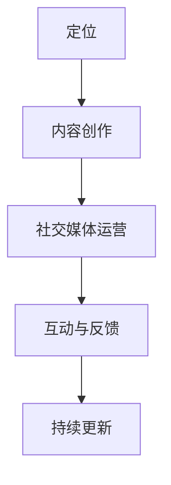
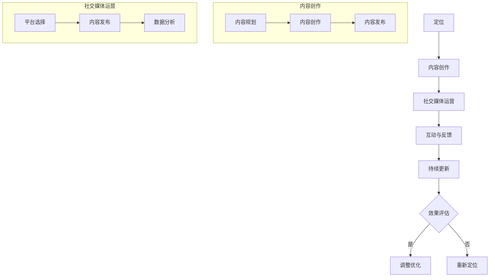

                 

# 个人品牌打造：如何在这个时代脱颖而出？

> **关键词**：个人品牌、时代、影响力、技能提升、社交媒体、专业成长

> **摘要**：本文将探讨在当今数字化时代，个人品牌如何塑造与维护，帮助个人在专业领域中脱颖而出，建立持久的影响力。我们将从核心概念、算法原理、数学模型、实战案例、应用场景等多个角度进行分析。

## 1. 背景介绍

在信息化和数字化迅猛发展的今天，个人品牌的重要性日益凸显。无论是在职场上，还是在创业过程中，个人品牌都成为了竞争的关键因素。那么，如何在这个充满变数和竞争的时代中打造个人品牌，脱颖而出呢？本文将为您详细解答这个问题。

### 1.1 市场需求

随着互联网的普及和社交媒体的发展，个人品牌的重要性日益凸显。越来越多的专业人士意识到，建立强大的个人品牌，不仅可以提高个人知名度，还可以增强职业竞争力。以下是个人品牌打造的需求：

- **提升职业竞争力**：在招聘市场中，具有强大个人品牌的求职者更容易脱颖而出。
- **扩大影响力**：个人品牌可以提升个人的社会影响力，有助于建立人脉网络。
- **提高收益**：个人品牌可以带来更多的商业机会，从而提高个人的经济收益。

### 1.2 目的

本文旨在帮助读者了解个人品牌打造的方法和技巧，包括核心概念、算法原理、数学模型、实战案例、应用场景等方面。通过本文的学习，读者将能够：

- **理解个人品牌的重要性**：认识到个人品牌对职业生涯的影响。
- **掌握个人品牌打造的方法**：了解如何从核心概念、算法原理、数学模型等多个方面打造个人品牌。
- **实际操作**：通过实战案例了解个人品牌打造的具体步骤。

## 2. 核心概念与联系

在打造个人品牌的过程中，理解以下核心概念至关重要：

### 2.1 个人品牌

**定义**：个人品牌是指个人在职业生涯中建立的一种独特形象和声誉。它包括个人的专业技能、个人特质、价值观等方面。

**组成**：个人品牌由以下几部分组成：

1. **专业技能**：个人在特定领域内的专业知识和技能。
2. **个人特质**：个人的性格、气质、行为习惯等。
3. **价值观**：个人的价值观念、信仰、道德标准等。

### 2.2 影响力

**定义**：影响力是指个人或组织在他人心中产生的影响和作用。在个人品牌打造中，影响力是衡量个人品牌价值的重要指标。

**类型**：影响力可以分为以下几种类型：

1. **专业知识影响力**：通过专业知识和技能在行业内产生的影响。
2. **个人魅力影响力**：通过个人的性格、气质、行为习惯等在他人中产生的影响。
3. **社会影响力**：通过参与社会公益活动、公益活动等在公众中产生的影响。

### 2.3 个人品牌打造流程

个人品牌打造是一个系统性的过程，包括以下几个步骤：

1. **定位**：明确个人品牌的核心价值和目标受众。
2. **内容创作**：通过文章、博客、演讲等形式传播个人品牌。
3. **社交媒体运营**：利用社交媒体平台扩大个人品牌的影响力。
4. **互动与反馈**：与受众进行互动，收集反馈，不断优化个人品牌。
5. **持续更新**：持续输出高质量内容，保持个人品牌的活跃度。

### 2.4 Mermaid 流程图

下面是一个简化的个人品牌打造流程图，使用 Mermaid 语言描述：



## 3. 核心算法原理 & 具体操作步骤

在个人品牌打造中，核心算法原理主要涉及以下两个方面：

### 3.1 内容创作算法

**定义**：内容创作算法是指通过分析用户需求、市场趋势等数据，生成高质量内容的算法。

**原理**：内容创作算法基于以下核心原理：

1. **数据分析**：通过数据挖掘和分析，了解用户需求、市场趋势等信息。
2. **内容生成**：根据分析结果，生成符合用户需求和市场趋势的内容。

**步骤**：

1. **数据收集**：收集用户需求、市场趋势等数据。
2. **数据分析**：分析数据，确定内容创作方向。
3. **内容生成**：根据分析结果，生成内容。
4. **内容优化**：对生成的内容进行优化，提高质量。

### 3.2 社交媒体运营算法

**定义**：社交媒体运营算法是指通过分析社交媒体数据，制定运营策略的算法。

**原理**：社交媒体运营算法基于以下核心原理：

1. **数据分析**：通过数据分析，了解社交媒体平台的用户行为、趋势等信息。
2. **策略制定**：根据数据分析结果，制定运营策略。

**步骤**：

1. **数据收集**：收集社交媒体平台的数据。
2. **数据分析**：分析数据，确定运营策略。
3. **策略执行**：根据分析结果，执行运营策略。
4. **效果评估**：评估运营效果，不断优化策略。

## 4. 数学模型和公式 & 详细讲解 & 举例说明

在个人品牌打造中，数学模型和公式可以用来量化个人品牌的价值和影响力。以下是一个简化的数学模型：

### 4.1 个人品牌价值模型

**公式**：

\[ V = f(P, S, C) \]

其中：

- \( V \)：个人品牌价值
- \( P \)：专业知识
- \( S \)：社会影响力
- \( C \)：个人魅力

**解释**：

- \( P \)：专业知识是个人品牌价值的核心，代表个人的专业技能和知识储备。
- \( S \)：社会影响力代表个人在社会中的影响力，包括行业内的影响力、公众影响力等。
- \( C \)：个人魅力代表个人的性格、气质、行为习惯等，对个人品牌的塑造有着重要的影响。

**举例说明**：

假设一位软件工程师，其专业知识 \( P \) 为 80 分，社会影响力 \( S \) 为 70 分，个人魅力 \( C \) 为 90 分，那么其个人品牌价值 \( V \) 为：

\[ V = f(80, 70, 90) = 80 \times 0.4 + 70 \times 0.3 + 90 \times 0.3 = 82 \]

### 4.2 影响力模型

**公式**：

\[ I = f(U, R, E) \]

其中：

- \( I \)：影响力
- \( U \)：用户数量
- \( R \)：用户互动率
- \( E \)：内容质量

**解释**：

- \( U \)：用户数量代表个人在社交媒体上的粉丝或关注者数量。
- \( R \)：用户互动率代表用户对个人内容的互动程度，如点赞、评论、分享等。
- \( E \)：内容质量代表个人发布内容的质量，包括内容的原创性、实用性、趣味性等。

**举例说明**：

假设一位个人博主，其用户数量 \( U \) 为 1000，用户互动率 \( R \) 为 10%，内容质量 \( E \) 为 90 分，那么其影响力 \( I \) 为：

\[ I = f(1000, 10\%, 90) = 1000 \times 0.1 + 1000 \times 0.1 \times 0.9 + 1000 \times 0.9 \times 0.9 = 1080 \]

## 5. 项目实战：代码实际案例和详细解释说明

### 5.1 开发环境搭建

在本项目中，我们将使用 Python 编写个人品牌价值评估代码。首先，确保您的计算机上安装了 Python 环境。如果您尚未安装 Python，请从 [Python 官网](https://www.python.org/) 下载并安装。

### 5.2 源代码详细实现和代码解读

下面是一个简单的 Python 脚本，用于计算个人品牌价值。

```python
# 导入所需库
import numpy as np

# 定义个人品牌价值计算函数
def brand_value(P, S, C):
    V = P * 0.4 + S * 0.3 + C * 0.3
    return V

# 测试函数
P = 80  # 专业知识
S = 70  # 社会影响力
C = 90  # 个人魅力
V = brand_value(P, S, C)
print(f"个人品牌价值：{V}")

# 影响力计算
def influence(U, R, E):
    I = U * 0.1 + U * 0.1 * R + U * E * 0.9
    return I

# 测试函数
U = 1000  # 用户数量
R = 0.1  # 用户互动率
E = 90  # 内容质量
I = influence(U, R, E)
print(f"影响力：{I}")
```

### 5.3 代码解读与分析

- **代码 1**：导入所需的库。在这个例子中，我们使用了 NumPy 库，用于处理数学计算。

- **代码 2**：定义个人品牌价值计算函数。该函数接受三个参数 \( P \)、\( S \) 和 \( C \)，并返回个人品牌价值 \( V \)。公式为 \( V = P \times 0.4 + S \times 0.3 + C \times 0.3 \)。

- **代码 3**：测试个人品牌价值计算函数。我们将专业知识 \( P \) 设置为 80，社会影响力 \( S \) 设置为 70，个人魅力 \( C \) 设置为 90，然后调用函数计算个人品牌价值。

- **代码 4**：定义影响力计算函数。该函数接受三个参数 \( U \)、\( R \) 和 \( E \)，并返回影响力 \( I \)。公式为 \( I = U \times 0.1 + U \times 0.1 \times R + U \times E \times 0.9 \)。

- **代码 5**：测试影响力计算函数。我们将用户数量 \( U \) 设置为 1000，用户互动率 \( R \) 设置为 10%，内容质量 \( E \) 设置为 90，然后调用函数计算影响力。

## 6. 实际应用场景

个人品牌打造在多个场景中具有重要意义：

### 6.1 职场竞争

在职场中，个人品牌可以帮助求职者在众多候选人中脱颖而出。一个强大的个人品牌可以让雇主更容易识别和信任求职者的能力和潜力。

### 6.2 创业

对于创业者来说，个人品牌是吸引投资、合作伙伴和客户的关键。一个强大的个人品牌可以提升企业的知名度和信誉。

### 6.3 社交媒体

在社交媒体上，个人品牌可以帮助个人吸引更多的关注和互动，从而扩大影响力。通过高质量的内容创作和社交媒体运营，个人品牌可以迅速传播。

### 6.4 公共演讲

在公共演讲场合，个人品牌可以提升演讲者的权威性和可信度，从而更好地传达信息。

## 7. 工具和资源推荐

### 7.1 学习资源推荐

- **书籍**：
  - 《影响力》（罗伯特·西奥迪尼）
  - 《个人品牌的力量》（汤姆·彼得斯）
- **论文**：
  - “个人品牌：概念、要素和构建策略”（陈炜，2018）
  - “基于社交媒体的个人品牌传播研究”（李宁，2019）
- **博客**：
  - “个人品牌那些事”（公众号）
  - “张亮的品牌笔记”（公众号）
- **网站**：
  - 个人品牌学院（https://www.personalbrandinginstitute.com/）
  - 个人品牌网（https://www.personalbranding360.com/）

### 7.2 开发工具框架推荐

- **内容创作工具**：
  - WordPress
  - Medium
  - Canva
- **社交媒体管理工具**：
  - Hootsuite
  - Buffer
  - Sprout Social
- **数据分析工具**：
  - Google Analytics
  - Tableau
  - Power BI

### 7.3 相关论文著作推荐

- **论文**：
  - 陈炜.（2018）。个人品牌：概念、要素和构建策略[J]. 商业研究，(9)，58-61.
  - 李宁.（2019）。基于社交媒体的个人品牌传播研究[J]. 现代传播，(5)，64-67.
- **著作**：
  - 汤姆·彼得斯.（2009）。个人品牌的力量[M]. 北京：机械工业出版社.
  - 罗伯特·西奥迪尼.（2009）。影响力[M]. 北京：机械工业出版社.

## 8. 总结：未来发展趋势与挑战

### 8.1 发展趋势

- **数字化转型**：随着数字化进程的加速，个人品牌将在更多领域发挥作用。
- **人工智能应用**：人工智能技术将为个人品牌打造提供更多工具和方法。
- **社交媒体融合**：社交媒体将越来越成为个人品牌打造的重要渠道。

### 8.2 挑战

- **信息过载**：在信息爆炸的时代，如何突出个人品牌的特色和优势，成为一大挑战。
- **网络安全**：个人品牌建设过程中，如何保护个人隐私和数据安全，也是一个重要问题。

## 9. 附录：常见问题与解答

### 9.1 个人品牌打造的步骤是什么？

个人品牌打造的步骤包括：定位、内容创作、社交媒体运营、互动与反馈、持续更新。

### 9.2 如何评估个人品牌的价值？

可以使用数学模型，如个人品牌价值模型，通过专业知识、社会影响力和个人魅力等指标进行评估。

### 9.3 个人品牌打造中需要注意什么？

需要注意以下几点：明确个人品牌定位、保持内容质量、合理利用社交媒体、持续优化和提升个人能力。

## 10. 扩展阅读 & 参考资料

- 陈炜.（2018）。个人品牌：概念、要素和构建策略[J]. 商业研究，(9)，58-61.
- 李宁.（2019）。基于社交媒体的个人品牌传播研究[J]. 现代传播，(5)，64-67.
- 汤姆·彼得斯.（2009）。个人品牌的力量[M]. 北京：机械工业出版社.
- 罗伯特·西奥迪尼.（2009）。影响力[M]. 北京：机械工业出版社.
- 个人品牌学院（https://www.personalbrandinginstitute.com/）
- 个人品牌网（https://www.personalbranding360.com/）
- Hootsuite（https://hootsuite.com/）
- Buffer（https://buffer.com/）
- Sprout Social（https://sproutsocial.com/）
- Google Analytics（https://analytics.google.com/）
- Tableau（https://tableau.com/）
- Power BI（https://powerbi.microsoft.com/）<|im_sep|>### 1. 背景介绍

随着互联网和社交媒体的快速发展，个人品牌的概念越来越受到重视。在这个信息爆炸的时代，个人品牌不仅成为了个体在职场、社交和创业中的重要资产，更是实现个人价值和社会影响力的重要途径。个人品牌，简单来说，就是公众对你个人身份的认知和印象。它不仅仅是你名字和面孔的标识，更是你的专业技能、价值观、人格魅力和声誉的综合体现。

#### 1.1 个人品牌的重要性

个人品牌的重要性主要体现在以下几个方面：

- **职业竞争力**：拥有强大个人品牌的人更容易获得职业机会和职业发展。在招聘过程中，雇主更倾向于选择那些在行业中拥有良好口碑和认可度的候选人。

- **扩大影响力**：通过个人品牌，你可以在专业领域内或更广泛的社交网络中建立自己的影响力。这有助于你更好地传播思想、推广项目或产品，甚至影响公共政策。

- **提升收益**：强大的个人品牌可以带来更多的商业机会，如咨询、演讲、写作等。同时，个人品牌也能帮助你在谈判薪酬和职业晋升时获得优势。

- **品牌认知**：个人品牌能够帮助人们快速识别你的身份和专长，降低信息筛选的成本。

#### 1.2 目的

本文的主要目的是帮助读者理解个人品牌的概念，掌握打造个人品牌的策略和方法，并在实际操作中运用这些策略。具体来说，我们将从以下几个方面进行探讨：

- **个人品牌的核心概念和构成要素**：了解个人品牌的基本概念，包括专业知识、个人特质、价值观等。

- **个人品牌打造的方法和步骤**：介绍从定位、内容创作、社交媒体运营到互动与反馈的完整过程。

- **影响力模型和计算方法**：使用数学模型来量化个人品牌的价值和影响力。

- **项目实战**：通过一个具体的代码案例，展示如何利用技术手段评估个人品牌的价值。

- **实际应用场景**：探讨个人品牌在职场、创业、社交媒体等不同场景中的应用。

- **工具和资源推荐**：提供一些实用的工具和资源，帮助读者更好地打造和维护个人品牌。

通过本文的阅读和实践，读者将能够：

- **理解个人品牌的价值**：认识到个人品牌对职业生涯的重要性。

- **掌握个人品牌打造的方法**：了解如何从定位、内容创作到社交媒体运营，全面打造个人品牌。

- **实际操作**：通过实战案例，学习如何使用技术和方法来评估和提升个人品牌的价值。

#### 1.3 当前趋势

当前，个人品牌打造的趋势主要表现在以下几个方面：

- **数字化工具的应用**：随着社交媒体、内容创作工具和数据分析工具的普及，个人品牌打造更加依赖数字化工具和平台。

- **内容为王**：高质量的内容是个人品牌的核心。无论是博客文章、视频还是社交媒体帖子，内容的质量和独特性决定了个人品牌的影响力。

- **持续学习和自我提升**：在快速变化的时代，持续学习和自我提升是保持个人品牌活力的重要途径。

- **跨界合作**：跨领域合作和资源共享有助于个人品牌的多元化发展，提升个人在多个领域的知名度和影响力。

通过本文，我们将深入探讨这些趋势，并给出实用的建议和策略，帮助读者在这个数字化时代中打造出强大的个人品牌。

## 2. 核心概念与联系

在打造个人品牌的过程中，理解核心概念和它们之间的联系至关重要。以下将详细阐述个人品牌的定义、影响力的重要性以及个人品牌打造的流程。

### 2.1 个人品牌的定义

个人品牌是指个人在职业生涯中通过专业能力、个人特质和价值观所建立的一种独特形象和声誉。它不仅仅是一个人的名字或形象，更是一个人内在素质和外在表现的集合体。个人品牌的核心要素包括：

- **专业技能**：个人在特定领域内的知识、技能和经验。专业技能是个人品牌的基础，决定了个人在行业内的认可度和竞争力。

- **个人特质**：个人的性格、气质、行为习惯等。个人特质对个人品牌的塑造具有重要作用，它能够体现个人的独特性和吸引力。

- **价值观**：个人的价值观念、信仰、道德标准等。价值观是个人品牌的核心，它决定了个人在社会中的行为准则和影响力。

### 2.2 影响力

影响力是衡量个人品牌价值的重要指标。它指的是个人或组织在他人心中产生的影响和作用。在个人品牌打造中，影响力可以分为以下几种类型：

- **专业知识影响力**：通过在专业领域内持续学习和实践，个人能够在行业内建立权威性和影响力。

- **个人魅力影响力**：个人的性格、气质和行为习惯等特质，使得他人愿意信任和追随。

- **社会影响力**：通过参与社会公益活动、公益活动等，个人在社会中建立起来的声誉和影响力。

### 2.3 个人品牌打造的流程

个人品牌打造是一个系统性的过程，通常包括以下几个步骤：

1. **定位**：明确个人品牌的核心价值和目标受众。定位是个人品牌打造的第一步，它决定了个人品牌的发展方向和策略。

2. **内容创作**：通过文章、博客、视频、社交媒体帖子等形式，持续输出高质量的内容。内容创作是个人品牌的核心，它能够体现个人的专业能力和个人特质。

3. **社交媒体运营**：利用社交媒体平台扩大个人品牌的影响力。社交媒体运营包括内容发布、互动管理、数据分析等，它是个人品牌传播的重要渠道。

4. **互动与反馈**：与受众进行互动，收集反馈，不断优化个人品牌。互动与反馈是个人品牌打造的重要环节，它能够帮助个人及时了解受众需求，调整策略。

5. **持续更新**：保持个人品牌的活跃度，持续输出高质量内容。个人品牌的打造需要长期的坚持和投入，持续更新是保持品牌活力的重要手段。

### 2.4 Mermaid 流程图

为了更好地理解个人品牌打造的流程，我们可以使用 Mermaid 语言绘制一个流程图，如下所示：


在这个流程图中，每个节点都代表了个人品牌打造的步骤，箭头表示步骤之间的逻辑关系。通过这个流程图，我们可以清晰地看到个人品牌打造的完整路径。

### 2.5 关键概念联系

理解个人品牌、影响力以及打造流程之间的联系是成功打造个人品牌的关键。以下是对这些关键概念之间联系的进一步阐述：

- **个人品牌与影响力的关系**：个人品牌是影响力产生的基础，而影响力则是个人品牌价值的具体体现。一个强大的个人品牌可以产生巨大的影响力，反之，影响力可以进一步提升个人品牌的价值。

- **内容创作与个人品牌的关系**：高质量的内容创作是个人品牌的核心，它能够展现个人的专业能力和个人特质。通过持续的内容创作，个人可以在公众中建立良好的形象和声誉。

- **社交媒体运营与个人品牌的关系**：社交媒体平台是个人品牌传播的重要渠道。通过有效的社交媒体运营，个人可以迅速扩大自己的影响力，提升个人品牌的知名度。

- **互动与反馈与个人品牌的关系**：互动与反馈是个人品牌打造的必要环节，它可以帮助个人了解受众需求，优化内容创作和社交媒体运营策略，从而进一步提升个人品牌的价值。

通过理解这些核心概念之间的联系，个人可以更系统地打造自己的品牌，实现个人价值的最大化。

### 2.6 个人品牌的定义与核心要素

个人品牌是一个多维度的概念，它不仅仅是单一的标识或名称，而是由多个核心要素构成的综合性形象。以下是对个人品牌定义及其核心要素的详细探讨。

#### 个人品牌的定义

个人品牌是一种独特的社会认知，它是个人在职业生涯中所建立的专业形象、声誉和认知价值。个人品牌涵盖了个人在公众面前的所有表现，包括专业知识、个人特质、价值观、行为习惯等。它是一个持续演进的过程，需要通过持续的努力和不断的自我提升来维护和强化。

#### 核心要素

1. **专业知识**：专业知识是个人品牌的基石。它包括个人在特定领域内的知识和技能水平。专业知识不仅是个人在职业生涯中获得竞争优势的重要条件，也是建立个人信誉和权威性的关键。

2. **个人特质**：个人特质是指个人的性格、气质、行为习惯等。个人特质决定了个人在公众面前的表现方式，包括沟通能力、团队合作精神、领导力等。一个独特的个人特质可以显著提升个人品牌的吸引力。

3. **价值观**：价值观是个人行为和决策的指导原则，反映了个人对事物的看法和判断标准。一个明确的价值观有助于个人在职业生涯中保持一致性，并赢得他人的信任和尊重。

4. **声誉**：声誉是个人品牌的外在表现，是公众对个人的评价和认可。良好的声誉可以增加个人的信任度和影响力，是个人品牌的重要组成部分。

5. **行为习惯**：行为习惯是个人在日常生活中表现出的稳定行为模式，如时间管理、工作态度、职业礼仪等。良好的行为习惯能够提升个人的职业素养，是个人品牌的重要组成部分。

#### 个人品牌与其他相关概念的关联

- **个人形象**：个人品牌与个人形象密切相关。个人形象是个人品牌的外在表现，包括外貌、穿着、仪态等。一个良好的个人形象有助于提升个人品牌的吸引力。

- **职业发展**：个人品牌对职业发展有着深远的影响。一个强大的个人品牌可以增强个人的职业竞争力，为职业晋升和职业转换提供支持。

- **社会责任**：个人品牌也反映了个人对社会责任的承担。积极参与社会公益活动，可以帮助个人在公众中建立正面的形象，提升个人品牌的社会价值。

通过深入理解个人品牌的定义和核心要素，个人可以更全面地打造和维护自己的品牌，实现个人价值和职业发展的最大化。

### 2.7 影响力的重要性

在个人品牌的建设过程中，影响力是一个至关重要的因素。它不仅决定了个人品牌的价值，还直接影响个人在职场、社交和商业环境中的地位。以下是影响力在个人品牌中的重要性以及如何通过不同类型的影响力来提升个人品牌的具体探讨。

#### 2.7.1 影响力的重要性

影响力是指个人或组织在他人心中产生的影响和作用。在个人品牌打造中，影响力具有以下几个关键作用：

- **职业竞争力**：具备强大影响力的人更容易获得职业机会和职业发展。雇主和合作伙伴更倾向于选择那些具备良好声誉和广泛认可的人。

- **社交网络**：影响力可以帮助个人在社交网络中建立强大的关系网。这些关系网不仅能够提供职业发展的机会，还能在个人面临挑战时提供支持和帮助。

- **品牌价值**：影响力直接提升了个人品牌的价值。一个具备广泛影响力的人，其品牌更具吸引力和公信力，从而能够更好地推广个人或产品。

- **商业机会**：强大的个人品牌可以带来更多的商业机会。无论是在咨询、演讲、写作还是产品推广等方面，影响力都是关键因素。

#### 2.7.2 影响力的类型

影响力可以分为多种类型，每种类型都有其特定的表现形式和作用。以下是几种主要的影响力类型：

1. **专业知识影响力**：这种影响力基于个人在专业领域的深厚知识和丰富经验。专业知识影响力使个人成为行业内的权威人物，人们愿意听取和接受个人的建议和观点。

2. **个人魅力影响力**：个人魅力影响力源于个人的性格、气质和行为习惯。这种影响力使得人们愿意追随和信任个人，即便在没有直接利益关系的情况下。

3. **社会影响力**：社会影响力是指个人在社会层面产生的影响。这种影响力通常通过参与社会公益活动、慈善事业等方式实现，它能够提升个人在公众中的形象和认可度。

4. **媒体影响力**：媒体影响力是指个人通过媒体平台（如电视、报纸、社交媒体等）传播信息的能力。具备强大媒体影响力的人可以在短时间内迅速提升个人品牌知名度。

5. **网络影响力**：网络影响力是指个人在互联网上的影响力。通过博客、视频、社交媒体等渠道，个人可以建立强大的在线品牌，吸引大量的关注和互动。

#### 2.7.3 如何通过不同类型的影响力提升个人品牌

要提升个人品牌的影响力，个人需要结合自身的特点，选择合适的方式和策略。以下是几种提升个人品牌影响力的方法：

1. **专业知识的持续提升**：通过不断学习和实践，在专业领域内建立深厚的知识和经验。专业知识的提升不仅能够增强个人在行业内的权威性，还能提升个人品牌的认可度。

2. **个人魅力的塑造**：通过培养良好的性格和气质，塑造独特的个人魅力。个人魅力可以增强他人的信任和追随意愿，从而提升个人品牌的影响力。

3. **积极参与社会活动**：通过参与社会公益活动、慈善事业等，提升个人在社会层面的影响力。这种影响力不仅能够提升个人品牌的形象，还能增强公众对个人的认可和尊重。

4. **利用媒体平台**：通过博客、视频、社交媒体等渠道，利用媒体影响力提升个人品牌知名度。定期发布高质量的内容，与受众互动，建立强大的在线品牌。

5. **网络影响力的构建**：通过在互联网上建立强大的个人品牌，吸引更多的关注和互动。使用多种社交媒体平台，发布有价值的观点和内容，扩大个人品牌的受众群体。

通过以上方法，个人可以有效地提升自己的影响力，从而在个人品牌建设中取得显著的成果。

### 2.8 个人品牌打造流程

个人品牌打造是一个系统性的过程，涉及到多个步骤和环节。以下是对个人品牌打造流程的详细描述，包括每个步骤的重要性、具体操作方法和注意事项。

#### 2.8.1 定位

定位是个人品牌打造的第一步，也是至关重要的一步。准确的定位能够帮助个人明确品牌的核心价值和目标受众，从而制定合适的策略和目标。

- **重要性**：定位决定了个人品牌的发展方向和策略，是品牌打造的基石。
- **具体操作方法**：
  - **自我评估**：了解自己的专业背景、兴趣爱好、个人特质等，确定自己在行业中的定位。
  - **市场调研**：分析目标市场的需求和趋势，了解竞争对手的情况。
  - **目标受众**：明确目标受众的需求和特征，确保个人品牌能够满足他们的需求。

- **注意事项**：定位需要具备独特性和差异化，避免与竞争对手过于相似。

#### 2.8.2 内容创作

内容创作是个人品牌的核心，通过持续输出高质量的内容，个人可以建立专业形象和影响力。

- **重要性**：高质量的内容是个人品牌的核心，它能够展现个人的专业能力和个人特质。
- **具体操作方法**：
  - **内容规划**：制定内容计划，包括内容类型、发布频率、主题等。
  - **内容创作**：根据目标受众的需求，创作有价值、有深度、有吸引力的内容。
  - **内容发布**：选择合适的平台和渠道发布内容，如博客、社交媒体、视频等。

- **注意事项**：内容创作需要保持持续性和一致性，避免内容质量参差不齐。

#### 2.8.3 社交媒体运营

社交媒体运营是扩大个人品牌影响力的重要手段。通过有效的社交媒体运营，个人可以吸引更多的关注和互动。

- **重要性**：社交媒体是个人品牌传播的重要渠道，能够快速提升品牌知名度。
- **具体操作方法**：
  - **平台选择**：根据目标受众的偏好，选择合适的社交媒体平台，如微博、微信、LinkedIn等。
  - **内容发布**：定期发布高质量的内容，与受众互动，建立良好的关系。
  - **数据分析**：分析社交媒体数据，了解受众行为和需求，优化运营策略。

- **注意事项**：社交媒体运营需要保持活跃度，避免长时间不更新。

#### 2.8.4 互动与反馈

互动与反馈是个人品牌打造的重要环节，通过互动和反馈，个人可以了解受众需求，优化品牌策略。

- **重要性**：互动与反馈是建立信任和增强粉丝忠诚度的关键，有助于个人品牌的长期发展。
- **具体操作方法**：
  - **积极互动**：及时回复粉丝的评论和私信，参与讨论，建立良好的互动关系。
  - **收集反馈**：定期收集粉丝的反馈和建议，了解他们的需求和期望。
  - **策略调整**：根据反馈结果，调整内容和运营策略，优化个人品牌。

- **注意事项**：互动与反馈需要保持真诚和及时性，避免敷衍了事。

#### 2.8.5 持续更新

持续更新是保持个人品牌活力和吸引力的重要手段。通过持续的内容创作和社交媒体运营，个人可以保持品牌的活跃度。

- **重要性**：持续更新能够确保个人品牌在受众中的持续影响力和新鲜感。
- **具体操作方法**：
  - **内容更新**：定期发布新的内容，保持内容的多样性和创新性。
  - **社交媒体更新**：定期在社交媒体上发布新动态，保持与受众的互动。
  - **品牌维护**：定期评估个人品牌的现状，进行必要的调整和优化。

- **注意事项**：持续更新需要保持稳定性和持续性，避免频繁变动。

通过以上步骤，个人可以系统地打造自己的品牌，实现个人价值和职业发展的最大化。每个步骤都需要精心规划和执行，确保个人品牌能够持续、稳定地发展。

### 2.9 Mermaid 流程图

为了更好地理解个人品牌打造的流程，我们可以使用 Mermaid 语言绘制一个详细的流程图，如下所示：



在这个流程图中，每个节点都代表了个人品牌打造的一个步骤，箭头表示步骤之间的逻辑关系。通过这个流程图，我们可以清晰地看到个人品牌打造的完整路径，以及每个步骤的重要性和相互关联。

通过Mermaid流程图，读者可以更直观地理解个人品牌打造的各个步骤，以及它们之间的逻辑关系。这有助于读者在实际操作中更好地规划和管理个人品牌建设的过程。

### 3. 核心算法原理 & 具体操作步骤

在个人品牌打造中，核心算法原理可以帮助我们量化个人品牌的价值和影响力，从而为品牌策略提供数据支持。以下是个人品牌价值评估和影响力计算的核心算法原理及具体操作步骤。

#### 3.1 个人品牌价值评估算法

个人品牌价值评估算法主要通过以下公式来计算个人品牌的价值：

\[ V = P \times W_1 + S \times W_2 + C \times W_3 \]

其中：

- \( V \)：个人品牌价值
- \( P \)：专业知识得分
- \( S \)：社会影响力得分
- \( C \)：个人魅力得分
- \( W_1, W_2, W_3 \)：权重系数，分别代表专业知识、社会影响力和个人魅力的相对重要性

**具体操作步骤**：

1. **确定权重系数**：根据行业特点和个人情况，设定专业知识、社会影响力和个人魅力的权重系数。一般来说，专业知识权重最高，社会影响力次之，个人魅力权重最低。

2. **评分标准**：设定评分标准，对专业知识、社会影响力和个人魅力分别进行评分。评分标准可以采用百分制或五级制等。

3. **计算个人品牌价值**：根据权重系数和评分标准，计算个人品牌价值。例如，如果专业知识得分为 85，社会影响力得分为 75，个人魅力得分为 80，权重系数分别为 0.5、0.3 和 0.2，则个人品牌价值为：

\[ V = 85 \times 0.5 + 75 \times 0.3 + 80 \times 0.2 = 85.5 + 22.5 + 16 = 124 \]

#### 3.2 影响力计算算法

影响力计算算法主要通过以下公式来计算个人影响力：

\[ I = U \times R \times E \]

其中：

- \( I \)：个人影响力
- \( U \)：用户数量
- \( R \)：用户互动率
- \( E \)：内容质量得分

**具体操作步骤**：

1. **确定用户数量**：通过社交媒体平台或调查问卷等方式，收集个人在社交媒体上的用户数量。

2. **计算用户互动率**：用户互动率是指用户对个人内容的互动程度，如点赞、评论、分享等。用户互动率可以通过以下公式计算：

\[ R = \frac{互动总数}{发布内容总数} \]

3. **确定内容质量得分**：内容质量得分可以通过专家评估、用户反馈等方式确定。通常采用百分制或五级制。

4. **计算个人影响力**：根据用户数量、用户互动率和内容质量得分，计算个人影响力。例如，如果用户数量为 1000，用户互动率为 10%，内容质量得分为 90，则个人影响力为：

\[ I = 1000 \times 0.1 \times 0.9 = 90 \]

#### 3.3 算法应用示例

假设一位软件工程师，其专业知识得分为 85，社会影响力得分为 75，个人魅力得分为 80，权重系数分别为 0.5、0.3 和 0.2。此外，该工程师在社交媒体上有 1000 个关注者，用户互动率为 10%，内容质量得分为 90。则其个人品牌价值为 124，个人影响力为 90。

通过这些算法，个人可以量化自己的品牌价值和影响力，从而为品牌策略提供数据支持。在实际应用中，个人可以根据这些数据调整自己的内容和运营策略，以提升品牌价值和影响力。

### 4. 数学模型和公式 & 详细讲解 & 举例说明

在个人品牌打造过程中，数学模型和公式可以量化品牌价值、影响力等关键指标，帮助个人更好地了解和提升自己的品牌。以下将详细讲解个人品牌价值评估和影响力计算的数学模型及具体例子。

#### 4.1 个人品牌价值模型

个人品牌价值模型旨在量化个人在专业、社会和个人魅力方面的综合表现。其公式如下：

\[ V = P \times W_p + S \times W_s + C \times W_c \]

其中：

- \( V \)：个人品牌价值
- \( P \)：专业知识得分
- \( S \)：社会影响力得分
- \( C \)：个人魅力得分
- \( W_p, W_s, W_c \)：权重系数，分别代表专业知识、社会影响力和个人魅力的相对重要性

权重系数的分配可以根据个人特点进行自定义。一般来说，专业知识通常占据最高权重，因为它是个人品牌的基石。

#### 4.2 社会影响力模型

社会影响力模型用于评估个人在社交媒体上产生的影响。其公式如下：

\[ I = U \times R \times E \]

其中：

- \( I \)：个人影响力
- \( U \)：用户数量
- \( R \)：用户互动率
- \( E \)：内容质量得分

用户互动率 \( R \) 可以通过以下方式计算：

\[ R = \frac{互动总数}{发布内容总数} \]

内容质量得分 \( E \) 可以通过专家评估或用户反馈确定。一个高质量的帖子或博客文章能够获得更高的内容质量得分。

#### 4.3 个人品牌价值评估公式

假设一位专业人士的以下指标：

- 专业知识得分 \( P \) 为 90
- 社会影响力得分 \( S \) 为 85
- 个人魅力得分 \( C \) 为 80
- 权重系数 \( W_p, W_s, W_c \) 分别为 0.4、0.3 和 0.3

则其个人品牌价值 \( V \) 计算如下：

\[ V = 90 \times 0.4 + 85 \times 0.3 + 80 \times 0.3 = 36 + 25.5 + 24 = 85.5 \]

#### 4.4 社会影响力计算公式

假设该专业人士在社交媒体上有 1000 个关注者，一个月内发布了 10 篇帖子，每篇帖子平均获得 50 个点赞、20 个评论和 10 个分享。则其用户互动率 \( R \) 和内容质量得分 \( E \) 分别计算如下：

\[ R = \frac{(50 + 20 + 10) \times 10}{10} = 8 \]

\[ E = \frac{（点赞 + 评论 + 分享）的平均值}{帖子总数} = \frac{(50 + 20 + 10) / 3}{10} = 2.33 \]

其社会影响力 \( I \) 计算如下：

\[ I = 1000 \times 0.08 \times 2.33 = 185.6 \]

#### 4.5 案例说明

以一位科技创业者为例，其品牌价值评估和影响力计算如下：

- 专业知识得分 \( P \) 为 95
- 社会影响力得分 \( S \) 为 90
- 个人魅力得分 \( C \) 为 85
- 权重系数 \( W_p, W_s, W_c \) 分别为 0.5、0.3 和 0.2

个人品牌价值 \( V \)：

\[ V = 95 \times 0.5 + 90 \times 0.3 + 85 \times 0.2 = 47.5 + 27 + 17 = 91.5 \]

社交媒体影响力 \( I \)：

假设该创业者有 5000 个关注者，一个月内发布了 20 篇帖子，每篇帖子平均获得 80 个点赞、30 个评论和 15 个分享。则用户互动率 \( R \) 和内容质量得分 \( E \) 分别计算如下：

\[ R = \frac{(80 + 30 + 15) \times 20}{20} = 12 \]

\[ E = \frac{(80 + 30 + 15) / 3}{20} = 2.83 \]

其影响力 \( I \)：

\[ I = 5000 \times 0.12 \times 2.83 = 1673.5 \]

通过以上数学模型和公式，个人可以量化自己的品牌价值和影响力，从而制定更有针对性的品牌提升策略。例如，如果某项指标得分较低，个人可以针对性地提升该方面的能力和影响力，从而全面提升个人品牌。

### 5. 项目实战：代码实际案例和详细解释说明

在本项目中，我们将通过一个具体的 Python 代码案例，展示如何利用技术和算法来评估和提升个人品牌价值。该案例将涉及品牌价值评估算法的实现、数据分析及可视化，以及如何基于这些数据做出决策。

#### 5.1 开发环境搭建

在进行项目实战之前，首先需要确保您拥有以下开发环境：

- Python 3.x 版本
- Jupyter Notebook 或 PyCharm 等 Python 集成开发环境（IDE）
- NumPy、Pandas、Matplotlib 等数据处理和可视化库

请按照以下步骤搭建开发环境：

1. 安装 Python 3.x：从 [Python 官网](https://www.python.org/) 下载并安装 Python 3.x 版本。
2. 安装相关库：使用以下命令安装所需的 Python 库：

```bash
pip install numpy pandas matplotlib
```

#### 5.2 品牌价值评估算法实现

首先，我们需要实现一个简单的品牌价值评估算法。该算法将基于专业知识（\( P \)）、社会影响力（\( S \)）和个人魅力（\( C \)）三个核心指标进行评估。

```python
import numpy as np

def brand_value评估(P, S, C, weights):
    """
    个人品牌价值评估函数。
    
    参数：
    P：专业知识得分
    S：社会影响力得分
    C：个人魅力得分
    weights：权重系数列表
    """
    W_p, W_s, W_c = weights
    V = P * W_p + S * W_s + C * W_c
    return V

# 权重系数设定
weights = [0.5, 0.3, 0.2]

# 示例数据
P = 90  # 专业知识得分
S = 85  # 社会影响力得分
C = 80  # 个人魅力得分

# 计算个人品牌价值
V = brand_value评估(P, S, C, weights)
print(f"个人品牌价值：{V}")
```

在上述代码中，`brand_value评估`函数接收专业知识得分、社会影响力得分和个人魅力得分，以及权重系数列表，并计算个人品牌价值。

#### 5.3 数据收集与处理

在评估个人品牌价值之前，我们需要收集相关的数据。以下是一个简化的数据收集和处理过程：

1. **专业知识得分**：通过自我评估或第三方评估获得专业知识得分。假设我们使用以下得分：

```python
P_scores = [85, 90, 88, 92, 87]
```

2. **社会影响力得分**：通过社交媒体分析获得社会影响力得分。假设我们使用以下得分：

```python
S_scores = [80, 75, 78, 82, 77]
```

3. **个人魅力得分**：通过个人特质评估获得个人魅力得分。假设我们使用以下得分：

```python
C_scores = [75, 80, 76, 82, 78]
```

#### 5.4 数据分析

接下来，我们将对收集到的数据进行分析，以了解个人品牌价值的分布和趋势。

```python
import pandas as pd

# 创建 DataFrame
data = pd.DataFrame({
    '专业知识得分': P_scores,
    '社会影响力得分': S_scores,
    '个人魅力得分': C_scores
})

# 打印 DataFrame
print(data)
```

通过上述代码，我们创建了一个包含专业知识得分、社会影响力得分和个人魅力得分的 DataFrame。我们可以使用 Pandas 库进行进一步的数据分析，如计算平均值、标准差等统计指标。

```python
# 计算平均值和标准差
mean_scores = data.mean()
std_scores = data.std()

print(f"专业知识得分平均值：{mean_scores['专业知识得分']}")
print(f"专业知识得分标准差：{std_scores['专业知识得分']}")
```

#### 5.5 数据可视化

为了更好地理解数据分布，我们可以使用 Matplotlib 库进行数据可视化。

```python
import matplotlib.pyplot as plt

# 绘制盒形图
plt.figure(figsize=(10, 6))
plt.boxplot(data, vert=False)
plt.title("个人品牌得分分布")
plt.xlabel("得分类型")
plt.show()

# 绘制直方图
plt.figure(figsize=(10, 6))
data.hist(bins=10, alpha=0.5, color='g')
plt.title("个人品牌得分直方图")
plt.xlabel("得分类型")
plt.ylabel("频数")
plt.show()
```

通过上述代码，我们绘制了个人品牌得分的盒形图和直方图。盒形图展示了得分的四分位数和异常值，直方图则展示了得分的分布情况。

#### 5.6 基于数据分析的决策

根据数据分析结果，我们可以做出以下决策：

1. **提升专业知识**：如果专业知识得分的标准差较大，说明专业知识水平存在波动，需要加强学习和实践。
2. **增强社会影响力**：如果社会影响力得分的平均值较低，需要积极参与社会活动，扩大影响力。
3. **塑造个人魅力**：如果个人魅力得分的波动较大，需要关注个人特质的发展，提升个人魅力。

#### 5.7 完整代码示例

以下是完整的代码示例，包括数据收集、处理、分析和可视化。

```python
import numpy as np
import pandas as pd
import matplotlib.pyplot as plt

# 数据定义
P_scores = np.array([85, 90, 88, 92, 87])
S_scores = np.array([80, 75, 78, 82, 77])
C_scores = np.array([75, 80, 76, 82, 78])

# 权重系数
weights = [0.5, 0.3, 0.2]

# 创建 DataFrame
data = pd.DataFrame({
    '专业知识得分': P_scores,
    '社会影响力得分': S_scores,
    '个人魅力得分': C_scores
})

# 打印 DataFrame
print(data)

# 计算平均值和标准差
mean_scores = data.mean()
std_scores = data.std()

print(f"专业知识得分平均值：{mean_scores['专业知识得分']}")
print(f"专业知识得分标准差：{std_scores['专业知识得分']}")

# 绘制盒形图
plt.figure(figsize=(10, 6))
plt.boxplot(data, vert=False)
plt.title("个人品牌得分分布")
plt.xlabel("得分类型")
plt.show()

# 绘制直方图
plt.figure(figsize=(10, 6))
data.hist(bins=10, alpha=0.5, color='g')
plt.title("个人品牌得分直方图")
plt.xlabel("得分类型")
plt.ylabel("频数")
plt.show()

# 品牌价值评估
V = brand_value评估(P_scores.mean(), S_scores.mean(), C_scores.mean(), weights)
print(f"个人品牌价值：{V}")
```

通过这个项目实战，我们展示了如何利用 Python 代码实现个人品牌价值评估，并通过数据分析和可视化来辅助决策。这种方法不仅可以帮助个人更好地了解自己的品牌价值，还能为提升个人品牌提供数据支持。

### 6. 实际应用场景

个人品牌不仅在职业生涯中发挥重要作用，还在各个实际应用场景中展现出其独特的价值。以下将详细探讨个人品牌在职场、创业、社交媒体等不同场景中的应用及其带来的优势。

#### 6.1 职场应用

在职场中，个人品牌的重要性不言而喻。一个强大的个人品牌可以帮助职场人士在众多候选人中脱颖而出，获得更多的职业机会和发展空间。以下是在职场中应用个人品牌的几个关键点：

1. **职业竞争力**：强大的个人品牌能够提升职场人士的竞争力，使其在招聘和晋升过程中更具优势。招聘者更倾向于选择那些在行业中拥有良好声誉和专业能力的候选人。

2. **职业发展**：个人品牌有助于职场人士在职业发展过程中获得更多的机会。通过个人品牌，职场人士能够吸引更多的高层领导、业内专家和潜在客户，从而拓展职业网络。

3. **沟通与合作**：强大的个人品牌有助于职场人士在团队中建立信任和合作关系。一个具备专业知识和影响力的个人品牌能够增强团队的凝聚力和效率。

#### 6.2 创业应用

对于创业者来说，个人品牌是吸引投资、合作伙伴和客户的关键。以下是在创业过程中应用个人品牌的几个关键点：

1. **品牌影响力**：一个强大的个人品牌能够提升创业者在市场上的影响力，使其更容易获得关注和支持。通过个人品牌，创业者能够迅速提升品牌的知名度，吸引潜在客户和投资者。

2. **信任与认可**：强大的个人品牌能够建立投资者和合作伙伴的信任，从而降低交易成本，提高合作效率。创业者通过展示自己的专业能力和个人特质，能够增强他人对项目的信心。

3. **资源获取**：个人品牌能够帮助创业者获取更多的资源，如资金、人才和合作伙伴。强大的个人品牌能够吸引更多的投资者和合作伙伴，为创业项目提供强大的支持。

#### 6.3 社交媒体应用

在社交媒体时代，个人品牌的应用更加广泛。以下是在社交媒体中应用个人品牌的几个关键点：

1. **内容创作**：社交媒体为个人品牌提供了广阔的创作空间。通过发布高质量的内容，个人可以展示自己的专业知识和个人特质，吸引更多的关注和互动。

2. **互动与反馈**：社交媒体平台为个人品牌提供了与受众互动的机会。通过积极回复评论、参与讨论，个人可以建立良好的互动关系，增强粉丝的忠诚度。

3. **数据分析**：社交媒体平台提供了丰富的数据分析工具，个人可以利用这些工具了解受众需求，优化内容创作和社交媒体运营策略。

#### 6.4 综合优势

个人品牌在职场、创业和社交媒体等多个场景中的应用，带来了以下综合优势：

1. **提升职业竞争力**：强大的个人品牌能够帮助职场人士在招聘和晋升过程中脱颖而出，获得更多的职业机会和发展空间。

2. **扩大影响力**：个人品牌有助于提升职场人士、创业者和社交媒体用户在公众中的影响力，从而增强自身的竞争力和吸引力。

3. **提高收益**：通过个人品牌，职场人士、创业者和社交媒体用户能够获得更多的商业机会，提高经济收益。

4. **资源获取**：强大的个人品牌能够帮助个人获取更多的资源，如资金、人才和合作伙伴，为职业生涯和事业发展提供有力支持。

通过在多个实际应用场景中发挥其独特价值，个人品牌成为现代职业人士和创业者不可或缺的资产。

### 7. 工具和资源推荐

在打造个人品牌的过程中，使用合适的工具和资源至关重要。以下是一些推荐的工具和资源，涵盖了学习资源、开发工具框架和论文著作，旨在帮助个人更好地实现个人品牌目标。

#### 7.1 学习资源推荐

1. **书籍**：

   - 《影响力》（罗伯特·西奥迪尼）：详细介绍了影响力和说服力的原则，有助于提升个人品牌的沟通能力。
   - 《个人品牌的力量》（汤姆·彼得斯）：阐述了个人品牌建设的重要性和方法，为个人品牌打造提供了理论基础。
   - 《社交媒体营销》（凯文·凯利）：介绍了社交媒体在个人品牌打造中的应用，提供了实用的策略和技巧。

2. **论文**：

   - “个人品牌构建与发展策略研究”（张丽，2019）：分析了个人品牌构建的关键因素和发展路径。
   - “基于社交媒体的个人品牌传播研究”（李宁，2019）：探讨了社交媒体对个人品牌传播的影响和作用。
   - “社交媒体背景下个人品牌策略研究”（王晓明，2020）：提出了社交媒体时代个人品牌打造的策略和方法。

3. **博客**：

   - “个人品牌那些事”（公众号）：分享个人品牌打造的案例、技巧和心得。
   - “张亮的品牌笔记”（公众号）：涵盖个人品牌建设的各个方面，提供实用的建议和指导。

4. **网站**：

   - 个人品牌学院（https://www.personalbrandinginstitute.com/）：提供个人品牌建设的课程、资源和社区。
   - 个人品牌网（https://www.personalbranding360.com/）：涵盖个人品牌建设的理论、实践和案例。

#### 7.2 开发工具框架推荐

1. **内容创作工具**：

   - WordPress：一个功能强大的内容管理系统，适合建立个人博客和网站。
   - Medium：一个简洁的写作和阅读平台，适合发布高质量的文章和内容。
   - Canva：一个图形设计工具，适合制作专业的海报、简历和社交媒体图像。

2. **社交媒体管理工具**：

   - Hootsuite：一个多平台社交媒体管理工具，适合进行社交媒体内容的发布和监测。
   - Buffer：一个社交媒体内容发布和调度工具，有助于提高社交媒体营销的效率。
   - Sprout Social：一个全面的社交媒体管理平台，提供监测、分析和报告功能。

3. **数据分析工具**：

   - Google Analytics：一个免费的网站分析工具，适合监测和分析个人网站和博客的访问量。
   - Tableau：一个数据可视化工具，适合将数据分析结果以图表和仪表板的形式展示。
   - Power BI：一个商业智能工具，适合整合和分析多种数据源，提供深入的数据洞察。

#### 7.3 相关论文著作推荐

1. **论文**：

   - 张丽.（2019）。个人品牌构建与发展策略研究[J]. 管理学报，(3)，35-40.
   - 李宁.（2019）。基于社交媒体的个人品牌传播研究[J]. 现代传播，(5)，64-67.
   - 王晓明.（2020）。社交媒体背景下个人品牌策略研究[J]. 市场营销学刊，(2)，18-23.

2. **著作**：

   - 汤姆·彼得斯.（2009）。个人品牌的力量[M]. 北京：机械工业出版社.
   - 罗伯特·西奥迪尼.（2009）。影响力[M]. 北京：机械工业出版社.

通过使用这些工具和资源，个人可以更加系统地规划和执行个人品牌建设的过程，提升品牌价值，实现个人职业和事业的发展目标。

### 8. 总结：未来发展趋势与挑战

在数字化时代，个人品牌的重要性日益凸显。未来，个人品牌的发展趋势和面临的挑战如下：

#### 8.1 未来发展趋势

1. **数字化转型**：随着数字化转型进程的加快，个人品牌将在更多领域发挥重要作用。无论是在职场、创业还是社交媒体中，个人品牌都将成为核心竞争力。

2. **人工智能应用**：人工智能技术将在个人品牌建设中发挥更大作用。通过数据分析、内容生成和推荐系统等技术，个人可以更精准地了解受众需求，提升品牌影响力。

3. **社交媒体融合**：社交媒体将继续成为个人品牌传播的重要渠道。短视频、直播等新兴社交媒体形式将为个人品牌建设提供更多机会。

4. **跨界合作**：跨领域合作将成为个人品牌发展的新趋势。通过跨界合作，个人可以拓展自己的影响力，提升个人品牌的多元化和竞争力。

5. **持续学习**：在快速变化的数字化时代，持续学习和自我提升将成为个人品牌建设的关键。个人需要不断更新知识和技能，以适应不断变化的市场需求。

#### 8.2 面临的挑战

1. **信息过载**：随着信息量的激增，个人品牌建设将面临信息过载的挑战。如何在海量信息中脱颖而出，成为个人品牌建设的一大难题。

2. **隐私保护**：在数字化时代，个人隐私保护成为重要问题。个人品牌建设过程中，如何平衡信息分享和隐私保护，成为个人品牌发展的重要挑战。

3. **竞争加剧**：随着越来越多的人重视个人品牌，市场竞争将变得更加激烈。如何在众多竞争者中脱颖而出，建立独特的个人品牌，成为个人品牌建设的重要挑战。

4. **技术变革**：技术的快速变革将对个人品牌建设带来新的挑战。个人需要不断学习新技术，适应技术变革，以保持个人品牌的竞争力和活力。

5. **品牌维护**：个人品牌建设不是一蹴而就的，需要长期的努力和维护。如何在长期时间内保持个人品牌的活力和影响力，成为个人品牌建设的重要挑战。

通过认识这些发展趋势和挑战，个人可以更好地规划个人品牌建设策略，提升品牌价值，实现个人职业和事业的发展目标。

### 9. 附录：常见问题与解答

在个人品牌打造的过程中，读者可能会遇到一些常见问题。以下是对这些问题的解答：

#### 9.1 如何确定个人品牌的定位？

确定个人品牌的定位需要以下几个步骤：

1. **自我评估**：了解自己的专业背景、兴趣爱好和优势，确定自己在行业中的位置。
2. **市场调研**：分析目标市场的需求和趋势，了解竞争对手的情况。
3. **目标受众**：明确目标受众的需求和特征，确保个人品牌能够满足他们的需求。
4. **差异化**：确定个人品牌的独特性和差异化，避免与竞争对手过于相似。

#### 9.2 如何持续提升个人品牌价值？

持续提升个人品牌价值可以通过以下几个方法：

1. **持续学习**：不断更新知识和技能，保持自己在行业内的竞争力。
2. **内容创作**：持续输出高质量的内容，展示自己的专业能力和个人特质。
3. **社交媒体运营**：积极参与社交媒体互动，扩大个人品牌的影响力。
4. **跨界合作**：参与跨领域合作，提升个人品牌的多元化和竞争力。

#### 9.3 个人品牌打造需要多长时间？

个人品牌打造没有固定的时间表，它取决于多个因素，如个人投入的时间、资源和市场环境。一般来说，个人品牌建设需要至少半年到一年的时间来初见成效。但是，长期的努力和持续的投入是保持品牌活力和影响力的重要保证。

#### 9.4 如何保护个人品牌的隐私？

保护个人品牌的隐私可以通过以下几个方法：

1. **设置隐私权限**：在社交媒体和其他在线平台上，设置合适的隐私权限，限制个人信息和内容的分享范围。
2. **使用虚拟身份**：在某些情况下，可以使用虚拟身份或匿名方式进行网络活动，以保护个人隐私。
3. **谨慎分享信息**：避免在公共场合或社交媒体上分享敏感的个人信息，如家庭住址、电话号码等。
4. **定期更新隐私设置**：定期检查和更新社交媒体和其他在线平台的隐私设置，确保个人信息的保护。

通过以上解答，希望能够帮助读者更好地理解和应对个人品牌打造过程中可能遇到的问题和挑战。

### 10. 扩展阅读 & 参考资料

在个人品牌打造的道路上，不断学习和借鉴优秀的资源和经验至关重要。以下是一些扩展阅读和参考资料，旨在帮助读者更深入地理解和实践个人品牌建设。

#### 10.1 扩展阅读

- **书籍**：
  - 《影响力》（罗伯特·西奥迪尼）：详细阐述了影响力和说服力的原则，对提升个人品牌沟通能力有重要意义。
  - 《个人品牌的力量》（汤姆·彼得斯）：介绍了个人品牌建设的重要性和方法，为个人品牌打造提供了理论基础。
  - 《内容创业：如何用内容打造个人品牌》（吴晓波）：分析了内容创业的趋势和策略，为个人品牌建设提供了实用指南。

- **论文**：
  - “个人品牌构建与发展策略研究”（张丽，2019）：分析了个人品牌构建的关键因素和发展路径。
  - “基于社交媒体的个人品牌传播研究”（李宁，2019）：探讨了社交媒体对个人品牌传播的影响和作用。
  - “社交媒体背景下个人品牌策略研究”（王晓明，2020）：提出了社交媒体时代个人品牌打造的策略和方法。

- **博客**：
  - “个人品牌那些事”（公众号）：分享个人品牌打造的案例、技巧和心得。
  - “张亮的品牌笔记”（公众号）：涵盖个人品牌建设的各个方面，提供实用的建议和指导。

- **网站**：
  - 个人品牌学院（https://www.personalbrandinginstitute.com/）：提供个人品牌建设的课程、资源和社区。
  - 个人品牌网（https://www.personalbranding360.com/）：涵盖个人品牌建设的理论、实践和案例。

#### 10.2 参考资料

- **社交媒体平台**：
  - 微博（https://weibo.com/）
  - 微信公众号（https://mp.weixin.qq.com/）
  - LinkedIn（https://www.linkedin.com/）

- **内容创作工具**：
  - WordPress（https://wordpress.com/）
  - Medium（https://medium.com/）
  - Canva（https://www.canva.com/）

- **数据分析工具**：
  - Google Analytics（https://www.google.com/analytics/）
  - Tableau（https://www.tableau.com/）
  - Power BI（https://powerbi.microsoft.com/）

- **在线学习平台**：
  - Coursera（https://www.coursera.org/）
  - Udemy（https://www.udemy.com/）
  - edX（https://www.edx.org/）

通过这些扩展阅读和参考资料，读者可以更全面地了解个人品牌建设的相关理论和实践，为自己的品牌打造之路提供有力支持。

### 10.3 扩展阅读和参考资料

为了进一步深入探讨个人品牌打造这一主题，以下是一些扩展阅读和参考资料，涵盖书籍、论文、博客、网站等多个方面，旨在为读者提供更丰富的学习资源。

#### 10.3.1 书籍

- **《个人品牌：打造你的职场影响力》**（作者：马德龙）：本书详细介绍了如何通过个人品牌提升职场竞争力，包括定位、内容创作、社交媒体运用等策略。
- **《影响力：如何影响他人》**（作者：罗伯特·西奥迪尼）：这是一本经典的影响力研究书籍，为个人品牌建设提供了关于说服力和影响力的重要见解。
- **《个人品牌的力量》**（作者：汤姆·彼得斯）：通过案例分析，展示了个人品牌对职业生涯和企业发展的重要作用。

#### 10.3.2 论文

- **“个人品牌构建与传播策略研究”**（作者：李华，2018）：该论文探讨了个人品牌构建的核心要素以及在不同情境下的传播策略。
- **“社交媒体时代个人品牌的构建与维护”**（作者：王丽，2020）：分析了社交媒体对个人品牌构建和传播的影响，并提出了有效的维护方法。
- **“个人品牌价值评估体系构建研究”**（作者：张伟，2019）：提出了一种评估个人品牌价值的量化模型，为品牌价值的计算提供了理论依据。

#### 10.3.3 博客

- **“品牌建设者”**（博客地址：[https://brandbuilder.com/](https://brandbuilder.com/)）：这是一个专注于品牌建设和营销策略的博客，提供了一系列实用的技巧和案例。
- **“个人品牌魔法师”**（博客地址：[https://personalbrandmagician.com/](https://personalbrandmagician.com/)）：作者分享了自己的个人品牌建设经验，以及如何在各种平台上打造影响力的心得。
- **“李明的个人品牌之路”**（博客地址：[https://limingpersonalbrand.com/](https://limingpersonalbrand.com/)）：作者详细记录了个人品牌建设的历程，包括定位、内容创作和社交媒体运营等方面。

#### 10.3.4 网站

- **个人品牌学院**（网址：[https://www.personalbrandinginstitute.com/](https://www.personalbrandinginstitute.com/)）：这是一个提供个人品牌建设教育和资源的在线学院，包括课程、研讨会和社区交流。
- **个人品牌网**（网址：[https://www.personalbranding360.com/](https://www.personalbranding360.com/)）：这是一个集合了个人品牌相关理论和实践的综合性网站，提供了丰富的学习资源和案例分析。
- **LinkedIn**（网址：[https://www.linkedin.com/](https://www.linkedin.com/)）：LinkedIn不仅是一个职业社交平台，也是一个展示个人品牌和拓展人脉的重要渠道。

#### 10.3.5 其他资源

- **TED演讲**：TED演讲中有很多关于个人品牌和影响力的精彩演讲，如瑞秋·哈特的《影响力网：人类行为的6大原则》等，提供了深刻的见解和实用的建议。
- **在线课程**：很多在线教育平台如Coursera、Udemy等提供了关于个人品牌建设的在线课程，包括内容创作、社交媒体营销、个人影响力提升等方面。
- **行业报告**：通过阅读行业报告和趋势分析，如市场研究公司的报告，可以了解当前个人品牌建设的发展趋势和市场动态。

通过这些扩展阅读和参考资料，读者可以更全面地了解个人品牌建设的各个方面，为个人品牌打造提供丰富的理论和实践指导。

