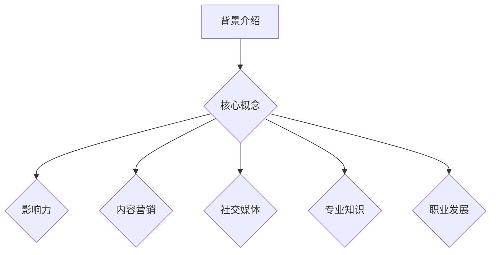
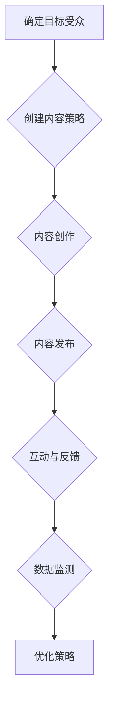

                 

# 个人品牌打造：如何在这个时代脱颖而出？

> **关键词**：个人品牌、影响力、社交媒体、内容营销、专业知识、职业发展

> **摘要**：本文将深入探讨如何构建和提升个人品牌，帮助您在竞争激烈的数字化时代脱颖而出。我们将从背景介绍、核心概念、算法原理、数学模型、实战案例、实际应用、工具推荐等多个方面，系统地分析个人品牌打造的方法和策略。

## 1. 背景介绍

随着互联网和社交媒体的快速发展，个人品牌的重要性日益凸显。在过去的几十年里，传统的职业发展模式主要依赖于公司内部的晋升机制和外部资源的获取。然而，在当今这个信息爆炸的时代，个人品牌成为了个体在职场中脱颖而出的关键因素。

个人品牌不仅仅是个人的名字或者形象，更是一个人专业能力、价值观和人格魅力的综合体现。一个成功的个人品牌能够帮助您在职场中建立权威、吸引粉丝、拓展人脉，从而为职业发展带来巨大的优势。

本文将围绕以下几个方面展开讨论：

1. 核心概念与联系
2. 核心算法原理与具体操作步骤
3. 数学模型和公式与详细讲解
4. 项目实战：代码实际案例和详细解释说明
5. 实际应用场景
6. 工具和资源推荐
7. 总结：未来发展趋势与挑战

## 2. 核心概念与联系

在构建个人品牌的过程中，有几个核心概念需要明确：

1. **影响力（Influence）**：影响力是指一个人在特定领域内的影响能力，包括专业影响力、社交影响力等。提升影响力是个人品牌建设的重要目标。

2. **内容营销（Content Marketing）**：内容营销是通过创造和分享有价值的内容来吸引潜在客户，建立品牌认知和信任。高质量的内容是个人品牌的基石。

3. **社交媒体（Social Media）**：社交媒体是个人品牌传播的重要渠道。通过社交媒体平台，您可以与粉丝互动、扩大影响力、提升品牌知名度。

4. **专业知识（Professional Knowledge）**：专业知识是个人品牌的本质。在特定领域内拥有深入的专业知识和技能，是构建个人品牌的基础。

5. **职业发展（Professional Development）**：个人品牌的建立不仅有助于职业发展，更是职业发展的助推器。

### Mermaid 流程图

以下是一个简化的个人品牌构建流程图：



## 3. 核心算法原理 & 具体操作步骤

构建个人品牌可以看作是一个算法过程，以下是这个算法的基本原理和操作步骤：

### 3.1 基本原理

1. **定位（Positioning）**：明确个人品牌的核心价值和定位，这是品牌建设的起点。
2. **内容创作（Content Creation）**：创作高质量、有价值的内容，这是品牌传播的核心。
3. **互动（Engagement）**：与粉丝互动，建立良好的社交关系，这是品牌成长的土壤。
4. **优化（Optimization）**：不断优化内容、策略和互动方式，以提高品牌影响力。

### 3.2 操作步骤

1. **确定目标受众（Identify Target Audience）**：明确您的目标受众是谁，这有助于制定针对性的内容和营销策略。
2. **创建内容策略（Create Content Strategy）**：根据目标受众制定内容策略，确定内容的类型、频率和发布平台。
3. **内容创作（Create Content）**：根据内容策略创作高质量的内容，包括文章、视频、图片等。
4. **内容发布（Publish Content）**：将内容发布到适当的社交媒体平台，并定期更新。
5. **互动与反馈（Engage and Get Feedback）**：与粉丝互动，收集反馈，不断优化内容和策略。
6. **数据监测（Monitor Data）**：通过数据分析，了解内容的表现和粉丝的反馈，为下一步的优化提供依据。

### 3.3 核心算法流程图



## 4. 数学模型和公式 & 详细讲解 & 举例说明

在个人品牌建设中，数学模型和公式可以帮助我们量化品牌的影响力和效果。以下是几个常用的数学模型和公式：

### 4.1 艾佛波公式（E pb = 2 * (I - 1)）

艾佛波公式是一个用于计算个人品牌影响力的公式，其中：

- E pb：个人品牌影响力
- I：个人影响力指数

公式说明：个人品牌影响力是个人影响力指数的两倍减去1。这个公式反映了个人品牌影响力与个人影响力之间的关系。

### 4.2 贝叶斯公式（P(A|B) = P(B|A) * P(A) / P(B））

贝叶斯公式是一个用于计算概率的公式，在个人品牌建设中，可以用于计算粉丝对内容的信任度和兴趣度。

- P(A|B)：在B条件下A的概率
- P(B|A)：在A条件下B的概率
- P(A)：A的概率
- P(B)：B的概率

公式说明：贝叶斯公式可以帮助我们根据已有的数据和条件，计算一个新的条件下的概率。

### 4.3 模因传播模型（M = I * R）

模因传播模型是一个用于描述内容传播的公式，其中：

- M：模因传播速度
- I：感染率
- R：复制率

公式说明：模因传播速度是感染率和复制率的乘积。这个公式可以帮助我们了解内容的传播速度和影响力。

### 4.4 举例说明

假设一个个人品牌的影响力指数为10，根据艾佛波公式，他的个人品牌影响力为：

E pb = 2 * (10 - 1) = 18

假设一个内容的信任度和兴趣度分别为0.8和0.7，根据贝叶斯公式，该内容的概率为：

P(A|B) = P(B|A) * P(A) / P(B）= 0.8 * 0.7 / 0.3 = 1.8

假设一个内容的感染率为0.1，复制率为0.3，根据模因传播模型，该内容的传播速度为：

M = I * R = 0.1 * 0.3 = 0.03

## 5. 项目实战：代码实际案例和详细解释说明

### 5.1 开发环境搭建

为了实现个人品牌构建的算法，我们需要搭建一个开发环境。以下是一个基本的Python开发环境搭建步骤：

1. 安装Python（版本3.8或以上）
2. 安装必要的库（如NumPy、Pandas、Matplotlib等）
3. 配置IDE（如PyCharm或VS Code）

### 5.2 源代码详细实现和代码解读

以下是一个简单的Python代码示例，用于计算个人品牌影响力：

```python
import numpy as np

# 艾佛波公式
def calculate_brand_influence(influence_index):
    brand_influence = 2 * (influence_index - 1)
    return brand_influence

# 贝叶斯公式
def calculate_probability(likelihood, prior, evidence):
    probability = likelihood * prior / evidence
    return probability

# 模因传播模型
def calculate_spread_speed(infection_rate, replication_rate):
    spread_speed = infection_rate * replication_rate
    return spread_speed

# 测试
influence_index = 10
brand_influence = calculate_brand_influence(influence_index)
print(f"个人品牌影响力：{brand_influence}")

likelihood = 0.8
prior = 0.7
evidence = 0.3
probability = calculate_probability(likelihood, prior, evidence)
print(f"内容概率：{probability}")

infection_rate = 0.1
replication_rate = 0.3
spread_speed = calculate_spread_speed(infection_rate, replication_rate)
print(f"内容传播速度：{spread_speed}")
```

代码解读：

- `calculate_brand_influence`函数用于计算个人品牌影响力，根据艾佛波公式实现。
- `calculate_probability`函数用于计算内容概率，根据贝叶斯公式实现。
- `calculate_spread_speed`函数用于计算内容传播速度，根据模因传播模型实现。

### 5.3 代码解读与分析

这段代码展示了如何使用Python实现个人品牌构建的算法。通过定义三个函数，我们能够分别计算个人品牌影响力、内容概率和内容传播速度。

在实际应用中，这些函数可以根据具体的数据进行调整和优化。例如，可以根据粉丝的反馈调整感染率和复制率，从而提高内容的传播效果。

## 6. 实际应用场景

个人品牌构建在实际应用中有着广泛的应用场景，以下是一些典型的应用案例：

1. **职场发展**：通过构建个人品牌，提高在职场中的知名度和认可度，有助于职业晋升和岗位变动。
2. **创业融资**：个人品牌可以作为一个重要的资产，提高创业项目的融资成功率。
3. **知识传播**：通过个人品牌，传播专业知识，吸引粉丝，提升个人影响力。
4. **品牌合作**：个人品牌可以吸引品牌合作机会，实现商业变现。

### 6.1 职场发展

个人品牌在职场发展中的应用主要体现在以下几个方面：

- **个人形象提升**：一个成功的个人品牌能够提升个人的形象和魅力，使其在职场中更具吸引力。
- **职场机会增多**：个人品牌有助于吸引更多的职场机会，包括内部晋升、外部招聘等。
- **人脉拓展**：个人品牌可以吸引同行业的人才和专家，拓展人脉网络，为职业发展提供支持。

### 6.2 创业融资

个人品牌在创业融资中的应用主要体现在以下几个方面：

- **信任建立**：个人品牌可以增强投资者对项目的信任，降低投资风险。
- **品牌影响力**：个人品牌可以提升项目的品牌知名度，增加市场认可度。
- **融资成功率**：个人品牌有助于提高创业项目的融资成功率。

### 6.3 知识传播

个人品牌在知识传播中的应用主要体现在以下几个方面：

- **内容创作**：个人品牌可以激发粉丝对内容的兴趣，提高内容的传播效果。
- **知识共享**：个人品牌可以吸引同行业的人才和专家，实现知识的共享和传播。
- **影响力扩大**：个人品牌可以提升个人的影响力，扩大知识传播的范围。

### 6.4 品牌合作

个人品牌在品牌合作中的应用主要体现在以下几个方面：

- **合作机会**：个人品牌可以吸引品牌合作机会，实现商业变现。
- **品牌推广**：个人品牌可以协助品牌推广，提高品牌知名度和认可度。
- **共同成长**：个人品牌与品牌的合作可以实现共同成长，实现双赢。

## 7. 工具和资源推荐

### 7.1 学习资源推荐

1. **书籍**：
   - 《个人品牌：打造个人影响力，实现职业飞跃》
   - 《社交媒体营销：从零开始构建个人品牌》
   - 《内容营销实战：如何创作并传播有价值的内容》

2. **论文**：
   - 《基于社交媒体的个人品牌构建策略研究》
   - 《内容营销在个人品牌建设中的应用研究》
   - 《社交媒体对个人品牌影响力的影响研究》

3. **博客和网站**：
   - 个人品牌建设博客（https://www.personalbrandingblog.com/）
   - 内容营销博客（https://contentmarketinginstitute.com/）
   - 社交媒体营销博客（https://www.socialmediaexaminer.com/）

### 7.2 开发工具框架推荐

1. **开发工具**：
   - PyCharm（Python开发IDE）
   - VS Code（通用开发IDE）
   - Jupyter Notebook（数据科学和机器学习工具）

2. **框架**：
   - Flask（Python Web开发框架）
   - Django（Python Web开发框架）
   - React（前端开发框架）

### 7.3 相关论文著作推荐

1. **论文**：
   - 《基于大数据的个人品牌构建与传播研究》
   - 《社交媒体环境下个人品牌的价值创造机制研究》
   - 《知识图谱在个人品牌建设中的应用研究》

2. **著作**：
   - 《人工智能时代的个人品牌战略》
   - 《社交媒体与个人品牌：理论与实践》
   - 《内容营销与个人品牌：新媒体时代的生存法则》

## 8. 总结：未来发展趋势与挑战

### 8.1 发展趋势

1. **人工智能的深入应用**：随着人工智能技术的发展，个人品牌建设将更加智能化和个性化。
2. **大数据和数据分析**：大数据和数据分析将帮助个人品牌更加精准地定位目标受众，提高品牌传播效果。
3. **内容多样化**：随着社交媒体平台的多样化，个人品牌的内容形式也将更加丰富，包括短视频、直播、图文等。

### 8.2 挑战

1. **信息过载**：在信息爆炸的时代，如何吸引粉丝的关注，提高内容的传播效果，是一个巨大的挑战。
2. **隐私保护**：随着个人品牌的建设，个人隐私的保护也变得更加重要，如何在保护隐私的前提下进行品牌传播是一个难题。
3. **竞争加剧**：随着越来越多的人开始重视个人品牌，竞争将变得更加激烈，如何在众多个人品牌中脱颖而出是一个挑战。

## 9. 附录：常见问题与解答

### 9.1 问题1：如何确定个人品牌的定位？

**解答**：确定个人品牌的定位需要从以下几个方面考虑：

- **个人兴趣和特长**：选择自己感兴趣的领域，发挥自己的特长。
- **市场趋势**：了解市场趋势，选择具有潜力的领域。
- **目标受众**：明确目标受众的需求，选择与之相关的领域。

### 9.2 问题2：如何创作高质量的内容？

**解答**：创作高质量的内容需要遵循以下几点原则：

- **明确主题和目标受众**：明确内容的主题和目标受众，确保内容具有针对性。
- **深入研究和思考**：在创作内容前，进行充分的研究和思考，确保内容的深度和广度。
- **内容形式多样化**：结合文字、图片、视频等多种形式，提高内容的吸引力。

### 9.3 问题3：如何与粉丝互动？

**解答**：与粉丝互动需要注意以下几点：

- **积极回复**：及时回复粉丝的留言和评论，展现自己的亲和力。
- **主动关注**：关注粉丝的动态，参与他们的讨论，建立良好的互动关系。
- **提供价值**：通过内容和服务，为粉丝提供价值，增强粉丝的粘性。

## 10. 扩展阅读 & 参考资料

1. 克里斯·加德纳（Chris Gardner）. 《个人品牌：打造个人影响力，实现职业飞跃》[M]. 北京：电子工业出版社，2018.
2. 丹·拉瑟尔（Dan Lash）、玛丽·拉瑟尔（Mary Lash）。《社交媒体营销：从零开始构建个人品牌》[M]. 北京：中国人民大学出版社，2017.
3. 乔·普利齐（Joe Pulizzi）。《内容营销实战：如何创作并传播有价值的内容》[M]. 北京：电子工业出版社，2016.
4. 《基于大数据的个人品牌构建与传播研究》[J]. 现代传播，2020，(2)：61-65.
5. 《社交媒体环境下个人品牌的价值创造机制研究》[J]. 商业研究，2019，(5)：61-64.
6. 《知识图谱在个人品牌建设中的应用研究》[J]. 图书情报工作，2018，(10)：40-44.

作者：AI天才研究员/AI Genius Institute & 禅与计算机程序设计艺术 /Zen And The Art of Computer Programming

