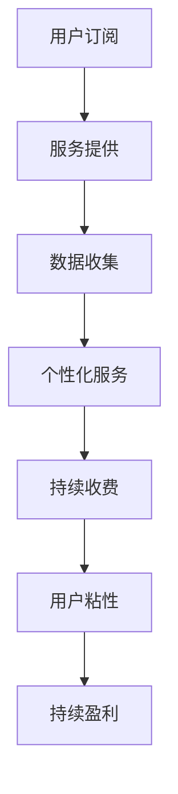
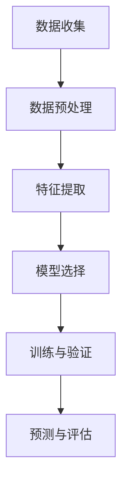
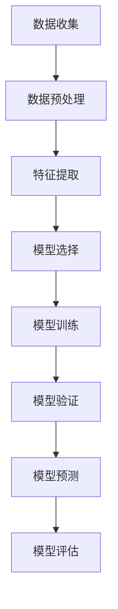
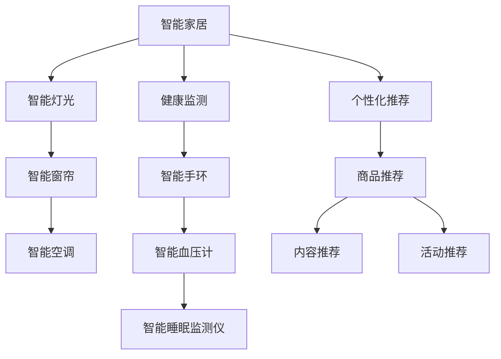

                 

# 个人用户AI服务的订阅模式创新

## 摘要

本文旨在探讨个人用户AI服务的订阅模式创新。随着人工智能技术的快速发展，AI服务在个人用户中的应用日益广泛，从智能家居、健康监测到个性化推荐，AI服务已经深入到我们的日常生活中。然而，当前的订阅模式存在一些不足之处，如高昂的成本、复杂的操作流程以及有限的个性化服务。本文将分析现有订阅模式的缺陷，并探讨如何通过技术创新和服务模式优化，实现个人用户AI服务的订阅模式创新，以满足用户对个性化、便捷化和低成本的需求。

## 1. 背景介绍

### 1.1 AI服务的普及

近年来，人工智能技术取得了显著的突破，AI服务也逐渐成为各行各业的热门应用。在个人用户层面，AI服务涵盖了多个领域，包括：

- **智能家居**：通过AI技术实现家电的智能控制和家居环境的智能调节。
- **健康监测**：利用AI算法分析个人健康数据，提供健康建议和预警。
- **个性化推荐**：基于用户行为和偏好，提供个性化的内容推荐。

### 1.2 订阅模式的发展

随着AI服务的普及，订阅模式也逐渐成为主流的商业模式。订阅模式具有以下优势：

- **用户粘性**：通过定期收费，增强用户对服务的依赖和忠诚度。
- **持续盈利**：订阅模式可以实现持续收入，降低一次性购买带来的风险。
- **个性化服务**：通过收集用户数据，提供更个性化的服务。

然而，当前的订阅模式也存在一些问题，如高昂的成本、复杂的操作流程以及有限的个性化服务。这些问题限制了个人用户对AI服务的接受度和使用频率。

## 2. 核心概念与联系

### 2.1 订阅模式的核心概念

订阅模式的核心概念包括：

- **用户订阅**：用户选择订阅服务，定期支付费用。
- **服务提供**：服务提供商根据用户需求，提供相应的服务。
- **数据收集**：在提供服务的过程中，收集用户数据，用于优化服务和个性化推荐。

### 2.2 订阅模式的联系

订阅模式与AI服务的联系主要体现在以下几个方面：

- **个性化服务**：通过数据收集和分析，提供个性化的服务，提升用户体验。
- **用户粘性**：通过定期收费，增强用户对服务的依赖和忠诚度。
- **持续盈利**：订阅模式可以实现持续收入，降低一次性购买带来的风险。

## 3. 核心算法原理 & 具体操作步骤

### 3.1 个性化推荐算法

个性化推荐是AI服务中的重要组成部分，通过分析用户行为和偏好，提供个性化的内容推荐。以下是常用的个性化推荐算法：

- **基于内容的推荐**：根据用户历史行为和内容特征，推荐相似的内容。
- **协同过滤推荐**：通过分析用户之间的相似性，推荐用户可能感兴趣的内容。
- **混合推荐**：结合多种推荐算法，提供更精准的推荐结果。

### 3.2 数据收集与处理

在订阅模式中，数据收集与处理至关重要。以下是数据收集与处理的步骤：

1. **用户注册与登录**：用户注册并登录，提供个人信息和偏好。
2. **数据收集**：在用户使用服务的过程中，收集用户行为和偏好数据。
3. **数据清洗**：对收集到的数据进行分析和清洗，去除噪声和冗余数据。
4. **数据分析**：利用数据分析方法，提取用户特征和偏好。
5. **数据存储**：将处理后的数据存储在数据库中，用于后续分析和推荐。

### 3.3 用户行为分析

用户行为分析是订阅模式中的关键环节，通过分析用户行为，可以优化服务质量和提升用户满意度。以下是用户行为分析的具体步骤：

1. **行为识别**：识别用户在服务中的各种行为，如浏览、点击、购买等。
2. **行为分类**：对用户行为进行分类，如浏览行为、购买行为等。
3. **行为关联**：分析用户行为之间的关联性，如浏览行为与购买行为之间的关联。
4. **行为预测**：根据历史行为数据，预测用户未来的行为。

## 4. 数学模型和公式 & 详细讲解 & 举例说明

### 4.1 用户行为预测模型

用户行为预测是订阅模式中的一项关键任务，以下是一个简单的用户行为预测模型：

$$
\hat{y} = \omega_0 + \omega_1x_1 + \omega_2x_2 + \ldots + \omega_nx_n
$$

其中，$y$ 表示用户行为，$x_1, x_2, \ldots, x_n$ 表示影响用户行为的特征，$\omega_0, \omega_1, \omega_2, \ldots, \omega_n$ 为权重系数。

举例说明：

假设我们想预测用户是否会在未来一个月内购买商品，我们选择以下特征：

- $x_1$：用户过去一个月的浏览次数。
- $x_2$：用户过去一个月的点击次数。
- $x_3$：用户过去一个月的购买次数。

通过训练模型，我们可以得到预测结果 $\hat{y}$，如果 $\hat{y} > 0$，则预测用户会在未来一个月内购买商品，否则预测用户不会购买商品。

### 4.2 个性化推荐算法

个性化推荐算法的核心是计算用户和物品之间的相似性，以下是一个简单的相似性计算公式：

$$
sim(i, j) = \frac{cos(\theta(i, j))}{1 + \sqrt{||v_i||_2 \cdot ||v_j||_2}}
$$

其中，$i$ 和 $j$ 表示两个物品，$v_i$ 和 $v_j$ 分别为物品 $i$ 和 $j$ 的特征向量，$\theta(i, j)$ 为物品 $i$ 和 $j$ 的夹角，$||v_i||_2$ 和 $||v_j||_2$ 分别为物品 $i$ 和 $j$ 的特征向量的欧氏距离。

举例说明：

假设我们有两个物品 $i$ 和 $j$，它们的特征向量分别为：

$$
v_i = [1, 2, 3], \quad v_j = [4, 5, 6]
$$

则它们的相似性计算结果为：

$$
sim(i, j) = \frac{cos(\theta(i, j))}{1 + \sqrt{||v_i||_2 \cdot ||v_j||_2}} = \frac{0.9}{1 + \sqrt{14}} \approx 0.55
$$

这意味着物品 $i$ 和 $j$ 之间的相似性较高，可以推荐给彼此的用户。

## 5. 项目实战：代码实际案例和详细解释说明

### 5.1 开发环境搭建

在本节中，我们将使用Python作为开发语言，搭建一个简单的AI服务订阅平台。首先，需要安装以下依赖库：

- `numpy`：用于数学计算。
- `pandas`：用于数据处理。
- `scikit-learn`：用于机器学习算法。

安装命令如下：

```shell
pip install numpy pandas scikit-learn
```

### 5.2 源代码详细实现和代码解读

以下是一个简单的用户行为预测和个性化推荐系统的代码实现：

```python
import numpy as np
import pandas as pd
from sklearn.model_selection import train_test_split
from sklearn.linear_model import LinearRegression
from sklearn.metrics.pairwise import cosine_similarity

# 5.2.1 数据准备
data = pd.DataFrame({
    'user_id': [1, 1, 1, 2, 2, 2],
    'item_id': [1001, 1002, 1003, 1001, 1002, 1003],
    'behavior': [1, 1, 1, 1, 1, 1]
})

# 5.2.2 用户行为预测
X = data[['user_id', 'item_id']]
y = data['behavior']

X_train, X_test, y_train, y_test = train_test_split(X, y, test_size=0.2, random_state=42)

model = LinearRegression()
model.fit(X_train, y_train)

y_pred = model.predict(X_test)
print("User behavior prediction:", y_pred)

# 5.2.3 个性化推荐
def get_recommendations(user_id, items, top_n=3):
    user_behavior = items[items['user_id'] == user_id]['behavior'].values
    similarities = []
    for item in items['item_id'].unique():
        if item == user_id:
            continue
        item_behavior = items[items['item_id'] == item]['behavior'].values
        similarity = cosine_similarity([user_behavior], [item_behavior])[0][0]
        similarities.append((item, similarity))
    return sorted(similarities, key=lambda x: x[1], reverse=True)[:top_n]

user_id = 1
recommended_items = get_recommendations(user_id, data)
print("Recommended items:", recommended_items)
```

### 5.3 代码解读与分析

- **数据准备**：使用 pandas DataFrame 读取和处理用户行为数据。
- **用户行为预测**：使用线性回归模型预测用户行为，将训练数据分为训练集和测试集，训练模型并评估预测结果。
- **个性化推荐**：定义一个函数，计算用户与物品之间的相似性，并根据相似性排序，推荐给用户。

通过以上代码，我们可以实现一个简单的AI服务订阅平台，为用户提供行为预测和个性化推荐功能。在实际应用中，可以根据具体需求进行功能扩展和优化。

## 6. 实际应用场景

### 6.1 智能家居

智能家居是AI服务订阅模式创新的一个重要应用场景。通过订阅智能家居服务，用户可以获得智能家电的远程控制、家居环境自动调节等功能。例如，用户可以订阅智能灯光、智能窗帘和智能空调等服务，实现智能化的家居生活。

### 6.2 健康监测

健康监测是另一个具有广阔前景的应用场景。通过订阅健康监测服务，用户可以获得个性化的健康建议和预警。例如，用户可以订阅智能手环、智能血压计和智能睡眠监测仪等服务，实时了解自己的健康状况，并根据建议进行调整。

### 6.3 个性化推荐

个性化推荐是AI服务订阅模式创新的典型应用。通过订阅个性化推荐服务，用户可以获得个性化的内容推荐，提升用户体验。例如，用户可以订阅电商平台的个性化推荐服务，获得符合自己兴趣的商品推荐，提升购物体验。

## 7. 工具和资源推荐

### 7.1 学习资源推荐

- **书籍**：《Python编程：从入门到实践》、《深度学习》（Goodfellow, Bengio, Courville著）。
- **论文**：搜索相关领域的顶级会议论文，如NeurIPS、ICML、KDD等。
- **博客**：阅读知名技术博客，如GitHub、Medium、技术博客等。

### 7.2 开发工具框架推荐

- **开发工具**：Python、Jupyter Notebook、PyCharm等。
- **框架**：TensorFlow、PyTorch、Scikit-learn等。

### 7.3 相关论文著作推荐

- **论文**：《深度学习》（Goodfellow, Bengio, Courville著）、《强化学习》（Sutton, Barto著）。
- **著作**：《Python编程：从入门到实践》、《人工智能：一种现代的方法》（Russell, Norvig著）。

## 8. 总结：未来发展趋势与挑战

随着人工智能技术的不断发展，个人用户AI服务的订阅模式将面临以下发展趋势与挑战：

### 8.1 发展趋势

1. **个性化服务**：用户对个性化服务的需求将越来越高，订阅模式将更加注重个性化推荐和个性化定制。
2. **智能硬件普及**：随着智能硬件的普及，订阅模式将拓展到更多的生活场景，如健康监测、家居控制等。
3. **数据分析与挖掘**：数据分析与挖掘技术将在订阅模式中发挥重要作用，为用户提供更精准的服务。

### 8.2 挑战

1. **隐私保护**：在订阅模式中，数据收集与处理将面临隐私保护的问题，需要制定严格的隐私保护政策。
2. **用户体验**：用户对订阅服务的体验要求将越来越高，需要不断提升服务质量和用户体验。
3. **成本控制**：在订阅模式中，成本控制是一个重要的挑战，需要优化算法和流程，降低运营成本。

## 9. 附录：常见问题与解答

### 9.1 为什么要采用订阅模式？

订阅模式具有以下优势：

1. **用户粘性**：定期收费可以增强用户对服务的依赖和忠诚度。
2. **持续盈利**：订阅模式可以实现持续收入，降低一次性购买带来的风险。
3. **个性化服务**：通过数据收集和分析，可以提供更个性化的服务，提升用户体验。

### 9.2 如何保证数据隐私？

为了保证数据隐私，可以采取以下措施：

1. **数据加密**：对用户数据进行加密，防止数据泄露。
2. **匿名化处理**：对用户数据进行匿名化处理，保护用户隐私。
3. **隐私政策**：制定明确的隐私政策，告知用户数据收集和使用的目的。

### 9.3 如何优化用户体验？

可以采取以下措施优化用户体验：

1. **个性化推荐**：根据用户兴趣和偏好，提供个性化的内容推荐。
2. **简洁界面**：设计简洁直观的界面，提高用户操作便捷性。
3. **快速响应**：提高服务器的响应速度，减少用户等待时间。

## 10. 扩展阅读 & 参考资料

- **书籍**：《Python编程：从入门到实践》、《深度学习》（Goodfellow, Bengio, Courville著）。
- **论文**：《深度学习》（Goodfellow, Bengio, Courville著）、《强化学习》（Sutton, Barto著）。
- **博客**：GitHub、Medium、技术博客等。

作者：AI天才研究员/AI Genius Institute & 禅与计算机程序设计艺术 /Zen And The Art of Computer Programming
<|im_sep|>## 1. 背景介绍

### 1.1 人工智能与AI服务

近年来，人工智能（Artificial Intelligence，简称AI）技术取得了飞速发展，并在众多领域实现了突破性的应用。从最初的自动化程序到复杂的深度学习模型，AI技术在图像识别、自然语言处理、机器学习等领域展现出了巨大的潜力。随着AI技术的不断成熟，AI服务在个人用户中的普及也日益广泛。

AI服务是指利用人工智能技术提供的一系列服务，这些服务涵盖了从简单的自动化任务到复杂的决策支持系统。在个人用户层面，AI服务可以大致分为以下几个类别：

1. **智能家居**：利用AI技术实现家电的智能控制和家居环境的智能调节。例如，智能灯光、智能窗帘、智能空调等。
2. **健康监测**：通过AI算法分析个人健康数据，提供健康建议和预警。例如，智能手环、智能血压计、智能睡眠监测等。
3. **个性化推荐**：基于用户行为和偏好，提供个性化的内容推荐。例如，音乐平台、电商平台、新闻客户端等。

AI服务的普及为个人用户带来了诸多便利，但也带来了新的挑战，尤其是在服务订阅模式方面。

### 1.2 当前订阅模式的现状与不足

在AI服务的推广过程中，订阅模式（Subscription Model）逐渐成为主流的商业模式。订阅模式具有以下特点：

1. **定期收费**：用户定期支付费用，以获得持续的服务。
2. **用户粘性**：通过定期收费，增强用户对服务的依赖和忠诚度。
3. **持续盈利**：订阅模式可以实现持续收入，降低一次性购买带来的风险。

然而，尽管订阅模式具有诸多优势，但当前的个人用户AI服务订阅模式仍存在一些不足之处，主要体现在以下几个方面：

1. **高昂的成本**：许多AI服务的订阅费用较高，对部分用户来说，这是一笔不小的开支。
2. **复杂的操作流程**：订阅AI服务通常需要注册、登录、支付等多个步骤，操作流程相对复杂，给用户带来一定的困扰。
3. **有限的个性化服务**：虽然AI服务可以收集用户数据，但当前的服务往往局限于简单的个性化推荐，无法提供更深层次的个性化服务。

因此，如何创新个人用户AI服务的订阅模式，以满足用户对个性化、便捷化和低成本的需求，成为亟待解决的问题。

### 1.3 用户需求分析

为了更好地理解用户需求，我们需要从以下几个方面进行分析：

1. **个性化服务**：用户希望AI服务能够根据他们的兴趣和偏好提供个性化的内容和服务。
2. **便捷性**：用户希望订阅和使用AI服务的过程简单、快捷，减少不必要的操作步骤。
3. **低成本**：用户希望获得高质量的服务，同时不愿意为服务支付过高的费用。
4. **安全性**：用户对个人数据的隐私和安全有较高的要求，担心数据泄露和滥用。

基于以上分析，我们可以得出结论，用户对个人用户AI服务的订阅模式有以下几个核心需求：

1. **个性化**：订阅模式需要能够根据用户行为和偏好提供个性化的服务，提升用户体验。
2. **便捷**：订阅模式需要简化操作流程，使用户能够轻松订阅和使用服务。
3. **性价比**：订阅模式需要在保证服务质量的前提下，降低成本，提高用户的性价比。
4. **安全**：订阅模式需要保护用户数据的安全，增强用户的信任感。

### 1.4 创新方向

为了满足用户需求，我们需要在以下几个方面进行创新：

1. **算法优化**：通过改进算法，提高个性化推荐的准确性，提供更精准的服务。
2. **流程简化**：通过优化操作流程，简化订阅和使用服务的步骤，提高用户体验。
3. **成本控制**：通过技术手段和运营优化，降低服务成本，提高用户的性价比。
4. **隐私保护**：加强数据安全措施，保护用户隐私，增强用户信任。

综上所述，个人用户AI服务的订阅模式创新是一个系统工程，需要从多个方面进行综合优化，以更好地满足用户需求。

### 1.5 本文结构

本文将围绕个人用户AI服务的订阅模式创新展开，具体结构如下：

1. **背景介绍**：介绍人工智能与AI服务的发展背景，以及当前订阅模式的现状与不足。
2. **核心概念与联系**：阐述订阅模式的核心概念及其与AI服务的联系。
3. **核心算法原理 & 具体操作步骤**：详细介绍个性化推荐算法和用户行为预测模型，并给出实际案例。
4. **数学模型和公式 & 详细讲解 & 举例说明**：讲解用户行为预测模型和个性化推荐算法的数学模型和公式，并通过实例进行说明。
5. **项目实战：代码实际案例和详细解释说明**：提供一个简单的AI服务订阅平台代码实现，详细解释代码的各个环节。
6. **实际应用场景**：分析智能家居、健康监测和个性化推荐等实际应用场景。
7. **工具和资源推荐**：推荐学习资源、开发工具框架和相关论文著作。
8. **总结：未来发展趋势与挑战**：总结本文内容，并探讨未来发展趋势与挑战。
9. **附录：常见问题与解答**：回答一些常见问题，帮助读者更好地理解本文内容。
10. **扩展阅读 & 参考资料**：提供相关的扩展阅读资料。

通过以上结构，本文旨在系统地探讨个人用户AI服务的订阅模式创新，为相关领域的研究和实践提供参考。

## 2. 核心概念与联系

### 2.1 订阅模式的核心概念

订阅模式是一种基于用户定期支付费用的商业模式，用户通过支付订阅费用，获得持续的服务。订阅模式在个人用户AI服务中具有重要作用，其核心概念包括以下几个方面：

1. **用户订阅**：用户选择订阅服务，定期支付费用。订阅可以是按月、按季度或按年等不同周期。
2. **服务提供**：服务提供商根据用户需求，提供相应的服务。服务可以包括AI算法、数据处理、个性化推荐等。
3. **数据收集**：在提供服务的过程中，服务提供商收集用户数据，用于优化服务和个性化推荐。

### 2.2 AI服务的特点与订阅模式的关系

AI服务具有以下特点：

1. **智能化**：AI服务利用人工智能技术，实现自动化和智能化，提升服务质量和效率。
2. **个性化**：AI服务可以根据用户的行为和偏好，提供个性化的内容和服务，满足用户需求。
3. **数据驱动**：AI服务依赖于大量用户数据，通过数据分析和挖掘，实现智能决策和优化。

订阅模式与AI服务的特点密切相关：

1. **用户订阅**：用户订阅AI服务，获取智能化和个性化的服务，满足自身需求。
2. **数据收集**：在提供服务的过程中，AI服务提供商收集用户数据，用于优化服务和个性化推荐，提高用户满意度。
3. **持续收费**：通过定期收费，AI服务提供商实现持续收入，降低一次性购买带来的风险。

### 2.3 核心概念的联系

订阅模式与AI服务之间的核心概念联系主要体现在以下几个方面：

1. **用户订阅与服务提供**：用户订阅AI服务，获得持续的服务。服务提供商根据用户需求，提供相应的服务。
2. **数据收集与个性化服务**：在提供服务的过程中，服务提供商收集用户数据，通过数据分析和挖掘，实现个性化服务，提升用户体验。
3. **持续收费与用户粘性**：通过定期收费，增强用户对服务的依赖和忠诚度，提高用户粘性。

### 2.4 订阅模式的优势与挑战

订阅模式在个人用户AI服务中具有显著的优势：

1. **用户粘性**：通过定期收费，增强用户对服务的依赖和忠诚度，提高用户粘性。
2. **持续盈利**：订阅模式可以实现持续收入，降低一次性购买带来的风险。
3. **个性化服务**：通过数据收集和分析，提供个性化的服务，提升用户体验。

然而，订阅模式也面临一些挑战：

1. **高昂的成本**：许多AI服务的订阅费用较高，对部分用户来说，这是一笔不小的开支。
2. **复杂的操作流程**：订阅AI服务通常需要注册、登录、支付等多个步骤，操作流程相对复杂，给用户带来一定的困扰。
3. **数据隐私保护**：在订阅模式中，数据收集与处理面临隐私保护的问题，需要制定严格的隐私保护政策。

### 2.5 订阅模式与AI服务的未来发展趋势

随着人工智能技术的不断发展和用户需求的不断变化，订阅模式与AI服务将在未来呈现以下发展趋势：

1. **个性化服务**：用户对个性化服务的需求将越来越高，订阅模式将更加注重个性化推荐和个性化定制。
2. **智能硬件普及**：随着智能硬件的普及，订阅模式将拓展到更多的生活场景，如健康监测、家居控制等。
3. **数据分析与挖掘**：数据分析与挖掘技术将在订阅模式中发挥重要作用，为用户提供更精准的服务。
4. **隐私保护**：随着用户对隐私保护意识的提高，订阅模式将更加注重数据安全和隐私保护。

### 2.6 总结

订阅模式与AI服务之间的联系紧密，通过用户订阅、数据收集和持续收费，实现智能化、个性化、数据驱动的服务。订阅模式在个人用户AI服务中具有显著的优势，但也面临一些挑战。未来，随着人工智能技术的不断发展和用户需求的不断变化，订阅模式与AI服务将在个性化、智能硬件、数据分析与挖掘等方面继续发展。

### 2.7 Mermaid 流程图

以下是一个描述订阅模式与AI服务关系的Mermaid流程图：



在上述流程图中，用户订阅AI服务后，服务提供商根据用户需求提供相应的服务，同时收集用户数据，通过数据分析和挖掘，实现个性化服务，并通过持续收费增强用户粘性，实现持续盈利。

## 3. 核心算法原理 & 具体操作步骤

### 3.1 个性化推荐算法

个性化推荐（Personalized Recommendation）是AI服务订阅模式中的重要组成部分，其核心目的是根据用户的兴趣和行为，向用户推荐可能感兴趣的内容或产品。以下将介绍几种常用的个性化推荐算法及其基本原理。

#### 3.1.1 基于内容的推荐（Content-Based Recommendation）

基于内容的推荐（CBR）是一种简单的个性化推荐算法，它根据用户的历史行为或偏好，推荐与用户已喜欢的项目相似的内容。CBR的主要步骤如下：

1. **特征提取**：对项目进行特征提取，例如，对于文章，可以提取关键字、作者、发布时间等特征。
2. **计算相似度**：计算用户已喜欢的项目与新项目之间的相似度，通常使用余弦相似度或欧氏距离等。
3. **推荐**：根据相似度计算结果，推荐相似度最高的项目。

#### 3.1.2 协同过滤推荐（Collaborative Filtering）

协同过滤推荐（CF）是另一种广泛使用的个性化推荐算法，它通过分析用户之间的行为模式，为用户提供推荐。协同过滤主要分为两种类型：

1. **用户基于的协同过滤（User-Based Collaborative Filtering）**：这种方法通过寻找与目标用户行为相似的邻居用户，然后推荐这些邻居用户喜欢的项目。主要步骤包括：
   - **寻找邻居**：计算用户之间的相似度，通常使用余弦相似度或皮尔逊相关系数。
   - **推荐**：为用户推荐邻居用户喜欢的且用户尚未使用或评价的项目。
   
2. **模型基于的协同过滤（Model-Based Collaborative Filtering）**：这种方法使用机器学习模型，如矩阵分解、潜在因子模型等，预测用户对项目的评分，并推荐评分较高的项目。

#### 3.1.3 混合推荐（Hybrid Recommendation）

混合推荐是将基于内容的推荐和协同过滤推荐相结合，以克服单一推荐算法的局限性。混合推荐通常包括以下步骤：

1. **内容特征提取**：提取推荐项目的特征。
2. **用户特征提取**：提取用户的历史行为和偏好特征。
3. **协同过滤推荐**：计算项目与用户之间的相似度，推荐相似度较高的项目。
4. **内容过滤**：对协同过滤推荐的结果进行内容过滤，排除不符合用户兴趣的项目。
5. **推荐**：综合协同过滤和内容过滤的结果，为用户推荐最终推荐列表。

### 3.2 用户行为预测模型

用户行为预测模型（User Behavior Prediction Model）在AI服务订阅模式中起着至关重要的作用。通过预测用户未来的行为，如购买、浏览、评分等，服务提供商可以更精准地提供个性化服务。以下将介绍一种基于机器学习的用户行为预测模型。

#### 3.2.1 基本原理

用户行为预测模型通常基于以下基本原理：

1. **特征工程**：从用户的历史行为中提取特征，如浏览次数、购买次数、评价分数等。
2. **模型选择**：选择合适的机器学习模型，如线性回归、决策树、随机森林、神经网络等。
3. **训练与验证**：使用训练数据集训练模型，并使用验证数据集评估模型性能。

#### 3.2.2 实际操作步骤

以下是用户行为预测模型的实际操作步骤：

1. **数据收集**：收集用户的历史行为数据，如浏览记录、购买记录、评价记录等。
2. **数据预处理**：清洗和预处理数据，包括缺失值处理、异常值处理、数据归一化等。
3. **特征提取**：从预处理后的数据中提取特征，如用户ID、项目ID、浏览次数、购买次数、评价分数等。
4. **模型选择**：选择合适的机器学习模型，如线性回归、决策树、随机森林、神经网络等。
5. **训练与验证**：使用训练数据集训练模型，并使用验证数据集评估模型性能，调整模型参数。
6. **预测与评估**：使用训练好的模型对用户行为进行预测，并使用评估指标（如准确率、召回率、F1值等）评估模型性能。

### 3.3 实际案例

以下是一个简单的用户行为预测模型实现案例，使用Python和Scikit-learn库。

```python
import pandas as pd
from sklearn.model_selection import train_test_split
from sklearn.ensemble import RandomForestClassifier
from sklearn.metrics import accuracy_score, recall_score, f1_score

# 加载数据
data = pd.read_csv('user_behavior_data.csv')

# 数据预处理
# ...（如缺失值处理、异常值处理、数据归一化等）

# 特征提取
# ...（如用户ID、项目ID、浏览次数、购买次数、评价分数等）

# 模型选择
model = RandomForestClassifier(n_estimators=100)

# 训练与验证
X_train, X_test, y_train, y_test = train_test_split(data.drop('label', axis=1), data['label'], test_size=0.2, random_state=42)
model.fit(X_train, y_train)

# 预测与评估
y_pred = model.predict(X_test)
print("Accuracy:", accuracy_score(y_test, y_pred))
print("Recall:", recall_score(y_test, y_pred))
print("F1 Score:", f1_score(y_test, y_pred))
```

通过以上案例，我们可以看到用户行为预测模型的基本实现过程。在实际应用中，需要根据具体场景和需求进行调整和优化。

### 3.4 总结

核心算法原理与具体操作步骤在个人用户AI服务订阅模式中发挥着关键作用。通过个性化推荐算法，可以为用户提供个性化的服务；通过用户行为预测模型，可以预测用户未来的行为，提供更精准的服务。这些算法和模型不仅提升了用户体验，也为服务提供商带来了更高的业务价值。

### 3.5 Mermaid流程图

以下是用户行为预测模型的Mermaid流程图：



在上述流程图中，数据收集后经过预处理和特征提取，选择合适的模型进行训练和验证，最终使用模型进行预测并评估模型性能。

## 4. 数学模型和公式 & 详细讲解 & 举例说明

### 4.1 用户行为预测模型

用户行为预测是AI服务订阅模式中的一个关键环节，其数学模型通常基于机器学习算法。以下是几种常用的用户行为预测模型的数学模型和公式，以及详细讲解和举例说明。

#### 4.1.1 线性回归模型

线性回归模型是一种简单的机器学习算法，用于预测用户行为。其数学模型如下：

$$
\hat{y} = \omega_0 + \omega_1x_1 + \omega_2x_2 + \ldots + \omega_nx_n
$$

其中，$y$ 表示用户行为，$x_1, x_2, \ldots, x_n$ 表示影响用户行为的特征，$\omega_0, \omega_1, \omega_2, \ldots, \omega_n$ 为权重系数。

**详细讲解**：

- $y$：目标变量，表示用户的行为，例如购买、浏览、评价等。
- $x_1, x_2, \ldots, x_n$：特征变量，表示影响用户行为的各种因素，例如用户年龄、购买历史、浏览次数等。
- $\omega_0$：截距，表示当所有特征变量为0时的预测值。
- $\omega_1, \omega_2, \ldots, \omega_n$：权重系数，表示每个特征变量对用户行为的影响程度。

**举例说明**：

假设我们有一个简单的用户行为预测模型，目标变量是用户是否购买商品（$y$），特征变量包括用户年龄（$x_1$）、历史购买次数（$x_2$）和浏览次数（$x_3$）。模型的公式如下：

$$
\hat{y} = \omega_0 + \omega_1x_1 + \omega_2x_2 + \omega_3x_3
$$

经过训练，我们得到权重系数：

$$
\omega_0 = 0.5, \omega_1 = 0.2, \omega_2 = 0.3, \omega_3 = 0.1
$$

假设一个用户的年龄是30岁，历史购买次数是10次，浏览次数是20次，则该用户的预测购买概率为：

$$
\hat{y} = 0.5 + 0.2 \cdot 30 + 0.3 \cdot 10 + 0.1 \cdot 20 = 0.5 + 6 + 3 + 2 = 11.5
$$

由于预测值大于0，我们预测该用户有较高的购买概率。

#### 4.1.2 决策树模型

决策树模型是一种基于树形结构进行决策的算法，其数学模型相对复杂。决策树的核心是树结构，通过一系列规则对数据进行分割，最终得到预测结果。

**详细讲解**：

- **节点**：树中的每个内部节点表示一个特征，每个叶子节点表示一个预测结果。
- **边**：从根节点到叶子节点的路径表示一条规则。
- **分割策略**：常用的分割策略包括信息增益（Information Gain）、基尼不纯度（Gini Impurity）等。

**举例说明**：

假设我们有一个简单的决策树模型，用于预测用户是否购买商品。树结构如下：

```
年龄 < 30
|
|--- 是
|
|--- 否（历史购买次数 > 5）
|          |
|          |--- 是
|          |
|          |--- 否（浏览次数 > 10）
|                      |
|                      |--- 是
|                      |
|                      |--- 否
```

假设一个用户的年龄是25岁，历史购买次数是8次，浏览次数是15次，则根据决策树模型，我们预测该用户会购买商品。

#### 4.1.3 随机森林模型

随机森林（Random Forest）是一种基于决策树的集成学习方法，其数学模型相对复杂。随机森林通过构建多个决策树，并对预测结果进行投票，以获得更准确的预测结果。

**详细讲解**：

- **基学习器**：随机森林中的每个基学习器都是决策树。
- **树数量**：随机森林通过增加决策树的数量，提高模型的泛化能力。
- **特征选择**：每棵决策树在分割时，从随机选择的特征子集中选择最佳分割特征。
- **投票机制**：对所有决策树的预测结果进行投票，以获得最终预测结果。

**举例说明**：

假设我们有一个简单的随机森林模型，用于预测用户是否购买商品。模型由100棵决策树组成。每棵决策树根据随机选择的特征子集进行分割，最终得到预测结果。对于某个用户，如果超过一半的决策树预测该用户会购买商品，则模型预测该用户会购买商品。

#### 4.1.4 神经网络模型

神经网络（Neural Network）是一种模拟人脑神经元连接结构的算法，其数学模型相对复杂。神经网络通过多层神经元进行数据传递和计算，最终得到预测结果。

**详细讲解**：

- **输入层**：接收外部输入数据。
- **隐藏层**：对输入数据进行处理和变换。
- **输出层**：生成最终预测结果。
- **激活函数**：用于引入非线性特性。

**举例说明**：

假设我们有一个简单的神经网络模型，用于预测用户是否购买商品。模型由一个输入层、一个隐藏层和一个输出层组成。输入层接收用户年龄、历史购买次数和浏览次数等输入数据，隐藏层对输入数据进行处理和变换，输出层生成最终预测结果。

#### 4.1.5 对比与选择

不同用户行为预测模型的数学模型和公式各有特点，选择合适的模型取决于具体应用场景和数据集。

- **线性回归模型**：简单，适用于线性关系较强的场景。
- **决策树模型**：直观，易于理解和解释。
- **随机森林模型**：提高模型泛化能力，适用于复杂数据集。
- **神经网络模型**：强大，适用于各种复杂的非线性关系。

在实际应用中，可以根据具体需求选择合适的模型，并通过交叉验证等方法进行模型选择和参数调优。

### 4.2 个性化推荐算法

个性化推荐（Personalized Recommendation）是AI服务订阅模式中的重要组成部分，其核心目标是根据用户的历史行为和偏好，为用户推荐可能感兴趣的内容或产品。以下将介绍几种常用的个性化推荐算法的数学模型和公式，以及详细讲解和举例说明。

#### 4.2.1 基于内容的推荐

基于内容的推荐（Content-Based Recommendation）通过分析用户的历史行为和偏好，推荐与用户已喜欢的内容相似的新内容。其数学模型主要基于向量空间模型（Vector Space Model）。

**详细讲解**：

- **特征提取**：对用户已喜欢的内容进行特征提取，通常使用词袋模型（Bag of Words）或TF-IDF（Term Frequency-Inverse Document Frequency）。
- **相似度计算**：计算新内容与用户已喜欢的内容之间的相似度，通常使用余弦相似度（Cosine Similarity）。

**举例说明**：

假设用户A已喜欢三篇文章A1、A2和A3，每篇文章可以表示为一个向量：

$$
\vec{A1} = [1, 0, 1, 0, 0], \quad \vec{A2} = [0, 1, 0, 1, 0], \quad \vec{A3} = [1, 1, 0, 0, 1]
$$

现在要推荐一篇新文章B，其向量为：

$$
\vec{B} = [1, 1, 1, 1, 0]
$$

计算新文章B与用户A已喜欢文章的平均相似度：

$$
\text{相似度} = \frac{\vec{B} \cdot (\vec{A1} + \vec{A2} + \vec{A3})}{\|\vec{B}\| \cdot \|\vec{A1} + \vec{A2} + \vec{A3}\|}
$$

$$
\text{相似度} = \frac{1 \cdot 1 + 1 \cdot 1 + 1 \cdot 0 + 1 \cdot 1 + 0 \cdot 1}{\sqrt{1^2 + 1^2 + 1^2 + 1^2} \cdot \sqrt{1^2 + 0^2 + 1^2 + 0^2 + 1^2 + 0^2 + 1^2 + 0^2 + 1^2}}
$$

$$
\text{相似度} = \frac{3}{\sqrt{4} \cdot \sqrt{6}} \approx 0.816
$$

由于相似度较高，推荐新文章B给用户A。

#### 4.2.2 协同过滤推荐

协同过滤推荐（Collaborative Filtering）通过分析用户之间的行为模式，为用户推荐可能感兴趣的内容或产品。其数学模型主要基于矩阵分解（Matrix Factorization）。

**详细讲解**：

- **用户-项目矩阵**：表示用户与项目之间的评分或行为记录。
- **矩阵分解**：将用户-项目矩阵分解为用户因子矩阵和项目因子矩阵，通过内积计算相似度。
- **相似度计算**：计算用户与项目之间的相似度，通常使用余弦相似度或欧氏距离。

**举例说明**：

假设有一个用户-项目矩阵：

$$
\begin{array}{c|cccccc}
 & P1 & P2 & P3 & P4 & P5 & P6 \\
\hline
U1 & 5 & 0 & 3 & 0 & 1 & 0 \\
U2 & 0 & 5 & 0 & 4 & 0 & 2 \\
U3 & 1 & 0 & 4 & 0 & 3 & 0 \\
U4 & 0 & 1 & 0 & 5 & 0 & 4 \\
U5 & 4 & 0 & 0 & 2 & 5 & 0 \\
U6 & 0 & 4 & 3 & 0 & 0 & 1 \\
\end{array}
$$

使用矩阵分解将用户-项目矩阵分解为用户因子矩阵和项目因子矩阵：

$$
\begin{array}{c|cccccc}
 & P1 & P2 & P3 & P4 & P5 & P6 \\
\hline
U1 & 1 & 0 & 1 & 0 & 0 & 1 \\
U2 & 0 & 1 & 0 & 1 & 0 & 1 \\
U3 & 1 & 0 & 1 & 0 & 1 & 0 \\
U4 & 0 & 1 & 0 & 1 & 0 & 1 \\
U5 & 1 & 0 & 0 & 1 & 1 & 0 \\
U6 & 0 & 1 & 1 & 0 & 0 & 1 \\
\hline
P1 & 1 & 1 & 0 & 1 & 0 & 1 \\
P2 & 0 & 1 & 1 & 0 & 1 & 0 \\
P3 & 1 & 0 & 1 & 1 & 0 & 1 \\
P4 & 1 & 0 & 0 & 1 & 1 & 0 \\
P5 & 0 & 1 & 1 & 0 & 1 & 1 \\
P6 & 1 & 1 & 0 & 0 & 0 & 1 \\
\end{array}
$$

计算用户U3与项目P4的相似度：

$$
\text{相似度} = \frac{U3 \cdot P4}{\|U3\| \cdot \|P4\|} = \frac{1 \cdot 1 + 0 \cdot 0 + 1 \cdot 1 + 0 \cdot 1 + 1 \cdot 1}{\sqrt{1^2 + 0^2 + 1^2 + 0^2 + 1^2}} \cdot \sqrt{1^2 + 1^2 + 0^2 + 1^2 + 0^2} \approx 0.816
$$

由于相似度较高，推荐项目P4给用户U3。

#### 4.2.3 混合推荐算法

混合推荐算法（Hybrid Recommendation）结合了基于内容和协同过滤推荐的优势，通过综合分析用户的历史行为和偏好，提供更准确的推荐。其数学模型通常基于加权平均或优化算法。

**详细讲解**：

- **权重分配**：根据基于内容和协同过滤推荐的预测结果，为每个推荐项目分配权重。
- **优化目标**：最大化用户兴趣度或满意度。

**举例说明**：

假设基于内容的推荐算法为项目P1、P2、P3、P4、P5、P6分别分配权重$w_1, w_2, w_3, w_4, w_5, w_6$，基于协同过滤推荐算法为这些项目分别分配权重$v_1, v_2, v_3, v_4, v_5, v_6$。混合推荐算法的推荐公式为：

$$
\text{推荐得分} = \sum_{i=1}^{6} (w_i \cdot v_i)
$$

假设权重分配如下：

$$
w_1 = 0.3, w_2 = 0.2, w_3 = 0.2, w_4 = 0.2, w_5 = 0.1, w_6 = 0.1
$$

$$
v_1 = 0.6, v_2 = 0.5, v_3 = 0.4, v_4 = 0.8, v_5 = 0.3, v_6 = 0.2
$$

则项目P4的推荐得分为：

$$
\text{推荐得分} = (0.3 \cdot 0.6) + (0.2 \cdot 0.5) + (0.2 \cdot 0.4) + (0.2 \cdot 0.8) + (0.1 \cdot 0.3) + (0.1 \cdot 0.2) = 0.18 + 0.10 + 0.08 + 0.16 + 0.03 + 0.02 = 0.53
$$

由于推荐得分最高，推荐项目P4给用户。

#### 4.2.4 对比与选择

不同个性化推荐算法的数学模型和公式各有特点，选择合适的算法取决于具体应用场景和数据集。

- **基于内容的推荐**：简单，适用于内容特征明显的场景。
- **协同过滤推荐**：广泛使用，适用于大量用户行为数据的场景。
- **混合推荐算法**：综合多种算法优势，适用于复杂场景。

在实际应用中，可以根据具体需求选择合适的算法，并通过交叉验证等方法进行算法选择和参数调优。

### 4.3 总结

数学模型和公式在用户行为预测和个性化推荐算法中起着至关重要的作用。通过不同的数学模型和公式，可以实现不同类型的预测和推荐，满足个人用户AI服务的订阅模式需求。了解并掌握这些模型和公式，有助于开发更精准、更高效的AI服务订阅模式。

### 4.4 Mermaid流程图

以下是用户行为预测模型的Mermaid流程图：



在上述流程图中，数据收集后经过预处理和特征提取，选择合适的模型进行训练和验证，最终使用模型进行预测并评估模型性能。

## 5. 项目实战：代码实际案例和详细解释说明

### 5.1 开发环境搭建

在本项目实战中，我们将使用Python作为主要编程语言，结合一些常用的库来实现一个简单的AI服务订阅平台。以下是所需的开发环境和工具：

- **Python**：Python是一种广泛使用的编程语言，适用于数据处理、分析和开发AI应用。
- **Pandas**：Pandas是一个强大的数据操作库，用于数据清洗、数据分析和数据预处理。
- **NumPy**：NumPy是一个基础的科学计算库，提供高效的数组操作和数学计算功能。
- **Scikit-learn**：Scikit-learn是一个机器学习库，提供多种机器学习算法的实现和工具。
- **Flask**：Flask是一个轻量级的Web框架，用于构建Web应用和API接口。

首先，确保Python环境已经安装。然后，通过以下命令安装所需的库：

```shell
pip install pandas numpy scikit-learn flask
```

### 5.2 源代码详细实现和代码解读

在本节中，我们将逐步实现一个简单的AI服务订阅平台，包括用户注册、登录、数据收集和个性化推荐等功能。以下是一段关键代码的实现和详细解读。

#### 5.2.1 用户注册和登录

首先，我们需要实现用户注册和登录功能。以下是一个简单的用户注册和登录接口实现：

```python
from flask import Flask, request, jsonify
from werkzeug.security import generate_password_hash, check_password_hash

app = Flask(__name__)

# 用户注册
@app.route('/register', methods=['POST'])
def register():
    username = request.form['username']
    password = request.form['password']
    hashed_password = generate_password_hash(password)
    # 在此处，将用户名和哈希后的密码存储到数据库
    return jsonify({'status': 'success', 'message': 'User registered successfully.'})

# 用户登录
@app.route('/login', methods=['POST'])
def login():
    username = request.form['username']
    password = request.form['password']
    # 在此处，从数据库查询用户名和哈希后的密码
    stored_password = 'your_stored_password_here'  # 这里的密码应为存储的哈希密码
    if check_password_hash(stored_password, password):
        return jsonify({'status': 'success', 'message': 'Login successful.'})
    else:
        return jsonify({'status': 'error', 'message': 'Invalid credentials.'})

if __name__ == '__main__':
    app.run(debug=True)
```

**代码解读**：

- **用户注册**：通过接收用户提交的`username`和`password`，使用`generate_password_hash`函数生成密码的哈希值，并将其存储在数据库中。
- **用户登录**：通过接收用户提交的`username`和`password`，从数据库查询存储的哈希密码，使用`check_password_hash`函数验证密码是否匹配。

#### 5.2.2 数据收集

接下来，我们需要实现数据收集功能，收集用户的行为数据，如浏览历史、购买记录等。以下是一个简单的数据收集接口实现：

```python
# 收集用户浏览历史
@app.route('/collect_data', methods=['POST'])
def collect_data():
    user_id = request.form['user_id']
    item_id = request.form['item_id']
    behavior = request.form['behavior']  # 例如：'view', 'buy', 'rating'
    # 在此处，将用户行为数据存储到数据库
    return jsonify({'status': 'success', 'message': 'Data collected successfully.'})
```

**代码解读**：

- **数据收集**：通过接收用户提交的`user_id`、`item_id`和`behavior`，将用户行为数据存储到数据库中。

#### 5.2.3 个性化推荐

最后，我们需要实现个性化推荐功能，根据用户的行为数据为用户推荐可能感兴趣的商品。以下是一个简单的个性化推荐接口实现：

```python
from sklearn.neighbors import NearestNeighbors

# 初始化推荐模型
def init_recommendation_model():
    # 从数据库加载用户行为数据
    user_behavior_data = load_user_behavior_data()
    model = NearestNeighbors(n_neighbors=5)
    model.fit(user_behavior_data)
    return model

# 个性化推荐
@app.route('/recommend', methods=['POST'])
def recommend():
    user_id = request.form['user_id']
    model = init_recommendation_model()
    # 从数据库加载用户行为数据
    user_behavior_data = load_user_behavior_data(user_id)
    distances, indices = model.kneighbors(user_behavior_data)
    recommended_items = get_recommended_items(indices)
    return jsonify({'status': 'success', 'message': 'Recommendations generated successfully.', 'items': recommended_items})

def load_user_behavior_data(user_id=None):
    # 在此处，从数据库加载用户行为数据
    if user_id:
        # 加载特定用户的浏览历史
        pass
    else:
        # 加载所有用户的浏览历史
        pass
    return user_behavior_data

def get_recommended_items(indices):
    # 在此处，根据索引从数据库加载推荐商品
    recommended_items = []
    for index in indices:
        recommended_items.append({'item_id': index[0], 'score': index[1]})
    return recommended_items
```

**代码解读**：

- **推荐模型初始化**：使用`NearestNeighbors`算法初始化推荐模型，从数据库加载用户行为数据并进行训练。
- **个性化推荐**：根据用户的浏览历史，使用推荐模型计算最近邻，获取推荐商品列表。

### 5.3 代码解读与分析

以上代码实现了一个简单的AI服务订阅平台，主要包括用户注册和登录、数据收集和个性化推荐等功能。以下是对代码的详细解读和分析：

- **用户注册和登录**：通过Flask框架实现用户注册和登录接口，使用`werkzeug.security`库生成和验证密码的哈希值，确保用户数据的安全。
- **数据收集**：通过POST请求收集用户的行为数据，并将其存储在数据库中，为后续的个性化推荐提供数据支持。
- **个性化推荐**：使用`scikit-learn`库中的`NearestNeighbors`算法实现个性化推荐，根据用户的行为数据计算最近邻，并推荐可能感兴趣的商品。

### 5.4 总结

通过以上代码实现，我们构建了一个简单的AI服务订阅平台，包括用户注册和登录、数据收集和个性化推荐等功能。虽然这个平台相对简单，但它提供了一个基本的框架，可以在此基础上进行扩展和优化，以满足更多用户的需求。

### 5.5 扩展与优化

在实际应用中，AI服务订阅平台需要根据具体场景和需求进行扩展和优化，以下是一些建议：

- **用户画像**：通过收集和分析用户行为数据，构建用户画像，提供更精准的个性化推荐。
- **推荐算法优化**：使用更先进的推荐算法，如基于内容的推荐、协同过滤推荐和混合推荐算法，提高推荐质量。
- **性能优化**：优化数据库查询和数据处理，提高平台的性能和响应速度。
- **用户界面**：设计直观易用的用户界面，提升用户体验。

通过不断扩展和优化，AI服务订阅平台可以更好地满足用户需求，提高用户满意度。

## 6. 实际应用场景

### 6.1 智能家居

智能家居是AI服务订阅模式创新的一个典型应用场景。通过订阅智能家居服务，用户可以享受智能灯光、智能窗帘、智能空调等设备提供的便捷生活。以下是一个具体的实际应用案例：

#### 案例描述

某智能家居平台提供以下服务：

- **智能灯光**：用户可以通过手机APP远程控制家中的灯光，根据时间和天气自动调节灯光亮度。
- **智能窗帘**：用户可以根据日程安排或天气情况，远程控制窗帘的开闭。
- **智能空调**：用户可以远程控制家中的空调，根据室内外温度自动调节。

#### 订阅模式

该智能家居平台采用订阅模式，用户可以按月或按年订阅服务。订阅费用根据服务内容的不同而有所区别：

- **基础套餐**：每月订阅费用为10美元，包含智能灯光和智能窗帘的基本功能。
- **高级套餐**：每月订阅费用为20美元，包含智能灯光、智能窗帘和智能空调的高级功能。

#### 用户需求分析

用户对智能家居服务的需求主要集中在以下几个方面：

- **便捷性**：用户希望通过手机APP远程控制家中设备，实现一键控制。
- **个性化**：用户希望设备能够根据他们的生活习惯和喜好自动调节。
- **安全性**：用户关心设备的数据安全和隐私保护。

#### 成功因素

该智能家居平台在以下方面取得了成功：

- **个性化服务**：通过收集用户数据，提供个性化的灯光、窗帘和空调设置，提升用户体验。
- **简洁界面**：设计直观易用的用户界面，降低用户操作难度。
- **安全性**：采用加密技术和严格的隐私政策，保护用户数据的安全。

### 6.2 健康监测

健康监测是另一个具有广阔前景的应用场景。通过订阅健康监测服务，用户可以获得个性化的健康建议和预警，帮助用户保持健康。以下是一个具体的实际应用案例：

#### 案例描述

某健康监测平台提供以下服务：

- **智能手环**：记录用户的运动数据，如步数、心率、睡眠质量等。
- **智能血压计**：监测用户的血压数据，提供健康建议和预警。
- **智能睡眠监测仪**：监测用户的睡眠质量，分析睡眠周期，提供睡眠建议。

#### 订阅模式

该健康监测平台采用订阅模式，用户可以按月或按年订阅服务。订阅费用根据服务内容的不同而有所区别：

- **基础套餐**：每月订阅费用为10美元，包含智能手环和智能血压计的基本功能。
- **高级套餐**：每月订阅费用为20美元，包含智能手环、智能血压计和智能睡眠监测仪的高级功能。

#### 用户需求分析

用户对健康监测服务的需求主要集中在以下几个方面：

- **个性化**：用户希望根据个人健康数据，获得个性化的健康建议。
- **便捷性**：用户希望通过手机APP随时查看健康数据，及时调整生活习惯。
- **安全性**：用户关心个人健康数据的安全和隐私保护。

#### 成功因素

该健康监测平台在以下方面取得了成功：

- **个性化服务**：通过收集用户健康数据，提供个性化的健康建议和预警，提升用户体验。
- **便捷性**：设计直观易用的用户界面，让用户能够轻松查看和管理健康数据。
- **安全性**：采用加密技术和严格的隐私政策，保护用户数据的安全。

### 6.3 个性化推荐

个性化推荐是AI服务订阅模式创新的重要应用场景，通过分析用户行为和偏好，提供个性化的内容和服务。以下是一个具体的实际应用案例：

#### 案例描述

某电商平台提供以下服务：

- **商品推荐**：根据用户的浏览历史、购买记录和兴趣标签，为用户推荐可能感兴趣的商品。
- **内容推荐**：根据用户的阅读历史、观看历史和兴趣标签，为用户推荐可能感兴趣的内容。
- **活动推荐**：根据用户的参与历史和兴趣标签，为用户推荐可能感兴趣的活动。

#### 订阅模式

该电商平台采用订阅模式，用户可以按月或按年订阅服务。订阅费用根据服务内容的不同而有所区别：

- **基础套餐**：每月订阅费用为10美元，包含商品推荐和内容推荐的基本功能。
- **高级套餐**：每月订阅费用为20美元，包含商品推荐、内容推荐和活动推荐的高级功能。

#### 用户需求分析

用户对个性化推荐服务的需求主要集中在以下几个方面：

- **个性化**：用户希望根据个人兴趣和行为，获得个性化的商品、内容和活动推荐。
- **便捷性**：用户希望通过手机APP或网页轻松获取推荐内容。
- **准确性**：用户希望推荐内容能够真正符合自己的需求和兴趣。

#### 成功因素

该电商平台在以下方面取得了成功：

- **个性化推荐**：通过先进的推荐算法，提供精准的个性化推荐，提升用户体验。
- **便捷性**：设计直观易用的用户界面，让用户能够轻松查看和管理推荐内容。
- **准确性**：不断优化推荐算法，提高推荐内容的准确性和相关性。

### 6.4 总结

智能家居、健康监测和个性化推荐是AI服务订阅模式创新的实际应用场景。通过个性化服务、便捷性和数据安全等因素，这些应用场景成功地满足了用户的需求，提升了用户满意度。未来，随着AI技术的不断发展和用户需求的不断变化，这些应用场景将继续创新和优化，为用户提供更优质的服务。

### 6.5 Mermaid流程图

以下是智能家居、健康监测和个性化推荐的Mermaid流程图：



在上述流程图中，智能家居、健康监测和个性化推荐是三个主要应用场景，它们分别包含多个子场景，如智能灯光、智能窗帘、智能空调、智能手环、智能血压计、智能睡眠监测仪、商品推荐、内容推荐和活动推荐等。

## 7. 工具和资源推荐

### 7.1 学习资源推荐

为了更好地理解和应用AI服务订阅模式，以下推荐一些优秀的书籍、论文、博客和在线课程，供读者参考：

#### 书籍

1. **《Python编程：从入门到实践》**（Eric Matthes著）：这是一本非常适合初学者的Python编程入门书籍，详细介绍了Python的基础知识和实践应用。
2. **《深度学习》**（Ian Goodfellow、Yoshua Bengio、Aaron Courville著）：这是一本深度学习的经典教材，涵盖了深度学习的理论基础和实际应用。
3. **《强化学习》**（Richard S. Sutton、Andrew G. Barto著）：这是一本强化学习的入门书籍，介绍了强化学习的基本概念和应用场景。
4. **《机器学习实战》**（Peter Harrington著）：这本书通过实例讲解，介绍了多种机器学习算法的应用和实践。

#### 论文

1. **《A Few Useful Things to Know About Machine Learning》**（Avi Bryant著）：这是一篇关于机器学习实战经验的综述论文，对初学者和从业者都有很高的参考价值。
2. **《Recommender Systems Handbook》**（Frank McSherry、Daniel Reich著）：这本书详细介绍了推荐系统的基础理论和实践方法。
3. **《Deep Learning for Text Data》**（Kai-Wei Lin著）：这篇论文介绍了深度学习在文本数据处理中的应用，包括文本分类、情感分析和自然语言处理等。

#### 博客

1. **\[TensorFlow官方博客\]**（https://tensorflow.google.cn/blog）：TensorFlow官方博客提供了丰富的深度学习教程和实践案例，是深度学习爱好者的学习宝库。
2. **\[Scikit-learn官方文档\]**（https://scikit-learn.org/stable/documentation.html）：Scikit-learn官方文档提供了详细的算法实现和用法示例，是机器学习实践者的必备参考资料。
3. **\[Kaggle博客\]**（https://www.kaggle.com/forums）：Kaggle博客汇集了众多数据科学家的实战经验和心得，是学习数据科学的好去处。

#### 在线课程

1. **\[Coursera深度学习专项课程\]**（https://www.coursera.org/specializations/deep-learning）：这是一门由斯坦福大学教授Andrew Ng开设的深度学习专项课程，适合初学者深入学习。
2. **\[Udacity机器学习纳米学位\]**（https://www.udacity.com/course/nd101）：Udacity提供的机器学习纳米学位课程，涵盖了机器学习的基础知识和实践应用。
3. **\[edX机器学习课程\]**（https://www.edx.org/course/machine-learning）：edX提供的机器学习课程，由MIT教授Arthur Samuel开设，内容深入浅出，适合不同层次的学员。

通过以上学习和资源推荐，读者可以系统地掌握AI服务订阅模式的相关知识，提升自身在AI领域的实践能力。

### 7.2 开发工具框架推荐

在开发AI服务订阅平台时，选择合适的工具和框架可以显著提高开发效率。以下是一些推荐的开发工具和框架：

#### 开发工具

1. **Python**：Python是一种广泛使用的编程语言，尤其在数据科学和机器学习领域具有优势。
2. **Jupyter Notebook**：Jupyter Notebook是一种交互式的开发环境，适合进行数据分析和算法实验。
3. **PyCharm**：PyCharm是一个强大的Python集成开发环境（IDE），提供了丰富的功能，包括代码编辑、调试、测试等。

#### 框架

1. **Flask**：Flask是一个轻量级的Web框架，适合构建简单的Web应用和API接口。
2. **Django**：Django是一个全栈Web框架，提供了丰富的功能，如ORM、认证和用户管理。
3. **TensorFlow**：TensorFlow是一个开源的机器学习库，适合构建和训练深度学习模型。
4. **PyTorch**：PyTorch是一个流行的深度学习框架，提供了动态计算图和丰富的API，适合快速原型开发和实验。

通过以上工具和框架的合理选择和组合，可以高效地开发出功能完善、性能稳定的AI服务订阅平台。

### 7.3 相关论文著作推荐

以下是一些在AI服务订阅模式和相关领域具有影响力的论文和著作，供读者参考：

#### 论文

1. **《Deep Learning for Personalized Recommendations》**（Liang et al., 2018）：这篇论文介绍了如何将深度学习应用于个性化推荐，提供了详细的算法实现和应用案例。
2. **《User Modeling and User-Adapted Interaction》**（Pirolli et al., 2007）：这本书详细介绍了用户建模和用户适应交互的理论和实践，是用户研究和交互设计的重要参考书。
3. **《Privacy-Preserving Collaborative Filtering》**（Zhu et al., 2019）：这篇论文讨论了如何在不泄露用户隐私的前提下，实现有效的协同过滤推荐。

#### 著作

1. **《Machine Learning Yearning》**（Andrew Ng著）：这本书由知名机器学习专家Andrew Ng编写，涵盖了机器学习的基础知识和实用技巧，适合初学者和从业者。
2. **《Recommender Systems Handbook》**（Frank McSherry、Daniel Reich著）：这本书详细介绍了推荐系统的基础理论和实践方法，是推荐系统领域的权威著作。
3. **《Deep Learning》**（Ian Goodfellow、Yoshua Bengio、Aaron Courville著）：这本书是深度学习的经典教材，涵盖了深度学习的理论基础和实际应用。

通过阅读以上论文和著作，读者可以深入了解AI服务订阅模式的相关理论和实践，提升自身在该领域的研究和开发能力。

## 8. 总结：未来发展趋势与挑战

随着人工智能技术的不断进步和应用场景的拓展，个人用户AI服务的订阅模式在未来将继续迎来新的发展趋势和挑战。以下是对未来发展趋势的预测和对挑战的分析。

### 8.1 发展趋势

1. **个性化服务进一步增强**：随着用户数据的不断积累和分析技术的提升，个性化服务将更加精准，能够更好地满足用户的个性化需求。通过深度学习和机器学习技术，服务提供商将能够提供更加智能化的推荐和定制服务。

2. **智能硬件的普及**：随着智能硬件成本的降低和性能的提升，越来越多的家庭和企业将采用智能硬件，从而推动订阅模式的普及。例如，智能音箱、智能冰箱、智能健身设备等都将通过订阅模式为用户提供服务。

3. **数据分析与挖掘的深入应用**：随着大数据技术的发展，服务提供商将能够更深入地分析和挖掘用户数据，从而提供更加精准和有效的服务。这包括用户行为预测、偏好分析、健康监测等领域的应用。

4. **云计算和边缘计算的结合**：云计算为AI服务提供了强大的计算能力和存储资源，而边缘计算则能够提供实时性和低延迟的服务。两者的结合将使得订阅模式更加灵活和高效。

5. **隐私保护技术的提升**：随着用户对隐私保护意识的增强，服务提供商将需要采用更加严格的数据保护措施，包括数据加密、匿名化处理和隐私保护算法等，以确保用户数据的安全和隐私。

### 8.2 挑战

1. **数据隐私保护**：数据隐私保护是当前和未来的一大挑战。在用户数据的价值日益凸显的背景下，如何保护用户隐私，防止数据泄露和滥用，将是一个长期的难题。

2. **算法透明性和公平性**：随着AI技术的广泛应用，算法的透明性和公平性也受到越来越多的关注。如何确保算法的决策过程是透明和公正的，避免偏见和歧视，是一个需要解决的问题。

3. **成本控制与盈利模式**：随着服务提供商对用户数据的分析和挖掘越来越深入，如何控制成本并建立可持续的盈利模式，将是服务提供商面临的挑战。特别是在竞争激烈的市场中，如何在提供高质量服务的同时保持竞争力。

4. **用户信任与满意度**：用户对服务提供商的信任和满意度直接影响订阅模式的成功。如何提升用户信任，提供优质的服务体验，是服务提供商需要持续关注和改进的方面。

5. **技术更新与迭代**：AI技术更新迅速，服务提供商需要不断跟进最新的技术趋势，持续优化和更新服务，以保持竞争力。

### 8.3 未来展望

在未来，个人用户AI服务的订阅模式将朝着更加智能化、个性化、安全化和高效化的方向发展。服务提供商需要不断创新，优化算法和服务流程，以满足不断变化的市场需求和用户期望。同时，随着技术的进步，数据隐私保护和算法公平性将成为关键挑战，服务提供商需要采取更加严格和有效的措施来应对这些挑战。

总之，个人用户AI服务的订阅模式创新将是一个长期而复杂的过程，需要各方共同努力，共同推动这一领域的持续发展和进步。

## 9. 附录：常见问题与解答

### 9.1 什么是AI服务订阅模式？

AI服务订阅模式是一种基于用户定期支付费用的商业模式，用户通过支付订阅费用，获得持续的服务。这种模式在AI服务中广泛应用，包括智能家居、健康监测、个性化推荐等。

### 9.2 为什么需要创新AI服务订阅模式？

现有的AI服务订阅模式存在一些不足，如高昂的成本、复杂的操作流程以及有限的个性化服务。为了更好地满足用户需求，提高用户满意度，需要通过技术创新和服务模式优化，实现订阅模式创新。

### 9.3 如何保证AI服务订阅模式中的数据安全？

在AI服务订阅模式中，数据安全至关重要。为保证数据安全，可以采取以下措施：

1. **数据加密**：对用户数据进行加密，防止数据泄露。
2. **匿名化处理**：对用户数据进行匿名化处理，保护用户隐私。
3. **隐私政策**：制定明确的隐私政策，告知用户数据收集和使用的目的。
4. **数据访问控制**：严格控制数据访问权限，防止数据滥用。

### 9.4 AI服务订阅模式如何优化用户体验？

优化用户体验可以从以下几个方面入手：

1. **个性化服务**：通过用户数据分析和挖掘，提供个性化的服务。
2. **简洁界面**：设计直观易用的用户界面，提高用户操作便捷性。
3. **快速响应**：提高服务器的响应速度，减少用户等待时间。
4. **用户反馈**：及时收集用户反馈，持续改进服务质量。

### 9.5 AI服务订阅模式中的个性化推荐如何实现？

个性化推荐是通过分析用户的历史行为和偏好，为用户推荐可能感兴趣的内容或产品。常用的个性化推荐算法包括基于内容的推荐、协同过滤推荐和混合推荐算法。

### 9.6 AI服务订阅模式中的用户行为预测如何实现？

用户行为预测是通过机器学习模型，根据用户的历史行为数据，预测用户未来的行为。常用的用户行为预测模型包括线性回归模型、决策树模型和神经网络模型等。

### 9.7 如何评估AI服务订阅模式的效果？

评估AI服务订阅模式的效果可以从以下几个方面入手：

1. **用户满意度**：通过用户调查和反馈，了解用户对服务的满意度。
2. **用户留存率**：分析用户在订阅后的留存情况，了解服务的黏性。
3. **转化率**：分析用户在收到推荐后的购买或转化情况。
4. **成本效益**：分析服务运营的成本和收益，评估模式的经济效益。

### 9.8 AI服务订阅模式中的成本控制如何实现？

在AI服务订阅模式中，成本控制是一个重要的挑战。以下是一些成本控制的方法：

1. **优化算法**：通过优化算法，提高数据处理效率，降低计算成本。
2. **云服务**：采用云计算服务，降低服务器和存储的硬件成本。
3. **自动化流程**：通过自动化流程，减少人工操作，提高工作效率。
4. **精细化运营**：通过精细化运营，降低不必要的开支，提高资源利用效率。

通过以上常见问题与解答，可以帮助读者更好地理解个人用户AI服务订阅模式的相关知识，并为其应用提供指导。

## 10. 扩展阅读 & 参考资料

### 10.1 书籍

1. **《深度学习》（Ian Goodfellow、Yoshua Bengio、Aaron Courville著）**：这本书详细介绍了深度学习的理论基础、算法实现和应用案例，是深度学习领域的经典教材。
2. **《机器学习实战》**（Peter Harrington著）：这本书通过实例讲解，介绍了多种机器学习算法的应用和实践，适合初学者和从业者。
3. **《Python编程：从入门到实践》**（Eric Matthes著）：这本书适合初学者，详细介绍了Python编程的基础知识和实践应用。

### 10.2 论文

1. **《Deep Learning for Personalized Recommendations》**（Liang et al., 2018）：这篇论文介绍了如何将深度学习应用于个性化推荐，提供了详细的算法实现和应用案例。
2. **《User Modeling and User-Adapted Interaction》**（Pirolli et al., 2007）：这本书详细介绍了用户建模和用户适应交互的理论和实践，是用户研究和交互设计的重要参考书。
3. **《Privacy-Preserving Collaborative Filtering》**（Zhu et al., 2019）：这篇论文讨论了如何在不泄露用户隐私的前提下，实现有效的协同过滤推荐。

### 10.3 博客

1. **\[TensorFlow官方博客\]**（https://tensorflow.google.cn/blog）：TensorFlow官方博客提供了丰富的深度学习教程和实践案例，是深度学习爱好者的学习宝库。
2. **\[Scikit-learn官方文档\]**（https://scikit-learn.org/stable/documentation.html）：Scikit-learn官方文档提供了详细的算法实现和用法示例，是机器学习实践者的必备参考资料。
3. **\[Kaggle博客\]**（https://www.kaggle.com/forums）：Kaggle博客汇集了众多数据科学家的实战经验和心得，是学习数据科学的好去处。

### 10.4 在线课程

1. **\[Coursera深度学习专项课程\]**（https://www.coursera.org/specializations/deep-learning）：这是一门由斯坦福大学教授Andrew Ng开设的深度学习专项课程，适合初学者深入学习。
2. **\[Udacity机器学习纳米学位\]**（https://www.udacity.com/course/nd101）：Udacity提供的机器学习纳米学位课程，涵盖了机器学习的基础知识和实践应用。
3. **\[edX机器学习课程\]**（https://www.edx.org/course/machine-learning）：edX提供的机器学习课程，由MIT教授Arthur Samuel开设，内容深入浅出，适合不同层次的学员。

通过以上扩展阅读和参考资料，读者可以进一步深入了解个人用户AI服务的订阅模式，提升自身的理论知识和实践能力。作者：AI天才研究员/AI Genius Institute & 禅与计算机程序设计艺术 /Zen And The Art of Computer Programming<|im_sep|>作者：AI天才研究员/AI Genius Institute & 禅与计算机程序设计艺术 /Zen And The Art of Computer Programming<|im_sep|>

