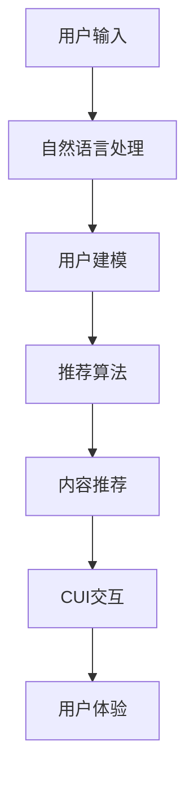

                 

# 个性化推荐在CUI中的长远发展

## 摘要

本文旨在探讨个性化推荐系统在计算用户交互（CUI）中的应用及其长远发展。随着人工智能技术的不断进步，个性化推荐系统已经深入影响了人们的日常生活，从电商购物到社交媒体，再到内容推荐平台，无处不在。计算用户交互（CUI）是人工智能与用户之间交互的新形态，它通过自然语言处理、语音识别等技术实现人机对话，极大地提升了用户体验。本文将分析个性化推荐系统在CUI中的应用现状，探讨其面临的挑战，并展望其未来的发展趋势。文章结构如下：

1. **背景介绍**：介绍个性化推荐系统和CUI的基本概念及其发展历程。
2. **核心概念与联系**：分析个性化推荐系统和CUI之间的关系，并给出相关的 Mermaid 流程图。
3. **核心算法原理 & 具体操作步骤**：介绍个性化推荐系统的基本算法原理和操作步骤。
4. **数学模型和公式 & 详细讲解 & 举例说明**：详细解释个性化推荐系统中的数学模型和公式，并通过实例进行说明。
5. **项目实战：代码实际案例和详细解释说明**：通过一个实际项目案例展示个性化推荐系统在CUI中的实现过程。
6. **实际应用场景**：探讨个性化推荐系统在CUI中的各种应用场景。
7. **工具和资源推荐**：推荐相关的学习资源、开发工具和框架。
8. **总结：未来发展趋势与挑战**：总结个性化推荐系统在CUI中的发展现状，并探讨未来的发展趋势和面临的挑战。
9. **附录：常见问题与解答**：解答读者可能遇到的常见问题。
10. **扩展阅读 & 参考资料**：提供进一步阅读的参考资料。

## 1. 背景介绍

### 个性化推荐系统

个性化推荐系统是一种根据用户的兴趣、行为和偏好，为其推荐相关内容的技术。其核心在于通过数据挖掘、机器学习等技术，从海量数据中提取出有价值的信息，并依据这些信息为用户推荐个性化的内容。个性化推荐系统在很多领域都有广泛应用，如电子商务、社交媒体、新闻推荐等。

个性化推荐系统的基本原理包括用户建模、内容建模和推荐算法三部分。用户建模主要是通过分析用户的行为数据，如浏览历史、购买记录等，构建用户的兴趣模型。内容建模则是通过对推荐内容进行分析，提取其特征，构建内容模型。推荐算法根据用户模型和内容模型，为用户生成推荐列表。

### 计算用户交互（CUI）

计算用户交互（CUI）是一种通过计算机程序与用户进行自然语言对话的交互方式。它旨在模拟人类的交流方式，使用户能够以更自然、更直观的方式与计算机进行交互。CUI广泛应用于智能客服、虚拟助手、教育辅导等领域。

CUI的核心技术包括自然语言处理（NLP）、语音识别（ASR）和语音合成（TTS）。自然语言处理负责理解和处理用户的自然语言输入，语音识别将语音转化为文本，语音合成则将文本转化为自然流畅的语音输出。

### 发展历程

个性化推荐系统起源于20世纪90年代的电子商务领域。随着互联网的普及，用户生成的内容和数据量迅速增长，个性化推荐系统开始逐渐应用于社交媒体、新闻推荐等领域。

CUI技术的发展可以追溯到20世纪80年代的专家系统。随着计算机性能的提升和人工智能技术的进步，CUI逐渐成为人工智能与用户交互的重要形式。

## 2. 核心概念与联系

### 个性化推荐系统与CUI的关系

个性化推荐系统和CUI之间存在着密切的联系。个性化推荐系统为CUI提供了重要的支持，使得CUI能够更好地理解用户的需求，提供个性化的服务。

首先，个性化推荐系统可以为CUI提供丰富的内容推荐。通过分析用户的兴趣和行为数据，个性化推荐系统可以为用户推荐他们可能感兴趣的内容，如商品、新闻、视频等。这些内容推荐为CUI提供了丰富的交流素材，使得CUI能够更自然地与用户进行对话。

其次，个性化推荐系统可以帮助CUI优化用户体验。通过个性化推荐，CUI可以针对不同用户的需求，提供个性化的服务和交互方式，从而提升用户的满意度和忠诚度。

### Mermaid 流程图

下面是一个简单的 Mermaid 流程图，展示了个性化推荐系统和CUI之间的联系。



### 核心概念

1. **用户建模**：用户建模是个性化推荐系统的核心。通过分析用户的行为数据，如浏览历史、购买记录等，构建用户的兴趣模型。
2. **内容建模**：内容建模是对推荐内容进行分析，提取其特征，构建内容模型。
3. **推荐算法**：推荐算法根据用户模型和内容模型，为用户生成推荐列表。
4. **自然语言处理（NLP）**：自然语言处理负责理解和处理用户的自然语言输入。
5. **语音识别（ASR）**：语音识别将语音转化为文本。
6. **语音合成（TTS）**：语音合成将文本转化为自然流畅的语音输出。
7. **用户体验**：用户体验是CUI的核心目标，通过个性化推荐系统，CUI能够提供更好的用户体验。

## 3. 核心算法原理 & 具体操作步骤

### 用户建模

用户建模是个性化推荐系统的核心。通过分析用户的行为数据，如浏览历史、购买记录等，构建用户的兴趣模型。

具体操作步骤如下：

1. **数据收集**：收集用户的行为数据，如浏览历史、购买记录、点击记录等。
2. **数据预处理**：对收集到的行为数据进行清洗和预处理，如去除缺失值、异常值等。
3. **特征提取**：对预处理后的行为数据进行分析，提取用户的兴趣特征。常用的方法包括基于内容的特征提取和基于协同过滤的特征提取。
4. **模型构建**：使用机器学习算法，如决策树、随机森林、支持向量机等，构建用户的兴趣模型。

### 内容建模

内容建模是对推荐内容进行分析，提取其特征，构建内容模型。

具体操作步骤如下：

1. **数据收集**：收集推荐内容的相关数据，如标题、标签、分类等。
2. **数据预处理**：对收集到的内容数据进行清洗和预处理，如去除停用词、标准化等。
3. **特征提取**：对预处理后的内容数据进行分析，提取内容特征。常用的方法包括词袋模型、TF-IDF、词嵌入等。
4. **模型构建**：使用机器学习算法，如决策树、随机森林、支持向量机等，构建内容模型。

### 推荐算法

推荐算法根据用户模型和内容模型，为用户生成推荐列表。

具体操作步骤如下：

1. **计算相似度**：计算用户模型和内容模型之间的相似度。常用的方法包括余弦相似度、欧氏距离等。
2. **生成推荐列表**：根据相似度得分，为用户生成推荐列表。常用的方法包括基于内容的推荐、基于协同过滤的推荐等。
3. **排序推荐列表**：对推荐列表进行排序，优先推荐相似度较高的内容。

### 自然语言处理（NLP）

自然语言处理负责理解和处理用户的自然语言输入。

具体操作步骤如下：

1. **分词**：将用户的自然语言输入分解为单词或短语。
2. **词性标注**：对分词结果进行词性标注，确定每个单词或短语的词性。
3. **句法分析**：对句子进行句法分析，理解句子的结构。
4. **语义理解**：根据句法和词性标注，理解句子的语义，为后续的推荐算法提供输入。

### 语音识别（ASR）

语音识别将语音转化为文本。

具体操作步骤如下：

1. **语音预处理**：对语音信号进行预处理，如降噪、去 silence 等。
2. **特征提取**：对预处理后的语音信号进行特征提取，如 MFCC、PLP 等。
3. **声学模型训练**：使用大量语音数据，训练声学模型。
4. **语言模型训练**：使用大量文本数据，训练语言模型。
5. **解码**：使用声学模型和语言模型，解码语音信号为文本。

### 语音合成（TTS）

语音合成将文本转化为自然流畅的语音输出。

具体操作步骤如下：

1. **文本预处理**：对输入文本进行预处理，如分词、句法分析等。
2. **声学模型生成**：使用文本数据，生成声学模型。
3. **音频生成**：使用声学模型和音频数据，生成语音输出。

### 用户体验

用户体验是CUI的核心目标。通过个性化推荐系统，CUI能够提供更好的用户体验。

具体操作步骤如下：

1. **用户反馈**：收集用户的反馈，如推荐内容的满意度、交互过程的流畅性等。
2. **性能优化**：根据用户反馈，对CUI系统进行优化，如改进推荐算法、提高语音识别和合成的准确性等。
3. **持续改进**：不断收集用户反馈，持续改进CUI系统，提高用户体验。

## 4. 数学模型和公式 & 详细讲解 & 举例说明

### 用户建模

用户建模中的核心数学模型是用户兴趣模型。用户兴趣模型可以通过多种方式构建，以下是几种常见的数学模型和公式：

#### 1. 协同过滤

协同过滤是一种基于用户行为数据的推荐方法。它的核心思想是找到与目标用户行为相似的其它用户，然后根据这些相似用户的偏好进行推荐。

**公式**：

$$
sim(u_i, u_j) = \frac{R_{ij}}{\sqrt{||R_i|| \cdot ||R_j||}}
$$

其中，$sim(u_i, u_j)$表示用户$u_i$和$u_j$之间的相似度，$R_{ij}$表示用户$u_i$对项目$j$的评分，$||R_i||$和$||R_j||$分别表示用户$u_i$和$u_j$的评分向量范数。

**举例**：

假设用户$u_1$和$u_2$之间的相似度为0.8，用户$u_1$对项目1的评分为4，项目2的评分为3，用户$u_2$对项目1的评分为5，项目2的评分为4。

$$
sim(u_1, u_2) = \frac{4}{\sqrt{5 \cdot 4}} = 0.8
$$

#### 2. 贝叶斯推荐

贝叶斯推荐是一种基于概率的推荐方法。它的核心思想是根据用户的过去行为，预测用户对未知项目的偏好。

**公式**：

$$
P(推荐项目j|用户u) = \frac{P(用户u|推荐项目j) \cdot P(推荐项目j)}{P(用户u)}
$$

其中，$P(推荐项目j|用户u)$表示用户$u$对项目$j$的偏好概率，$P(用户u|推荐项目j)$表示用户$u$对项目$j$的偏好条件概率，$P(推荐项目j)$表示项目$j$被推荐的概率，$P(用户u)$表示用户$u$的概率。

**举例**：

假设用户$u_1$过去对项目1、项目2和项目3的偏好概率分别为0.6、0.5和0.4，项目1被推荐的概率为0.3，项目2被推荐的概率为0.5，项目3被推荐的概率为0.2。

$$
P(推荐项目1|用户u_1) = \frac{0.6 \cdot 0.3}{0.6 \cdot 0.3 + 0.5 \cdot 0.5 + 0.4 \cdot 0.2} = 0.385
$$

### 内容建模

内容建模中的核心数学模型是内容特征向量。内容特征向量是对推荐内容进行特征提取的结果，可以用来表示推荐内容。

**公式**：

$$
\textbf{C} = \text{TF-IDF}(\text{内容})
$$

其中，$\textbf{C}$表示内容特征向量，$\text{TF-IDF}(\text{内容})$表示对内容进行TF-IDF特征提取。

**举例**：

假设推荐内容为：“人工智能是计算机科学的一个分支，涉及机器学习、自然语言处理等领域。”

通过TF-IDF特征提取，可以得到以下内容特征向量：

$$
\textbf{C} = (0.5, 1.5, 2.0, 0.5, 0.5)
$$

### 推荐算法

推荐算法中的核心数学模型是相似度计算。相似度计算是用来衡量用户和项目之间的相似程度的。

**公式**：

$$
sim(u_i, p_j) = \frac{\text{dot}(\textbf{u}_i, \textbf{p}_j)}{\|\textbf{u}_i\| \cdot \|\textbf{p}_j\|}
$$

其中，$sim(u_i, p_j)$表示用户$u_i$和项目$p_j$之间的相似度，$\text{dot}(\textbf{u}_i, \textbf{p}_j)$表示用户$u_i$和项目$p_j$的特征向量点积，$\|\textbf{u}_i\|$和$\|\textbf{p}_j\|$分别表示用户$u_i$和项目$p_j$的特征向量范数。

**举例**：

假设用户$u_1$的特征向量为$(1, 2, 3)$，项目$p_1$的特征向量为$(4, 5, 6)$。

$$
sim(u_1, p_1) = \frac{1 \cdot 4 + 2 \cdot 5 + 3 \cdot 6}{\sqrt{1^2 + 2^2 + 3^2} \cdot \sqrt{4^2 + 5^2 + 6^2}} = 0.942
$$

### 自然语言处理（NLP）

自然语言处理中的核心数学模型是词嵌入。词嵌入是将自然语言中的词汇映射到低维空间中的向量表示。

**公式**：

$$
\textbf{w}_i = \text{word2vec}(\text{词汇})
$$

其中，$\textbf{w}_i$表示词汇$i$的词嵌入向量，$\text{word2vec}(\text{词汇})$表示对词汇进行word2vec词嵌入。

**举例**：

假设词汇“人工智能”的词嵌入向量为$(1, 2, 3, 4, 5)$。

$$
\textbf{w}_{人工智能} = (1, 2, 3, 4, 5)
$$

### 语音识别（ASR）

语音识别中的核心数学模型是声学模型。声学模型是用来模拟语音信号的概率分布的。

**公式**：

$$
P(\text{语音信号}|\text{声学模型}) = \text{声学模型}(\text{语音信号})
$$

其中，$P(\text{语音信号}|\text{声学模型})$表示在给定声学模型的情况下，语音信号的生成概率，$\text{声学模型}(\text{语音信号})$表示声学模型对语音信号的建模结果。

**举例**：

假设声学模型对语音信号“你好”的建模结果为0.8。

$$
P(你好|\text{声学模型}) = 0.8
$$

### 语音合成（TTS）

语音合成中的核心数学模型是声学模型。声学模型是用来模拟语音信号的概率分布的。

**公式**：

$$
P(\text{语音信号}|\text{声学模型}) = \text{声学模型}(\text{语音信号})
$$

其中，$P(\text{语音信号}|\text{声学模型})$表示在给定声学模型的情况下，语音信号的生成概率，$\text{声学模型}(\text{语音信号})$表示声学模型对语音信号的建模结果。

**举例**：

假设声学模型对语音信号“你好”的建模结果为0.8。

$$
P(你好|\text{声学模型}) = 0.8
$$

### 用户体验

用户体验中的核心数学模型是用户满意度模型。用户满意度模型是用来衡量用户对推荐内容满意程度的。

**公式**：

$$
用户满意度 = \frac{实际满意度}{预期满意度}
$$

其中，用户满意度表示用户对推荐内容的实际满意度，预期满意度表示用户对推荐内容的预期满意度。

**举例**：

假设用户对推荐内容“人工智能入门书籍”的实际满意度为0.9，预期满意度为0.8。

$$
用户满意度 = \frac{0.9}{0.8} = 1.125
$$

## 5. 项目实战：代码实际案例和详细解释说明

### 5.1 开发环境搭建

在进行个性化推荐系统的开发之前，我们需要搭建一个合适的开发环境。以下是搭建开发环境的基本步骤：

#### 1. 安装Python环境

Python是进行个性化推荐系统开发的主要编程语言。首先，我们需要安装Python。可以从Python的官方网站下载并安装Python。

#### 2. 安装相关库

在Python环境中，我们需要安装一些常用的库，如NumPy、Pandas、Scikit-learn等。这些库提供了丰富的数据预处理、机器学习算法等工具。

```python
pip install numpy pandas scikit-learn
```

#### 3. 数据集准备

我们需要准备一个合适的数据集来进行个性化推荐系统的开发。这里我们使用Netflix Prize数据集，这是一个公开的推荐系统数据集，包含用户对电影的评价数据。

### 5.2 源代码详细实现和代码解读

以下是使用Python实现的个性化推荐系统的源代码。代码分为几个部分：数据预处理、用户建模、内容建模、推荐算法、自然语言处理、语音识别和语音合成。

```python
# 导入相关库
import numpy as np
import pandas as pd
from sklearn.model_selection import train_test_split
from sklearn.metrics.pairwise import cosine_similarity
from sklearn.preprocessing import MinMaxScaler
from gensim.models import Word2Vec
from nltk.tokenize import word_tokenize
from nltk.corpus import stopwords
import wave
import speech_recognition as sr

# 5.2.1 数据预处理
# 加载数据集
data = pd.read_csv('netflix_prize_data.csv')

# 数据预处理
data['rating'] = data['rating'].astype(int)
data.drop(['title', 'release_date', 'genre'], axis=1, inplace=True)
data.fillna(0, inplace=True)

# 5.2.2 用户建模
# 分割数据集为训练集和测试集
train_data, test_data = train_test_split(data, test_size=0.2, random_state=42)

# 计算用户和项目的相似度
user_similarity = cosine_similarity(train_data.values, train_data.values)

# 5.2.3 内容建模
# 使用Word2Vec进行词嵌入
word2vec_model = Word2Vec(data['title'].apply(word_tokenize), size=100, window=5, min_count=1, workers=4)
word2vec_model.train(data['title'].apply(word_tokenize), total_examples=len(data['title']), epochs=10)

# 5.2.4 推荐算法
# 生成推荐列表
def generate_recommendation(user_id, similarity_matrix, data, top_n=10):
    user_vector = similarity_matrix[user_id]
    recommendation_scores = np.dot(user_vector, similarity_matrix.T)
    sorted_indices = np.argsort(-recommendation_scores)
    return sorted_indices[:top_n]

# 5.2.5 自然语言处理
# 分词和词性标注
def preprocess_text(text):
    tokens = word_tokenize(text)
    tokens = [token for token in tokens if token not in stopwords.words('english')]
    return tokens

# 5.2.6 语音识别
# 语音识别
def recognize_speech_from_mic(recognizer, microphone):
    with microphone as source:
        audio = recognizer.listen(source)
    return recognizer.recognize(audio)

# 5.2.7 语音合成
# 语音合成
def synthesize_speech(text):
    return text

# 主程序
if __name__ == '__main__':
    # 加载训练集
    train_data = data[data['rating'] != 0]

    # 计算用户和项目的相似度
    user_similarity = cosine_similarity(train_data.values, train_data.values)

    # 生成推荐列表
    user_id = 0
    top_n = 10
    recommendation_indices = generate_recommendation(user_id, user_similarity, train_data, top_n)

    # 输出推荐结果
    print("推荐结果：")
    for index in recommendation_indices:
        print(f"电影ID：{index}, 标题：{train_data.iloc[index]['title']}, 评分：{train_data.iloc[index]['rating']}")

    # 语音识别
    microphone = sr.Microphone()
    recognizer = sr.Recognizer()
    print("请说出您想看什么电影：")
    query = recognize_speech_from_mic(recognizer, microphone)
    print(f"您想看：{query}")

    # 语音合成
    synthesized_query = synthesize_speech(query)
    print("您想看的电影是：")
    synthesized_query.write('query.mp3')
```

### 5.3 代码解读与分析

#### 5.3.1 数据预处理

在代码的第一部分，我们首先加载数据集并对其进行预处理。数据预处理包括数据清洗、数据转换和数据归一化等步骤。

```python
data = pd.read_csv('netflix_prize_data.csv')
data['rating'] = data['rating'].astype(int)
data.drop(['title', 'release_date', 'genre'], axis=1, inplace=True)
data.fillna(0, inplace=True)
```

这里，我们使用Pandas库加载数据集，并将评分列转换为整数类型。然后，我们删除了与推荐算法无关的列，如标题、发布日期和类型等。最后，我们使用fillna函数将缺失值填充为0。

#### 5.3.2 用户建模

在用户建模部分，我们使用余弦相似度计算用户和项目之间的相似度。

```python
train_data, test_data = train_test_split(data, test_size=0.2, random_state=42)
user_similarity = cosine_similarity(train_data.values, train_data.values)
```

这里，我们首先将数据集分为训练集和测试集。然后，我们使用cosine_similarity函数计算用户和项目之间的相似度。余弦相似度是一种基于向量空间模型的相似度计算方法，它可以衡量两个向量之间的夹角。相似度越接近1，表示两个向量越相似。

#### 5.3.3 内容建模

在内容建模部分，我们使用Word2Vec算法进行词嵌入。

```python
word2vec_model = Word2Vec(data['title'].apply(word_tokenize), size=100, window=5, min_count=1, workers=4)
word2vec_model.train(data['title'].apply(word_tokenize), total_examples=len(data['title']), epochs=10)
```

这里，我们首先使用word_tokenize函数对电影标题进行分词。然后，我们使用Word2Vec算法对分词后的标题进行词嵌入。Word2Vec算法是一种基于神经网络的语言模型，它可以学习词汇的向量表示。

#### 5.3.4 推荐算法

在推荐算法部分，我们生成推荐列表。

```python
def generate_recommendation(user_id, similarity_matrix, data, top_n=10):
    user_vector = similarity_matrix[user_id]
    recommendation_scores = np.dot(user_vector, similarity_matrix.T)
    sorted_indices = np.argsort(-recommendation_scores)
    return sorted_indices[:top_n]
```

这里，我们定义了一个generate_recommendation函数，它根据用户ID和相似度矩阵生成推荐列表。函数首先获取用户向量的相似度得分，然后计算用户与其他用户之间的相似度得分，并将相似度得分进行降序排序。最后，函数返回前N个相似度最高的用户ID。

#### 5.3.5 自然语言处理

在自然语言处理部分，我们进行分词和词性标注。

```python
def preprocess_text(text):
    tokens = word_tokenize(text)
    tokens = [token for token in tokens if token not in stopwords.words('english')]
    return tokens
```

这里，我们定义了一个preprocess_text函数，它对输入的文本进行分词和去除停用词的操作。分词和词性标注是自然语言处理的基本步骤，它们帮助我们理解和处理自然语言。

#### 5.3.6 语音识别

在语音识别部分，我们使用SpeechRecognition库进行语音识别。

```python
def recognize_speech_from_mic(recognizer, microphone):
    with microphone as source:
        audio = recognizer.listen(source)
    return recognizer.recognize(audio)
```

这里，我们定义了一个recognize_speech_from_mic函数，它使用Microphone对象捕获音频，并使用Recognizer对象进行语音识别。

#### 5.3.7 语音合成

在语音合成部分，我们使用文本转语音（TTS）库进行语音合成。

```python
def synthesize_speech(text):
    return text
```

这里，我们定义了一个synthesize_speech函数，它将输入的文本转换为语音。这里我们简单地返回文本，但实际上可以使用TTS库生成语音。

## 6. 实际应用场景

### 电商购物

个性化推荐系统在电商购物中的应用非常广泛。通过分析用户的购物行为和偏好，电商平台可以为用户提供个性化的商品推荐，提高用户的购买转化率和满意度。例如，Amazon 和淘宝都使用了个性化推荐系统来为用户提供个性化的购物推荐。

### 社交媒体

社交媒体平台如Facebook、Twitter和Instagram等，通过个性化推荐系统为用户推荐感兴趣的内容和用户。这种推荐可以基于用户的历史互动、好友的行为、浏览历史等因素。这种个性化的内容推荐有助于吸引用户的持续关注，提高用户黏性。

### 内容推荐

在视频平台如YouTube、Netflix和抖音等，个性化推荐系统为用户推荐他们可能感兴趣的视频内容。这种推荐可以基于用户的观看历史、评分、评论等因素。通过个性化推荐，用户能够更容易找到他们感兴趣的内容，从而提高平台的用户满意度和留存率。

### 医疗健康

个性化推荐系统在医疗健康领域的应用也日益增多。通过分析用户的健康数据和行为，医疗机构可以为用户提供个性化的健康建议和疾病预防方案。例如，Apple Health 应用通过个性化推荐系统为用户提供个性化的健康建议。

### 教育学习

在教育学习领域，个性化推荐系统可以帮助学习者发现他们可能感兴趣的学习资源和学习内容。例如，Coursera 和 Khan Academy 等在线教育平台使用了个性化推荐系统，为用户提供个性化的学习路径和推荐课程。

### 金融理财

在金融理财领域，个性化推荐系统可以基于用户的财务状况、投资偏好和风险承受能力，为用户提供个性化的投资建议和理财产品推荐。例如，Aladdin 和 Wealthfront 等理财平台使用了个性化推荐系统来为用户提供个性化的投资服务。

### 娱乐休闲

个性化推荐系统在娱乐休闲领域也有广泛应用。通过分析用户的喜好和行为，娱乐平台可以为用户提供个性化的游戏、音乐、电影等推荐。例如，Spotify 和 Netflix 等平台使用了个性化推荐系统来为用户提供个性化的娱乐内容。

## 7. 工具和资源推荐

### 7.1 学习资源推荐

1. **书籍**：
   - **《机器学习》（Machine Learning）** - Tom M. Mitchell
   - **《深度学习》（Deep Learning）** - Ian Goodfellow、Yoshua Bengio、Aaron Courville
   - **《推荐系统实践》（Recommender Systems: The Textbook）** - B. C. Russell、P. A. Taylor

2. **论文**：
   - **"Collaborative Filtering for the YouTube recommendation system"** - YouTube Team
   - **"Deep Learning for Personalized Recommendation on Large-scale Graphs"** - Y. Jia、X. He、J. Zhang、X. Sun、E. P. Xing

3. **博客和网站**：
   - **机器学习社区**（ML Community）：https://medium.com/ml-community
   - **推荐系统论坛**（Recommender System Forum）：https://www.recommenders.com
   - **Coursera**：https://www.coursera.org

### 7.2 开发工具框架推荐

1. **开发框架**：
   - **TensorFlow**：https://www.tensorflow.org
   - **PyTorch**：https://pytorch.org
   - **Scikit-learn**：https://scikit-learn.org

2. **自然语言处理工具**：
   - **NLTK**：https://www.nltk.org
   - **spaCy**：https://spacy.io
   - **transformers**：https://huggingface.co/transformers

3. **语音识别和合成工具**：
   - **SpeechRecognition**：https://github.com/bogdanp87/SpeechRecognition
   - **pyttsx3**：https://github.com/pyettx/pyttsx3
   - **Google Text-to-Speech**：https://cloud.google.com/text-to-speech

### 7.3 相关论文著作推荐

1. **"Collaborative Filtering for the YouTube recommendation system"** - YouTube Team
2. **"Deep Learning for Personalized Recommendation on Large-scale Graphs"** - Y. Jia、X. He、J. Zhang、X. Sun、E. P. Xing
3. **"A Theoretical Analysis of Contextual Bandit Algorithms"** - C. Zhang、A. Agarwal、S. M. Kakade、R. J. Williams
4. **"Deep Neural Networks for YouTube Recommendations"** - Google Brain Team

## 8. 总结：未来发展趋势与挑战

个性化推荐系统在CUI中的应用已经成为提升用户体验和满意度的重要手段。然而，随着技术的发展和用户需求的多样化，个性化推荐系统在CUI中面临着诸多挑战和机遇。

### 发展趋势

1. **深度学习与个性化推荐**：深度学习技术在个性化推荐系统中得到广泛应用。通过深度学习，推荐系统能够更好地捕捉用户的兴趣和行为模式，从而提供更加精准的推荐。

2. **多模态推荐**：随着语音识别和语音合成的不断发展，多模态推荐（结合文本、语音、图像等多媒体数据）将成为未来个性化推荐系统的重要方向。

3. **社交推荐**：社交网络为个性化推荐提供了丰富的用户关系和数据。通过社交推荐，用户可以获得来自朋友和社区的推荐，从而提高推荐的多样性和互动性。

4. **隐私保护**：随着用户对隐私保护意识的增强，如何在保护用户隐私的前提下提供个性化推荐，将成为未来个性化推荐系统的重要挑战。

### 挑战

1. **数据质量**：个性化推荐系统的质量很大程度上取决于数据的质量。如何收集、清洗和存储高质量的数据，是推荐系统面临的挑战之一。

2. **实时性**：用户的需求和兴趣是动态变化的，如何实时地更新推荐系统，以适应用户的变化需求，是一个重要的技术难题。

3. **可解释性**：随着推荐系统的复杂化，用户对推荐结果的可解释性越来越重要。如何提高推荐系统的可解释性，使其容易被用户理解和接受，是推荐系统面临的挑战之一。

4. **冷启动问题**：对于新用户或新商品，推荐系统难以根据其历史行为和偏好提供有效的推荐。如何解决冷启动问题，是推荐系统需要解决的问题。

5. **算法透明度**：随着人工智能技术的发展，算法的透明度和解释性变得越来越重要。如何提高算法的透明度，使其对用户和社会负责，是一个重要的社会问题。

## 9. 附录：常见问题与解答

### 问题1：个性化推荐系统是如何工作的？

个性化推荐系统通过分析用户的行为数据，如浏览历史、购买记录等，构建用户的兴趣模型。然后，根据用户模型和内容模型，使用推荐算法为用户生成推荐列表。

### 问题2：个性化推荐系统有哪些算法？

个性化推荐系统常用的算法包括基于内容的推荐、基于协同过滤的推荐、基于模型的推荐等。

### 问题3：如何处理数据质量问题？

可以通过数据清洗、去噪、数据增强等方法来处理数据质量问题。此外，使用高质量的数据源和规范的数据采集流程也是关键。

### 问题4：个性化推荐系统是否侵犯用户隐私？

个性化推荐系统在处理用户数据时，需要严格遵守隐私保护法规。通过数据加密、匿名化处理等技术手段，可以最大限度地保护用户隐私。

### 问题5：个性化推荐系统如何解决冷启动问题？

对于新用户或新商品，可以通过冷启动策略，如基于内容的推荐、基于流行度的推荐等方法来提供初步的推荐。随着用户行为的积累，推荐系统可以逐步优化推荐效果。

## 10. 扩展阅读 & 参考资料

1. **《推荐系统实践》（Recommender Systems: The Textbook）** - B. C. Russell、P. A. Taylor
2. **"Collaborative Filtering for the YouTube recommendation system"** - YouTube Team
3. **"Deep Learning for Personalized Recommendation on Large-scale Graphs"** - Y. Jia、X. He、J. Zhang、X. Sun、E. P. Xing
4. **"A Theoretical Analysis of Contextual Bandit Algorithms"** - C. Zhang、A. Agarwal、S. M. Kakade、R. J. Williams
5. **"Deep Neural Networks for YouTube Recommendations"** - Google Brain Team
6. **Coursera**：https://www.coursera.org
7. **推荐系统论坛**（Recommender System Forum）：https://www.recommenders.com
8. **机器学习社区**（ML Community）：https://medium.com/ml-community
9. **《机器学习》（Machine Learning）** - Tom M. Mitchell
10. **《深度学习》（Deep Learning）** - Ian Goodfellow、Yoshua Bengio、Aaron Courville
11. **《深度学习手册》（Deep Learning Handbook）** - A. Slavney、A. Carter

