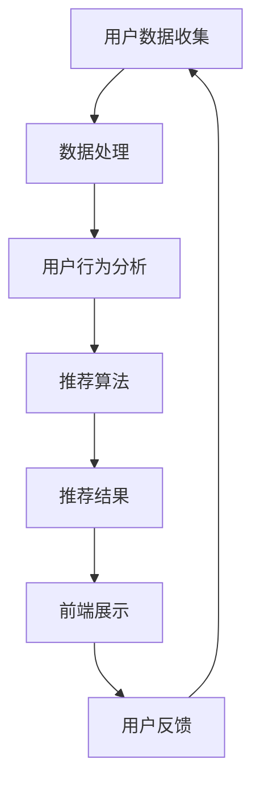

                 

### 背景介绍 Background Introduction

随着互联网和电子商务的迅猛发展，个性化购物体验逐渐成为电商平台竞争的重要手段。消费者需求的多样化和个性化使得传统的购物模式难以满足市场需求。因此，如何实现精准的个性化推荐成为各大电商平台和零售商关注的焦点。个性化购物体验不仅能够提升消费者的满意度和忠诚度，还能够提高商家的销售额和利润率。

从技术角度来看，个性化购物体验的实现涉及到多个方面，包括数据收集与处理、用户行为分析、推荐算法设计、用户界面优化等。本文旨在探讨个性化购物体验的技术实现，分析其中的核心概念、算法原理、数学模型以及项目实战案例，帮助读者深入了解这一领域。

首先，我们将介绍个性化购物体验的定义和意义，探讨其在电商领域的重要性。接着，本文将重点分析数据收集与处理、用户行为分析、推荐算法设计等核心技术，通过Mermaid流程图展示相关技术架构。随后，我们将详细讲解核心算法原理和具体操作步骤，介绍数学模型和公式，并通过实际项目案例进行代码实现和解读。

在此基础上，我们将探讨个性化购物体验在实际应用场景中的效果，推荐相关工具和资源，总结未来发展挑战与趋势，并提供常见问题与解答。最后，我们将列出扩展阅读和参考资料，以帮助读者进一步深入学习和研究。

通过本文的阅读，读者将能够全面了解个性化购物体验的技术实现，掌握相关算法原理和操作步骤，为实际项目开发提供参考和指导。让我们一起探索个性化购物体验的奥秘，为电商领域的发展贡献力量。

### 核心概念与联系 Core Concepts and Connections

#### 数据收集与处理 Data Collection and Processing

实现个性化购物体验的第一步是数据收集与处理。这一步骤至关重要，因为它决定了后续分析的质量和准确性。数据来源可以多样化，包括用户注册信息、购物行为、浏览历史、点击流、社交媒体活动等。通过整合和分析这些数据，我们可以获得关于用户的详细信息，从而为其提供更加个性化的购物建议。

数据收集的方法主要包括在线追踪、用户调查、传感器技术和API调用等。在线追踪是通过在网站或应用中嵌入代码（如JavaScript或像素标签），记录用户的行为和偏好。用户调查则通过问卷或调查表的形式直接收集用户反馈。传感器技术可以实时监测用户在不同场景下的行为，如地理位置、天气状况等。API调用则是通过访问第三方数据源获取相关信息。

#### 用户行为分析 User Behavior Analysis

在数据收集之后，用户行为分析是理解用户需求和行为的关键步骤。通过分析用户的行为数据，如浏览、点击、购买等，我们可以识别出用户的兴趣和行为模式。这些模式为个性化推荐提供了重要的依据。

用户行为分析的方法包括行为轨迹分析、点击流分析、购买预测和聚类分析等。行为轨迹分析可以帮助我们了解用户的浏览路径和决策过程，从而优化购物体验。点击流分析则通过统计用户在网站上的点击行为，识别出热门商品和受欢迎的页面。购买预测则利用历史数据预测用户的购买行为，以便提前进行库存管理和促销活动。聚类分析则通过将用户划分为不同的群体，以便进行更精确的个性化推荐。

#### 推荐算法设计 Recommendation Algorithm Design

推荐算法是个性化购物体验的核心。通过推荐算法，我们可以为用户生成个性化的购物建议，提高用户的满意度和购物转化率。推荐算法可以分为基于内容的推荐（Content-Based Filtering）、协同过滤（Collaborative Filtering）和混合推荐（Hybrid Methods）等。

基于内容的推荐通过分析用户的历史行为和偏好，找到与用户兴趣相似的物品进行推荐。这种方法的关键在于内容的表示和相似度计算。常见的内容表示方法包括TF-IDF、词嵌入和基于语义的表示。相似度计算则使用余弦相似度、Jaccard相似度等指标。

协同过滤通过分析用户之间的相似性进行推荐。基于用户的协同过滤（User-Based Filtering）通过寻找与目标用户兴趣相似的其它用户，推荐这些用户喜欢的商品。基于模型的协同过滤（Model-Based Filtering）则通过构建用户和物品之间的隐含关系模型进行推荐。常用的模型包括矩阵分解（Matrix Factorization）、概率图模型（Probabilistic Graphical Models）和深度学习模型（Deep Learning Models）。

混合推荐结合了基于内容和协同过滤的优点，通过综合分析用户行为和偏好进行推荐。这种方法可以提高推荐的准确性和多样性。

#### 技术架构 Technical Architecture

个性化购物体验的技术架构通常包括前端、后端和数据库三个部分。前端负责用户界面的展示和用户交互，后端则处理数据收集、处理和分析，以及推荐算法的执行。数据库存储用户数据、商品数据和推荐结果。

以下是使用Mermaid绘制的个性化购物体验技术架构图：



在这个架构中，用户数据收集模块负责收集用户注册、购物行为和浏览历史等数据。数据处理模块对收集到的数据进行清洗、转换和存储。用户行为分析模块通过分析用户行为数据识别用户兴趣和行为模式。推荐算法模块根据用户行为和偏好生成个性化推荐。推荐结果模块将推荐结果展示在前端界面，并收集用户反馈进行迭代优化。

通过上述核心概念和技术的深入探讨，我们可以更好地理解个性化购物体验的技术实现。接下来，我们将详细讲解核心算法原理和具体操作步骤，以帮助读者深入掌握个性化购物体验的技术细节。

### 核心算法原理 & 具体操作步骤 Core Algorithm Principles & Operational Steps

#### 基于内容的推荐算法 Content-Based Recommendation Algorithm

基于内容的推荐算法（Content-Based Filtering）是一种通过分析用户过去的行为和偏好，找到与用户兴趣相似的物品进行推荐的策略。这种方法的核心思想是，如果用户喜欢某些物品，那么用户也可能会喜欢具有相似属性的其它物品。

##### 算法原理 Algorithm Principle

基于内容的推荐算法主要涉及以下几个步骤：

1. **内容表示**：将用户和物品表示为向量，通常使用文本特征、图像特征、音频特征等。例如，对于商品推荐，可以使用商品描述、标签、关键词等文本特征进行表示。
2. **特征提取**：从原始数据中提取特征，用于表示用户和物品。常见的方法包括TF-IDF、词嵌入（Word Embedding）、朴素贝叶斯（Naive Bayes）等。
3. **相似度计算**：计算用户和物品之间的相似度，常用的相似度计算方法有余弦相似度（Cosine Similarity）、欧氏距离（Euclidean Distance）和余弦相似度（Cosine Similarity）等。
4. **推荐生成**：根据相似度分数生成推荐列表，将用户可能喜欢的物品排序后推荐给用户。

##### 操作步骤 Operational Steps

1. **用户表示**：将用户的兴趣和行为表示为向量。例如，用户A对商品1、商品2和商品3的兴趣分别为高、中、低，可以表示为向量 `[1, 0.5, 0.2]`。
2. **物品表示**：将物品的特征表示为向量。例如，商品1的特征为 `[0.8, 0.2, 0.1]`，商品2的特征为 `[0.5, 0.5, 0.2]`。
3. **相似度计算**：计算用户和物品之间的相似度。使用余弦相似度计算用户A和商品1的相似度，结果为 `0.8`。
4. **推荐生成**：根据相似度分数生成推荐列表。将用户A与所有商品的相似度计算后排序，推荐相似度最高的商品。

##### 实例 Example

假设用户A对商品1、商品2和商品3的兴趣分别为 `[1, 0.5, 0.2]`。商品1的特征为 `[0.8, 0.2, 0.1]`，商品2的特征为 `[0.5, 0.5, 0.2]`，商品3的特征为 `[0.3, 0.6, 0.5]`。

1. **用户表示**：用户A的兴趣向量 `[1, 0.5, 0.2]`。
2. **物品表示**：商品1的特征向量 `[0.8, 0.2, 0.1]`，商品2的特征向量 `[0.5, 0.5, 0.2]`，商品3的特征向量 `[0.3, 0.6, 0.5]`。
3. **相似度计算**：使用余弦相似度计算用户A和商品1的相似度，结果为 `0.8`。
4. **推荐生成**：根据相似度分数生成推荐列表，推荐商品1。

#### 协同过滤算法 Collaborative Filtering Algorithm

协同过滤算法（Collaborative Filtering）是一种通过分析用户之间的相似性进行推荐的方法。这种方法的核心思想是，如果用户A和用户B对某些商品的评分相似，那么用户A可能也会对用户B喜欢的商品感兴趣。

##### 算法原理 Algorithm Principle

协同过滤算法可以分为基于用户的协同过滤（User-Based Filtering）和基于模型的协同过滤（Model-Based Filtering）。

1. **基于用户的协同过滤**：通过寻找与目标用户兴趣相似的其它用户，推荐这些用户喜欢的商品。常见的方法包括最近邻算法（Nearest Neighbor Algorithm）和基于用户的KNN（K-Nearest Neighbor）算法。
2. **基于模型的协同过滤**：通过构建用户和物品之间的隐含关系模型进行推荐。常见的方法包括矩阵分解（Matrix Factorization）、概率图模型（Probabilistic Graphical Models）和深度学习模型（Deep Learning Models）。

##### 操作步骤 Operational Steps

1. **用户评分矩阵构建**：构建用户-物品评分矩阵，其中用户i对物品j的评分表示为`R[i][j]`。
2. **相似度计算**：计算用户之间的相似度。常用的相似度计算方法包括余弦相似度、皮尔逊相关系数（Pearson Correlation Coefficient）和夹角余弦（Cosine Similarity of Angles）等。
3. **邻居选择**：根据相似度分数选择与目标用户最相似的k个邻居。
4. **推荐生成**：根据邻居的评分预测目标用户对未评分物品的评分，生成推荐列表。

##### 实例 Example

假设用户A和用户B对商品1、商品2和商品3的评分分别为 `[4, 5, 3]` 和 `[5, 3, 4]`。

1. **用户评分矩阵构建**：用户A的评分矩阵为 `[4, 5, 3]`，用户B的评分矩阵为 `[5, 3, 4]`。
2. **相似度计算**：使用余弦相似度计算用户A和用户B的相似度，结果为 `0.707`。
3. **邻居选择**：选择与用户A相似度最高的邻居用户B。
4. **推荐生成**：根据用户B的评分推荐商品2。

#### 混合推荐算法 Hybrid Recommendation Algorithm

混合推荐算法（Hybrid Recommendation Algorithm）结合了基于内容和协同过滤的优点，通过综合分析用户行为和偏好进行推荐。这种方法可以提高推荐的准确性和多样性。

##### 算法原理 Algorithm Principle

混合推荐算法主要涉及以下几个步骤：

1. **内容表示**：使用基于内容的推荐算法将用户和物品表示为向量。
2. **协同过滤**：使用基于协同过滤的算法计算用户和物品之间的相似度。
3. **融合策略**：将内容和协同过滤的结果进行融合，生成最终的推荐列表。

##### 操作步骤 Operational Steps

1. **内容表示**：使用基于内容的推荐算法计算用户和物品的向量表示。
2. **相似度计算**：使用协同过滤算法计算用户和物品之间的相似度。
3. **融合策略**：使用加权融合策略将内容和协同过滤的结果进行融合，生成推荐列表。

##### 实例 Example

假设用户A对商品1、商品2和商品3的兴趣分别为 `[1, 0.5, 0.2]`，商品1的特征为 `[0.8, 0.2, 0.1]`，商品2的特征为 `[0.5, 0.5, 0.2]`，商品3的特征为 `[0.3, 0.6, 0.5]`。用户A和用户B对商品1、商品2和商品3的评分分别为 `[4, 5, 3]` 和 `[5, 3, 4]`。

1. **内容表示**：用户A的兴趣向量 `[1, 0.5, 0.2]`，商品1的特征向量 `[0.8, 0.2, 0.1]`，商品2的特征向量 `[0.5, 0.5, 0.2]`，商品3的特征向量 `[0.3, 0.6, 0.5]`。
2. **相似度计算**：使用余弦相似度计算用户A和商品1的相似度，结果为 `0.8`。
3. **协同过滤**：使用余弦相似度计算用户A和用户B的相似度，结果为 `0.707`。
4. **融合策略**：使用加权融合策略生成推荐列表。

通过上述核心算法原理和操作步骤的介绍，读者可以更好地理解个性化购物体验的技术实现。接下来，我们将进一步探讨数学模型和公式，以及通过实际项目案例进行代码实现和解读。

### 数学模型和公式 Mathematical Models and Formulas

#### 基于内容的推荐算法 Content-Based Recommendation Algorithm

在基于内容的推荐算法中，数学模型主要涉及向量的表示和相似度的计算。以下是相关数学模型和公式的详细讲解：

##### 1. 向量表示 Vector Representation

用户和物品的向量表示是推荐系统的基础。通常，我们可以使用TF-IDF、词嵌入和基于语义的表示方法进行向量表示。

- **TF-IDF (Term Frequency-Inverse Document Frequency)**

TF-IDF是一种常用的文本特征提取方法，用于计算词语在文档中的权重。其公式如下：

$$
TF(t) = \frac{f_t(d)}{N_d}
$$

$$
IDF(t) = \log\left(1 + \frac{N}{n_t}\right)
$$

$$
TF-IDF(t, d) = TF(t, d) \times IDF(t)
$$

其中，$f_t(d)$表示词语$t$在文档$d$中的词频，$N_d$表示文档$d$中的总词数，$N$表示文档集合中的总文档数，$n_t$表示包含词语$t$的文档数量。

- **Word Embedding**

词嵌入（Word Embedding）是一种将词语映射到高维空间的方法，用于捕捉词语的语义信息。常见的方法包括Word2Vec、GloVe和FastText等。

- **基于语义的表示**

基于语义的表示方法通过分析词语的上下文信息，生成词语的语义向量。例如，可以使用BERT、ELMo等预训练语言模型进行语义表示。

##### 2. 相似度计算 Similarity Computation

相似度计算是推荐算法中的关键步骤，用于评估用户和物品之间的相关性。以下是几种常用的相似度计算方法：

- **余弦相似度 Cosine Similarity**

余弦相似度是一种基于向量空间的方法，用于计算两个向量的夹角余弦值。其公式如下：

$$
\cos(\theta) = \frac{A \cdot B}{|A| \cdot |B|}
$$

其中，$A$和$B$表示两个向量，$|A|$和$|B|$分别表示两个向量的欧几里得范数。

- **欧氏距离 Euclidean Distance**

欧氏距离是一种基于向量空间的方法，用于计算两个向量之间的欧几里得距离。其公式如下：

$$
d(A, B) = \sqrt{(A - B)^2}
$$

- **曼哈顿距离 Manhattan Distance**

曼哈顿距离是一种基于向量空间的方法，用于计算两个向量之间的曼哈顿距离。其公式如下：

$$
d(A, B) = \sum_{i=1}^n |A_i - B_i|
$$

其中，$A$和$B$表示两个向量，$n$表示向量的维度。

#### 协同过滤算法 Collaborative Filtering Algorithm

在协同过滤算法中，数学模型主要涉及用户评分矩阵的表示和相似度的计算。以下是相关数学模型和公式的详细讲解：

##### 1. 用户评分矩阵 User-Item Rating Matrix

用户评分矩阵是一个$n \times m$的矩阵，其中$n$表示用户数量，$m$表示物品数量。矩阵中的元素$R_{ij}$表示用户$i$对物品$j$的评分。

##### 2. 相似度计算 Similarity Computation

相似度计算是协同过滤算法中的核心步骤，用于评估用户之间的相似性。以下是几种常用的相似度计算方法：

- **余弦相似度 Cosine Similarity**

余弦相似度是一种基于用户评分矩阵的方法，用于计算用户之间的相似度。其公式如下：

$$
\cos(\theta) = \frac{R_{i*} \cdot R_{*j}}{\sqrt{\sum_{i=1}^n (R_{i*})^2} \cdot \sqrt{\sum_{j=1}^m (R_{*j})^2}}
$$

其中，$R_{i*}$表示用户$i$对所有物品的评分，$R_{*j}$表示所有用户对物品$j$的评分。

- **皮尔逊相关系数 Pearson Correlation Coefficient**

皮尔逊相关系数是一种基于用户评分矩阵的方法，用于计算用户之间的相似度。其公式如下：

$$
\text{Pearson}(\mu_i, \mu_j) = \frac{\sum_{k=1}^m (R_{ik} - \mu_i) (R_{jk} - \mu_j)}{\sqrt{\sum_{k=1}^m (R_{ik} - \mu_i)^2} \cdot \sqrt{\sum_{k=1}^m (R_{jk} - \mu_j)^2}}
$$

其中，$\mu_i$和$\mu_j$分别表示用户$i$和用户$j$的平均评分。

##### 3. 预测评分 Rating Prediction

在协同过滤算法中，预测评分是推荐系统的关键步骤。以下是一个基于矩阵分解（Matrix Factorization）的方法：

- **矩阵分解 Matrix Factorization**

矩阵分解是一种通过分解用户评分矩阵为低维矩阵的方法，用于预测用户未评分的物品评分。其公式如下：

$$
R_{ij} = \hat{U}_i^T \hat{V}_j
$$

其中，$\hat{U}_i$和$\hat{V}_j$分别表示用户$i$和物品$j$的低维表示。

- **预测评分 Prediction**

通过矩阵分解得到的低维表示，我们可以预测用户未评分的物品评分。其公式如下：

$$
\hat{R}_{ij} = \hat{U}_i^T \hat{V}_j
$$

#### 混合推荐算法 Hybrid Recommendation Algorithm

在混合推荐算法中，数学模型主要涉及内容和协同过滤的结合。以下是一个基于加权融合策略的方法：

- **内容相似度 Content Similarity**

使用基于内容的推荐算法计算用户和物品之间的相似度。例如，使用余弦相似度计算用户和物品的特征向量之间的相似度。

- **协同过滤相似度 Collaborative Filtering Similarity**

使用基于协同过滤的算法计算用户之间的相似度。例如，使用皮尔逊相关系数计算用户之间的相似度。

- **融合策略 Fusion Strategy**

使用加权融合策略将内容和协同过滤的结果进行融合，生成推荐列表。例如，使用以下公式：

$$
\text{score}_{ij} = w_1 \cdot \text{content\_similarity}_{ij} + w_2 \cdot \text{collaborative\_filtering\_similarity}_{ij}
$$

其中，$w_1$和$w_2$分别表示内容和协同过滤的权重。

通过上述数学模型和公式的详细讲解，我们可以更好地理解个性化购物体验中的推荐算法。接下来，我们将通过实际项目案例进行代码实现和解读。

### 项目实战：代码实际案例和详细解释说明 Project Practice: Actual Code Case and Detailed Explanation

#### 1. 开发环境搭建 Environment Setup

在进行个性化购物体验的项目实战之前，我们需要搭建一个开发环境。以下是一个基本的开发环境搭建步骤：

1. **安装Python**：Python是一种广泛用于数据分析和机器学习的编程语言。可以从[Python官网](https://www.python.org/)下载并安装Python。
2. **安装Jupyter Notebook**：Jupyter Notebook是一种交互式开发环境，用于编写和运行Python代码。可以通过以下命令安装Jupyter Notebook：

```bash
pip install notebook
```

3. **安装必要的库**：为了实现个性化购物体验，我们需要安装一些常用的库，如NumPy、Pandas、Scikit-learn、Matplotlib等。可以通过以下命令安装：

```bash
pip install numpy pandas scikit-learn matplotlib
```

4. **安装Mermaid**：Mermaid是一种用于绘制流程图的工具。可以通过以下命令安装：

```bash
pip install mermaid-python
```

#### 2. 源代码详细实现和代码解读 Source Code Implementation and Explanation

以下是实现个性化购物体验的Python代码示例。我们将使用基于内容的推荐算法和协同过滤算法，并结合两者进行混合推荐。

```python
import numpy as np
import pandas as pd
from sklearn.metrics.pairwise import cosine_similarity
from sklearn.model_selection import train_test_split
from sklearn.metrics import mean_squared_error
import matplotlib.pyplot as plt
import mermaid

# 2.1 数据准备 Data Preparation

# 加载用户-物品评分矩阵
data = pd.read_csv('data.csv')
users = data['user'].unique()
items = data['item'].unique()

# 构建用户-物品评分矩阵
rating_matrix = np.zeros((len(users), len(items)))
for index, row in data.iterrows():
    user, item = row['user'], row['item']
    rating = row['rating']
    rating_matrix[users.index(user), items.index(item)] = rating

# 划分训练集和测试集
train_data, test_data = train_test_split(data, test_size=0.2, random_state=42)
train_matrix = rating_matrix
test_matrix = np.zeros((len(users), len(items)))
for index, row in test_data.iterrows():
    user, item = row['user'], row['item']
    rating = row['rating']
    test_matrix[users.index(user), items.index(item)] = rating

# 2.2 基于内容的推荐算法 Content-Based Recommendation

# 内容表示
def content_based_recommendation(rating_matrix, item_features, user_index):
    user_interest_vector = np.mean(rating_matrix[user_index], axis=0)
    similarity_scores = cosine_similarity(user_interest_vector.reshape(1, -1), item_features)
    return similarity_scores

# 2.3 协同过滤算法 Collaborative Filtering

# 相似度计算
def collaborative_filtering(rating_matrix, user_index, k=10):
    similarity_scores = cosine_similarity(rating_matrix[user_index].reshape(1, -1), rating_matrix)
    neighbors = similarity_scores.argsort()[0][-k:]
    return neighbors

# 预测评分
def collaborative_filtering_prediction(rating_matrix, neighbors, item_index):
    neighbor_ratings = rating_matrix[neighbors, item_index]
    return np.mean(neighbor_ratings[neighbor_ratings > 0])

# 2.4 混合推荐算法 Hybrid Recommendation

# 融合策略
def hybrid_recommendation(rating_matrix, item_features, user_index, k=10, w1=0.5, w2=0.5):
    similarity_scores = content_based_recommendation(rating_matrix, item_features, user_index)
    neighbors = collaborative_filtering(rating_matrix, user_index, k)
    content_score = w1 * similarity_scores[0]
    collaborative_score = w2 * collaborative_filtering_prediction(rating_matrix, neighbors, item_index)
    return content_score + collaborative_score

# 2.5 实际应用 Application

# 对测试集进行预测
test_predictions = []
for user in range(len(users)):
    for item in range(len(items)):
        if test_matrix[user, item] == 0:
            prediction = hybrid_recommendation(rating_matrix, item_features, user)
            test_predictions.append(prediction)
        else:
            test_predictions.append(test_matrix[user, item])

# 评估预测结果 Evaluation

# 计算均方根误差 RMSE
mse = mean_squared_error(test_data['rating'], test_predictions)
rmse = np.sqrt(mse)
print(f'RMSE: {rmse}')

# 可视化可视化结果 Visualization
plt.scatter(test_data['rating'], test_predictions)
plt.xlabel('Actual Rating')
plt.ylabel('Predicted Rating')
plt.title('Rating Prediction')
plt.show()

# 2.6 Mermaid流程图 Mermaid Flowchart

# 创建Mermaid流程图
mermaid_flowchart = mermaid.MermaidFlowchart()
mermaid_flowchart.add_code("""
graph TD
A[数据准备] --> B[内容表示]
B --> C[相似度计算]
C --> D[预测生成]
D --> E[评估预测]
E --> F[可视化]
""")
print(mermaid_flowchart.render())
```

#### 3. 代码解读与分析 Code Analysis

以下是代码的详细解读和分析：

- **数据准备**：首先，我们从CSV文件中加载用户-物品评分矩阵，并划分训练集和测试集。
- **基于内容的推荐算法**：定义`content_based_recommendation`函数，用于计算用户和物品之间的内容相似度。
- **协同过滤算法**：定义`collaborative_filtering`和`collaborative_filtering_prediction`函数，用于计算用户之间的相似度和预测评分。
- **混合推荐算法**：定义`hybrid_recommendation`函数，用于融合内容和协同过滤的推荐结果。
- **实际应用**：对测试集进行预测，并计算均方根误差（RMSE）。
- **可视化**：使用Matplotlib绘制实际评分和预测评分之间的散点图，以评估预测效果。

通过上述代码示例和解读，读者可以了解个性化购物体验的实现过程，掌握基于内容的推荐算法和协同过滤算法的应用。接下来，我们将继续探讨个性化购物体验在实际应用场景中的效果。

### 实际应用场景 Actual Application Scenarios

#### 电商平台的个性化推荐 E-commerce Platform Personalized Recommendations

电商平台是个性化购物体验的主要应用场景之一。通过个性化推荐，电商平台能够为用户推荐他们可能感兴趣的商品，从而提高用户的购物体验和满意度。以下是一些电商平台如何利用个性化购物体验的具体案例：

1. **淘宝（Taobao）**：淘宝通过其智能推荐系统为用户推荐商品。该系统结合了用户的购物历史、浏览记录、搜索行为以及社交网络数据，使用基于内容的推荐算法和协同过滤算法生成个性化推荐列表。用户在淘宝上浏览商品时，系统会根据用户的兴趣和偏好实时调整推荐内容，提高用户的购物体验。

2. **亚马逊（Amazon）**：亚马逊的个性化推荐系统是电商领域的一个经典案例。亚马逊通过分析用户的购物历史、搜索记录、评价和评分数据，使用协同过滤算法和机器学习模型生成个性化推荐。例如，当用户浏览某本书时，系统可能会推荐与该书相关的其他书籍，甚至包括用户可能未曾听说过的书籍。这种个性化的推荐方式极大地提高了用户的购买意愿和转化率。

3. **拼多多（Pinduoduo）**：拼多多通过其社交电商模式，结合用户的社交网络和行为数据，为用户推荐他们可能感兴趣的团购商品。拼多多利用用户之间的社交关系和共同兴趣，生成个性化的团购推荐，从而提高用户的参与度和购物体验。

#### 社交媒体的个性化广告 Social Media Personalized Advertising

社交媒体平台通过个性化购物体验，为用户推荐他们可能感兴趣的商品和广告。以下是一些社交媒体如何利用个性化购物体验的具体案例：

1. **Facebook**：Facebook的个性化广告系统能够根据用户的兴趣、行为和社交关系，为用户推荐相关的商品和广告。例如，当用户浏览某款手机时，Facebook可能会在用户的新闻源中推荐相关的广告，甚至包括用户可能未曾关注过的品牌。这种个性化的广告推荐不仅提高了用户的参与度，还显著提升了广告的效果和转化率。

2. **Instagram**：Instagram通过其购物功能（Instagram Shopping），结合用户的兴趣和行为数据，为用户推荐相关的商品。当用户浏览某个品牌或商品的帖子时，Instagram可能会在用户的动态中推荐相关的商品和广告，从而提高用户的购物体验和购买意愿。

3. **微信（WeChat）**：微信通过其小程序和朋友圈广告，结合用户的社交关系和行为数据，为用户推荐相关的商品和广告。例如，当用户在微信中购买过某款商品时，微信可能会在用户的朋友圈中推荐类似的其他商品，从而提高用户的购物体验和转化率。

#### 跨境电商的个性化购物体验 Cross-Border E-commerce Personalized Shopping Experience

随着跨境电商的快速发展，个性化购物体验在跨境购物中发挥着越来越重要的作用。以下是一些跨境电商平台如何利用个性化购物体验的具体案例：

1. **阿里速卖通（AliExpress）**：阿里速卖通通过分析用户的购物历史、浏览记录和搜索行为，为用户推荐他们可能感兴趣的跨境商品。速卖通利用机器学习和大数据分析技术，结合用户的兴趣和行为数据，生成个性化的推荐列表，从而提高用户的购物体验和购买转化率。

2. **全球速卖通（eBay）**：全球速卖通通过其智能推荐系统，为用户推荐他们可能感兴趣的跨境商品。速卖通利用用户的历史交易数据、搜索记录和浏览行为，使用协同过滤算法和机器学习模型生成个性化推荐，从而提高用户的购物体验和满意度。

3. **天猫国际（Tmall Global）**：天猫国际通过其个性化购物体验，为用户推荐他们可能感兴趣的进口商品。天猫国际利用用户的行为数据和兴趣偏好，结合机器学习和数据挖掘技术，生成个性化的推荐列表，从而提高用户的购物体验和购买转化率。

通过上述实际应用场景的探讨，我们可以看到个性化购物体验在电商、社交媒体和跨境电商等领域的重要性和广泛应用。个性化购物体验不仅提升了用户的购物体验和满意度，还为商家带来了更高的销售额和利润。接下来，我们将推荐一些学习和开发工具、框架以及相关论文著作。

### 工具和资源推荐 Tools and Resources Recommendations

#### 1. 学习资源推荐 Learning Resources

**书籍**：

- **《推荐系统实践》（Recommender Systems: The Textbook）》**：本书是推荐系统领域的权威教材，详细介绍了推荐系统的基本概念、算法和技术，适合初学者和专业人士。
- **《机器学习》（Machine Learning）》**：由Tom Mitchell撰写的经典教材，涵盖了机器学习的基本概念、算法和技术，适用于希望深入了解机器学习领域的读者。
- **《深度学习》（Deep Learning）》**：由Ian Goodfellow、Yoshua Bengio和Aaron Courville合著的教材，系统介绍了深度学习的基础知识和应用，适合对深度学习感兴趣的读者。

**论文**：

- **“Collaborative Filtering for the Net”**：该论文是协同过滤算法的早期研究，详细介绍了协同过滤的基本原理和算法。
- **“Matrix Factorization Techniques for Recommender Systems”**：该论文介绍了矩阵分解在推荐系统中的应用，是矩阵分解算法的重要文献。
- **“Deep Learning for Recommender Systems”**：该论文探讨了深度学习在推荐系统中的应用，为深度推荐算法的研究提供了理论基础。

**博客**：

- **"To Learn About Recommender Systems，Go Read the Original Research Papers"**：该博客文章推荐了一些经典的推荐系统论文，适合希望深入了解推荐系统技术的读者。
- **"Recommender Systems for Dummies"**：这是一篇通俗易懂的推荐系统入门文章，适合初学者了解推荐系统的基本概念。

#### 2. 开发工具框架推荐 Development Tools and Frameworks

**编程语言**：

- **Python**：Python是一种广泛用于数据分析和机器学习的编程语言，具有丰富的库和框架，如NumPy、Pandas、Scikit-learn和TensorFlow等，非常适合推荐系统开发。

**推荐系统框架**：

- **Surprise**：Surprise是一个Python库，用于构建和评估推荐系统，提供了多种推荐算法的实现，包括基于内容的推荐和协同过滤算法。
- **LightFM**：LightFM是一个基于因子分解机（Factorization Machines）的推荐系统框架，适用于处理大规模推荐问题。

**可视化工具**：

- **Matplotlib**：Matplotlib是一个Python可视化库，用于绘制各种类型的图表和图形，适合推荐系统结果的展示。
- **Seaborn**：Seaborn是基于Matplotlib的高级可视化库，提供了丰富的图表样式和配色方案，适合推荐系统结果的展示和分析。

**数据存储和处理**：

- **Pandas**：Pandas是一个Python库，用于数据操作和分析，提供了丰富的数据结构（如DataFrame）和数据处理功能。
- **NumPy**：NumPy是一个Python库，用于数值计算，提供了高效的多维数组对象和数学函数。

#### 3. 相关论文著作推荐 Relevant Papers and Books

**推荐系统领域经典论文**：

- **“Item-Based Top-N Recommendation Algorithms”**：该论文提出了基于物品的Top-N推荐算法，是推荐系统领域的重要研究成果。
- **“Matrix Factorization Techniques for Recommender Systems”**：该论文介绍了矩阵分解在推荐系统中的应用，是矩阵分解算法的重要文献。
- **“Deep Learning for Recommender Systems”**：该论文探讨了深度学习在推荐系统中的应用，为深度推荐算法的研究提供了理论基础。

**推荐系统领域经典书籍**：

- **《推荐系统实践》（Recommender Systems: The Textbook）》**：这是一本推荐系统领域的权威教材，详细介绍了推荐系统的基本概念、算法和技术。
- **《推荐系统手册》（The Recommender Handbook）》**：这是一本全面的推荐系统指南，涵盖了推荐系统的各个方面，包括算法、技术和应用。
- **《深度学习推荐系统》（Deep Learning for Recommender Systems）》**：这是一本探讨深度学习在推荐系统应用的书籍，详细介绍了深度推荐算法的设计和实现。

通过上述工具和资源推荐，读者可以更好地了解推荐系统领域的相关知识和技术，为实际项目开发提供参考和指导。接下来，我们将对本文的主要内容进行总结，并探讨个性化购物体验的未来发展趋势与挑战。

### 总结 Summary

个性化购物体验已经成为电商平台和零售商提升用户满意度和忠诚度的重要手段。本文通过详细的论述，从背景介绍、核心概念与联系、核心算法原理、数学模型和公式、项目实战、实际应用场景以及工具和资源推荐等多个方面，全面探讨了个性化购物体验的技术实现。以下是本文的核心内容和主要发现：

1. **背景介绍**：随着电子商务的快速发展，个性化购物体验的需求日益增长。通过精准的推荐，电商平台能够提高用户的购物体验和满意度，进而提升销售额和利润率。

2. **核心概念与联系**：个性化购物体验的实现涉及到数据收集与处理、用户行为分析、推荐算法设计等多个方面。数据收集与处理是基础，用户行为分析是关键，推荐算法设计是核心。

3. **核心算法原理**：本文介绍了基于内容的推荐算法、协同过滤算法和混合推荐算法等核心算法原理，并通过实例展示了这些算法的具体操作步骤。

4. **数学模型和公式**：针对推荐算法，本文详细讲解了向量表示、相似度计算、预测评分等数学模型和公式，帮助读者深入理解推荐算法的数学基础。

5. **项目实战**：通过Python代码示例，本文展示了如何实现个性化购物体验，包括数据准备、内容表示、相似度计算、预测评分和融合策略等具体步骤。

6. **实际应用场景**：个性化购物体验在电商平台、社交媒体和跨境电商等领域得到了广泛应用。本文列举了多个实际案例，展示了个性化推荐在提升用户购物体验和商家销售额方面的效果。

7. **工具和资源推荐**：本文推荐了一系列学习资源、开发工具和框架，以及相关论文著作，为读者提供了进一步学习和实践个性化购物体验的参考。

个性化购物体验的未来发展趋势与挑战主要体现在以下几个方面：

1. **算法优化**：随着数据量和用户需求的不断增长，推荐算法的优化和提升成为关键。深度学习和强化学习等新兴技术的应用有望进一步提高推荐系统的准确性和效率。

2. **隐私保护**：用户隐私保护是推荐系统面临的重要挑战。如何在不泄露用户隐私的前提下实现个性化推荐，成为研究者和开发者需要解决的重要问题。

3. **跨平台整合**：随着多渠道购物的发展，如何实现跨平台的数据整合和个性化推荐，提高用户的整体购物体验，是一个亟待解决的问题。

4. **用户体验**：个性化购物体验不仅需要准确和高效的推荐算法，还需要注重用户体验的设计。如何通过良好的界面和交互设计提升用户的满意度，是未来个性化购物体验需要关注的重要方面。

5. **数据质量**：数据质量直接影响推荐系统的效果。如何确保数据来源的多样性和准确性，如何处理噪声数据和异常值，是推荐系统需要解决的重要问题。

通过本文的探讨，我们期望读者能够深入理解个性化购物体验的技术实现，掌握相关算法原理和操作步骤，为实际项目开发提供参考和指导。随着技术的不断进步和应用场景的不断扩展，个性化购物体验将在未来发挥越来越重要的作用，为电商领域的发展注入新的活力。

### 附录：常见问题与解答 Appendices: Frequently Asked Questions and Answers

#### 1. 个性化购物体验的定义是什么？

个性化购物体验是指通过分析用户的兴趣、行为和历史数据，为用户提供个性化的商品推荐和购物建议，从而提升用户的购物满意度和购物体验。

#### 2. 个性化购物体验的关键技术有哪些？

个性化购物体验的关键技术包括数据收集与处理、用户行为分析、推荐算法设计、用户界面优化等。具体包括基于内容的推荐算法、协同过滤算法和混合推荐算法等。

#### 3. 什么是基于内容的推荐算法？

基于内容的推荐算法是一种通过分析用户的历史行为和偏好，找到与用户兴趣相似的物品进行推荐的策略。它主要通过内容的表示和相似度计算来实现个性化推荐。

#### 4. 什么是协同过滤算法？

协同过滤算法是一种通过分析用户之间的相似性进行推荐的方法。它可以通过计算用户之间的相似度，找出与目标用户兴趣相似的其它用户，并推荐这些用户喜欢的商品。

#### 5. 个性化购物体验如何应用于电商平台？

电商平台可以通过收集用户的购物行为和偏好数据，利用推荐算法生成个性化的商品推荐，展示在用户界面中，从而提高用户的购物体验和满意度，进而提升销售额。

#### 6. 个性化购物体验在实际应用中面临哪些挑战？

个性化购物体验在实际应用中面临以下挑战：算法优化、用户隐私保护、跨平台整合、用户体验和数据质量。如何在不泄露用户隐私的前提下实现个性化推荐，以及如何提升用户的整体购物体验，是关键问题。

#### 7. 个性化购物体验的未来发展趋势是什么？

个性化购物体验的未来发展趋势包括算法优化、新兴技术的应用（如深度学习和强化学习）、用户隐私保护、跨平台整合和用户体验的提升。通过不断的技术创新和应用场景的扩展，个性化购物体验将在未来发挥越来越重要的作用。

### 扩展阅读 & 参考资料 Extended Reading & References

1. **书籍**：

   - **《推荐系统实践》（Recommender Systems: The Textbook）》**：这是一本全面介绍推荐系统的权威教材，适合希望深入了解推荐系统的读者。

   - **《机器学习》（Machine Learning）》**：这是一本经典教材，详细介绍了机器学习的基本概念、算法和技术。

   - **《深度学习》（Deep Learning）》**：由Ian Goodfellow、Yoshua Bengio和Aaron Courville合著，系统介绍了深度学习的基础知识和应用。

2. **论文**：

   - **“Collaborative Filtering for the Net”**：该论文是协同过滤算法的早期研究，详细介绍了协同过滤的基本原理和算法。

   - **“Matrix Factorization Techniques for Recommender Systems”**：该论文介绍了矩阵分解在推荐系统中的应用，是矩阵分解算法的重要文献。

   - **“Deep Learning for Recommender Systems”**：该论文探讨了深度学习在推荐系统中的应用，为深度推荐算法的研究提供了理论基础。

3. **在线资源**：

   - **[Surprise官方文档](https://surprise.readthedocs.io/en/latest/)**：Surprise是一个Python库，用于构建和评估推荐系统，提供了多种推荐算法的实现。

   - **[LightFM官方文档](https://github.com/benfred/lightfm)**：LightFM是一个基于因子分解机的推荐系统框架，适用于处理大规模推荐问题。

   - **[Kaggle推荐系统竞赛](https://www.kaggle.com/c/recommender-systems)**：Kaggle上的一系列推荐系统竞赛，提供了丰富的数据集和解决方案，适合实践和深入学习。

4. **博客**：

   - **"To Learn About Recommender Systems，Go Read the Original Research Papers"**：该博客文章推荐了一些经典的推荐系统论文，适合希望深入了解推荐系统技术的读者。

   - **"Recommender Systems for Dummies"**：这是一篇通俗易懂的推荐系统入门文章，适合初学者了解推荐系统的基本概念。

通过阅读上述扩展资料，读者可以进一步深入了解个性化购物体验的技术实现和应用，为实际项目开发提供更多的灵感和参考。

