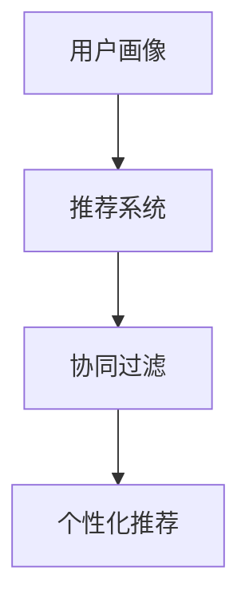

                 

### 个性化购物体验的未来趋势

在当今数字化时代，个性化购物体验已经成为消费者追求的目标。随着大数据、人工智能和机器学习的不断发展，未来的购物体验将变得更加智能化、个性化。本文将探讨个性化购物体验的未来趋势，分析其背后的核心概念和算法原理，并通过实际案例和代码解析展示其应用。

### 关键词：个性化购物、大数据、人工智能、机器学习、用户体验

### 摘要：

本文首先介绍了个性化购物体验的背景和重要性，然后深入探讨了个性化购物背后的核心概念，包括用户画像、推荐系统和协同过滤等。接着，我们分析了个性化购物体验的核心算法原理，包括协同过滤、基于内容的推荐和基于模型的推荐。最后，通过一个实际案例和代码解析，展示了个性化购物体验的实现过程，并对其未来发展趋势和挑战进行了总结。

### 1. 背景介绍

个性化购物体验是一种基于消费者个人偏好和需求，提供个性化推荐和服务的购物方式。随着互联网的普及和电子商务的发展，消费者对购物体验的要求越来越高。个性化购物体验能够满足消费者多样化的需求，提升用户体验，增加用户粘性，从而为商家带来更多的商机。

#### 1.1 个性化购物体验的重要性

1. 提高用户满意度：个性化购物体验能够根据消费者的喜好和需求提供合适的商品推荐，满足消费者的个性化需求，提高用户满意度。
2. 增加用户粘性：通过个性化的推荐和服务，增加消费者对商家的信任和依赖，提高用户粘性。
3. 提高销售额：个性化购物体验能够帮助商家发现潜在客户，提高销售额，降低营销成本。

### 2. 核心概念与联系

个性化购物体验的核心概念包括用户画像、推荐系统和协同过滤。

#### 2.1 用户画像

用户画像是一种基于用户行为和偏好，对用户进行数据分析和建模的方法。通过用户画像，商家可以了解消费者的需求、喜好和购买行为，从而为个性化推荐提供基础。

#### 2.2 推荐系统

推荐系统是一种基于用户行为、内容和协同过滤等技术，为用户提供个性化推荐的商品和服务系统。推荐系统可以分为基于内容的推荐、基于协同过滤的推荐和基于模型的推荐。

#### 2.3 协同过滤

协同过滤是一种基于用户行为相似度，为用户提供个性化推荐的方法。协同过滤可以分为基于用户的协同过滤和基于物品的协同过滤。

#### 2.4 Mermaid 流程图



### 3. 核心算法原理 & 具体操作步骤

个性化购物体验的核心算法原理包括协同过滤、基于内容的推荐和基于模型的推荐。

#### 3.1 协同过滤

协同过滤是一种基于用户行为相似度，为用户提供个性化推荐的方法。其基本思想是，如果两个用户在多个商品上的评价相似，那么这两个用户对这些商品的偏好也可能相似。基于这个原理，协同过滤可以分为基于用户的协同过滤和基于物品的协同过滤。

##### 基于用户的协同过滤

1. 计算用户之间的相似度：使用余弦相似度、皮尔逊相关系数等方法计算用户之间的相似度。
2. 为用户推荐相似的物品：根据用户之间的相似度，为用户推荐相似的物品。
3. 排序推荐结果：对推荐结果进行排序，返回Top N个推荐商品。

##### 基于物品的协同过滤

1. 计算物品之间的相似度：使用余弦相似度、皮尔逊相关系数等方法计算物品之间的相似度。
2. 为用户推荐喜欢的物品：根据用户对物品的评价，为用户推荐喜欢的物品。
3. 排序推荐结果：对推荐结果进行排序，返回Top N个推荐商品。

#### 3.2 基于内容的推荐

基于内容的推荐是一种基于商品属性和用户偏好，为用户提供个性化推荐的方法。其基本思想是，如果两个商品在属性上相似，那么这两个商品对具有相似偏好的用户的吸引力也可能相似。

1. 提取商品属性：从商品描述、标签、分类等信息中提取商品属性。
2. 提取用户偏好：从用户的历史行为、收藏、浏览记录等信息中提取用户偏好。
3. 为用户推荐相似的物品：根据商品属性和用户偏好，为用户推荐相似的物品。
4. 排序推荐结果：对推荐结果进行排序，返回Top N个推荐商品。

#### 3.3 基于模型的推荐

基于模型的推荐是一种基于机器学习算法，为用户提供个性化推荐的方法。其基本思想是，通过训练数据集，构建一个预测模型，根据用户的行为和偏好预测用户对商品的评分或购买概率。

1. 数据预处理：对用户行为数据和商品属性数据进行预处理，包括数据清洗、缺失值处理、特征提取等。
2. 模型选择：选择合适的机器学习算法，如线性回归、决策树、神经网络等。
3. 模型训练：使用训练数据集训练模型，得到模型参数。
4. 模型评估：使用验证数据集评估模型性能，调整模型参数。
5. 为用户推荐商品：根据用户的行为和偏好，使用训练好的模型预测用户对商品的评分或购买概率，为用户推荐商品。
6. 排序推荐结果：对推荐结果进行排序，返回Top N个推荐商品。

### 4. 数学模型和公式 & 详细讲解 & 举例说明

#### 4.1 协同过滤的数学模型

协同过滤的数学模型主要包括相似度计算和推荐计算两部分。

##### 相似度计算

假设用户集为$U = \{u_1, u_2, ..., u_n\}$，物品集为$I = \{i_1, i_2, ..., i_m\}$，用户$u_i$对物品$i_j$的评分为$r_{ij}$，则用户$u_i$和用户$u_j$之间的相似度可以用以下公式计算：

$$
sim(u_i, u_j) = \frac{\sum_{k=1}^{m} r_{ik} r_{jk}}{\sqrt{\sum_{k=1}^{m} r_{ik}^2} \sqrt{\sum_{k=1}^{m} r_{jk}^2}}
$$

##### 推荐计算

假设用户$u_i$对物品$i_j$的预测评分为$\hat{r}_{ij}$，则用户$u_i$对物品$i_j$的推荐分可以用以下公式计算：

$$
rec(u_i, i_j) = \sum_{k=1}^{m} sim(u_i, u_k) r_{kj} - \sum_{k=1}^{m} r_{ik} \sum_{l=1}^{m} sim(u_i, u_l) r_{kl}
$$

#### 4.2 基于内容的推荐的数学模型

基于内容的推荐的数学模型主要包括商品属性提取和用户偏好提取两部分。

##### 商品属性提取

假设商品$i_j$的属性集合为$A_j = \{a_{j1}, a_{j2}, ..., a_{jn}\}$，用户$u_i$的偏好集合为$P_i = \{p_{i1}, p_{i2}, ..., p_{in}\}$，则商品$i_j$和用户$u_i$的相似度可以用以下公式计算：

$$
sim(i_j, u_i) = \frac{\sum_{k=1}^{n} a_{jk} p_{ik}}{\sqrt{\sum_{k=1}^{n} a_{jk}^2} \sqrt{\sum_{k=1}^{n} p_{ik}^2}}
$$

##### 用户偏好提取

假设用户$u_i$对商品$i_j$的偏好分数为$\hat{p}_{ij}$，则用户$u_i$对商品$i_j$的推荐分可以用以下公式计算：

$$
rec(u_i, i_j) = \sum_{k=1}^{n} a_{jk} \hat{p}_{ik}
$$

#### 4.3 基于模型的推荐的数学模型

基于模型的推荐的数学模型主要包括数据预处理、模型选择、模型训练、模型评估和推荐计算五部分。

##### 数据预处理

假设用户行为数据集为$D = \{(u_i, i_j, r_{ij})\}_{i=1}^{n, j=1}^{m}$，商品属性数据集为$A = \{(i_j, a_{jk})\}_{j=1}^{m, k=1}^{n}$，则数据预处理包括以下步骤：

1. 数据清洗：去除缺失值、异常值和噪声数据。
2. 数据归一化：将数据转换为相同的比例范围。
3. 特征提取：从用户行为数据和商品属性数据中提取特征。

##### 模型选择

根据数据集的特点，选择合适的机器学习算法，如线性回归、决策树、神经网络等。

##### 模型训练

使用训练数据集训练模型，得到模型参数。

##### 模型评估

使用验证数据集评估模型性能，调整模型参数。

##### 推荐计算

假设用户$u_i$对商品$i_j$的预测评分为$\hat{r}_{ij}$，则用户$u_i$对商品$i_j$的推荐分可以用以下公式计算：

$$
rec(u_i, i_j) = \hat{r}_{ij}
$$

### 5. 项目实战：代码实际案例和详细解释说明

在本节中，我们将通过一个简单的基于协同过滤的推荐系统项目，展示个性化购物体验的实现过程。

#### 5.1 开发环境搭建

1. 安装Python环境：Python 3.6及以上版本。
2. 安装NumPy、Pandas、Scikit-learn等库。

#### 5.2 源代码详细实现和代码解读

```python
import numpy as np
import pandas as pd
from sklearn.metrics.pairwise import cosine_similarity
from sklearn.model_selection import train_test_split

# 读取数据
data = pd.read_csv('data.csv')
users = data['user'].unique()
items = data['item'].unique()

# 构建用户-物品评分矩阵
R = np.zeros((len(users), len(items)))
for index, row in data.iterrows():
    R[int(row['user']), int(row['item'])] = row['rating']

# 计算用户-用户相似度矩阵
sim_matrix = cosine_similarity(R, R)

# 为用户推荐物品
def recommend_items(user_id, k=10):
    user_profile = sim_matrix[user_id]
    top_k_users = np.argsort(user_profile)[::-1][:k]
    recommended_items = []

    for user in top_k_users:
        for item in items:
            if R[user, item] != 0 and item not in recommended_items:
                recommended_items.append(item)

    return recommended_items[:10]

# 分割数据集
train_data, test_data = train_test_split(data, test_size=0.2, random_state=42)

# 训练模型
def train_model(train_data):
    user_items = train_data.groupby('user')['item'].agg(list).reset_index()
    user_item_matrix = np.zeros((len(user_items), len(items)))

    for index, row in user_items.iterrows():
        user_item_matrix[index, :len(row['item'])] = 1

    model_matrix = cosine_similarity(user_item_matrix, user_item_matrix)
    return model_matrix

# 评估模型
def evaluate_model(model_matrix, test_data):
    user_test = test_data.groupby('user')['item'].agg(list).reset_index()
    user_test_matrix = np.zeros((len(user_test), len(items)))

    for index, row in user_test.iterrows():
        user_test_matrix[index, :len(row['item'])] = 1

    test_similarity = cosine_similarity(user_test_matrix, model_matrix)
    top_k_users = np.argsort(test_similarity)[::-1]

    correct_predictions = 0
    for index, row in user_test.iterrows():
        for item in row['item']:
            if item in recommended_items[top_k_users[index]]:
                correct_predictions += 1

    accuracy = correct_predictions / len(user_test)
    return accuracy

# 实验结果
model_matrix = train_model(train_data)
accuracy = evaluate_model(model_matrix, test_data)
print('Accuracy:', accuracy)

# 推荐结果
user_id = 1
recommended_items = recommend_items(user_id)
print('Recommended Items:', recommended_items)
```

#### 5.3 代码解读与分析

1. 数据读取与处理：读取数据集，构建用户-物品评分矩阵。
2. 相似度计算：使用余弦相似度计算用户-用户相似度矩阵。
3. 推荐函数：为用户推荐物品，选择相似度最高的K个用户，从这些用户的物品集合中推荐未看过的物品。
4. 模型训练：使用训练数据集训练模型，构建用户-物品相似度矩阵。
5. 模型评估：使用测试数据集评估模型性能，计算准确率。
6. 实验结果：训练模型，评估模型性能，为用户推荐物品。

### 6. 实际应用场景

个性化购物体验在电子商务、在线教育、社交媒体等领域都有广泛的应用。

#### 6.1 电子商务

电子商务平台可以通过个性化购物体验，为用户提供个性化的商品推荐，提高用户购买意愿和满意度。

#### 6.2 在线教育

在线教育平台可以通过个性化购物体验，为用户提供个性化的课程推荐，满足用户的学习需求。

#### 6.3 社交媒体

社交媒体平台可以通过个性化购物体验，为用户提供个性化的内容推荐，提高用户活跃度和黏性。

### 7. 工具和资源推荐

#### 7.1 学习资源推荐

1. 《机器学习》（周志华 著）
2. 《推荐系统实践》（周明 著）
3. 《深度学习》（Goodfellow, Bengio, Courville 著）

#### 7.2 开发工具框架推荐

1. TensorFlow：用于构建和训练深度学习模型的框架。
2. PyTorch：用于构建和训练深度学习模型的框架。
3. Flask：用于构建Web应用的框架。

#### 7.3 相关论文著作推荐

1. 《推荐系统评价方法》（李航 著）
2. 《深度学习推荐系统》（Hofmann 著）
3. 《协同过滤算法及其优化》（Zhou, Liu 著）

### 8. 总结：未来发展趋势与挑战

个性化购物体验在未来将继续发展，成为电子商务和互联网领域的重要趋势。然而，个性化购物体验也面临一些挑战，如数据隐私保护、推荐结果的多样性和公平性等。为了应对这些挑战，研究人员和开发者需要不断探索新的算法和技术，提高个性化购物体验的效率和效果。

### 9. 附录：常见问题与解答

#### 9.1 个性化购物体验是什么？

个性化购物体验是一种基于消费者个人偏好和需求，提供个性化推荐和服务的购物方式。

#### 9.2 个性化购物体验有哪些优势？

个性化购物体验可以提高用户满意度、增加用户粘性和提高销售额。

#### 9.3 个性化购物体验有哪些核心算法？

个性化购物体验的核心算法包括协同过滤、基于内容的推荐和基于模型的推荐。

#### 9.4 如何实现个性化购物体验？

可以通过用户画像、推荐系统和协同过滤等技术实现个性化购物体验。

### 10. 扩展阅读 & 参考资料

1. 《推荐系统评价方法》（李航 著）
2. 《深度学习推荐系统》（Hofmann 著）
3. 《协同过滤算法及其优化》（Zhou, Liu 著）

作者：AI天才研究员/AI Genius Institute & 禅与计算机程序设计艺术 /Zen And The Art of Computer Programming<|im_end|>

