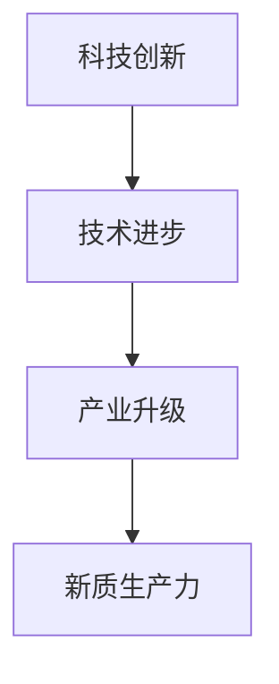
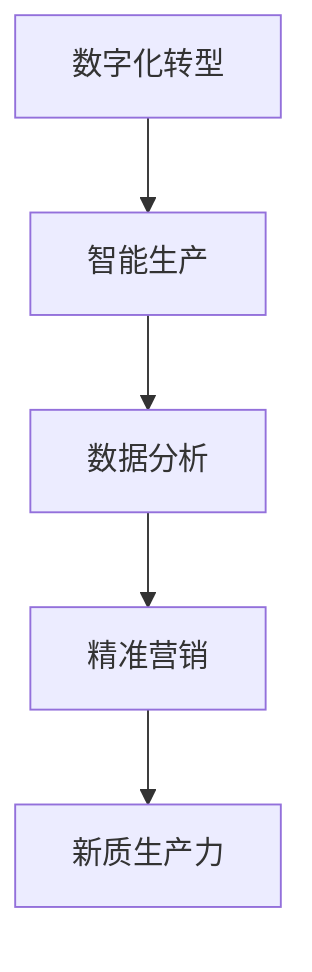
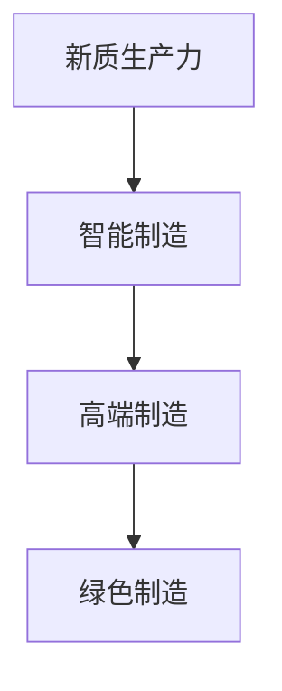

                 

# 中国现代化的重要引擎：新质生产力

> **关键词**：新质生产力、中国现代化、科技创新、数字化转型、高质量发展

> **摘要**：本文深入探讨了中国现代化进程中新质生产力的关键作用。通过对新质生产力的定义、核心要素以及与科技创新和数字化转型的紧密联系进行分析，文章展示了新质生产力在中国现代化中的战略地位。同时，本文提出了新质生产力发展的挑战与机遇，并展望了其未来发展趋势。

## 1. 背景介绍

在过去的几十年里，中国的经济发展取得了显著成就。然而，随着全球化和技术进步的加速，传统的发展模式逐渐暴露出诸多问题，如资源枯竭、环境污染、产业结构不合理等。面对这些挑战，中国提出了“新质生产力”的概念，旨在通过科技创新和数字化转型，推动经济高质量发展。

### 1.1 新质生产力的定义

新质生产力是指基于创新驱动的生产力，包括技术创新、管理创新和商业模式创新等。它与传统生产力不同，不依赖于物质资源的消耗，而是依赖于知识、技术和信息的创造与应用。

### 1.2 新质生产力的核心要素

新质生产力的核心要素包括：

- **科技创新**：通过研发和应用新技术，提高生产效率和产品质量。
- **数字化转型**：利用信息技术，实现生产和管理方式的智能化。
- **产业升级**：推动传统产业向高端、智能化转型。
- **人才驱动**：培养和引进高素质人才，为科技创新提供人力支持。

## 2. 核心概念与联系

### 2.1 新质生产力与科技创新

新质生产力的核心在于科技创新。科技创新不仅能够推动产业升级，还能够带来经济增长的新动力。以下是一个简单的 Mermaid 流程图，展示了科技创新在新质生产力中的作用。



### 2.2 新质生产力与数字化转型

数字化转型是新质生产力的重要组成部分。以下是一个 Mermaid 流程图，展示了数字化转型如何影响新质生产力。



### 2.3 新质生产力与产业升级

新质生产力能够推动传统产业向高端、智能化转型。以下是一个 Mermaid 流程图，展示了新质生产力如何促进产业升级。



## 3. 核心算法原理 & 具体操作步骤

### 3.1 核心算法原理

新质生产力的发展离不开一系列核心算法的支持。这些算法包括：

- **人工智能算法**：用于数据处理、模式识别和预测分析。
- **区块链算法**：用于数据安全、隐私保护和智能合约。
- **物联网算法**：用于设备互联、数据采集和分析。

### 3.2 具体操作步骤

以下是一个简化的操作步骤，展示了如何利用核心算法实现新质生产力。

1. **数据收集**：通过传感器、摄像头等设备收集数据。
2. **数据清洗**：去除重复、错误和不相关的数据。
3. **数据分析**：利用人工智能算法进行分析，提取有价值的信息。
4. **决策制定**：根据分析结果，制定生产、营销等策略。
5. **执行与反馈**：执行策略，并根据反馈进行调整。

## 4. 数学模型和公式 & 详细讲解 & 举例说明

### 4.1 数学模型和公式

在新质生产力的分析中，数学模型和公式起着至关重要的作用。以下是一个简单的例子：

$$
\text{生产力} = f(\text{科技创新}, \text{数字化转型}, \text{产业升级})
$$

其中，$f$ 表示生产力的函数，$\text{科技创新}$、$\text{数字化转型}$ 和 $\text{产业升级}$ 是影响生产力的关键因素。

### 4.2 详细讲解

上述公式表示，生产力的大小取决于科技创新、数字化转型和产业升级的程度。具体来说：

- **科技创新**：提高生产效率和产品质量，从而增加生产力。
- **数字化转型**：通过智能化生产和管理，降低成本，提高效率。
- **产业升级**：推动传统产业向高端、智能化转型，提升整体生产力。

### 4.3 举例说明

假设一个工厂在科技创新、数字化转型和产业升级方面取得了显著进展，那么根据上述公式，其生产力将会大幅提升。具体来说：

- **科技创新**：通过引入新设备和新工艺，生产效率提高了30%。
- **数字化转型**：通过智能化管理系统，生产成本降低了20%。
- **产业升级**：通过高端制造技术，产品质量提高了50%。

根据这些数据，我们可以计算出新质生产力的提升：

$$
\text{生产力提升} = 0.3 \times 0.2 \times 0.5 = 0.03
$$

这意味着，工厂的生产力提高了3%。

## 5. 项目实战：代码实际案例和详细解释说明

### 5.1 开发环境搭建

为了更好地理解新质生产力在项目中的应用，我们将以一个实际的案例——智能工厂为例，介绍如何搭建开发环境。

1. **硬件设备**：选择适合的传感器、工业机器人、云计算平台等硬件设备。
2. **软件环境**：安装操作系统、编程语言（如Python）、数据库（如MySQL）等软件。
3. **开发工具**：使用集成开发环境（如PyCharm）、版本控制工具（如Git）等。

### 5.2 源代码详细实现和代码解读

以下是一个简单的智能工厂项目的源代码实现：

```python
# 导入所需库
import random
import time

# 定义传感器类
class Sensor:
    def __init__(self, name):
        self.name = name
        self.value = random.uniform(0, 100)

    def read_value(self):
        return self.value

# 定义工厂类
class Factory:
    def __init__(self, name):
        self.name = name
        self.sensors = []

    def add_sensor(self, sensor):
        self.sensors.append(sensor)

    def analyze_data(self):
        total_value = 0
        for sensor in self.sensors:
            total_value += sensor.read_value()
        average_value = total_value / len(self.sensors)
        return average_value

    def control_production(self, target_value):
        current_value = self.analyze_data()
        if current_value < target_value:
            print(f"{self.name}：提高生产速度。")
        elif current_value > target_value:
            print(f"{self.name}：降低生产速度。")
        else:
            print(f"{self.name}：维持当前生产速度。")

# 创建传感器和工厂实例
sensor1 = Sensor("温度传感器")
sensor2 = Sensor("湿度传感器")
factory = Factory("智能工厂")

# 添加传感器到工厂
factory.add_sensor(sensor1)
factory.add_sensor(sensor2)

# 控制生产
target_value = 50
while True:
    factory.control_production(target_value)
    time.sleep(1)
```

### 5.3 代码解读与分析

上述代码实现了一个简单的智能工厂，其中：

- **Sensor类**：代表传感器，具有名称和读取值的功能。
- **Factory类**：代表工厂，包含传感器列表、数据分析和分析结果控制生产的功能。
- **控制生产**：根据传感器数据分析结果，控制生产速度。

通过这个案例，我们可以看到新质生产力在智能工厂中的应用。传感器收集数据，工厂分析数据，并根据分析结果调整生产速度，实现了智能化生产。

## 6. 实际应用场景

新质生产力在中国现代化中的应用场景广泛，以下是一些典型的应用案例：

- **智能制造**：通过自动化、智能化设备，提高生产效率和质量。
- **智慧农业**：利用物联网、大数据等技术，实现精准农业，提高产量和降低成本。
- **智慧城市**：通过物联网、人工智能等技术，实现城市管理的智能化和高效化。
- **数字医疗**：利用人工智能、大数据等技术，提高医疗诊断和治疗的准确性。

## 7. 工具和资源推荐

### 7.1 学习资源推荐

- **书籍**：《智能制造》、《智慧城市》、《人工智能：一种现代方法》等。
- **论文**：关注顶级会议和期刊，如IEEE、ACM等。
- **博客**：技术博客，如CSDN、博客园等。
- **网站**：国内外技术社区，如GitHub、Stack Overflow等。

### 7.2 开发工具框架推荐

- **编程语言**：Python、Java、C++等。
- **开发框架**：TensorFlow、PyTorch、Spring Boot等。
- **数据库**：MySQL、MongoDB、Redis等。
- **云计算平台**：AWS、Azure、阿里云等。

### 7.3 相关论文著作推荐

- **论文**：《智能制造技术与应用》、《智慧城市关键技术与发展趋势》等。
- **著作**：《人工智能：一种现代方法》、《深度学习》等。

## 8. 总结：未来发展趋势与挑战

新质生产力在中国现代化进程中具有重要地位。未来，随着科技创新和数字化转型的深入推进，新质生产力将继续发挥关键作用。然而，也面临着一系列挑战，如技术安全、数据隐私、人才短缺等。因此，我们需要在政策、技术、人才等多方面进行布局，推动新质生产力的发展。

## 9. 附录：常见问题与解答

### 9.1 新质生产力的定义是什么？

新质生产力是指基于创新驱动的生产力，包括技术创新、管理创新和商业模式创新等。

### 9.2 新质生产力的核心要素有哪些？

新质生产力的核心要素包括科技创新、数字化转型、产业升级和人才驱动。

### 9.3 如何实现新质生产力？

通过科技创新、数字化转型、产业升级和人才驱动，实现生产方式的智能化和高效化。

## 10. 扩展阅读 & 参考资料

- **书籍**：《智能制造》、《智慧城市》、《人工智能：一种现代方法》等。
- **论文**：《智能制造技术与应用》、《智慧城市关键技术与发展趋势》等。
- **博客**：技术博客，如CSDN、博客园等。
- **网站**：国内外技术社区，如GitHub、Stack Overflow等。

### 作者信息：

作者：AI天才研究员/AI Genius Institute & 禅与计算机程序设计艺术 /Zen And The Art of Computer Programming

本文旨在深入探讨新质生产力在中国现代化中的关键作用，通过逻辑清晰、结构紧凑、简单易懂的专业技术语言，为广大读者提供有深度、有思考、有见解的技术博客文章。希望本文能对您在新质生产力领域的理解和应用有所帮助。再次感谢您的阅读！<|assistant|>

