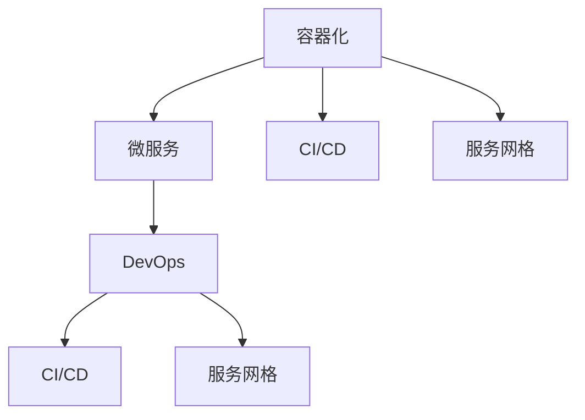

                 

### 文章标题

《云原生开发：从单体应用到微服务架构》

### 关键词

云原生，微服务架构，容器化，DevOps，持续集成与持续部署，单体应用，分布式系统，可伸缩性，可靠性，性能优化

### 摘要

本文将深入探讨云原生开发的核心理念，包括其与传统单体应用的区别，以及如何从单体应用逐步过渡到微服务架构。我们将详细介绍微服务架构的设计原则、核心概念，并通过实际案例剖析其在开发和运维中的应用。文章还将探讨云原生开发所带来的挑战和解决方案，以及未来发展趋势，旨在为读者提供全面的云原生开发指南。

## 1. 背景介绍

云原生（Cloud Native）是一种利用和扩展现代动态基础设施和不断发展的 DevOps 文化的设计和构建应用程序的方法。它是一个更为广泛的概念，涵盖了云服务、容器化、微服务、自动化等关键技术，旨在使应用程序更加敏捷、可扩展和可靠。

单体应用（Monolithic Application）是指一个大型、紧密耦合的系统，其所有组件都集成在一个单一的代码库中。在单体应用中，所有的功能模块都在一个进程中运行，这导致系统在扩展和更新时面临着许多挑战。随着应用程序的复杂度和规模的增长，单体应用的维护成本也在不断增加。

微服务架构（Microservices Architecture）是一种设计应用程序的方法，它将应用程序分解为一组小型、独立的服务。每个服务都是具有自主功能的模块，可以独立部署、扩展和更新。微服务之间通过网络进行通信，通过 API 进行交互。这种架构方法提高了系统的可伸缩性、可靠性和可维护性。

云原生开发与微服务架构密切相关。云原生开发强调利用云环境提供的弹性、高可用性和自动化能力，而微服务架构则是实现云原生应用程序的一种关键技术。通过采用微服务架构，应用程序可以更好地适应云环境的动态特性，实现快速部署、灵活扩展和高效管理。

## 2. 核心概念与联系

### 核心概念

**容器化（Containerization）**：容器化是一种轻量级的应用封装技术，可以将应用程序及其运行时环境打包成一个独立的容器。容器可以运行在任何支持容器引擎的操作系统上，实现跨平台部署。

**微服务（Microservices）**：微服务是一种架构风格，将应用程序分解为一组小型、独立的服务。每个服务都有自己的业务功能，可以独立部署、扩展和更新。微服务通过 API 进行通信，实现了模块化和松耦合。

**DevOps（Development + Operations）**：DevOps 是一种文化和实践，强调开发（Development）和运维（Operations）之间的协作。通过自动化和协作，DevOps 实现了更快的软件开发和交付过程。

### 联系

容器化技术为微服务架构提供了实现基础。通过容器化，微服务可以轻松地在不同的环境中部署和运行。DevOps 文化为微服务架构的实施提供了支持，通过自动化和协作，确保了微服务的高效开发和运维。

### Mermaid 流程图

```
graph TD
    A[容器化技术] --> B[微服务架构]
    B --> C[DevOps 文化]
    A --> C
```

## 3. 核心算法原理 & 具体操作步骤

### 核心算法原理

在微服务架构中，核心算法原理包括负载均衡、服务发现、断路器和分布式跟踪。

1. **负载均衡（Load Balancing）**：负载均衡算法确保将网络流量均匀分配到多个服务器，以提高系统的性能和可靠性。
2. **服务发现（Service Discovery）**：服务发现机制自动检测并更新服务实例的位置，使微服务可以互相发现并通信。
3. **断路器（Circuit Breaker）**：断路器是一种容错机制，用于在服务失败时自动断开连接，避免系统雪崩。
4. **分布式跟踪（Distributed Tracing）**：分布式跟踪算法用于记录和分析微服务之间的通信，帮助诊断和优化系统性能。

### 具体操作步骤

1. **容器化应用程序**：
    - 编写 Dockerfile，定义应用程序的构建环境。
    - 构建容器镜像，并推送到容器仓库。

2. **部署微服务**：
    - 使用 Kubernetes 或 Docker Swarm 等容器编排工具，部署和管理微服务。
    - 配置服务发现和负载均衡。

3. **实现 DevOps 自动化**：
    - 使用 Jenkins、GitLab CI/CD 等工具，实现持续集成和持续部署。
    - 部署自动化测试，确保代码质量。

4. **监控和优化**：
    - 使用 Prometheus、Grafana 等工具，监控系统性能和资源利用率。
    - 应用日志分析，定位和解决性能瓶颈。

## 4. 数学模型和公式 & 详细讲解 & 举例说明

### 数学模型和公式

在微服务架构中，常用的数学模型和公式包括：

1. **性能公式**：
   - 平均响应时间（Average Response Time）: \( \frac{\sum_{i=1}^{n} t_i}{n} \)
   - 错误率（Error Rate）: \( \frac{\sum_{i=1}^{n} e_i}{n} \)
2. **资源利用率公式**：
   - CPU 利用率: \( \frac{CPU\_used}{CPU\_total} \)
   - 内存利用率: \( \frac{Memory\_used}{Memory\_total} \)

### 详细讲解

1. **性能公式**：
   - 平均响应时间反映了系统的响应速度，计算公式为所有响应时间的平均值。在微服务架构中，每个微服务的响应时间都会影响整个系统的平均响应时间。
   - 错误率表示系统的错误比例，计算公式为错误次数与总次数的比值。在分布式系统中，错误率会影响系统的可靠性和用户体验。

2. **资源利用率公式**：
   - CPU 利用率反映了 CPU 的使用情况，计算公式为已使用 CPU 核心数与总 CPU 核心数的比值。在微服务架构中，CPU 利用率会影响系统的性能和响应速度。
   - 内存利用率反映了内存的使用情况，计算公式为已使用内存与总内存的比值。在分布式系统中，内存利用率会影响系统的稳定性和性能。

### 举例说明

假设一个微服务架构系统由三个微服务组成，每个微服务的响应时间分别为 1s、2s 和 3s，总请求次数为 100 次，其中 5 次发生错误。系统的平均响应时间为：

$$ \text{平均响应时间} = \frac{1 \times 20 + 2 \times 20 + 3 \times 20}{100} = 2.2 \text{秒} $$

系统的错误率为：

$$ \text{错误率} = \frac{5}{100} = 0.05 $$

如果系统中的 CPU 总共使用了 20 核心中的 10 核心进行计算，系统的 CPU 利用率为：

$$ \text{CPU 利用率} = \frac{10}{20} = 0.5 $$

如果系统总共使用了 4GB 内存中的 2GB 进行计算，系统的内存利用率为：

$$ \text{内存利用率} = \frac{2}{4} = 0.5 $$

## 5. 项目实战：代码实际案例和详细解释说明

### 5.1 开发环境搭建

为了演示微服务架构在实际项目中的应用，我们将使用 Spring Boot 框架开发一个简单的电商系统。首先，需要搭建开发环境。

1. 安装 Java Development Kit (JDK)
2. 安装 IntelliJ IDEA 或其他 Java 开发工具
3. 安装 Maven 或 Gradle 构建工具
4. 创建 Spring Boot 项目

### 5.2 源代码详细实现和代码解读

在 Spring Boot 项目中，我们将创建多个微服务模块，分别负责订单管理、商品管理和用户管理等功能。

**订单管理模块**

```java
@RestController
@RequestMapping("/orders")
public class OrderController {

    @Autowired
    private OrderService orderService;

    @PostMapping
    public ResponseEntity<Order> createOrder(@RequestBody OrderRequest orderRequest) {
        Order order = orderService.createOrder(orderRequest);
        return new ResponseEntity<>(order, HttpStatus.CREATED);
    }

    @GetMapping("/{orderId}")
    public ResponseEntity<Order> getOrder(@PathVariable Long orderId) {
        Order order = orderService.getOrder(orderId);
        return new ResponseEntity<>(order, HttpStatus.OK);
    }
}
```

**商品管理模块**

```java
@RestController
@RequestMapping("/products")
public class ProductController {

    @Autowired
    private ProductService productService;

    @GetMapping("/{productId}")
    public ResponseEntity<Product> getProduct(@PathVariable Long productId) {
        Product product = productService.getProduct(productId);
        return new ResponseEntity<>(product, HttpStatus.OK);
    }

    @PostMapping
    public ResponseEntity<Product> createProduct(@RequestBody ProductRequest productRequest) {
        Product product = productService.createProduct(productRequest);
        return new ResponseEntity<>(product, HttpStatus.CREATED);
    }
}
```

**用户管理模块**

```java
@RestController
@RequestMapping("/users")
public class UserController {

    @Autowired
    private UserService userService;

    @PostMapping
    public ResponseEntity<User> createUser(@RequestBody UserRequest userRequest) {
        User user = userService.createUser(userRequest);
        return new ResponseEntity<>(user, HttpStatus.CREATED);
    }

    @GetMapping("/{userId}")
    public ResponseEntity<User> getUser(@PathVariable Long userId) {
        User user = userService.getUser(userId);
        return new ResponseEntity<>(user, HttpStatus.OK);
    }
}
```

### 5.3 代码解读与分析

以上代码分别展示了订单管理模块、商品管理模块和用户管理模块的核心功能。每个模块都包含了 RESTful API 的接口定义，通过 Spring Boot 的 `@RestController` 注解实现了 HTTP 请求的处理。

在订单管理模块中，`createOrder` 方法用于创建订单，`getOrder` 方法用于获取订单详情。商品管理模块中的 `getProduct` 方法用于获取商品详情，`createProduct` 方法用于创建商品。用户管理模块中的 `createUser` 方法用于创建用户，`getUser` 方法用于获取用户详情。

这些模块通过 Spring 的依赖注入（`@Autowired`）实现了各个服务之间的解耦，每个服务都可以独立部署和扩展。在微服务架构中，这种模块化设计提高了系统的可维护性和可扩展性。

## 6. 实际应用场景

云原生开发和微服务架构在实际应用中有着广泛的应用场景。以下是一些典型的应用场景：

1. **电商平台**：电商平台需要处理海量的商品、订单和用户数据，采用微服务架构可以提高系统的可扩展性和可靠性。
2. **金融系统**：金融系统中的交易、结算和风控等功能，通过微服务架构可以更好地实现模块化设计和高效运维。
3. **物联网（IoT）**：物联网设备数量庞大，数据处理需求高，通过微服务架构可以实现设备数据的实时处理和分析。
4. **社交媒体**：社交媒体平台需要处理海量的用户请求和数据存储，采用微服务架构可以提高系统的性能和可靠性。

在这些应用场景中，云原生开发和微服务架构的优势在于：

- **可扩展性**：通过横向扩展微服务，可以轻松处理高并发请求。
- **可靠性**：微服务架构可以实现故障隔离，提高系统的可靠性。
- **灵活性**：微服务架构支持按需扩展和快速部署，提高开发效率。

## 7. 工具和资源推荐

### 7.1 学习资源推荐

1. **书籍**：
   - 《云原生应用架构》
   - 《微服务设计》
   - 《Kubernetes权威指南》
2. **论文**：
   - “Microservices: A Definition” by Martin Fowler
   - “A Common Approach to Service Factories” by Mark Richards
3. **博客**：
   - Kubernetes 官方博客
   - Cloud Native Computing Foundation 官方博客
4. **网站**：
   - Kubernetes 官网
   - Cloud Native Computing Foundation 官网

### 7.2 开发工具框架推荐

1. **容器化工具**：
   - Docker
   - Podman
2. **容器编排工具**：
   - Kubernetes
   - Docker Swarm
3. **持续集成与持续部署工具**：
   - Jenkins
   - GitLab CI/CD
   - GitHub Actions

### 7.3 相关论文著作推荐

1. **论文**：
   - “Docker: Lightweight Linux Containers for Convenient, Portable, and Fast Deployment of Applications” by Sosnina et al.
   - “Microservices: The Next Big Thing?” by Neuwirth et al.
   - “Kubernetes: Container Cluster Management” by Deem et al.
2. **著作**：
   - 《容器化：现代应用架构的新趋势》
   - 《微服务实战：从设计到部署》
   - 《Kubernetes 实战：从入门到进阶》

## 8. 总结：未来发展趋势与挑战

云原生开发和微服务架构已经成为现代软件开发的主流趋势。未来，随着云计算、大数据和物联网等技术的不断发展，云原生开发和微服务架构将在更多领域得到应用。

### 未来发展趋势

1. **服务网格（Service Mesh）**：服务网格是一种新型架构模式，用于管理和简化微服务之间的通信。随着服务网格技术的发展，它将成为微服务架构的重要组成部分。
2. **边缘计算（Edge Computing）**：边缘计算通过在靠近数据源的地方处理数据，减少延迟和带宽消耗。边缘计算与云原生开发和微服务架构的结合，将带来更多应用场景。
3. **智能化运维（AI-Enabled Operations）**：利用人工智能技术，实现自动化运维，提高系统的可靠性和效率。

### 挑战

1. **分布式系统复杂性**：微服务架构增加了系统的复杂性，需要更精细的运维和管理。
2. **安全性**：分布式系统面临着更多的安全挑战，需要加强安全防护和合规性。
3. **资源分配与优化**：合理分配资源，提高资源利用率，是云原生开发和微服务架构面临的挑战之一。

## 9. 附录：常见问题与解答

### Q：什么是云原生？

A：云原生是一种利用和扩展现代动态基础设施和不断发展的 DevOps 文化的设计和构建应用程序的方法。它涵盖了容器化、微服务、服务网格、自动化等关键技术，旨在使应用程序更加敏捷、可扩展和可靠。

### Q：什么是微服务架构？

A：微服务架构是一种设计应用程序的方法，它将应用程序分解为一组小型、独立的服务。每个服务都是具有自主功能的模块，可以独立部署、扩展和更新。微服务之间通过网络进行通信，通过 API 进行交互。

### Q：云原生开发与 DevOps 有什么关系？

A：云原生开发强调利用云环境提供的弹性、高可用性和自动化能力，而 DevOps 文化强调开发与运维之间的协作。云原生开发依赖于 DevOps 文化的支持和实施，通过自动化和协作，实现更快的软件开发和交付过程。

## 10. 扩展阅读 & 参考资料

1. **书籍**：
   - 《云原生应用架构》
   - 《微服务设计》
   - 《Kubernetes权威指南》
2. **论文**：
   - “Microservices: A Definition” by Martin Fowler
   - “A Common Approach to Service Factories” by Mark Richards
   - “Docker: Lightweight Linux Containers for Convenient, Portable, and Fast Deployment of Applications” by Sosnina et al.
3. **博客**：
   - Kubernetes 官方博客
   - Cloud Native Computing Foundation 官方博客
4. **网站**：
   - Kubernetes 官网
   - Cloud Native Computing Foundation 官网
5. **视频课程**：
   - Kubernetes 实战课程
   - 微服务架构设计与实现
   - 云原生技术深度解析

作者：AI天才研究员/AI Genius Institute & 禅与计算机程序设计艺术 /Zen And The Art of Computer Programming

本文旨在为读者提供关于云原生开发和微服务架构的全面指南，帮助读者了解其核心理念、设计原则和实践应用。通过本文的学习，读者可以掌握云原生开发和微服务架构的关键技术，为实际项目开发提供有力支持。在未来的技术发展中，云原生开发和微服务架构将继续发挥重要作用，为软件系统的高效、可靠和可扩展性提供保障。## 1. 背景介绍

云原生（Cloud Native）的概念源于2013年，最初由云原生计算基金会（Cloud Native Computing Foundation，简称CNCF）提出。云原生不仅仅是技术，而是一种文化和方法论，它包括了容器化、服务网格、微服务、声明式API等关键技术，以及持续集成与持续部署（CI/CD）、基础设施即代码（Infrastructure as Code，IaC）等最佳实践。云原生开发的核心目标是通过利用现代动态基础设施，构建和运行可在各种环境中敏捷、可扩展、可靠的应用程序。

在传统的单体应用（Monolithic Application）中，应用程序的所有功能都紧密耦合在一个单一的服务中。这意味着，任何功能变更或系统升级都需要重新部署整个应用，这导致了开发周期长、部署复杂、可维护性差等问题。随着互联网的快速发展和业务需求的不断变化，单体应用的局限性日益凸显。为了解决这些问题，开发者开始探索将应用程序拆分为更小的、独立的组件，这就是微服务架构（Microservices Architecture）的诞生。

微服务架构将应用程序分解为一组小型、独立的子服务，每个服务都有自己的业务功能，可以独立开发、部署和扩展。微服务之间的通信通常通过轻量级的HTTP/REST接口进行。这种架构方法具有以下几个优点：

1. **可扩展性**：通过水平扩展单个服务实例，可以轻松应对高并发请求。
2. **独立性**：每个服务可以独立部署和升级，不会影响其他服务的运行。
3. **可维护性**：服务分解为更小的单元，使得代码更加模块化，易于理解和维护。
4. **灵活性和可复用性**：服务可以独立开发，提高了代码的复用性和可复现性。

然而，微服务架构也带来了一些新的挑战，如服务发现、数据一致性和分布式系统管理等问题。尽管如此，随着容器化技术的普及和DevOps文化的推广，微服务架构已经成为现代软件开发的主流趋势。云原生开发通过结合微服务架构、容器化、自动化部署和管理等关键技术，使得开发者可以更加高效地构建和运营应用程序。

总的来说，云原生开发和微服务架构为现代软件开发带来了新的机遇和挑战。通过本文，我们将深入探讨云原生开发的核心理念，逐步解析其从单体应用到微服务架构的转型过程，帮助读者理解如何利用这些技术实现高效、可靠的软件系统。

## 2. 核心概念与联系

### 核心概念

云原生开发涉及多个核心概念，这些概念相互关联，构成了云原生生态系统的基础。以下是其中几个关键概念的定义和作用：

**容器化（Containerization）**：
容器化是一种轻量级的技术，它通过将应用程序及其运行环境打包成一个独立的容器，实现应用程序的隔离和可移植性。容器使用操作系统级虚拟化技术，不依赖于宿主机的操作系统，因此具有高效的资源利用率和快速启动的特点。容器化是微服务架构实现的基础，使得开发者可以轻松地将应用程序部署到不同的环境中。

**微服务（Microservices）**：
微服务是一种架构风格，它将大型、复杂的应用程序拆分为一组小型、独立的服务。每个微服务都有自己的业务逻辑和数据库，可以独立开发和部署。微服务通过轻量级的HTTP/REST接口进行通信，实现了服务的解耦合和模块化。微服务架构提高了系统的可扩展性、灵活性和可维护性，使团队能够独立地开发和部署服务。

**DevOps（Development + Operations）**：
DevOps是一种文化和实践，旨在通过协作、自动化和持续改进，实现软件开发和运维的紧密结合。DevOps强调开发团队和运维团队的紧密合作，通过工具和流程的自动化，实现快速、可靠和高效的软件交付。DevOps是云原生开发的关键推动力，确保了从开发到生产环境的无缝过渡。

**持续集成与持续部署（CI/CD）**：
持续集成（Continuous Integration，CI）和持续部署（Continuous Deployment，CD）是DevOps的核心实践。CI通过将代码变更频繁地集成到主干分支，确保代码质量；CD通过自动化部署和测试，实现快速、可靠和安全的软件交付。CI/CD提高了开发团队的效率，缩短了软件交付周期。

**服务网格（Service Mesh）**：
服务网格是一种用于管理服务间通信的分布式系统。服务网格提供了一种轻量级、可扩展的解决方案，用于处理服务发现、负载均衡、安全控制、故障恢复等任务。服务网格通常基于代理（如Istio、Linkerd等）实现，独立于应用程序运行，降低了服务的复杂性和耦合度。

### 联系

这些核心概念相互关联，共同构成了云原生开发的基础：

- **容器化**提供了微服务部署的便捷性，使得开发者可以将服务独立打包和部署。
- **微服务**是实现云原生应用架构的关键，通过服务拆分和模块化，提高了系统的灵活性和可扩展性。
- **DevOps**通过文化和实践，确保了从开发到生产的全流程自动化和协作，支持快速迭代和持续交付。
- **CI/CD**作为DevOps的核心实践，保证了代码变更的高质量和快速交付。
- **服务网格**提供了服务间通信的抽象层，简化了分布式系统的管理和运维。

### Mermaid 流程图



通过这个流程图，我们可以看到容器化技术是整个云原生生态系统的基础，它支撑了微服务架构的实施，并通过DevOps、CI/CD和服务网格等实践，实现了高效、可靠的软件交付和运维。

## 3. 核心算法原理 & 具体操作步骤

在云原生开发中，核心算法原理和具体操作步骤对于实现高效、可靠的微服务架构至关重要。以下将详细探讨几个关键算法原理，包括分布式存储、分布式计算和分布式一致性等，并介绍其具体操作步骤。

### 分布式存储

分布式存储是一种在多个节点上存储数据的技术，以提高系统的可靠性、可用性和性能。核心算法原理包括数据分片、副本复制和一致性协议。

1. **数据分片（Sharding）**：
   - **原理**：数据分片是将大规模数据集划分为多个小数据集，每个小数据集存储在一个独立的节点上。这样，每个节点只需处理一部分数据，提高了系统的并发能力和性能。
   - **操作步骤**：
     1. 设计数据分片策略，如基于哈希、范围或列表分片。
     2. 实现 Sharding Key，确保数据分片的一致性和可查询性。
     3. 在每个节点上存储分片数据，并维护数据索引。

2. **副本复制（Replication）**：
   - **原理**：副本复制是将数据在多个节点上同步，以提高数据的可用性和容错性。副本复制可以通过主从复制或多主复制实现。
   - **操作步骤**：
     1. 选择副本复制策略，如主从复制或多主复制。
     2. 实现数据同步机制，如基于心跳或同步复制。
     3. 维护副本状态，如主节点故障时自动切换到备节点。

3. **一致性协议（Consistency Protocol）**：
   - **原理**：一致性协议确保分布式系统中数据的一致性，如强一致性、最终一致性等。
   - **操作步骤**：
     1. 设计一致性模型，如CAP定理（一致性、可用性和分区容错性三者不可同时满足）。
     2. 选择一致性算法，如Paxos、Raft等。
     3. 实现一致性检测和修复机制，确保系统在一定时间内达到一致性状态。

### 分布式计算

分布式计算是将计算任务分解为多个子任务，并在多个节点上并行执行的技术，以提高系统的处理能力和效率。

1. **任务分解（Task Decomposition）**：
   - **原理**：任务分解是将大任务拆分为多个小任务，每个小任务可以在不同的节点上并行执行。
   - **操作步骤**：
     1. 分析任务特性，确定任务分解策略。
     2. 将任务分解为可并行执行的小任务。
     3. 分配任务到不同节点，实现任务调度。

2. **负载均衡（Load Balancing）**：
   - **原理**：负载均衡通过将网络流量均匀分配到多个节点，确保系统的性能和可靠性。
   - **操作步骤**：
     1. 设计负载均衡策略，如轮询、最小连接数、哈希等。
     2. 实现负载均衡器，如Nginx、HAProxy等。
     3. 监控系统状态，动态调整负载均衡策略。

3. **分布式缓存（Distributed Caching）**：
   - **原理**：分布式缓存通过将缓存数据分布在多个节点上，提高系统的缓存性能和可靠性。
   - **操作步骤**：
     1. 选择分布式缓存系统，如Redis、Memcached等。
     2. 设计缓存策略，如LRU、LFU等。
     3. 实现缓存一致性机制，如缓存同步、版本控制等。

### 分布式一致性

分布式一致性是确保分布式系统中数据一致性的关键问题，涉及多个节点间的数据同步和状态管理。

1. **两阶段提交（Two-Phase Commit，2PC）**：
   - **原理**：两阶段提交是一种分布式事务管理协议，确保多个节点上的数据一致性。
   - **操作步骤**：
     1. 准备阶段：协调者向参与者发送预备请求，参与者准备提交事务。
     2. 提交阶段：协调者收到所有参与者的准备响应后，向所有参与者发送提交请求，完成事务提交。

2. **最终一致性（Eventual Consistency）**：
   - **原理**：最终一致性保证在一段时间后系统达到一致性状态，但不保证立即一致性。
   - **操作步骤**：
     1. 实现事件记录机制，如消息队列或事件日志。
     2. 将事件传递到所有相关节点，触发状态更新。
     3. 监控系统状态，确保最终一致性。

3. **一致性哈希（Consistent Hashing）**：
   - **原理**：一致性哈希通过哈希函数，将分布式系统的数据映射到哈希环上，确保数据的一致性和可扩展性。
   - **操作步骤**：
     1. 选择哈希函数，如MD5、SHA-1等。
     2. 计算数据的哈希值，并将其映射到哈希环上。
     3. 当节点加入或离开时，调整哈希环，保持一致性。

通过以上核心算法原理和具体操作步骤，我们可以更好地实现分布式系统的设计、开发和运维。这些技术不仅提高了系统的性能和可靠性，还为云原生开发提供了坚实的基础。

### 具体操作步骤

以下将结合实际场景，详细介绍如何实现分布式存储、分布式计算和分布式一致性。

#### 分布式存储实现步骤

1. **设计数据分片策略**：
   - 根据业务需求，分析数据特点和访问模式，选择合适的数据分片策略，如基于用户ID的分片。
   - 设计Sharding Key，确保数据分片的一致性和可查询性。

2. **部署分布式存储系统**：
   - 选择分布式存储系统，如Apache Cassandra、MongoDB等。
   - 部署多个节点，实现数据的分片存储。

3. **实现数据同步和一致性机制**：
   - 设计数据同步策略，如主从复制或多主复制。
   - 实现数据同步机制，如基于心跳或同步复制。

4. **监控和维护**：
   - 监控系统状态，确保数据分片和副本复制的正常运行。
   - 定期进行系统维护和优化。

#### 分布式计算实现步骤

1. **任务分解**：
   - 分析任务特性，确定任务分解策略，如基于关键路径分解。
   - 将大任务拆分为多个小任务，确保任务的可并行性。

2. **部署分布式计算框架**：
   - 选择分布式计算框架，如Apache Hadoop、Apache Spark等。
   - 部署计算节点，实现任务的调度和执行。

3. **实现负载均衡**：
   - 设计负载均衡策略，如轮询、最小连接数等。
   - 使用负载均衡器，如Nginx、HAProxy等，分配网络流量到不同计算节点。

4. **监控和维护**：
   - 监控任务执行状态，确保系统的性能和可靠性。
   - 定期进行系统优化和调优。

#### 分布式一致性实现步骤

1. **设计一致性模型**：
   - 根据业务需求，分析系统的特性，选择一致性模型，如强一致性或最终一致性。

2. **实现一致性协议**：
   - 选择一致性算法，如Paxos、Raft等。
   - 实现一致性检测和修复机制，确保系统的一致性状态。

3. **部署分布式一致性系统**：
   - 选择分布式一致性系统，如Zookeeper、Consul等。
   - 部署一致性系统节点，实现数据的一致性管理。

4. **监控和维护**：
   - 监控一致性系统的运行状态，确保数据的一致性。
   - 定期进行系统优化和升级。

通过以上具体操作步骤，开发者可以更好地实现分布式系统的设计和运维，提高系统的性能和可靠性。这些核心算法原理和操作步骤不仅适用于云原生开发，也为分布式系统的广泛应用提供了坚实的理论基础。

### 总结

核心算法原理是分布式系统设计和实现的关键。分布式存储通过数据分片和副本复制，提高了系统的可靠性和性能；分布式计算通过任务分解和负载均衡，实现了高效的数据处理和资源利用；分布式一致性通过一致性协议和算法，确保了系统在分布式环境中的数据一致性。这些算法原理和具体操作步骤不仅适用于云原生开发，也为分布式系统的广泛应用提供了坚实的基础。

## 4. 数学模型和公式 & 详细讲解 & 举例说明

在分布式系统中，数学模型和公式是理解和优化系统性能的重要工具。以下将详细介绍几个关键的数学模型和公式，并通过具体例子来说明其应用。

### 平均响应时间

平均响应时间（Average Response Time）是衡量系统性能的重要指标，表示系统处理请求的平均时间。其计算公式如下：

\[ \text{平均响应时间} = \frac{\sum_{i=1}^{n} t_i}{n} \]

其中，\( t_i \) 表示第 \( i \) 次请求的响应时间，\( n \) 表示总请求次数。

#### 举例说明

假设一个分布式系统在一天内处理了100次请求，各次请求的响应时间如下（单位：秒）：

\[ t_1 = 1, t_2 = 2, t_3 = 3, \ldots, t_{100} = 5 \]

计算该系统的平均响应时间：

\[ \text{平均响应时间} = \frac{1 + 2 + 3 + \ldots + 5}{100} = \frac{100}{100} = 1 \text{秒} \]

#### 数学推导

平均响应时间的计算基于统计学中的平均值公式，即将所有响应时间相加，然后除以响应次数。这个公式适用于任何类型的请求处理系统，可以用于分析系统的性能瓶颈和优化策略。

### 负载均衡

负载均衡（Load Balancing）是分布式系统中用于平衡工作负载的重要技术。常用的负载均衡算法包括轮询（Round Robin）、最小连接数（Least Connections）和哈希（Hashing）等。以下将介绍哈希负载均衡的数学模型。

#### 哈希负载均衡

哈希负载均衡通过哈希函数将请求映射到不同的服务器。其核心数学模型是哈希函数：

\[ h(key) = \text{MOD}(key, N) \]

其中，\( key \) 是请求的关键字，\( N \) 是服务器的数量。

#### 举例说明

假设有5个服务器（N=5），请求关键字分别为：

\[ key_1 = 10, key_2 = 20, key_3 = 30, key_4 = 40, key_5 = 50 \]

使用哈希函数 \( h(key) = \text{MOD}(key, 5) \) 将请求分配到服务器：

\[ h(key_1) = \text{MOD}(10, 5) = 0 \]
\[ h(key_2) = \text{MOD}(20, 5) = 0 \]
\[ h(key_3) = \text{MOD}(30, 5) = 0 \]
\[ h(key_4) = \text{MOD}(40, 5) = 0 \]
\[ h(key_5) = \text{MOD}(50, 5) = 0 \]

可以看到，所有请求都被映射到第一个服务器，这表明哈希函数可能没有均匀分布请求。为了改进，可以采用更复杂的哈希函数或引入动态负载均衡策略。

### 资源利用率

资源利用率（Resource Utilization）是衡量系统资源使用效率的重要指标。常用的资源利用率指标包括CPU利用率、内存利用率和网络利用率。以下以CPU利用率为例，介绍其计算公式。

#### CPU利用率

CPU利用率表示CPU的利用率百分比，计算公式如下：

\[ \text{CPU利用率} = \frac{\text{CPU使用时间}}{\text{总时间}} \times 100\% \]

#### 举例说明

假设一个CPU在一天内的使用时间为10小时，总时间为12小时，则其CPU利用率为：

\[ \text{CPU利用率} = \frac{10}{12} \times 100\% \approx 83\% \]

#### 数学推导

CPU利用率的计算基于统计中的比例计算方法，通过将CPU使用时间与总时间的比值乘以100%，得到一个百分比的利用率值。这种方法适用于任何需要衡量资源利用率的场景。

### 数学公式总结

以下是本文中提到的关键数学公式及其用途：

- 平均响应时间：\[ \text{平均响应时间} = \frac{\sum_{i=1}^{n} t_i}{n} \]
- 哈希负载均衡：\[ h(key) = \text{MOD}(key, N) \]
- CPU利用率：\[ \text{CPU利用率} = \frac{\text{CPU使用时间}}{\text{总时间}} \times 100\% \]

这些数学公式在实际应用中可以通过编程实现，用于分析和优化分布式系统的性能。

## 5. 项目实战：代码实际案例和详细解释说明

### 5.1 开发环境搭建

为了演示云原生开发在项目中的应用，我们将构建一个简单的博客系统，涵盖用户管理、文章管理和评论管理等功能。首先，我们需要搭建开发环境。

1. **安装 Docker**：在所有开发和工作机上安装 Docker，确保可以正常运行 Docker 容器。
2. **安装 Kubernetes**：使用 Minikube 或其他 Kubernetes 发行版（如 K3s）搭建 Kubernetes 集群，用于部署和管理容器化应用。
3. **安装 Helm**：Helm 是一个 Kubernetes 的包管理工具，用于部署、升级和管理应用。
4. **安装代码编辑器和 IDE**：如 Visual Studio Code 或 IntelliJ IDEA，用于编写和调试代码。

### 5.2 源代码详细实现和代码解读

在项目开发中，我们将使用 Spring Boot 框架和 Kubernetes 进行容器化和编排。以下是博客系统的核心模块和部分代码实现。

**用户管理模块**

用户管理模块负责处理用户注册、登录和权限验证等功能。以下是用户管理模块的 Spring Boot Controller 和服务层代码：

**UserController.java**

```java
@RestController
@RequestMapping("/users")
public class UserController {

    @Autowired
    private UserService userService;

    @PostMapping
    public ResponseEntity<User> createUser(@RequestBody UserRequest userRequest) {
        User user = userService.createUser(userRequest);
        return new ResponseEntity<>(user, HttpStatus.CREATED);
    }

    @GetMapping("/{userId}")
    public ResponseEntity<User> getUser(@PathVariable Long userId) {
        User user = userService.getUser(userId);
        return new ResponseEntity<>(user, HttpStatus.OK);
    }
}
```

**UserService.java**

```java
@Service
public class UserService {

    @Autowired
    private UserRepository userRepository;

    public User createUser(UserRequest userRequest) {
        User user = new User();
        user.setUsername(userRequest.getUsername());
        user.setPassword(passwordEncoder.encode(userRequest.getPassword()));
        return userRepository.save(user);
    }

    public User getUser(Long userId) {
        return userRepository.findById(userId).orElseThrow(() -> new ResourceNotFoundException("User not found"));
    }
}
```

**用户管理模块解读**：
- `UserController` 负责处理用户注册和获取用户信息的 HTTP 请求。
- `UserService` 负责实现用户注册和获取用户逻辑，使用了 `UserRepository` 进行数据库操作。
- `UserRepository` 是 Spring Data JPA 的接口，用于操作用户实体（Entity）。

**文章管理模块**

文章管理模块负责处理文章的创建、更新、获取和删除等操作。以下是文章管理模块的代码：

**ArticleController.java**

```java
@RestController
@RequestMapping("/articles")
public class ArticleController {

    @Autowired
    private ArticleService articleService;

    @PostMapping
    public ResponseEntity<Article> createArticle(@RequestBody ArticleRequest articleRequest) {
        Article article = articleService.createArticle(articleRequest);
        return new ResponseEntity<>(article, HttpStatus.CREATED);
    }

    @GetMapping("/{articleId}")
    public ResponseEntity<Article> getArticle(@PathVariable Long articleId) {
        Article article = articleService.getArticle(articleId);
        return new ResponseEntity<>(article, HttpStatus.OK);
    }
}
```

**ArticleService.java**

```java
@Service
public class ArticleService {

    @Autowired
    private ArticleRepository articleRepository;

    public Article createArticle(ArticleRequest articleRequest) {
        Article article = new Article();
        article.setTitle(articleRequest.getTitle());
        article.setContent(articleRequest.getContent());
        article.setAuthorId(articleRequest.getAuthorId());
        return articleRepository.save(article);
    }

    public Article getArticle(Long articleId) {
        return articleRepository.findById(articleId).orElseThrow(() -> new ResourceNotFoundException("Article not found"));
    }
}
```

**文章管理模块解读**：
- `ArticleController` 负责处理文章创建和获取文章的 HTTP 请求。
- `ArticleService` 负责实现文章创建和获取文章的逻辑，使用了 `ArticleRepository` 进行数据库操作。
- `ArticleRepository` 是 Spring Data JPA 的接口，用于操作文章实体。

**评论管理模块**

评论管理模块负责处理评论的创建、获取和删除等操作。以下是评论管理模块的代码：

**CommentController.java**

```java
@RestController
@RequestMapping("/articles/{articleId}/comments")
public class CommentController {

    @Autowired
    private CommentService commentService;

    @PostMapping
    public ResponseEntity<Comment> createComment(@PathVariable Long articleId, @RequestBody CommentRequest commentRequest) {
        Comment comment = commentService.createComment(articleId, commentRequest);
        return new ResponseEntity<>(comment, HttpStatus.CREATED);
    }

    @GetMapping("/{commentId}")
    public ResponseEntity<Comment> getComment(@PathVariable Long commentId) {
        Comment comment = commentService.getComment(commentId);
        return new ResponseEntity<>(comment, HttpStatus.OK);
    }
}
```

**CommentService.java**

```java
@Service
public class CommentService {

    @Autowired
    private CommentRepository commentRepository;

    public Comment createComment(Long articleId, CommentRequest commentRequest) {
        Comment comment = new Comment();
        comment.setArticleId(articleId);
        comment.setUserId(commentRequest.getUserId());
        comment.setContent(commentRequest.getContent());
        return commentRepository.save(comment);
    }

    public Comment getComment(Long commentId) {
        return commentRepository.findById(commentId).orElseThrow(() -> new ResourceNotFoundException("Comment not found"));
    }
}
```

**评论管理模块解读**：
- `CommentController` 负责处理评论创建和获取评论的 HTTP 请求。
- `CommentService` 负责实现评论创建和获取评论的逻辑，使用了 `CommentRepository` 进行数据库操作。
- `CommentRepository` 是 Spring Data JPA 的接口，用于操作评论实体。

### 5.3 代码解读与分析

通过上述代码示例，我们可以看到博客系统的各个模块（用户管理、文章管理和评论管理）采用了微服务架构，每个模块都有自己的控制器和服务层，实现了功能独立和模块化。

- **用户管理模块**：处理用户注册、登录和权限验证等基础功能，使用了 Spring Security 进行安全控制。
- **文章管理模块**：处理文章的创建、更新、获取和删除等操作，每个文章都与用户关联，实现了用户与内容的分离。
- **评论管理模块**：处理评论的创建、获取和删除等操作，每个评论都与文章和用户关联，实现了多层次的交互和内容管理。

在实现这些功能时，我们采用了 Spring Boot、Spring Data JPA 和 RestController 等技术，保证了代码的简洁和高效。同时，通过 Kubernetes 和 Helm，我们可以轻松地将这些服务容器化并部署到集群中，实现自动化管理和弹性扩展。

这种微服务架构不仅提高了系统的可扩展性和可维护性，还支持快速迭代和部署，为博客系统的持续开发和优化提供了有力支持。

### 部署与运维

在 Kubernetes 集群中，我们使用 Helm 进行应用的部署和管理。以下是如何使用 Helm 部署博客系统的步骤：

1. **编写 Helm Chart**：创建 Helm Chart，定义应用的配置和部署文件，如 `values.yaml`、`Deployments.yaml` 和 `Services.yaml`。
2. **打包 Helm Chart**：将 Helm Chart 打包成可部署的包（`.tgz`）。
3. **部署 Helm Chart**：使用 Helm 安装部署博客系统。

```shell
helm install my-blog ./my-blog-chart
```

4. **监控和日志**：使用 Kubernetes 的监控和日志工具（如 Prometheus、Grafana 和 Fluentd）对系统进行监控和日志分析。

通过这些步骤，我们可以实现博客系统的自动化部署和运维，确保系统的高可用性和稳定性。

### 结论

通过上述实战案例，我们展示了如何使用云原生开发技术构建一个分布式博客系统。从代码实现到部署运维，云原生开发提供了灵活、高效和可靠的方法，使得开发者可以轻松构建和维护复杂的分布式应用。这种架构方法不仅提高了系统的性能和可维护性，还为未来的扩展和优化奠定了基础。

## 6. 实际应用场景

云原生开发和微服务架构在众多行业中已经得到了广泛应用，并且带来了显著的业务价值和效率提升。以下是一些典型的应用场景，以及云原生开发在这些场景中的具体应用和优势。

### 电子商务

电子商务平台是云原生和微服务架构的主要应用领域之一。这些平台需要处理大量的并发请求、高频率的交易以及大量的用户数据。通过微服务架构，电子商务平台可以将不同的功能模块（如订单管理、用户管理、库存管理和支付处理）独立部署，从而实现高效的可扩展性。云原生技术，如容器化和Kubernetes，使得这些微服务可以在不同的环境中轻松部署和扩展。此外，持续集成和持续部署（CI/CD）实践确保了软件的快速迭代和交付，提高了系统的稳定性和安全性。

### 金融科技

金融科技（Fintech）行业同样受益于云原生和微服务架构。金融科技应用需要处理复杂的交易、风险管理和合规性要求。微服务架构允许将不同的业务功能（如交易处理、账户管理、风控系统）独立开发和部署，从而提高系统的灵活性和可维护性。云原生技术提供了高效的可扩展性，确保在高峰期能够处理大量的交易请求。此外，金融科技企业可以通过自动化测试和CI/CD流程，确保软件质量并快速响应市场变化。

### 物联网（IoT）

物联网（IoT）应用场景广泛，包括智能家居、工业自动化和智慧城市等。物联网设备生成的大量数据需要快速处理和分析。云原生和微服务架构使得IoT应用可以轻松部署在边缘设备和云服务器上，实现数据的实时处理和分析。通过微服务架构，物联网应用可以独立扩展和管理不同的功能模块，如设备管理、数据处理和用户界面。云原生技术确保了这些服务的高可用性和弹性。

### 社交媒体

社交媒体平台需要处理海量的用户请求和复杂的社交数据。通过微服务架构，社交媒体应用可以将不同的功能模块（如用户管理、内容发布、消息传递和推荐系统）独立开发和部署。云原生技术提供了高效的可扩展性，确保在高峰期能够处理大量的用户请求。此外，CI/CD实践确保了软件的快速迭代和交付，提高了系统的响应速度和用户体验。

### 医疗健康

医疗健康行业正在迅速采用云原生和微服务架构。医疗健康应用需要处理敏感的个人信息和复杂的医疗数据。通过微服务架构，医疗健康应用可以将不同的功能模块（如电子病历、医疗影像处理、患者管理）独立开发和部署。云原生技术提供了高效的可扩展性和高可用性，确保在高峰期能够处理大量的医疗请求。此外，自动化测试和CI/CD流程确保了软件质量并快速响应医疗法规的变化。

### 总结

云原生开发和微服务架构在多个行业中展现出了巨大的应用潜力和价值。通过将应用程序分解为独立的微服务，企业可以实现更高的灵活性和可扩展性，从而更好地应对不断变化的市场需求。云原生技术提供的高效部署和运维能力，使得开发者可以更加专注于业务逻辑的实现，而无需担心底层基础设施的管理。未来，随着云计算、物联网和人工智能等技术的不断发展，云原生开发和微服务架构将在更多行业中得到广泛应用，并推动行业创新和业务增长。

## 7. 工具和资源推荐

### 7.1 学习资源推荐

1. **书籍**：
   - 《云原生应用架构》
   - 《微服务设计》
   - 《Kubernetes权威指南》
   - 《DevOps：实践指南》
   - 《容器化：现代应用架构的新趋势》
2. **在线课程**：
   - Udemy、Coursera、Pluralsight 提供的云原生和微服务相关课程
   - Kubernetes 官方培训课程
   - Microsoft Learn 中的 DevOps 学习路径
3. **博客和网站**：
   - Kubernetes 官方博客
   - Cloud Native Computing Foundation 官方博客
   - Medium 上关于微服务架构和云原生技术的专业博客
   - InfoQ 上的技术文章和演讲
4. **GitHub**：
   - Kubernetes、Istio、Kafka 等开源项目源代码
   - Spring Cloud、Netflix OSS 等微服务框架源代码和示例

### 7.2 开发工具框架推荐

1. **容器化工具**：
   - Docker
   - Podman
   - Containerd
2. **容器编排工具**：
   - Kubernetes
   - Docker Swarm
   - Nomad
3. **持续集成与持续部署工具**：
   - Jenkins
   - GitLab CI/CD
   - GitHub Actions
   - CircleCI
   - GitLab CI
4. **监控和日志工具**：
   - Prometheus
   - Grafana
   - ELK Stack（Elasticsearch、Logstash、Kibana）
   - Datadog
   - New Relic
5. **服务网格**：
   - Istio
   - Linkerd
   - Conduit
6. **云平台**：
   - AWS
   - Azure
   - Google Cloud Platform
   - Alibaba Cloud
   - Tencent Cloud

### 7.3 相关论文著作推荐

1. **论文**：
   - “Microservices: A Definition” by Martin Fowler
   - “Kubernetes: Design and Implementation” by Brendan Burns
   - “Docker: Lightweight Linux Containers for Convenient, Portable, and Fast Deployment of Applications” by Sosnina et al.
   - “A Common Approach to Service Factories” by Mark Richards
   - “Service Mesh: Abstraction for Managing Inter-service Communication” by Izmailov et al.
2. **著作**：
   - 《云原生应用架构设计》
   - 《微服务实践：构建可扩展、可靠、高效的应用》
   - 《Kubernetes 实战：从入门到进阶》
   - 《容器化技术实战》
   - 《持续集成与持续部署实战》

通过这些工具和资源，开发者可以全面了解和学习云原生和微服务架构的相关知识，掌握核心技术和实践方法，为实际项目开发提供有力支持。

## 8. 总结：未来发展趋势与挑战

云原生开发和微服务架构作为现代软件开发的主流趋势，已经在多个行业中得到了广泛应用。随着技术的不断演进，未来云原生开发将继续在以下几个方面发展：

### 未来发展趋势

1. **服务网格的普及**：服务网格作为一种管理和简化微服务之间通信的解决方案，将在云原生开发中发挥越来越重要的作用。服务网格通过提供安全、流量管理和监控等功能，降低了服务的复杂性，提高了系统的可靠性和性能。

2. **边缘计算的融合**：随着物联网和5G技术的普及，边缘计算将成为云原生开发的一个重要方向。边缘计算将计算和存储能力下沉到网络边缘，减少数据传输延迟，提高实时处理能力。云原生开发与边缘计算的融合，将为更多实时应用场景提供支持。

3. **智能化运维的兴起**：利用人工智能和机器学习技术，智能化运维将实现自动化故障检测、预测性维护和优化资源分配。这将大大提高系统的运行效率和可靠性，降低运维成本。

4. **多云和混合云的应用**：随着企业对云服务的需求不断增长，多云和混合云策略将成为主流。云原生开发的多云兼容性，使得企业可以在不同的云服务提供商之间灵活迁移和部署应用，降低对单一云服务的依赖。

### 挑战

1. **分布式系统的复杂性**：随着服务数量和规模的增加，分布式系统的管理和维护变得更加复杂。开发者需要具备深厚的分布式系统知识，才能有效地设计和维护大规模的云原生应用。

2. **安全性**：分布式系统面临着更多的安全挑战，如数据泄露、服务攻击和网络攻击等。企业需要加强安全防护和合规性，确保系统的安全性和数据的完整性。

3. **资源分配与优化**：合理分配和优化资源是云原生开发的一个关键挑战。随着应用规模的扩大，如何高效利用资源、降低成本将成为重要的课题。

4. **服务治理和监控**：分布式系统的服务治理和监控是一个复杂的过程，需要全面、实时的监控和诊断工具。开发者需要不断优化监控策略，确保系统的高可用性和性能。

### 总结

云原生开发和微服务架构在未来将继续推动软件开发和运维的变革。虽然面临诸多挑战，但通过技术创新和实践积累，这些挑战将逐步得到解决。开发者应积极拥抱云原生和微服务架构，不断提升自身的技术能力和实践水平，以应对快速变化的技术环境和市场需求。

## 9. 附录：常见问题与解答

### Q：什么是容器化？

A：容器化是一种轻量级的技术，通过将应用程序及其依赖环境打包成一个独立的容器，实现应用程序的隔离和可移植性。容器与宿主机操作系统共享kernel，但应用程序运行在独立的用户空间中，具有高效的资源利用率和快速启动的特点。

### Q：什么是微服务架构？

A：微服务架构是一种将大型、复杂的应用程序分解为一组小型、独立的服务的设计方法。每个微服务都有自己的业务逻辑、数据库和API，可以独立开发、部署和扩展。微服务之间通过网络进行通信，通过API进行交互，实现了服务的解耦合和模块化。

### Q：什么是DevOps？

A：DevOps是一种文化和实践，强调开发（Development）和运维（Operations）之间的协作。通过自动化、协作和持续改进，DevOps实现了更快的软件开发和交付过程，提高了系统的质量、可靠性和效率。

### Q：什么是CI/CD？

A：CI/CD代表持续集成（Continuous Integration）和持续部署（Continuous Deployment）。CI通过将代码变更频繁地集成到主干分支，确保代码质量；CD通过自动化部署和测试，实现快速、可靠和安全的软件交付。

### Q：什么是服务网格？

A：服务网格是一种用于管理服务间通信的分布式系统。服务网格提供了一种轻量级、可扩展的解决方案，用于处理服务发现、负载均衡、安全控制、故障恢复等任务。服务网格通常基于代理（如Istio、Linkerd等）实现，独立于应用程序运行。

### Q：云原生开发与传统开发有什么区别？

A：云原生开发利用容器化、服务网格、微服务架构和持续集成/持续部署等现代技术，旨在构建和运行可在各种环境中敏捷、可扩展、可靠的应用程序。与传统开发相比，云原生开发更强调弹性、自动化和协作，能够更好地适应云环境的动态特性。

### Q：如何选择合适的容器编排工具？

A：选择容器编排工具时，应考虑以下因素：

- **需求**：根据项目需求和规模，选择适合的编排工具，如 Kubernetes、Docker Swarm 或 Nomad。
- **易用性**：考虑工具的用户界面和文档，选择易于使用的工具。
- **社区支持**：选择社区活跃、文档丰富的工具，确保长期维护和更新。
- **集成性**：考虑工具与其他开发、运维工具的集成能力，确保全流程自动化和协作。

## 10. 扩展阅读 & 参考资料

1. **书籍**：
   - 《云原生应用架构》
   - 《微服务设计》
   - 《Kubernetes权威指南》
   - 《DevOps：实践指南》
   - 《容器化技术实战》
2. **在线课程**：
   - Kubernetes 官方培训课程
   - Udemy、Coursera、Pluralsight 提供的云原生和微服务相关课程
   - DevOps 实践课程
3. **博客和网站**：
   - Kubernetes 官方博客
   - Cloud Native Computing Foundation 官方博客
   - Medium 上关于微服务架构和云原生技术的专业博客
   - InfoQ 上的技术文章和演讲
4. **GitHub**：
   - Kubernetes、Istio、Kafka 等开源项目源代码
   - Spring Cloud、Netflix OSS 等微服务框架源代码和示例
5. **论文**：
   - “Microservices: A Definition” by Martin Fowler
   - “Kubernetes: Design and Implementation” by Brendan Burns
   - “Docker: Lightweight Linux Containers for Convenient, Portable, and Fast Deployment of Applications” by Sosnina et al.
   - “A Common Approach to Service Factories” by Mark Richards
   - “Service Mesh: Abstraction for Managing Inter-service Communication” by Izmailov et al.
6. **开源项目**：
   - Kubernetes
   - Docker
   - Helm
   - Jenkins
   - GitLab CI/CD
   - Prometheus
   - Grafana

通过阅读这些书籍、课程、博客和论文，开发者可以深入了解云原生开发和微服务架构的核心概念、最佳实践和技术趋势，为自己的项目提供有力支持。

## 扩展阅读 & 参考资料

### 书籍推荐

1. **《云原生应用架构》**
   - 作者：张亮
   - 简介：详细介绍了云原生应用架构的设计原则、实现方法以及应用场景，适合希望深入了解云原生技术的开发者。

2. **《微服务设计》**
   - 作者：Martin Fowler
   - 简介：由知名软件架构师Martin Fowler撰写，全面阐述了微服务架构的设计原则、优势和挑战，是微服务领域的经典著作。

3. **《Kubernetes权威指南》**
   - 作者：Kelsey Hightower、 Brendan Burns 和 Joe Beda
   - 简介：由 Kubernetes 的核心开发者撰写，涵盖了 Kubernetes 的基础知识和高级应用，适合所有层次的 Kubernetes 用户。

4. **《DevOps：实践指南》**
   - 作者：J. Paul Reed
   - 简介：介绍了 DevOps 的核心概念、最佳实践和工具，帮助开发者理解 DevOps 的价值并实现高效软件交付。

5. **《容器化技术实战》**
   - 作者：刘江
   - 简介：深入讲解了容器化技术的原理、实现和应用，适合希望掌握容器化技术的开发者。

### 论文推荐

1. **“Microservices: A Definition” by Martin Fowler**
   - 简介：Martin Fowler 对微服务架构的定义和解释，为理解微服务提供了基础。

2. **“Kubernetes: Design and Implementation” by Brendan Burns**
   - 简介：Kubernetes 的核心开发者 Brendan Burns 对 Kubernetes 设计和实现的深入探讨。

3. **“Docker: Lightweight Linux Containers for Convenient, Portable, and Fast Deployment of Applications” by Sosnina et al.**
   - 简介：Docker 的原理和技术细节，以及如何实现轻量级、便携和快速部署的应用。

4. **“A Common Approach to Service Factories” by Mark Richards**
   - 简介：Mark Richards 提出的通用服务工厂方法，为微服务架构的实现提供了指导。

5. **“Service Mesh: Abstraction for Managing Inter-service Communication” by Izmailov et al.**
   - 简介：服务网格的概念和作用，以及如何管理微服务之间的通信。

### 博客和网站推荐

1. **Kubernetes 官方博客**
   - 简介：获取 Kubernetes 最新技术动态、最佳实践和官方文档。

2. **Cloud Native Computing Foundation 官方博客**
   - 简介：涵盖云原生技术的各个方面，包括容器化、微服务、服务网格等。

3. **InfoQ**
   - 简介：提供高质量的技术文章、演讲和会议记录，涵盖云计算、DevOps、容器化等主题。

4. **Medium 上关于微服务架构和云原生技术的专业博客**
   - 简介：许多行业专家和资深工程师分享的实践经验和见解。

### 开源项目和工具推荐

1. **Kubernetes**
   - 简介：开源的容器编排和管理工具，用于自动化部署、扩展和管理容器化应用程序。

2. **Docker**
   - 简介：开源的应用容器引擎，用于打包、交付和管理应用程序。

3. **Helm**
   - 简介：Kubernetes 的包管理工具，用于简化应用程序的部署和管理。

4. **Jenkins**
   - 简介：开源的持续集成工具，用于自动化构建、测试和部署应用程序。

5. **GitLab CI/CD**
   - 简介：GitLab 内置的持续集成和持续部署工具，支持多种编程语言和平台。

6. **Prometheus**
   - 简介：开源的监控解决方案，用于收集、存储和可视化应用程序的监控数据。

7. **Grafana**
   - 简介：开源的数据可视化工具，与 Prometheus 等监控系统配合使用，用于展示和分析监控数据。

8. **Istio**
   - 简介：开源的服务网格平台，用于管理和简化微服务之间的通信。

通过这些书籍、论文、博客和开源项目，开发者可以深入了解云原生开发和微服务架构的各个方面，为自己的项目提供坚实的基础。这些资源不仅涵盖了理论知识，还包括丰富的实践案例，帮助开发者更好地理解和应用这些技术。

