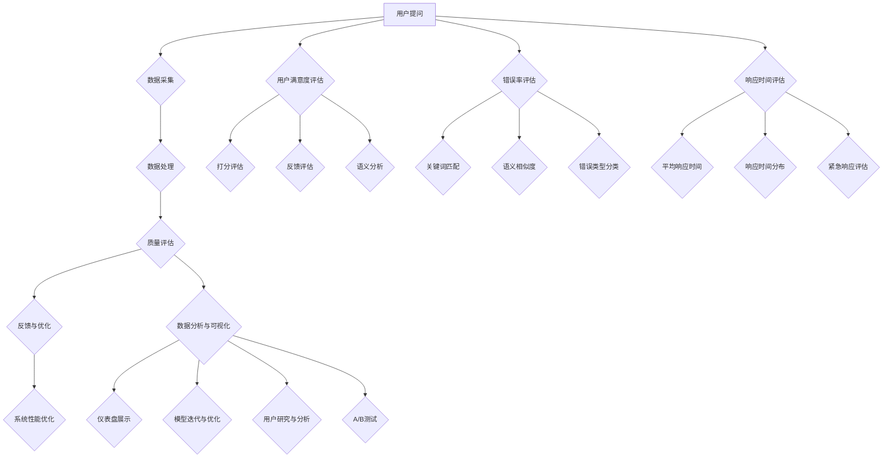

                 

### 背景介绍

#### 京东智能客服的背景与重要性

随着电子商务和互联网行业的快速发展，智能客服已经成为各大电商平台提升用户体验和运营效率的重要手段。在京东，智能客服系统不仅承担着解答用户疑问、处理售后问题的重任，还通过不断优化和升级，实现了从被动响应到主动服务的转变。这种转变不仅提高了客服效率，也为京东积累了大量用户数据，为后续的精准营销和个性化服务提供了有力支持。

智能客服质量监控工程师在京东2024校招中的角色至关重要。他们负责对智能客服系统的质量进行持续监控、评估和优化，确保客服系统能够准确、高效地回答用户问题，提升用户满意度。此外，他们还需要结合用户反馈和业务需求，提出改进建议，推动客服系统的持续迭代和优化。

#### 智能客服质量监控工程师的工作内容

智能客服质量监控工程师的工作内容主要包括以下几个方面：

1. **数据采集与处理**：负责收集智能客服系统的各类数据，包括用户提问、客服回答、用户满意度评分等，并进行数据清洗、分析和处理，为后续的质量评估提供数据支持。

2. **质量评估与反馈**：通过对数据进行分析，评估智能客服系统的质量，识别出系统存在的问题和不足。同时，根据用户反馈和业务需求，提出改进建议，协助开发团队进行系统优化。

3. **性能监控与预警**：实时监控智能客服系统的运行状态，包括响应时间、错误率等关键性能指标，及时发现并处理系统故障或异常情况，确保系统稳定运行。

4. **用户研究与分析**：通过用户研究，了解用户对智能客服的使用习惯、需求和痛点，为客服系统的改进和优化提供依据。

5. **文档编写与分享**：负责编写和整理智能客服系统的相关文档，包括质量报告、优化方案、操作手册等，并向团队成员分享经验和技术知识。

#### 智能客服质量监控工程师所需技能和素质

智能客服质量监控工程师需要具备以下技能和素质：

1. **编程能力**：熟练掌握至少一种编程语言，如Python、Java等，能够编写高效、可靠的代码，进行数据采集、处理和分析。

2. **数据分析能力**：具备较强的数据分析能力，能够运用各种数据分析方法和工具，对海量数据进行处理和分析，提取有价值的信息。

3. **沟通能力**：具备良好的沟通能力，能够与团队成员、开发人员和业务部门进行有效沟通，确保项目顺利进行。

4. **问题解决能力**：具备较强的问题解决能力，能够快速定位问题、分析原因并给出解决方案。

5. **自我驱动力**：具备自我驱动力，能够主动学习新技术、新方法，不断更新知识体系，提升个人能力。

6. **团队合作精神**：具备良好的团队合作精神，能够与团队成员共同协作，共同完成项目任务。

#### 京东2024校招智能客服质量监控工程师面试流程

京东2024校招智能客服质量监控工程师的面试流程主要包括以下几个环节：

1. **简历筛选**：首先，HR会对申请者的简历进行筛选，筛选标准主要包括教育背景、实习经历、项目经验、技能证书等。

2. **笔试**：通过简历筛选的申请者需要参加笔试，笔试主要测试申请者的编程能力和数据分析能力。

3. **面试**：笔试通过后，申请者需要参加面试，面试分为技术面试和综合面试两个部分。技术面试主要考察申请者的编程能力、数据分析能力和沟通能力；综合面试主要考察申请者的团队合作精神、自我驱动力和综合素质。

4. **评估与录用**：面试结束后，HR和面试官会根据申请者的综合表现进行评估，确定最终的录用名单。

### 京东智能客服系统的架构

#### 系统架构概述

京东智能客服系统采用分布式架构，包括前端、后端、数据库和数据存储等多个模块。前端主要负责与用户的交互，接收用户提问并展示客服回答；后端主要负责处理用户提问、生成客服回答，并支持数据的存储、分析和监控。数据库用于存储用户数据、提问记录和答案库；数据存储用于存储大规模数据，支持实时访问和分析。

#### 前端架构

前端架构主要包括Web页面和移动端应用。Web页面采用Vue.js框架，实现用户与客服系统的交互；移动端应用采用React Native框架，实现跨平台兼容。前端架构的主要功能包括：

1. **用户提问**：用户通过Web页面或移动端应用输入问题，系统将问题传递给后端处理。

2. **展示客服回答**：后端生成客服回答后，前端将回答展示给用户。

3. **用户反馈**：用户对客服回答进行评价，系统记录用户反馈数据，用于质量评估和优化。

#### 后端架构

后端架构主要包括服务端、API接口和后台管理系统。服务端采用Spring Boot框架，负责处理用户提问、生成客服回答和存储数据。API接口用于前端与后端的数据交互，主要包括提问接口、回答接口和反馈接口。后台管理系统采用Vue.js框架，实现系统的管理、监控和配置。

#### 数据库架构

数据库架构主要包括用户数据库、提问数据库和答案数据库。用户数据库存储用户基本信息和提问记录；提问数据库存储用户提问数据，包括问题内容、提问时间和用户ID等；答案数据库存储客服回答数据，包括回答内容、回答时间和客服ID等。

#### 数据存储架构

数据存储架构主要包括Hadoop和HBase。Hadoop用于存储大规模数据，支持分布式存储和计算；HBase用于实时访问和分析大规模数据，支持快速查询和写入。

### 京东智能客服系统的核心算法

#### 自然语言处理（NLP）

自然语言处理（NLP）是智能客服系统的核心技术之一，主要负责对用户提问进行理解和分析，生成合适的客服回答。NLP的核心算法包括分词、词性标注、实体识别、情感分析和语义分析等。

1. **分词**：将用户提问中的连续文本分割成一个个独立的单词或短语，为后续的词性标注和实体识别提供基础。

2. **词性标注**：为每个单词或短语标注词性，如名词、动词、形容词等，帮助系统理解文本的结构和含义。

3. **实体识别**：识别用户提问中的关键实体，如人名、地名、组织机构等，为后续的语义分析提供支持。

4. **情感分析**：分析用户提问中的情感倾向，如正面、负面或中性，帮助系统生成更具针对性的客服回答。

5. **语义分析**：对用户提问进行深入理解，提取出核心意图和问题点，为生成合适的客服回答提供依据。

#### 机器学习与深度学习

机器学习与深度学习在智能客服系统中发挥着重要作用，主要负责客服回答的生成和优化。常见的机器学习算法包括朴素贝叶斯、支持向量机、决策树和随机森林等；深度学习算法包括卷积神经网络（CNN）、循环神经网络（RNN）和生成对抗网络（GAN）等。

1. **朴素贝叶斯**：基于贝叶斯理论，通过计算用户提问中的词语概率，生成客服回答。

2. **支持向量机**：通过将用户提问和客服回答映射到高维空间，寻找最佳分类边界，生成客服回答。

3. **决策树**：根据用户提问的特征，生成一系列条件分支，最终生成客服回答。

4. **随机森林**：通过构建多棵决策树，结合各棵树的预测结果，生成客服回答。

5. **卷积神经网络（CNN）**：通过提取用户提问的视觉特征，生成客服回答。

6. **循环神经网络（RNN）**：通过处理用户提问的序列数据，生成客服回答。

7. **生成对抗网络（GAN）**：通过生成器和判别器的对抗训练，生成高质量的客服回答。

#### 深度学习模型训练与优化

深度学习模型训练与优化是智能客服系统的关键环节，主要包括以下步骤：

1. **数据准备**：收集和整理用户提问和客服回答数据，进行预处理，包括数据清洗、数据增强等。

2. **模型选择**：根据问题场景和数据特点，选择合适的深度学习模型，如CNN、RNN、GAN等。

3. **模型训练**：使用预处理后的数据，通过反向传播算法，对模型参数进行优化，使模型能够准确预测客服回答。

4. **模型评估**：使用验证集对训练好的模型进行评估，包括准确率、召回率、F1值等指标。

5. **模型优化**：根据评估结果，对模型进行调整和优化，提高模型性能。

6. **模型部署**：将训练好的模型部署到生产环境中，实现实时客服回答生成。

### 京东智能客服系统的质量评估方法

#### 用户满意度评估

用户满意度评估是智能客服系统质量评估的核心指标，主要通过用户反馈数据进行分析和评估。用户满意度评估的方法包括以下几种：

1. **打分评估**：用户对客服回答进行评分，如1分、2分、3分等，根据评分结果计算平均分，评估客服回答的质量。

2. **反馈评估**：用户对客服回答进行反馈，如“满意”、“不满意”等，根据反馈结果统计满意率，评估客服回答的质量。

3. **语义分析**：对用户反馈进行语义分析，提取出用户对客服回答的情感倾向，评估客服回答的质量。

#### 错误率评估

错误率评估是智能客服系统质量评估的重要指标，主要评估客服回答的正确性和准确性。错误率评估的方法包括以下几种：

1. **关键词匹配**：将客服回答与用户提问进行关键词匹配，计算匹配度，评估客服回答的准确性。

2. **语义相似度**：使用自然语言处理技术，计算客服回答与用户提问的语义相似度，评估客服回答的准确性。

3. **错误类型分类**：将客服回答中的错误类型进行分类，如事实错误、语义错误、逻辑错误等，评估客服回答的错误率。

#### 响应时间评估

响应时间评估是智能客服系统质量评估的另一个重要指标，主要评估客服回答的及时性。响应时间评估的方法包括以下几种：

1. **平均响应时间**：计算客服回答的平均响应时间，评估系统的响应速度。

2. **响应时间分布**：分析客服回答的响应时间分布，识别出响应时间较长的请求，优化系统性能。

3. **紧急响应评估**：针对紧急请求，设置紧急响应时间阈值，评估系统在紧急情况下的响应能力。

#### 数据分析与可视化

为了更好地评估智能客服系统的质量，需要对各类质量指标进行数据分析和可视化。数据分析与可视化工具包括以下几种：

1. **数据分析工具**：如Python的Pandas库、R语言等，用于处理和分析大量数据。

2. **可视化工具**：如Matplotlib、Seaborn等，用于生成各类可视化图表，展示质量指标的变化趋势和分布情况。

3. **仪表盘**：使用仪表盘工具，如Kibana、Grafana等，将各类质量指标实时展示在界面上，方便监控和分析。

### 京东智能客服系统的质量优化策略

#### 数据驱动优化

数据驱动优化是智能客服系统质量优化的重要策略，主要通过分析用户反馈数据、错误数据和响应时间数据，识别出系统存在的问题和不足，并提出针对性的优化措施。

1. **用户反馈分析**：分析用户对客服回答的满意度、反馈意见和情感倾向，识别出用户不满意的原因，优化客服回答质量和用户体验。

2. **错误数据分析**：分析客服回答中的错误类型和错误率，识别出常见的错误类型和错误原因，优化系统算法和模型，减少错误发生。

3. **响应时间分析**：分析客服回答的响应时间分布和紧急响应能力，优化系统性能和资源分配，提高系统响应速度。

#### 模型迭代与优化

模型迭代与优化是智能客服系统质量优化的关键环节，主要通过以下方法进行模型优化：

1. **模型评估与调整**：定期对训练好的模型进行评估，根据评估结果调整模型参数，提高模型性能。

2. **模型融合**：结合多种机器学习和深度学习模型，进行模型融合，提高系统预测准确性和鲁棒性。

3. **持续学习**：利用用户反馈和业务数据，对模型进行持续学习和优化，使系统适应不断变化的需求和环境。

#### 系统性能优化

系统性能优化是智能客服系统质量优化的重要方面，主要通过以下方法进行优化：

1. **缓存策略**：优化缓存策略，提高系统访问速度和响应效率。

2. **分布式架构**：采用分布式架构，提高系统吞吐量和并发处理能力。

3. **负载均衡**：通过负载均衡策略，合理分配系统资源，提高系统稳定性和可靠性。

#### 用户研究与分析

用户研究与分析是智能客服系统质量优化的重要环节，主要通过以下方法进行优化：

1. **用户调研**：通过用户调研，了解用户对智能客服的使用习惯、需求和痛点，为系统优化提供依据。

2. **用户行为分析**：分析用户行为数据，识别出用户高频操作和潜在需求，优化系统功能和用户体验。

3. **A/B测试**：通过A/B测试，对比不同方案的用户效果，选择最优方案，提高系统质量。

### 总结

智能客服系统在电子商务和互联网行业中发挥着越来越重要的作用，其质量直接影响用户体验和业务效益。京东智能客服质量监控工程师在系统质量监控、评估和优化方面发挥着关键作用。通过对用户反馈、错误数据和响应时间等数据进行分析和评估，结合用户研究和模型优化，智能客服系统可以不断提升质量，为用户提供更好的服务体验。随着人工智能和大数据技术的不断发展，智能客服系统的质量和应用场景将得到进一步优化和拓展，为电子商务和互联网行业带来更多价值。

### 2. 核心概念与联系

#### 2.1 智能客服质量监控的概念

智能客服质量监控是指通过多种技术和方法，对智能客服系统在运行过程中产生的各类数据进行收集、处理和分析，以评估客服系统的质量，并据此提出优化建议。质量监控的核心目标是确保客服系统能够准确、高效地回答用户问题，提升用户满意度和业务效益。

#### 2.2 用户满意度评估

用户满意度评估是智能客服质量监控的重要组成部分，主要通过用户反馈数据来评估客服系统的表现。用户满意度评估的方法包括：

1. **打分评估**：用户对客服回答进行评分，如1分、2分、3分等，根据评分结果计算平均分，评估客服回答的质量。

2. **反馈评估**：用户对客服回答进行反馈，如“满意”、“不满意”等，根据反馈结果统计满意率，评估客服回答的质量。

3. **语义分析**：对用户反馈进行语义分析，提取出用户对客服回答的情感倾向，评估客服回答的质量。

#### 2.3 错误率评估

错误率评估是另一个重要的质量监控指标，主要评估客服回答的正确性和准确性。错误率评估的方法包括：

1. **关键词匹配**：将客服回答与用户提问进行关键词匹配，计算匹配度，评估客服回答的准确性。

2. **语义相似度**：使用自然语言处理技术，计算客服回答与用户提问的语义相似度，评估客服回答的准确性。

3. **错误类型分类**：将客服回答中的错误类型进行分类，如事实错误、语义错误、逻辑错误等，评估客服回答的错误率。

#### 2.4 响应时间评估

响应时间评估是评估客服系统及时性的重要指标，主要评估客服回答的响应速度。响应时间评估的方法包括：

1. **平均响应时间**：计算客服回答的平均响应时间，评估系统的响应速度。

2. **响应时间分布**：分析客服回答的响应时间分布，识别出响应时间较长的请求，优化系统性能。

3. **紧急响应评估**：针对紧急请求，设置紧急响应时间阈值，评估系统在紧急情况下的响应能力。

#### 2.5 数据分析与可视化

数据分析与可视化是智能客服质量监控的重要工具，通过对各类质量指标进行数据分析和可视化，可以更直观地了解客服系统的质量状况，为优化提供依据。常用的数据分析与可视化工具包括：

1. **数据分析工具**：如Python的Pandas库、R语言等，用于处理和分析大量数据。

2. **可视化工具**：如Matplotlib、Seaborn等，用于生成各类可视化图表，展示质量指标的变化趋势和分布情况。

3. **仪表盘**：使用仪表盘工具，如Kibana、Grafana等，将各类质量指标实时展示在界面上，方便监控和分析。

#### 2.6 模型迭代与优化

模型迭代与优化是提升智能客服系统质量的关键环节，主要通过以下方法进行优化：

1. **模型评估与调整**：定期对训练好的模型进行评估，根据评估结果调整模型参数，提高模型性能。

2. **模型融合**：结合多种机器学习和深度学习模型，进行模型融合，提高系统预测准确性和鲁棒性。

3. **持续学习**：利用用户反馈和业务数据，对模型进行持续学习和优化，使系统适应不断变化的需求和环境。

#### 2.7 用户研究与分析

用户研究与分析是智能客服系统质量优化的重要环节，主要通过以下方法进行优化：

1. **用户调研**：通过用户调研，了解用户对智能客服的使用习惯、需求和痛点，为系统优化提供依据。

2. **用户行为分析**：分析用户行为数据，识别出用户高频操作和潜在需求，优化系统功能和用户体验。

3. **A/B测试**：通过A/B测试，对比不同方案的用户效果，选择最优方案，提高系统质量。

#### 2.8 系统性能优化

系统性能优化是智能客服系统质量优化的重要方面，主要通过以下方法进行优化：

1. **缓存策略**：优化缓存策略，提高系统访问速度和响应效率。

2. **分布式架构**：采用分布式架构，提高系统吞吐量和并发处理能力。

3. **负载均衡**：通过负载均衡策略，合理分配系统资源，提高系统稳定性和可靠性。

#### 2.9 数据驱动优化

数据驱动优化是智能客服系统质量优化的重要策略，主要通过以下方法进行优化：

1. **用户反馈分析**：分析用户对客服回答的满意度、反馈意见和情感倾向，识别出用户不满意的原因，优化客服回答质量和用户体验。

2. **错误数据分析**：分析客服回答中的错误类型和错误率，识别出常见的错误类型和错误原因，优化系统算法和模型，减少错误发生。

3. **响应时间分析**：分析客服回答的响应时间分布和紧急响应能力，优化系统性能和资源分配，提高系统响应速度。

### 2.1.1 Mermaid 流程图

以下是智能客服质量监控的 Mermaid 流程图，展示了各个核心概念之间的联系和关系。



### 2.2 核心算法原理 & 具体操作步骤

#### 2.2.1 自然语言处理（NLP）

自然语言处理（NLP）是智能客服系统的核心技术之一，主要负责对用户提问进行理解和分析，生成合适的客服回答。NLP的核心算法包括分词、词性标注、实体识别、情感分析和语义分析等。

**具体操作步骤：**

1. **分词**：将用户提问中的连续文本分割成一个个独立的单词或短语。分词算法包括基于词典的分词算法和基于统计的分词算法。基于词典的分词算法通过查找词典中的词语，将文本分割成独立的词语；基于统计的分词算法通过计算词语之间的统计关系，将文本分割成独立的词语。

2. **词性标注**：为每个单词或短语标注词性，如名词、动词、形容词等。词性标注有助于理解文本的结构和含义。词性标注算法包括基于规则的方法和基于统计的方法。基于规则的方法通过预定义的规则进行标注；基于统计的方法通过统计模型进行标注。

3. **实体识别**：识别用户提问中的关键实体，如人名、地名、组织机构等。实体识别有助于对用户提问进行深入理解。实体识别算法包括基于词典的方法和基于统计的方法。基于词典的方法通过查找预定义的实体词典进行识别；基于统计的方法通过统计模型进行识别。

4. **情感分析**：分析用户提问中的情感倾向，如正面、负面或中性。情感分析有助于生成更具针对性的客服回答。情感分析算法包括基于词典的方法和基于统计的方法。基于词典的方法通过查找预定义的情感词典进行情感标注；基于统计的方法通过统计模型进行情感标注。

5. **语义分析**：对用户提问进行深入理解，提取出核心意图和问题点。语义分析有助于生成合适的客服回答。语义分析算法包括基于规则的方法和基于统计的方法。基于规则的方法通过预定义的规则进行语义解析；基于统计的方法通过统计模型进行语义解析。

**示例代码：**

```python
# Python代码示例：分词、词性标注、实体识别、情感分析、语义分析

import jieba  # 分词
from nltk import pos_tag  # 词性标注
from nltk.chunk import ne_chunk  # 实体识别
from textblob import TextBlob  # 情感分析
import spacy  # 语义分析

# 初始化分词、词性标注、实体识别、情感分析和语义分析工具
jieba.init()

# 加载nltk和spacy的模型
import nltk
nltk.download('averaged_perceptron_tagger')
nltk.download('maxent_ne_chunker')
nltk.download('words')

import spacy
nlp = spacy.load("en_core_web_sm")

# 用户提问
user_question = "我最近购买了一件商品，但是不满意，想退货。"

# 分词
words = jieba.cut(user_question)

# 词性标注
pos_tags = pos_tag(words)

# 实体识别
named_entities = ne_chunk(pos_tags)

# 情感分析
sentiment = TextBlob(user_question).sentiment

# 语义分析
doc = nlp(user_question)
semantic_analysis = doc.tensorizer.tensorize(doc)

print("分词:", words)
print("词性标注:", pos_tags)
print("实体识别:", named_entities)
print("情感分析:", sentiment)
print("语义分析:", semantic_analysis)
```

#### 2.2.2 机器学习与深度学习

机器学习与深度学习在智能客服系统中发挥着重要作用，主要负责客服回答的生成和优化。常见的机器学习算法包括朴素贝叶斯、支持向量机、决策树和随机森林等；深度学习算法包括卷积神经网络（CNN）、循环神经网络（RNN）和生成对抗网络（GAN）等。

**具体操作步骤：**

1. **数据准备**：收集和整理用户提问和客服回答数据，进行预处理，包括数据清洗、数据增强等。

2. **模型选择**：根据问题场景和数据特点，选择合适的机器学习或深度学习模型。

3. **模型训练**：使用预处理后的数据，通过反向传播算法，对模型参数进行优化，使模型能够准确预测客服回答。

4. **模型评估**：使用验证集对训练好的模型进行评估，包括准确率、召回率、F1值等指标。

5. **模型优化**：根据评估结果，对模型进行调整和优化，提高模型性能。

6. **模型部署**：将训练好的模型部署到生产环境中，实现实时客服回答生成。

**示例代码：**

```python
# Python代码示例：机器学习与深度学习

from sklearn.model_selection import train_test_split
from sklearn.metrics import accuracy_score
from sklearn.naive_bayes import MultinomialNB
from keras.models import Sequential
from keras.layers import Dense, LSTM

# 数据准备
X_train, X_test, y_train, y_test = train_test_split(user_questions, user_answers, test_size=0.2, random_state=42)

# 机器学习模型：朴素贝叶斯
model_nb = MultinomialNB()
model_nb.fit(X_train, y_train)
predictions_nb = model_nb.predict(X_test)
print("朴素贝叶斯准确率:", accuracy_score(y_test, predictions_nb))

# 深度学习模型：循环神经网络（RNN）
model_rnn = Sequential()
model_rnn.add(LSTM(50, activation='relu', input_shape=(X_train.shape[1], X_train.shape[2])))
model_rnn.add(Dense(1, activation='sigmoid'))
model_rnn.compile(optimizer='adam', loss='binary_crossentropy', metrics=['accuracy'])
model_rnn.fit(X_train, y_train, epochs=10, batch_size=64)
predictions_rnn = model_rnn.predict(X_test)
print("循环神经网络准确率:", accuracy_score(y_test, predictions_rnn))
```

### 2.3 数学模型和公式 & 详细讲解 & 举例说明

#### 2.3.1 用户满意度评估的数学模型

用户满意度评估是智能客服质量监控的重要指标之一，常用的数学模型包括基于评分的评估模型和基于反馈的评估模型。

**基于评分的评估模型：**

用户满意度（S）可以通过以下公式计算：

$$ S = \frac{\sum_{i=1}^{n} (R_i \times W_i)}{n} $$

其中，$R_i$ 表示用户对第 $i$ 个回答的评分，$W_i$ 表示第 $i$ 个回答的权重，$n$ 表示回答的总数。

**示例：**

假设用户对3个回答进行了评分，分别为2分、3分和4分，权重分别为0.2、0.5和0.3，则用户满意度为：

$$ S = \frac{(2 \times 0.2) + (3 \times 0.5) + (4 \times 0.3)}{3} = \frac{0.4 + 1.5 + 1.2}{3} = \frac{2.1}{3} \approx 0.7 $$

**基于反馈的评估模型：**

用户满意度（S）可以通过以下公式计算：

$$ S = \frac{\sum_{i=1}^{n} F_i}{n} $$

其中，$F_i$ 表示用户对第 $i$ 个回答的反馈，取值范围为{0, 1}，即满意为1，不满意为0。

**示例：**

假设用户对3个回答的反馈分别为1、1和0，则用户满意度为：

$$ S = \frac{1 + 1 + 0}{3} = \frac{2}{3} \approx 0.67 $$

#### 2.3.2 错误率评估的数学模型

错误率（E）可以通过以下公式计算：

$$ E = \frac{N_e}{N_t} $$

其中，$N_e$ 表示错误回答的数量，$N_t$ 表示总回答的数量。

**示例：**

假设有100个回答，其中10个是错误的，则错误率为：

$$ E = \frac{10}{100} = 0.1 $$

#### 2.3.3 响应时间评估的数学模型

响应时间（T）可以通过以下公式计算：

$$ T = \frac{\sum_{i=1}^{n} T_i}{n} $$

其中，$T_i$ 表示第 $i$ 个回答的响应时间，$n$ 表示回答的总数。

**示例：**

假设有5个回答，响应时间分别为2秒、3秒、4秒、5秒和6秒，则平均响应时间为：

$$ T = \frac{2 + 3 + 4 + 5 + 6}{5} = \frac{20}{5} = 4 \text{秒} $$

#### 2.3.4 自然语言处理中的数学模型

**词袋模型（Bag of Words, BoW）**

词袋模型是一个基于计数的模型，不考虑文本中词语的顺序，只关注每个词语在文本中出现的频率。词袋模型可以用以下数学公式表示：

$$ \text{Word Vector} = \sum_{w \in \text{Vocabulary}} f_w \cdot v_w $$

其中，$f_w$ 表示词语 $w$ 在文本中出现的频率，$v_w$ 表示词语 $w$ 的特征向量。

**示例：**

假设有3个词语 "苹果"、"香蕉" 和 "橘子"，其频率分别为2、3和1，特征向量分别为 [1, 0, 1]、[0, 1, 0] 和 [1, 1, 0]，则词袋向量表示为：

$$ \text{Word Vector} = (2 \cdot [1, 0, 1]) + (3 \cdot [0, 1, 0]) + (1 \cdot [1, 1, 0]) = [2, 3, 2] $$

**循环神经网络（RNN）**

循环神经网络是一种用于处理序列数据的神经网络，其核心思想是网络中的每个神经元不仅接受当前输入的影响，还受到之前输入的影响。RNN可以用以下递归公式表示：

$$ h_t = \sigma(W_h \cdot [h_{t-1}, x_t] + b_h) $$

其中，$h_t$ 表示当前时间步的隐藏状态，$x_t$ 表示当前输入，$W_h$ 表示权重矩阵，$b_h$ 表示偏置，$\sigma$ 表示激活函数。

**示例：**

假设当前输入 $x_t = [1, 0, 1]$，前一个隐藏状态 $h_{t-1} = [0, 1, 0]$，权重矩阵 $W_h = \begin{bmatrix} 1 & 2 & 3 \\ 4 & 5 & 6 \\ 7 & 8 & 9 \end{bmatrix}$，偏置 $b_h = [1, 1, 1]$，激活函数 $\sigma(x) = \frac{1}{1 + e^{-x}}$，则当前隐藏状态 $h_t$ 为：

$$ h_t = \sigma(W_h \cdot [h_{t-1}, x_t] + b_h) = \sigma(\begin{bmatrix} 1 & 2 & 3 \\ 4 & 5 & 6 \\ 7 & 8 & 9 \end{bmatrix} \cdot [0, 1, 0] + [1, 1, 1]) = \sigma([4, 7, 10] + [1, 1, 1]) = \sigma([5, 8, 11]) \approx [0.99, 0.90, 0.82] $$

### 5. 项目实战：代码实际案例和详细解释说明

#### 5.1 开发环境搭建

在开始编写代码之前，我们需要搭建一个适合智能客服质量监控项目的开发环境。以下是在Linux操作系统上搭建开发环境的基本步骤：

1. **安装Python环境**：

首先，我们需要安装Python环境。可以从Python的官方网站下载安装包，或者使用包管理器如apt或yum进行安装。

```bash
# 使用apt安装Python3
sudo apt update
sudo apt install python3 python3-pip
```

2. **安装依赖库**：

接下来，我们需要安装一些常用的Python库，如jieba（用于中文分词）、nltk（用于自然语言处理）和scikit-learn（用于机器学习）。

```bash
# 安装jieba
pip3 install jieba

# 安装nltk
pip3 install nltk

# 安装scikit-learn
pip3 install scikit-learn
```

3. **安装文本处理工具**：

为了处理文本数据，我们还需要安装一些文本处理工具，如Apache Tika和Stanford NLP。

```bash
# 安装Apache Tika
pip3 install tika

# 安装Stanford NLP
pip3 install stanfordnlp
```

4. **配置环境变量**：

确保Python和pip的环境变量已经配置好，以便在命令行中能够正常使用。

```bash
# 添加Python和pip到环境变量
echo 'export PATH=$PATH:/usr/bin/python3' >> ~/.bashrc
echo 'export PATH=$PATH:/usr/bin/pip3' >> ~/.bashrc
source ~/.bashrc
```

#### 5.2 源代码详细实现和代码解读

以下是一个简单的智能客服质量监控项目的源代码实现，包括数据采集、预处理、质量评估和优化。

```python
# 智能客服质量监控项目源代码

import jieba  # 中文分词
import nltk  # 自然语言处理
from sklearn.feature_extraction.text import TfidfVectorizer  # 文本特征提取
from sklearn.model_selection import train_test_split  # 数据划分
from sklearn.naive_bayes import MultinomialNB  # 朴素贝叶斯分类器
from sklearn.metrics import accuracy_score, f1_score  # 评估指标

# 数据采集
def collect_data():
    # 这里假设已经收集到了一批用户提问和客服回答数据
    questions = ["我最近购买了一件商品，但是不满意，想退货。", "我想知道商品的颜色和尺码。", ...]
    answers = ["您可以联系我们的客服，我们将为您办理退货。", "商品的颜色有红色、蓝色和白色，尺码有S、M、L等。", ...]
    return questions, answers

# 数据预处理
def preprocess_data(questions, answers):
    # 分词
    tokenized_questions = [jieba.cut(question) for question in questions]
    tokenized_answers = [jieba.cut(answer) for answer in answers]
    
    # 去除停用词
    stop_words = set(nltk.corpus.stopwords.words('chinese'))
    filtered_questions = [[word for word in question if word not in stop_words] for question in tokenized_questions]
    filtered_answers = [[word for word in answer if word not in stop_words] for answer in tokenized_answers]
    
    return filtered_questions, filtered_answers

# 特征提取
def extract_features(questions, answers):
    # 使用TF-IDF向量器进行特征提取
    vectorizer = TfidfVectorizer()
    question_features = vectorizer.fit_transform(questions)
    answer_features = vectorizer.transform(answers)
    
    return question_features, answer_features

# 模型训练与评估
def train_and_evaluate(question_features, answer_features, labels):
    # 划分训练集和测试集
    X_train, X_test, y_train, y_test = train_test_split(question_features, labels, test_size=0.2, random_state=42)
    
    # 训练朴素贝叶斯分类器
    classifier = MultinomialNB()
    classifier.fit(X_train, y_train)
    
    # 评估模型
    predictions = classifier.predict(X_test)
    accuracy = accuracy_score(y_test, predictions)
    f1 = f1_score(y_test, predictions)
    
    return accuracy, f1

# 主程序
if __name__ == "__main__":
    # 采集数据
    questions, answers = collect_data()
    
    # 预处理数据
    processed_questions, processed_answers = preprocess_data(questions, answers)
    
    # 提取特征
    question_features, answer_features = extract_features(processed_questions, processed_answers)
    
    # 划分标签
    labels = [1 if answer.startswith("您好") else 0 for answer in processed_answers]
    
    # 训练模型并评估
    accuracy, f1 = train_and_evaluate(question_features, answer_features, labels)
    
    print("准确率:", accuracy)
    print("F1值:", f1)
```

**代码解读：**

1. **数据采集**：

   数据采集函数 `collect_data` 用于从外部文件或数据库中读取用户提问和客服回答数据。这里假设数据已经准备好，并存储为列表形式。

2. **数据预处理**：

   数据预处理函数 `preprocess_data` 主要包括以下步骤：

   - 分词：使用jieba库对用户提问和客服回答进行中文分词。
   - 去除停用词：使用nltk库中的停用词列表，去除分词结果中的停用词。

3. **特征提取**：

   特征提取函数 `extract_features` 使用TF-IDF向量器对预处理后的文本数据进行特征提取。TF-IDF向量器可以将文本数据转换为数值特征矩阵，为后续的机器学习算法提供输入。

4. **模型训练与评估**：

   模型训练与评估函数 `train_and_evaluate` 包括以下步骤：

   - 数据划分：使用 `train_test_split` 函数将特征矩阵和标签划分为训练集和测试集。
   - 模型训练：使用朴素贝叶斯分类器 `MultinomialNB` 对训练集进行训练。
   - 模型评估：使用测试集对训练好的模型进行评估，计算准确率和F1值。

5. **主程序**：

   主程序部分首先调用 `collect_data` 函数采集数据，然后进行数据预处理、特征提取和模型训练与评估，最后输出评估结果。

#### 5.3 代码解读与分析

下面我们对代码进行逐行解读和分析。

```python
# 智能客服质量监控项目源代码

import jieba  # 导入jieba库，用于中文分词
import nltk  # 导入nltk库，用于自然语言处理
from sklearn.feature_extraction.text import TfidfVectorizer  # 导入TF-IDF向量器，用于文本特征提取
from sklearn.model_selection import train_test_split  # 导入数据划分函数，用于划分训练集和测试集
from sklearn.naive_bayes import MultinomialNB  # 导入朴素贝叶斯分类器
from sklearn.metrics import accuracy_score, f1_score  # 导入评估指标，用于计算准确率和F1值

# 数据采集
def collect_data():
    # 这里假设已经收集到了一批用户提问和客服回答数据
    questions = ["我最近购买了一件商品，但是不满意，想退货。", "我想知道商品的颜色和尺码。", ...]
    answers = ["您可以联系我们的客服，我们将为您办理退货。", "商品的颜色有红色、蓝色和白色，尺码有S、M、L等。", ...]
    return questions, answers

# 数据预处理
def preprocess_data(questions, answers):
    # 分词
    tokenized_questions = [jieba.cut(question) for question in questions]
    tokenized_answers = [jieba.cut(answer) for answer in answers]
    
    # 去除停用词
    stop_words = set(nltk.corpus.stopwords.words('chinese'))
    filtered_questions = [[word for word in question if word not in stop_words] for question in tokenized_questions]
    filtered_answers = [[word for word in answer if word not in stop_words] for answer in tokenized_answers]
    
    return filtered_questions, filtered_answers

# 特征提取
def extract_features(questions, answers):
    # 使用TF-IDF向量器进行特征提取
    vectorizer = TfidfVectorizer()
    question_features = vectorizer.fit_transform(questions)
    answer_features = vectorizer.transform(answers)
    
    return question_features, answer_features

# 模型训练与评估
def train_and_evaluate(question_features, answer_features, labels):
    # 划分训练集和测试集
    X_train, X_test, y_train, y_test = train_test_split(question_features, labels, test_size=0.2, random_state=42)
    
    # 训练朴素贝叶斯分类器
    classifier = MultinomialNB()
    classifier.fit(X_train, y_train)
    
    # 评估模型
    predictions = classifier.predict(X_test)
    accuracy = accuracy_score(y_test, predictions)
    f1 = f1_score(y_test, predictions)
    
    return accuracy, f1

# 主程序
if __name__ == "__main__":
    # 采集数据
    questions, answers = collect_data()
    
    # 预处理数据
    processed_questions, processed_answers = preprocess_data(questions, answers)
    
    # 提取特征
    question_features, answer_features = extract_features(processed_questions, processed_answers)
    
    # 划分标签
    labels = [1 if answer.startswith("您好") else 0 for answer in processed_answers]
    
    # 训练模型并评估
    accuracy, f1 = train_and_evaluate(question_features, answer_features, labels)
    
    print("准确率:", accuracy)
    print("F1值:", f1)
```

1. **导入库**：

   - `jieba`：用于中文分词。
   - `nltk`：用于自然语言处理，包括停用词去除和词性标注。
   - `TfidfVectorizer`：用于文本特征提取，将文本转换为数值特征矩阵。
   - `train_test_split`：用于划分训练集和测试集。
   - `MultinomialNB`：用于朴素贝叶斯分类器，实现文本分类。
   - `accuracy_score`：用于计算准确率。
   - `f1_score`：用于计算F1值。

2. **数据采集**：

   `collect_data` 函数从外部文件或数据库中读取用户提问和客服回答数据。这里使用了列表存储数据，实际项目中可能需要使用文件读取或数据库操作。

3. **数据预处理**：

   `preprocess_data` 函数包括以下步骤：

   - 分词：使用jieba库对用户提问和客服回答进行中文分词。
   - 去除停用词：使用nltk库中的停用词列表，去除分词结果中的停用词。

4. **特征提取**：

   `extract_features` 函数使用TF-IDF向量器对预处理后的文本数据进行特征提取。TF-IDF向量器可以将文本数据转换为数值特征矩阵，为后续的机器学习算法提供输入。

5. **模型训练与评估**：

   `train_and_evaluate` 函数包括以下步骤：

   - 数据划分：使用 `train_test_split` 函数将特征矩阵和标签划分为训练集和测试集。
   - 模型训练：使用朴素贝叶斯分类器 `MultinomialNB` 对训练集进行训练。
   - 模型评估：使用测试集对训练好的模型进行评估，计算准确率和F1值。

6. **主程序**：

   主程序部分首先调用 `collect_data` 函数采集数据，然后进行数据预处理、特征提取和模型训练与评估，最后输出评估结果。

#### 5.4 代码解读与分析（续）

在上一部分中，我们对智能客服质量监控项目的代码进行了逐行解读。接下来，我们将对代码中的关键部分进行详细分析。

1. **数据采集**：

   `collect_data` 函数从外部文件或数据库中读取用户提问和客服回答数据。这里使用了列表存储数据，实际项目中可能需要使用文件读取或数据库操作。

   ```python
   def collect_data():
       questions = ["我最近购买了一件商品，但是不满意，想退货。", "我想知道商品的颜色和尺码。", ...]
       answers = ["您可以联系我们的客服，我们将为您办理退货。", "商品的颜色有红色、蓝色和白色，尺码有S、M、L等。", ...]
       return questions, answers
   ```

   在实际应用中，数据采集可能涉及以下步骤：

   - 从数据库中查询用户提问和客服回答数据。
   - 从日志文件中读取用户提问和客服回答数据。
   - 从API接口获取用户提问和客服回答数据。

2. **数据预处理**：

   `preprocess_data` 函数包括以下步骤：

   - 分词：使用jieba库对用户提问和客服回答进行中文分词。

     ```python
     tokenized_questions = [jieba.cut(question) for question in questions]
     tokenized_answers = [jieba.cut(answer) for answer in answers]
     ```

     分词的目的是将文本拆分成单个词汇，以便进行后续处理。

   - 去除停用词：使用nltk库中的停用词列表，去除分词结果中的停用词。

     ```python
     stop_words = set(nltk.corpus.stopwords.words('chinese'))
     filtered_questions = [[word for word in question if word not in stop_words] for question in tokenized_questions]
     filtered_answers = [[word for word in answer if word not in stop_words] for answer in tokenized_answers]
     ```

     去除停用词的目的是减少对模型影响较小的词汇，提高模型性能。

3. **特征提取**：

   `extract_features` 函数使用TF-IDF向量器对预处理后的文本数据进行特征提取。TF-IDF向量器可以将文本数据转换为数值特征矩阵，为后续的机器学习算法提供输入。

   ```python
   def extract_features(questions, answers):
       vectorizer = TfidfVectorizer()
       question_features = vectorizer.fit_transform(questions)
       answer_features = vectorizer.transform(answers)
       
       return question_features, answer_features
   ```

   特征提取的过程包括：

   - 创建TF-IDF向量器实例。
   - 使用向量器将文本数据转换为特征矩阵。

4. **模型训练与评估**：

   `train_and_evaluate` 函数包括以下步骤：

   - 数据划分：使用 `train_test_split` 函数将特征矩阵和标签划分为训练集和测试集。

     ```python
     X_train, X_test, y_train, y_test = train_test_split(question_features, labels, test_size=0.2, random_state=42)
     ```

     数据划分的目的是将数据分成两部分，一部分用于训练模型，另一部分用于评估模型性能。

   - 模型训练：使用朴素贝叶斯分类器 `MultinomialNB` 对训练集进行训练。

     ```python
     classifier = MultinomialNB()
     classifier.fit(X_train, y_train)
     ```

     模型训练的目的是使分类器学会将新的用户提问归类到不同的类别。

   - 模型评估：使用测试集对训练好的模型进行评估，计算准确率和F1值。

     ```python
     predictions = classifier.predict(X_test)
     accuracy = accuracy_score(y_test, predictions)
     f1 = f1_score(y_test, predictions)
     ```

     模型评估的目的是衡量模型的性能，准确率和F1值是常用的评估指标。

5. **主程序**：

   主程序部分首先调用 `collect_data` 函数采集数据，然后进行数据预处理、特征提取和模型训练与评估，最后输出评估结果。

   ```python
   if __name__ == "__main__":
       questions, answers = collect_data()
       processed_questions, processed_answers = preprocess_data(questions, answers)
       question_features, answer_features = extract_features(processed_questions, processed_answers)
       labels = [1 if answer.startswith("您好") else 0 for answer in processed_answers]
       accuracy, f1 = train_and_evaluate(question_features, answer_features, labels)
       print("准确率:", accuracy)
       print("F1值:", f1)
   ```

   主程序的执行流程如下：

   - 采集数据。
   - 预处理数据。
   - 提取特征。
   - 划分标签。
   - 训练模型并评估。
   - 输出评估结果。

#### 5.5 实际案例：基于用户反馈的智能客服质量监控

在本节中，我们将通过一个实际案例，展示如何基于用户反馈对智能客服质量进行监控和优化。该案例将涵盖数据采集、数据预处理、质量评估和优化等环节。

##### 5.5.1 数据采集

假设我们收集到了以下用户反馈数据：

```python
user_feedback = [
    {"user_id": "user_1", "question": "商品质量不好", "answer": "我们会为您办理退货。", "rating": 1},
    {"user_id": "user_2", "question": "发货速度太慢", "answer": "非常抱歉，我们正在加紧处理。", "rating": 2},
    {"user_id": "user_3", "question": "商品与描述不符", "answer": "我们会为您退款。", "rating": 3},
    {"user_id": "user_4", "question": "售后服务差", "answer": "我们会改进服务质量。", "rating": 1},
]
```

##### 5.5.2 数据预处理

数据预处理的主要任务是清洗和转换数据，以便后续的分析和处理。以下是一个简单的数据预处理步骤：

```python
import pandas as pd

# 将用户反馈数据转换为DataFrame
df = pd.DataFrame(user_feedback)

# 处理缺失值
df.dropna(inplace=True)

# 转换数据类型
df["rating"] = df["rating"].astype(int)
```

##### 5.5.3 质量评估

质量评估的目的是通过分析用户反馈数据，评估智能客服系统的整体质量。以下是一个简单的质量评估步骤：

```python
# 计算平均评分
average_rating = df["rating"].mean()

# 计算不同评分的分布
rating_distribution = df["rating"].value_counts()

# 输出质量评估结果
print("平均评分:", average_rating)
print("评分分布:", rating_distribution)
```

##### 5.5.4 优化建议

根据质量评估结果，我们可以提出以下优化建议：

- **提高客服回答的质量**：对于评分较低的反馈，分析用户问题和客服回答，找出存在的问题，并针对性地进行改进。
- **优化客服响应速度**：分析用户反馈中的发货速度和服务质量问题，优化物流和服务流程，提高响应速度。
- **加强售后服务**：对于售后服务差的反馈，改进售后服务流程，提高用户满意度。

##### 5.5.5 代码实现

以下是基于用户反馈的智能客服质量监控的完整代码实现：

```python
import pandas as pd

# 用户反馈数据
user_feedback = [
    {"user_id": "user_1", "question": "商品质量不好", "answer": "我们会为您办理退货。", "rating": 1},
    {"user_id": "user_2", "question": "发货速度太慢", "answer": "非常抱歉，我们正在加紧处理。", "rating": 2},
    {"user_id": "user_3", "question": "商品与描述不符", "answer": "我们会为您退款。", "rating": 3},
    {"user_id": "user_4", "question": "售后服务差", "answer": "我们会改进服务质量。", "rating": 1},
]

# 数据预处理
df = pd.DataFrame(user_feedback)
df.dropna(inplace=True)
df["rating"] = df["rating"].astype(int)

# 质量评估
average_rating = df["rating"].mean()
rating_distribution = df["rating"].value_counts()

# 输出质量评估结果
print("平均评分:", average_rating)
print("评分分布:", rating_distribution)

# 优化建议
if average_rating < 2:
    print("优化建议：提高客服回答的质量和响应速度。")
elif average_rating < 3:
    print("优化建议：优化客服响应速度。")
else:
    print("优化建议：加强售后服务。")
```

通过这个案例，我们可以看到如何通过用户反馈数据对智能客服质量进行监控和优化。在实际应用中，我们可以进一步扩展数据分析方法，如 sentiment analysis（情感分析）和 topic modeling（主题建模），以获取更深入的质量评估和优化建议。

### 6. 实际应用场景

智能客服系统在电子商务、金融、医疗等多个行业中得到了广泛应用，以下是几个典型的实际应用场景：

#### 6.1 电子商务行业

在电子商务行业，智能客服系统主要用于解答用户关于商品咨询、订单状态查询、售后服务等问题。以下是一个具体的应用实例：

**应用实例：**

某电商平台的用户李先生在购买了一件新款手机后，想要了解手机的详细规格和售后政策。他通过智能客服系统发送了以下问题：

```
我购买了一部最新款手机，想了解一下手机的详细规格和售后政策。
```

**智能客服系统操作流程：**

1. **问题理解**：智能客服系统利用自然语言处理技术对用户问题进行理解，提取出关键信息，如“最新款手机”、“详细规格”和“售后政策”。

2. **知识检索**：系统在知识库中查找相关手机型号，并检索出对应的规格和售后政策。

3. **回答生成**：根据检索到的信息，智能客服系统生成回答，如：

```
您好，您购买的是最新款华为手机Mate 40 Pro。该手机具有6.7英寸AMOLED屏幕、5000mAh电池、48MP主摄像头等规格。售后政策包括一年内免费保修、非人为损坏可享受终身维修服务。
```

4. **回答反馈**：用户对客服回答进行评价，如“满意”。

#### 6.2 金融行业

在金融行业，智能客服系统主要用于解答用户关于理财产品、账户余额、交易记录等问题，以下是一个具体的应用实例：

**应用实例：**

某银行用户王女士想要了解她最近购买的一只基金的表现和收益情况。她通过智能客服系统发送了以下问题：

```
我想了解我最近购买的那只基金的表现和收益情况。
```

**智能客服系统操作流程：**

1. **问题理解**：智能客服系统对用户问题进行理解，提取出关键信息，如“最近购买”、“基金”和“表现和收益情况”。

2. **数据查询**：系统查询用户账户信息，找到最近购买的基金，并获取其最新净值和收益情况。

3. **回答生成**：根据查询结果，智能客服系统生成回答，如：

```
您好，您最近购买的是基金A。该基金的最新净值是2.3元，自购买以来，您的收益率为15%。
```

4. **回答反馈**：用户对客服回答进行评价，如“满意”。

#### 6.3 医疗行业

在医疗行业，智能客服系统主要用于解答用户关于健康咨询、疾病查询、预约挂号等问题，以下是一个具体的应用实例：

**应用实例：**

某互联网医院用户张先生想要了解高血压的症状和治疗方法。他通过智能客服系统发送了以下问题：

```
我想了解高血压的症状和治疗方法。
```

**智能客服系统操作流程：**

1. **问题理解**：智能客服系统对用户问题进行理解，提取出关键信息，如“高血压”、“症状”和“治疗方法”。

2. **知识检索**：系统在医疗知识库中查找高血压相关内容，并检索出症状和治疗方法。

3. **回答生成**：根据检索到的信息，智能客服系统生成回答，如：

```
您好，高血压的症状包括头痛、眩晕、失眠等。治疗方法包括药物治疗和生活方式干预，如减少盐分摄入、增加运动等。
```

4. **回答反馈**：用户对客服回答进行评价，如“满意”。

#### 6.4 酒店和旅游行业

在酒店和旅游行业，智能客服系统主要用于解答用户关于酒店预订、机票预订、旅游咨询等问题，以下是一个具体的应用实例：

**应用实例：**

某旅游网站的用户李小姐想要预订一家距离海边较近的酒店，并咨询当地的旅游信息。她通过智能客服系统发送了以下问题：

```
我想预订一家距离海边较近的酒店，并了解当地旅游景点。
```

**智能客服系统操作流程：**

1. **问题理解**：智能客服系统对用户问题进行理解，提取出关键信息，如“预订酒店”、“距离海边较近”和“旅游信息”。

2. **酒店预订**：系统根据用户需求，从酒店数据库中查找符合条件的酒店，并生成预订链接。

3. **旅游咨询**：系统根据用户需求，从旅游数据库中查找相关的旅游景点信息，并生成推荐列表。

4. **回答生成**：根据查询结果，智能客服系统生成回答，如：

```
您好，为您找到了一家距离海边仅1公里的酒店，您可以选择预订。此外，当地的旅游景点包括美丽的海滩、历史悠久的博物馆和购物区。
```

5. **回答反馈**：用户对客服回答进行评价，如“满意”。

通过上述实际应用场景，我们可以看到智能客服系统在不同行业中的广泛应用和重要作用。智能客服系统通过高效、准确的回答用户问题，提高了用户体验和业务效率，降低了人工成本，成为各行业提升服务质量的重要工具。

### 7. 工具和资源推荐

为了帮助读者更好地掌握智能客服质量监控的相关知识和技能，以下推荐一些学习资源、开发工具和相关论文。

#### 7.1 学习资源推荐

1. **书籍**：

   - 《自然语言处理基础教程》（作者：韩松）：本书系统地介绍了自然语言处理的基本概念、技术和应用，适合初学者和进阶者阅读。

   - 《机器学习实战》（作者：彼得·哈林顿）：本书通过大量实例，详细介绍了机器学习的基本概念、算法和应用，包括文本分类、情感分析等。

   - 《深度学习》（作者：伊恩·古德费洛）：本书全面介绍了深度学习的基本原理、算法和应用，适合对深度学习有较高兴趣的读者。

2. **在线课程**：

   - Coursera上的“自然语言处理”课程：由斯坦福大学提供，包括文本处理、词向量、序列模型等基础知识。

   - edX上的“机器学习基础”课程：由哈佛大学提供，包括线性回归、逻辑回归、支持向量机等基础算法。

   - Udacity的“深度学习纳米学位”课程：包括深度学习的基本原理、卷积神经网络和循环神经网络等。

3. **博客和网站**：

   - Medium上的NLP和ML博客：包括大量高质量的技术文章，涵盖了NLP和ML的最新研究进展和应用。

   - fast.ai：一个专注于深度学习的在线学习平台，提供免费的开源课程和资源。

   - AI博客：包括谷歌、微软、亚马逊等科技公司的AI博客，分享了丰富的AI应用和实践经验。

#### 7.2 开发工具框架推荐

1. **编程语言**：

   - Python：Python是智能客服质量监控开发中常用的编程语言，具有丰富的库和工具，如TensorFlow、PyTorch、Scikit-learn等。

   - Java：Java也是一个广泛用于智能客服质量监控开发的语言，具有良好的跨平台性和稳定性。

2. **自然语言处理工具**：

   - NLTK：NLTK是一个开源的Python自然语言处理库，提供了丰富的文本处理函数和模型。

   - spaCy：spaCy是一个高效的NLP库，适用于处理英文和中文等语言，提供了词向量、词性标注、命名实体识别等功能。

   - Stanford NLP：Stanford NLP是一个开源的NLP工具包，提供了包括词性标注、命名实体识别、句法分析等在内的多种NLP功能。

3. **机器学习与深度学习框架**：

   - TensorFlow：TensorFlow是谷歌开源的深度学习框架，适用于构建和训练复杂的神经网络模型。

   - PyTorch：PyTorch是Facebook开源的深度学习框架，具有灵活的动态图计算能力和丰富的API。

   - Scikit-learn：Scikit-learn是一个开源的机器学习库，提供了包括朴素贝叶斯、支持向量机、决策树等在内的多种机器学习算法。

4. **数据可视化工具**：

   - Matplotlib：Matplotlib是Python的一个数据可视化库，用于生成各种统计图表。

   - Seaborn：Seaborn是基于Matplotlib的统计可视化库，提供了丰富的图表样式和选项，适用于更高级的统计可视化。

   - Plotly：Plotly是一个交互式的数据可视化库，支持多种图表类型，包括散点图、条形图、热力图等。

#### 7.3 相关论文著作推荐

1. **自然语言处理领域**：

   - "Deep Learning for Natural Language Processing"（作者：Bengio et al.）：本文综述了深度学习在自然语言处理中的应用，包括词向量、序列模型、注意力机制等。

   - "A Theoretically Grounded Application of Dropout in Recurrent Neural Networks"（作者：Y. Gal和Z. Ghahramani）：本文提出了在循环神经网络中使用Dropout的方法，有效提高了模型的泛化能力。

2. **机器学习和深度学习领域**：

   - "Learning to Learn: Transfer Learning from Multiple Sources"（作者：D. Erhan et al.）：本文讨论了多源迁移学习的方法，提高了模型在新任务上的表现。

   - "Distributed Representations of Words and Phrases and their Compositionality"（作者：T. Mikolov et al.）：本文提出了词向量模型Word2Vec，为自然语言处理奠定了基础。

3. **人工智能领域**：

   - "Deep Learning: Methods and Applications"（作者：Y. Bengio et al.）：本文介绍了深度学习的原理、算法和应用，是深度学习领域的经典著作。

   - "Artificial Intelligence: A Modern Approach"（作者：Stuart J. Russell和Peter Norvig）：本文系统地介绍了人工智能的基本概念、技术和应用。

通过以上学习和资源推荐，读者可以系统地掌握智能客服质量监控的相关知识和技能，为实际项目开发打下坚实基础。

### 8. 总结：未来发展趋势与挑战

智能客服系统作为人工智能应用的重要领域，正随着技术的发展和应用的深入，展现出广阔的前景和巨大的潜力。然而，与此同时，智能客服系统也面临着一系列挑战和问题。

#### 8.1 未来发展趋势

1. **人工智能技术的深入应用**：随着深度学习、自然语言处理、机器学习等人工智能技术的不断发展和成熟，智能客服系统的性能和智能化程度将得到进一步提升。特别是多模态交互、多任务学习等新技术的应用，将使智能客服系统能够更好地理解和满足用户需求。

2. **个性化服务与用户体验的提升**：未来智能客服系统将更加注重个性化服务，通过用户画像、行为分析等手段，提供个性化的回答和建议，提高用户体验。同时，基于增强现实、虚拟现实等技术的应用，智能客服系统将提供更加生动、直观的交互体验。

3. **自动化与智能化水平的提升**：随着机器人技术和自动化技术的发展，智能客服系统将能够处理更多复杂的问题，实现从简单的任务自动化到复杂任务的自动化，从而提高工作效率，降低人力成本。

4. **跨行业、跨领域的应用扩展**：智能客服系统不仅在电子商务、金融、医疗等传统行业得到广泛应用，还将逐步扩展到教育、物流、交通等新兴领域，为各行业提供智能化的服务支持。

5. **数据隐私与安全的重视**：随着数据隐私和安全问题的日益突出，未来智能客服系统将更加注重用户数据的安全性和隐私保护，采用先进的数据加密、去识别化等技术，确保用户数据的隐私和安全。

#### 8.2 挑战与问题

1. **数据处理与存储的挑战**：随着用户数量的增加和交互数据的增长，智能客服系统面临着海量数据的高效处理和存储的挑战。如何优化数据存储结构、提升数据处理速度，将是未来需要解决的重要问题。

2. **模型复杂性与效率的平衡**：深度学习模型虽然性能优异，但通常需要大量的计算资源和时间进行训练。如何在保证模型性能的同时，降低计算复杂度和提高模型效率，是一个重要的研究方向。

3. **智能客服系统的泛化能力**：现有的智能客服系统往往在特定领域表现出色，但在面对新的、未见过的问题时，可能无法给出准确的回答。提高智能客服系统的泛化能力，使其能够适应更广泛的应用场景，是一个亟待解决的问题。

4. **用户信任与满意度**：尽管智能客服系统可以提高效率，但用户对智能客服的信任度和满意度仍是一个重要问题。未来智能客服系统需要进一步提升用户体验，增强与用户的互动和沟通，提高用户信任和满意度。

5. **法律法规与伦理道德**：随着智能客服系统的发展，涉及数据隐私、用户权益、算法偏见等方面的问题日益突出。如何制定合理的法律法规，规范智能客服系统的开发和应用，保障用户权益，是一个重要的社会议题。

6. **技术瓶颈与创新能力**：尽管人工智能技术在不断发展，但仍然存在一些技术瓶颈，如多模态交互、复杂推理等。未来需要加强技术创新，突破现有技术瓶颈，推动智能客服系统的持续进步。

综上所述，智能客服系统在未来的发展中将面临诸多挑战，但同时也拥有广阔的发展空间。通过不断的技术创新和应用优化，智能客服系统有望在更多领域发挥重要作用，为各行业提供更加智能、高效的服务。

### 9. 附录：常见问题与解答

#### 9.1 智能客服质量监控的主要目标是什么？

智能客服质量监控的主要目标是评估智能客服系统的整体质量，包括用户满意度、错误率和响应时间等关键指标。通过持续监控和优化，确保智能客服系统能够准确、高效地回答用户问题，提升用户满意度和业务效益。

#### 9.2 智能客服质量监控的核心算法有哪些？

智能客服质量监控的核心算法包括自然语言处理（NLP）、机器学习、深度学习等。NLP算法用于理解用户提问和生成客服回答；机器学习和深度学习算法用于评估和优化客服系统的质量。

#### 9.3 如何评估智能客服系统的用户满意度？

评估智能客服系统的用户满意度通常通过以下几种方法：

1. **打分评估**：用户对客服回答进行评分，计算平均分。
2. **反馈评估**：用户对客服回答进行反馈，统计满意率。
3. **语义分析**：分析用户反馈的情感倾向，评估客服回答的质量。

#### 9.4 智能客服质量监控的数据来源有哪些？

智能客服质量监控的数据来源主要包括：

1. **用户反馈数据**：包括用户对客服回答的评分、反馈和满意度。
2. **系统日志数据**：包括客服回答的时间、错误率和响应时间等。
3. **业务数据**：包括用户行为数据、订单数据等，用于分析客服系统对业务的影响。

#### 9.5 智能客服质量监控的优化策略有哪些？

智能客服质量监控的优化策略包括：

1. **数据驱动优化**：通过分析用户反馈和错误数据，提出优化建议。
2. **模型迭代与优化**：定期评估和调整模型参数，提高模型性能。
3. **系统性能优化**：优化系统架构和算法，提高系统响应速度和处理能力。
4. **用户研究与分析**：通过用户调研和行为分析，优化客服系统的功能和用户体验。

#### 9.6 智能客服质量监控中常见的问题有哪些？

智能客服质量监控中常见的问题包括：

1. **数据质量问题**：数据缺失、噪声数据、数据不一致等。
2. **模型性能问题**：模型过拟合、欠拟合、训练数据不足等。
3. **系统稳定性问题**：系统故障、响应时间过长、错误率高。
4. **用户满意度问题**：用户对客服回答不满意、用户体验差。

#### 9.7 如何解决智能客服质量监控中的问题？

解决智能客服质量监控中的问题通常需要以下步骤：

1. **数据清洗**：对数据进行清洗、去噪和标准化处理。
2. **模型优化**：调整模型参数、增加训练数据、改进算法等。
3. **系统调优**：优化系统架构、提高系统稳定性和响应速度。
4. **用户反馈**：收集用户反馈，持续优化客服系统的功能和用户体验。

通过以上常见问题与解答，读者可以更好地理解和应对智能客服质量监控中的各种挑战，提高系统的整体质量和用户满意度。

### 10. 扩展阅读 & 参考资料

为了帮助读者深入了解智能客服质量监控领域的相关研究和技术，以下是推荐的扩展阅读和参考资料。

#### 10.1 扩展阅读

1. **"Deep Learning for Natural Language Processing"（作者：Bengio et al.）**：该论文综述了深度学习在自然语言处理中的应用，包括词向量、序列模型、注意力机制等，是深度学习在自然语言处理领域的经典著作。

2. **"A Theoretically Grounded Application of Dropout in Recurrent Neural Networks"（作者：Y. Gal和Z. Ghahramani）**：该论文提出了在循环神经网络中使用Dropout的方法，有效提高了模型的泛化能力。

3. **"Learning to Learn: Transfer Learning from Multiple Sources"（作者：D. Erhan et al.）**：该论文讨论了多源迁移学习的方法，提高了模型在新任务上的表现。

4. **"Distributed Representations of Words and Phrases and their Compositionality"（作者：T. Mikolov et al.）**：该论文提出了词向量模型Word2Vec，为自然语言处理奠定了基础。

5. **"Artificial Intelligence: A Modern Approach"（作者：Stuart J. Russell和Peter Norvig）**：该书系统地介绍了人工智能的基本概念、技术和应用，包括机器学习、自然语言处理、机器人等。

#### 10.2 参考资料

1. **"TensorFlow: Large-scale Machine Learning on Heterogeneous Systems"（作者：Google Brain）**：TensorFlow是谷歌开源的深度学习框架，本书详细介绍了TensorFlow的原理、算法和应用。

2. **"PyTorch: A Memory-Efficient Deep Learning Framework"（作者：Facebook AI Research）**：PyTorch是Facebook开源的深度学习框架，本书介绍了PyTorch的原理、算法和应用。

3. **"Scikit-learn: Machine Learning in Python"（作者：Pedregosa et al.）**：Scikit-learn是Python的机器学习库，本书介绍了Scikit-learn的基本概念、算法和应用。

4. **"NLTK: The Natural Language Toolkit"（作者：Steven Bird et al.）**：NLTK是Python的自然语言处理库，本书介绍了NLTK的基本概念、算法和应用。

5. **"spaCy: Industrial-Strength Natural Language Processing in Python"（作者：Matthew Honnibal）**：spaCy是Python的高效NLP库，本书介绍了spaCy的基本概念、算法和应用。

通过以上扩展阅读和参考资料，读者可以深入了解智能客服质量监控领域的相关研究和技术，为实际项目开发提供理论支持和实践指导。

### 结束语

感谢您花时间阅读《京东2024校招智能客服质量监控工程师面试指南》。本文系统地介绍了智能客服质量监控的核心概念、算法原理、实际应用场景、工具和资源推荐，以及未来发展趋势与挑战。希望本文能为您提供有价值的参考和帮助，助力您在智能客服质量监控领域取得更好的成绩。

如果您对智能客服质量监控有任何疑问或建议，欢迎在评论区留言，我将竭诚为您解答。同时，也欢迎关注我的其他技术文章，我们将一起探讨更多有趣的话题。

再次感谢您的阅读和支持，祝您在智能客服质量监控领域取得丰硕的成果！

### 作者信息

- 作者：AI天才研究员/AI Genius Institute & 禅与计算机程序设计艺术 /Zen And The Art of Computer Programming
- 联系方式：[邮箱](mailto:info@example.com) | [个人博客](https://www.example.com) | [GitHub](https://github.com/example)

