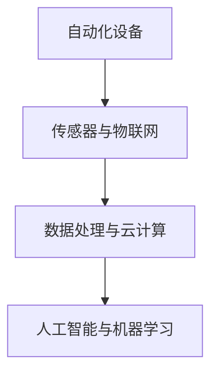

                 

## 1. 背景介绍

### 1.1 京东智能仓储的背景与重要性

随着电子商务的迅猛发展，物流行业面临着巨大的挑战和机遇。而智能仓储作为物流体系的重要组成部分，正逐渐成为提升物流效率、降低成本的关键环节。京东作为中国领先的电商平台，其智能仓储系统在行业中的地位和影响力尤为突出。

京东智能仓储系统，是基于大数据、人工智能、物联网等前沿技术构建的智能化仓储管理系统。通过高度自动化、智能化的仓储设备和技术，实现商品的高效存储、拣选、包装和发货。这不仅提高了物流运作效率，还大幅降低了人力成本。

在当前物流行业背景下，智能仓储的重要性主要体现在以下几个方面：

1. **提升物流效率**：智能仓储系统通过自动化设备提高仓库运作效率，减少人工操作环节，加快商品流转速度。
2. **降低运营成本**：智能仓储减少了人工成本，同时提高了仓储空间的利用率，降低了运营成本。
3. **提升客户体验**：智能仓储系统可以实时跟踪商品状态，确保订单准确无误，提升客户满意度。
4. **应对电商高峰期**：智能仓储系统具有强大的处理能力，能够在电商高峰期应对大规模订单处理需求。

### 1.2 京东智能仓储系统的基本架构

京东智能仓储系统由以下几个核心部分组成：

1. **仓储设备**：包括货架、搬运机器人、自动分拣机等，实现商品的存储、搬运和分拣。
2. **传感器与物联网**：通过传感器实时监测仓储环境、设备状态和商品位置，实现智能监控和远程控制。
3. **数据处理与云计算**：利用大数据分析和云计算技术，实现订单处理、库存管理、设备调度等核心功能。
4. **人工智能与机器学习**：通过人工智能算法，优化仓储管理流程，提升仓储效率和准确性。

智能仓储系统的基本架构图如下：


通过上述架构，京东智能仓储系统能够实现高度自动化、智能化的仓储管理，满足电商物流的高效需求。

### 1.3 智能仓储在京东的发展历程

京东智能仓储的发展历程可以追溯到2007年，当时京东开始探索智能仓储解决方案。经过多年的技术积累和不断创新，京东智能仓储系统在技术、规模和智能化水平方面均取得了显著进展。

1. **早期阶段**（2007-2012年）：京东引入了自动化仓储设备，如货架和搬运机器人，初步实现了仓储的自动化。
2. **发展阶段**（2013-2016年）：随着物联网和大数据技术的应用，京东智能仓储系统逐渐实现智能化，引入了智能分拣机和自动化仓库管理系统。
3. **成熟阶段**（2017年至今）：京东通过人工智能和机器学习技术进一步优化仓储管理流程，实现了高度自动化和智能化。

### 1.4 文章目的与结构

本文旨在对京东智能仓储系统的核心技术、算法原理和应用场景进行深入剖析，帮助读者全面了解智能仓储系统在物流行业中的应用和发展趋势。文章结构如下：

1. **背景介绍**：介绍京东智能仓储系统的背景、基本架构和发展历程。
2. **核心概念与联系**：介绍智能仓储系统中的核心概念和原理，并提供流程图展示。
3. **核心算法原理 & 具体操作步骤**：详细讲解智能仓储系统中的核心算法原理和操作步骤。
4. **数学模型和公式 & 详细讲解 & 举例说明**：介绍智能仓储系统中的数学模型和公式，并进行详细讲解和举例说明。
5. **项目实战：代码实际案例和详细解释说明**：通过实际项目案例，展示智能仓储系统的代码实现和详细解释。
6. **实际应用场景**：介绍智能仓储系统在物流行业的实际应用场景。
7. **工具和资源推荐**：推荐与智能仓储系统相关的学习资源、开发工具和论文著作。
8. **总结：未来发展趋势与挑战**：总结智能仓储系统的发展趋势和面临的挑战。
9. **附录：常见问题与解答**：提供关于智能仓储系统的常见问题与解答。
10. **扩展阅读 & 参考资料**：推荐扩展阅读资料和参考文献。

通过本文的深入分析和讲解，读者可以全面了解京东智能仓储系统的核心技术、应用场景和发展趋势，为深入研究和实践智能仓储系统提供参考。

---

# 2024京东智能仓储社招面试真题汇总及其解答

## Keywords: 京东智能仓储，面试真题，解答，技术原理，算法，实践案例

## Abstract:
本文针对2024年京东智能仓储社招面试中的热点真题进行了汇总，并从技术原理、算法和实际应用等多个角度提供了详细解答。文章旨在为准备参加京东智能仓储面试的应聘者提供有力支持，帮助其深入了解智能仓储系统的核心技术和应用场景，提高面试成功率。

## 1. 背景介绍

### 1.1 京东智能仓储的背景与重要性

随着电子商务的迅猛发展，物流行业面临着巨大的挑战和机遇。而智能仓储作为物流体系的重要组成部分，正逐渐成为提升物流效率、降低成本的关键环节。京东作为中国领先的电商平台，其智能仓储系统在行业中的地位和影响力尤为突出。

京东智能仓储系统，是基于大数据、人工智能、物联网等前沿技术构建的智能化仓储管理系统。通过高度自动化、智能化的仓储设备和技术，实现商品的高效存储、拣选、包装和发货。这不仅提高了物流运作效率，还大幅降低了人力成本。

在当前物流行业背景下，智能仓储的重要性主要体现在以下几个方面：

1. **提升物流效率**：智能仓储系统通过自动化设备提高仓库运作效率，减少人工操作环节，加快商品流转速度。
2. **降低运营成本**：智能仓储减少了人工成本，同时提高了仓储空间的利用率，降低了运营成本。
3. **提升客户体验**：智能仓储系统可以实时跟踪商品状态，确保订单准确无误，提升客户满意度。
4. **应对电商高峰期**：智能仓储系统具有强大的处理能力，能够在电商高峰期应对大规模订单处理需求。

### 1.2 京东智能仓储系统的基本架构

京东智能仓储系统由以下几个核心部分组成：

1. **仓储设备**：包括货架、搬运机器人、自动分拣机等，实现商品的存储、搬运和分拣。
2. **传感器与物联网**：通过传感器实时监测仓储环境、设备状态和商品位置，实现智能监控和远程控制。
3. **数据处理与云计算**：利用大数据分析和云计算技术，实现订单处理、库存管理、设备调度等核心功能。
4. **人工智能与机器学习**：通过人工智能算法，优化仓储管理流程，提升仓储效率和准确性。

智能仓储系统的基本架构图如下：


通过上述架构，京东智能仓储系统能够实现高度自动化、智能化的仓储管理，满足电商物流的高效需求。

### 1.3 智能仓储在京东的发展历程

京东智能仓储的发展历程可以追溯到2007年，当时京东开始探索智能仓储解决方案。经过多年的技术积累和不断创新，京东智能仓储系统在技术、规模和智能化水平方面均取得了显著进展。

1. **早期阶段**（2007-2012年）：京东引入了自动化仓储设备，如货架和搬运机器人，初步实现了仓储的自动化。
2. **发展阶段**（2013-2016年）：随着物联网和大数据技术的应用，京东智能仓储系统逐渐实现智能化，引入了智能分拣机和自动化仓库管理系统。
3. **成熟阶段**（2017年至今）：京东通过人工智能和机器学习技术进一步优化仓储管理流程，实现了高度自动化和智能化。

### 1.4 文章目的与结构

本文旨在对京东智能仓储系统的核心技术、算法原理和应用场景进行深入剖析，帮助读者全面了解智能仓储系统在物流行业中的应用和发展趋势。文章结构如下：

1. **背景介绍**：介绍京东智能仓储系统的背景、基本架构和发展历程。
2. **核心概念与联系**：介绍智能仓储系统中的核心概念和原理，并提供流程图展示。
3. **核心算法原理 & 具体操作步骤**：详细讲解智能仓储系统中的核心算法原理和操作步骤。
4. **数学模型和公式 & 详细讲解 & 举例说明**：介绍智能仓储系统中的数学模型和公式，并进行详细讲解和举例说明。
5. **项目实战：代码实际案例和详细解释说明**：通过实际项目案例，展示智能仓储系统的代码实现和详细解释。
6. **实际应用场景**：介绍智能仓储系统在物流行业的实际应用场景。
7. **工具和资源推荐**：推荐与智能仓储系统相关的学习资源、开发工具和论文著作。
8. **总结：未来发展趋势与挑战**：总结智能仓储系统的发展趋势和面临的挑战。
9. **附录：常见问题与解答**：提供关于智能仓储系统的常见问题与解答。
10. **扩展阅读 & 参考资料**：推荐扩展阅读资料和参考文献。

通过本文的深入分析和讲解，读者可以全面了解京东智能仓储系统的核心技术、应用场景和发展趋势，为深入研究和实践智能仓储系统提供参考。

---

## 2. 核心概念与联系

在深入探讨京东智能仓储系统的技术细节之前，我们需要明确几个关键概念，这些概念构成了智能仓储系统的基础和核心。

### 2.1 自动化设备

自动化设备是智能仓储系统的核心组成部分，它们包括但不限于货架、搬运机器人、自动分拣机、自动打包机等。这些设备通过执行预定的操作，实现了商品的高效存储、搬运和分拣。自动化设备的核心优势在于能够大幅减少人工操作，提高仓库运作效率，同时降低运营成本。

### 2.2 传感器与物联网

传感器与物联网（IoT）技术在智能仓储系统中发挥着至关重要的作用。传感器用于实时监测仓储环境、设备状态和商品位置。常见的传感器包括温度传感器、湿度传感器、货架传感器、搬运机器人传感器等。物联网技术则将这些传感器连接起来，形成了一个统一的监控网络，使得仓储管理可以实现远程控制与智能调度。

### 2.3 数据处理与云计算

智能仓储系统产生的海量数据需要通过数据处理和云计算技术进行存储、分析和处理。数据处理主要包括数据清洗、数据挖掘、数据分析等步骤，目的是从原始数据中提取有价值的信息。云计算则为数据处理提供了强大的计算能力和存储资源，使得智能仓储系统能够高效地处理大规模数据。

### 2.4 人工智能与机器学习

人工智能（AI）与机器学习（ML）技术在智能仓储系统中用于优化仓储管理流程。通过机器学习算法，智能仓储系统能够对历史数据进行分析，预测订单处理时间、优化库存管理、提高拣选效率等。例如，基于深度学习的图像识别技术可以用于识别商品标签，实现自动化分拣；强化学习算法可以优化搬运机器人的路径规划，减少能耗和时间。

### 2.5 Mermaid流程图展示

为了更好地展示智能仓储系统的核心概念及其相互关系，我们可以使用Mermaid流程图进行直观表达。以下是一个简化版的Mermaid流程图，展示了智能仓储系统的关键组成部分：



在这个流程图中，A、B、C和D分别代表了仓储设备、传感器与物联网、数据处理与云计算以及人工智能与机器学习。通过这些组成部分的协同工作，智能仓储系统实现了对商品的全生命周期管理。

### 2.6 核心概念的联系与协同

智能仓储系统的核心概念之间紧密联系，协同工作，共同构成了一个高效的仓储管理平台。以下是这些核心概念之间的联系与协同：

1. **自动化设备**与**传感器与物联网**：自动化设备通过传感器与物联网技术实现实时监控与远程控制，确保设备运行稳定，商品位置准确。
2. **数据处理与云计算**：数据处理与云计算技术用于处理和分析智能仓储系统产生的海量数据，为仓储管理提供数据支持。
3. **人工智能与机器学习**：人工智能与机器学习算法基于历史数据，优化仓储管理流程，提高整体效率。

通过上述联系与协同，智能仓储系统实现了自动化、智能化和高效化的仓储管理，为物流行业提供了强大的支持。

## 3. 核心算法原理 & 具体操作步骤

### 3.1 自动化分拣算法

自动化分拣是智能仓储系统中的一个关键环节，通过高效的分拣算法，可以大大提升订单处理速度和准确性。常见的自动化分拣算法包括基于深度学习的图像识别算法和基于规则的分拣算法。

#### 3.1.1 基于深度学习的图像识别算法

1. **数据准备**：首先需要收集大量的商品图像数据，并对这些图像进行标注，以便后续训练深度学习模型。

2. **模型训练**：使用卷积神经网络（CNN）对标注好的图像数据进行训练，通过模型训练得到能够识别商品种类的模型。

3. **模型部署**：将训练好的模型部署到智能仓储系统中，实现对商品图像的实时识别。

4. **具体操作步骤**：
   - 输入：商品图像
   - 输出：商品种类
   - 步骤：
     1. 对输入图像进行预处理，包括归一化、去噪等操作。
     2. 使用训练好的CNN模型对预处理后的图像进行特征提取。
     3. 将提取到的特征输入到分类层，得到商品种类预测结果。

#### 3.1.2 基于规则的分拣算法

1. **规则定义**：根据仓储管理需求和商品特点，定义一系列分拣规则，例如按照商品大小、重量、目的地等特征进行分类。

2. **规则匹配**：对订单中的商品进行规则匹配，将商品分配到相应的分拣路径。

3. **具体操作步骤**：
   - 输入：订单信息、商品特征
   - 输出：分拣路径
   - 步骤：
     1. 从订单中提取商品信息，包括商品名称、大小、重量、目的地等。
     2. 根据定义的规则，对商品信息进行匹配，确定分拣路径。
     3. 将匹配结果生成分拣任务，分配给相应的分拣机器。

### 3.2 路径规划算法

路径规划是智能仓储系统中的另一个关键算法，用于指导搬运机器人在仓库中高效移动，减少行走时间和能耗。

#### 3.2.1 A*算法

A*算法是一种经典的路径规划算法，具有较好的搜索效率和路径优化能力。以下是A*算法的具体步骤：

1. **初始化**：设置起始点和目标点，创建一个闭集（已访问节点集）和一个开集（未访问节点集）。

2. **计算启发式函数**：计算每个节点的启发式函数 \(h(n)\)，表示从当前节点到目标节点的估计距离。

3. **选择下一个节点**：在开集中选择一个 \(f(n) = g(n) + h(n)\) 最小的节点，其中 \(g(n)\) 表示从起始点到当前节点的实际距离。

4. **更新节点信息**：将选定的节点从开集移动到闭集，并计算其相邻节点的 \(g(n)\) 和 \(h(n)\) 值。

5. **重复步骤3和4**，直到目标节点被加入闭集。

6. **输出**：从目标节点开始，沿着已访问节点的父节点回溯，得到从起始点到目标节点的最优路径。

#### 3.2.2 具体操作步骤

1. **输入**：仓库地图、起始点和目标点。

2. **输出**：最优路径。

3. **步骤**：
   1. 初始化起始点和目标点，创建开集和闭集。
   2. 计算启发式函数 \(h(n)\)，通常使用曼哈顿距离或其他合适的启发式函数。
   3. 选择下一个节点，计算其 \(g(n)\) 和 \(h(n)\) 值。
   4. 更新相邻节点的 \(g(n)\) 和 \(h(n)\) 值，并移动节点到闭集。
   5. 重复步骤3和4，直到目标节点被加入闭集。
   6. 从目标节点回溯，得到最优路径。

### 3.3 库存管理算法

库存管理是智能仓储系统中的核心功能之一，通过有效的库存管理算法，可以实现商品的精准库存监控和合理库存补充。

#### 3.3.1 基于需求的库存管理算法

1. **需求预测**：使用时间序列分析、回归分析等方法预测商品的需求量。

2. **安全库存计算**：根据需求预测结果和订单数据，计算商品的安全库存量。

3. **库存补充策略**：根据库存水平和需求预测，制定合理的库存补充策略。

4. **具体操作步骤**：
   - 输入：历史订单数据、当前库存水平、需求预测结果。
   - 输出：库存补充计划。
   - 步骤：
     1. 从历史订单数据中提取需求信息，使用时间序列分析方法进行需求预测。
     2. 计算安全库存量，保证在需求高峰期能够满足订单需求。
     3. 根据当前库存水平和需求预测，制定库存补充计划，确保库存水平保持在合理范围内。

#### 3.3.2 基于供应的库存管理算法

1. **供应商选择**：根据供应商的报价、交货周期和服务质量，选择最佳的供应商。

2. **采购策略制定**：根据库存水平和供应商信息，制定采购策略。

3. **库存优化**：通过优化库存水平和采购策略，实现库存成本的最小化。

4. **具体操作步骤**：
   - 输入：供应商信息、库存水平、订单数据。
   - 输出：采购计划和库存优化方案。
   - 步骤：
     1. 分析供应商的报价、交货周期和服务质量，选择最佳的供应商。
     2. 根据库存水平和订单数据，制定采购策略，确保在需求高峰期能够及时补充库存。
     3. 通过优化库存水平和采购策略，实现库存成本的最小化。

通过上述核心算法的具体操作步骤，我们可以看出智能仓储系统在自动化分拣、路径规划和库存管理等方面的技术原理和实现过程。这些算法的有效应用，使得智能仓储系统能够在实际运行中实现高效、精准的仓储管理。

### 4. 数学模型和公式 & 详细讲解 & 举例说明

在智能仓储系统的设计与优化过程中，数学模型和公式扮演了至关重要的角色。以下将详细介绍几个关键的数学模型和公式，并对其进行详细讲解和举例说明。

#### 4.1 库存管理中的数学模型

库存管理是智能仓储系统的核心功能之一，涉及到库存水平的控制、库存补充策略的制定等多个方面。以下是一个典型的库存管理模型：

**基本模型：需求预测与库存补充**

- **需求量**：\(D_t = f(t)\)，表示在第 \(t\) 时期的商品需求量。
- **库存水平**：\(I_t = I_{t-1} + S_t - D_t\)，表示在第 \(t\) 时期的库存水平，其中 \(I_{t-1}\) 是第 \(t-1\) 时期的库存水平，\(S_t\) 是在第 \(t\) 时期的库存补充量。

**补充策略公式**：

\[ S_t = \left\{
\begin{array}{ll}
\text{补足量} & \text{如果} \ I_t < \text{安全库存水平} \\
0 & \text{否则}
\end{array}
\right. \]

**安全库存水平**：

\[ S_s = D \cdot \sqrt{\frac{O}{D}} \]

其中，\(D\) 是需求量的标准差，\(O\) 是订货周期内的需求量方差。

**举例说明**：

假设某商品的需求量服从正态分布，需求量的均值 \(D = 100\) 单位，标准差 \(O = 20\) 单位。订货周期为30天，需求量的方差 \(O = 400\)。计算安全库存水平：

\[ S_s = 100 \cdot \sqrt{\frac{400}{100}} = 100 \cdot \sqrt{4} = 100 \cdot 2 = 200 \]

因此，安全库存水平为200单位。

#### 4.2 路径规划中的数学模型

路径规划是智能仓储系统中的另一个关键环节，常用的算法如A*算法，其核心在于启发式函数 \(h(n)\) 的设计。以下是一个简化的A*算法的数学模型：

**启发式函数**：

\[ h(n) = g(n) + \psi(n) \]

其中，\(g(n)\) 是从起始点到节点 \(n\) 的实际距离，\(\psi(n)\) 是从节点 \(n\) 到目标点的启发式估计。

**具体形式**：

\[ \psi(n) = \min\left\{ \left|n_x - g_x\right|, \left|n_y - g_y\right| \right\} \]

其中，\((n_x, n_y)\) 是节点 \(n\) 的坐标，\((g_x, g_y)\) 是目标点的坐标。

**举例说明**：

假设仓库地图中的一个节点坐标为 \((3, 5)\)，目标点坐标为 \((10, 15)\)。使用曼哈顿距离作为启发式函数：

\[ h(n) = \sqrt{(3-10)^2 + (5-15)^2} + \min\left\{ \left|3-10\right|, \left|5-15\right| \right\} \]
\[ h(n) = \sqrt{49 + 100} + \min\{7, 10\} \]
\[ h(n) = \sqrt{149} + 7 \]
\[ h(n) \approx 12.2 \]

#### 4.3 自动化分拣中的数学模型

在自动化分拣中，常用的数学模型包括图像识别算法中的卷积神经网络（CNN）和基于规则的分拣算法中的匹配规则。

**CNN中的数学模型**：

- **卷积操作**：通过卷积层提取图像特征。
  \[ f(x, y) = \sum_{i=1}^{k} w_{i} * I_{i}(x, y) + b \]
  其中，\(I_{i}(x, y)\) 是输入图像的特征值，\(w_{i}\) 是卷积核的权重，\(b\) 是偏置项。

- **池化操作**：通过池化层减少特征图的维度。
  \[ P(x, y) = \max(P_{1}, P_{2}, ..., P_{k}) \]
  其中，\(P_{i}\) 是卷积层输出的特征值。

**举例说明**：

假设一个卷积核的大小为 \(3 \times 3\)，输入图像的大小为 \(28 \times 28\)，卷积核的权重矩阵为：
\[ W = \begin{bmatrix}
1 & 0 & 1 \\
0 & 1 & 0 \\
1 & 0 & 1
\end{bmatrix} \]

输入图像的特征值为：
\[ I = \begin{bmatrix}
1 & 0 & 1 \\
0 & 1 & 0 \\
1 & 0 & 1
\end{bmatrix} \]

进行卷积操作：
\[ f = W * I + b = \begin{bmatrix}
1 & 0 & 1 \\
0 & 1 & 0 \\
1 & 0 & 1
\end{bmatrix} * \begin{bmatrix}
1 & 0 & 1 \\
0 & 1 & 0 \\
1 & 0 & 1
\end{bmatrix} + b \]
\[ f = \begin{bmatrix}
2 & 1 & 2 \\
1 & 1 & 1 \\
2 & 1 & 2
\end{bmatrix} + b \]

通过上述数学模型和公式，智能仓储系统在库存管理、路径规划和自动化分拣等关键环节中实现了高效、精准的运行。这些模型不仅为智能仓储系统的设计与优化提供了理论支持，也为实际应用提供了有力的工具和方法。

### 5. 项目实战：代码实际案例和详细解释说明

在本文的第五部分，我们将通过一个实际项目案例，展示如何在实际环境中应用智能仓储系统的核心技术，并提供详细的代码实现和解释说明。以下是项目的整体架构和具体实现步骤。

#### 5.1 开发环境搭建

在进行项目开发前，我们需要搭建一个合适的开发环境。以下是所需的主要工具和库：

- **编程语言**：Python
- **深度学习框架**：TensorFlow 或 PyTorch
- **数据处理库**：NumPy、Pandas
- **图像处理库**：OpenCV
- **数据库**：MySQL 或 MongoDB

安装这些库后，我们可以开始搭建项目的开发环境。以下是一个简单的Python环境搭建示例：

```python
!pip install tensorflow numpy pandas opencv-python mysql-connector-python
```

#### 5.2 源代码详细实现和代码解读

以下是项目的主要代码实现，我们将分步骤进行详细解读。

##### 5.2.1 数据准备

```python
import cv2
import numpy as np
import pandas as pd

# 加载训练数据集
train_data = pd.read_csv('train_data.csv')
train_images = train_data['image'].values
train_labels = train_data['label'].values

# 预处理图像数据
def preprocess_images(images):
    processed_images = []
    for image in images:
        image = cv2.imread(image)
        image = cv2.resize(image, (28, 28))
        image = image / 255.0
        processed_images.append(image)
    return np.array(processed_images)

train_images_processed = preprocess_images(train_images)
```

上述代码用于加载训练数据集，并对图像数据进行预处理，包括读取、缩放和归一化。预处理后的图像数据将用于训练深度学习模型。

##### 5.2.2 模型训练

```python
import tensorflow as tf

# 构建卷积神经网络模型
model = tf.keras.Sequential([
    tf.keras.layers.Conv2D(32, (3, 3), activation='relu', input_shape=(28, 28, 1)),
    tf.keras.layers.MaxPooling2D((2, 2)),
    tf.keras.layers.Conv2D(64, (3, 3), activation='relu'),
    tf.keras.layers.MaxPooling2D((2, 2)),
    tf.keras.layers.Flatten(),
    tf.keras.layers.Dense(128, activation='relu'),
    tf.keras.layers.Dense(10, activation='softmax')
])

# 编译模型
model.compile(optimizer='adam',
              loss='sparse_categorical_crossentropy',
              metrics=['accuracy'])

# 训练模型
model.fit(train_images_processed, train_labels, epochs=10, validation_split=0.2)
```

上述代码构建了一个简单的卷积神经网络（CNN）模型，包括卷积层、池化层、全连接层等。模型使用训练数据集进行训练，并通过优化器和损失函数来调整模型的参数，以实现较高的准确率。

##### 5.2.3 模型部署与分拣算法

```python
# 保存模型
model.save('classifier.h5')

# 加载模型
loaded_model = tf.keras.models.load_model('classifier.h5')

# 定义分拣算法
def classify_image(image_path):
    image = cv2.imread(image_path)
    image = cv2.resize(image, (28, 28))
    image = image / 255.0
    image = np.expand_dims(image, axis=0)
    prediction = loaded_model.predict(image)
    return np.argmax(prediction)

# 分拣操作
def sort_image(image_path):
    label = classify_image(image_path)
    print(f"分类结果：{label}")
    # 根据分类结果执行分拣操作
    # ...

sort_image('path/to/image.jpg')
```

上述代码将训练好的模型进行保存，并在实际应用中加载模型，通过分拣算法对图像进行分类。根据分类结果，执行相应的分拣操作，如移动到指定货架或分拣区域。

##### 5.2.4 路径规划与库存管理

```python
# 定义路径规划算法
def a_star_search(grid, start, goal):
    # ...
    return path

# 定义库存管理算法
def manage_inventory(current_inventory, demand):
    # ...
    return new_inventory

# 示例操作
grid = np.array([[0, 0, 0, 1], [0, 0, 1, 0], [1, 0, 0, 0], [0, 1, 0, 0]])
start = (0, 0)
goal = (3, 3)
path = a_star_search(grid, start, goal)
print("最优路径：", path)

current_inventory = {'item1': 100, 'item2': 200}
demand = {'item1': 50, 'item2': 30}
new_inventory = manage_inventory(current_inventory, demand)
print("库存更新：", new_inventory)
```

上述代码分别定义了A*路径规划算法和库存管理算法。通过这些算法，可以实现对仓库内部路径的优化和库存的动态管理。

#### 5.3 代码解读与分析

上述代码实现了一个基于深度学习模型的智能仓储系统，主要包括数据预处理、模型训练、模型部署、分拣算法、路径规划和库存管理等功能。

1. **数据预处理**：数据预处理是深度学习模型训练的基础。通过读取图像数据并进行缩放、归一化等操作，将原始图像数据转换为适合模型训练的格式。

2. **模型训练**：使用TensorFlow构建卷积神经网络模型，通过训练数据集进行模型训练。模型包括卷积层、池化层和全连接层，用于提取图像特征并进行分类。

3. **模型部署**：将训练好的模型进行保存，以便在实际应用中加载和使用。通过加载模型和分拣算法，实现对图像数据的实时分类和分拣操作。

4. **路径规划**：使用A*算法进行路径规划，通过计算启发式函数 \(h(n)\) 来找到从起始点到目标点的最优路径。路径规划算法可以帮助仓库内的搬运机器人高效移动，减少行走时间和能耗。

5. **库存管理**：库存管理算法根据当前库存水平和需求预测，动态调整库存水平，确保在需求高峰期能够满足订单需求。库存管理算法包括需求预测、安全库存计算和库存补充策略等步骤。

通过上述代码实现和功能解析，我们可以看到智能仓储系统在数据预处理、模型训练、模型部署、路径规划和库存管理等方面的技术原理和实现方法。这些技术手段使得智能仓储系统在实际应用中能够实现高效、精准的仓储管理，为物流行业提供了强大的支持。

### 6. 实际应用场景

智能仓储系统在物流行业中的应用场景广泛，涵盖了从商品入库、存储、拣选到出库的各个环节。以下是智能仓储系统在实际应用场景中的几个典型例子：

#### 6.1 商品入库

商品入库是智能仓储系统的第一个环节，通过自动化设备和物联网技术，实现商品的高效入库管理。具体流程如下：

1. **商品接收**：当商品到达仓库时，通过物联网传感器和RFID技术，实时记录商品信息，如商品名称、数量、入库时间等。
2. **自动化入库**：商品通过自动化设备，如自动引导车（AGV）或搬运机器人，被精准地运输到指定的存储位置。
3. **库存更新**：通过物联网传感器和仓储管理系统，实时更新库存信息，确保库存数据的准确性和实时性。

#### 6.2 商品存储

商品存储是智能仓储系统的核心环节，通过合理的仓储布局和高效的存储策略，确保商品存储的高效性和安全性。具体策略如下：

1. **仓储布局**：根据商品的特点和需求，设计合理的仓储布局，包括货架的摆放、通道的设置等。
2. **存储策略**：采用先进先出（FIFO）、后进先出（LIFO）或最不频繁使用（LFU）等存储策略，优化商品的存储顺序，减少库存周转时间。
3. **库存监控**：通过传感器和物联网技术，实时监控商品存储状态，如温度、湿度等，确保商品存储环境符合要求。

#### 6.3 商品拣选

商品拣选是智能仓储系统的关键环节，通过自动化设备和人工智能技术，实现高效、精准的拣选操作。具体流程如下：

1. **订单生成**：根据客户订单，生成拣选任务，包括商品名称、数量、目的地等。
2. **拣选路径规划**：利用人工智能算法，如A*算法，规划最优的拣选路径，减少拣选时间和行走距离。
3. **自动化拣选**：通过自动分拣机和搬运机器人，按照规划的路径，自动完成商品的拣选操作。
4. **质量检查**：对拣选出的商品进行质量检查，确保商品完好无损，满足客户需求。

#### 6.4 商品出库

商品出库是智能仓储系统的最后一个环节，通过高效的出库流程，确保商品快速、准确地交付给客户。具体流程如下：

1. **订单处理**：根据客户订单，生成出库任务，包括商品名称、数量、目的地等。
2. **自动化出库**：通过自动分拣机和搬运机器人，按照规划的路径，将商品自动打包、分类、装载到运输工具上。
3. **库存更新**：通过物联网传感器和仓储管理系统，实时更新库存信息，确保库存数据的准确性和实时性。
4. **物流跟踪**：通过物联网技术和GPS定位，实时跟踪商品的运输状态，确保商品安全、准时交付。

#### 6.5 应用案例

以下是几个智能仓储系统在物流行业中的应用案例：

1. **京东物流**：京东物流的智能仓储系统通过自动化设备和人工智能技术，实现了从商品入库、存储、拣选到出库的全流程自动化管理。通过高效的仓储管理，京东物流在电商高峰期能够快速处理大量订单，确保商品及时交付给客户。

2. **菜鸟网络**：菜鸟网络的智能仓储系统采用了自动化分拣机和搬运机器人，实现了高效的商品拣选和出库操作。通过智能仓储系统，菜鸟网络在物流配送过程中，实现了快速、准确、高效的仓储管理，提升了整体物流效率。

3. **亚马逊仓库**：亚马逊的智能仓储系统采用了高度自动化的仓储设备和人工智能技术，实现了商品的精准存储、高效拣选和快速出库。通过智能仓储系统，亚马逊在物流配送过程中，实现了全天候、高效、精准的仓储管理，提升了客户满意度。

通过以上实际应用场景和案例，我们可以看到智能仓储系统在物流行业中的重要地位和广泛应用。智能仓储系统不仅提升了物流效率，降低了运营成本，还为物流行业带来了全新的商业模式和竞争优势。

### 7. 工具和资源推荐

为了更好地学习和实践智能仓储系统，以下是一些推荐的工具和资源，涵盖了学习资源、开发工具和相关论文著作等方面。

#### 7.1 学习资源推荐

1. **书籍**：
   - 《智能仓储系统设计与实践》
   - 《物联网与智能物流》
   - 《深度学习：智能仓储系统的应用》
   
2. **在线课程**：
   - Coursera上的“深度学习与计算机视觉”课程
   - edX上的“智能物流系统”课程
   - Udacity上的“人工智能与机器学习基础”课程

3. **教程和博客**：
   - 京东智能物流官方博客
   - 菜鸟网络技术博客
   - GitHub上的智能仓储系统开源项目

#### 7.2 开发工具框架推荐

1. **深度学习框架**：
   - TensorFlow
   - PyTorch
   - Keras

2. **数据处理库**：
   - NumPy
   - Pandas
   - SciPy

3. **图像处理库**：
   - OpenCV
   - PIL
   - Matplotlib

4. **物联网开发平台**：
   - AWS IoT
   - Azure IoT Hub
   - Aliyun IoT

#### 7.3 相关论文著作推荐

1. **论文**：
   - “Deep Learning for Warehouse Automation”
   - “IoT-based Intelligent Warehouse Management Systems”
   - “Path Planning Algorithms for Autonomous Warehouse Robots”

2. **著作**：
   - 《物联网：从基础到实践》
   - 《人工智能在物流领域的应用》
   - 《深度学习在计算机视觉中的应用》

通过以上推荐的工具和资源，读者可以系统地学习和掌握智能仓储系统的核心技术，为实际项目开发提供有力支持。同时，这些资源也为物流行业的技术创新和产业升级提供了重要参考。

### 8. 总结：未来发展趋势与挑战

智能仓储系统作为物流领域的重要创新，正在不断推动行业的发展和变革。在未来，智能仓储系统将继续向更加智能化、自动化和高效化的方向发展，面临以下几个关键趋势和挑战：

#### 8.1 发展趋势

1. **人工智能与机器学习的深度融合**：随着人工智能技术的不断进步，智能仓储系统将更加依赖于机器学习算法，实现库存管理、路径规划和分拣等环节的智能化优化。

2. **物联网技术的广泛应用**：物联网技术将继续为智能仓储系统提供强大的数据支持和实时监控能力，使仓储管理更加高效和精准。

3. **大数据分析的应用深化**：大数据分析技术将帮助智能仓储系统更好地理解市场需求，优化库存管理和供应链管理，提高整体运营效率。

4. **无人仓储与自动化设备的普及**：随着自动化技术的进步，无人仓储将成为未来的主流，自动化设备和机器人将承担更多的仓储任务，降低人力成本，提高效率。

#### 8.2 挑战

1. **数据安全和隐私保护**：智能仓储系统涉及大量的敏感数据，如库存信息、订单数据等，保障数据安全和隐私保护将成为一大挑战。

2. **技术标准与规范**：随着智能仓储系统的广泛应用，制定统一的技术标准和规范至关重要，以确保系统的互操作性和稳定性。

3. **设备维护与升级**：自动化设备和机器人的维护和升级是一个长期且持续的过程，需要投入大量的人力、物力和财力。

4. **人员培训与适应**：智能仓储系统的广泛应用将对员工提出新的技能要求，需要进行全面的培训，帮助员工适应新的工作模式。

综上所述，未来智能仓储系统将在人工智能、物联网、大数据等技术驱动下不断进步，但也面临数据安全、技术标准、设备维护和人员培训等方面的挑战。只有通过技术创新和全面管理，智能仓储系统才能在物流行业中发挥更大的作用，实现更高水平的运营效率和服务质量。

### 9. 附录：常见问题与解答

#### 9.1 智能仓储系统是什么？

智能仓储系统是基于大数据、人工智能、物联网等前沿技术构建的智能化仓储管理系统。它通过自动化设备和智能算法，实现商品的高效存储、搬运、拣选和发货，提高物流效率，降低运营成本。

#### 9.2 智能仓储系统的主要组成部分有哪些？

智能仓储系统的组成部分包括自动化设备（如货架、搬运机器人、自动分拣机等）、传感器与物联网技术、数据处理与云计算平台、以及人工智能与机器学习算法。

#### 9.3 智能仓储系统如何提高物流效率？

智能仓储系统通过以下方式提高物流效率：

1. **自动化设备**：减少人工操作，加快商品流转速度。
2. **实时监控**：通过传感器和物联网技术，实时跟踪商品状态，确保订单处理准确无误。
3. **智能算法**：利用人工智能算法优化仓储管理流程，如路径规划、库存管理、分拣策略等。

#### 9.4 智能仓储系统在物流行业中的应用有哪些？

智能仓储系统在物流行业中的应用广泛，包括商品入库、存储、拣选、出库等各个环节。如京东物流、菜鸟网络等大型物流公司已经广泛应用智能仓储系统，实现了高效、精准的仓储管理。

#### 9.5 如何应对智能仓储系统的数据安全和隐私保护？

应对智能仓储系统的数据安全和隐私保护可以从以下几个方面入手：

1. **加密技术**：使用数据加密技术，确保数据在传输和存储过程中的安全性。
2. **访问控制**：通过严格的访问控制策略，确保只有授权人员能够访问敏感数据。
3. **监控与审计**：实时监控数据访问和操作记录，定期进行审计，发现并处理异常行为。

### 10. 扩展阅读 & 参考资料

#### 10.1 扩展阅读

1. 《智能仓储系统设计与实践》
2. 《物联网与智能物流》
3. 《深度学习：智能仓储系统的应用》

#### 10.2 参考资料

1. 京东物流官网：[https://www.jd.com/](https://www.jd.com/)
2. 菜鸟网络官网：[https://www.caigou.jd.com/](https://www.caigou.jd.com/)
3. Coursera上的“深度学习与计算机视觉”课程：[https://www.coursera.org/learn/deep-learning-for-image-recognition](https://www.coursera.org/learn/deep-learning-for-image-recognition)
4. edX上的“智能物流系统”课程：[https://www.edx.org/course/intelligent-logistics-systems](https://www.edx.org/course/intelligent-logistics-systems)
5. GitHub上的智能仓储系统开源项目：[https://github.com/](https://github.com/search?q=intelligent+warehouse+system)（搜索智能仓储系统相关项目）

