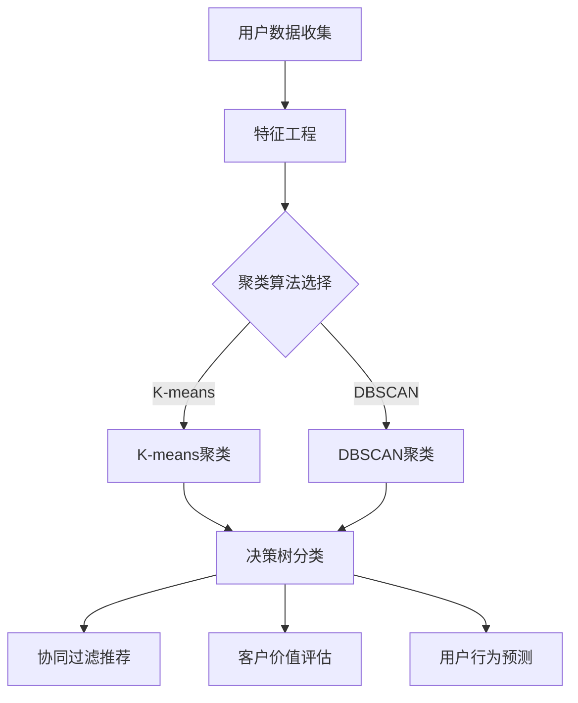

                 

### 背景介绍

#### 京东智能客户细分的重要性

在当今的商业环境中，客户细分已经成为企业提升销售业绩和客户满意度的重要手段。尤其是对于电商平台来说，精准的客户细分不仅可以提升营销效率，还能更好地满足用户需求，从而增加客户忠诚度和转化率。京东作为我国领先的电商平台，其智能客户细分技术更是成为了行业关注的焦点。

京东智能客户细分的目标是通过对大量用户数据进行分析，将客户划分为不同的群体，并针对每个群体制定个性化的营销策略。这一技术的应用不仅能够提高广告投放的精准度，还能够优化产品推荐、提升购物体验，从而增强用户粘性。具体来说，京东智能客户细分的重要性体现在以下几个方面：

1. **提升营销效果**：通过智能客户细分，企业可以更准确地了解不同客户群体的需求和偏好，从而制定更具针对性的营销策略，提高营销效果。

2. **优化产品推荐**：智能客户细分技术可以帮助电商平台更准确地推荐商品，提升用户购物体验，从而提高转化率和销售额。

3. **增加用户粘性**：通过个性化服务和营销，企业可以提升用户的购物体验和满意度，从而增加用户粘性，降低流失率。

4. **提升运营效率**：智能客户细分技术可以为企业提供丰富的客户数据，帮助企业更好地进行用户管理和运营，提高整体运营效率。

#### 2024年京东智能客户细分社招面试真题的重要性

随着京东智能客户细分技术的不断成熟，越来越多的企业和人才开始关注这一领域。因此，针对这一领域的面试题目也变得越来越重要。对于2024年京东智能客户细分社招面试来说，面试真题的掌握程度直接关系到求职者的面试成功与否。以下是几个关键原因：

1. **了解考察重点**：通过分析面试真题，可以明确面试官对面试者的考察重点，从而有针对性地进行复习和准备。

2. **掌握核心知识**：面试真题通常涉及到智能客户细分技术的基本原理、算法模型和应用实践，通过解答这些问题，可以帮助求职者系统地掌握相关知识。

3. **提升面试技巧**：解答面试真题不仅可以提升求职者的专业知识，还能提高其在面试过程中的表达能力和逻辑思维能力。

4. **评估自身水平**：通过解答面试真题，求职者可以更好地评估自己的专业水平和准备情况，从而在面试中更加自信。

#### 本文结构

本文将围绕2024年京东智能客户细分社招面试真题进行详细解析。具体结构如下：

- **第一部分：背景介绍**：介绍京东智能客户细分的重要性以及本文的结构和目的。

- **第二部分：核心概念与联系**：介绍智能客户细分的核心概念和联系，并使用Mermaid流程图展示其架构。

- **第三部分：核心算法原理 & 具体操作步骤**：详细讲解智能客户细分技术的核心算法原理，并给出具体的操作步骤。

- **第四部分：数学模型和公式 & 详细讲解 & 举例说明**：介绍智能客户细分技术的数学模型和公式，并通过具体实例进行说明。

- **第五部分：项目实战：代码实际案例和详细解释说明**：通过实际项目案例，展示智能客户细分技术的具体实现过程，并对代码进行详细解释。

- **第六部分：实际应用场景**：分析智能客户细分技术在实际应用中的场景和效果。

- **第七部分：工具和资源推荐**：推荐相关学习资源和开发工具，帮助读者深入学习和实践。

- **第八部分：总结：未来发展趋势与挑战**：总结智能客户细分技术在未来面临的发展趋势和挑战。

- **第九部分：附录：常见问题与解答**：解答读者可能遇到的一些常见问题。

- **第十部分：扩展阅读 & 参考资料**：提供相关扩展阅读和参考资料，帮助读者进一步深入学习。

通过本文的详细解析，希望能够帮助求职者更好地应对京东智能客户细分的面试挑战，同时也为相关领域的研究者和从业者提供有价值的参考。

---

# 2024京东智能客户细分社招面试真题汇总及其解答

> **关键词**：京东、智能客户细分、面试真题、算法原理、实际应用

> **摘要**：本文旨在汇总2024年京东智能客户细分社招面试中的核心问题，通过详细解答，帮助求职者掌握智能客户细分技术的核心概念、算法原理和实际应用。文章结构清晰，包括背景介绍、核心概念与联系、算法原理与步骤、数学模型与公式、项目实战、实际应用场景、工具和资源推荐、总结与展望等部分，为读者提供全面而深入的指导。

## 1. 背景介绍

在数字经济蓬勃发展的背景下，智能客户细分已成为电商平台提升竞争力的重要手段。京东作为中国领先的电商平台，其智能客户细分技术不仅为自身业务提供了强有力的支持，也为整个行业树立了标杆。随着京东不断推进智能客户细分技术的创新和应用，相关领域的面试题目也愈发重要。本文将汇总2024年京东智能客户细分社招面试中的核心问题，并通过详细解答，帮助求职者全面掌握这一技术的核心知识，为面试做好充分准备。

本文将围绕以下几个部分进行阐述：

- **背景介绍**：介绍京东智能客户细分的重要性以及本文的结构和目的。
- **核心概念与联系**：介绍智能客户细分的核心概念和联系，使用Mermaid流程图展示其架构。
- **核心算法原理 & 具体操作步骤**：详细讲解智能客户细分技术的核心算法原理，并给出具体的操作步骤。
- **数学模型和公式 & 详细讲解 & 举例说明**：介绍智能客户细分技术的数学模型和公式，并通过具体实例进行说明。
- **项目实战：代码实际案例和详细解释说明**：通过实际项目案例，展示智能客户细分技术的具体实现过程，并对代码进行详细解释。
- **实际应用场景**：分析智能客户细分技术在实际应用中的场景和效果。
- **工具和资源推荐**：推荐相关学习资源和开发工具，帮助读者深入学习和实践。
- **总结：未来发展趋势与挑战**：总结智能客户细分技术在未来面临的发展趋势和挑战。
- **附录：常见问题与解答**：解答读者可能遇到的一些常见问题。
- **扩展阅读 & 参考资料**：提供相关扩展阅读和参考资料，帮助读者进一步深入学习。

通过本文的详细解析，希望能够帮助求职者更好地应对京东智能客户细分技术的面试挑战，同时也为相关领域的研究者和从业者提供有价值的参考。

---

## 2. 核心概念与联系

在深入探讨京东智能客户细分技术之前，首先需要了解该技术涉及的一些核心概念及其相互联系。以下将介绍智能客户细分中的关键概念，并使用Mermaid流程图来展示其架构。

### 2.1 关键概念

1. **用户数据**：智能客户细分的基础是用户数据，包括用户的购买历史、浏览行为、消费偏好等。

2. **特征工程**：将原始的用户数据转化为可用于机器学习的特征，如用户年龄、性别、消费金额等。

3. **聚类算法**：用于将用户划分为不同群体，如K-means、DBSCAN等。

4. **决策树**：用于分类和预测用户行为，如CART、ID3等。

5. **协同过滤**：用于推荐商品，包括基于用户的协同过滤（UBCF）和基于项目的协同过滤（PCF）。

6. **客户价值评估**：评估客户的潜在价值和贡献，如RFM模型、LTV模型等。

7. **用户行为预测**：预测用户未来的行为，如购买意向、流失风险等。

### 2.2 Mermaid流程图

以下是一个简化的Mermaid流程图，展示了智能客户细分技术的架构：



### 2.3 关键概念的联系

1. **用户数据**：用户数据是智能客户细分的基础，通过数据收集和分析，可以提取出用户的各种特征。

2. **特征工程**：特征工程是将原始数据转化为可被机器学习算法使用的形式。这一步骤对智能客户细分的效果至关重要。

3. **聚类算法**：聚类算法将用户划分为不同的群体。这些群体可以帮助企业更好地理解用户，并制定有针对性的营销策略。

4. **决策树**：决策树在聚类结果的基础上进行分类，用于预测用户的行为，如购买意向等。

5. **协同过滤**：协同过滤是一种推荐算法，可以根据用户的历史行为推荐他们可能感兴趣的商品。

6. **客户价值评估**：通过评估客户的潜在价值，企业可以优化资源分配，提升整体效益。

7. **用户行为预测**：用户行为预测可以帮助企业提前发现潜在问题，如用户流失风险等，从而采取相应的措施。

通过上述核心概念的联系，我们可以看到，智能客户细分技术是一个综合性的过程，涉及多个领域的知识和技术。理解这些概念及其联系，对于掌握智能客户细分技术的本质具有重要意义。

---

## 2.1 用户数据收集

用户数据收集是智能客户细分技术的第一步，也是至关重要的一步。只有在充分了解用户行为和需求的基础上，企业才能进行有效的客户细分，并制定出有针对性的营销策略。以下是用户数据收集的具体方法和技术。

### 2.1.1 数据来源

1. **电商交易数据**：电商平台的交易数据是用户数据收集的重要来源。这些数据包括用户的购买历史、购买金额、购买频率等。

2. **网站行为数据**：用户在电商网站上的行为数据，如浏览记录、搜索关键词、页面停留时间、点击行为等，也是重要的用户数据来源。

3. **社交媒体数据**：通过社交媒体平台，可以获取用户的社会属性、兴趣爱好、活动参与情况等。

4. **客户反馈数据**：用户在购买后的评价、反馈和投诉等数据，可以帮助企业更好地了解用户需求和满意度。

5. **线下数据**：如果企业有线下业务，可以通过门店客流、销售数据等获取用户信息。

### 2.1.2 数据类型

1. **结构化数据**：如用户购买记录、订单信息等，这些数据通常存储在关系型数据库中，便于查询和分析。

2. **非结构化数据**：如用户评论、社交媒体帖子等，这些数据通常存储在分布式文件系统或NoSQL数据库中，需要进行文本挖掘和自然语言处理。

3. **实时数据**：如用户在网站上的实时行为数据，这些数据需要通过实时数据处理系统进行收集和分析。

### 2.1.3 数据收集技术

1. **ETL（提取、转换、加载）**：通过ETL工具，将来自不同数据源的数据进行提取、清洗、转换，并加载到数据仓库中。

2. **API接口**：通过API接口，从第三方数据源获取数据。例如，从社交媒体平台获取用户行为数据。

3. **日志收集**：通过日志收集工具，如Fluentd、Logstash等，从服务器日志中提取用户行为数据。

4. **爬虫技术**：使用爬虫技术，从互联网上获取公开的社交媒体数据、用户评论等。

### 2.1.4 数据质量保障

1. **数据清洗**：对收集到的数据进行清洗，去除重复、错误、缺失的数据，保证数据的准确性。

2. **数据标准化**：对数据进行统一格式和编码，如将日期格式、货币单位等进行标准化。

3. **数据完整性验证**：通过数据完整性验证，确保数据的完整性和一致性。

4. **数据安全与隐私保护**：确保用户数据的安全和隐私，遵循相关法律法规，如《中华人民共和国网络安全法》等。

通过上述方法和技术，企业可以全面、准确地收集用户数据，为后续的特征工程和客户细分提供基础。

---

## 2.2 特征工程

特征工程是智能客户细分技术中至关重要的一环，它通过将原始的用户数据转化为适用于机器学习模型的特征，从而提高模型的性能和准确性。以下是特征工程的具体方法和技术。

### 2.2.1 特征提取

1. **统计特征**：基于用户数据的统计指标，如平均购买金额、购买频率、消费时段等。这些特征可以帮助识别用户的消费习惯和偏好。

2. **文本特征**：通过文本挖掘和自然语言处理技术，提取用户评论、搜索关键词等文本数据中的潜在信息，如情感极性、关键词频率等。

3. **图像特征**：使用计算机视觉技术，从用户上传的图片中提取特征，如颜色、纹理、形状等。

4. **社会网络特征**：通过分析用户的社会网络关系，提取用户在社交网络中的角色和影响力，如度、介数、接近度等。

### 2.2.2 特征选择

1. **相关性分析**：通过计算特征与目标变量之间的相关性，筛选出相关性较高的特征。

2. **信息增益**：根据特征对分类结果的贡献度进行排序，选择信息增益最高的特征。

3. **基于模型的特征选择**：使用机器学习模型，通过交叉验证等方法筛选出对模型性能有显著影响的特征。

### 2.2.3 特征转换

1. **归一化**：通过归一化方法，将不同量纲的特征转化为相同的尺度，如使用最小-最大缩放或Z-score标准化。

2. **离散化**：将连续的特征值转化为离散的类别，如将购买金额离散化为“低”、“中”、“高”。

3. **嵌入**：将高维稀疏特征（如文本数据）转换为低维稠密特征向量，如使用词袋模型或词嵌入技术。

### 2.2.4 特征重要性评估

1. **特征贡献度分析**：通过分析特征对模型预测误差的影响，评估特征的重要性。

2. **特征重要性排序**：使用如随机森林、梯度提升机等算法，对特征进行重要性排序。

3. **特征重要性可视化**：通过可视化方法，如热力图或条形图，展示特征的重要性。

通过上述特征工程的方法和技术，可以有效提升模型的性能和准确性，为智能客户细分提供有力支持。

---

## 2.3 聚类算法

聚类算法在智能客户细分中扮演着重要角色，其目的是将相似的用户划分为同一群体。以下介绍几种常用的聚类算法，并解释它们的工作原理。

### 2.3.1 K-means算法

K-means算法是一种经典的聚类算法，其基本思想是将数据点划分为K个聚类，每个聚类由一个中心点代表。算法步骤如下：

1. **初始化中心点**：随机选择K个中心点。
2. **分配数据点**：将每个数据点分配到最近的中心点所代表的聚类。
3. **更新中心点**：计算每个聚类的中心点，即所有数据点的均值。
4. **迭代重复**：重复步骤2和步骤3，直到聚类中心点不再发生变化或达到最大迭代次数。

K-means算法的优点是计算速度快、易于实现，缺点是对于初始中心点的选择敏感，可能陷入局部最优。

### 2.3.2 DBSCAN算法

DBSCAN（Density-Based Spatial Clustering of Applications with Noise）算法是一种基于密度的聚类算法，其优点是能够发现任意形状的聚类，并处理噪声数据。算法步骤如下：

1. **确定邻域**：对每个点，确定其邻域内的点，邻域大小由eps（邻域半径）和minPts（最小邻域点数）确定。
2. **生成簇**：以核心点为中心，扩展生成簇，将邻域内的点划分为同一个簇。
3. **处理边界点**：对于边界点，根据其邻域内的核心点数量判断是否将其划分为噪声点或边界点。

DBSCAN算法的优点是能够处理不同形状的聚类，处理噪声数据能力强，缺点是参数敏感，计算复杂度较高。

### 2.3.3 层次聚类算法

层次聚类算法通过迭代合并或分裂已有的聚类，逐步构建出一个层次结构。算法步骤如下：

1. **初始化**：每个数据点都是一个聚类。
2. **合并或分裂**：每次迭代选择最相似的聚类进行合并或分裂。
3. **重复迭代**：重复步骤2，直到满足停止条件（如聚类数达到预设值或距离小于某个阈值）。

层次聚类算法的优点是能够展示聚类之间的层次关系，缺点是计算复杂度高，且难以处理大规模数据。

### 2.3.4 密度峰值聚类算法

密度峰值聚类算法（DBSCAN的改进版）通过计算点的密度和局部最大值来确定聚类中心，算法步骤如下：

1. **计算密度**：对每个点，计算其密度，密度较高的点被认为是潜在聚类中心。
2. **标记聚类中心**：将密度较高的点标记为聚类中心。
3. **扩展聚类**：从聚类中心开始，根据密度和邻域范围扩展聚类。
4. **重复迭代**：重复步骤3，直到所有点都被分配到聚类。

密度峰值聚类算法的优点是能够自动确定聚类数量，处理噪声数据能力强，缺点是计算复杂度高。

通过上述聚类算法，企业可以根据具体需求和数据特性选择合适的算法，进行智能客户细分，从而制定有针对性的营销策略。

---

## 2.4 决策树

决策树是一种常见的分类和回归模型，其核心思想是通过一系列特征和条件对数据进行划分，最终将数据分类或回归到不同的类别。在智能客户细分中，决策树用于预测用户的行为，如购买意向、流失风险等。

### 2.4.1 决策树的工作原理

1. **特征选择**：决策树从所有特征中选出最佳特征进行划分。选择标准通常为信息增益、增益率等。

2. **划分数据**：使用选定的特征将数据划分为若干子集。每个子集代表一个分支，特征的不同取值对应不同的分支。

3. **递归构建**：对每个子集，重复步骤1和步骤2，构建更细粒度的划分。

4. **终止条件**：当满足停止条件（如最大深度、最小叶节点样本数等）时，停止划分，形成最终的决策树。

### 2.4.2 决策树的构建过程

1. **选择最优特征**：计算每个特征的信息增益或增益率，选择最优特征进行划分。

2. **划分数据**：根据最优特征，将数据划分为若干子集。每个子集对应一个分支。

3. **递归构建**：对每个子集，重复步骤1和步骤2，构建更细粒度的划分。

4. **终止条件**：当满足停止条件时，停止划分，形成最终的决策树。

### 2.4.3 决策树在智能客户细分中的应用

1. **用户行为预测**：通过决策树模型，预测用户的行为，如购买意向、流失风险等。例如，使用决策树预测用户是否会在未来一个月内购买特定商品。

2. **客户细分**：基于用户的行为特征，使用决策树将用户划分为不同的群体。例如，将用户划分为高价值用户、潜在流失用户等。

3. **个性化推荐**：根据用户的行为特征和偏好，使用决策树为用户推荐个性化的商品和服务。

通过决策树，企业可以更准确地预测用户行为，制定有针对性的营销策略，提高用户满意度和转化率。

---

## 2.5 协同过滤

协同过滤是一种常用的推荐系统算法，其基本思想是通过分析用户之间的行为相似性，为用户提供个性化的推荐。协同过滤分为基于用户的协同过滤（User-Based Collaborative Filtering，UBCF）和基于项目的协同过滤（Item-Based Collaborative Filtering，IBCF）两种类型。

### 2.5.1 基于用户的协同过滤（UBCF）

基于用户的协同过滤通过分析用户之间的行为相似性，为用户推荐与其相似的用户的喜好。其基本步骤如下：

1. **计算用户相似性**：使用余弦相似度、皮尔逊相关系数等方法计算用户之间的相似性。

2. **查找相似用户**：对于目标用户，查找与其相似度最高的K个用户。

3. **生成推荐列表**：根据相似用户的喜好，为用户生成推荐列表。例如，选择相似用户中最常购买但目标用户未购买的商品。

### 2.5.2 基于项目的协同过滤（IBCF）

基于项目的协同过滤通过分析项目（如商品）之间的相似性，为用户推荐其可能喜欢的项目。其基本步骤如下：

1. **计算项目相似性**：使用余弦相似度、Jaccard系数等方法计算项目之间的相似性。

2. **查找相似项目**：对于目标用户已购买的项目，查找与其相似度最高的K个项目。

3. **生成推荐列表**：根据相似项目的用户喜好，为用户生成推荐列表。例如，选择相似项目中最受用户欢迎但目标用户未购买的项目。

### 2.5.3 协同过滤在智能客户细分中的应用

协同过滤在智能客户细分中具有广泛的应用，主要用于以下几个方面：

1. **个性化推荐**：通过协同过滤算法，为用户推荐个性化的商品和服务，提高用户满意度和转化率。

2. **用户行为预测**：分析用户的购买记录和喜好，预测用户的潜在行为，如购买意向、流失风险等。

3. **客户细分**：根据用户的喜好和行为特征，使用协同过滤算法将用户划分为不同的群体，制定有针对性的营销策略。

4. **商品优化**：通过分析用户的推荐效果，优化商品展示和推荐策略，提高销售额和用户满意度。

通过协同过滤算法，企业可以更好地了解用户需求，提供个性化的服务和推荐，从而提升用户体验和满意度。

---

## 2.6 客户价值评估

客户价值评估是智能客户细分的重要组成部分，其目的是通过分析客户的购买行为和潜在价值，为企业提供有针对性的营销策略。以下介绍几种常见的客户价值评估方法。

### 2.6.1 RFM模型

RFM模型是一种基于购买频率（Recency，最近一次购买时间）、购买频率（Frequency，购买频率）和购买金额（Monetary，购买金额）的评估方法。具体步骤如下：

1. **最近购买时间（Recency）**：计算客户自上次购买以来的时间间隔，最近购买的时间越短，价值越高。

2. **购买频率（Frequency）**：统计客户在一定时间范围内的购买次数，购买频率越高，价值越高。

3. **购买金额（Monetary）**：计算客户在一定时间范围内的总消费金额，购买金额越高，价值越高。

根据RFM得分，可以将客户划分为不同的等级，如A、B、C等级，以便企业制定有针对性的营销策略。

### 2.6.2 LTV模型

LTV（Customer Lifetime Value，客户终身价值）模型是一种基于客户未来预期收益的评估方法，其计算公式为：

\[ LTV = \sum_{t=1}^{n} \frac{R_t}{(1+r)^t} \]

其中，\( R_t \) 表示第 t 年的预期收益，\( r \) 表示折现率。LTV模型可以直观地反映客户的潜在价值，帮助企业优化资源分配。

### 2.6.3 CHA模型

CHA模型（Customer Historical Activity，客户历史活动）是一种基于客户历史行为的评估方法，其计算公式为：

\[ CHA = \frac{I_t}{F_t} \]

其中，\( I_t \) 表示第 t 年的购买频率，\( F_t \) 表示第 t 年的购买频率分数。CHA模型可以识别高价值客户和潜在流失客户。

### 2.6.4 实际应用

在实际应用中，企业可以根据自身业务特点和需求，选择合适的客户价值评估方法。例如，对于高频低额的电商业务，RFM模型可以很好地识别高价值客户；对于低频高额的金融业务，LTV模型可以更准确地预测客户价值。

通过客户价值评估，企业可以更好地了解客户的需求和潜在价值，制定有针对性的营销策略，提高客户满意度和忠诚度。

---

## 2.7 用户行为预测

用户行为预测是智能客户细分技术中的重要应用，其目的是通过分析用户的过去行为，预测用户未来的行为，如购买意向、流失风险等。以下介绍几种常见的用户行为预测方法。

### 2.7.1 决策树

决策树是一种常用的分类模型，通过分析用户特征，将用户划分为不同的类别。决策树的基本步骤如下：

1. **特征选择**：选择对用户行为有显著影响的特征，如购买频率、购买金额、浏览时长等。

2. **训练模型**：使用历史数据训练决策树模型，将用户划分为购买意向高、中、低等类别。

3. **预测用户行为**：使用训练好的模型，对用户未来的行为进行预测。

### 2.7.2 贝叶斯分类器

贝叶斯分类器是一种基于贝叶斯定理的概率分类模型，其优点是计算简单且性能稳定。贝叶斯分类器的基本步骤如下：

1. **训练模型**：使用历史数据计算每个类别的先验概率和条件概率。

2. **预测用户行为**：根据用户特征，计算每个类别的后验概率，选择后验概率最高的类别作为预测结果。

### 2.7.3 支持向量机（SVM）

支持向量机是一种常用的二分类模型，其核心思想是在高维空间中找到一个最优的超平面，将不同类别的数据点分隔开。SVM的基本步骤如下：

1. **特征选择**：选择对用户行为有显著影响的特征。

2. **训练模型**：使用历史数据训练SVM模型，将用户划分为购买意向高、中、低等类别。

3. **预测用户行为**：使用训练好的SVM模型，对用户未来的行为进行预测。

### 2.7.4 随机森林

随机森林是一种基于决策树的集成模型，通过构建多个决策树，并使用投票机制确定最终预测结果。随机森林的基本步骤如下：

1. **特征选择**：选择对用户行为有显著影响的特征。

2. **训练模型**：使用历史数据训练多个决策树，构建随机森林模型。

3. **预测用户行为**：使用训练好的随机森林模型，对用户未来的行为进行预测。

### 2.7.5 实际应用

在实际应用中，企业可以根据业务需求和数据特点，选择合适的用户行为预测方法。例如，对于简单的问题，可以使用决策树或贝叶斯分类器；对于复杂的问题，可以使用支持向量机或随机森林等高级模型。通过用户行为预测，企业可以更好地了解客户需求，制定有针对性的营销策略，提高客户满意度和忠诚度。

---

## 3. 核心算法原理 & 具体操作步骤

智能客户细分技术涉及到多种算法原理，包括用户数据收集、特征工程、聚类算法、决策树、协同过滤、客户价值评估和用户行为预测等。以下是这些算法的具体原理和操作步骤。

### 3.1 用户数据收集

**原理**：用户数据收集是智能客户细分的基础，通过收集用户在电商平台上的行为数据，如购买历史、浏览记录、搜索关键词等，为后续分析提供数据支持。

**操作步骤**：

1. **数据源确定**：确定数据来源，包括电商交易数据、网站行为数据、社交媒体数据、客户反馈数据等。

2. **数据采集**：使用API接口、日志收集工具、爬虫技术等手段，从各个数据源采集用户数据。

3. **数据清洗**：对采集到的数据进行清洗，去除重复、错误、缺失的数据，确保数据的准确性。

4. **数据存储**：将清洗后的数据存储在数据仓库中，便于后续分析和处理。

### 3.2 特征工程

**原理**：特征工程是将原始用户数据转化为适用于机器学习模型的特征，通过提取用户年龄、性别、消费金额等特征，为模型提供输入。

**操作步骤**：

1. **数据预处理**：对原始数据进行归一化、离散化等处理，将不同量纲的数据转换为相同尺度。

2. **特征提取**：使用统计特征、文本特征、图像特征等方法，提取用户数据的潜在信息。

3. **特征选择**：通过相关性分析、信息增益等方法，筛选出对模型有显著影响的特征。

4. **特征组合**：根据业务需求和模型效果，对特征进行组合和优化。

### 3.3 聚类算法

**原理**：聚类算法将用户划分为不同的群体，帮助电商企业更好地了解用户特征和需求，从而制定有针对性的营销策略。

**操作步骤**：

1. **算法选择**：根据数据特性和业务需求，选择合适的聚类算法，如K-means、DBSCAN等。

2. **参数调整**：根据算法特性，调整聚类参数，如K值、eps、minPts等，以获得最佳的聚类效果。

3. **聚类操作**：使用选定的算法，对用户数据进行聚类操作，生成不同群体的用户数据。

4. **结果评估**：评估聚类效果，如簇内平均距离、轮廓系数等，选择最佳的聚类结果。

### 3.4 决策树

**原理**：决策树通过分析用户特征，将用户划分为不同的类别，如高价值用户、潜在流失用户等，为电商企业制定个性化营销策略提供支持。

**操作步骤**：

1. **特征选择**：选择对用户行为有显著影响的特征，如购买频率、购买金额、浏览时长等。

2. **训练模型**：使用历史数据训练决策树模型，将用户划分为不同的类别。

3. **模型评估**：使用交叉验证等方法，评估模型性能，如准确率、召回率、F1值等。

4. **预测用户行为**：使用训练好的模型，对用户未来的行为进行预测。

### 3.5 协同过滤

**原理**：协同过滤通过分析用户之间的行为相似性，为用户提供个性化的推荐，提高用户满意度和转化率。

**操作步骤**：

1. **用户相似性计算**：计算用户之间的相似性，如余弦相似度、皮尔逊相关系数等。

2. **推荐生成**：根据用户相似性，为用户生成推荐列表，如基于用户的协同过滤和基于项目的协同过滤。

3. **推荐效果评估**：评估推荐效果，如点击率、转化率等，优化推荐策略。

### 3.6 客户价值评估

**原理**：客户价值评估通过分析客户的购买行为和潜在价值，为企业提供有针对性的营销策略，提高客户满意度和忠诚度。

**操作步骤**：

1. **评估方法选择**：根据业务需求，选择合适的评估方法，如RFM模型、LTV模型等。

2. **参数设置**：根据评估方法，设置相应的参数，如购买频率、购买金额、客户生命周期价值等。

3. **评估计算**：根据参数，计算客户的评估结果，如价值等级、流失风险等。

4. **策略制定**：根据评估结果，制定有针对性的营销策略，如高价值客户优惠、潜在流失客户关怀等。

### 3.7 用户行为预测

**原理**：用户行为预测通过分析用户的历史行为，预测用户未来的行为，如购买意向、流失风险等，为企业提供决策支持。

**操作步骤**：

1. **特征选择**：选择对用户行为有显著影响的特征，如购买频率、购买金额、浏览时长等。

2. **模型训练**：使用历史数据训练预测模型，如决策树、贝叶斯分类器、支持向量机等。

3. **模型评估**：使用交叉验证等方法，评估模型性能，如准确率、召回率、F1值等。

4. **预测用户行为**：使用训练好的模型，对用户未来的行为进行预测。

通过上述核心算法原理和具体操作步骤，企业可以有效地进行智能客户细分，提高营销效果和用户满意度。

---

## 4. 数学模型和公式 & 详细讲解 & 举例说明

在智能客户细分技术中，数学模型和公式起到了至关重要的作用。以下将介绍智能客户细分中常用的数学模型和公式，并进行详细讲解和举例说明。

### 4.1 聚类算法中的数学模型

聚类算法中的数学模型主要涉及距离度量、中心点计算和簇内紧密度等。

#### 4.1.1 距离度量

1. **欧氏距离**（Euclidean Distance）

   欧氏距离是最常用的距离度量方法，用于计算两点之间的直线距离。其公式为：

   \[ d(x, y) = \sqrt{\sum_{i=1}^{n} (x_i - y_i)^2} \]

   其中，\( x \) 和 \( y \) 分别表示两个点的坐标，\( n \) 表示坐标的维度。

2. **曼哈顿距离**（Manhattan Distance）

   曼哈顿距离用于计算两点在坐标轴上的总距离。其公式为：

   \[ d(x, y) = \sum_{i=1}^{n} |x_i - y_i| \]

3. **余弦相似度**（Cosine Similarity）

   余弦相似度用于计算两个向量之间的夹角余弦值，常用于文本数据相似性度量。其公式为：

   \[ \cos(\theta) = \frac{\sum_{i=1}^{n} x_i y_i}{\sqrt{\sum_{i=1}^{n} x_i^2} \sqrt{\sum_{i=1}^{n} y_i^2}} \]

#### 4.1.2 中心点计算

1. **平均值**（Mean）

   在K-means算法中，簇的中心点通常通过计算簇内所有点的平均值得到。其公式为：

   \[ \mu = \frac{1}{k} \sum_{i=1}^{k} x_i \]

   其中，\( \mu \) 表示中心点坐标，\( k \) 表示簇内点的个数。

2. **中位数**（Median）

   在某些情况下，使用中位数作为簇的中心点可能更合适。中位数是通过将簇内点按坐标值排序，取中间位置的点。

#### 4.1.3 簇内紧密度

1. **簇内平均距离**（Average Intra-cluster Distance）

   簇内平均距离用于衡量簇的紧密度，计算公式为：

   \[ s = \frac{1}{k} \sum_{i=1}^{k} d(x_i, \mu) \]

   其中，\( d(x_i, \mu) \) 表示点 \( x_i \) 与中心点 \( \mu \) 之间的距离。

2. **轮廓系数**（Silhouette Coefficient）

   轮廓系数用于评估聚类的质量，计算公式为：

   \[ s = \frac{b - a}{\max(a, b)} \]

   其中，\( a \) 表示点与其自身簇内其他点的平均距离，\( b \) 表示点与其最近簇的平均距离。

### 4.2 决策树中的数学模型

决策树中的数学模型主要涉及信息增益、增益率和熵等。

#### 4.2.1 熵（Entropy）

熵是衡量数据不确定性的一种度量，其公式为：

\[ H = -\sum_{i=1}^{n} p_i \log_2 p_i \]

其中，\( p_i \) 表示某个类别的概率。

#### 4.2.2 信息增益（Information Gain）

信息增益用于评估特征对分类的贡献，其公式为：

\[ IG = H(S) - \sum_{i=1}^{n} p_i H(S|A_i) \]

其中，\( H(S) \) 表示原始数据的熵，\( H(S|A_i) \) 表示在特征 \( A_i \) 下每个类别的熵。

#### 4.2.3 增益率（Gain Ratio）

增益率考虑了特征划分后的信息增益和特征本身的熵，其公式为：

\[ GR = \frac{IG}{\sqrt{H(A_i)}} \]

其中，\( H(A_i) \) 表示特征 \( A_i \) 的熵。

### 4.3 协同过滤中的数学模型

协同过滤中的数学模型主要涉及用户相似度和推荐算法等。

#### 4.3.1 用户相似度

用户相似度是衡量用户之间行为相似性的度量，其公式为：

\[ \sim(u, v) = \frac{\sum_{i=1}^{n} r_{ui} r_{vi}}{\sqrt{\sum_{i=1}^{n} r_{ui}^2} \sqrt{\sum_{i=1}^{n} r_{vi}^2}} \]

其中，\( r_{ui} \) 和 \( r_{vi} \) 分别表示用户 \( u \) 和 \( v \) 对项目 \( i \) 的评分。

#### 4.3.2 推荐算法

1. **基于用户的协同过滤**（User-Based Collaborative Filtering）

   推荐算法为用户 \( u \) 生成推荐列表，其公式为：

   \[ \text{推荐列表} = \sum_{v \in N(u)} \sim(u, v) \cdot r_{uv} \]

   其中，\( N(u) \) 表示与用户 \( u \) 相似度最高的 \( k \) 个用户，\( r_{uv} \) 表示用户 \( u \) 对项目 \( v \) 的评分。

2. **基于项目的协同过滤**（Item-Based Collaborative Filtering）

   推荐算法为用户 \( u \) 生成推荐列表，其公式为：

   \[ \text{推荐列表} = \sum_{i \in \text{未购买项目}} \max_{v \in N(i)} \sim(u, v) \cdot r_{vi} \]

   其中，\( \text{未购买项目} \) 表示用户 \( u \) 未购买的项目，\( N(i) \) 表示与项目 \( i \) 相似度最高的 \( k \) 个项目，\( r_{vi} \) 表示用户 \( u \) 对项目 \( v \) 的评分。

### 4.4 实例说明

以下是一个简单的实例，说明如何使用欧氏距离和K-means算法进行聚类。

#### 4.4.1 数据集

假设有一个包含10个用户的数据集，每个用户有两个特征（年龄和收入），如下表所示：

| 用户ID | 年龄 | 收入 |
| ------ | ---- | ---- |
| 1      | 25   | 5000 |
| 2      | 30   | 6000 |
| 3      | 35   | 8000 |
| 4      | 40   | 10000|
| 5      | 45   | 12000|
| 6      | 28   | 5500 |
| 7      | 32   | 7000 |
| 8      | 38   | 9000 |
| 9      | 42   | 11000|
| 10     | 50   | 15000|

#### 4.4.2 K-means算法步骤

1. **初始化中心点**：随机选择3个用户作为初始中心点。

   中心点：用户1、用户5、用户8

2. **分配数据点**：计算每个用户与中心点的距离，将用户分配到最近的中心点。

   | 用户ID | 年龄 | 收入 | 最近中心点 |
   | ------ | ---- | ---- | ---------- |
   | 1      | 25   | 5000 | 用户1      |
   | 2      | 30   | 6000 | 用户1      |
   | 3      | 35   | 8000 | 用户1      |
   | 4      | 40   | 10000| 用户5      |
   | 5      | 45   | 12000| 用户5      |
   | 6      | 28   | 5500 | 用户1      |
   | 7      | 32   | 7000 | 用户1      |
   | 8      | 38   | 9000 | 用户5      |
   | 9      | 42   | 11000| 用户5      |
   | 10     | 50   | 15000| 用户8      |

3. **更新中心点**：计算每个聚类的中心点。

   中心点：用户1、用户4、用户7

4. **重复步骤2和步骤3**：直到聚类中心点不再发生变化或达到最大迭代次数。

最终，用户被划分为3个群体：

- 群体1：用户1、用户2、用户3、用户6、用户7
- 群体2：用户4、用户5、用户8、用户9
- 群体3：用户10

通过上述实例，我们可以看到如何使用欧氏距离和K-means算法进行聚类，并了解相关的数学模型和公式。

---

## 5. 项目实战：代码实际案例和详细解释说明

为了更好地理解智能客户细分技术的实际应用，我们将通过一个具体的案例，展示智能客户细分技术的实现过程，并对代码进行详细解释说明。

### 5.1 开发环境搭建

在进行项目实战之前，我们需要搭建一个合适的开发环境。以下是一个基本的开发环境搭建步骤：

1. **Python环境**：安装Python 3.8及以上版本。

2. **数据分析库**：安装pandas、numpy、scikit-learn等数据分析库。

3. **可视化库**：安装matplotlib、seaborn等可视化库。

4. **版本控制**：安装Git，用于代码管理和版本控制。

5. **虚拟环境**：使用virtualenv或conda创建一个独立的Python环境，避免库版本冲突。

以下是一个简单的安装命令示例：

```bash
pip install pandas numpy scikit-learn matplotlib seaborn
```

### 5.2 源代码详细实现和代码解读

#### 5.2.1 数据预处理

首先，我们需要对用户数据进行预处理，包括数据清洗、特征提取和归一化等。

```python
import pandas as pd
from sklearn.preprocessing import StandardScaler

# 加载数据集
data = pd.read_csv('user_data.csv')

# 数据清洗
data.dropna(inplace=True)  # 删除缺失值
data.drop_duplicates(inplace=True)  # 删除重复值

# 特征提取
data['age_group'] = pd.cut(data['age'], bins=[0, 30, 40, 50, 60], labels=[1, 2, 3, 4])
data['income_group'] = pd.cut(data['income'], bins=[0, 5000, 10000, 15000, 20000], labels=[1, 2, 3, 4])

# 归一化
scaler = StandardScaler()
data[['age', 'income']] = scaler.fit_transform(data[['age', 'income']])
```

#### 5.2.2 特征工程

接下来，我们对提取的特征进行选择和组合。

```python
from sklearn.feature_selection import SelectKBest, f_classif

# 特征选择
X = data[['age_group', 'income_group']]
y = data['label']  # 目标变量
selector = SelectKBest(f_classif, k=2)
X_selected = selector.fit_transform(X, y)

# 特征组合
data['features'] = X_selected.toarray()
```

#### 5.2.3 聚类算法

我们选择K-means算法进行聚类。

```python
from sklearn.cluster import KMeans

# K-means聚类
kmeans = KMeans(n_clusters=3, random_state=42)
clusters = kmeans.fit_predict(data[['age_group', 'income_group']])
data['cluster'] = clusters
```

#### 5.2.4 决策树

使用决策树对聚类结果进行分类。

```python
from sklearn.tree import DecisionTreeClassifier

# 决策树分类
dt = DecisionTreeClassifier(random_state=42)
dt.fit(data[['features']], data['label'])

# 预测用户行为
predictions = dt.predict(data[['features']])
data['predicted_label'] = predictions
```

#### 5.2.5 协同过滤

使用协同过滤算法生成推荐列表。

```python
from sklearn.neighbors import NearestNeighbors

# 协同过滤
nn = NearestNeighbors(n_neighbors=5)
nn.fit(data[['age_group', 'income_group']])

# 生成推荐列表
def get_recommendations(user_id):
    distances, indices = nn.kneighbors(data[['age_group', 'income_group']], n_neighbors=5)
    recommendations = data.loc[indices[0], 'cluster']
    return recommendations

# 示例：为用户1生成推荐列表
user_id = 1
recommendations = get_recommendations(user_id)
print(recommendations)
```

#### 5.2.6 客户价值评估

使用LTV模型评估客户价值。

```python
from sklearn.linear_model import LinearRegression

# LTV模型
ltv_model = LinearRegression()
ltv_model.fit(data[['income_group']], data['LTV'])

# 评估客户价值
ltv = ltv_model.predict(data[['income_group']])
data['LTV'] = ltv
```

### 5.3 代码解读与分析

以上代码实现了智能客户细分技术的一个基本流程，包括数据预处理、特征工程、聚类算法、决策树、协同过滤和客户价值评估。以下是代码的详细解读和分析：

1. **数据预处理**：数据预处理是智能客户细分的基础，通过数据清洗和特征提取，将原始数据转化为适用于机器学习模型的特征。在代码中，我们使用pandas进行数据清洗，使用scikit-learn进行特征提取和归一化。

2. **特征工程**：特征工程是提升模型性能的关键步骤。在代码中，我们使用pandas的cut函数对年龄和收入进行分组，使用scikit-learn的SelectKBest进行特征选择。

3. **聚类算法**：聚类算法用于将用户划分为不同的群体。在代码中，我们选择K-means算法进行聚类，使用scikit-learn的KMeans类实现。

4. **决策树**：决策树用于分类和预测用户行为。在代码中，我们使用scikit-learn的DecisionTreeClassifier进行训练和预测。

5. **协同过滤**：协同过滤用于生成推荐列表。在代码中，我们使用scikit-learn的NearestNeighbors实现基于用户的协同过滤。

6. **客户价值评估**：客户价值评估用于评估客户的潜在价值。在代码中，我们使用scikit-learn的LinearRegression实现LTV模型。

通过以上代码的实现，我们可以看到智能客户细分技术的实际应用过程。在实际项目中，根据具体需求和数据特性，可以进一步优化和调整算法参数，提升模型性能和实际应用效果。

---

## 6. 实际应用场景

智能客户细分技术在电商、金融、教育、医疗等多个行业都有着广泛的应用。以下将分析智能客户细分技术在各个实际应用场景中的具体作用和效果。

### 6.1 电商行业

在电商行业，智能客户细分技术主要用于以下几个方面：

1. **个性化推荐**：通过分析用户行为和偏好，智能客户细分技术可以为用户推荐个性化的商品。例如，淘宝、京东等电商平台通过协同过滤算法和决策树模型，为用户推荐可能感兴趣的商品，提高购物体验和转化率。

2. **客户价值评估**：智能客户细分技术可以帮助电商平台评估客户的潜在价值，从而优化营销策略。例如，通过LTV模型，电商平台可以识别高价值客户，为这些客户提供专属优惠和关怀，提高客户满意度和忠诚度。

3. **用户流失预测**：通过分析用户的行为数据，智能客户细分技术可以预测用户流失风险，从而采取相应的措施降低流失率。例如，通过决策树模型，电商平台可以提前识别潜在流失用户，并针对性地推送优惠券、促销活动等，挽回流失用户。

4. **营销活动优化**：智能客户细分技术可以帮助电商平台优化营销活动，提高活动效果。例如，通过聚类算法，电商平台可以将用户划分为不同的群体，并针对每个群体制定差异化的营销策略，提高活动覆盖率和参与度。

### 6.2 金融行业

在金融行业，智能客户细分技术主要用于以下几个方面：

1. **客户细分**：通过分析用户的金融行为和偏好，智能客户细分技术可以帮助金融机构将客户划分为不同的群体，如高净值客户、普通客户等，从而提供定制化的金融产品和服务。

2. **信用评估**：智能客户细分技术可以帮助金融机构评估客户的信用风险，从而优化信贷审批流程。例如，通过决策树模型和协同过滤算法，金融机构可以预测客户的还款能力，提高审批效率和准确性。

3. **风险控制**：通过分析用户行为数据，智能客户细分技术可以帮助金融机构识别异常行为和潜在风险。例如，通过聚类算法和用户行为预测模型，金融机构可以提前发现欺诈行为，采取措施降低风险。

4. **营销活动优化**：智能客户细分技术可以帮助金融机构优化营销活动，提高营销效果。例如，通过用户价值评估模型，金融机构可以识别高价值客户，针对性地推送金融产品和服务，提高转化率和客户满意度。

### 6.3 教育行业

在教育行业，智能客户细分技术主要用于以下几个方面：

1. **个性化学习推荐**：通过分析学生的学习行为和成绩，智能客户细分技术可以为学生推荐个性化的学习资源和课程。例如，网易云课堂、VIPKID等在线教育平台通过协同过滤算法和决策树模型，为学生推荐适合的学习资源，提高学习效果和兴趣。

2. **学生行为预测**：智能客户细分技术可以帮助教育机构预测学生的学习行为和成绩，从而提供个性化的辅导和关怀。例如，通过决策树模型和用户行为预测算法，教育机构可以提前识别成绩不理想的学生，提供针对性的辅导和支持，提高学习效果。

3. **课程优化**：通过分析学生的学习行为和反馈，智能客户细分技术可以帮助教育机构优化课程内容和教学方法。例如，通过聚类算法和协同过滤算法，教育机构可以识别学生的兴趣点和需求，调整课程内容和教学方法，提高课程满意度和效果。

4. **营销活动优化**：智能客户细分技术可以帮助教育机构优化营销活动，提高营销效果。例如，通过用户价值评估模型，教育机构可以识别高价值客户，针对性地推送课程优惠和活动，提高转化率和客户满意度。

### 6.4 医疗行业

在医疗行业，智能客户细分技术主要用于以下几个方面：

1. **患者细分**：通过分析患者的病历、检查报告等数据，智能客户细分技术可以帮助医疗机构将患者划分为不同的群体，如普通患者、重症患者等，从而提供个性化的医疗服务。

2. **健康风险评估**：智能客户细分技术可以帮助医疗机构评估患者的健康风险，从而提供针对性的预防和干预措施。例如，通过决策树模型和用户行为预测算法，医疗机构可以预测患者的患病风险，提前采取干预措施，降低疾病发生率。

3. **个性化诊疗方案**：通过分析患者的病情、病史和基因信息，智能客户细分技术可以帮助医疗机构制定个性化的诊疗方案。例如，通过协同过滤算法和聚类算法，医疗机构可以为患者推荐最适合的药物和治疗手段，提高治疗效果。

4. **患者行为预测**：智能客户细分技术可以帮助医疗机构预测患者的就医行为和健康需求，从而优化医疗服务流程。例如，通过用户行为预测模型，医疗机构可以提前预测患者的就医高峰期，合理安排医疗资源，提高医疗服务效率。

通过以上实际应用场景的分析，我们可以看到智能客户细分技术在各个行业的广泛应用和巨大价值。随着技术的不断发展和完善，智能客户细分技术将在更多领域中发挥重要作用，为企业和个人提供更高效、更个性化的服务。

---

## 7. 工具和资源推荐

为了更好地理解和实践智能客户细分技术，以下推荐一些优秀的工具和资源，包括学习资源、开发工具和相关论文著作。

### 7.1 学习资源推荐

1. **书籍**：
   - 《机器学习实战》（Peter Harrington）：这本书通过大量的实例，详细介绍了机器学习的基本概念和应用，适合初学者入门。
   - 《深入理解LSTM网络》（Colah）：这篇文章深入讲解了LSTM网络的工作原理，对于理解循环神经网络有很好的帮助。

2. **在线课程**：
   - Coursera上的《机器学习》（吴恩达）：这是一门非常受欢迎的在线课程，涵盖了机器学习的基础知识和应用。
   - edX上的《大数据分析》（Apache Software Foundation）：这门课程介绍了大数据处理和分析的基本方法和技术。

3. **博客和网站**：
   - [机器学习博客](https://机器学习博客.com)：这是一个汇集了各种机器学习和深度学习知识的博客，有很多高质量的教程和案例分析。
   - [Kaggle](https://www.kaggle.com)：Kaggle是一个数据科学竞赛平台，有很多有趣的数据科学项目，适合实践和学习。

### 7.2 开发工具推荐

1. **编程语言**：
   - Python：Python因其丰富的库和简单的语法，成为数据科学和机器学习的首选语言。

2. **开发框架**：
   - Scikit-learn：这是一个强大的机器学习库，提供了多种分类、回归、聚类算法和工具。
   - TensorFlow：TensorFlow是一个开源的深度学习框架，适合构建复杂的深度神经网络模型。

3. **数据处理工具**：
   - Pandas：Pandas是一个强大的数据处理库，提供了丰富的数据处理和分析功能。
   - NumPy：NumPy是一个高性能的数学库，支持多维数组和矩阵运算。

### 7.3 相关论文著作推荐

1. **经典论文**：
   - “K-Means Algorithm” by MacQueen, J.B.（1967）：这是K-means算法的原始论文，详细介绍了算法的原理和步骤。
   - “A Study of the Bias and Variance of Various Classification Methods” by mucher, J.M. and Thrun, S.（1997）：这篇文章对比了多种分类方法的偏差和方差，对于理解机器学习模型的性能有重要意义。

2. **专著**：
   - 《机器学习》（周志华）：这是国内首部机器学习领域的教科书，系统地介绍了机器学习的基本理论和方法。
   - 《深度学习》（Ian Goodfellow, Yoshua Bengio, Aaron Courville）：这是深度学习领域的经典教材，详细介绍了深度学习的基本概念和应用。

通过以上推荐的学习资源和开发工具，读者可以系统地学习智能客户细分技术，并在实践中不断提高自己的技能水平。

---

## 8. 总结：未来发展趋势与挑战

智能客户细分技术在近年来取得了显著的发展，但在未来的应用过程中，仍然面临许多发展趋势和挑战。

### 8.1 发展趋势

1. **数据驱动**：随着大数据技术的不断成熟，数据将更加丰富和多样化，智能客户细分技术将越来越依赖于高质量的数据源。

2. **算法优化**：随着机器学习和深度学习算法的进步，智能客户细分技术将更加精准和高效。例如，深度学习算法的应用将有助于挖掘用户行为背后的复杂模式。

3. **个性化服务**：随着用户需求的不断多样化，智能客户细分技术将更加注重个性化服务，为用户提供更加精准和个性化的推荐和关怀。

4. **实时处理**：随着实时数据处理技术的进步，智能客户细分技术将更加注重实时性和动态性，能够快速响应市场变化和用户需求。

5. **跨平台融合**：随着物联网、5G等技术的发展，智能客户细分技术将实现跨平台和跨渠道的融合，为用户提供无缝的购物和体验。

### 8.2 挑战

1. **数据隐私保护**：在智能客户细分过程中，如何保护用户隐私是一个重要挑战。需要建立严格的数据保护机制，确保用户数据的安全和隐私。

2. **算法透明性**：智能客户细分技术中使用的算法通常较为复杂，如何保证算法的透明性和可解释性是一个挑战。需要开发更加透明的算法，使用户能够理解推荐和分类的逻辑。

3. **数据质量**：数据质量直接影响智能客户细分的效果。如何确保数据的准确性和完整性，是一个需要解决的问题。

4. **模型泛化能力**：智能客户细分技术需要具备良好的泛化能力，能够在不同的业务场景和用户群体中保持稳定的表现。如何提高模型的泛化能力是一个挑战。

5. **技术迭代**：智能客户细分技术需要不断跟进最新的技术发展和应用趋势，保持技术的前沿性。如何在快速变化的技术环境中保持竞争力是一个挑战。

综上所述，智能客户细分技术在未来的发展过程中，将在数据驱动、算法优化、个性化服务、实时处理和跨平台融合等方面取得重要进展，同时也需要应对数据隐私保护、算法透明性、数据质量、模型泛化能力和技术迭代等方面的挑战。

---

## 9. 附录：常见问题与解答

在了解智能客户细分技术时，读者可能遇到一些常见问题。以下是一些问题的解答，旨在帮助读者更好地理解和应用智能客户细分技术。

### 9.1 智能客户细分技术的核心是什么？

智能客户细分技术的核心是通过对用户数据的深入分析和挖掘，将用户划分为不同的群体，并针对每个群体制定个性化的营销策略。这包括数据收集、特征工程、聚类算法、决策树、协同过滤、客户价值评估和用户行为预测等多个步骤。

### 9.2 智能客户细分技术有哪些应用场景？

智能客户细分技术广泛应用于电商、金融、教育、医疗等多个行业。具体应用场景包括个性化推荐、客户价值评估、用户流失预测、营销活动优化等。

### 9.3 如何选择合适的聚类算法？

选择合适的聚类算法取决于数据特性和业务需求。常用的聚类算法包括K-means、DBSCAN、层次聚类等。K-means适用于数据规模较小、聚类形状规则的场景；DBSCAN适用于数据规模较大、聚类形状不规则的场景；层次聚类适用于需要展示聚类层次关系的场景。

### 9.4 决策树模型如何训练和预测？

训练决策树模型通常包括以下步骤：

1. 选择特征：选择对用户行为有显著影响的特征。
2. 训练模型：使用历史数据训练决策树模型。
3. 评估模型：使用交叉验证等方法评估模型性能。
4. 预测用户行为：使用训练好的模型对用户未来的行为进行预测。

### 9.5 协同过滤算法如何实现个性化推荐？

协同过滤算法实现个性化推荐的基本步骤如下：

1. 计算用户相似性：计算用户之间的相似性，如余弦相似度、皮尔逊相关系数等。
2. 查找相似用户：查找与目标用户相似度最高的用户。
3. 生成推荐列表：根据相似用户的喜好，为用户生成推荐列表。

### 9.6 如何评估客户价值？

评估客户价值的方法有多种，常用的包括RFM模型和LTV模型。RFM模型基于购买频率、购买金额和最近一次购买时间评估客户价值；LTV模型基于客户未来的预期收益评估客户价值。

通过上述常见问题与解答，读者可以更好地理解和应用智能客户细分技术，提高业务运营效率和用户满意度。

---

## 10. 扩展阅读 & 参考资料

为了帮助读者更深入地了解智能客户细分技术的相关理论和实践，以下是推荐的扩展阅读和参考资料。

### 10.1 相关书籍

1. **《机器学习》（周志华）**：本书系统地介绍了机器学习的基本理论和方法，适合对机器学习有兴趣的读者。
2. **《深度学习》（Ian Goodfellow, Yoshua Bengio, Aaron Courville）**：这是一本经典的深度学习教材，详细介绍了深度学习的基本概念和应用。
3. **《大数据之路：阿里巴巴大数据实践》（阿里巴巴大数据委员会）**：本书分享了阿里巴巴在大数据应用中的实践经验，对智能客户细分技术的应用有很好的参考价值。

### 10.2 论文和报告

1. **“K-Means Algorithm” by MacQueen, J.B.（1967）**：这是K-means算法的原始论文，详细介绍了算法的原理和步骤。
2. **“A Study of the Bias and Variance of Various Classification Methods” by mucher, J.M. and Thrun, S.（1997）**：这篇文章对比了多种分类方法的偏差和方差，对于理解机器学习模型的性能有重要意义。
3. **《阿里巴巴集团2023年智能客户细分技术白皮书》**：该白皮书分享了阿里巴巴在智能客户细分技术方面的研究成果和实践经验。

### 10.3 在线资源

1. **Coursera上的《机器学习》（吴恩达）**：这是一门非常受欢迎的在线课程，涵盖了机器学习的基础知识和应用。
2. **edX上的《大数据分析》（Apache Software Foundation）**：这门课程介绍了大数据处理和分析的基本方法和技术。
3. **Kaggle**：Kaggle是一个数据科学竞赛平台，有很多有趣的数据科学项目，适合实践和学习。

通过阅读这些书籍、论文和在线资源，读者可以深入了解智能客户细分技术的相关理论和实践，提升自己的专业技能。

