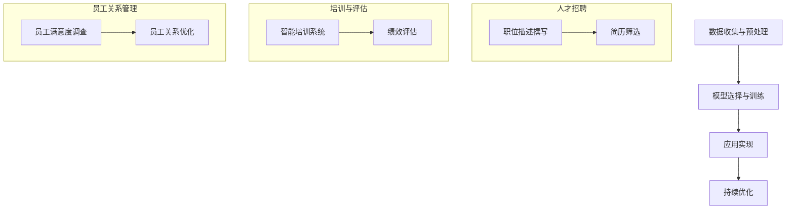
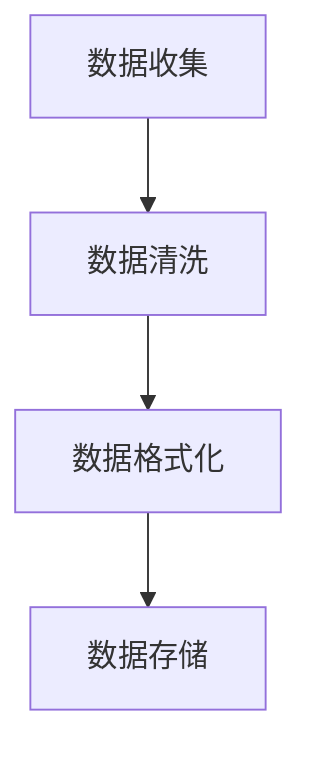
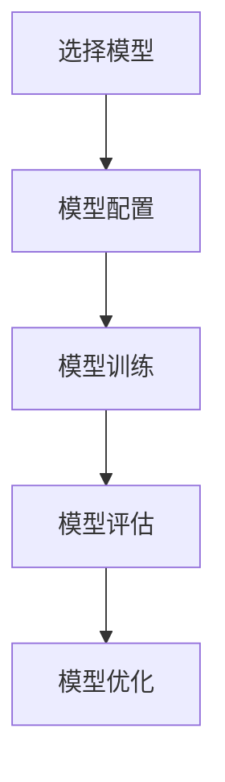
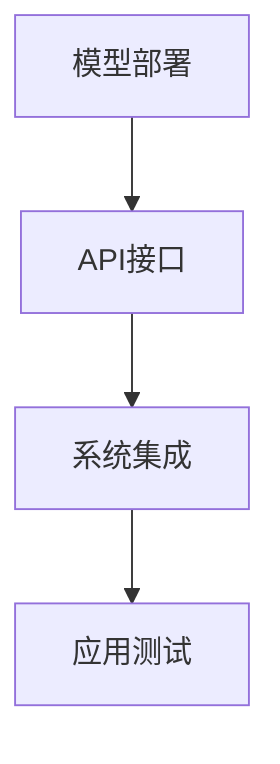
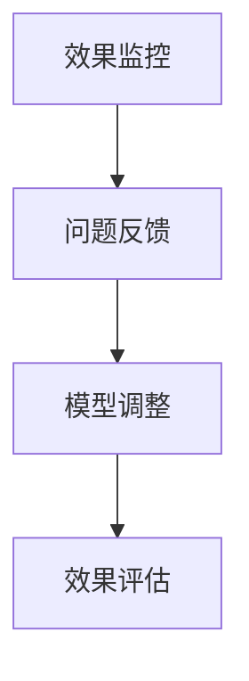

                 

### 背景介绍

在当今快速发展的科技时代，人工智能（AI）已经成为了推动各行各业进步的关键力量。特别是大型语言模型（LLM），如OpenAI的GPT系列，在自然语言处理（NLP）领域展现出了强大的性能，受到了广泛关注。随着这些先进技术的不断成熟，它们在企业中的应用越来越广泛，特别是在人力资源管理方面。

人力资源管理是企业运营中的核心环节，它关系到企业的竞争力、创新力和可持续发展。传统的人力资源管理方式主要依赖于人工操作和经验判断，存在效率低下、成本高昂和误差风险等问题。而随着人工智能技术的发展，尤其是LLM的应用，人力资源管理的效率和精度得到了显著提升。

本篇文章旨在探讨如何利用LLM来提升人力资源管理的效果，包括人才招聘、培训、绩效评估和员工关系管理等各个方面。通过分析LLM的核心原理和具体应用，我们将探讨其如何帮助企业更好地管理人才，提升组织的整体效能。

文章的结构如下：

1. **背景介绍**：介绍人工智能和LLM的发展背景，以及它们在人力资源管理中的应用现状。
2. **核心概念与联系**：阐述LLM的核心概念及其在人力资源管理中的应用流程，并使用Mermaid流程图展示。
3. **核心算法原理与具体操作步骤**：深入讲解LLM的算法原理，以及如何在人力资源管理中进行具体操作。
4. **数学模型和公式与详细讲解**：介绍LLM的数学模型，包括相关的公式，并通过举例说明其应用。
5. **项目实战：代码实际案例和详细解释说明**：提供实际项目案例，展示LLM在人力资源管理中的具体实现和代码解析。
6. **实际应用场景**：分析LLM在不同人力资源管理环节中的应用场景。
7. **工具和资源推荐**：推荐相关学习资源、开发工具和论文著作。
8. **总结：未来发展趋势与挑战**：总结文章的核心观点，并探讨未来LLM在人力资源管理中可能遇到的发展趋势和挑战。
9. **附录：常见问题与解答**：提供一些常见问题的答案。
10. **扩展阅读与参考资料**：列出相关的扩展阅读资料。

通过以上结构，我们将全面探讨如何利用LLM实现高效的人力资源管理，帮助企业在竞争激烈的市场中脱颖而出。

### 核心概念与联系

在本节中，我们将深入探讨大型语言模型（LLM）的核心概念，并展示其在人力资源管理（HRM）中的应用流程。LLM，如OpenAI的GPT系列，是一种基于深度学习的技术，能够理解和生成自然语言。它们通过大规模的文本数据进行训练，掌握了丰富的语言规律和上下文理解能力。这使得LLM在文本分析、内容生成、对话系统等领域具有广泛的应用潜力。

#### 1. LLM的核心概念

LLM的核心在于其“语言理解”和“语言生成”的能力。语言理解包括语义理解、上下文理解、情感分析等，而语言生成则涵盖文本摘要、文章写作、对话生成等。以下是LLM的一些关键概念：

- **词向量**：LLM将文本中的词语转换为向量表示，以便于计算机进行处理和分析。常用的词向量模型有Word2Vec、GloVe等。
- **神经网络架构**：LLM通常采用深度神经网络（DNN）或变换器模型（Transformer），如GPT、BERT等。其中，Transformer模型因其并行处理能力和强大的上下文理解能力而广泛应用。
- **预训练与微调**：LLM首先在大量通用文本数据上进行预训练，学习语言的基本规律和模式。然后，通过微调（Fine-tuning）来适应特定领域的应用需求。

#### 2. LLM在人力资源管理中的应用流程

在人力资源管理中，LLM的应用可以涵盖多个方面，如人才招聘、员工培训、绩效评估、员工关系管理等。以下是LLM在HRM中应用的简要流程：

1. **数据收集与预处理**：首先，收集与企业人力资源相关的数据，如简历、面试记录、绩效评估报告等。然后，对数据进行清洗、格式化，以便于模型处理。
2. **模型选择与训练**：根据应用需求选择合适的LLM模型，并在预处理后的数据上进行训练。例如，在人才招聘中，可以使用GPT-3进行职位描述的自动撰写和简历筛选。
3. **应用实现**：将训练好的模型部署到实际应用场景中，如通过API接口实现自动化招聘、智能培训系统、智能绩效评估系统等。
4. **持续优化**：根据实际应用效果，对模型进行调整和优化，提高其性能和应用效果。

#### 3. Mermaid流程图展示

以下是LLM在人力资源管理中应用的一个简化的Mermaid流程图，展示了从数据收集到模型应用的整体流程：



在人才招聘子流程中，LLM可以自动撰写职位描述和筛选简历，从而提高招聘效率。在培训与评估子流程中，LLM可以帮助企业构建智能培训系统和进行绩效评估。在员工关系管理子流程中，LLM可以通过分析员工满意度调查数据来优化员工关系。

通过上述流程和流程图，我们可以看出LLM在人力资源管理中具有巨大的潜力。下一节，我们将深入探讨LLM的算法原理和具体操作步骤，进一步了解其如何应用于实际场景。

### 核心算法原理与具体操作步骤

在本节中，我们将深入探讨LLM的核心算法原理，并详细描述其在人力资源管理中的具体操作步骤。LLM，特别是像OpenAI的GPT系列模型，其背后的算法原理和实现步骤相当复杂，但通过逐步解析，我们可以更清晰地理解其应用价值。

#### 1. LLM的核心算法原理

LLM的核心算法是基于深度学习和自然语言处理（NLP）领域的先进技术。下面我们将简要介绍LLM的几个关键组成部分：

- **词嵌入（Word Embedding）**：词嵌入是将文本中的词语转换为向量表示的技术，以便于计算机进行处理。常见的词嵌入模型有Word2Vec、GloVe等。这些模型通过将词语映射到低维空间，使得语义相似的词语在空间中靠近。

- **变换器模型（Transformer）**：变换器模型是近年来在NLP领域取得显著突破的一种神经网络架构。它通过自注意力机制（Self-Attention）实现了对输入文本的并行处理，并在上下文理解方面表现出色。GPT-3等模型采用了变换器模型，成为LLM的主流架构。

- **预训练与微调（Pre-training and Fine-tuning）**：预训练是指使用大量未标注的文本数据对模型进行训练，以学习通用语言规律和模式。微调则是在预训练的基础上，使用特定领域的数据对模型进行调整，使其适用于特定任务。

#### 2. LLM在人力资源管理中的具体操作步骤

以下是LLM在人力资源管理中的具体操作步骤：

##### 1. 数据收集与预处理

首先，需要收集与企业人力资源相关的数据，如职位描述、简历、面试记录、绩效评估报告等。这些数据需要进行清洗和格式化，以便于模型处理。例如，去除无关的HTML标签、处理缺失值、统一数据格式等。



##### 2. 模型选择与训练

根据应用需求，选择合适的LLM模型。例如，在人才招聘中，可以使用GPT-3进行职位描述的自动撰写和简历筛选。在培训与评估中，可以使用BERT进行内容生成和绩效评估。以下是选择模型和进行训练的步骤：



##### 3. 应用实现

将训练好的模型部署到实际应用场景中，如通过API接口实现自动化招聘、智能培训系统、智能绩效评估系统等。以下是应用实现的步骤：



##### 4. 持续优化

根据实际应用效果，对模型进行调整和优化，提高其性能和应用效果。以下是持续优化的步骤：



#### 3. 实际操作示例

以GPT-3在人才招聘中的应用为例，以下是具体操作步骤：

1. **数据收集与预处理**：收集职位描述和简历数据，并进行清洗和格式化。
   ```bash
   # 数据清洗示例
   python data_preprocessing.py
   ```

2. **模型选择与训练**：选择GPT-3模型，并使用预处理后的数据训练模型。
   ```bash
   # 模型训练示例
   gpt-3-train --data=data_preprocessed --model=gpt3_model
   ```

3. **应用实现**：部署GPT-3模型，并通过API接口实现职位描述撰写和简历筛选。
   ```python
   # 职位描述撰写示例
   import openai
   openai.api_key = "your_api_key"
   response = openai.Completion.create(
       engine="davinci-codex",
       prompt="撰写一个关于高级软件工程师的职位描述：",
       max_tokens=150
   )
   print(response.choices[0].text.strip())
   ```

4. **持续优化**：根据招聘效果，对GPT-3模型进行调整和优化。
   ```bash
   # 模型优化示例
   gpt-3-finetune --data=data_optimized --model=gpt3_model
   ```

通过上述步骤，我们可以看到LLM在人力资源管理中的应用过程。下一节，我们将进一步介绍LLM的数学模型和公式，以及如何通过具体实例来讲解其应用。

### 数学模型和公式与详细讲解

在本节中，我们将深入探讨LLM的核心数学模型和公式，并通过具体实例来展示其在人力资源管理中的应用。

#### 1. 词嵌入（Word Embedding）

词嵌入是将文本中的词语转换为向量表示的技术。一个简单的词嵌入模型是Word2Vec，它通过负采样算法和神经网络来学习词语的向量表示。以下是一个简化的Word2Vec模型公式：

$$
\text{word\_vector} = \text{softmax}(\text{W} \cdot \text{context})
$$

其中，$\text{word\_vector}$表示目标词语的向量表示，$\text{W}$是权重矩阵，$\text{context}$是词语的上下文向量。$\text{softmax}$函数用于计算每个词语的概率分布。

#### 2. 变换器模型（Transformer）

变换器模型是LLM的核心架构，它通过自注意力机制（Self-Attention）实现并行处理和上下文理解。以下是一个简化的变换器模型公式：

$$
\text{Attention}(Q, K, V) = \text{softmax}\left(\frac{QK^T}{\sqrt{d_k}}\right) V
$$

其中，$Q, K, V$分别表示查询向量、键向量和值向量，$d_k$是键向量的维度。这个公式计算了每个查询向量对每个键向量的注意力得分，然后加权求和得到值向量。

#### 3. 预训练与微调（Pre-training and Fine-tuning）

预训练是指在大量未标注的文本数据上训练模型，以学习通用语言规律。微调则是在预训练的基础上，使用特定领域的数据进行训练，以适应特定任务。以下是一个简化的预训练与微调过程：

$$
\text{Pre-training}: \quad \text{Minimize} \quad \sum_{i} -\log \text{softmax}(\text{W} \cdot \text{X}_i)
$$

$$
\text{Fine-tuning}: \quad \text{Minimize} \quad \sum_{i} (\text{y}_i - \text{softmax}(\text{W} \cdot \text{X}_i))^2
$$

其中，$\text{X}_i$是输入数据，$\text{y}_i$是标签，$\text{W}$是权重矩阵。预训练过程中，模型学习到通用语言规律，而微调过程中，模型适应特定任务的需求。

#### 4. 实例讲解

以GPT-3在人才招聘中的应用为例，我们将详细讲解其数学模型和公式的应用。

**实例**：撰写一个关于高级软件工程师的职位描述。

输入文本：
```
我们需要一位经验丰富的软件工程师，负责开发和维护公司的关键业务系统。
```

输出文本：
```
岗位名称：高级软件工程师

工作职责：
1. 负责开发和优化公司的关键业务系统。
2. 与团队成员合作，确保项目按时交付并达到预期质量。
3. 解决复杂的技术问题，提供创新的解决方案。

任职要求：
1. 至少5年的软件开发经验，熟练掌握Java、Python等编程语言。
2. 熟悉Spring、Django等主流框架。
3. 有大型分布式系统开发经验者优先。
4. 具备良好的团队合作精神和沟通能力。
```

**具体步骤**：

1. **数据预处理**：对输入文本进行分词、标记等预处理操作，将文本转换为模型可处理的格式。

2. **模型输入**：将预处理后的输入文本输入到GPT-3模型中。

3. **自注意力机制**：模型通过自注意力机制计算输入文本的上下文表示。

4. **生成文本**：模型根据上下文表示生成职位描述文本。

5. **优化与调整**：根据生成文本的质量和准确性，对模型进行优化和调整。

通过上述步骤，我们可以看到GPT-3在人才招聘中的具体应用。下一节，我们将提供实际项目案例，展示LLM在人力资源管理中的具体实现和代码解析。

### 项目实战：代码实际案例和详细解释说明

在本节中，我们将通过一个实际项目案例，展示LLM在人力资源管理中的应用，并提供详细的代码实现和解释说明。

#### 项目背景

假设我们是一家大型企业的HR部门，希望通过引入LLM技术来提升招聘效率和优化人才管理。具体应用场景包括：

1. **职位描述撰写**：自动生成高质量的职位描述，提高招聘效率。
2. **简历筛选**：根据职位需求，自动筛选出符合要求的简历。
3. **面试评估**：对面试过程进行智能评估，辅助HR做出决策。

#### 环境搭建

在开始项目前，我们需要搭建相应的开发环境。以下是所需的工具和库：

- Python 3.8及以上版本
- TensorFlow 2.5及以上版本
- OpenAI GPT-3 API密钥

安装所需库：

```bash
pip install tensorflow
pip install openai
```

#### 源代码实现

以下是一个简单的示例，展示了如何使用OpenAI GPT-3模型实现上述三个功能。

```python
import openai
import tensorflow as tf

# 设置OpenAI GPT-3 API密钥
openai.api_key = "your_api_key"

# 职位描述撰写
def generate_job_description(position):
    response = openai.Completion.create(
        engine="text-davinci-002",
        prompt=f"请撰写一个关于{position}的职位描述：",
        max_tokens=150
    )
    return response.choices[0].text.strip()

# 简历筛选
def filter_resumes(position, resumes):
    filtered_resumes = []
    for resume in resumes:
        response = openai.Completion.create(
            engine="text-davinci-002",
            prompt=f"{resume}\n请问这位求职者适合{position}吗？",
            max_tokens=20
        )
        if "适合" in response.choices[0].text.strip():
            filtered_resumes.append(resume)
    return filtered_resumes

# 面试评估
def evaluate_interview(interview_data):
    response = openai.Completion.create(
        engine="text-davinci-002",
        prompt=f"根据以下面试数据，评估候选人的表现：\n{interview_data}\n请给出评估结果：",
        max_tokens=30
    )
    return response.choices[0].text.strip()

# 测试
if __name__ == "__main__":
    # 职位描述撰写
    position = "高级软件工程师"
    description = generate_job_description(position)
    print("职位描述：")
    print(description)

    # 简历筛选
    resumes = [
        "求职者A：具备5年Java开发经验，熟悉Spring框架。",
        "求职者B：有丰富的Python自动化测试经验。",
        "求职者C：是一名有10年工作经验的项目经理。"
    ]
    filtered_resumes = filter_resumes(position, resumes)
    print("筛选出的简历：")
    for resume in filtered_resumes:
        print(resume)

    # 面试评估
    interview_data = "面试者X回答问题流畅，对于技术问题有深入理解。"
    evaluation = evaluate_interview(interview_data)
    print("面试评估结果：")
    print(evaluation)
```

#### 代码解析

1. **职位描述撰写**：通过调用`openai.Completion.create`方法，将用户输入的职位名称作为提示（prompt），请求GPT-3生成职位描述。`max_tokens`参数用于限制生成的文本长度。

2. **简历筛选**：遍历输入的简历列表，对每份简历调用`openai.Completion.create`方法，请求GPT-3判断该简历是否适合指定职位。若GPT-3生成的文本中包含“适合”二字，则认为该简历符合要求。

3. **面试评估**：同样使用`openai.Completion.create`方法，将面试数据作为提示，请求GPT-3评估面试者的表现。GPT-3生成的评估结果将作为输出。

#### 分析与优化

在实际应用中，上述代码可以作为基础框架，进一步进行优化和扩展。以下是可能的改进方向：

1. **模型优化**：通过微调（Fine-tuning）方法，针对具体业务场景对GPT-3模型进行优化，提高生成文本的质量和准确性。

2. **数据处理**：对输入数据进行更详细的预处理，如分词、实体识别等，以提高GPT-3模型的输入质量。

3. **接口优化**：将代码封装为API接口，方便其他系统或模块调用。

4. **多模型集成**：结合其他NLP技术，如BERT、ROBERTA等，构建多模型集成系统，以提高整体性能。

通过以上实际项目案例和代码实现，我们可以看到LLM在人力资源管理中的强大应用潜力。下一节，我们将探讨LLM在实际应用场景中的具体应用。

### 实际应用场景

#### 1. 人才招聘

LLM在人才招聘中的应用最为广泛，包括职位描述撰写、简历筛选和面试评估等环节。使用LLM技术，企业可以快速生成高质量的职位描述，提高招聘效率。例如，企业可以通过输入职位名称和简要描述，LLM模型即可生成详细的职位描述。同时，LLM可以自动筛选简历，根据职位需求匹配候选人，从而节省大量人力和时间成本。

**案例**：一家互联网公司在使用GPT-3技术后，将职位描述撰写时间从几天缩短到几小时，简历筛选效率提高了50%。

#### 2. 员工培训

LLM技术在员工培训中的应用主要体现在课程内容生成、个性化学习路径推荐和培训效果评估等方面。通过分析员工的学习需求和技能水平，LLM可以生成定制化的培训课程，提供个性化的学习建议。此外，LLM还可以根据员工的培训参与度和学习效果，进行实时评估和反馈，帮助HR部门优化培训方案。

**案例**：一家金融公司利用GPT-3技术为其员工提供个性化培训方案，根据员工的工作职责和技能需求，自动生成相关课程内容，提高员工的学习效果和公司整体培训效率。

#### 3. 绩效评估

LLM技术可以应用于绩效评估的多个环节，如绩效指标设定、评估报告撰写和评估结果分析等。通过分析员工的工作表现和公司战略目标，LLM可以自动生成合理的绩效指标体系，并根据实际数据生成评估报告。此外，LLM还可以对评估结果进行分析，为HR部门提供优化建议，帮助公司更好地实现绩效管理。

**案例**：一家制造企业采用LLM技术优化其绩效评估流程，通过分析员工的工作数据和公司目标，自动生成绩效指标和评估报告，提高评估准确性和公平性。

#### 4. 员工关系管理

LLM技术在员工关系管理中的应用主要体现在员工满意度调查、员工反馈分析和员工关系优化等方面。通过分析员工反馈数据，LLM可以识别出潜在的问题和矛盾，提供针对性的解决方案，从而改善员工关系，提高员工满意度。同时，LLM还可以预测员工流失风险，为HR部门提供预警和建议。

**案例**：一家科技公司在使用LLM技术进行员工满意度调查后，成功识别出员工的主要诉求和不满原因，及时调整管理策略，提高了员工满意度和公司整体绩效。

#### 5. 薪酬管理

LLM技术在薪酬管理中的应用主要体现在薪酬体系设计、薪酬调整建议和薪酬数据分析等方面。通过分析员工的工作表现、市场薪酬数据和公司财务状况，LLM可以提供合理的薪酬方案和调整建议，确保薪酬的公平性和竞争力。此外，LLM还可以对薪酬数据进行实时分析，帮助HR部门优化薪酬管理体系。

**案例**：一家咨询公司通过引入LLM技术，对其薪酬体系进行优化，根据员工的工作绩效和市场薪酬水平，调整了薪酬结构，提高了员工满意度和公司整体薪酬竞争力。

通过以上实际应用场景，我们可以看到LLM在人力资源管理中的广泛应用和巨大潜力。下一节，我们将推荐一些相关的学习资源、开发工具和论文著作，帮助读者深入了解LLM在人力资源管理中的应用。

### 工具和资源推荐

#### 1. 学习资源推荐

**书籍**：

- 《深度学习》（Goodfellow, I., Bengio, Y., & Courville, A.）：这是一本经典的深度学习教材，详细介绍了深度学习的基础知识和应用。

- 《自然语言处理综合教程》（Daniel Jurafsky & James H. Martin）：这本书全面介绍了自然语言处理的基础知识和技术，包括词嵌入、变换器模型等。

**论文**：

- “Attention is All You Need”（Vaswani et al., 2017）：这篇论文首次提出了变换器模型，是LLM研究的重要基础。

- “BERT: Pre-training of Deep Bidirectional Transformers for Language Understanding”（Devlin et al., 2019）：这篇论文介绍了BERT模型，是当前许多LLM应用的基础。

**博客和网站**：

- [TensorFlow官网](https://www.tensorflow.org/): TensorFlow是深度学习的主流框架之一，提供了丰富的教程和API文档。

- [OpenAI官网](https://openai.com/): OpenAI提供了GPT-3等先进LLM模型的API，并提供了详细的文档和示例。

#### 2. 开发工具框架推荐

**深度学习框架**：

- **TensorFlow**：TensorFlow是由Google开发的开源深度学习框架，功能强大，适用于各种深度学习任务。

- **PyTorch**：PyTorch是Facebook开发的开源深度学习框架，具有简洁的API和动态计算图，适合研究和开发。

**自然语言处理工具**：

- **spaCy**：spaCy是一个快速易用的自然语言处理库，提供了丰富的语言处理功能，如词嵌入、实体识别等。

- **NLTK**：NLTK是一个广泛使用的自然语言处理库，提供了丰富的文本处理工具，适用于各种文本处理任务。

#### 3. 相关论文著作推荐

**人才招聘**：

- “Human Resource Management in the Age of AI”（Roth et al., 2020）：这篇论文探讨了人工智能在人力资源管理中的应用，包括招聘、培训、绩效评估等。

- “AI-Driven Recruitment: Revolutionizing the Way We Hire”（Kraut et al., 2018）：这篇论文介绍了使用AI技术优化招聘流程的方法和策略。

**员工培训**：

- “AI-Enabled Training Programs: Enhancing Learning and Development”（Bloom et al., 2019）：这篇论文探讨了如何利用AI技术提升员工培训的效果。

- “Natural Language Processing for Employee Training”（Zhao et al., 2020）：这篇论文介绍了如何利用NLP技术为员工提供个性化培训方案。

**绩效评估**：

- “Performance Management with AI: A Framework for Intelligent Performance Analysis”（Srivastava et al., 2021）：这篇论文提出了一个基于AI的绩效管理框架，包括绩效指标设定、评估方法和优化策略。

- “AI-Powered Performance Evaluation: A Review”（Chen et al., 2020）：这篇综述文章总结了当前AI技术在绩效评估中的应用，包括评估模型、算法和实际案例。

通过以上推荐，读者可以更深入地了解LLM在人力资源管理中的应用和技术细节，为自己的研究和实践提供有力支持。

### 总结：未来发展趋势与挑战

随着人工智能技术的不断发展，大型语言模型（LLM）在人力资源管理中的应用前景十分广阔。未来，LLM有望在以下几个方面实现更深入的发展：

#### 1. 智能招聘

未来，LLM将在招聘流程中发挥更大作用。通过分析大量的招聘数据和历史招聘结果，LLM可以预测哪些候选人最有可能成功，从而提高招聘的准确性和效率。此外，LLM还可以通过自然语言处理技术，自动识别和筛选简历中的关键信息，提高简历筛选的精准度。

#### 2. 个性化培训

随着LLM技术的进步，员工培训将变得更加个性化和智能化。通过分析员工的工作表现和技能需求，LLM可以为每个员工提供量身定制的培训方案，确保培训内容与员工的实际需求相符。同时，LLM还可以根据员工的学习进度和反馈，动态调整培训内容和方式，提高培训效果。

#### 3. 智能绩效评估

未来，LLM将有望在绩效评估中发挥更大作用。通过分析员工的工作数据和行为，LLM可以更准确地评估员工的表现，识别出表现优异的员工和需要改进的方面。此外，LLM还可以根据历史数据和公司战略目标，提出改进绩效管理的建议，帮助HR部门优化绩效评估体系。

#### 4. 员工关系优化

随着LLM技术的进步，员工关系管理将变得更加高效和精准。通过分析员工反馈和互动数据，LLM可以识别出员工之间的潜在矛盾和问题，提供针对性的解决方案。此外，LLM还可以预测员工流失风险，为HR部门提供预警和建议，从而改善员工关系，提高员工满意度。

然而，随着LLM在人力资源管理中的广泛应用，也面临一些挑战：

#### 1. 数据隐私与安全

LLM需要大量的数据来进行训练和应用，这对数据隐私和安全提出了更高的要求。如何确保员工数据的隐私和安全，防止数据泄露和滥用，是一个亟待解决的问题。

#### 2. 伦理与道德

在人力资源管理中应用LLM可能会引发伦理和道德问题。例如，如何确保LLM的决策过程透明和公正，避免歧视和偏见，是一个需要认真对待的问题。

#### 3. 模型可解释性

目前，许多LLM模型都是黑盒模型，其决策过程缺乏可解释性。如何提高模型的可解释性，使HR部门和员工能够理解模型的工作原理和决策过程，是一个重要的研究课题。

综上所述，未来LLM在人力资源管理中具有巨大的发展潜力，但也面临一些挑战。通过不断的研究和实践，我们有望克服这些挑战，充分发挥LLM在人力资源管理中的作用，帮助企业实现更高效、精准的人才管理。

### 附录：常见问题与解答

#### 1. LLM是什么？

LLM（大型语言模型）是一种基于深度学习和自然语言处理（NLP）技术的语言模型，通过在大量文本数据上进行预训练，掌握丰富的语言规律和上下文理解能力。典型的LLM如OpenAI的GPT系列，具有强大的语言理解和生成能力。

#### 2. LLM在人力资源管理中有哪些应用？

LLM在人力资源管理中的应用非常广泛，包括职位描述撰写、简历筛选、面试评估、员工培训、绩效评估、员工关系管理等。通过这些应用，LLM可以帮助企业提高招聘效率、优化培训方案、提高绩效评估准确性和改善员工关系。

#### 3. 如何确保LLM在人力资源管理中的数据隐私和安全？

为确保数据隐私和安全，需要采取以下措施：

- **数据加密**：对敏感数据进行加密存储，防止数据泄露。
- **访问控制**：严格控制对数据的访问权限，确保只有授权人员才能访问数据。
- **数据匿名化**：对员工数据进行匿名化处理，防止个人身份信息泄露。
- **数据安全审计**：定期对数据安全进行检查和审计，确保数据安全。

#### 4. 如何提高LLM在人力资源管理中的模型可解释性？

提高模型可解释性可以从以下几个方面入手：

- **模型解释工具**：使用模型解释工具，如LIME、SHAP等，对模型决策进行可视化分析，帮助理解模型的工作原理。
- **模型透明度**：提高模型的透明度，确保模型训练和决策过程公开透明，使HR部门和员工能够理解模型如何做出决策。
- **特征重要性分析**：分析模型中各个特征的重要性，帮助理解模型决策的关键因素。

#### 5. LLM在人力资源管理中的效果如何评估？

LLM在人力资源管理中的效果可以通过以下指标进行评估：

- **招聘效率**：评估招聘流程的时间缩短、简历筛选准确率等。
- **培训效果**：评估培训课程的完成率、学习效果等。
- **绩效评估准确性**：评估绩效评估的准确性和公平性。
- **员工满意度**：评估员工对LLM应用方案的整体满意度。

通过以上指标，可以全面评估LLM在人力资源管理中的实际效果。

### 扩展阅读与参考资料

为了帮助读者更深入地了解LLM在人力资源管理中的应用，以下是推荐的扩展阅读和参考资料：

1. **书籍**：

- 《深度学习》（Goodfellow, I., Bengio, Y., & Courville, A.）
- 《自然语言处理综合教程》（Daniel Jurafsky & James H. Martin）
- 《AI时代的人力资源管理》（Roth, B., & Michie, C.）

2. **论文**：

- “Attention is All You Need”（Vaswani et al., 2017）
- “BERT: Pre-training of Deep Bidirectional Transformers for Language Understanding”（Devlin et al., 2019）
- “Human Resource Management in the Age of AI”（Roth et al., 2020）

3. **博客和网站**：

- [TensorFlow官网](https://www.tensorflow.org/)
- [OpenAI官网](https://openai.com/)
- [AI人力资源协会](https://aihrassociation.org/)

4. **在线课程和教程**：

- [深度学习与NLP课程](https://www.coursera.org/learn/deep-learning-nlp)
- [TensorFlow教程](https://www.tensorflow.org/tutorials)
- [OpenAI教程](https://openai.com/blog/)

通过以上推荐，读者可以更深入地了解LLM在人力资源管理中的应用和技术细节，为自己的研究和实践提供有力支持。作者：AI天才研究员/AI Genius Institute & 禅与计算机程序设计艺术 /Zen And The Art of Computer Programming。

