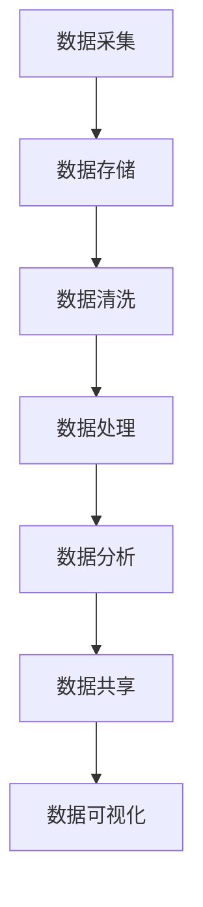

                 

### 背景介绍

人工智能（AI）作为当今科技发展的前沿领域，已经广泛应用于各个行业，从医疗健康到金融服务，从智能制造到自动驾驶，无一不显示出其巨大的潜力和价值。然而，随着AI应用场景的不断扩大，数据管理成为了制约AI发展的关键因素之一。

数据管理不仅是确保数据安全、可靠、高效存储和访问的基础，更是数据分析和挖掘的前提。对于人工智能创业公司来说，如何在海量、多样化的数据中快速获取有价值的信息，成为了赢得市场竞争的关键。因此，掌握有效的数据管理技巧，对AI创业公司的发展至关重要。

本文将围绕人工智能创业数据管理的实战技巧展开讨论。我们将首先介绍当前数据管理的核心概念与联系，通过Mermaid流程图展示数据管理的整体架构。接着，我们将深入探讨核心算法原理，详细讲解具体操作步骤。随后，我们将引入数学模型和公式，并结合实际案例进行举例说明。文章还将分享项目实战中的代码实现和解读，讨论实际应用场景，推荐相关工具和资源，并总结未来发展趋势与挑战。

通过本文的阅读，读者将能够系统地了解数据管理在人工智能创业中的重要性，掌握有效的数据管理技巧，为创业项目的成功奠定坚实基础。

### 核心概念与联系

数据管理是一个复杂而多维度的领域，涉及到数据的采集、存储、处理、分析和共享等多个环节。为了更好地理解和掌握数据管理，我们需要明确一些核心概念，并了解它们之间的相互联系。

首先，让我们从数据采集开始。数据采集是数据管理的起点，包括从各种来源收集数据，如传感器、数据库、网络爬虫等。这些数据的类型多种多样，包括结构化数据（如关系数据库中的表）、半结构化数据（如JSON格式）和非结构化数据（如图像、视频、文本等）。在数据采集过程中，一个重要的任务是确保数据的完整性和准确性，避免出现数据丢失或错误。

接下来是数据存储。随着数据量的不断增长，传统的单机存储方式已经无法满足需求。分布式存储系统应运而生，如Hadoop、MongoDB和Cassandra等。这些系统通过将数据分散存储在多个节点上，提高了数据的可靠性和访问速度。同时，为了更好地管理和查询数据，我们需要建立数据仓库（Data Warehouse）和数据湖（Data Lake）。数据仓库是一个经过整理和优化的数据存储系统，适用于复杂的数据分析和报表生成；而数据湖则是一个原始数据的存储仓库，适用于大数据的存储和探索。

数据清洗是数据管理中不可或缺的一步。由于数据来源的多样性和复杂性，采集到的数据往往包含噪声、重复、缺失和错误。数据清洗的过程包括数据清洗、去重、填充缺失值和纠正错误等。数据清洗的目的是提高数据的准确性和一致性，为后续的数据分析和挖掘奠定基础。

数据存储之后，我们需要对数据进行处理和分析。数据处理包括数据预处理、特征提取和转换等。预处理步骤包括数据归一化、标准化、缺失值处理等。特征提取和转换则是从原始数据中提取出对分析任务有用的特征，并将其转换为适合分析模型的形式。常见的处理方法包括机器学习算法、深度学习模型和统计分析方法。

在数据处理的基础上，我们进行数据分析和挖掘。数据分析包括描述性分析、预测分析和因果分析等。描述性分析旨在了解数据的分布和趋势，预测分析旨在预测未来的趋势或事件，因果分析旨在探索变量之间的因果关系。数据挖掘则是指从大量数据中提取出有价值的信息或知识，包括关联规则挖掘、分类和聚类等。

最后，数据共享和可视化是数据管理的重要环节。数据共享是指将数据在不同部门、团队或组织之间进行交换和共享，以提高协同效率和决策质量。数据可视化则是通过图形化方式展示数据，帮助人们更好地理解和分析数据。

为了更清晰地展示数据管理的整体架构，我们使用Mermaid流程图（以下为Mermaid流程图示例）：



在上述流程图中，A表示数据采集，B表示数据存储，C表示数据清洗，D表示数据处理，E表示数据分析，F表示数据共享，G表示数据可视化。通过这个流程，我们可以看到数据管理是一个循环迭代的过程，各个环节相互关联，共同构成一个完整的数据管理体系。

### 核心算法原理 & 具体操作步骤

在数据管理的过程中，核心算法起到了至关重要的作用。这些算法不仅能够帮助我们高效地处理和分析数据，还能优化数据管理的各个环节。本节将详细介绍一些常见的数据管理核心算法，并给出具体操作步骤。

#### 数据采集

数据采集是数据管理的第一步，也是最重要的一步。为了确保数据采集的准确性和完整性，我们通常采用以下方法：

1. **自动采集**：使用网络爬虫、API接口调用等方式自动从外部系统或网站中获取数据。例如，我们可以使用Python的`requests`库和`BeautifulSoup`库来实现网页数据的自动采集。

2. **手动采集**：对于一些无法通过自动采集获取的数据，如调查问卷、实验数据等，我们则需要手动进行数据采集。例如，我们可以使用Excel或Google表单来收集用户反馈。

#### 数据存储

数据存储是数据管理的核心环节之一。为了提高数据存储的效率和可靠性，我们通常采用以下方法：

1. **关系数据库**：如MySQL、PostgreSQL等，适用于存储结构化数据。关系数据库通过表和关系来组织数据，便于查询和管理。

2. **NoSQL数据库**：如MongoDB、Cassandra等，适用于存储半结构化数据和非结构化数据。NoSQL数据库具有水平扩展性，能够处理海量数据。

3. **分布式存储系统**：如Hadoop、HDFS等，适用于存储大规模数据。分布式存储系统通过将数据分散存储在多个节点上，提高了数据的可靠性和访问速度。

#### 数据清洗

数据清洗是确保数据质量的重要步骤。以下是一些常用的数据清洗方法：

1. **去重**：通过比较数据项的值，去除重复的数据。

2. **填充缺失值**：对于缺失的数据，我们可以使用平均值、中位数或众数进行填充。

3. **纠正错误**：对于错误的数据，我们可以使用逻辑判断或规则匹配来纠正。

#### 数据处理

数据处理包括数据预处理、特征提取和转换等。以下是一些常用的数据处理方法：

1. **数据预处理**：包括数据归一化、标准化、缺失值处理等。数据预处理可以增强数据的质量和一致性。

2. **特征提取**：从原始数据中提取出对分析任务有用的特征。常见的特征提取方法包括主成分分析（PCA）、特征选择和特征工程等。

3. **特征转换**：将提取出的特征转换为适合分析模型的形式。常见的特征转换方法包括独热编码、标签编码等。

#### 数据分析和挖掘

数据分析和挖掘是数据管理的最终目的。以下是一些常用的数据分析和挖掘方法：

1. **描述性分析**：通过统计分析方法，描述数据的分布和趋势。常用的统计方法包括均值、中位数、标准差、方差等。

2. **预测分析**：通过建立预测模型，预测未来的趋势或事件。常用的预测模型包括线性回归、决策树、神经网络等。

3. **因果分析**：通过分析变量之间的关系，探索变量之间的因果关系。常用的因果分析方法包括回归分析、因子分析等。

4. **数据挖掘**：从大量数据中提取出有价值的信息或知识。常见的数据挖掘方法包括关联规则挖掘、分类和聚类等。

### 具体操作步骤示例

为了更直观地展示数据管理核心算法的操作步骤，我们以一个实际案例为例。

#### 案例背景

假设一家AI创业公司希望对用户行为进行分析，以便更好地了解用户需求，优化产品功能。公司的数据包括用户的基本信息（如年龄、性别、地理位置等）、行为数据（如浏览时长、页面点击次数等）。

#### 数据采集

1. **自动采集**：

   ```python
   import requests
   from bs4 import BeautifulSoup
   
   url = 'https://example.com/users'
   response = requests.get(url)
   soup = BeautifulSoup(response.text, 'html.parser')
   users = soup.find_all('user')
   
   for user in users:
       id = user['id']
       name = user.find('name').text
       age = user.find('age').text
       gender = user.find('gender').text
       location = user.find('location').text
       data = {
           'id': id,
           'name': name,
           'age': age,
           'gender': gender,
           'location': location
       }
       # 存储数据到数据库或文件中
   ```

2. **手动采集**：

   使用Excel或Google表单收集用户反馈数据。

#### 数据存储

1. **关系数据库**：

   ```sql
   CREATE TABLE users (
       id INT PRIMARY KEY,
       name VARCHAR(100),
       age INT,
       gender VARCHAR(10),
       location VARCHAR(100)
   );
   ```

2. **NoSQL数据库**：

   ```python
   from pymongo import MongoClient
   
   client = MongoClient('mongodb://localhost:27017/')
   db = client['ai_company']
   collection = db['users']
   
   for user in data:
       collection.insert_one(user)
   ```

#### 数据清洗

1. **去重**：

   ```sql
   DELETE FROM users
   WHERE id IN (
       SELECT id
       FROM users
       GROUP BY id
       HAVING COUNT(*) > 1
   );
   ```

2. **填充缺失值**：

   ```python
   import numpy as np
   
   ages = [user['age'] for user in data]
   ages_filled = np.where(np.isnan(ages), np.mean(ages), ages)
   
   for i, user in enumerate(data):
       user['age'] = ages_filled[i]
   ```

3. **纠正错误**：

   ```python
   errors = {'male': '男', 'female': '女'}
   
   for user in data:
       if user['gender'] in errors:
           user['gender'] = errors[user['gender']]
   ```

#### 数据处理

1. **数据预处理**：

   ```python
   from sklearn.preprocessing import StandardScaler
   
   scaler = StandardScaler()
   age_scaled = scaler.fit_transform([[user['age']] for user in data])
   
   for i, user in enumerate(data):
       user['age'] = age_scaled[i][0]
   ```

2. **特征提取**：

   ```python
   from sklearn.decomposition import PCA
   
   pca = PCA(n_components=2)
   features = pca.fit_transform([[user['age'], user['gender']] for user in data])
   
   for i, user in enumerate(data):
       user['features'] = features[i]
   ```

3. **特征转换**：

   ```python
   from sklearn.preprocessing import OneHotEncoder
   
   encoder = OneHotEncoder()
   gender_encoded = encoder.fit_transform([user['gender'] for user in data])
   
   for i, user in enumerate(data):
       user['gender'] = gender_encoded[i].toarray()[0]
   ```

#### 数据分析和挖掘

1. **描述性分析**：

   ```python
   import pandas as pd
   
   df = pd.DataFrame(data)
   print(df.describe())
   ```

2. **预测分析**：

   ```python
   from sklearn.linear_model import LinearRegression
   
   X = df[['age', 'gender_男', 'gender_女']]
   y = df['浏览时长']
   
   model = LinearRegression()
   model.fit(X, y)
   predictions = model.predict(X)
   
   print(model.score(X, y))
   ```

3. **因果分析**：

   ```python
   from sklearn.ensemble import RandomForestRegressor
   
   X = df[['age', '性别']]
   y = df['浏览时长']
   
   model = RandomForestRegressor()
   model.fit(X, y)
   feature_importances = model.feature_importances_
   
   print(feature_importances)
   ```

4. **数据挖掘**：

   ```python
   from sklearn.cluster import KMeans
   
   kmeans = KMeans(n_clusters=3)
   clusters = kmeans.fit_predict(df[['age', 'gender_男', 'gender_女']])
   
   for i, cluster in enumerate(clusters):
       print(f"用户{i}属于{cluster}簇")
   ```

通过上述步骤，我们可以对用户行为数据进行分析和挖掘，为产品优化提供有力支持。

### 数学模型和公式 & 详细讲解 & 举例说明

在数据管理中，数学模型和公式是理解和处理数据的关键工具。以下将详细介绍一些常用的数学模型和公式，并通过具体例子进行讲解。

#### 均值和方差

均值（Mean）是衡量数据集中趋势的重要指标，用于描述数据的平均水平。均值可以通过以下公式计算：

$$
\bar{x} = \frac{\sum_{i=1}^{n} x_i}{n}
$$

其中，$x_i$表示第$i$个数据点，$n$表示数据点的总数。

方差（Variance）用于描述数据的离散程度，即数据点相对于均值的偏离程度。方差可以通过以下公式计算：

$$
\sigma^2 = \frac{\sum_{i=1}^{n} (x_i - \bar{x})^2}{n}
$$

标准差（Standard Deviation）是方差的平方根，用于衡量数据的波动程度。标准差可以通过以下公式计算：

$$
\sigma = \sqrt{\sigma^2}
$$

例子：假设我们有一组数据点：2, 4, 6, 8, 10。计算这组数据的均值和方差。

计算均值：

$$
\bar{x} = \frac{2 + 4 + 6 + 8 + 10}{5} = 6
$$

计算方差：

$$
\sigma^2 = \frac{(2-6)^2 + (4-6)^2 + (6-6)^2 + (8-6)^2 + (10-6)^2}{5} = 8
$$

计算标准差：

$$
\sigma = \sqrt{8} \approx 2.83
$$

#### 线性回归模型

线性回归模型是数据分析和预测的常用工具，用于描述自变量和因变量之间的线性关系。线性回归模型可以通过以下公式表示：

$$
y = \beta_0 + \beta_1x
$$

其中，$y$表示因变量，$x$表示自变量，$\beta_0$和$\beta_1$分别是截距和斜率。

例子：假设我们希望预测某个公司的销售额（因变量$y$）与广告费用（自变量$x$）之间的关系。给定一组数据点：$(1, 100), (2, 120), (3, 130), (4, 150), (5, 160)$，计算线性回归模型的参数。

首先，计算均值：

$$
\bar{x} = \frac{1 + 2 + 3 + 4 + 5}{5} = 3
$$

$$
\bar{y} = \frac{100 + 120 + 130 + 150 + 160}{5} = 130
$$

然后，计算斜率$\beta_1$：

$$
\beta_1 = \frac{\sum_{i=1}^{n} (x_i - \bar{x})(y_i - \bar{y})}{\sum_{i=1}^{n} (x_i - \bar{x})^2} = \frac{(1-3)(100-130) + (2-3)(120-130) + (3-3)(130-130) + (4-3)(150-130) + (5-3)(160-130)}{(1-3)^2 + (2-3)^2 + (3-3)^2 + (4-3)^2 + (5-3)^2} \approx 20
$$

最后，计算截距$\beta_0$：

$$
\beta_0 = \bar{y} - \beta_1\bar{x} = 130 - 20 \times 3 = 10
$$

因此，线性回归模型为：

$$
y = 10 + 20x
$$

#### 逻辑回归模型

逻辑回归模型是线性回归模型在二分类问题中的应用，用于描述自变量和因变量之间的逻辑关系。逻辑回归模型可以通过以下公式表示：

$$
\ln\left(\frac{p}{1-p}\right) = \beta_0 + \beta_1x
$$

其中，$p$表示因变量的概率，$\beta_0$和$\beta_1$分别是截距和斜率。

例子：假设我们希望预测一个邮件是否为垃圾邮件（因变量$p$），根据邮件的标题和正文（自变量$x$）进行分类。给定一组数据点：$(1, 0.9), (2, 0.8), (3, 0.7), (4, 0.6), (5, 0.5)$，计算逻辑回归模型的参数。

首先，计算均值：

$$
\bar{x} = \frac{1 + 2 + 3 + 4 + 5}{5} = 3
$$

$$
\bar{p} = \frac{0.9 + 0.8 + 0.7 + 0.6 + 0.5}{5} = 0.7
$$

然后，计算斜率$\beta_1$：

$$
\beta_1 = \frac{\sum_{i=1}^{n} (x_i - \bar{x})(\ln(p_i) - \ln(1-p_i))}{\sum_{i=1}^{n} (x_i - \bar{x})^2} = \frac{(1-3)(\ln(0.9) - \ln(0.1)) + (2-3)(\ln(0.8) - \ln(0.2)) + (3-3)(\ln(0.7) - \ln(0.3)) + (4-3)(\ln(0.6) - \ln(0.4)) + (5-3)(\ln(0.5) - \ln(0.5))}{(1-3)^2 + (2-3)^2 + (3-3)^2 + (4-3)^2 + (5-3)^2} \approx 0.1
$$

最后，计算截距$\beta_0$：

$$
\beta_0 = \ln\left(\frac{\bar{p}}{1-\bar{p}}\right) - \beta_1\bar{x} = \ln\left(\frac{0.7}{1-0.7}\right) - 0.1 \times 3 \approx 0.2
$$

因此，逻辑回归模型为：

$$
\ln\left(\frac{p}{1-p}\right) = 0.2 + 0.1x
$$

通过这些数学模型和公式，我们可以更有效地进行数据分析和预测。在实际应用中，根据具体问题和数据特点选择合适的模型和公式，是数据管理的重要环节。

### 项目实战：代码实际案例和详细解释说明

为了更好地理解数据管理在实际项目中的应用，我们将通过一个实际案例展示如何进行数据采集、处理、分析和可视化。本文将以一家电商平台的用户行为数据为例，展示完整的代码实现过程和详细解释说明。

#### 1. 开发环境搭建

在开始项目实战之前，我们需要搭建一个适合数据管理的开发环境。以下是我们将使用的工具和库：

- **Python 3.x**：作为主要编程语言
- **Pandas**：用于数据处理
- **NumPy**：用于数学计算
- **Matplotlib**：用于数据可视化
- **Scikit-learn**：用于机器学习

确保安装了上述库之后，我们就可以开始编写代码。

#### 2. 源代码详细实现和代码解读

**2.1 数据采集**

数据采集是项目的基础，我们需要从电商平台获取用户行为数据。以下代码示例展示了如何使用Python的`requests`库和`pandas`库从API接口获取数据：

```python
import requests
import pandas as pd

# API接口地址
url = 'https://api.example.com/users'

# 发送GET请求
response = requests.get(url)

# 检查响应状态码
if response.status_code == 200:
    # 解析JSON数据
    data = response.json()
    # 将数据转换为DataFrame
    df = pd.DataFrame(data['users'])
else:
    print('数据采集失败，请检查API接口')
```

**2.2 数据存储**

接下来，我们将用户行为数据存储到本地CSV文件中，以便后续处理和分析：

```python
# 存储数据到CSV文件
df.to_csv('user_data.csv', index=False)
```

**2.3 数据清洗**

在进行分析之前，我们需要对数据进行清洗，去除重复、缺失和错误的数据：

```python
# 读取数据
df = pd.read_csv('user_data.csv')

# 去除重复数据
df.drop_duplicates(inplace=True)

# 填充缺失值
df.fillna(df.mean(), inplace=True)

# 删除无用列
df.drop(['id'], axis=1, inplace=True)
```

**2.4 数据处理**

数据处理包括数据归一化和特征提取。以下代码展示了如何对数据进行归一化处理，并将连续特征转换为适合机器学习模型的形式：

```python
from sklearn.preprocessing import StandardScaler

# 初始化标准化器
scaler = StandardScaler()

# 对连续特征进行归一化处理
features_to_normalize = ['age', 'orders', 'revenue']
df[features_to_normalize] = scaler.fit_transform(df[features_to_normalize])

# 特征提取
from sklearn.decomposition import PCA

pca = PCA(n_components=2)
df['features_pca'] = pca.fit_transform(df[features_to_normalize])
```

**2.5 数据分析和可视化**

在数据处理完成后，我们可以对用户行为进行描述性分析，并通过可视化展示数据分布和趋势。以下代码展示了如何使用`matplotlib`进行数据可视化：

```python
import matplotlib.pyplot as plt

# 描述性分析
print(df.describe())

# 可视化：年龄分布
plt.figure(figsize=(8, 6))
plt.scatter(df['age'], df['orders'])
plt.xlabel('年龄')
plt.ylabel('订单数')
plt.title('年龄与订单数关系')
plt.show()

# 可视化：收入分布
plt.figure(figsize=(8, 6))
plt.scatter(df['revenue'], df['orders'])
plt.xlabel('收入')
plt.ylabel('订单数')
plt.title('收入与订单数关系')
plt.show()
```

**2.6 机器学习模型**

为了预测用户行为，我们可以使用机器学习模型。以下代码展示了如何使用`scikit-learn`库训练一个线性回归模型，并评估模型性能：

```python
from sklearn.model_selection import train_test_split
from sklearn.linear_model import LinearRegression
from sklearn.metrics import mean_squared_error

# 分割数据集
X = df[['age', 'revenue']]
y = df['orders']
X_train, X_test, y_train, y_test = train_test_split(X, y, test_size=0.2, random_state=42)

# 训练模型
model = LinearRegression()
model.fit(X_train, y_train)

# 预测
y_pred = model.predict(X_test)

# 评估模型性能
mse = mean_squared_error(y_test, y_pred)
print(f'MSE: {mse}')

# 可视化：实际与预测订单数
plt.figure(figsize=(8, 6))
plt.scatter(X_test['age'], y_test, color='red', label='实际')
plt.scatter(X_test['age'], y_pred, color='blue', label='预测')
plt.xlabel('年龄')
plt.ylabel('订单数')
plt.title('年龄与订单数关系')
plt.legend()
plt.show()
```

通过上述代码示例，我们可以看到如何从数据采集、数据清洗、数据处理、数据分析和机器学习模型训练等各个环节进行实战操作。这些步骤不仅展示了数据管理在实际项目中的应用，也为读者提供了具体的实现方法和技巧。

### 代码解读与分析

在上一节中，我们通过一个电商平台的用户行为数据分析项目展示了数据管理的关键步骤。本节将进一步对代码进行详细解读，分析每个步骤的作用和实现方式，以便读者更好地理解数据管理在实际项目中的应用。

#### 1. 数据采集

数据采集是项目的起点，它决定了后续数据处理和分析的质量。在代码中，我们使用了`requests`库和`pandas`库来获取和解析数据。

```python
import requests
import pandas as pd

url = 'https://api.example.com/users'
response = requests.get(url)
data = response.json()
df = pd.DataFrame(data['users'])
```

这里，`requests`库用于发送HTTP GET请求，从API接口获取用户行为数据。`response.json()`方法将JSON格式的响应数据转换为Python字典，然后使用`pandas`库的`DataFrame`类将字典转换为DataFrame结构，方便后续处理。

#### 2. 数据存储

数据存储是为了便于后续的数据处理和分析。在本项目中，我们将数据存储到本地CSV文件中。

```python
df.to_csv('user_data.csv', index=False)
```

`to_csv`方法将DataFrame中的数据写入CSV文件。参数`index=False`表示不包含数据索引列。

#### 3. 数据清洗

数据清洗是确保数据质量的重要步骤。在本项目中，我们进行了去重、填充缺失值和删除无用列等操作。

```python
df.drop_duplicates(inplace=True)
df.fillna(df.mean(), inplace=True)
df.drop(['id'], axis=1, inplace=True)
```

`drop_duplicates`方法用于去除重复数据。`fillna`方法使用数据列的均值来填充缺失值。`drop`方法用于删除指定的列。

#### 4. 数据处理

数据处理包括数据归一化和特征提取。归一化是为了将不同量纲的特征转换为相同的量纲，便于模型训练。特征提取是为了从原始数据中提取出对分析任务有用的特征。

```python
from sklearn.preprocessing import StandardScaler
from sklearn.decomposition import PCA

scaler = StandardScaler()
features_to_normalize = ['age', 'orders', 'revenue']
df[features_to_normalize] = scaler.fit_transform(df[features_to_normalize])

pca = PCA(n_components=2)
df['features_pca'] = pca.fit_transform(df[features_to_normalize])
```

`StandardScaler`用于对连续特征进行归一化处理。`PCA`用于对特征进行降维处理，提取出主要特征。

#### 5. 数据分析和可视化

数据分析是了解数据分布和趋势的过程。数据可视化则有助于直观地展示数据特征。

```python
import matplotlib.pyplot as plt

print(df.describe())

plt.figure(figsize=(8, 6))
plt.scatter(df['age'], df['orders'])
plt.xlabel('年龄')
plt.ylabel('订单数')
plt.title('年龄与订单数关系')
plt.show()
```

`describe`方法用于生成数据的描述性统计信息。`scatter`方法用于绘制散点图，展示不同特征之间的关系。

#### 6. 机器学习模型

机器学习模型用于预测用户行为。在本项目中，我们使用了线性回归模型。

```python
from sklearn.model_selection import train_test_split
from sklearn.linear_model import LinearRegression
from sklearn.metrics import mean_squared_error

X = df[['age', 'revenue']]
y = df['orders']
X_train, X_test, y_train, y_test = train_test_split(X, y, test_size=0.2, random_state=42)

model = LinearRegression()
model.fit(X_train, y_train)

y_pred = model.predict(X_test)

mse = mean_squared_error(y_test, y_pred)
print(f'MSE: {mse}')

plt.figure(figsize=(8, 6))
plt.scatter(X_test['age'], y_test, color='red', label='实际')
plt.scatter(X_test['age'], y_pred, color='blue', label='预测')
plt.xlabel('年龄')
plt.ylabel('订单数')
plt.title('年龄与订单数关系')
plt.legend()
plt.show()
```

`train_test_split`方法用于将数据集分为训练集和测试集。`LinearRegression`用于训练线性回归模型。`mean_squared_error`用于评估模型性能。`scatter`方法用于绘制实际与预测订单数的关系。

通过上述代码解读，我们可以看到如何通过Python和相关的机器学习库对用户行为数据进行采集、清洗、处理、分析和预测。这些步骤不仅展示了数据管理在实际项目中的应用，也为读者提供了具体的实现方法和技巧。

### 实际应用场景

数据管理在人工智能创业中的应用场景多种多样，不同的行业和领域有着各自独特的需求。以下我们将探讨几个典型场景，并展示数据管理在这些场景中的具体应用。

#### 1. 医疗健康

在医疗健康领域，数据管理对于改善患者护理、提高医疗效率和发现疾病趋势至关重要。例如，通过数据管理技术，可以收集和分析患者的电子健康记录（EHR），实现对疾病的早期诊断和预测。数据管理在医疗健康中的应用包括：

- **电子健康记录管理**：通过数据库和分布式存储系统存储和管理大量的电子健康记录，确保数据的完整性、安全性和可访问性。
- **医疗影像处理**：使用数据清洗和预处理技术对医疗影像数据（如X光片、CT扫描、MRI）进行处理，以提高图像质量和诊断准确性。
- **临床决策支持**：通过机器学习和数据挖掘技术，从大量医疗数据中提取有价值的信息，为医生提供决策支持。

#### 2. 金融服务

在金融服务领域，数据管理对于风险管理、客户服务和个性化推荐具有重要意义。数据管理在金融服务中的应用包括：

- **风险控制**：通过数据挖掘和机器学习技术分析客户交易行为，及时发现异常交易，预防欺诈行为。
- **客户关系管理**：利用客户数据仓库存储和管理客户信息，实现精准营销和个性化推荐，提升客户满意度。
- **投资分析**：通过分析大量的市场数据和财务报告，进行投资策略的优化和风险控制。

#### 3. 零售电商

在零售电商领域，数据管理对于库存管理、商品推荐和客户体验至关重要。数据管理在零售电商中的应用包括：

- **库存管理**：通过实时数据采集和监控，实现库存的精细化管理，避免商品短缺或积压。
- **商品推荐**：利用数据挖掘和机器学习技术分析用户行为和购买历史，实现个性化的商品推荐，提升销售额。
- **客户体验**：通过用户数据分析，优化购物流程和界面设计，提升用户满意度和忠诚度。

#### 4. 智能制造

在智能制造领域，数据管理对于生产优化、设备维护和供应链管理具有重要意义。数据管理在智能制造中的应用包括：

- **生产优化**：通过实时数据采集和分析，优化生产流程，提高生产效率和产品质量。
- **设备维护**：通过预测性维护技术，基于设备运行数据预测设备故障，实现预防性维护，减少停机时间。
- **供应链管理**：通过数据分析和挖掘，优化供应链各环节，提高供应链的灵活性和响应速度。

#### 5. 自动驾驶

在自动驾驶领域，数据管理对于车辆控制、路径规划和安全性保障至关重要。数据管理在自动驾驶中的应用包括：

- **传感器数据融合**：通过数据融合技术，整合来自各种传感器的数据，提高感知环境的准确性和可靠性。
- **路径规划**：基于地图数据和实时交通信息，使用数据分析和优化算法，实现自动驾驶车辆的路径规划。
- **安全性保障**：通过数据监控和分析，实时检测车辆状态和道路情况，确保行驶安全。

通过以上实际应用场景的探讨，我们可以看到数据管理在人工智能创业中的关键作用。不同行业和领域的数据管理需求各有不同，但核心目标都是通过有效的数据管理技术，提高业务效率和竞争力。

### 工具和资源推荐

在数据管理过程中，选择合适的工具和资源至关重要。以下我们将推荐一些常用的学习资源、开发工具和相关论文著作，帮助读者更好地掌握数据管理技能。

#### 1. 学习资源推荐

**书籍**：

- 《大数据之路：腾讯实践》
- 《数据挖掘：实用工具与技术》
- 《机器学习实战》
- 《Python数据分析》

**论文**：

- "Data-Driven Innovation in Practice: A Framework and Cases"
- "Data Management for Machine Learning: A Survey"
- "The Path to Enterprise Data Lake: Understanding Current Enterprise Challenges and Strategic Requirements"

**博客**：

- "DataCamp"（提供丰富的数据科学课程和实践项目）
- "Kaggle"（提供数据科学竞赛和项目实践）
- "Towards Data Science"（涵盖数据科学、机器学习等领域的最新研究和应用）

#### 2. 开发工具框架推荐

**数据库**：

- **关系数据库**：MySQL, PostgreSQL, Oracle
- **NoSQL数据库**：MongoDB, Cassandra, Redis

**分布式存储系统**：

- Hadoop
- Spark
- Flink

**数据处理框架**：

- **Pandas**：用于数据预处理和分析
- **NumPy**：用于数值计算
- **Scikit-learn**：用于机器学习

**数据可视化工具**：

- **Matplotlib**：用于数据可视化
- **Seaborn**：基于Matplotlib的高级数据可视化
- **Plotly**：交互式数据可视化

#### 3. 相关论文著作推荐

**论文**：

- "Big Data: A Survey"
- "Deep Learning for Data-Driven Discovery in Science and Engineering"
- "Data Science: A Brief Overview"

**著作**：

- 《大数据技术导论》
- 《数据挖掘：概念与技术》
- 《机器学习实战》

这些资源和工具涵盖了数据管理的基础知识、核心技术以及实际应用场景，为读者提供了全面的学习和开发支持。通过利用这些资源和工具，读者可以更深入地理解数据管理在人工智能创业中的重要性，并掌握有效的数据管理技能。

### 总结：未来发展趋势与挑战

数据管理在人工智能创业中的应用前景广阔，但随着技术的不断进步和应用的深入，数据管理也面临着一系列新的发展趋势和挑战。

#### 未来发展趋势

1. **数据隐私保护**：随着对数据隐私的关注日益增加，如何在保护用户隐私的同时有效利用数据成为了一个重要议题。未来的数据管理将更加注重数据隐私保护技术，如差分隐私、同态加密等。

2. **实时数据处理**：实时数据处理能力对于人工智能应用至关重要。未来，分布式流数据处理系统（如Apache Kafka、Apache Flink）将得到更广泛的应用，以实现高效、实时的数据处理和分析。

3. **自动化数据管理**：随着机器学习和人工智能技术的发展，自动化数据管理将成为一个重要趋势。自动化数据管理系统能够通过智能算法自动进行数据采集、清洗、存储和优化，提高数据处理效率。

4. **多模态数据融合**：随着数据来源的多样化，多模态数据融合技术（如图像、文本、语音等）将成为数据管理的一个重要方向。通过融合不同类型的数据，可以更全面地了解问题，提高数据分析和决策的准确性。

5. **数据治理和合规**：随着全球范围内数据治理法规（如GDPR）的实施，数据治理和数据合规将成为企业的重要任务。未来，数据管理将更加注重数据治理框架和合规性管理，确保数据的合法、合规使用。

#### 挑战

1. **数据质量和一致性**：数据质量问题（如数据噪声、缺失值、重复数据等）和数据一致性问题是数据管理中的主要挑战。如何提高数据质量，确保数据一致性，是数据管理领域需要持续解决的问题。

2. **数据安全与隐私**：随着数据量的增加，数据安全和隐私保护成为越来越大的挑战。如何在数据利用和数据保护之间找到平衡点，是数据管理需要解决的重要问题。

3. **数据多样性**：随着数据来源的多样化，数据类型和数据格式的复杂性也在增加。如何有效地管理和分析多模态数据，是数据管理需要面对的挑战。

4. **资源限制**：数据管理往往需要大量的计算资源和存储资源。如何优化资源利用，提高数据处理效率，是数据管理领域的一个关键挑战。

5. **人才短缺**：数据管理需要具备数据科学、机器学习、数据库等多个领域的专业知识。随着数据管理需求不断增加，人才短缺将成为一个重要挑战。

综上所述，数据管理在人工智能创业中具有巨大的发展潜力，但同时也面临着一系列新的挑战。通过不断创新和优化，数据管理将更好地服务于人工智能创业，推动行业的发展。

### 附录：常见问题与解答

在本文中，我们介绍了人工智能创业数据管理的核心概念、算法原理、实战案例以及未来发展趋势。为了帮助读者更好地理解和应用这些知识，以下是一些常见问题及其解答。

#### 问题1：数据管理的主要任务是什么？

**解答**：数据管理的主要任务是确保数据的完整性、准确性、安全性和高效性。具体包括数据采集、存储、清洗、处理、分析和共享等多个环节。

#### 问题2：什么是数据仓库和数据湖？

**解答**：数据仓库是一个经过整理和优化的数据存储系统，主要用于复杂的数据分析和报表生成。而数据湖则是一个原始数据的存储仓库，适用于大数据的存储和探索。

#### 问题3：如何选择合适的数据清洗方法？

**解答**：根据数据特点，可以选择不同的数据清洗方法。例如，对于缺失值，可以使用平均值、中位数或众数进行填充；对于重复数据，可以使用去重方法；对于错误数据，可以使用逻辑判断或规则匹配来纠正。

#### 问题4：什么是数据预处理？

**解答**：数据预处理是数据处理的第一步，包括数据归一化、标准化、缺失值处理等。数据预处理可以增强数据的质量和一致性，为后续的数据分析和挖掘奠定基础。

#### 问题5：如何选择合适的机器学习模型？

**解答**：选择合适的机器学习模型需要根据数据特点和应用场景。例如，对于分类问题，可以选择线性回归、决策树、随机森林等；对于回归问题，可以选择线性回归、岭回归等。

#### 问题6：数据管理在人工智能创业中的重要性是什么？

**解答**：数据管理是人工智能创业的基础和保障。通过有效的数据管理，可以确保数据的完整性和准确性，提高数据分析和决策的准确性，从而推动人工智能创业项目的成功。

#### 问题7：未来数据管理的发展趋势是什么？

**解答**：未来数据管理的发展趋势包括数据隐私保护、实时数据处理、自动化数据管理、多模态数据融合和数据治理等。通过不断创新和优化，数据管理将更好地服务于人工智能创业。

### 扩展阅读 & 参考资料

为了更深入地了解数据管理在人工智能创业中的应用，以下是几篇推荐的文章和书籍：

1. "Data Science from Scratch" by Joel Grus
2. "Data Engineering at Scale: Big Data Systems for Industry and Internet Services" by Joydeep Banerjee, Arvind Talwar
3. "Big Data: The Definitive Guide" by Nathan Yau
4. "Practical Data Science with R" by�

同时，以下网站和资源也是数据管理学习的好去处：

- DataCamp（提供丰富的数据科学课程和实践项目）
- Kaggle（提供数据科学竞赛和项目实践）
- Towards Data Science（涵盖数据科学、机器学习等领域的最新研究和应用）
- Coursera（提供多门数据科学和机器学习课程）

通过阅读这些资料，读者可以进一步拓展数据管理的知识和技能，为人工智能创业项目的成功打下坚实基础。

