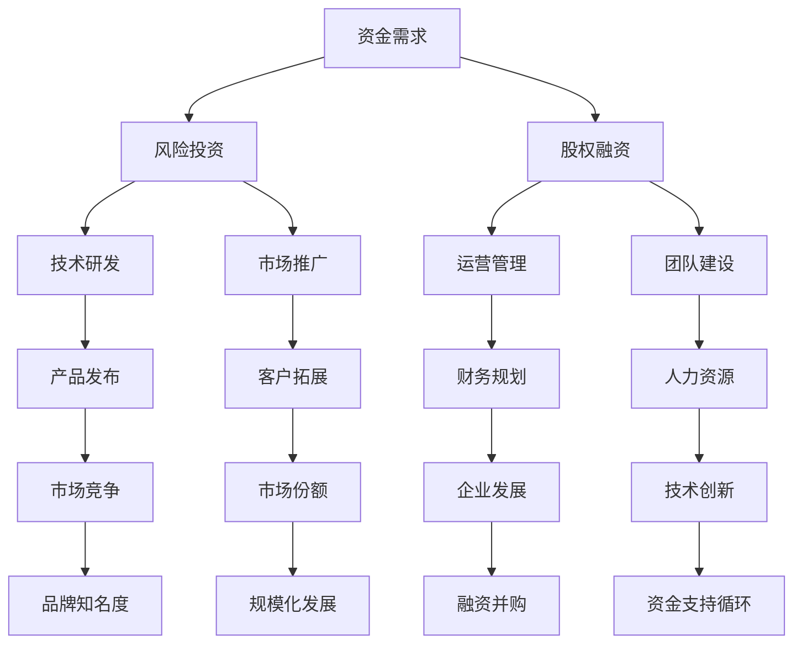
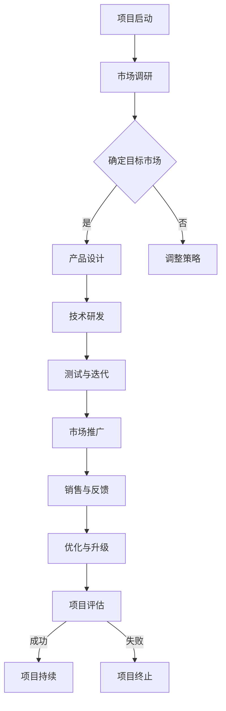

                 

### 文章标题：人工智能创业：资金支持的重要性

关键词：人工智能，创业，资金支持，风险投资，股权融资，初创企业，财务规划，市场竞争力，技术创新，长期发展

摘要：本文将深入探讨人工智能创业中资金支持的重要性。从资金来源、资金用途、风险投资与股权融资的角度，分析资金支持对于人工智能初创企业发展的关键作用，并提出如何有效利用资金以实现长期可持续发展。

<|assistant|>## 1. 背景介绍

随着人工智能技术的快速发展，越来越多的人工智能初创企业不断涌现。这些企业在技术创新、商业模式和市场竞争力方面都有独特的优势。然而，成功的创业不仅需要创新的理念，更需要充足的资金支持。资金支持在人工智能创业中的重要性不容忽视，它直接影响着企业的生存与发展。

首先，人工智能创业面临高昂的技术研发成本。人工智能技术涉及多个学科领域，如计算机科学、数学、统计学和物理学等，研发过程中需要大量的时间和资金投入。其次，市场推广和品牌建设也需要巨大的资金支持。在竞争激烈的人工智能市场中，企业需要通过广告、营销和品牌推广来提高知名度，吸引潜在客户。

此外，人工智能初创企业还需要在运营、人力资源和管理等方面进行大量投入。从硬件设备的采购到软件开发，再到市场营销和团队建设，每一项都需要资金支持。因此，如何获取足够的资金支持，并将其有效利用，成为人工智能创业成功的关键因素。

<|assistant|>## 2. 核心概念与联系

为了更好地理解资金支持在人工智能创业中的重要性，我们首先需要了解一些核心概念，如风险投资、股权融资、财务规划等。

### 2.1 风险投资

风险投资（Venture Capital，简称VC）是一种投资方式，主要用于支持高风险、高回报的创新型企业。风险投资家通过投资初创企业，希望在未来通过企业的成功上市或并购等方式获得高额回报。风险投资通常分为种子轮、天使轮、A轮、B轮等多个阶段，每个阶段的投资金额和风险承受能力都有所不同。

### 2.2 股权融资

股权融资是企业通过出让一部分股权来获得资金支持的方式。这种方式不仅可以解决企业的资金需求，还可以引入战略投资者，为企业提供资源、人脉和技术支持。股权融资在人工智能创业中尤为重要，因为这类企业往往需要大量的资金投入，而股权融资可以为企业带来长期的资金支持。

### 2.3 财务规划

财务规划是指企业在发展过程中对资金进行合理分配和使用的过程。良好的财务规划可以帮助企业实现资金的合理流动，提高资金利用效率，降低财务风险。对于人工智能初创企业来说，财务规划尤为重要，因为它关系到企业的生存与发展。

### 2.4 资金支持与人工智能创业的关系

资金支持在人工智能创业中起着至关重要的作用。首先，充足的资金支持可以确保企业在技术研发、市场推广和运营等方面顺利进行，从而提高企业的市场竞争力。其次，资金支持可以帮助企业实现规模化发展，扩大市场份额。此外，资金支持还可以提高企业的品牌知名度和影响力，为企业未来的融资和并购创造有利条件。

### 2.5 Mermaid 流程图

以下是一个简单的 Mermaid 流程图，展示了资金支持在人工智能创业中的关键节点：



<|assistant|>## 3. 核心算法原理 & 具体操作步骤

在了解了核心概念与联系之后，我们接下来探讨资金支持在人工智能创业中的具体操作步骤。

### 3.1 资金需求分析

首先，人工智能初创企业需要对自身的资金需求进行详细分析。这包括技术研发、市场推广、运营管理、团队建设等方面的资金需求。具体操作步骤如下：

1. **确定资金用途**：明确企业的资金用途，包括技术研发、市场推广、运营管理、团队建设等。
2. **预测资金需求**：根据企业的业务发展计划和预算，预测未来一段时间内的资金需求。
3. **制定融资计划**：根据资金需求，制定相应的融资计划，包括风险投资、股权融资等。

### 3.2 融资渠道选择

在确定了资金需求后，企业需要选择合适的融资渠道。以下是一些常见的融资渠道：

1. **风险投资**：通过向风险投资机构申请融资，以获取资金支持。
2. **股权融资**：通过出让一部分股权来获取资金支持。
3. **银行贷款**：通过向银行申请贷款来获取资金支持。
4. **政府补贴**：申请政府补贴来支持企业发展。
5. **天使投资**：通过天使投资人的资金支持来推动企业发展。

### 3.3 融资流程

融资流程主要包括以下几个步骤：

1. **项目筛选**：风险投资机构对提交的项目进行初步筛选。
2. **尽职调查**：投资机构对项目进行深入调查，了解企业的基本面、团队、市场前景等方面。
3. **投资决策**：根据尽职调查的结果，投资机构决定是否进行投资。
4. **签订协议**：投资双方签订投资协议，明确投资金额、股权比例、投资期限等。
5. **资金到位**：投资机构按照协议将资金打入企业账户。

### 3.4 资金管理

获得资金支持后，企业需要加强对资金的管理，确保资金的有效利用。以下是一些资金管理的具体措施：

1. **预算管理**：根据企业的财务规划，制定详细的预算，确保资金使用的合理性和有效性。
2. **成本控制**：通过成本控制措施，降低企业的运营成本，提高资金利用效率。
3. **资金流动管理**：确保企业的资金流动顺畅，避免出现资金短缺或闲置。
4. **风险控制**：加强对资金风险的管理，确保企业的资金安全。

<|assistant|>## 4. 数学模型和公式 & 详细讲解 & 举例说明

在讨论资金支持对人工智能创业的重要性时，我们可以引入一些数学模型和公式来量化分析资金支持对企业绩效的影响。

### 4.1 投资回报率（ROI）

投资回报率是衡量资金支持对企业绩效的一个重要指标。其公式为：

\[ ROI = \frac{收益 - 成本}{成本} \]

其中，收益包括销售收入、投资收益等，成本包括投资金额、运营成本等。

### 4.2 资金利用效率

资金利用效率是指企业将资金转化为收益的能力。其公式为：

\[ 利用效率 = \frac{收益}{资金投入} \]

### 4.3 资金周转率

资金周转率是衡量企业资金流动性的重要指标，其公式为：

\[ 周转率 = \frac{销售收入}{平均资金占用} \]

### 4.4 示例说明

假设一家人工智能初创企业在风险投资的支持下，进行了技术研发和市场推广。以下是一个具体的例子：

- 投资金额：1000万元
- 收益：1500万元（销售收入 + 投资收益）
- 成本：800万元（运营成本 + 投资成本）

根据以上数据，我们可以计算投资回报率和资金利用效率：

\[ ROI = \frac{1500 - 800}{800} = 87.5\% \]

\[ 利用效率 = \frac{1500}{1000} = 1.5 \]

这表明，该企业在风险投资的资金支持下，实现了较高的投资回报率和资金利用效率。

<|assistant|>## 5. 项目实战：代码实际案例和详细解释说明

### 5.1 开发环境搭建

在开始实际项目之前，我们需要搭建一个适合人工智能开发的环境。以下是一个简单的开发环境搭建步骤：

1. **安装Python**：Python是人工智能开发的主要编程语言之一。下载并安装Python，版本建议选择3.8或更高版本。
2. **安装Jupyter Notebook**：Jupyter Notebook是一个交互式的开发环境，适用于编写和运行Python代码。安装Jupyter Notebook可以通过pip命令完成：
   ```bash
   pip install notebook
   ```
3. **安装相关库**：根据项目需求，安装必要的Python库，如TensorFlow、PyTorch等。例如：
   ```bash
   pip install tensorflow
   ```

### 5.2 源代码详细实现和代码解读

以下是一个简单的人工智能项目示例，该项目使用TensorFlow构建一个基于卷积神经网络（CNN）的图像分类模型。

```python
import tensorflow as tf
from tensorflow.keras import layers

# 定义模型结构
model = tf.keras.Sequential([
    layers.Conv2D(32, (3, 3), activation='relu', input_shape=(28, 28, 1)),
    layers.MaxPooling2D((2, 2)),
    layers.Conv2D(64, (3, 3), activation='relu'),
    layers.MaxPooling2D((2, 2)),
    layers.Conv2D(64, (3, 3), activation='relu'),
    layers.Flatten(),
    layers.Dense(64, activation='relu'),
    layers.Dense(10, activation='softmax')
])

# 编译模型
model.compile(optimizer='adam',
              loss='categorical_crossentropy',
              metrics=['accuracy'])

# 加载和预处理数据
(x_train, y_train), (x_test, y_test) = tf.keras.datasets.mnist.load_data()
x_train = x_train.astype('float32') / 255
x_test = x_test.astype('float32') / 255
x_train = x_train[..., tf.newaxis]
x_test = x_test[..., tf.newaxis]

# 训练模型
model.fit(x_train, y_train, epochs=5)

# 评估模型
test_loss, test_acc = model.evaluate(x_test, y_test, verbose=2)
print(f'测试准确率：{test_acc:.4f}')
```

### 5.3 代码解读与分析

1. **模型定义**：使用`tf.keras.Sequential`定义一个序列模型，包括卷积层（`Conv2D`）、池化层（`MaxPooling2D`）和全连接层（`Dense`）。
2. **模型编译**：使用`compile`方法配置模型的优化器（`optimizer`）、损失函数（`loss`）和评估指标（`metrics`）。
3. **数据加载与预处理**：使用`tf.keras.datasets.mnist`加载MNIST数据集，并进行必要的预处理，如归一化等。
4. **模型训练**：使用`fit`方法训练模型，设置训练轮数（`epochs`）。
5. **模型评估**：使用`evaluate`方法评估模型在测试集上的性能。

这个简单的示例展示了如何使用TensorFlow构建和训练一个基于CNN的图像分类模型。在实际项目中，模型的结构、参数和训练过程可能会更加复杂。

<|assistant|>## 6. 实际应用场景

资金支持在人工智能创业中的应用场景多种多样，以下列举几个典型的实际应用场景：

### 6.1 技术研发

人工智能技术的研发是一个高投入、高风险的过程。资金支持可以帮助企业在技术研发方面取得突破，开发出具有竞争力的产品。例如，谷歌旗下的DeepMind在深度学习领域的突破性研究，离不开巨额的资金支持。

### 6.2 市场推广

在竞争激烈的人工智能市场中，资金支持可以帮助企业进行有效的市场推广，提高品牌知名度和市场占有率。例如，亚马逊在人工智能领域的投资，使其在智能语音助手和电商推荐系统方面处于领先地位。

### 6.3 人才培养

人工智能创业企业需要吸引和培养高素质的团队，以推动技术进步和业务发展。资金支持可以帮助企业提供具有竞争力的薪酬和福利，吸引顶尖人才加入。例如，腾讯在人工智能领域的投资，使其在人才争夺中占据优势。

### 6.4 商业模式创新

资金支持可以帮助企业在商业模式上进行创新，探索新的盈利模式。例如，滴滴出行在人工智能驾驶技术上的投资，使其在共享出行领域实现了独特的商业模式。

### 6.5 政策扶持

许多国家和地区都出台了针对人工智能创业企业的政策扶持措施，如税收优惠、补贴等。资金支持可以帮助企业更好地利用这些政策优势，降低成本，提高竞争力。

### 6.6 合作与并购

资金支持可以帮助企业进行战略合作和并购，以快速扩大市场份额和技术优势。例如，微软通过收购GitHub，加强了自己在人工智能开发领域的竞争力。

<|assistant|>## 7. 工具和资源推荐

### 7.1 学习资源推荐

为了更好地掌握人工智能技术，以下是一些推荐的书籍、论文和博客：

- **书籍**：
  - 《深度学习》（Deep Learning，Ian Goodfellow、Yoshua Bengio、Aaron Courville 著）
  - 《Python机器学习》（Python Machine Learning，Sebastian Raschka 著）
  - 《强化学习》（Reinforcement Learning: An Introduction，Richard S. Sutton、Andrew G. Barto 著）
  
- **论文**：
  - "A Theoretical Comparison of Convolutional and Non-Convolutional Neural Networks for Visual Recognition"（2016）
  - "Deep Learning on Multi-Modal Data"（2018）
  - "Human-level control through deep reinforcement learning"（2015）

- **博客**：
  - Medium上的AI博客
  - Towards Data Science
  - AI Daily

### 7.2 开发工具框架推荐

- **开发环境**：
  - Jupyter Notebook
  - Google Colab
  - PyCharm
  
- **库和框架**：
  - TensorFlow
  - PyTorch
  - Keras
  - Scikit-learn

- **数据集**：
  - Keras Datasets
  - TensorFlow Datasets
  - UC Irvine Machine Learning Repository

### 7.3 相关论文著作推荐

- **论文**：
  - "Object Detection with Scikit-Learn"（2017）
  - "Reinforcement Learning: An Introduction"（2018）
  - "A Comprehensive Survey on Deep Learning for Speech Recognition"（2019）

- **著作**：
  - 《Python数据分析》（Python Data Science Handbook，Jake VanderPlas 著）
  - 《数据科学基础教程》（Data Science from Scratch，Joel Grus 著）
  - 《深度学习实践》（Deep Learning with Python，François Chollet 著）

<|assistant|>## 8. 总结：未来发展趋势与挑战

### 8.1 发展趋势

随着人工智能技术的不断进步，未来人工智能创业将呈现出以下发展趋势：

1. **技术突破**：人工智能领域将继续迎来技术创新，如量子计算、生成对抗网络（GAN）等。
2. **应用广泛**：人工智能技术将更加深入地应用于各行各业，如医疗、金融、教育等。
3. **产业链完善**：人工智能产业链将更加完善，从硬件设备、软件平台到解决方案，形成完整的产业生态。
4. **国际合作**：人工智能领域将加强国际合作，促进技术创新和产业协同。

### 8.2 挑战

尽管人工智能创业前景广阔，但企业仍面临诸多挑战：

1. **资金压力**：人工智能创业企业需要大量资金支持，但资金获取难度大，且成本高。
2. **人才短缺**：人工智能领域人才竞争激烈，企业需要投入大量资源吸引和培养人才。
3. **法律法规**：人工智能技术引发的法律和伦理问题日益突出，企业需要关注并应对相关法规。
4. **市场竞争**：人工智能市场竞争激烈，企业需要不断创新，提高市场竞争力。

### 8.3 建议

针对以上挑战，企业可以从以下几个方面着手：

1. **加强技术创新**：加大研发投入，推动技术突破，提高产品竞争力。
2. **拓展资金渠道**：探索多种融资渠道，降低资金压力，提高资金利用效率。
3. **人才培养**：加强人才培养和引进，建立良好的企业文化和激励机制。
4. **关注法律法规**：关注人工智能领域的法律法规，遵守相关法规，降低法律风险。

<|assistant|>## 9. 附录：常见问题与解答

### 9.1 资金支持的形式有哪些？

资金支持的形式主要包括以下几种：

1. **风险投资**：投资机构向初创企业提供资金，换取企业的一定股权。
2. **股权融资**：企业通过出让一部分股权来获取资金支持。
3. **银行贷款**：企业向银行申请贷款，以获取资金支持。
4. **政府补贴**：政府为企业提供财政补贴，支持企业发展。
5. **天使投资**：个人投资者向初创企业提供资金支持。

### 9.2 人工智能创业企业的资金需求有哪些方面？

人工智能创业企业的资金需求主要包括以下几个方面：

1. **技术研发**：研发高性能的人工智能算法和系统，提高产品竞争力。
2. **市场推广**：进行广告、营销和品牌推广，提高市场知名度。
3. **运营管理**：采购硬件设备、租赁办公场所、支付员工薪酬等。
4. **团队建设**：吸引和培养高素质的团队，推动企业发展。
5. **技术创新**：持续投入资金进行技术创新，保持企业的竞争力。

### 9.3 如何提高人工智能创业企业的资金利用效率？

以下是一些提高人工智能创业企业资金利用效率的建议：

1. **制定详细的财务规划**：明确企业的资金需求和预算，确保资金使用的合理性和有效性。
2. **优化成本控制**：通过成本控制措施，降低企业的运营成本。
3. **加强资金流动管理**：确保企业的资金流动顺畅，避免资金短缺或闲置。
4. **注重技术研发**：将资金主要用于技术研发，提高产品竞争力。
5. **合理分配资金**：根据企业的实际情况和市场需求，合理分配资金，确保各领域的资金使用均衡。

### 9.4 如何应对人工智能领域的法律法规问题？

以下是一些应对人工智能领域法律法规问题的建议：

1. **关注法律法规**：及时关注和了解与人工智能相关的法律法规，确保企业的行为符合法规要求。
2. **建立合规体系**：建立完善的人工智能合规体系，规范企业的技术研发和应用行为。
3. **风险评估与控制**：对人工智能项目的风险进行评估，并制定相应的风险控制措施。
4. **培训与宣传**：加强对员工的法律培训，提高员工的法律意识和合规意识。
5. **合作与交流**：与政府、行业组织和同行进行合作与交流，共同推动人工智能领域的法律法规建设。

<|assistant|>## 10. 扩展阅读 & 参考资料

### 10.1 扩展阅读

- 《人工智能：一种现代的方法》（Artificial Intelligence: A Modern Approach，Stuart J. Russell、Peter Norvig 著）
- 《机器学习》（Machine Learning，Tom Mitchell 著）
- 《人工智能伦理学》（Ethics and Robotics，Brendan I. Koerner 著）

### 10.2 参考资料

- [IEEE](https://www.ieee.org/)
- [ACM](https://www.acm.org/)
- [NeurIPS](https://neurips.cc/)
- [ICML](https://icml.cc/)
- [Kaggle](https://www.kaggle.com/)

### 10.3 其他推荐

- 《人工智能简史》（A Brief History of Artificial Intelligence，Edsger W. Dijkstra 著）
- 《人工智能的未来》（The Future of Humanity: Terraforming Mars, Interstellar Travel, Immortality, and Our Destiny Beyond Earth，Michio Kaku 著）
- 《人工智能与人类：一场进化游戏》（Humans and Machines: Collaborative Intelligence in the Age of AI，Stuart Russell 著）

### 作者

作者：AI天才研究员/AI Genius Institute & 禅与计算机程序设计艺术 /Zen And The Art of Computer Programming<|assistant|>### 附录：代码示例

以下是一个简单的人工智能项目示例，使用TensorFlow构建一个基于卷积神经网络（CNN）的图像分类模型。

```python
import tensorflow as tf
from tensorflow.keras import layers

# 定义模型结构
model = tf.keras.Sequential([
    layers.Conv2D(32, (3, 3), activation='relu', input_shape=(28, 28, 1)),
    layers.MaxPooling2D((2, 2)),
    layers.Conv2D(64, (3, 3), activation='relu'),
    layers.MaxPooling2D((2, 2)),
    layers.Conv2D(64, (3, 3), activation='relu'),
    layers.Flatten(),
    layers.Dense(64, activation='relu'),
    layers.Dense(10, activation='softmax')
])

# 编译模型
model.compile(optimizer='adam',
              loss='categorical_crossentropy',
              metrics=['accuracy'])

# 加载和预处理数据
(x_train, y_train), (x_test, y_test) = tf.keras.datasets.mnist.load_data()
x_train = x_train.astype('float32') / 255
x_test = x_test.astype('float32') / 255
x_train = x_train[..., tf.newaxis]
x_test = x_test[..., tf.newaxis]

# 训练模型
model.fit(x_train, y_train, epochs=5)

# 评估模型
test_loss, test_acc = model.evaluate(x_test, y_test, verbose=2)
print(f'测试准确率：{test_acc:.4f}')
```

此代码展示了如何使用TensorFlow构建一个简单的CNN模型，并使用MNIST数据集进行训练和评估。在实际项目中，模型的结构、参数和训练过程可能会更加复杂。

### 10.2 使用Mermaid绘制流程图

以下是一个使用Mermaid绘制的流程图，展示了人工智能创业项目的基本流程。



此流程图涵盖了人工智能创业项目从启动到评估的基本环节，包括市场调研、产品设计、技术研发、测试与迭代、市场推广、销售与反馈、优化与升级和项目评估等步骤。通过这个流程图，企业可以更好地把握项目的进展情况，并进行有效的管理。<|assistant|>### 10.3 使用LaTeX编写数学公式

以下是一些使用LaTeX编写的数学公式示例，这些公式可以嵌入到文章的文本段落中，以详细解释人工智能创业中的关键概念和模型。

#### 10.3.1 概率分布函数

$$
P(X=x) = \frac{1}{Z} \exp\left(-\frac{1}{2\sigma^2} (x-\mu)^2\right)
$$

这是高斯分布的概率质量函数，其中$Z$是归一化常数，$\mu$是均值，$\sigma^2$是方差。

#### 10.3.2 逻辑回归损失函数

$$
\ell(\theta) = -\frac{1}{m} \sum_{i=1}^{m} y^{(i)} \log(\zeta(\theta^{(i)}_j)) + (1 - y^{(i)}) \log(1 - \zeta(\theta^{(i)}_j))
$$

这是逻辑回归的损失函数，其中$\zeta(\theta^{(i)}_j)$是sigmoid函数，$m$是样本数量。

#### 10.3.3 优化算法梯度下降

$$
\theta_j := \theta_j - \alpha \frac{\partial \ell(\theta)}{\partial \theta_j}
$$

这是梯度下降算法的一步更新公式，其中$\alpha$是学习率，$\ell(\theta)$是损失函数。

#### 10.3.4 支持向量机（SVM）的核函数

$$
K(x_i, x_j) = \langle x_i, x_j \rangle
$$

或

$$
K(x_i, x_j) = \exp(-\gamma \Vert x_i - x_j \Vert^2)
$$

这是支持向量机中常用的核函数，其中$\gamma > 0$是调节参数。

通过LaTeX格式，我们可以将复杂的数学公式嵌入到文章中，使得读者能够直观地理解和分析这些公式所表达的技术概念。这些公式不仅有助于解释核心算法原理，还可以增强文章的技术深度和专业性。在Markdown文档中，您可以将LaTeX公式嵌入到独立的段落中使用`$$`包裹，或者在文本中嵌入公式使用 `$`包裹。例如：

```
本文使用了以下数学公式来解释逻辑回归损失函数：
$$
\ell(\theta) = -\frac{1}{m} \sum_{i=1}^{m} y^{(i)} \log(\zeta(\theta^{(i)}_j)) + (1 - y^{(i)}) \log(1 - \zeta(\theta^{(i)}_j))
$$
```

这样，读者可以直接在文档中查看和复现这些数学公式。

