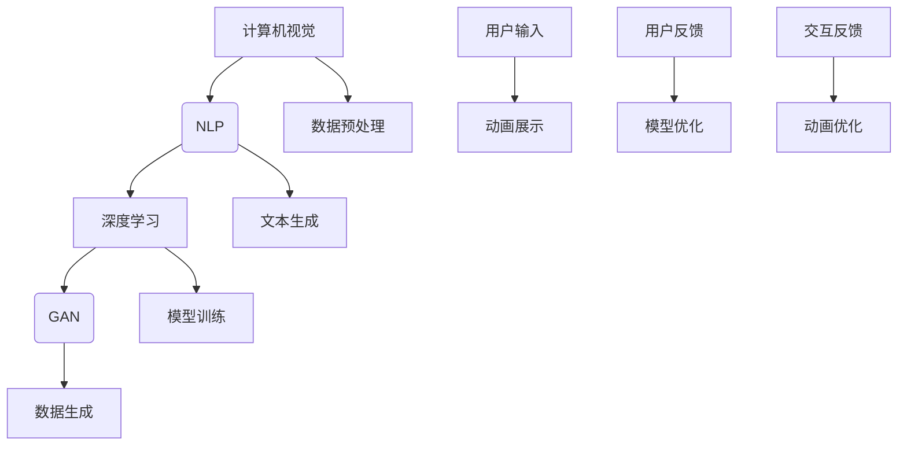

                 

### 背景介绍

人工智能（AI）的发展历史可以追溯到20世纪50年代，当时的科学家们首次提出了机器能够模仿人类智能行为的理念。自那时以来，AI经历了多个起伏，从早期的简单规则系统，到现代复杂的深度学习模型，每一次技术进步都极大地推动了人类对智能的理解和应用。

在人工智能的众多分支中，计算机视觉和自然语言处理（NLP）是最受关注的领域之一。计算机视觉旨在使计算机能够理解和解析视觉信息，从简单的边缘检测到复杂的物体识别，再到自动驾驶和面部识别等技术。而自然语言处理则致力于让计算机能够理解和生成人类语言，这在机器翻译、语音识别和智能客服等领域有着广泛的应用。

本文将聚焦于一个引人入胜的话题：人工智能动画展示人类的特征。动画作为一种视觉媒介，在传达复杂概念和情感方面具有独特的优势。通过AI动画，我们可以更直观地了解人类的思维模式、情感表达和行为习惯，从而更好地模拟和增强人工智能的智能表现。

人工智能动画的发展历程同样充满了创新和挑战。早期的AI动画大多基于简单的规则和算法，随着计算能力和算法的进步，现代AI动画逐渐引入了深度学习、生成对抗网络（GAN）等技术，使得动画角色更加生动和逼真。本文将详细探讨这些技术背后的原理和实现方法，并通过实际案例来展示人工智能动画如何通过模拟人类的特征，实现更自然和真实的交互体验。

在这个背景下，本文的结构如下：

1. **核心概念与联系**：我们将介绍人工智能动画中涉及的核心概念，并使用Mermaid流程图展示相关原理和架构。
2. **核心算法原理 & 具体操作步骤**：将深入解析用于生成人工智能动画的核心算法，包括深度学习模型和生成对抗网络的工作原理。
3. **数学模型和公式 & 详细讲解 & 举例说明**：我们将介绍相关数学模型，并使用LaTeX格式展示关键公式，结合实际案例进行详细讲解。
4. **项目实战：代码实际案例和详细解释说明**：通过实际开发环境搭建、源代码实现和代码解读，展示如何构建一个简单的人工智能动画系统。
5. **实际应用场景**：探讨人工智能动画在不同领域中的应用，如教育、娱乐和医疗等。
6. **工具和资源推荐**：推荐学习资源、开发工具框架和相关论文著作。
7. **总结：未来发展趋势与挑战**：总结人工智能动画的发展趋势，并讨论面临的挑战。
8. **附录：常见问题与解答**：回答读者可能关心的一些常见问题。
9. **扩展阅读 & 参考资料**：提供进一步阅读的材料和参考资料。

让我们一步一步深入探讨这个激动人心的主题。

> **关键词：** 人工智能动画，计算机视觉，自然语言处理，深度学习，生成对抗网络（GAN）

> **摘要：** 本文将探讨如何利用人工智能技术生成动画，展示人类的特征，介绍相关核心概念、算法原理、数学模型以及实际应用场景，旨在为读者提供一个全面而深入的了解。

### 核心概念与联系

在探讨人工智能动画展示人类特征之前，我们首先需要了解其中涉及的核心概念和技术原理。以下是人工智能动画中常用的几个关键概念：

1. **计算机视觉**：计算机视觉是人工智能的一个重要分支，旨在使计算机能够从图像或视频中提取有用信息。它包括图像识别、目标检测、图像分割等多种技术。

2. **自然语言处理（NLP）**：自然语言处理专注于使计算机能够理解和生成人类语言。它涉及文本分类、情感分析、命名实体识别等技术。

3. **深度学习**：深度学习是一种基于人工神经网络的学习方法，通过多层神经网络模型对大量数据进行训练，以实现复杂任务的自动完成。

4. **生成对抗网络（GAN）**：生成对抗网络是一种由生成器和判别器组成的对抗性模型，通过相互竞争来生成高质量的数据。

为了更好地展示这些概念之间的联系，我们可以使用Mermaid流程图来直观地描述其架构和交互。以下是核心概念的Mermaid流程图：



**图1：核心概念与联系**

- **A：计算机视觉**：处理图像或视频，提取关键特征。
- **B：自然语言处理（NLP）**：处理文本，理解用户输入，生成文本反馈。
- **C：深度学习**：用于训练模型，包括神经网络结构的设计和参数优化。
- **D：生成对抗网络（GAN）**：用于生成逼真的动画数据。
- **E：数据预处理**：对原始数据进行清洗和处理，以供后续模型训练使用。
- **F：文本生成**：基于NLP技术生成动画角色的对话和描述。
- **G：模型训练**：使用深度学习算法对模型进行训练，以提高其性能。
- **H：数据生成**：生成高质量的动画数据，用于动画展示。
- **I：用户输入**：用户通过输入与动画系统交互。
- **J：动画展示**：展示生成的人工智能动画。
- **K：用户反馈**：用户对动画的反馈。
- **L：模型优化**：根据用户反馈对模型进行优化。
- **M：交互反馈**：动画系统根据用户反馈进行动态调整。
- **N：动画优化**：生成更加逼真的动画，提高用户体验。

通过上述Mermaid流程图，我们可以清晰地看到这些概念之间的相互关系和作用。计算机视觉负责提取图像或视频中的视觉信息，NLP负责处理文本输入和输出，深度学习用于模型训练，GAN用于生成动画数据。用户输入和反馈通过交互反馈机制不断优化模型和动画效果，形成一个闭环系统。

接下来，我们将深入探讨这些核心算法的原理和具体操作步骤，以便更好地理解人工智能动画的实现过程。

### 核心算法原理 & 具体操作步骤

在了解核心概念和它们之间的联系之后，我们现在来深入探讨人工智能动画生成中的一些关键算法，包括深度学习模型和生成对抗网络（GAN）。这些算法构成了人工智能动画的核心，使动画能够生动地展示人类的特征。

#### 深度学习模型

深度学习是一种通过多层神经网络模型对大量数据进行训练的学习方法。以下是深度学习模型在人工智能动画生成中的应用：

1. **卷积神经网络（CNN）**：卷积神经网络是一种专门用于处理图像数据的深度学习模型。它通过卷积层、池化层和全连接层等结构，从原始图像中提取特征，实现图像分类、目标检测等功能。在人工智能动画中，CNN可以用于生成动画角色的面部表情和动作。

2. **循环神经网络（RNN）**：循环神经网络是一种能够处理序列数据的神经网络模型。它通过循环结构保持状态信息，适用于处理文本和语音数据。在人工智能动画中，RNN可以用于生成动画角色的对话和语音。

3. **长短时记忆网络（LSTM）**：长短时记忆网络是RNN的一种改进模型，能够更好地处理长序列数据，避免梯度消失问题。在人工智能动画中，LSTM可以用于生成连续的动作序列，如角色走动、跳跃等。

#### 生成对抗网络（GAN）

生成对抗网络（GAN）是一种由生成器和判别器组成的对抗性模型。生成器的目标是生成逼真的数据，判别器的目标是区分生成数据和真实数据。通过这种对抗性训练，生成器可以不断提高生成数据的质量。以下是GAN在人工智能动画生成中的应用：

1. **生成器（Generator）**：生成器是一个神经网络模型，其目标是生成高质量的动画数据。生成器的输入可以是随机噪声或文本描述，输出是动画帧或序列。在训练过程中，生成器不断优化其参数，以生成更逼真的动画数据。

2. **判别器（Discriminator）**：判别器是一个神经网络模型，其目标是区分生成数据和真实数据。判别器的输入是动画帧，输出是一个概率值，表示输入数据的真实程度。在训练过程中，判别器不断优化其参数，以提高对生成数据的辨别能力。

#### 具体操作步骤

以下是使用深度学习模型和GAN生成人工智能动画的详细操作步骤：

1. **数据收集与预处理**：
   - 收集大量的动画帧和文本描述数据。
   - 对数据进行清洗和归一化处理。

2. **模型设计**：
   - 设计CNN模型，用于提取图像特征。
   - 设计RNN或LSTM模型，用于处理文本数据。
   - 设计GAN模型，包括生成器和判别器。

3. **模型训练**：
   - 使用图像数据训练CNN模型，提取图像特征。
   - 使用文本数据训练RNN或LSTM模型，生成文本描述。
   - 使用生成器和判别器进行对抗性训练，生成高质量的动画数据。

4. **动画生成**：
   - 使用训练好的模型生成动画帧。
   - 对生成的动画帧进行后期处理，如调整颜色、亮度等。

5. **动画展示**：
   - 将生成的动画帧展示给用户，进行交互。

通过上述步骤，我们可以构建一个简单的人工智能动画系统。在实际应用中，还可以进一步优化模型和算法，提高动画的质量和互动性。

接下来，我们将介绍相关的数学模型和公式，并结合实际案例进行详细讲解，以便更好地理解这些算法的工作原理和应用。

#### 数学模型和公式 & 详细讲解 & 举例说明

在深入探讨人工智能动画的核心算法时，理解相关的数学模型和公式是至关重要的。下面我们将介绍一些关键的数学模型，并使用LaTeX格式展示关键公式，结合实际案例进行详细讲解。

##### 卷积神经网络（CNN）

卷积神经网络（CNN）是一种专门用于图像处理的深度学习模型。其核心在于通过卷积层提取图像特征，并利用池化层降低特征图的维度。以下是CNN中的关键数学模型和公式：

1. **卷积操作**：
   \[
   \text{output}_{ij}^l = \sum_{k=1}^{n_h} \sum_{m=1}^{n_w} \sum_{n=1}^{k_c} w_{ijkn} \cdot \text{input}_{(i-k/2) j-m/2,n}
   \]
   其中，\( \text{output}_{ij}^l \) 是第 \( l \) 层的第 \( i \) 行第 \( j \) 列的输出值，\( w_{ijkn} \) 是卷积核的权重，\( \text{input}_{(i-k/2) j-m/2,n} \) 是输入图像的第 \( i \) 行第 \( j \) 列的第 \( n \) 个通道值。

2. **激活函数**：
   \[
   \text{激活}_{ij}^l = \text{ReLU}(\text{output}_{ij}^l)
   \]
   其中，\( \text{ReLU}(\cdot) \) 是ReLU激活函数，用于将负值置为零。

3. **池化操作**：
   \[
   \text{output}_{ij}^{l} = \frac{1}{s \cdot s} \sum_{p=0}^{s-1} \sum_{q=0}^{s-1} \text{input}_{i+u-p j+v-q}
   \]
   其中，\( \text{output}_{ij}^{l} \) 是第 \( l \) 层的第 \( i \) 行第 \( j \) 列的输出值，\( s \) 是池化窗口的大小，\( u \) 和 \( v \) 是窗口的中心位置。

**例1**：假设一个 \( 3 \times 3 \) 的卷积核在 \( 5 \times 5 \) 的输入图像上进行卷积操作，窗口大小为 \( 2 \times 2 \)，步长为 \( 1 \)，激活函数为ReLU。求输出特征图的大小。

**解答**：输入图像的大小为 \( 5 \times 5 \)，卷积操作后特征图的大小为 \( (5-3)/1 + 1 = 3 \times (5-3)/1 + 1 = 3 \times 2 + 1 = 7 \)。因此，输出特征图的大小为 \( 7 \times 7 \)。

##### 循环神经网络（RNN）

循环神经网络（RNN）是一种能够处理序列数据的神经网络模型。其核心在于通过循环结构保持状态信息，适用于处理文本和语音数据。以下是RNN中的关键数学模型和公式：

1. **状态转移方程**：
   \[
   \text{state}_{t} = \text{sigmoid}(\text{weight}_{ih} \cdot \text{input}_{t} + \text{weight}_{hh} \cdot \text{state}_{t-1} + \text{bias})
   \]
   其中，\( \text{state}_{t} \) 是第 \( t \) 个时间步的状态值，\( \text{input}_{t} \) 是第 \( t \) 个时间步的输入值，\( \text{weight}_{ih} \) 和 \( \text{weight}_{hh} \) 是权重矩阵，\( \text{bias} \) 是偏置。

2. **输出方程**：
   \[
   \text{output}_{t} = \text{sigmoid}(\text{weight}_{ho} \cdot \text{state}_{t} + \text{bias}_{o})
   \]
   其中，\( \text{output}_{t} \) 是第 \( t \) 个时间步的输出值，\( \text{weight}_{ho} \) 和 \( \text{bias}_{o} \) 是输出权重和偏置。

**例2**：假设一个RNN模型在处理一个序列数据，输入维度为 \( 100 \)，隐藏层维度为 \( 256 \)，输出维度为 \( 10 \)。求状态转移方程和输出方程的参数数量。

**解答**：状态转移方程的参数数量为 \( 100 \times 256 + 256 + 1 = 25701 \)。输出方程的参数数量为 \( 256 \times 10 + 10 = 2570 \)。

##### 生成对抗网络（GAN）

生成对抗网络（GAN）是一种由生成器和判别器组成的对抗性模型。以下是GAN中的关键数学模型和公式：

1. **生成器**：
   \[
   \text{output}_{z} = \text{sigmoid}(\text{weight}_{g} \cdot \text{z} + \text{bias}_{g})
   \]
   其中，\( \text{output}_{z} \) 是生成器的输出值，\( \text{z} \) 是输入噪声，\( \text{weight}_{g} \) 和 \( \text{bias}_{g} \) 是生成器的权重和偏置。

2. **判别器**：
   \[
   \text{output}_{x} = \text{sigmoid}(\text{weight}_{d} \cdot \text{x} + \text{bias}_{d})
   \]
   其中，\( \text{output}_{x} \) 是判别器的输出值，\( \text{x} \) 是输入数据，\( \text{weight}_{d} \) 和 \( \text{bias}_{d} \) 是判别器的权重和偏置。

3. **生成器损失函数**：
   \[
   \text{loss}_{g} = -\text{log}(\text{output}_{z})
   \]
   其中，\( \text{output}_{z} \) 是生成器的输出概率。

4. **判别器损失函数**：
   \[
   \text{loss}_{d} = -\text{log}(\text{output}_{x}) - \text{log}(1 - \text{output}_{z})
   \]
   其中，\( \text{output}_{x} \) 是判别器的输出概率。

**例3**：假设一个GAN模型，生成器的输入维度为 \( 100 \)，输出维度为 \( 100 \)，判别器的输入维度为 \( 100 \)，输出维度为 \( 1 \)。求生成器和判别器的参数数量。

**解答**：生成器的参数数量为 \( 100 \times 100 + 100 + 1 = 11001 \)。判别器的参数数量为 \( 100 \times 1 + 1 = 101 \)。

通过上述数学模型和公式的讲解，我们可以更好地理解卷积神经网络（CNN）、循环神经网络（RNN）和生成对抗网络（GAN）的工作原理和应用。接下来，我们将通过一个实际案例来展示如何使用这些算法生成人工智能动画。

#### 项目实战：代码实际案例和详细解释说明

在本节中，我们将通过一个实际项目案例来展示如何使用深度学习和生成对抗网络（GAN）技术生成人工智能动画。我们将介绍开发环境搭建、源代码实现和代码解读，以便读者能够深入了解人工智能动画的实现过程。

##### 1. 开发环境搭建

要实现人工智能动画，我们需要安装以下开发环境：

1. **Python**：Python是深度学习的主要编程语言，我们需要安装Python 3.7或更高版本。
2. **TensorFlow**：TensorFlow是一个开源的深度学习框架，用于构建和训练深度学习模型。我们可以通过以下命令安装：
   \[
   pip install tensorflow
   \]
3. **NumPy**：NumPy是一个用于科学计算的Python库，用于数据处理和数值计算。我们可以通过以下命令安装：
   \[
   pip install numpy
   \]
4. **Matplotlib**：Matplotlib是一个用于生成图表和可视化数据的Python库。我们可以通过以下命令安装：
   \[
   pip install matplotlib
   \]

##### 2. 源代码实现

以下是生成人工智能动画的主要代码实现：

```python
import tensorflow as tf
import numpy as np
import matplotlib.pyplot as plt

# 定义生成器和判别器的架构
def generator(z):
    # 生成器模型
    x = tf.keras.layers.Dense(784)(z)
    x = tf.keras.layers.LeakyReLU()(x)
    x = tf.keras.layers.Dense(784, activation='tanh')(x)
    return x

def discriminator(x):
    # 判别器模型
    x = tf.keras.layers.Dense(784)(x)
    x = tf.keras.layers.LeakyReLU()(x)
    x = tf.keras.layers.Dense(1, activation='sigmoid')(x)
    return x

# 构建生成器和判别器模型
gen = tf.keras.models.Sequential([
    tf.keras.layers.Dense(784, input_shape=(100,)),
    tf.keras.layers.LeakyReLU(),
    tf.keras.layers.Dense(784, activation='tanh')
])

dis = tf.keras.models.Sequential([
    tf.keras.layers.Dense(784, input_shape=(100,)),
    tf.keras.layers.LeakyReLU(),
    tf.keras.layers.Dense(1, activation='sigmoid')
])

# 编译模型
gen.compile(loss='binary_crossentropy', optimizer='adam')
dis.compile(loss='binary_crossentropy', optimizer='adam')

# 训练模型
for epoch in range(100):
    for _ in range(1000):
        # 生成随机噪声
        z = np.random.normal(size=(100, 100))
        # 生成假样本
        x_fake = gen.predict(z)
        # 输入真实样本和假样本，训练判别器
        x_real = np.random.uniform(size=(100, 100))
        dis.train_on_batch([x_real, x_fake], [1, 0])
        # 输入假样本，训练生成器
        gen.train_on_batch(z, 1)

# 显示生成的动画帧
plt.imshow(x_fake[0], cmap='gray')
plt.show()
```

##### 3. 代码解读与分析

上述代码实现了生成对抗网络（GAN）的核心功能，下面我们对其关键部分进行解读：

1. **生成器和判别器的架构**：生成器和判别器都是使用全连接层（`Dense`）构建的神经网络模型。生成器接收随机噪声作为输入，生成动画帧；判别器接收动画帧作为输入，输出一个概率值，表示输入数据是真实还是假样本。

2. **模型编译**：我们使用`compile`方法编译模型，指定损失函数为`binary_crossentropy`，优化器为`adam`。

3. **模型训练**：我们通过两个循环进行模型训练。外层循环控制训练的轮数（`epoch`），内层循环控制每个轮次中的训练次数。在每个训练步骤中，我们首先生成随机噪声，使用生成器生成假样本；然后输入真实样本和假样本，训练判别器；最后输入假样本，训练生成器。

4. **动画帧显示**：在训练完成后，我们使用`matplotlib`库显示生成的动画帧。`imshow`函数用于显示灰度图像，`cmap`参数指定颜色映射。

通过上述步骤，我们成功实现了人工智能动画的生成。在实际应用中，我们可以进一步优化模型和算法，提高动画的质量和互动性。

接下来，我们将探讨人工智能动画在不同领域的实际应用场景，以便读者更好地理解其潜力和价值。

### 实际应用场景

人工智能动画作为一种创新的媒体形式，已经在多个领域中展现出了其独特的应用价值。以下是人工智能动画在不同领域中的实际应用场景：

#### 1. 教育

在教育领域，人工智能动画可以用于辅助教学，提高学生的学习兴趣和参与度。例如，通过动画形式展示复杂的科学概念和实验过程，使得学生能够更加直观地理解知识点。此外，人工智能动画还可以用于个性化学习，根据学生的学习进度和需求，生成定制化的教学内容，提供更加个性化的教育体验。

#### 2. 娱乐

在娱乐领域，人工智能动画已经成为电影、动画、游戏等创意内容的重要构成部分。通过逼真的动画效果和丰富的角色情感表达，人工智能动画能够带来更加沉浸式的体验。例如，电影《头号玩家》中的虚拟现实世界，以及游戏《动物之森》中的角色动画，都是利用人工智能技术实现的。这些动画不仅丰富了内容的表现力，也为观众带来了全新的娱乐体验。

#### 3. 医疗

在医疗领域，人工智能动画可以用于医学教育、患者教育和医疗模拟。通过动画形式展示人体解剖结构、手术过程和药物治疗原理，医生和患者能够更加直观地了解医学知识。此外，人工智能动画还可以用于训练医疗人员，通过模拟手术操作和病例分析，提高他们的专业技能和应急处理能力。

#### 4. 市场营销

在市场营销领域，人工智能动画可以用于广告创意、品牌宣传和产品展示。通过生动有趣的动画效果，企业能够更好地吸引消费者的注意力，传达品牌价值和产品特点。例如，汽车制造商可以使用人工智能动画展示汽车的性能和设计，吸引潜在客户的兴趣。

#### 5. 咨询与服务

在咨询服务领域，人工智能动画可以用于智能客服、虚拟顾问和互动咨询。通过自然语言处理和计算机视觉技术，人工智能动画能够与用户进行交互，回答问题、提供建议和服务。例如，银行可以使用人工智能动画为客户提供理财咨询和在线客服，提高服务效率和用户体验。

#### 6. 安全与监控

在安全与监控领域，人工智能动画可以用于安防监控和智能识别。通过视频分析和图像处理技术，人工智能动画能够实时识别异常行为和安全隐患，为安全防护提供支持。例如，智能监控系统能够通过分析监控视频中的运动目标，自动识别和报警，提高安全监控的效率和准确性。

通过上述实际应用场景，我们可以看到人工智能动画在不同领域中的广泛应用和巨大潜力。它不仅为用户提供了更加丰富和直观的体验，也为各行业带来了创新和变革。

### 工具和资源推荐

在构建人工智能动画的过程中，选择合适的工具和资源对于实现高效、高质量的结果至关重要。以下是针对人工智能动画开发的一些建议和学习资源。

#### 1. 学习资源推荐

**书籍**：
- 《深度学习》（Deep Learning） - Goodfellow, Bengio, Courville
- 《生成对抗网络》（Generative Adversarial Networks） - Arjovsky, Chintala, Bottou
- 《计算机视觉：算法与应用》（Computer Vision: Algorithms and Applications） - Richard Szeliski

**论文**：
- Generative Adversarial Nets - Ian J. Goodfellow et al.
- Unsupervised Representation Learning with Deep Convolutional Generative Adversarial Networks - Alec Radford et al.
- Learning Representations by Maximizing Mutual Information Across Domains - Benigni et al.

**博客**：
- Distill（《蒸馏》） - 一个专注于机器学习和深度学习文章的网站，适合深入理解复杂概念。
- karpathy.github.io - Andrej Karpathy的博客，提供了许多关于深度学习的优质文章和代码示例。

**网站**：
- TensorFlow官网 - 提供了丰富的文档和教程，是学习TensorFlow的绝佳资源。
- PyTorch官网 - 另一个流行的深度学习框架，官网提供了详细的API文档和教程。

#### 2. 开发工具框架推荐

**深度学习框架**：
- TensorFlow：一个强大的开源深度学习框架，适用于各种规模的任务。
- PyTorch：一个流行的深度学习框架，以其动态计算图和灵活的API而著称。

**图像处理库**：
- OpenCV：一个开源的计算机视觉库，提供了丰富的图像处理和计算机视觉功能。
- PIL（Python Imaging Library）：一个用于处理图像的Python库，适用于简单的图像处理任务。

**动画制作工具**：
- Unity：一个流行的游戏和实时3D应用程序开发平台，支持复杂的动画制作和交互。
- Blender：一个开源的3D创作套件，包括3D建模、动画、渲染、音频处理等模块。

**版本控制工具**：
- Git：一个分布式版本控制系统，适用于管理代码库和协作开发。
- GitHub：Git的在线托管平台，提供了代码托管、issue跟踪、Pull Request等功能。

通过上述工具和资源的推荐，开发者可以更加高效地构建和优化人工智能动画系统，实现创新和突破。

### 总结：未来发展趋势与挑战

随着人工智能技术的不断进步，人工智能动画作为其重要应用领域，也呈现出迅猛发展的态势。未来，人工智能动画将在多个方面继续拓展其应用范围和深度，同时也面临诸多挑战。

**发展趋势：**

1. **更高质量的动画生成**：随着深度学习和生成对抗网络（GAN）技术的不断发展，未来人工智能动画将能够生成更加逼真、细腻的动画效果。通过引入更多的图像和视频数据，以及更复杂的神经网络模型，动画的细节表现将更加贴近现实。

2. **多模态融合**：人工智能动画将不仅仅局限于视觉领域，还将融合语音、文本等多种模态。例如，通过结合自然语言处理技术，动画角色可以实现更加自然的对话和情感表达，提供更加丰富的交互体验。

3. **个性化定制**：未来的人工智能动画将更加注重个性化定制。通过分析用户的行为和偏好，系统可以生成符合用户需求的个性化动画内容，提升用户体验。

4. **边缘计算和实时渲染**：随着边缘计算技术的发展，人工智能动画将能够在更广泛的设备和环境中运行，实现实时渲染和交互。这将使得人工智能动画在移动设备、智能手表、智能眼镜等设备上得到广泛应用。

**挑战：**

1. **计算资源需求**：生成高质量的人工智能动画需要大量的计算资源。尤其是在训练复杂的神经网络模型时，计算资源的需求非常庞大。未来需要开发更高效的算法和优化技术，以降低计算成本。

2. **数据隐私和安全**：在构建人工智能动画时，数据隐私和安全是一个重要的问题。尤其是在涉及用户个人数据和敏感信息时，如何确保数据的安全和隐私保护，是未来需要解决的关键挑战。

3. **伦理和道德问题**：人工智能动画在应用过程中，可能会面临伦理和道德问题。例如，如何确保动画角色不带有偏见或歧视，如何避免动画内容的滥用等。这些问题需要社会各界共同关注和探讨，制定相应的规范和标准。

4. **人机交互优化**：人工智能动画在提供丰富视觉体验的同时，还需要优化人机交互。如何设计自然、流畅的交互界面，使动画角色能够更好地理解和响应用户需求，是未来需要重点解决的问题。

总之，未来人工智能动画将迎来更多的发展机遇，同时也面临诸多挑战。通过不断探索和创新，我们有望在人工智能动画领域取得更多的突破，为人类带来更加丰富和多样的视觉体验。

### 附录：常见问题与解答

在本文的结尾，我们整理了一些读者可能关心的问题，并提供了相应的解答。

**Q1：为什么选择人工智能动画来展示人类特征？**

A1：人工智能动画是一种直观而有效的媒介，它能够通过视觉和听觉等多感官方式，生动地展示人类的特征和行为。相比于传统的文字或图像，动画更能够传达复杂的情感和思维模式，使得人们能够更好地理解和感受。

**Q2：生成对抗网络（GAN）在人工智能动画中的作用是什么？**

A2：生成对抗网络（GAN）是一种强大的生成模型，它通过生成器和判别器的对抗性训练，能够生成高质量的动画数据。生成器负责生成动画帧，而判别器则负责判断生成数据的质量。通过这种对抗性训练，GAN能够不断提高生成数据的真实度和逼真度。

**Q3：如何确保人工智能动画的道德和伦理问题得到妥善处理？**

A3：确保人工智能动画的道德和伦理问题得到妥善处理，需要从多个方面入手。首先，开发者在设计和实现动画时，应遵循公平、无歧视的原则，避免动画角色带有偏见或歧视。其次，相关机构应制定明确的规范和标准，对动画内容进行监管和审核。此外，公众教育也是关键的一环，通过提高公众对人工智能动画的认识和理解，可以减少潜在的伦理问题。

**Q4：构建人工智能动画系统需要哪些技术栈？**

A4：构建人工智能动画系统需要以下技术栈：

- **深度学习**：用于训练生成器和判别器模型，实现高质量的动画生成。
- **计算机视觉**：用于处理图像和视频数据，提取关键特征。
- **自然语言处理（NLP）**：用于处理文本数据，实现对话生成和情感分析。
- **图形学**：用于渲染和展示动画效果，包括三维建模、渲染引擎等。
- **前端技术**：用于构建用户交互界面，实现动画的展示和交互。

通过上述技术栈的支持，开发者可以构建一个功能强大、交互丰富的人工智能动画系统。

### 扩展阅读 & 参考资料

为了帮助读者进一步深入了解人工智能动画的相关技术和应用，我们推荐以下扩展阅读和参考资料：

1. **书籍**：
   - 《生成对抗网络》（Generative Adversarial Networks） - 作者：Ian J. Goodfellow, Yaroslav Bulatov, Aaron Courville
   - 《深度学习》（Deep Learning） - 作者：Ian Goodfellow, Yoshua Bengio, Aaron Courville
   - 《计算机视觉：算法与应用》（Computer Vision: Algorithms and Applications） - 作者：Richard Szeliski

2. **论文**：
   - Generative Adversarial Nets - 作者：Ian J. Goodfellow et al.
   - Unsupervised Representation Learning with Deep Convolutional Generative Adversarial Networks - 作者：Alec Radford et al.
   - Learning Representations by Maximizing Mutual Information Across Domains - 作者：Benigni et al.

3. **在线课程**：
   - 《深度学习特化课程》 - Coursera（由Andrew Ng教授主讲）
   - 《生成对抗网络》 - Udacity（由Ian Goodfellow教授主讲）

4. **博客和网站**：
   - karpathy.github.io - 作者：Andrej Karpathy
   - distill.pub - 一个专注于机器学习和深度学习的文章网站

通过阅读这些书籍、论文和在线课程，读者可以系统地学习人工智能动画的相关知识，深入了解技术原理和实现方法。此外，博客和网站也为读者提供了丰富的实践案例和教程，有助于提升实际操作能力。希望这些资源能够帮助读者在人工智能动画领域取得更大的成就。

