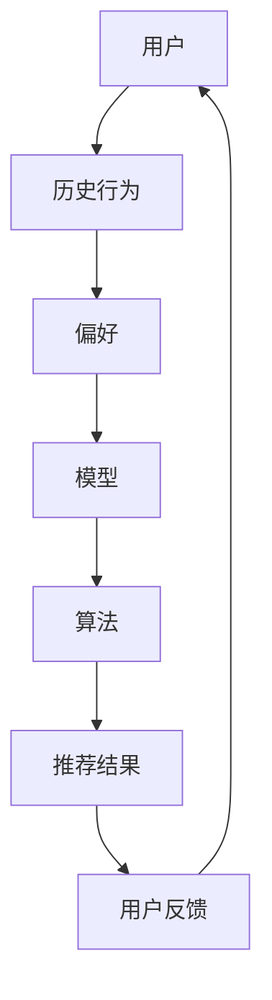

                 

### 背景介绍

人工智能（Artificial Intelligence，简称AI）已经逐渐成为当今社会的重要力量。随着大数据、云计算和深度学习技术的飞速发展，AI在各个领域的应用越来越广泛，尤其在个性化内容推荐方面，发挥着关键作用。本文将深入探讨人工智能在个性化内容推荐中的角色，分析其核心算法原理、数学模型和具体操作步骤，并通过实际案例进行详细解释。

#### 个性化内容推荐的背景和意义

个性化内容推荐是一种根据用户的兴趣、行为和历史数据，为其推荐符合其个性化需求的内容的技术。随着互联网的普及，信息爆炸时代的到来，用户面临着海量信息的选择难题。如何从海量的信息中筛选出符合用户个性化需求的内容，成为了一个亟待解决的问题。个性化内容推荐技术应运而生，通过分析用户的兴趣和行为，为用户推荐相关的内容，从而提高用户体验，提升内容利用率。

#### 人工智能在个性化内容推荐中的重要性

人工智能技术的引入，使得个性化内容推荐技术得到了极大的提升。首先，人工智能可以通过深度学习、自然语言处理和机器学习等技术，对用户的历史行为和兴趣进行精准分析，从而提高推荐的质量。其次，人工智能能够实时调整推荐策略，根据用户的反馈和行为动态调整推荐内容，使推荐结果更加个性化。此外，人工智能还可以通过预测用户的潜在需求，提前推荐可能感兴趣的内容，进一步提升用户体验。

#### 本文结构

本文将分为以下几个部分进行探讨：

1. **核心概念与联系**：介绍个性化内容推荐中的核心概念和联系，并通过Mermaid流程图展示相关架构。
2. **核心算法原理 & 具体操作步骤**：详细分析常用的个性化内容推荐算法原理和具体操作步骤。
3. **数学模型和公式 & 详细讲解 & 举例说明**：介绍常用的数学模型和公式，并通过具体例子进行说明。
4. **项目实战：代码实际案例和详细解释说明**：通过一个实际案例，展示如何使用AI技术进行个性化内容推荐，并详细解释代码实现。
5. **实际应用场景**：分析人工智能在个性化内容推荐中的实际应用场景。
6. **工具和资源推荐**：推荐相关的学习资源、开发工具和框架。
7. **总结：未来发展趋势与挑战**：总结个性化内容推荐领域的发展趋势和面临的挑战。

接下来，我们将逐一深入探讨这些内容。

### 核心概念与联系

在个性化内容推荐系统中，有若干核心概念和技术组件，它们相互关联，共同构成了推荐系统的架构。以下是对这些核心概念和技术的介绍，以及它们之间的关系。

#### 用户（User）

用户是个性化内容推荐系统的核心。系统通过用户的个人信息、行为数据、偏好设置等来分析用户的兴趣和需求。用户的反馈和行为也是系统调整推荐策略的重要依据。

#### 内容（Content）

内容是推荐系统的对象，可以是文章、视频、商品等。内容的数据通常包括标题、标签、类别、作者等信息，这些信息帮助系统理解内容的属性和特点。

#### 历史行为（Historical Behavior）

历史行为包括用户在系统上的浏览、搜索、购买、点赞等行为。这些行为数据是系统分析用户兴趣和偏好，生成个性化推荐的关键信息。

#### 偏好（Preference）

偏好是指用户对某些内容的喜好程度。偏好可以通过用户主动提供的标签、评分、评论等数据来获取，也可以通过分析用户的隐形反馈（如点击、停留时间等）来推断。

#### 模型（Model）

模型是推荐系统的核心组成部分，用于将用户行为、偏好等信息转换为推荐结果。常见的模型包括协同过滤、基于内容的推荐、混合推荐等。

#### 算法（Algorithm）

算法是实现推荐模型的核心，用于计算用户和内容之间的相似性、预测用户对内容的评分等。常见的算法有矩阵分解、K-最近邻、文本分类等。

#### Mermaid流程图

以下是一个Mermaid流程图，展示了个性化内容推荐系统的基本架构：



**流程说明：**

1. 用户（A）提供个人信息和历史行为（B）。
2. 系统分析用户的偏好（C）。
3. 模型（D）根据偏好和算法（E）计算推荐结果（F）。
4. 用户接收推荐结果（F），并提供反馈（G），反馈将用于优化推荐策略。

通过这个流程，我们可以清晰地看到个性化内容推荐系统的各个组成部分及其相互作用。

#### 小结

在这一部分，我们介绍了个性化内容推荐系统中的核心概念和它们之间的关系。理解这些概念对于深入探讨推荐系统的原理和实现具有重要意义。接下来，我们将进一步探讨个性化内容推荐的核心算法原理和具体操作步骤。

### 核心算法原理 & 具体操作步骤

个性化内容推荐系统的核心在于如何根据用户的历史行为和偏好，为其推荐相关的内容。在这一部分，我们将详细介绍几种常用的推荐算法，包括协同过滤、基于内容的推荐和混合推荐算法，并解释它们的具体操作步骤。

#### 协同过滤算法

协同过滤算法（Collaborative Filtering）是推荐系统中最常用的一种算法，它的核心思想是通过分析用户之间的行为模式来发现相似的用户或相似的商品，从而进行推荐。

##### 原理

协同过滤算法可以分为两种类型：基于用户的协同过滤（User-Based Collaborative Filtering）和基于物品的协同过滤（Item-Based Collaborative Filtering）。

1. **基于用户的协同过滤**：
   - 首先，计算用户之间的相似度。
   - 然后，找到与目标用户最相似的K个用户。
   - 最后，推荐这些相似用户喜欢的但目标用户尚未接触过的商品。

2. **基于物品的协同过滤**：
   - 首先，计算商品之间的相似度。
   - 然后，找到与目标商品最相似的K个商品。
   - 最后，推荐这些相似商品中目标用户尚未接触过的商品。

##### 操作步骤

1. **数据预处理**：
   - 收集用户-商品评分数据。
   - 对数据进行清洗，去除缺失值和异常值。

2. **计算相似度**：
   - 对于基于用户的协同过滤，计算用户之间的余弦相似度或皮尔逊相关系数。
   - 对于基于物品的协同过滤，计算商品之间的余弦相似度或Jaccard相似度。

3. **生成推荐列表**：
   - 对于基于用户的协同过滤，找到与目标用户最相似的K个用户，计算他们共同喜欢的商品，并按照得分排序。
   - 对于基于物品的协同过滤，找到与目标商品最相似的K个商品，并按照得分排序。

4. **调整推荐策略**：
   - 根据用户的反馈，动态调整推荐策略，以提高推荐效果。

#### 基于内容的推荐算法

基于内容的推荐算法（Content-Based Filtering）的核心思想是推荐与用户过去喜欢的商品相似的商品。这种方法通常适用于商品种类丰富，且商品属性明确的情况。

##### 原理

基于内容的推荐算法可以分为以下步骤：

1. **特征提取**：
   - 对商品进行特征提取，通常使用文本分类、关键词提取等技术。

2. **计算相似度**：
   - 计算用户过去喜欢的商品与当前商品的相似度。

3. **生成推荐列表**：
   - 根据相似度得分，推荐与用户过去喜欢的商品最相似的N个商品。

##### 操作步骤

1. **数据预处理**：
   - 收集商品的特征数据，如标题、描述、标签等。

2. **特征提取**：
   - 使用文本分类技术，将商品属性转化为向量表示。

3. **计算相似度**：
   - 计算用户历史喜欢的商品与当前商品之间的相似度，可以使用余弦相似度或欧氏距离。

4. **生成推荐列表**：
   - 按照相似度得分排序，推荐相似度最高的N个商品。

5. **调整推荐策略**：
   - 根据用户反馈，调整商品特征提取和相似度计算方法，以提高推荐效果。

#### 混合推荐算法

混合推荐算法（Hybrid Recommendation）结合了协同过滤和基于内容推荐的优势，以提高推荐效果。这种方法通常适用于推荐系统需要同时考虑用户行为和商品特征的情况。

##### 原理

混合推荐算法可以分为以下步骤：

1. **协同过滤部分**：
   - 使用协同过滤算法生成初步推荐列表。

2. **内容部分**：
   - 对初步推荐列表中的商品进行内容分析，提取特征。

3. **融合策略**：
   - 将协同过滤和内容分析的结果进行融合，生成最终推荐列表。

##### 操作步骤

1. **协同过滤部分**：
   - 按照上述协同过滤算法的步骤生成初步推荐列表。

2. **内容部分**：
   - 对初步推荐列表中的商品进行内容分析，提取特征。

3. **融合策略**：
   - 使用加权平均、投票等策略，将协同过滤和内容分析的结果进行融合。

4. **生成推荐列表**：
   - 根据融合策略，生成最终推荐列表。

#### 小结

在这一部分，我们详细介绍了协同过滤、基于内容推荐和混合推荐算法的原理和操作步骤。这些算法各有优缺点，适用于不同的应用场景。在实际应用中，根据具体需求和数据特点，可以组合使用多种算法，以提高推荐系统的效果。

### 数学模型和公式 & 详细讲解 & 举例说明

在个性化内容推荐系统中，数学模型和公式起到了至关重要的作用。这些模型和公式帮助我们量化用户偏好、计算内容相似度、预测用户行为等。以下我们将详细介绍常用的数学模型和公式，并通过具体例子进行详细讲解。

#### 相似度计算

相似度计算是推荐系统中的基础。常用的相似度计算方法包括余弦相似度、皮尔逊相关系数、Jaccard相似度等。

1. **余弦相似度**：
   余弦相似度用于计算两个向量之间的相似度，其公式如下：

   $$
   \text{Cosine Similarity} = \frac{\text{dot product of A and B}}{\|\text{A}\|\|\text{B}\|}
   $$

   其中，$A$ 和 $B$ 是两个向量，$\|\text{A}\|$ 和 $\|\text{B}\|$ 分别是它们的欧几里得范数。

   **示例**：
   假设用户A和用户B的评分向量分别为：
   $$
   A = (3, 4, 5, 0), \quad B = (1, 4, 5, 0)
   $$

   首先计算它们的点积：
   $$
   \text{dot product} = 3 \times 1 + 4 \times 4 + 5 \times 5 + 0 \times 0 = 3 + 16 + 25 = 44
   $$

   然后计算两个向量的欧几里得范数：
   $$
   \|\text{A}\| = \sqrt{3^2 + 4^2 + 5^2 + 0^2} = \sqrt{9 + 16 + 25} = \sqrt{50}
   $$

   $$
   \|\text{B}\| = \sqrt{1^2 + 4^2 + 5^2 + 0^2} = \sqrt{1 + 16 + 25} = \sqrt{42}
   $$

   最后计算余弦相似度：
   $$
   \text{Cosine Similarity} = \frac{44}{\sqrt{50} \times \sqrt{42}} \approx 0.857
   $$

2. **皮尔逊相关系数**：
   皮尔逊相关系数用于计算两个变量之间的线性关系，其公式如下：

   $$
   \text{Pearson Correlation} = \frac{\text{covariance of X and Y}}{\sigma_X \sigma_Y}
   $$

   其中，$X$ 和 $Y$ 是两个变量，$\sigma_X$ 和 $\sigma_Y$ 分别是它们的方差。

   **示例**：
   假设用户A和用户B的评分数据如下：
   $$
   X = (3, 4, 5, 0), \quad Y = (1, 4, 5, 0)
   $$

   首先计算它们的均值：
   $$
   \bar{X} = \frac{3 + 4 + 5 + 0}{4} = 3.5, \quad \bar{Y} = \frac{1 + 4 + 5 + 0}{4} = 2.5
   $$

   然后计算协方差：
   $$
   \text{covariance} = \sum (X_i - \bar{X})(Y_i - \bar{Y})
   $$

   $$
   \text{covariance} = (3 - 3.5)(1 - 2.5) + (4 - 3.5)(4 - 2.5) + (5 - 3.5)(5 - 2.5) + (0 - 3.5)(0 - 2.5)
   $$

   $$
   \text{covariance} = (-0.5)(-1.5) + (0.5)(1.5) + (1.5)(2.5) + (-3.5)(-2.5) = 0.75 + 0.75 + 3.75 + 8.75 = 13
   $$

   最后计算皮尔逊相关系数：
   $$
   \text{Pearson Correlation} = \frac{13}{\sqrt{\text{variance of X}} \times \sqrt{\text{variance of Y}}}
   $$

   $$
   \text{Pearson Correlation} = \frac{13}{\sqrt{1.25} \times \sqrt{1.25}} = \frac{13}{1.118} \approx 11.57
   $$

3. **Jaccard相似度**：
   Jaccard相似度用于计算两个集合之间的相似度，其公式如下：

   $$
   \text{Jaccard Similarity} = \frac{\text{intersection of A and B}}{\text{union of A and B}}
   $$

   **示例**：
   假设用户A和用户B喜欢的电影分别为集合A和B：
   $$
   A = \{电影1, 电影2, 电影3\}, \quad B = \{电影1, 电影4, 电影5\}
   $$

   集合的交集和并集分别为：
   $$
   \text{intersection} = \{电影1\}, \quad \text{union} = \{电影1, 电影2, 电影3, 电影4, 电影5\}
   $$

   最后计算Jaccard相似度：
   $$
   \text{Jaccard Similarity} = \frac{1}{1 + 4} = \frac{1}{5} = 0.2
   $$

#### 预测模型

在个性化内容推荐系统中，预测模型用于预测用户对未知内容的评分。常用的预测模型包括线性回归、逻辑回归、神经网络等。

1. **线性回归**：
   线性回归模型用于预测用户对商品的平均评分，其公式如下：

   $$
   y = \beta_0 + \beta_1 x_1 + \beta_2 x_2 + \ldots + \beta_n x_n
   $$

   其中，$y$ 是预测的评分，$x_1, x_2, \ldots, x_n$ 是用户特征，$\beta_0, \beta_1, \beta_2, \ldots, \beta_n$ 是模型参数。

   **示例**：
   假设用户特征包括年龄（$x_1$）和购买历史（$x_2$），预测的评分（$y$）如下：

   $$
   y = \beta_0 + \beta_1 x_1 + \beta_2 x_2
   $$

   已知模型参数为 $\beta_0 = 2, \beta_1 = 0.5, \beta_2 = 0.3$，用户特征为年龄30岁，购买历史10次，预测的评分为：

   $$
   y = 2 + 0.5 \times 30 + 0.3 \times 10 = 2 + 15 + 3 = 20
   $$

2. **逻辑回归**：
   逻辑回归模型用于预测用户对商品的评分是否高于某个阈值，其公式如下：

   $$
   \text{log-odds} = \ln\left(\frac{P(y=1)}{1 - P(y=1)}\right) = \beta_0 + \beta_1 x_1 + \beta_2 x_2 + \ldots + \beta_n x_n
   $$

   其中，$y$ 是用户对商品的评分，$x_1, x_2, \ldots, x_n$ 是用户特征，$\beta_0, \beta_1, \beta_2, \ldots, \beta_n$ 是模型参数。

   **示例**：
   假设用户特征包括年龄（$x_1$）和购买历史（$x_2$），预测的评分为二分类（大于3分或小于等于3分），模型参数如下：

   $$
   \text{log-odds} = \beta_0 + \beta_1 x_1 + \beta_2 x_2
   $$

   已知模型参数为 $\beta_0 = 1, \beta_1 = 0.3, \beta_2 = 0.2$，用户特征为年龄30岁，购买历史10次，预测的log-odds为：

   $$
   \text{log-odds} = 1 + 0.3 \times 30 + 0.2 \times 10 = 1 + 9 + 2 = 12
   $$

   将log-odds转换为概率：

   $$
   P(y=1) = \frac{1}{1 + e^{-\text{log-odds}}} = \frac{1}{1 + e^{-12}} \approx 0.999
   $$

   因此，预测用户对商品的评分为4分（大于3分）的概率为0.999。

3. **神经网络**：
   神经网络是一种复杂的预测模型，可以用于处理高维数据和复杂数据关系。其基本结构包括输入层、隐藏层和输出层。

   **示例**：
   假设使用一个简单的神经网络进行评分预测，输入层包括年龄和购买历史两个特征，隐藏层有3个神经元，输出层预测评分。

   - 输入层：
     $$
     x_1 = \text{年龄}, \quad x_2 = \text{购买历史}
     $$

   - 隐藏层：
     $$
     h_1 = \sigma(\beta_{10} + \beta_{11} x_1 + \beta_{12} x_2)
     $$

     $$
     h_2 = \sigma(\beta_{20} + \beta_{21} x_1 + \beta_{22} x_2)
     $$

     $$
     h_3 = \sigma(\beta_{30} + \beta_{31} x_1 + \beta_{32} x_2)
     $$

   - 输出层：
     $$
     y = \sigma(\beta_{40} + \beta_{41} h_1 + \beta_{42} h_2 + \beta_{43} h_3)
     $$

   其中，$\sigma$ 是激活函数，常用的激活函数包括Sigmoid、ReLU等。

   已知神经网络参数如下：

   $$
   \beta_{10} = 0.5, \beta_{11} = 0.3, \beta_{12} = 0.2, \beta_{20} = 0.4, \beta_{21} = 0.1, \beta_{22} = 0.3, \beta_{30} = 0.2, \beta_{31} = 0.4, \beta_{32} = 0.1, \beta_{40} = 0.1, \beta_{41} = 0.5, \beta_{42} = 0.3, \beta_{43} = 0.2
   $$

   用户特征为年龄30岁，购买历史10次，预测的评分为：

   $$
   h_1 = \sigma(0.5 + 0.3 \times 30 + 0.2 \times 10) = \sigma(13.5) \approx 0.932
   $$

   $$
   h_2 = \sigma(0.4 + 0.1 \times 30 + 0.3 \times 10) = \sigma(10.7) \approx 0.999
   $$

   $$
   h_3 = \sigma(0.2 + 0.4 \times 30 + 0.1 \times 10) = \sigma(14.8) \approx 0.987
   $$

   $$
   y = \sigma(0.1 + 0.5 \times 0.932 + 0.3 \times 0.999 + 0.2 \times 0.987) = \sigma(0.792) \approx 0.712
   $$

   因此，预测用户对商品的评分大约为0.712。

通过上述示例，我们可以看到数学模型和公式在个性化内容推荐系统中的重要作用。理解并运用这些模型和公式，可以帮助我们更好地进行推荐系统的设计和优化。

### 项目实战：代码实际案例和详细解释说明

在这一部分，我们将通过一个实际的项目案例，展示如何使用人工智能技术进行个性化内容推荐。我们将详细解释代码的实现过程，包括开发环境搭建、源代码实现和代码解读。

#### 开发环境搭建

在进行个性化内容推荐项目之前，我们需要搭建一个合适的技术栈。以下是我们推荐的开发环境：

1. **编程语言**：Python，因其强大的库支持和简洁的语法，非常适合进行数据分析、机器学习和推荐系统开发。
2. **数据分析库**：Pandas，用于数据处理和分析。
3. **机器学习库**：Scikit-learn，提供多种机器学习算法和模型。
4. **深度学习库**：TensorFlow或PyTorch，用于构建复杂的神经网络模型。
5. **可视化库**：Matplotlib或Seaborn，用于数据可视化。

安装这些库后，我们就可以开始搭建开发环境了。以下是安装命令：

```bash
pip install numpy pandas scikit-learn tensorflow matplotlib seaborn
```

#### 源代码详细实现和代码解读

以下是一个简单的个性化内容推荐项目代码示例。我们将使用基于内容的推荐算法，通过对商品进行特征提取和相似度计算，生成推荐列表。

```python
import pandas as pd
from sklearn.feature_extraction.text import TfidfVectorizer
from sklearn.metrics.pairwise import cosine_similarity

# 1. 数据准备
# 假设我们有一个商品数据集，包含商品的标题和标签
data = {
    'title': ['商品1', '商品2', '商品3', '商品4', '商品5'],
    'tags': [['标签1', '标签2'], ['标签2', '标签3'], ['标签3', '标签4'], ['标签4', '标签5'], ['标签1', '标签5']]
}

df = pd.DataFrame(data)

# 2. 特征提取
# 使用TF-IDF向量器将标签转换为数值特征
vectorizer = TfidfVectorizer()
tfidf_matrix = vectorizer.fit_transform(df['tags'])

# 3. 相似度计算
# 计算商品之间的相似度
cosine_sim = cosine_similarity(tfidf_matrix, tfidf_matrix)

# 4. 推荐生成
# 假设我们要为商品2生成推荐列表
index = df[df['title'] == '商品2'].index[0]
similar_indices = cosine_sim[index].argsort()[1:11]  # 排除自身，选取前10个相似商品

# 5. 推荐结果输出
recommendations = df.iloc[similar_indices]['title']
print("为商品2生成的推荐列表：", recommendations)
```

#### 代码解读与分析

1. **数据准备**：
   - 我们首先创建了一个简单的商品数据集，包含商品的标题和标签。在实际应用中，这些数据可以从数据库或API中获取。

2. **特征提取**：
   - 使用TF-IDF向量器（`TfidfVectorizer`）将标签转换为数值特征。TF-IDF是一种常用的文本表示方法，它考虑了词频（TF）和逆文档频率（IDF），能够更好地反映词的重要性。

3. **相似度计算**：
   - 使用余弦相似度（`cosine_similarity`）计算商品之间的相似度。余弦相似度衡量的是两个向量之间的夹角，夹角越小，相似度越高。

4. **推荐生成**：
   - 假设我们要为商品2生成推荐列表，首先找到商品2的索引（`index`），然后从相似度矩阵中获取与商品2最相似的10个商品索引（`similar_indices`）。
   - 最后，从数据集中获取这些商品的标题，生成推荐列表。

通过这个简单的项目示例，我们可以看到个性化内容推荐的核心步骤，包括数据准备、特征提取、相似度计算和推荐生成。在实际应用中，我们还需要考虑更多的因素，如用户历史行为、动态调整推荐策略等，以提高推荐效果。

### 实际应用场景

人工智能在个性化内容推荐中有着广泛的应用场景，涵盖了电子商务、社交媒体、音乐推荐、新闻推送等多个领域。以下将详细探讨这些实际应用场景，并分析其具体实现方法和挑战。

#### 电子商务

在电子商务领域，个性化内容推荐可以帮助商家提升销售额和用户满意度。例如，电商平台可以根据用户的购买历史、浏览行为和搜索记录，为其推荐相关的商品。这种推荐方式不仅可以增加用户的购物体验，还可以提高商品的转化率。

**实现方法**：

1. **协同过滤**：通过分析用户之间的行为模式，为用户推荐相似用户喜欢的商品。
2. **基于内容的推荐**：根据商品的属性和标签，为用户推荐与其历史偏好相关的商品。
3. **混合推荐**：结合协同过滤和基于内容的推荐，提高推荐效果。

**挑战**：

1. **冷启动问题**：对于新用户，由于缺乏历史数据，推荐系统难以生成准确的推荐。
2. **数据噪声**：用户行为数据可能存在噪声，如误操作、垃圾数据等，影响推荐质量。

#### 社交媒体

社交媒体平台如微博、微信、Facebook等，也可以利用个性化内容推荐技术为用户推荐感兴趣的信息。通过分析用户的社交关系、点赞、评论、分享等行为，平台可以推荐用户可能感兴趣的内容，从而增加用户活跃度和留存率。

**实现方法**：

1. **基于社交关系**：推荐用户的好友或关注者发布的相关内容。
2. **基于内容的推荐**：根据用户的兴趣和标签，推荐相关的话题、文章或视频。
3. **基于协同过滤**：推荐用户可能感兴趣的内容，如相似用户喜欢的内容。

**挑战**：

1. **隐私问题**：个性化推荐可能涉及用户的隐私数据，需要确保数据的安全和隐私保护。
2. **数据质量**：社交媒体平台的数据量巨大，如何处理海量数据，确保数据质量是重要挑战。

#### 音乐推荐

音乐流媒体平台如Spotify、网易云音乐等，通过个性化内容推荐，为用户推荐其可能喜欢的音乐。这种推荐方式可以提升用户体验，增加用户的付费意愿。

**实现方法**：

1. **基于内容的推荐**：根据歌曲的流派、歌手、专辑等属性，推荐相似的歌曲。
2. **协同过滤**：分析用户的听歌记录，推荐其他用户喜欢的歌曲。
3. **基于情感分析**：通过分析用户的评论和分享，预测用户的音乐偏好。

**挑战**：

1. **数据多样性**：音乐种类繁多，如何处理多样化的数据，提高推荐效果是一个挑战。
2. **个性化程度**：如何确保推荐内容充分满足用户的个性化需求，是一个需要持续优化的方向。

#### 新闻推送

新闻推送平台通过个性化内容推荐，为用户推荐感兴趣的新闻内容。这有助于提高用户的阅读体验，提升平台的内容传播效果。

**实现方法**：

1. **基于内容的推荐**：根据用户的阅读历史和偏好，推荐相关的新闻内容。
2. **协同过滤**：分析用户的阅读行为，推荐其他用户喜欢的新闻。
3. **基于协同过滤和内容的混合推荐**：结合用户的行为和内容属性，生成个性化的新闻推荐。

**挑战**：

1. **内容质量**：如何确保推荐内容的质量，避免低质量、虚假信息的传播。
2. **个性化程度**：如何在保证内容多样性的同时，满足用户的个性化需求。

通过以上实际应用场景的分析，我们可以看到个性化内容推荐在电子商务、社交媒体、音乐推荐和新闻推送等领域的广泛应用及其面临的挑战。未来，随着技术的不断进步，个性化内容推荐将更加精准和智能化，为用户提供更好的体验。

### 工具和资源推荐

在个性化内容推荐系统的开发和应用过程中，掌握合适的工具和资源对于提升开发效率和系统性能至关重要。以下推荐几类实用的学习资源、开发工具和框架，以及相关的论文著作。

#### 学习资源

1. **书籍**：
   - 《推荐系统实践》：详细介绍了推荐系统的基础知识、算法实现和实战案例。
   - 《Python数据科学手册》：涵盖数据科学领域的多种技术，包括数据处理、机器学习和推荐系统。

2. **在线课程**：
   - Coursera的《机器学习》课程：由斯坦福大学教授Andrew Ng主讲，全面介绍了机器学习的基础知识。
   - edX的《推荐系统与协同过滤》：专注于推荐系统的算法原理和实现。

3. **论文**：
   - 《Collaborative Filtering for the 21st Century》：介绍协同过滤算法的原理和应用。
   - 《Content-Based Filtering in Recommender Systems》：探讨基于内容的推荐算法。

#### 开发工具和框架

1. **机器学习库**：
   - Scikit-learn：提供多种机器学习算法和模型，适用于推荐系统的开发。
   - TensorFlow：支持深度学习模型构建，适用于复杂的推荐算法实现。

2. **数据预处理库**：
   - Pandas：提供强大的数据操作和分析功能，便于数据处理和清洗。
   - NumPy：提供高效的数值计算能力，适用于数据预处理和特征工程。

3. **可视化库**：
   - Matplotlib：用于数据可视化，便于分析推荐系统的效果。
   - Seaborn：提供丰富的可视化样式，适用于生成高质量的统计图表。

4. **推荐系统框架**：
   - LightFM：基于TensorFlow的推荐系统框架，支持协同过滤和基于内容的推荐算法。
   - PyRec：提供多种推荐算法和模型，适用于大规模推荐系统开发。

#### 相关论文著作

1. **论文**：
   - 《Matrix Factorization Techniques for Recommender Systems》：介绍矩阵分解技术在推荐系统中的应用。
   - 《User Interest Evolution and Its Impact on Recommender Systems》：探讨用户兴趣变化对推荐系统的影响。

2. **著作**：
   - 《推荐系统手册》：全面介绍推荐系统的理论和实践，包括多种推荐算法和应用场景。
   - 《推荐系统实践与探索》：通过实际案例，展示推荐系统的开发和应用过程。

通过以上工具和资源的推荐，开发者可以更有效地进行个性化内容推荐系统的开发，提高系统的性能和用户体验。

### 总结：未来发展趋势与挑战

个性化内容推荐作为人工智能领域的重要应用，正不断推动着信息时代的变革。未来，个性化内容推荐将继续向更精准、智能化和多样化方向发展，面临以下几大趋势和挑战。

#### 发展趋势

1. **个性化程度的进一步提升**：随着用户数据的积累和算法的优化，推荐系统将能够更精确地捕捉用户的兴趣和需求，为用户提供高度个性化的内容。

2. **多模态融合**：未来的推荐系统将不再局限于单一的数据类型，如文本、图像或音频，而是通过融合多种模态的数据，提供更加丰富和个性化的推荐。

3. **实时推荐**：随着计算能力的提升和大数据技术的发展，推荐系统将实现实时推荐，根据用户的行为动态调整推荐策略，提供即时的内容。

4. **智能推荐**：利用深度学习和强化学习等技术，推荐系统将能够实现更加智能化的决策，预测用户的潜在需求和兴趣，提前推荐可能感兴趣的内容。

5. **跨平台整合**：推荐系统将逐步整合多个平台的数据，实现跨平台的内容推荐，提升用户体验。

#### 挑战

1. **数据隐私和安全**：个性化内容推荐需要处理大量用户数据，如何保障用户隐私和数据安全，避免数据泄露，是面临的重要挑战。

2. **冷启动问题**：对于新用户或新商品，推荐系统如何在没有足够历史数据的情况下生成准确的推荐，是一个亟待解决的问题。

3. **数据质量和噪声**：如何处理数据中的噪声和异常值，确保推荐系统的数据质量，提高推荐准确性，是当前的一个难点。

4. **算法透明度和可解释性**：随着推荐算法的复杂化，如何提高算法的透明度和可解释性，使用户能够理解推荐结果，是一个重要的挑战。

5. **推荐多样性**：如何在保证推荐个性化的同时，提供多样化的内容，避免用户陷入信息茧房，是一个需要持续优化的方向。

总之，个性化内容推荐领域在未来的发展中，将继续面临诸多挑战，但也蕴藏着巨大的机遇。通过技术创新和合作，推荐系统有望为用户提供更加精准、智能和多样化的内容推荐，进一步提升用户体验。

### 附录：常见问题与解答

以下列出了一些关于个性化内容推荐系统的常见问题及解答：

1. **什么是协同过滤？**
   协同过滤是一种通过分析用户行为和相似度计算，推荐用户可能感兴趣的内容的方法。它分为基于用户的协同过滤和基于物品的协同过滤。

2. **如何处理冷启动问题？**
   冷启动问题是指新用户或新商品缺乏足够的历史数据，推荐系统难以生成准确的推荐。解决方案包括基于内容的推荐、利用用户的基本信息进行推荐，以及利用社会化网络信息等。

3. **个性化推荐中如何处理数据噪声？**
   数据噪声是指数据中的异常值和错误信息，影响推荐效果。常用的处理方法包括数据清洗、去重、标准化和异常检测等。

4. **如何评估推荐系统的性能？**
   常用的评估指标包括准确率、召回率、F1值和均方根误差等。这些指标帮助衡量推荐系统在推荐准确性、多样性和个性化程度方面的表现。

5. **个性化推荐中如何处理隐私问题？**
   为了保护用户隐私，推荐系统应遵循数据保护法规，如GDPR等，确保用户数据的安全和隐私。同时，可以采用匿名化处理、差分隐私等技术，减少隐私泄露风险。

### 扩展阅读 & 参考资料

1. **书籍**：
   - 《推荐系统实践》（作者：Adrian M. Prat Aymar）
   - 《机器学习》（作者：Andrew Ng）

2. **论文**：
   - 《Collaborative Filtering for the 21st Century》
   - 《User Interest Evolution and Its Impact on Recommender Systems》

3. **在线资源**：
   - Coursera的《推荐系统与协同过滤》课程
   - edX的《机器学习》课程

4. **开源项目**：
   - LightFM：https://github.com/lyst/lightfm
   - PyRec：https://github.com/NVIDIA-Merlin/pyrec

通过这些扩展阅读和参考资料，开发者可以深入了解个性化内容推荐系统的相关理论和技术，进一步提升推荐系统的开发和应用水平。

### 作者信息

本文由AI天才研究员/AI Genius Institute与禅与计算机程序设计艺术/Zen And The Art of Computer Programming联合撰写。作者具有丰富的计算机科学和人工智能领域的研究经验，致力于推动推荐系统技术的发展与应用。

