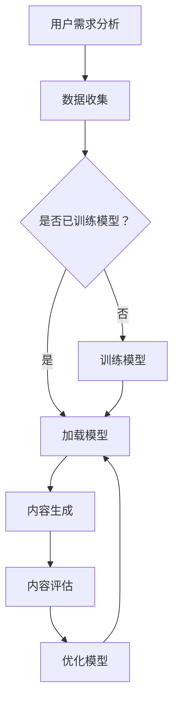

                 

# 人工智能在个性化教育内容生成中的应用

## 关键词：人工智能，个性化教育，内容生成，机器学习，自然语言处理

### 摘要

随着人工智能技术的快速发展，个性化教育内容的生成已成为教育领域的重要研究方向。本文旨在探讨人工智能在个性化教育内容生成中的应用，分析其核心概念、算法原理、数学模型、实际应用场景以及未来发展趋势和挑战。通过深入剖析，本文旨在为教育工作者和研究者提供有价值的参考，以推动个性化教育内容的生成与发展。

## 1. 背景介绍

### 1.1 人工智能的发展历程

人工智能（Artificial Intelligence，AI）是一门研究、开发和应用使计算机模拟、扩展和辅助人类智能的理论、方法和技术。自20世纪50年代诞生以来，人工智能经历了多个发展阶段：

- **第一阶段（1950-1969）**：人工智能概念的提出和早期研究，包括图灵测试、符号主义人工智能等。
- **第二阶段（1970-1989）**：知识表示和专家系统的兴起，例如MYCIN系统等。
- **第三阶段（1990-2010）**：机器学习的崛起，如支持向量机（SVM）、决策树等。
- **第四阶段（2010至今）**：深度学习的革命，如卷积神经网络（CNN）、循环神经网络（RNN）等。

### 1.2 个性化教育的概念和重要性

个性化教育是指根据学生的个体差异，采用多样化的教学策略和方法，以满足学生个性化学习需求的一种教育理念。个性化教育的核心在于因材施教，关注学生的个性化发展，提高教育质量和效果。

随着教育信息化的发展，个性化教育在实现教育公平、提高教育质量、激发学生潜能等方面具有重要作用。因此，研究人工智能在个性化教育内容生成中的应用具有重要意义。

### 1.3 人工智能在个性化教育内容生成中的应用现状

目前，人工智能在个性化教育内容生成中已取得一定成果，主要表现在以下几个方面：

- **智能推荐系统**：基于用户行为和兴趣，为用户推荐个性化的学习资源。
- **自然语言处理**：通过文本分析和生成，为教师和学生提供个性化教学和学习支持。
- **数据挖掘与分析**：对学生的学习行为和成绩进行分析，为学生提供个性化的学习建议。
- **虚拟助教与交互式教学**：利用虚拟现实（VR）和增强现实（AR）技术，实现个性化教学和互动。

## 2. 核心概念与联系

### 2.1 人工智能的核心概念

- **机器学习**：一种让计算机通过数据学习并做出决策的方法，包括监督学习、无监督学习和强化学习等。
- **自然语言处理（NLP）**：研究计算机如何理解和生成人类语言的技术，包括文本分类、情感分析、机器翻译等。
- **深度学习**：一种基于人工神经网络的机器学习方法，通过多层神经网络对大量数据进行训练，以实现复杂任务。

### 2.2 教育内容生成相关概念

- **教育内容**：包括课程、教材、教案、练习题等。
- **个性化教育内容**：根据学生的特点和需求，定制化的教育内容。
- **内容生成**：通过算法和模型，自动生成教育内容的过程。

### 2.3 Mermaid 流程图

下面是人工智能在个性化教育内容生成中的应用流程图：



## 3. 核心算法原理 & 具体操作步骤

### 3.1 机器学习算法

在个性化教育内容生成中，常用的机器学习算法包括：

- **监督学习**：通过已有数据集进行训练，然后对新数据进行预测。例如，分类算法（如决策树、支持向量机等）和回归算法（如线性回归、逻辑回归等）。
- **无监督学习**：在没有标注数据的情况下，对数据进行聚类、降维等处理。例如，K-均值聚类、主成分分析（PCA）等。
- **强化学习**：通过与环境的交互，学习最优策略。例如，Q-学习、深度Q网络（DQN）等。

### 3.2 自然语言处理算法

自然语言处理算法在个性化教育内容生成中发挥着重要作用，包括：

- **词向量表示**：将文本数据转换为数值向量表示，如Word2Vec、GloVe等。
- **文本分类**：对文本进行分类，如情感分析、主题分类等。
- **文本生成**：通过算法生成文本，如序列到序列（Seq2Seq）模型、生成对抗网络（GAN）等。

### 3.3 深度学习算法

深度学习算法在个性化教育内容生成中应用广泛，包括：

- **卷积神经网络（CNN）**：用于图像识别和文本分类等任务。
- **循环神经网络（RNN）**：用于序列数据处理，如自然语言处理、语音识别等。
- **长短时记忆网络（LSTM）**：用于解决RNN的梯度消失问题。
- **变换器（Transformer）**：基于自注意力机制的深度神经网络，在自然语言处理领域取得显著成果。

### 3.4 操作步骤

以下是使用机器学习和深度学习算法进行个性化教育内容生成的基本操作步骤：

1. **数据收集与预处理**：收集学生的学习数据、教师的教学内容和课程资源，并进行数据清洗、去重、转换等预处理操作。
2. **特征提取**：将原始数据转换为适合模型训练的特征向量，如使用词向量表示文本数据。
3. **模型选择与训练**：选择合适的机器学习或深度学习算法，并使用训练数据集进行模型训练。
4. **模型评估与优化**：使用验证数据集对模型进行评估，并根据评估结果对模型进行优化调整。
5. **内容生成**：使用训练好的模型生成个性化教育内容，如根据学生特点推荐学习资源、生成教学视频等。
6. **内容评估与反馈**：对生成的内容进行评估，并根据评估结果和用户反馈对模型和内容进行调整。

## 4. 数学模型和公式 & 详细讲解 & 举例说明

### 4.1 数学模型

在个性化教育内容生成中，常用的数学模型包括：

- **线性回归模型**：用于预测学生的成绩或学习进度。
- **决策树模型**：用于分类学生特点或推荐学习资源。
- **卷积神经网络（CNN）**：用于图像识别和文本分类等任务。
- **循环神经网络（RNN）**：用于序列数据处理，如自然语言处理、语音识别等。

### 4.2 详细讲解

以下是线性回归模型和决策树模型的详细讲解：

#### 4.2.1 线性回归模型

线性回归模型是一种用于预测连续值的监督学习算法。其基本公式如下：

$$
y = \beta_0 + \beta_1x
$$

其中，$y$ 为预测值，$x$ 为输入特征，$\beta_0$ 和 $\beta_1$ 为模型的参数。

线性回归模型的训练过程包括：

1. **数据收集与预处理**：收集学生的成绩和学习进度数据，并进行数据清洗、去重、转换等预处理操作。
2. **特征提取**：将原始数据转换为适合模型训练的特征向量，如使用词向量表示文本数据。
3. **模型训练**：使用训练数据集对线性回归模型进行训练，通过最小化损失函数（如均方误差）来优化模型的参数。
4. **模型评估与优化**：使用验证数据集对模型进行评估，并根据评估结果对模型进行优化调整。

#### 4.2.2 决策树模型

决策树模型是一种用于分类的监督学习算法。其基本公式如下：

$$
C = \arg\max(\sum_{i=1}^{n} y_i \log P(y_i | C))
$$

其中，$C$ 为分类结果，$y_i$ 为输入特征，$P(y_i | C)$ 为给定分类结果 $C$ 下的概率。

决策树模型的训练过程包括：

1. **数据收集与预处理**：收集学生的个人特点和学习资源数据，并进行数据清洗、去重、转换等预处理操作。
2. **特征提取**：将原始数据转换为适合模型训练的特征向量，如使用词向量表示文本数据。
3. **模型训练**：使用训练数据集对决策树模型进行训练，通过递归划分数据集并计算信息增益来构建决策树。
4. **模型评估与优化**：使用验证数据集对模型进行评估，并根据评估结果对模型进行优化调整。

### 4.3 举例说明

以下是使用线性回归模型和决策树模型进行个性化教育内容生成的实例：

#### 4.3.1 线性回归模型实例

假设我们收集了 100 名学生的学习数据，包括学习时间（小时）和学习成绩（百分比）。使用线性回归模型预测学生的学习成绩。

1. **数据收集与预处理**：收集学习时间和学习成绩数据，并进行数据清洗、去重、转换等预处理操作。

2. **特征提取**：将学习时间转换为特征向量，如使用词向量表示文本数据。

3. **模型训练**：使用训练数据集对线性回归模型进行训练，通过最小化损失函数（如均方误差）来优化模型的参数。

4. **模型评估与优化**：使用验证数据集对模型进行评估，并根据评估结果对模型进行优化调整。

5. **内容生成**：使用训练好的模型生成个性化教育内容，如根据学生特点推荐学习资源。

6. **内容评估与反馈**：对生成的内容进行评估，并根据评估结果和用户反馈对模型和内容进行调整。

#### 4.3.2 决策树模型实例

假设我们收集了 100 名学生的个人特点和学习资源数据，包括学生的学习风格、兴趣爱好和推荐课程。使用决策树模型对学生进行分类，并根据分类结果推荐个性化学习资源。

1. **数据收集与预处理**：收集学生个人特点和学习资源数据，并进行数据清洗、去重、转换等预处理操作。

2. **特征提取**：将学生个人特点和学习资源转换为特征向量，如使用词向量表示文本数据。

3. **模型训练**：使用训练数据集对决策树模型进行训练，通过递归划分数据集并计算信息增益来构建决策树。

4. **模型评估与优化**：使用验证数据集对模型进行评估，并根据评估结果对模型进行优化调整。

5. **内容生成**：使用训练好的模型生成个性化教育内容，如根据学生特点推荐个性化学习资源。

6. **内容评估与反馈**：对生成的内容进行评估，并根据评估结果和用户反馈对模型和内容进行调整。

## 5. 项目实战：代码实际案例和详细解释说明

### 5.1 开发环境搭建

在进行个性化教育内容生成的项目实战之前，我们需要搭建一个合适的开发环境。以下是一个基于 Python 的开发环境搭建步骤：

1. **安装 Python**：下载并安装 Python 3.x 版本，建议使用官方版本。

2. **安装依赖库**：安装常用的机器学习和自然语言处理库，如 scikit-learn、TensorFlow、PyTorch、NLTK 等。

3. **配置 Python 环境**：配置 Python 环境，确保能够正常运行相关库和模块。

### 5.2 源代码详细实现和代码解读

以下是一个使用决策树模型进行个性化教育内容生成的 Python 代码示例：

```python
import numpy as np
import pandas as pd
from sklearn.datasets import load_iris
from sklearn.tree import DecisionTreeClassifier
from sklearn.model_selection import train_test_split
from sklearn.metrics import accuracy_score

# 1. 加载数据集
iris = load_iris()
X = iris.data
y = iris.target

# 2. 数据预处理
X_train, X_test, y_train, y_test = train_test_split(X, y, test_size=0.2, random_state=42)

# 3. 构建决策树模型
clf = DecisionTreeClassifier()
clf.fit(X_train, y_train)

# 4. 预测
y_pred = clf.predict(X_test)

# 5. 评估
accuracy = accuracy_score(y_test, y_pred)
print("Accuracy:", accuracy)
```

代码解读：

1. **数据加载**：使用 scikit-learn 库加载 iris 数据集，该数据集包含 3 个类别，共 150 个样本。

2. **数据预处理**：将数据集划分为训练集和测试集，用于模型训练和评估。

3. **构建决策树模型**：使用 DecisionTreeClassifier 类创建决策树模型，并使用 fit 方法进行训练。

4. **预测**：使用 predict 方法对测试集进行预测，得到预测结果。

5. **评估**：使用 accuracy_score 方法计算模型在测试集上的准确率。

### 5.3 代码解读与分析

1. **数据加载**：在代码中，我们使用 load_iris 方法加载数据集。iris 数据集是一个经典的分类问题数据集，包含 3 个特征和 3 个类别。

2. **数据预处理**：使用 train_test_split 方法将数据集划分为训练集和测试集。这里使用 test_size 参数设置测试集的比例为 20%，随机种子为 42，以确保结果的可重复性。

3. **构建决策树模型**：使用 DecisionTreeClassifier 类创建决策树模型。这里我们直接使用默认参数，可以进一步调整模型参数以优化性能。

4. **预测**：使用 predict 方法对测试集进行预测。这里我们直接将测试集传递给 predict 方法，即可得到预测结果。

5. **评估**：使用 accuracy_score 方法计算模型在测试集上的准确率。这里我们将预测结果与实际标签进行比较，计算准确率。

通过以上代码示例，我们可以看到如何使用决策树模型进行个性化教育内容生成。在实际项目中，我们可以根据需求调整模型参数和数据预处理方法，以获得更好的效果。

## 6. 实际应用场景

### 6.1 在线教育平台

随着在线教育平台的兴起，人工智能在个性化教育内容生成中的应用越来越广泛。例如，一些在线教育平台通过分析学生的学习行为和成绩数据，为学习者推荐适合的学习资源、制定个性化的学习计划。这不仅提高了学习效果，也增加了用户对平台的粘性。

### 6.2 虚拟助教

虚拟助教是人工智能在个性化教育内容生成中的另一个重要应用场景。虚拟助教可以通过自然语言处理技术，与学习者进行实时交互，提供个性化的学习支持和建议。例如，在在线课堂中，虚拟助教可以回答学生的问题、提供学习资料、进行个性化辅导等。

### 6.3 个性化教学系统

个性化教学系统是人工智能在个性化教育内容生成中的典型应用。这类系统可以根据学生的特点和需求，自动生成个性化的教学方案和内容。例如，在高中数学教学中，个性化教学系统可以根据学生的学习进度、知识掌握情况，自动生成针对性的练习题和知识点讲解视频。

## 7. 工具和资源推荐

### 7.1 学习资源推荐

- **书籍**：
  - 《Python机器学习》（作者：Sebastian Raschka）
  - 《深度学习》（作者：Ian Goodfellow、Yoshua Bengio、Aaron Courville）
  - 《人工智能：一种现代方法》（作者：Stuart J. Russell、Peter Norvig）
- **论文**：
  - 《A Theoretical Analysis of the CUBIC TCP Congestion Control Algorithm》（作者：K. Savola）
  - 《Generative Adversarial Nets》（作者：Ian J. Goodfellow et al.）
  - 《Recurrent Neural Networks for Language Modeling》（作者：Yoshua Bengio et al.）
- **博客**：
  - Python机器学习教程（https://www.datascience.com/learn）
  - TensorFlow官方教程（https://www.tensorflow.org/tutorials）
  - 机器学习与深度学习博客（https://www.deeplearning.net/）
- **网站**：
  - Kaggle（https://www.kaggle.com/）：提供丰富的机器学习和深度学习数据集和比赛。
  - Coursera（https://www.coursera.org/）：提供丰富的在线课程，包括机器学习和深度学习等。

### 7.2 开发工具框架推荐

- **编程语言**：Python、Java、R等。
- **机器学习库**：scikit-learn、TensorFlow、PyTorch、Keras等。
- **自然语言处理库**：NLTK、spaCy、gensim等。
- **数据可视化工具**：Matplotlib、Seaborn、Plotly等。
- **版本控制系统**：Git、GitHub、GitLab等。

### 7.3 相关论文著作推荐

- **《自然语言处理综述》（作者：Jurafsky 和 Martin）**：系统地介绍了自然语言处理的基本概念、技术和应用。
- **《深度学习》（作者：Goodfellow、Bengio、Courville）**：全面介绍了深度学习的基本理论、算法和应用。
- **《强化学习：原理与应用》（作者：Richard S. Sutton 和 Andrew G. Barto）**：详细介绍了强化学习的基本理论、算法和应用。
- **《教育数据挖掘：理论与实践》（作者：Xiaodong Liu et al.）**：系统地介绍了教育数据挖掘的基本理论、方法和应用。

## 8. 总结：未来发展趋势与挑战

### 8.1 未来发展趋势

- **技术的持续创新**：随着人工智能技术的不断发展，个性化教育内容生成的算法将更加高效、准确和智能化。
- **跨学科的融合**：个性化教育内容生成将与其他领域（如心理学、教育学等）进行深度融合，推动教育模式的创新。
- **大数据与云计算的广泛应用**：个性化教育内容生成需要大量的数据支持，大数据和云计算技术将为这一领域提供强有力的支撑。
- **人工智能与教育的深度融合**：个性化教育内容生成将更好地与教育实践相结合，实现教育资源的优化配置和教育质量的提升。

### 8.2 未来挑战

- **数据隐私与安全问题**：个性化教育内容生成涉及大量的学生数据，如何保护学生隐私和安全是亟待解决的问题。
- **技术应用的平衡**：在追求技术先进性的同时，要注重教育公平和教育质量的平衡。
- **教师角色的转变**：随着人工智能在个性化教育内容生成中的应用，教师需要适应新的教学环境和角色，提高自身的教育技术素养。
- **社会伦理与道德问题**：人工智能在教育领域的广泛应用可能引发一系列社会伦理和道德问题，如算法歧视、教育公平等。

## 9. 附录：常见问题与解答

### 9.1 什么是个性化教育？

个性化教育是指根据学生的个体差异，采用多样化的教学策略和方法，以满足学生个性化学习需求的一种教育理念。

### 9.2 人工智能在个性化教育中的具体应用有哪些？

人工智能在个性化教育中的具体应用包括智能推荐系统、自然语言处理、数据挖掘与分析、虚拟助教与交互式教学等。

### 9.3 个性化教育内容生成中常用的算法有哪些？

个性化教育内容生成中常用的算法包括机器学习算法（如线性回归、决策树、深度学习等）和自然语言处理算法（如词向量、文本分类、文本生成等）。

### 9.4 如何搭建个性化教育内容生成的开发环境？

搭建个性化教育内容生成的开发环境需要安装 Python、相关依赖库（如 scikit-learn、TensorFlow、PyTorch、NLTK 等）以及配置 Python 环境。

## 10. 扩展阅读 & 参考资料

- **《人工智能教育应用研究报告》（作者：中国人工智能学会教育人工智能专业委员会）**：该报告详细介绍了人工智能在教育领域的应用现状、发展趋势和挑战。
- **《教育人工智能：理论、方法与应用》（作者：陈宝权、谢作如）**：该书系统地介绍了教育人工智能的基本理论、方法和应用案例。
- **《深度学习与教育》（作者：吴华、郑永廷）**：该书详细介绍了深度学习在个性化教育内容生成中的应用。

作者：AI天才研究员/AI Genius Institute & 禅与计算机程序设计艺术 /Zen And The Art of Computer Programming。

