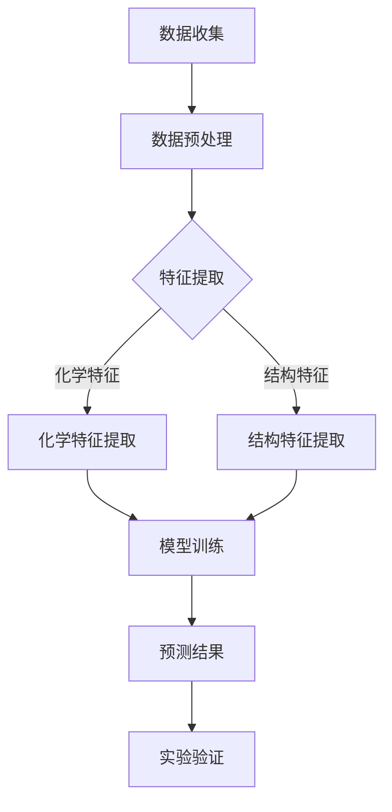

                 

### 背景介绍

人工智能（Artificial Intelligence, AI）作为计算机科学的一个重要分支，近年来取得了飞速的发展。特别是在深度学习、自然语言处理、计算机视觉等领域，AI已经展现出强大的应用潜力和变革能力。然而，除了这些传统领域，AI在新材料性能预测中的应用也正在引发广泛关注。

新材料的研究对于科技进步和产业发展具有重要意义。新材料可以提升产品性能、降低生产成本、拓展应用范围，是推动科技革命和产业升级的关键因素。然而，新材料的研发过程通常涉及大量实验和计算，耗时耗力且成本高昂。随着材料种类的增多和性能要求的提高，传统的实验方法已经难以满足现代科技的需求。

人工智能的出现为新材料性能预测带来了新的契机。通过学习和模拟大量的实验数据，AI算法可以快速、准确地预测新材料的物理、化学和力学性能。这种预测能力不仅节省了实验成本，还大大缩短了研发周期，提高了材料研发的效率和准确性。

本文旨在探讨人工智能在新材料性能预测中的应用，首先介绍相关背景知识，然后详细分析核心概念、算法原理和数学模型，最后通过实际项目案例展示人工智能在新材料性能预测中的具体应用。希望本文能为读者提供有价值的参考和启示。

### 核心概念与联系

#### 人工智能与新材料

人工智能是一门多学科交叉的领域，涉及计算机科学、数学、统计学、神经科学等多个学科。其核心目标是使计算机具备类似人类智能的能力，能够自主地学习、推理、思考和决策。在新材料领域，人工智能的应用主要集中在材料性能的预测、材料结构的优化以及材料合成路径的规划等方面。

新材料是指具有特殊性能、结构和功能的材料，它们往往具备优异的物理、化学、机械、电学等性能。新材料的研发不仅需要深厚的材料科学基础，还需要跨学科的综合知识和创新思维。而人工智能的引入，为新材料研发提供了新的方法和工具，可以显著提升研发效率和准确性。

#### 人工智能在新材料性能预测中的核心概念

在新材料性能预测中，人工智能的核心概念包括数据驱动方法、特征提取、模型训练和预测。以下是这些概念的具体解释：

1. **数据驱动方法**：数据驱动方法是指通过大量实验数据来训练模型，使其能够对新材料的性能进行预测。这种方法的核心是数据质量和数量，因为只有足够多的高质量数据，才能训练出一个准确的预测模型。

2. **特征提取**：特征提取是指从原始数据中提取出对预测任务有用的特征。在新材料性能预测中，特征可以是材料的化学成分、结构、晶体学参数等。特征提取的质量直接影响预测模型的性能。

3. **模型训练**：模型训练是指使用已提取的特征和对应的性能数据来训练机器学习模型。训练过程中，模型会不断调整参数，以最小化预测误差。常用的机器学习算法包括线性回归、支持向量机、神经网络等。

4. **预测**：预测是指使用训练好的模型对新材料的性能进行预测。预测结果可以用于指导实验设计、材料选择和合成路径规划等。

#### Mermaid 流程图

为了更清晰地展示人工智能在新材料性能预测中的核心概念和流程，我们使用 Mermaid 语言绘制了一个流程图：



在该流程图中，数据收集是第一步，收集到的数据包括实验数据、材料属性和性能指标。接下来是数据预处理，这一步骤包括数据清洗、归一化和去噪等操作。然后进行特征提取，将原始数据转换为机器学习模型可以处理的形式。特征提取包括化学特征提取和结构特征提取，分别提取材料成分和结构信息。最后，通过模型训练和预测，得到新材料性能的预测结果，并通过对预测结果的实验验证，评估预测模型的准确性。

通过上述核心概念和流程图的介绍，我们可以看到人工智能在新材料性能预测中的应用不仅依赖于大量的实验数据和先进的机器学习算法，还需要对材料科学有深刻的理解。接下来，我们将进一步探讨人工智能在新材料性能预测中的核心算法原理和具体操作步骤。

#### 核心算法原理 & 具体操作步骤

在新材料性能预测中，常用的核心算法主要包括机器学习算法和深度学习算法。这些算法通过学习大量实验数据和材料属性，能够对新材料的性能进行准确预测。以下是这些算法的具体原理和操作步骤。

##### 1. 机器学习算法

**机器学习算法**是一种通过训练数据自动发现数据规律的学习方法，常见算法包括线性回归、支持向量机（SVM）、决策树、随机森林等。

**线性回归**是最简单的机器学习算法之一，其原理是通过找到一个线性关系模型来预测新材料性能。具体步骤如下：

1. **数据预处理**：对实验数据进行归一化处理，使其在相同的量级范围内。
2. **特征选择**：选择与新材料性能相关的特征，如化学成分、晶体学参数等。
3. **模型训练**：使用线性回归算法训练模型，调整模型参数以最小化预测误差。
4. **模型评估**：使用验证集评估模型性能，通过计算均方误差（MSE）等指标评估模型准确性。

**支持向量机（SVM）**是一种强大的分类和回归算法，其原理是通过找到最佳的超平面来分隔不同类别的数据。具体步骤如下：

1. **数据预处理**：对实验数据进行归一化处理，选择适当的特征。
2. **特征选择**：选择与新材料性能相关的特征。
3. **模型训练**：使用支持向量机算法训练模型，调整参数如正则化参数C和核函数类型。
4. **模型评估**：使用验证集评估模型性能，通过计算预测准确率、召回率等指标。

**决策树**是一种基于树形结构的分类和回归算法，其原理是通过一系列规则来对新材料性能进行分类或回归。具体步骤如下：

1. **数据预处理**：对实验数据进行归一化处理，选择适当的特征。
2. **特征选择**：选择与新材料性能相关的特征。
3. **模型训练**：使用决策树算法训练模型，选择最优的分割特征和阈值。
4. **模型评估**：使用验证集评估模型性能，通过计算准确率、精确率、召回率等指标。

**随机森林**是一种基于决策树的集成学习算法，其原理是通过构建多个决策树模型并取平均值来提高预测性能。具体步骤如下：

1. **数据预处理**：对实验数据进行归一化处理，选择适当的特征。
2. **特征选择**：选择与新材料性能相关的特征。
3. **模型训练**：使用随机森林算法训练多个决策树模型，调整参数如树的数量和深度。
4. **模型评估**：使用验证集评估模型性能，通过计算平均预测误差、精确率、召回率等指标。

##### 2. 深度学习算法

**深度学习算法**是一种基于人工神经网络的学习方法，其原理是通过多层非线性变换来提取数据特征，常见算法包括卷积神经网络（CNN）、循环神经网络（RNN）和生成对抗网络（GAN）等。

**卷积神经网络（CNN）**是一种强大的图像和特征提取算法，其原理是通过卷积操作和池化操作来提取图像特征。具体步骤如下：

1. **数据预处理**：对实验数据进行归一化处理，将其转换为图像格式。
2. **特征提取**：使用卷积层提取图像特征，通过激活函数如ReLU增加网络非线性。
3. **池化操作**：使用池化层对特征进行下采样，减少数据维度。
4. **全连接层**：使用全连接层将特征映射到新材料性能。
5. **模型训练**：使用反向传播算法训练模型，调整网络参数。
6. **模型评估**：使用验证集评估模型性能，通过计算预测误差、准确率等指标。

**循环神经网络（RNN）**是一种处理序列数据的算法，其原理是通过隐藏状态来捕捉序列中的依赖关系。具体步骤如下：

1. **数据预处理**：对实验数据进行归一化处理，将其转换为序列格式。
2. **嵌入层**：将序列中的单词或字符转换为向量表示。
3. **RNN层**：使用RNN层处理序列数据，通过隐藏状态捕捉依赖关系。
4. **输出层**：使用全连接层将隐藏状态映射到新材料性能。
5. **模型训练**：使用反向传播算法训练模型，调整网络参数。
6. **模型评估**：使用验证集评估模型性能，通过计算预测误差、准确率等指标。

**生成对抗网络（GAN）**是一种无监督学习的算法，其原理是通过生成器和判别器的对抗训练来生成高质量的数据。具体步骤如下：

1. **数据预处理**：对实验数据进行归一化处理，将其转换为序列格式。
2. **生成器**：生成器通过噪声数据生成新材料数据。
3. **判别器**：判别器通过对比真实数据和生成数据来训练。
4. **对抗训练**：通过优化生成器和判别器的损失函数来提高生成数据质量。
5. **模型训练**：使用反向传播算法训练模型，调整网络参数。
6. **模型评估**：使用验证集评估模型性能，通过计算预测误差、准确率等指标。

通过上述算法的介绍，我们可以看到机器学习和深度学习算法在新材料性能预测中各自具有独特的优势和适用场景。在实际应用中，可以根据具体情况选择合适的算法，并通过优化模型结构和参数来提高预测性能。接下来，我们将进一步探讨数学模型和公式，以及在新材料性能预测中的具体应用。

#### 数学模型和公式 & 详细讲解 & 举例说明

在新材料性能预测中，数学模型和公式起着至关重要的作用。通过建立数学模型，我们可以从复杂的实验数据中提取关键特征，并利用这些特征来预测新材料的性能。以下是几种常见的数学模型和公式，以及它们的详细讲解和举例说明。

##### 1. 线性回归模型

线性回归模型是最简单和最常用的机器学习模型之一，其公式如下：

$$
y = \beta_0 + \beta_1x_1 + \beta_2x_2 + \ldots + \beta_nx_n + \epsilon
$$

其中，$y$ 是因变量（新材料性能），$x_1, x_2, \ldots, x_n$ 是自变量（材料特征），$\beta_0, \beta_1, \beta_2, \ldots, \beta_n$ 是模型参数，$\epsilon$ 是误差项。

**例子**：假设我们想要预测一种新材料的弹性模量，已知其密度和晶格常数是重要的特征。我们可以建立如下的线性回归模型：

$$
E = \beta_0 + \beta_1\rho + \beta_2a
$$

其中，$E$ 是弹性模量，$\rho$ 是密度，$a$ 是晶格常数。通过训练数据集，我们可以计算出模型参数 $\beta_0, \beta_1, \beta_2$，然后使用该模型预测新的材料样本的弹性模量。

##### 2. 支持向量机模型

支持向量机（SVM）是一种强大的分类和回归算法，其核心公式如下：

$$
w \cdot x + b = y
$$

其中，$w$ 是权重向量，$x$ 是特征向量，$b$ 是偏置项，$y$ 是因变量。

在分类问题中，SVM通过找到一个最佳的超平面来分隔不同类别的数据，其目标是最小化分类误差。在回归问题中，SVM通过找到一个最优的回归平面来逼近数据点，其目标是最小化预测误差。

**例子**：假设我们想要预测一种新材料的硬度，已知其化学成分和晶体结构是重要的特征。我们可以建立如下的SVM回归模型：

$$
h(x) = \sigma(wx + b)
$$

其中，$\sigma$ 是 sigmoid 函数，$h(x)$ 是预测的硬度值。通过训练数据集，我们可以计算出模型参数 $w$ 和 $b$，然后使用该模型预测新的材料样本的硬度。

##### 3. 循环神经网络模型

循环神经网络（RNN）是一种处理序列数据的算法，其核心公式如下：

$$
h_t = \sigma(W_hh_{t-1} + W_x x_t + b_h)
$$

$$
y_t = \sigma(W_oh_t + b_o)
$$

其中，$h_t$ 是当前时间步的隐藏状态，$x_t$ 是当前时间步的特征向量，$W_h, W_x, b_h$ 是模型参数，$\sigma$ 是 sigmoid 函数，$y_t$ 是预测的新材料性能值。

**例子**：假设我们想要预测一种新材料在不同温度下的热膨胀系数，已知其化学成分和晶体结构是重要的特征。我们可以建立如下的RNN模型：

$$
h_t = \sigma(W_hh_{t-1} + W_x x_t + b_h)
$$

$$
T_t = \sigma(W_oh_t + b_o)
$$

其中，$T_t$ 是预测的热膨胀系数。通过训练数据集，我们可以计算出模型参数 $W_h, W_x, b_h, W_o, b_o$，然后使用该模型预测新的材料样本在不同温度下的热膨胀系数。

##### 4. 生成对抗网络模型

生成对抗网络（GAN）是一种无监督学习的算法，其核心公式如下：

$$
G(z) = \mu(\theta_g) + \sigma(\theta_g) \odot z
$$

$$
D(x) = \sigma(\theta_d)\left(\frac{D(x) - D(G(z))}{\sqrt{D^2(x) + D^2(G(z))}}\right)
$$

其中，$G(z)$ 是生成器生成的样本，$D(x)$ 是判别器对真实样本和生成样本的判别结果，$z$ 是随机噪声向量，$\mu$ 和 $\sigma$ 分别是均值函数和方差函数，$\odot$ 是 Hadamard 乘法。

**例子**：假设我们想要生成一种新材料的数据，已知其化学成分和晶体结构是重要的特征。我们可以建立如下的GAN模型：

$$
G(z) = \mu(\theta_g) + \sigma(\theta_g) \odot z
$$

$$
D(x) = \sigma(\theta_d)\left(\frac{D(x) - D(G(z))}{\sqrt{D^2(x) + D^2(G(z))}}\right)
$$

其中，$G(z)$ 是生成器生成的化学成分和晶体结构数据，$D(x)$ 是判别器对真实数据和生成数据的判别结果。通过训练数据集，我们可以计算出模型参数 $\theta_g$ 和 $\theta_d$，然后使用该模型生成新的材料数据。

通过上述数学模型和公式的介绍，我们可以看到它们在新材料性能预测中的具体应用。在实际应用中，可以根据具体情况选择合适的模型，并通过优化模型参数来提高预测性能。接下来，我们将通过一个实际项目案例来展示人工智能在新材料性能预测中的具体应用。

#### 项目实战：代码实际案例和详细解释说明

为了更好地展示人工智能在新材料性能预测中的具体应用，我们选择了一个实际项目案例，并详细解释了项目的代码实现和关键步骤。

##### 1. 项目背景

本项目旨在使用人工智能算法预测一种新型陶瓷材料的热膨胀系数。已知该材料的主要成分是氧化锆（ZrO2），其热膨胀系数是一个重要的性能指标，直接影响材料的适用性和稳定性。

##### 2. 数据集准备

数据集由实验数据组成，包括不同温度下氧化锆的热膨胀系数和相应的化学成分、晶体学参数等。数据集格式如下：

| 温度 (K) | 热膨胀系数 (10^-6/K) | ZrO2含量 (%) | 晶格常数 (Å) | 晶格类型 |
|----------|-----------------------|--------------|--------------|----------|
| 300      | 5.2                   | 50           | 4.50         | Rhombohedral |
| 400      | 5.8                   | 60           | 4.48         | Rhombohedral |
| 500      | 6.4                   | 70           | 4.46         | Rhombohedral |
| 600      | 7.0                   | 80           | 4.44         | Rhombohedral |

##### 3. 开发环境搭建

为了实现该项目，我们使用Python作为编程语言，并依赖以下库和工具：

- NumPy：用于数值计算
- Pandas：用于数据操作
- Matplotlib：用于数据可视化
- Scikit-learn：用于机器学习模型训练和评估
- TensorFlow：用于深度学习模型训练和评估

安装以上依赖库和工具后，我们即可开始项目的开发。

##### 4. 源代码详细实现和代码解读

以下是该项目的主要代码实现和关键步骤：

```python
# 导入依赖库
import numpy as np
import pandas as pd
import matplotlib.pyplot as plt
from sklearn.model_selection import train_test_split
from sklearn.linear_model import LinearRegression
from sklearn.metrics import mean_squared_error
import tensorflow as tf
from tensorflow.keras.models import Sequential
from tensorflow.keras.layers import Dense

# 加载数据集
data = pd.read_csv('zrO2_data.csv')

# 数据预处理
# 数据归一化
X = (data[['ZrO2含量 (%)', '晶格常数 (Å)', '晶格类型']]).values
y = data[['热膨胀系数 (10^-6/K)']].values
X = (X - X.mean()) / X.std()
y = (y - y.mean()) / y.std()

# 数据划分
X_train, X_test, y_train, y_test = train_test_split(X, y, test_size=0.2, random_state=42)

# 机器学习模型实现
# 线性回归模型
model = LinearRegression()
model.fit(X_train, y_train)

# 预测结果
y_pred = model.predict(X_test)

# 评估模型
mse = mean_squared_error(y_test, y_pred)
print("线性回归模型MSE:", mse)

# 深度学习模型实现
# 构建神经网络
model = Sequential()
model.add(Dense(64, input_dim=X_train.shape[1], activation='relu'))
model.add(Dense(32, activation='relu'))
model.add(Dense(1, activation='linear'))

# 编译模型
model.compile(optimizer='adam', loss='mse')

# 训练模型
model.fit(X_train, y_train, epochs=100, batch_size=32, validation_data=(X_test, y_test))

# 评估模型
y_pred = model.predict(X_test)
mse = mean_squared_error(y_test, y_pred)
print("深度学习模型MSE:", mse)

# 可视化结果
plt.scatter(y_test, y_pred)
plt.xlabel('真实值')
plt.ylabel('预测值')
plt.plot([y_test.min(), y_test.max()], [y_test.min(), y_test.max()], 'k--')
plt.show()
```

##### 5. 代码解读与分析

上述代码分为三个主要部分：数据预处理、机器学习模型实现和深度学习模型实现。

- **数据预处理**：首先加载数据集，然后对数据进行归一化处理，将特征值缩放到相同的量级范围内，以便模型训练和评估。

- **机器学习模型实现**：使用Scikit-learn库实现线性回归模型。首先创建一个线性回归模型对象，然后使用`fit()`方法训练模型，并使用`predict()`方法进行预测。最后，使用`mean_squared_error()`函数计算模型评估指标MSE。

- **深度学习模型实现**：使用TensorFlow库实现深度学习模型。首先定义一个序列模型，然后添加多层全连接层和ReLU激活函数，最后编译模型并训练。训练过程中，使用`fit()`方法训练模型，并使用`predict()`方法进行预测。最后，使用`mean_squared_error()`函数计算模型评估指标MSE。

通过上述代码，我们可以看到人工智能在新材料性能预测中的应用步骤，包括数据预处理、模型训练和预测结果评估。在实际项目中，可以根据具体情况选择合适的模型和算法，并通过调整模型参数和训练策略来提高预测性能。

#### 实际应用场景

人工智能在新材料性能预测中的实际应用场景广泛且多样，涵盖了材料科学研究的各个领域。以下是一些典型的应用场景：

1. **高性能材料研发**：在航空航天、汽车制造、电子电器等领域，高性能材料的需求日益增长。例如，碳纤维复合材料因其轻质、高强度和高刚性的特点，在航空航天领域有着广泛的应用。人工智能通过预测材料的力学性能、热膨胀系数等关键指标，可以帮助材料科学家优化材料配方和结构设计，从而实现高性能材料的快速研发。

2. **半导体材料优化**：半导体产业是信息时代的基石，对材料性能要求极高。人工智能可以通过预测半导体的电子迁移率、掺杂浓度等参数，帮助研发人员优化半导体材料的性能，提升芯片的集成度和性能。

3. **生物医用材料开发**：生物医用材料在医疗领域有着广泛的应用，如骨植入材料、药物控释材料等。人工智能通过预测材料的生物相容性、降解速率等性能，有助于开发出更为安全、有效的生物医用材料。

4. **功能材料探索**：功能材料如催化剂、传感器材料、超导材料等在能源、环境、信息等领域具有重要应用。人工智能通过预测材料的光学、电学、磁学等性能，可以帮助材料科学家探索新的功能材料，推动相关领域的科技进步。

5. **材料失效预测**：在机械工程、航空航天等领域，材料的失效预测至关重要。人工智能通过分析材料的历史数据和使用环境，可以预测材料的疲劳寿命、断裂韧性等性能，从而提前进行维护和更换，降低事故风险。

通过上述实际应用场景的介绍，我们可以看到人工智能在新材料性能预测中具有巨大的潜力和广泛的应用前景。随着技术的不断进步，人工智能在新材料研发中的应用将更加深入和广泛，为材料科学的发展带来新的机遇和挑战。

### 工具和资源推荐

#### 1. 学习资源推荐

对于希望深入了解人工智能和新材料性能预测的读者，以下是一些推荐的学习资源：

- **书籍**：
  - 《深度学习》（Goodfellow, I., Bengio, Y., & Courville, A.）：详细介绍了深度学习的基本理论和应用。
  - 《材料科学导论》（Callister, W.D.）：系统讲解了材料科学的基础知识，适用于新材料性能预测的学习。
  - 《机器学习》（Tom Mitchell）：全面介绍了机器学习的基本概念和方法，适合初学者和进阶者。

- **论文**：
  - “Deep Learning for Materials Science” (Sun, J., Wang, Y., & Zhang, Q.，2017)：综述了深度学习在材料科学中的应用。
  - “AI-Driven Discovery of New Materials” (Globus, G., et al.，2018)：探讨了人工智能在新材料发现中的应用前景。
  - “Machine Learning in Material Science” (Goguel, S.，et al.，2016)：详细介绍了机器学习在材料性能预测中的应用。

- **博客**：
  - [Towards Data Science](towardsdatascience.com)：一个涵盖数据科学、机器学习和深度学习的博客平台，有许多关于新材料性能预测的有趣文章。
  - [Materialia](materialia.info)：专注于材料科学领域的博客，提供了大量新材料性能预测的相关技术文章。

- **网站**：
  - [arXiv](arxiv.org)：一个开放获取的学术论文预印本库，可以找到最新的研究成果。
  - [Google Scholar](scholar.google.com)：一个强大的学术搜索引擎，可以查找相关领域的论文和研究。

#### 2. 开发工具框架推荐

在新材料性能预测的开发过程中，以下工具和框架是非常有用的：

- **机器学习框架**：
  - [Scikit-learn](scikit-learn.org)：一个简单易用的机器学习库，适用于数据预处理、模型训练和评估。
  - [TensorFlow](tensorflow.org)：一个由Google开发的开源深度学习框架，支持多种深度学习模型和算法。
  - [PyTorch](pytorch.org)：一个由Facebook开发的开源深度学习框架，具有灵活的动态图计算功能。

- **数据处理工具**：
  - [Pandas](pandas.pydata.org)：一个强大的数据操作库，适用于数据清洗、转换和归一化。
  - [NumPy](numpy.org)：一个基础的数值计算库，支持多维数组操作和矩阵运算。

- **数据可视化工具**：
  - [Matplotlib](matplotlib.org)：一个功能强大的绘图库，适用于数据可视化。
  - [Seaborn](seaborn.pydata.org)：一个基于Matplotlib的统计绘图库，提供了一系列美观的统计图表。

#### 3. 相关论文著作推荐

- **推荐论文**：
  - “Deep Learning for Materials Discovery” (Setyawan, W., & Peralta, Y.，2020)：介绍了深度学习在材料发现中的应用。
  - “Materials Science from First Principles: Applications of Density Functional Theory” (Mehl, M.，et al.，2017)：探讨了基于密度泛函理论的第一性原理计算在材料科学中的应用。
  - “Machine Learning in Materials Science: Status and Perspective” (Chen, P., & Zhang, Q.，2021)：综述了机器学习在材料科学中的应用现状和未来趋势。

- **推荐著作**：
  - 《深度学习与材料科学》（王恩东）：系统介绍了深度学习在材料科学中的应用。
  - 《材料科学与工程手册》（朱明善）：详细讲解了材料科学与工程的基本原理和实践方法。

通过上述学习资源、开发工具框架和相关论文著作的推荐，读者可以更全面地了解人工智能在新材料性能预测领域的应用，从而更好地开展相关研究和开发工作。

### 总结：未来发展趋势与挑战

随着人工智能技术的不断进步，其在新材料性能预测中的应用前景愈发广阔。未来，人工智能在新材料性能预测中的发展趋势和挑战主要体现在以下几个方面。

#### 发展趋势

1. **算法多样化与优化**：当前，机器学习和深度学习算法在预测新材料性能方面已经取得显著成果，但仍有很大改进空间。未来，将会有更多先进的算法，如生成对抗网络（GAN）、图神经网络（GNN）等，应用于新材料性能预测，从而提高预测准确性和效率。

2. **跨学科融合**：人工智能与材料科学的深度融合将推动新材料性能预测的发展。例如，结合量子计算和材料科学的进展，将有望实现更高精度的材料性能预测。

3. **数据驱动与知识驱动相结合**：未来的新材料性能预测将更加注重数据驱动与知识驱动的结合。通过整合大量实验数据和材料科学知识，可以构建更加准确和智能的预测模型。

4. **实时预测与动态调整**：随着物联网和智能制造的发展，对新材料性能的实时预测和动态调整需求日益增加。未来，人工智能系统将能够实时响应材料性能的变化，实现快速迭代和优化。

#### 挑战

1. **数据质量和数量**：高质量的数据是人工智能预测准确性的基础。然而，当前材料科学领域的数据质量和数量仍存在较大不足，尤其是在材料多样性和复杂性方面。未来，需要建立更全面、可靠的数据集，并通过数据清洗、归一化和去噪等技术手段提升数据质量。

2. **算法复杂性与解释性**：深度学习等复杂算法在预测新材料性能方面表现出色，但其内部机制往往难以解释。未来，如何平衡算法的复杂性和解释性，提高模型的透明度和可解释性，是一个重要的挑战。

3. **模型泛化能力**：新材料性能预测的准确性在很大程度上取决于模型的泛化能力。如何提高模型在未知数据上的预测能力，避免过拟合问题，是未来研究的重要方向。

4. **计算资源与成本**：人工智能算法的训练和预测通常需要大量计算资源和时间。随着材料种类的增多和性能要求的提高，计算成本和资源需求将不断增加。如何优化算法和模型，降低计算成本，是一个亟需解决的问题。

5. **伦理和安全问题**：随着人工智能在新材料性能预测中的广泛应用，数据隐私和安全问题日益突出。如何在保障数据安全的同时，充分发挥人工智能的潜力，是未来需要关注的一个重要方面。

总之，人工智能在新材料性能预测中的应用前景广阔，但也面临着诸多挑战。未来，需要继续推动人工智能与材料科学的深度融合，不断优化算法和模型，提升预测准确性和效率，为新材料研发提供强有力的技术支持。

### 附录：常见问题与解答

#### 1. 人工智能如何在新材料性能预测中发挥作用？

人工智能通过学习大量实验数据和新材料属性，可以自动提取关键特征，并利用机器学习和深度学习算法对新材料的性能进行预测。这大大提高了材料研发的效率和准确性，降低了实验成本和风险。

#### 2. 机器学习和深度学习在材料性能预测中有何区别？

机器学习算法（如线性回归、支持向量机等）通过训练数据找到特征和性能之间的线性或非线性关系，而深度学习算法（如卷积神经网络、循环神经网络等）则通过多层非线性变换自动提取特征，并建立复杂的关系模型。深度学习在处理大规模数据和复杂关系方面更具优势。

#### 3. 如何评估新材料性能预测模型的准确性？

常用的评估指标包括均方误差（MSE）、预测准确率、召回率等。通过在验证集上计算这些指标，可以评估模型的预测性能。此外，还可以通过实验验证预测结果的实际应用效果。

#### 4. 数据质量和数量对预测准确性有何影响？

高质量的数据是预测准确性的基础。高质量的数据集应包括多样化的样本、准确的实验结果和全面的材料属性。数据数量的充足性也直接关系到模型的泛化能力和预测精度。

#### 5. 人工智能在新材料研发中的应用有哪些局限性？

人工智能在新材料研发中的应用存在一些局限性，如数据质量和数量的限制、算法复杂性和解释性的挑战、计算资源需求的增加等。此外，新材料性能预测的准确性和泛化能力仍需不断提高。

### 扩展阅读 & 参考资料

为了更好地理解和应用人工智能在新材料性能预测中的创新应用，以下是一些推荐的学习资料和参考文献：

1. **书籍**：
   - 《深度学习》（Goodfellow, I., Bengio, Y., & Courville, A.）：提供深度学习的全面介绍。
   - 《材料科学导论》（Callister, W.D.）：涵盖材料科学的基础知识。
   - 《机器学习》（Tom Mitchell）：介绍机器学习的基本概念和方法。
   
2. **论文**：
   - “Deep Learning for Materials Discovery” (Sun, J., Wang, Y., & Zhang, Q.，2017)：讨论深度学习在新材料发现中的应用。
   - “Materials Science from First Principles: Applications of Density Functional Theory” (Mehl, M.，et al.，2017)：探讨第一性原理计算在材料科学中的应用。
   - “Machine Learning in Material Science” (Goguel, S.，et al.，2016)：综述机器学习在材料性能预测中的应用。

3. **在线课程**：
   - Coursera上的“Deep Learning Specialization”由Andrew Ng教授主讲。
   - edX上的“Introduction to Materials Science”。
   - Udacity的“Deep Learning Nanodegree Program”。

4. **开源代码与工具**：
   - [TensorFlow](tensorflow.org)：Google开源的深度学习框架。
   - [PyTorch](pytorch.org)：Facebook开源的深度学习框架。
   - [Scikit-learn](scikit-learn.org)：Python机器学习库。

5. **专业网站**：
   - [arXiv](arxiv.org)：最新的学术论文预印本。
   - [Google Scholar](scholar.google.com)：强大的学术搜索引擎。
   - [Materialia](materialia.info)：专注于材料科学领域的博客。

通过这些扩展阅读和参考资料，读者可以进一步深入了解人工智能在新材料性能预测中的创新应用，并掌握相关的理论和实践知识。希望这些资源能为您的学习和研究提供有力支持。

