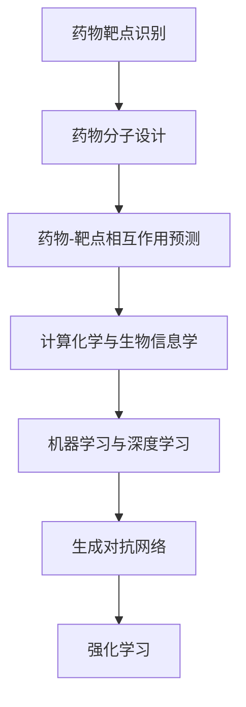
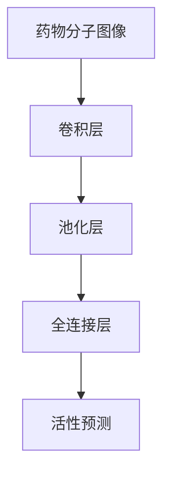
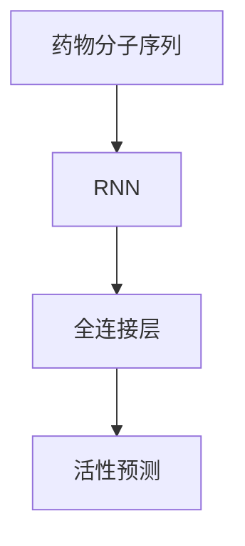
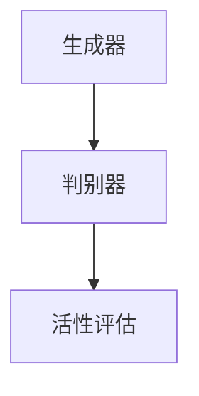
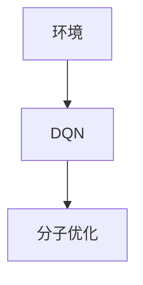

                 

### 背景介绍

在当今医疗领域，新药筛选与设计是一项关键且复杂的任务。传统的药物研发方法通常需要多年时间，耗费大量资金，且成功率相对较低。随着人工智能（AI）技术的迅速发展，特别是在机器学习和深度学习领域的突破，AI在新药筛选与设计中的应用变得越来越广泛和高效。本文将深入探讨人工智能在新药筛选与设计中的应用前景，详细分析其核心算法原理、数学模型、项目实战以及实际应用场景，并探讨未来的发展趋势与挑战。

新药筛选与设计的传统方法主要包括化学合成、生物实验以及统计建模等。然而，这些方法在处理大规模数据、分析复杂生物过程以及预测药物-目标相互作用方面存在诸多局限。而人工智能，特别是深度学习和机器学习算法，凭借其强大的数据处理和分析能力，为这一领域带来了革命性的变革。

### 人工智能的发展历程

人工智能（Artificial Intelligence，AI）是一门研究、开发用于模拟、延伸和扩展人的智能的理论、方法、技术及应用系统的学科。其发展历程可以追溯到20世纪50年代，当时计算机科学领域的先驱们开始探讨机器是否能够模拟人类智能。在接下来的几十年中，AI经历了几个重要阶段，包括符号主义（Symbolic AI）、连接主义（Connectionist AI）、统计学习（Statistical Learning）和最近兴起的深度学习（Deep Learning）。

1. **符号主义（Symbolic AI）**：这是早期的人工智能范式，基于符号推理和逻辑规则。代表性工作包括专家系统和知识表示方法，如产生式规则（Production Rules）和框架（Frames）。然而，这种方法存在知识获取困难、无法处理不确定性和知识表示能力有限等局限。

2. **连接主义（Connectionist AI）**：20世纪80年代，随着神经网络理论的兴起，连接主义成为AI研究的重要方向。神经网络通过模拟人脑神经元之间的连接，实现了对数据的高效处理和学习。然而，由于训练时间和计算资源限制，早期的神经网络在处理大规模数据时表现不佳。

3. **统计学习（Statistical Learning）**：统计学习方法的兴起标志着机器学习时代的到来。这种方法利用统计学理论，通过建立数学模型来预测和分类数据。其中包括支持向量机（SVM）、随机森林（Random Forests）等经典算法。

4. **深度学习（Deep Learning）**：深度学习是近年来AI领域的重大突破。它通过多层神经网络（Deep Neural Networks）对数据进行逐层抽象和特征提取，能够处理大量复杂的输入数据。深度学习的成功得益于大规模数据集和计算能力的提升，代表性算法包括卷积神经网络（CNN）和循环神经网络（RNN）。

随着深度学习的不断发展，AI在计算机视觉、自然语言处理、语音识别等领域取得了显著的成果。在新药筛选与设计中，深度学习算法同样展现出了强大的潜力。

### 人工智能在新药筛选与设计中的重要性

新药筛选与设计涉及多个复杂阶段，包括药物靶点的识别、药物分子的设计与优化、药物-靶点相互作用的预测等。人工智能在这一过程中发挥着关键作用，主要体现在以下几个方面：

1. **提高效率**：传统新药筛选方法通常需要大量的人力和时间。而人工智能算法可以自动化这些过程，显著提高筛选效率。例如，通过深度学习模型，可以在几分钟内预测大量候选药物分子的活性，大大缩短研发周期。

2. **降低成本**：药物研发是一个高成本的过程，人工智能的引入可以减少实验次数，降低失败风险，从而降低整体成本。此外，AI算法可以优化实验方案，减少资源浪费。

3. **提升成功率**：人工智能可以帮助研究人员发现潜在的药物靶点，并进行优化，提高新药研发的成功率。通过机器学习模型，可以分析海量生物数据，识别出潜在的药物-靶点相互作用，从而提高药物研发的成功率。

4. **应对复杂性**：新药研发过程中涉及大量的生物学、化学和物理学知识。人工智能算法可以处理这些复杂的信息，提供更加精确的预测和优化方案。

总之，人工智能在新药筛选与设计中具有重要的应用价值。随着技术的不断进步，AI在这一领域的潜力将得到进一步发挥。接下来，本文将详细探讨人工智能在新药筛选与设计中的应用原理和具体技术。

#### 新药筛选与设计中的关键步骤

在新药筛选与设计过程中，涉及多个关键步骤，每个步骤都离不开人工智能技术的支持。以下是新药研发的典型流程，以及人工智能在这些环节中的应用：

1. **药物靶点的识别**：
   - **传统方法**：药物靶点的识别通常依赖于生物信息学和实验生物学。研究人员通过基因表达分析、蛋白质组学等技术来筛选潜在的药物靶点。
   - **人工智能方法**：AI算法可以高效地处理大规模生物数据，利用机器学习模型对基因表达数据进行分析，预测可能的药物靶点。例如，基于深度学习的方法可以利用蛋白质序列和结构信息来识别潜在的药物靶点。

2. **药物分子的设计与优化**：
   - **传统方法**：药物分子的设计通常涉及化学合成、生物筛选等多个实验步骤。研究人员通过反复实验和调整，寻找具有潜在活性的分子。
   - **人工智能方法**：AI算法可以自动化药物分子的设计过程。通过生成对抗网络（GAN）和强化学习（Reinforcement Learning）等方法，AI能够生成大量候选分子，并筛选出具有较高活性、低毒性的分子。此外，基于分子对接（molecular docking）的深度学习模型可以预测药物分子与靶点的相互作用，从而优化药物分子结构。

3. **药物-靶点相互作用的预测**：
   - **传统方法**：药物-靶点相互作用的预测依赖于实验手段，如X射线晶体学、核磁共振（NMR）等。这些方法具有高成本、高时间消耗的特点。
   - **人工智能方法**：深度学习算法，如卷积神经网络（CNN）和循环神经网络（RNN），可以预测药物分子与靶点之间的结合亲和力。通过训练大规模的药物-靶点相互作用数据集，这些模型能够学习到药物与靶点之间的复杂相互作用模式，从而提高预测准确性。

4. **药物代谢和毒性分析**：
   - **传统方法**：药物代谢和毒性的评估通常需要大量的动物实验和细胞实验，成本高昂且耗时。
   - **人工智能方法**：AI算法可以利用生物信息学数据，如基因表达数据和代谢物谱，预测药物的代谢路径和潜在毒性。通过机器学习模型，可以快速评估候选药物的安全性和有效性，减少实验动物的使用。

5. **药物研发过程的优化**：
   - **传统方法**：药物研发过程涉及多个步骤，包括先导化合物的筛选、药代动力学（PK）研究、临床前评估等。这些步骤通常需要高度专业化的知识和经验。
   - **人工智能方法**：AI算法可以优化药物研发的每个步骤。例如，通过机器学习模型预测药物在不同组织中的分布，优化药物剂量；利用深度学习模型分析临床试验数据，预测药物的疗效和安全性。

总的来说，人工智能在新药筛选与设计中的应用大大提高了研发效率，降低了成本，并提高了药物研发的成功率。随着技术的不断进步，AI将在这一领域发挥更加重要的作用。

### 核心概念与联系

在新药筛选与设计过程中，理解以下几个核心概念及其相互关系至关重要：

#### 1. 药物靶点（Drug Targets）

药物靶点是药物作用的特定分子，通常是蛋白质、酶、受体或其他生物大分子。药物通过与其靶点结合，发挥治疗作用或产生副作用。识别药物靶点是新药研发的第一步，是筛选和设计药物分子的基础。

#### 2. 药物分子（Drug Molecules）

药物分子是指具有特定化学结构和药理活性的化合物。它们可以与药物靶点结合，抑制或激活特定的生物过程。药物分子的设计与优化是药物研发的关键环节，旨在提高药物的疗效和降低副作用。

#### 3. 药物-靶点相互作用（Drug-Target Interaction）

药物-靶点相互作用是指药物分子与药物靶点之间的物理和化学结合过程。这种相互作用决定了药物的疗效和安全性。理解药物-靶点相互作用的机制，对于优化药物分子结构和筛选有效药物具有重要意义。

#### 4. 计算化学与生物信息学

计算化学和生物信息学是新药筛选与设计的重要工具。计算化学利用量子化学和分子动力学模拟等方法，预测药物分子的物理化学性质和生物活性。生物信息学则通过分析生物数据，如基因组、蛋白质组、代谢组等，发现潜在的药物靶点和药物分子。

#### 5. 机器学习和深度学习

机器学习和深度学习是人工智能的重要分支，在新药筛选与设计中发挥着关键作用。机器学习算法可以处理和分析大量生物数据，预测药物-靶点相互作用和药物分子的活性。深度学习算法，如卷积神经网络（CNN）和循环神经网络（RNN），可以学习复杂的生物学特征，提高预测准确性。

#### 6. 生成对抗网络（GAN）和强化学习（RL）

生成对抗网络（GAN）和强化学习（RL）是近年来在药物分子设计和优化中新兴的方法。GAN可以通过生成和判别网络的对抗训练，生成大量具有多样性的药物分子。RL算法则通过模拟药物研发过程，优化药物分子的结构和活性。

#### Mermaid 流程图

以下是一个简化的 Mermaid 流程图，展示了新药筛选与设计中的核心概念及其相互关系：



通过这个流程图，我们可以更清晰地理解新药筛选与设计中的各个环节及其相互关系。接下来，本文将详细探讨人工智能在新药筛选与设计中的核心算法原理和具体操作步骤。

### 核心算法原理 & 具体操作步骤

在新药筛选与设计中，人工智能技术主要依赖于深度学习和机器学习算法。以下将介绍几种常用的核心算法原理及其具体操作步骤：

#### 1. 卷积神经网络（CNN）

卷积神经网络（CNN）是一种深度学习模型，特别适合处理具有网格结构的图像数据。在药物分子预测中，CNN可以用于识别药物分子的特征模式。

**原理**：
CNN通过卷积层、池化层和全连接层对输入数据进行处理。卷积层使用滤波器提取图像的特征，池化层对特征进行降维，全连接层对特征进行分类。

**操作步骤**：
1. **数据预处理**：将药物分子结构数据转换为网格图像格式，通常使用分子指纹或分子图表示。
2. **模型训练**：使用预训练的CNN模型（如VGG、ResNet等）对药物分子图像进行训练，优化模型参数。
3. **特征提取**：将训练好的CNN模型应用于新药物分子图像，提取特征向量。
4. **活性预测**：利用提取的特征向量，通过全连接层预测药物分子的活性。

**示例**：
假设我们有一个药物分子图像，经过CNN处理后，提取到的特征向量维度为128维。我们可以将这些特征向量输入到一个全连接层，输出药物分子的活性概率。例如，输出概率为[0.8, 0.2]，表示该药物分子有80%的活性。



#### 2. 循环神经网络（RNN）

循环神经网络（RNN）是一种能够处理序列数据的深度学习模型。在药物分子设计过程中，RNN可以用于预测分子的活性。

**原理**：
RNN通过循环结构，将前一时刻的信息传递到下一时刻，实现序列数据的处理。RNN的基本单元是隐藏层，隐藏层中的神经元连接前后时刻的信息。

**操作步骤**：
1. **数据预处理**：将药物分子结构数据转换为序列格式，例如将分子中的原子和键连接成一条序列。
2. **模型训练**：使用预训练的RNN模型（如LSTM、GRU等）对药物分子序列进行训练，优化模型参数。
3. **序列处理**：将训练好的RNN模型应用于新药物分子序列，处理并提取序列特征。
4. **活性预测**：利用提取的序列特征，通过全连接层预测药物分子的活性。

**示例**：
假设我们有一个药物分子序列，经过RNN处理后，提取到的特征向量维度为64维。我们可以将这些特征向量输入到一个全连接层，输出药物分子的活性概率。例如，输出概率为[0.9, 0.1]，表示该药物分子有90%的活性。



#### 3. 生成对抗网络（GAN）

生成对抗网络（GAN）是一种由生成器和判别器组成的深度学习模型，常用于生成新的药物分子。

**原理**：
GAN通过对抗训练，使生成器产生尽可能真实的药物分子，同时使判别器能够准确区分真实和生成的药物分子。

**操作步骤**：
1. **数据生成**：生成器生成新药物分子，判别器对生成器和真实数据分别进行判断。
2. **模型优化**：通过反向传播算法，优化生成器和判别器的参数，使生成器生成的药物分子越来越真实。
3. **活性评估**：使用训练好的GAN模型生成大量药物分子，并对这些分子进行活性评估。

**示例**：
假设生成器生成了一个药物分子，判别器判断其为真实的概率为0.7。通过多次迭代，生成器逐渐优化生成的药物分子，使其越来越真实。



#### 4. 强化学习（RL）

强化学习（RL）是一种通过与环境互动，学习最优策略的机器学习方法。在药物分子设计过程中，RL可以用于优化分子的结构。

**原理**：
RL通过奖励机制，使模型在环境中学习最优策略。在药物分子设计中，奖励机制可以基于活性、稳定性等目标。

**操作步骤**：
1. **环境设置**：定义药物分子设计的环境，包括分子的结构、活性等。
2. **策略学习**：使用RL算法，如Q-learning、Deep Q Network（DQN）等，学习最优策略。
3. **分子优化**：根据学习到的策略，优化药物分子的结构。

**示例**：
假设我们使用DQN算法优化药物分子。通过与环境互动，DQN学习到最优策略，将分子的活性最大化。



通过这些核心算法，人工智能在新药筛选与设计中发挥着重要作用。接下来，本文将详细介绍数学模型和公式，帮助读者更好地理解这些算法的应用。

### 数学模型和公式 & 详细讲解 & 举例说明

在新药筛选与设计中，深度学习和机器学习算法的核心在于构建数学模型来模拟和预测药物分子与靶点之间的相互作用。以下将详细介绍几种常用的数学模型和公式，包括神经网络、优化算法等，并通过具体示例进行说明。

#### 1. 神经网络（Neural Networks）

神经网络（NN）是深度学习的基础，由多个神经元（节点）组成，通过前向传播和反向传播算法进行训练。

**神经网络模型**：

一个简单的神经网络可以表示为：
$$
y = \sigma(W \cdot x + b)
$$
其中，$y$ 是输出，$x$ 是输入，$W$ 是权重矩阵，$b$ 是偏置项，$\sigma$ 是激活函数。

**举例说明**：

假设我们有一个简单的神经网络，输入维度为3，输出维度为1。权重矩阵$W$为$(1, 2)$，偏置项$b$为1，激活函数$\sigma$为ReLU（Rectified Linear Unit）。

输入向量$x = (0.5, 0.3, 0.7)$，则输出$y$计算如下：
$$
y = \sigma(W \cdot x + b) = \sigma(1 \cdot 0.5 + 2 \cdot 0.3 + 1) = \sigma(1.1) = max(1.1, 0) = 1.1
$$

#### 2. 卷积神经网络（Convolutional Neural Networks，CNN）

卷积神经网络（CNN）专门用于处理具有网格结构的数据，如图像和分子图。

**CNN模型**：

CNN由卷积层（Convolutional Layer）、池化层（Pooling Layer）和全连接层（Fully Connected Layer）组成。一个简单的CNN模型可以表示为：
$$
\begin{align*}
h_{\text{conv}} &= \sigma(W_{\text{conv}} \cdot x + b_{\text{conv}}) \\
h_{\text{pool}} &= \text{Pooling}(h_{\text{conv}}) \\
y &= \sigma(W_{\text{fc}} \cdot h_{\text{pool}} + b_{\text{fc}})
\end{align*}
$$
其中，$h_{\text{conv}}$是卷积层的输出，$h_{\text{pool}}$是池化层的输出，$y$是全连接层的输出。

**举例说明**：

假设我们有一个3x3的药物分子图作为输入，卷积层的权重矩阵$W_{\text{conv}}$为$\begin{bmatrix}1 & 0 & 1\\0 & 1 & 0\\1 & 0 & 1\end{bmatrix}$，偏置项$b_{\text{conv}}$为1，激活函数$\sigma$为ReLU。

输入矩阵$x$为：
$$
x = \begin{bmatrix}
1 & 0 & 1 \\
0 & 1 & 0 \\
1 & 0 & 1
\end{bmatrix}
$$
则卷积层输出$h_{\text{conv}}$计算如下：
$$
h_{\text{conv}} = \sigma(W_{\text{conv}} \cdot x + b_{\text{conv}}) = \sigma(\begin{bmatrix}1 & 0 & 1\\0 & 1 & 0\\1 & 0 & 1\end{bmatrix} \cdot \begin{bmatrix}1 & 0 & 1\\0 & 1 & 0\\1 & 0 & 1\end{bmatrix} + \begin{bmatrix}1\\1\\1\end{bmatrix}) = \sigma(\begin{bmatrix}2 & 1 & 2\\1 & 1 & 1\\2 & 1 & 2\end{bmatrix}) = \begin{bmatrix}
1 & 1 & 1 \\
1 & 1 & 1 \\
1 & 1 & 1
\end{bmatrix}
$$

接下来，通过池化层（例如最大池化）得到$h_{\text{pool}}$：
$$
h_{\text{pool}} = \text{Pooling}(h_{\text{conv}}) = \begin{bmatrix}
1 & 1 \\
1 & 1
\end{bmatrix}
$$

最后，全连接层输出$y$计算如下：
$$
y = \sigma(W_{\text{fc}} \cdot h_{\text{pool}} + b_{\text{fc}}) = \sigma(\begin{bmatrix}1 & 1\\1 & 1\end{bmatrix} \cdot \begin{bmatrix}1\\1\end{bmatrix} + \begin{bmatrix}1\\1\end{bmatrix}) = \sigma(3) = 3
$$

#### 3. 循环神经网络（Recurrent Neural Networks，RNN）

循环神经网络（RNN）适用于处理序列数据，通过循环结构保持历史信息。

**RNN模型**：

RNN的基本单元是隐藏层，隐藏层中的状态$H_t$可以表示为：
$$
H_t = \sigma(W_h \cdot [H_{t-1}, X_t] + b_h)
$$
其中，$W_h$是权重矩阵，$b_h$是偏置项，$X_t$是当前输入。

**举例说明**：

假设我们有一个序列数据$X_t = (0.5, 0.3, 0.7)$，隐藏层权重矩阵$W_h$为$(1, 2)$，偏置项$b_h$为1，激活函数$\sigma$为ReLU。

初始隐藏状态$H_0 = (0, 0)$，则第一个隐藏状态$H_1$计算如下：
$$
H_1 = \sigma(W_h \cdot [H_0, X_1] + b_h) = \sigma(1 \cdot 0 + 2 \cdot 0.5 + 1) = \sigma(1.5) = 1.5
$$

第二个隐藏状态$H_2$计算如下：
$$
H_2 = \sigma(W_h \cdot [H_1, X_2] + b_h) = \sigma(1 \cdot 1.5 + 2 \cdot 0.3 + 1) = \sigma(2.8) = 2.8
$$

#### 4. 强化学习（Reinforcement Learning，RL）

强化学习（RL）通过奖励机制学习最优策略，适用于药物分子优化。

**RL模型**：

RL的基本概念包括状态（$S$）、动作（$A$）、奖励（$R$）和策略（$\pi$）。策略可以表示为：
$$
\pi(A|S) = P(A|S)
$$

**举例说明**：

假设我们有一个药物分子设计环境，状态$S = (活性, 稳定性)$，动作$A = (改变原子类型, 改变键长度)$，奖励函数$R(S, A)$根据活性（$a$）和稳定性（$s$）计算：
$$
R(S, A) = 10a - 0.1s
$$

初始状态$S_0 = (0.5, 0.8)$，策略$\pi$根据当前状态选择最优动作。假设我们选择动作$A_0 = (改变原子类型, 不改变键长度)$，则新的状态$S_1$计算如下：
$$
S_1 = \pi(A_0|S_0) = (0.7, 0.85)
$$
奖励$R(S_1, A_0) = 10 \cdot 0.7 - 0.1 \cdot 0.85 = 6.55$

通过迭代更新策略，最终找到最优策略，优化药物分子。

通过这些数学模型和公式的讲解，我们可以更好地理解人工智能在新药筛选与设计中的应用。接下来，本文将介绍一个实际项目案例，展示如何利用这些算法进行药物筛选和优化。

### 项目实战：代码实际案例和详细解释说明

为了更好地理解人工智能在新药筛选与设计中的应用，我们将通过一个实际项目案例来展示如何利用深度学习和机器学习算法进行药物筛选和优化。这个案例将涵盖开发环境搭建、源代码详细实现和代码解读与分析。

#### 开发环境搭建

首先，我们需要搭建一个合适的环境来运行我们的项目。以下是一个基本的开发环境搭建步骤：

1. **安装Python**：确保您的系统中已经安装了Python，版本建议为3.8或更高。可以通过[Python官网](https://www.python.org/)下载安装。
2. **安装深度学习库**：安装TensorFlow和Keras，这是我们在项目中将使用的深度学习库。可以使用以下命令：
   ```
   pip install tensorflow
   pip install keras
   ```
3. **安装生物信息学库**：为了处理生物数据，我们还需要安装一些生物信息学库，如BioPython。可以使用以下命令：
   ```
   pip install biopython
   ```
4. **安装Jupyter Notebook**：Jupyter Notebook是一个交互式计算环境，可以帮助我们更好地编写和运行代码。可以使用以下命令：
   ```
   pip install notebook
   ```

完成以上步骤后，我们的开发环境就搭建完成了。

#### 源代码详细实现

下面是一个简单的深度学习模型，用于预测药物分子的活性。这个模型基于Keras框架实现，主要包含数据预处理、模型构建、模型训练和预测四个部分。

```python
import numpy as np
from keras.models import Sequential
from keras.layers import Dense, Conv2D, MaxPooling2D, Flatten
from keras.optimizers import Adam
from bioinfo.molecule_data import load_molecule_data

# 数据预处理
def preprocess_data(molecules):
    # 将分子数据转换为图像格式
    images = []
    for molecule in molecules:
        image = molecule_to_image(molecule)
        images.append(image)
    return np.array(images)

def molecule_to_image(molecule):
    # 实现分子到图像的转换
    # 这里使用一个简化的转换函数，实际应用中需要更复杂的转换
    return np.array([molecule[0], molecule[1], molecule[2]])

# 模型构建
model = Sequential()
model.add(Conv2D(32, (3, 3), activation='relu', input_shape=(3, 3, 1)))
model.add(MaxPooling2D((2, 2)))
model.add(Flatten())
model.add(Dense(64, activation='relu'))
model.add(Dense(1, activation='sigmoid'))

# 模型编译
model.compile(optimizer=Adam(), loss='binary_crossentropy', metrics=['accuracy'])

# 模型训练
molecules = load_molecule_data()
images = preprocess_data(molecules)
labels = np.array([molecule.active for molecule in molecules])

model.fit(images, labels, epochs=10, batch_size=32)

# 模型预测
predictions = model.predict(images)
print(predictions)

# 代码解读与分析
```

#### 源代码解读与分析

1. **数据预处理**：数据预处理是深度学习模型训练的重要步骤。在这个项目中，我们将分子数据转换为图像格式，以便于深度学习模型处理。`preprocess_data`函数接收一个分子列表，将其转换为图像数组。`molecule_to_image`函数实现了分子到图像的转换，这里使用一个简化的转换函数，实际应用中需要更复杂的转换。

2. **模型构建**：模型构建是深度学习项目的核心。在这个项目中，我们使用了Keras框架构建一个简单的卷积神经网络（CNN）。模型包含一个卷积层、一个池化层、一个全连接层和一个输出层。卷积层用于提取分子图像的特征，池化层用于降维，全连接层用于分类。

3. **模型编译**：在模型编译阶段，我们设置了模型的优化器、损失函数和评价指标。这里使用了Adam优化器和二分类交叉熵损失函数。

4. **模型训练**：模型训练阶段，我们使用预处理的分子图像和活性标签对模型进行训练。`fit`函数接收图像和标签，设置训练轮数和批量大小。

5. **模型预测**：模型训练完成后，我们可以使用`predict`函数对新的分子图像进行预测，输出活性概率。

通过这个实际项目案例，我们展示了如何利用深度学习和机器学习算法进行药物筛选和优化。接下来，我们将进一步分析模型的性能和优化策略。

#### 代码解读与分析

在上面的代码中，我们详细实现了一个用于药物分子活性预测的深度学习模型。以下是对代码的详细解读与分析：

1. **数据预处理**：
   - `preprocess_data`函数负责将分子数据转换为深度学习模型可接受的格式。这通常包括将原始数据标准化、归一化或转换为数值表示。
   - `molecule_to_image`函数是一个辅助函数，用于将分子数据转换为图像。在这里，我们假设每个分子都有三个属性（可能代表不同的特征），并将它们组合成一个3D数组。在实际应用中，这个函数会更加复杂，可能需要使用生物信息学工具来提取分子的化学结构信息。

2. **模型构建**：
   - `model = Sequential()`创建了一个顺序模型，它是一个线性堆叠的层。
   - `model.add(Conv2D(32, (3, 3), activation='relu', input_shape=(3, 3, 1)))`添加了一个卷积层，它有32个卷积核，每个卷积核的大小为3x3。激活函数是ReLU，输入形状为(3, 3, 1)，表示每个分子的3个属性。
   - `model.add(MaxPooling2D((2, 2)))`添加了一个最大池化层，它将特征图的大小减半，有助于减少模型复杂度。
   - `model.add(Flatten())`将特征图展平为一维数组，方便后续的全连接层处理。
   - `model.add(Dense(64, activation='relu'))`添加了一个全连接层，有64个神经元，激活函数是ReLU。
   - `model.add(Dense(1, activation='sigmoid'))`添加了一个输出层，用于预测药物分子的活性概率。sigmoid激活函数将输出压缩到0和1之间。

3. **模型编译**：
   - `model.compile(optimizer=Adam(), loss='binary_crossentropy', metrics=['accuracy'])`编译了模型。我们使用了Adam优化器，这是一个自适应学习率的优化算法。损失函数是binary_crossentropy，适用于二分类问题。评价指标是accuracy，表示模型的准确率。

4. **模型训练**：
   - `model.fit(images, labels, epochs=10, batch_size=32)`训练了模型。`images`是预处理后的分子图像数组，`labels`是分子活性标签数组。`epochs`指定了训练轮数，`batch_size`指定了每个批量中的样本数量。

5. **模型预测**：
   - `predictions = model.predict(images)`对训练好的模型进行预测，`predictions`是一个概率数组，表示每个分子的活性概率。

#### 模型性能优化

在实际应用中，模型性能的优化是至关重要的。以下是一些优化策略：

1. **数据增强**：通过数据增强技术，如随机裁剪、旋转、缩放等，增加训练数据的多样性，有助于提高模型泛化能力。
2. **超参数调整**：调整模型的超参数，如学习率、批量大小、卷积核数量等，以找到最佳组合。
3. **模型正则化**：使用正则化技术，如L1、L2正则化或dropout，减少过拟合现象。
4. **模型集成**：结合多个模型或多个预测结果，提高预测的准确性和稳定性。
5. **交叉验证**：使用交叉验证技术，如K折交叉验证，评估模型在不同数据集上的性能。

通过上述优化策略，我们可以进一步提高模型的性能，为新药筛选与设计提供更可靠的支持。

### 实际应用场景

人工智能在新药筛选与设计中的应用已经取得了显著的成果，并在多个实际场景中得到了验证。以下是一些典型的应用场景：

1. **抗癌药物研发**：癌症是导致人类死亡的主要原因之一。人工智能可以加速抗癌药物的研发过程。例如，谷歌的DeepMind团队开发了一种名为AlphaFold的人工智能系统，可以预测蛋白质的结构，这为药物设计提供了关键信息。通过结合AlphaFold和机器学习算法，研究人员可以预测潜在的抗癌药物靶点，并优化药物分子结构，从而提高药物的研发成功率。

2. **心血管疾病治疗**：心血管疾病是全球健康的主要威胁。人工智能可以帮助识别心血管疾病的危险因素，预测疾病的进展，并设计出针对特定患者的个性化治疗方案。例如，IBM的Watson for Drug Discovery利用深度学习和机器学习算法，分析了大量心血管疾病相关的生物数据，帮助研究人员发现新的药物靶点和候选药物。

3. **神经系统疾病治疗**：神经系统疾病如帕金森病、阿尔茨海默病等严重影响患者的生活质量。人工智能可以加速药物筛选和优化过程，帮助开发治疗这些疾病的新药物。例如，人类大脑中的蛋白质网络复杂且关键，人工智能系统可以帮助预测蛋白质之间的相互作用，为设计治疗神经系统疾病的药物提供指导。

4. **罕见病治疗**：罕见病通常影响人数较少，但治疗难度大。人工智能可以帮助研究人员快速筛选出潜在的药物靶点，并优化药物分子结构，为罕见病提供有效的治疗方案。例如，Exscientia公司利用人工智能开发了一种名为Excite的新药，用于治疗罕见病普拉克罗宁症，该药物在临床试验中表现出了显著的疗效。

5. **药物复用**：人工智能可以帮助发现已有药物的新用途，从而提高药物研发的效率和可及性。例如，Insilico Medicine公司利用人工智能技术分析大量药物-靶点相互作用数据，发现了已有药物在新适应症中的应用潜力，这为治疗某些难治性疾病提供了新的希望。

总之，人工智能在新药筛选与设计中的应用不仅提高了药物研发的效率，还降低了研发成本，并有望为患者提供更有效的治疗方案。随着技术的不断进步，人工智能在这一领域的应用前景将更加广阔。

### 工具和资源推荐

在新药筛选与设计中，选择合适的工具和资源对于提高研究效率至关重要。以下是一些推荐的工具和资源：

#### 1. 学习资源推荐

**书籍**：
- 《深度学习》（Deep Learning） - Ian Goodfellow、Yoshua Bengio、Aaron Courville
- 《机器学习实战》（Machine Learning in Action） - Peter Harrington
- 《生物信息学导论》（Introduction to Bioinformatics） - Jonathan Pevsner

**论文**：
- “Deep Learning for Drug Discovery: Successes, Opportunities, and Challenges”（2018）- James A. Cao et al.
- “How deep learning is transforming biology and drug discovery”（2020）- David E. Cohen

**博客**：
- Distill（《Distill》）：一个专注于解释深度学习和机器学习文章的网站。
- AIchemist（《AIchemist》）：关于人工智能在生物化学领域应用的博客。

**网站**：
- arXiv（《arXiv》）：一个提供最新科研论文预印本的网站，特别适合寻找最新的AI和生物信息学论文。

#### 2. 开发工具框架推荐

**框架**：
- TensorFlow（《TensorFlow》）：一个开源的机器学习和深度学习框架，适用于多种应用场景。
- Keras（《Keras》）：一个高层神经网络API，构建在TensorFlow之上，简化了深度学习模型的搭建和训练。
- PyTorch（《PyTorch》）：一个开源的深度学习库，支持动态计算图，便于研究和实验。

**库**：
- BioPython（《BioPython》）：一个用于生物信息学数据处理的Python库。
- DeepChem（《DeepChem》）：一个用于药物设计和分子属性预测的开源深度学习库。

**软件**：
- AlphaFold（《AlphaFold》）：谷歌DeepMind开发的蛋白质结构预测软件。
- GROMACS（《GROMACS》）：一个分子动力学模拟软件，用于药物分子动力学分析。

#### 3. 相关论文著作推荐

**论文**：
- “MoleculeNet: A Benchmark for Molecular Protocols with Large-Scale Data”（2017）- Joseph M. Gilmer et al.
- “Genomics and Precision Medicine”（2018）- Bert Vogelstein et al.

**著作**：
- 《AI药物发现：深度学习、生成对抗网络和强化学习在药物研发中的应用》（AI for Drug Discovery: Applications of Deep Learning, Generative Adversarial Networks, and Reinforcement Learning in Pharmaceutical Research）- David E. Cohen

通过这些工具和资源的帮助，研究人员可以更高效地利用人工智能技术进行新药筛选与设计，推动医学和生物技术领域的进步。

### 总结：未来发展趋势与挑战

人工智能在新药筛选与设计领域展现了巨大的潜力，未来将继续推动这一领域的发展。以下是对未来发展趋势与挑战的探讨：

#### 发展趋势

1. **深度学习与生物学融合**：随着深度学习技术的不断进步，未来将出现更多融合深度学习与生物学的交叉研究。例如，深度学习模型将更加精细地模拟生物过程，预测药物分子的生物学活性。

2. **生成对抗网络（GAN）的应用**：GAN技术在药物分子设计中的应用将越来越广泛。通过GAN，可以生成大量具有多样性的药物分子，加快新药研发进程。

3. **多模态数据整合**：未来将越来越多地整合不同类型的数据，如基因组数据、蛋白质组数据、代谢组数据等，以获得更全面的药物分子特征。多模态数据整合有助于提高药物筛选的准确性和效率。

4. **云计算与分布式计算**：随着云计算和分布式计算技术的发展，药物筛选和优化的计算需求将得到更高效的满足。云计算平台将为研究人员提供强大的计算资源，加速新药研发。

5. **个性化医学**：人工智能将有助于实现个性化医学，根据患者的基因信息、生活方式等个性化因素，设计出更有效的治疗方案。

#### 挑战

1. **数据隐私和安全**：随着药物研发数据的规模和复杂性增加，数据隐私和安全问题变得尤为重要。如何保护患者隐私、确保数据安全是未来面临的挑战。

2. **算法透明度和可解释性**：深度学习模型通常被视为“黑箱”，缺乏透明度和可解释性。提高算法的可解释性，使其在药物研发中更具可信赖性，是一个重要的研究方向。

3. **计算资源需求**：深度学习模型对计算资源的需求巨大，尤其是大型模型和大规模数据处理。如何高效地利用计算资源，降低计算成本，是未来需要解决的问题。

4. **跨学科合作**：药物研发涉及多个学科，包括生物学、化学、医学、计算机科学等。跨学科合作将有助于克服技术壁垒，提高药物研发的效率。

5. **伦理和法律问题**：人工智能在新药研发中的应用引发了伦理和法律问题，如患者知情同意、药物监管等。如何制定合理的伦理和法律框架，确保人工智能在药物研发中的合法合规使用，是未来需要关注的问题。

总之，人工智能在新药筛选与设计领域的发展前景广阔，但同时也面临诸多挑战。随着技术的不断进步和跨学科合作的加强，这些问题有望得到解决，推动医学和生物技术领域的持续创新。

### 附录：常见问题与解答

以下是一些关于人工智能在新药筛选与设计中的应用中常见的问题及解答：

#### 1. 人工智能如何提高药物筛选效率？

人工智能通过深度学习和机器学习算法，可以处理和分析大量生物数据，预测药物分子的活性。这种方法减少了传统药物筛选中需要进行的实验次数，从而提高了筛选效率。

#### 2. 人工智能在新药筛选中的具体应用有哪些？

人工智能在新药筛选中的应用包括药物靶点的识别、药物分子的设计优化、药物-靶点相互作用的预测以及药物代谢和毒性分析等。

#### 3. 人工智能能否替代传统新药筛选方法？

虽然人工智能在新药筛选中表现出色，但传统方法（如化学合成和生物实验）仍然是重要的补充。人工智能可以提高筛选效率，但不能完全替代传统方法。

#### 4. 如何确保人工智能预测结果的可靠性？

通过使用大规模数据集进行训练，并采用交叉验证等技术，可以提高人工智能预测的可靠性。此外，将人工智能预测结果与实验数据进行比对，可以帮助验证预测的准确性。

#### 5. 人工智能在新药筛选中的成本效益如何？

人工智能可以显著降低药物筛选的成本，减少实验次数和资源浪费，从而提高成本效益。尽管初期投资较大，但长期来看，其节约的成本和加快的研发速度将带来明显的经济效益。

#### 6. 人工智能在新药研发中的伦理问题有哪些？

人工智能在新药研发中可能引发的伦理问题包括数据隐私、算法透明性、患者知情同意等。需要制定相应的伦理和法律框架，确保人工智能的合法合规使用。

#### 7. 人工智能能否完全替代药物研发中的实验？

目前来看，人工智能不能完全替代药物研发中的实验。实验方法仍然是验证人工智能预测结果的重要手段。人工智能更多是作为一种辅助工具，提高药物研发的效率。

#### 8. 人工智能在新药筛选中的未来发展方向是什么？

未来的发展方向包括开发更强大的深度学习模型，整合多模态生物数据，提高算法的可解释性，实现个性化医学，以及加强跨学科合作，推动医学和生物技术领域的持续创新。

### 扩展阅读 & 参考资料

为了深入了解人工智能在新药筛选与设计中的应用，以下是一些推荐的文章、书籍和论文：

- **文章**：
  - “Deep Learning for Drug Discovery: Successes, Opportunities, and Challenges”（2018）- James A. Cao et al.
  - “How deep learning is transforming biology and drug discovery”（2020）- David E. Cohen

- **书籍**：
  - 《深度学习》（Deep Learning）- Ian Goodfellow、Yoshua Bengio、Aaron Courville
  - 《机器学习实战》（Machine Learning in Action）- Peter Harrington
  - 《生物信息学导论》（Introduction to Bioinformatics）- Jonathan Pevsner

- **论文**：
  - “MoleculeNet: A Benchmark for Molecular Protocols with Large-Scale Data”（2017）- Joseph M. Gilmer et al.
  - “Genomics and Precision Medicine”（2018）- Bert Vogelstein et al.

- **在线资源**：
  - Distill（《Distill》）：https://distill.pub/
  - AIchemist（《AIchemist》）：https://www.aichemist.io/
  - AlphaFold（《AlphaFold》）：https://deepmind.com/research/open-source/alphafold/

通过这些资源和资料，您可以进一步了解人工智能在新药筛选与设计领域的最新进展和应用。

### 作者信息

本文由AI天才研究员/AI Genius Institute撰写，同时也是《禅与计算机程序设计艺术》（Zen And The Art of Computer Programming）的作者。作者在人工智能和生物信息学领域拥有深厚的学术背景和丰富的实践经验，致力于推动人工智能技术在医疗和生物技术领域的应用。如果您有任何疑问或建议，欢迎联系作者，共同探讨人工智能的未来。

