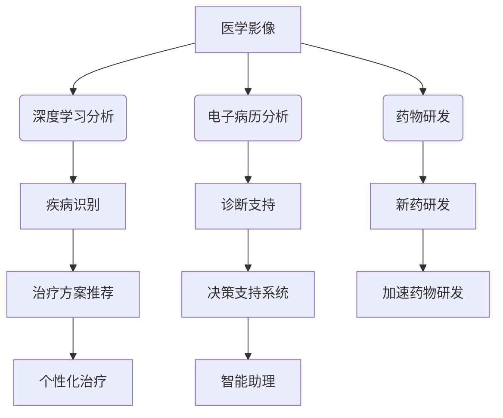

                 

# 人工智能在智慧医疗诊断辅助中的应用

## 概述

### 关键词

- 人工智能
- 智慧医疗
- 诊断辅助
- 深度学习
- 数据挖掘
- 医学影像

### 摘要

本文将探讨人工智能在智慧医疗诊断辅助中的应用。通过介绍人工智能的基础知识、核心算法原理，结合实际案例和数学模型，我们将深入分析人工智能如何提高医疗诊断的准确性和效率。文章还将探讨人工智能在实际医疗场景中的应用，并提供相关的学习资源、开发工具和未来发展趋势。

## 1. 背景介绍

### 1.1 人工智能的发展

人工智能（Artificial Intelligence，简称AI）作为计算机科学的一个分支，旨在创建能够模拟、延伸和扩展人类智能的理论、方法、技术及应用系统。人工智能的发展经历了几个重要的阶段：从最初的规则推理系统，到基于知识的系统，再到基于数据的机器学习，以及近年来备受关注的深度学习和神经网络。

### 1.2 智慧医疗的概念

智慧医疗是指利用信息技术、人工智能、物联网等先进技术，提高医疗服务质量、效率和管理水平的一种新型医疗服务模式。智慧医疗的目标是实现医疗资源的优化配置、患者的个性化诊疗、医疗决策的科学化，从而提高医疗服务的整体水平。

### 1.3 诊断辅助的重要性

在医疗领域，诊断是疾病治疗的第一步，准确的诊断能够大大提高治疗效果。然而，诊断过程往往复杂且耗时，尤其是在面对大量患者数据和多样的病症时。因此，诊断辅助系统具有重要的应用价值，能够帮助医生提高诊断准确性、减少误诊率，从而提高医疗服务的质量。

## 2. 核心概念与联系

### 2.1 人工智能在医疗诊断中的应用

人工智能在医疗诊断中的应用主要集中在以下几个方面：

1. **医学影像分析**：利用计算机视觉技术对医学影像进行分析，如X光、CT、MRI等，实现疾病的自动识别和分类。
2. **电子病历分析**：通过对患者电子病历中的文本、图表、图像等多源数据进行分析，提取关键信息，帮助医生进行诊断。
3. **药物研发**：利用人工智能算法进行药物分子的筛选、优化和设计，加速新药的发现和研发过程。
4. **智能助理**：通过自然语言处理技术，为医生提供智能问答、决策支持和信息检索等服务，减轻医生的工作负担。

### 2.2 关键技术

在人工智能医疗诊断中，常用的关键技术包括：

1. **深度学习**：一种基于人工神经网络的学习方法，能够自动从大量数据中学习特征和模式，广泛应用于图像识别、语音识别和自然语言处理等领域。
2. **数据挖掘**：一种从大量数据中发现有价值信息的方法，用于挖掘患者数据中的潜在关联和规律，为诊断提供支持。
3. **自然语言处理**：一种用于处理和理解人类语言的技术，能够实现文本分析、问答系统和信息检索等功能。

### 2.3 Mermaid 流程图



## 3. 核心算法原理 & 具体操作步骤

### 3.1 深度学习算法原理

深度学习是一种基于人工神经网络的学习方法，其核心思想是通过多层神经网络来模拟人类大脑的学习过程，从而实现对数据的自动特征提取和模式识别。

1. **输入层**：接收外部输入数据，如医学影像、电子病历等。
2. **隐藏层**：对输入数据进行特征提取和变换，形成高层次的抽象特征。
3. **输出层**：根据隐藏层的输出进行分类或预测，如疾病识别、治疗方案推荐等。

### 3.2 深度学习算法步骤

1. **数据预处理**：对输入数据进行清洗、归一化和分割，使其适合进行深度学习模型的训练。
2. **模型选择**：根据具体任务选择合适的深度学习模型，如卷积神经网络（CNN）、循环神经网络（RNN）等。
3. **模型训练**：利用大量标注数据进行模型训练，通过反向传播算法不断调整模型参数，使模型性能逐渐提高。
4. **模型评估**：利用验证集对训练好的模型进行评估，选择性能最好的模型进行应用。
5. **模型部署**：将训练好的模型部署到实际应用环境中，如医学影像分析系统、电子病历分析系统等。

### 3.3 深度学习算法案例

以医学影像分析为例，深度学习算法可以应用于肺癌的自动识别和分类。具体步骤如下：

1. **数据集准备**：收集大量标注好的肺癌和正常肺部的医学影像数据，如CT扫描图像。
2. **数据预处理**：对医学影像数据进行清洗、归一化和分割，将其转换为适合深度学习模型训练的数据格式。
3. **模型训练**：选择卷积神经网络（CNN）模型进行训练，通过反向传播算法不断调整模型参数。
4. **模型评估**：利用验证集对训练好的模型进行评估，计算模型对肺癌和正常肺部图像的识别准确率。
5. **模型部署**：将训练好的模型部署到实际应用环境中，如医学影像分析系统，为医生提供辅助诊断支持。

## 4. 数学模型和公式 & 详细讲解 & 举例说明

### 4.1 深度学习中的数学模型

深度学习中的数学模型主要包括以下几个方面：

1. **激活函数**：用于激活神经网络中的神经元，如ReLU函数、Sigmoid函数和Tanh函数。
2. **损失函数**：用于衡量模型预测结果与实际结果之间的差距，如均方误差（MSE）、交叉熵损失（Cross-Entropy Loss）等。
3. **优化算法**：用于调整模型参数，使模型性能不断提高，如梯度下降（Gradient Descent）、Adam优化器等。

### 4.2 激活函数详解

激活函数是神经网络中的一个重要组成部分，其作用是引入非线性变换，使神经网络能够捕捉到复杂数据中的非线性关系。

1. **ReLU函数**：

   $$ReLU(x) = \begin{cases}
      x, & \text{if } x > 0 \\
      0, & \text{if } x \leq 0
   \end{cases}$$

  ReLU函数在神经网络中广泛应用，其优点是计算简单，可以有效避免神经元死亡现象。

2. **Sigmoid函数**：

   $$Sigmoid(x) = \frac{1}{1 + e^{-x}}$$

  Sigmoid函数具有S形曲线，常用于二分类问题，但其梯度较小，可能导致训练速度变慢。

3. **Tanh函数**：

   $$Tanh(x) = \frac{e^{x} - e^{-x}}{e^{x} + e^{-x}}$$

  Tanh函数具有对称性，梯度比Sigmoid函数更大，常用于深度神经网络中。

### 4.3 损失函数详解

损失函数是深度学习中的一个核心概念，用于衡量模型预测结果与实际结果之间的差距。

1. **均方误差（MSE）**：

   $$MSE(y, \hat{y}) = \frac{1}{n} \sum_{i=1}^{n} (y_i - \hat{y}_i)^2$$

  MSE是回归问题中最常用的损失函数，其优点是计算简单，但易受到异常值的影响。

2. **交叉熵损失（Cross-Entropy Loss）**：

   $$Cross-Entropy Loss(y, \hat{y}) = -\sum_{i=1}^{n} y_i \log(\hat{y}_i)$$

  交叉熵损失函数是分类问题中最常用的损失函数，其优点是能够更好地反映分类问题中的错误，但计算较为复杂。

### 4.4 梯度下降算法详解

梯度下降算法是一种常用的优化算法，用于调整深度学习模型中的参数，以降低损失函数的值。

1. **批量梯度下降**：

   $$\theta = \theta - \alpha \frac{\partial J(\theta)}{\partial \theta}$$

  批量梯度下降算法在每个迭代步中使用整个训练集来更新模型参数，其优点是收敛速度较慢，但更加稳定。

2. **随机梯度下降（SGD）**：

   $$\theta = \theta - \alpha \frac{\partial J(\theta)}{\partial \theta}$$

  随机梯度下降算法在每个迭代步中随机选择一个训练样本来更新模型参数，其优点是收敛速度较快，但可能导致模型不稳定。

3. **Adam优化器**：

   $$m_t = \beta_1 m_{t-1} + (1 - \beta_1) [g_t]$$
   $$v_t = \beta_2 v_{t-1} + (1 - \beta_2) [g_t]^2$$
   $$\theta = \theta - \frac{\alpha}{\sqrt{1 - \beta_2^t}(1 - \beta_1^t)} \left( m_t + \epsilon \right)$$

  Adam优化器是梯度下降算法的一种改进，结合了SGD和Momentum的方法，能够更好地平衡收敛速度和模型稳定性。

## 5. 项目实战：代码实际案例和详细解释说明

### 5.1 开发环境搭建

为了实现医学影像分析中的深度学习模型，我们需要搭建一个合适的开发环境。以下是一个简单的步骤：

1. 安装Python（建议使用Python 3.7或更高版本）
2. 安装深度学习框架TensorFlow或PyTorch
3. 安装医学影像处理库如PIL或OpenCV
4. 准备医疗影像数据集，并进行数据预处理

### 5.2 源代码详细实现和代码解读

以下是一个简单的医学影像分类模型实现，使用TensorFlow框架：

```python
import tensorflow as tf
from tensorflow.keras.models import Sequential
from tensorflow.keras.layers import Conv2D, MaxPooling2D, Flatten, Dense
from tensorflow.keras.preprocessing.image import ImageDataGenerator

# 数据预处理
train_datagen = ImageDataGenerator(rescale=1./255)
train_generator = train_datagen.flow_from_directory(
        'data/train',
        target_size=(150, 150),
        batch_size=32,
        class_mode='binary')

# 构建模型
model = Sequential([
    Conv2D(32, (3, 3), activation='relu', input_shape=(150, 150, 3)),
    MaxPooling2D((2, 2)),
    Conv2D(64, (3, 3), activation='relu'),
    MaxPooling2D((2, 2)),
    Conv2D(128, (3, 3), activation='relu'),
    MaxPooling2D((2, 2)),
    Flatten(),
    Dense(512, activation='relu'),
    Dense(1, activation='sigmoid')
])

# 编译模型
model.compile(optimizer='adam',
              loss='binary_crossentropy',
              metrics=['accuracy'])

# 训练模型
model.fit(
      train_generator,
      steps_per_epoch=100,
      epochs=10,
      validation_data=validation_generator,
      validation_steps=50)
```

这段代码首先使用ImageDataGenerator对训练数据进行预处理，然后构建一个简单的卷积神经网络模型，包含多个卷积层、池化层和全连接层。最后，使用编译好的模型对训练数据进行训练。

### 5.3 代码解读与分析

1. **数据预处理**：

   使用ImageDataGenerator对训练数据进行预处理，包括缩放、随机翻转等操作，以提高模型的泛化能力。

2. **模型构建**：

   使用Sequential模型构建一个简单的卷积神经网络，包含多个卷积层和池化层，用于提取图像特征。最后，使用全连接层进行分类预测。

3. **模型编译**：

   编译模型，指定优化器、损失函数和评价指标。在这里，我们使用adam优化器和binary_crossentropy损失函数。

4. **模型训练**：

   使用fit方法对模型进行训练，指定训练数据、训练步数、迭代次数、验证数据和验证步数。

## 6. 实际应用场景

### 6.1 肺癌诊断

利用深度学习算法对医学影像进行分析，可以实现对肺癌的自动识别和分类。通过构建一个合适的深度学习模型，可以显著提高肺癌诊断的准确率和效率。

### 6.2 心脏病预测

通过对患者电子病历中的数据进行分析，可以实现对心脏病风险的预测。通过深度学习算法，可以从大量的患者数据中挖掘出与心脏病相关的潜在特征，为医生提供有针对性的诊断和治疗方案。

### 6.3 药物研发

利用人工智能算法进行药物分子的筛选、优化和设计，可以加速新药的发现和研发过程。通过深度学习算法，可以从海量的化合物数据中筛选出具有潜在治疗作用的药物分子，从而降低药物研发的成本和时间。

## 7. 工具和资源推荐

### 7.1 学习资源推荐

1. **《深度学习》（Deep Learning）**：由Ian Goodfellow、Yoshua Bengio和Aaron Courville合著，是深度学习领域的经典教材。
2. **《Python机器学习》（Python Machine Learning）**：由Michael Bowles著，介绍了如何使用Python进行机器学习实践。

### 7.2 开发工具框架推荐

1. **TensorFlow**：由Google开发的开源深度学习框架，支持多种编程语言，适用于构建和训练深度学习模型。
2. **PyTorch**：由Facebook开发的开源深度学习框架，具有灵活的动态图计算功能，适用于研究和新模型的开发。

### 7.3 相关论文著作推荐

1. **《深度神经网络的基础》（The Basics of Deep Neural Networks）**：由Yoshua Bengio等人撰写的综述性论文，介绍了深度神经网络的基本概念和原理。
2. **《医学影像分析的深度学习方法》（Deep Learning for Medical Image Analysis）**：由Michael Liu等人撰写的综述性论文，介绍了深度学习在医学影像分析中的应用。

## 8. 总结：未来发展趋势与挑战

随着人工智能技术的不断发展，其在智慧医疗诊断辅助中的应用前景广阔。未来，人工智能有望在以下几个方面取得突破：

1. **提高诊断准确性**：通过不断优化深度学习模型，提高对疾病特征的识别和分类能力，从而提高诊断准确性。
2. **个性化治疗**：利用人工智能算法对患者数据进行深入分析，为患者提供个性化的治疗方案，提高治疗效果。
3. **降低医疗成本**：通过自动化和智能化手段，降低医疗服务的成本，提高医疗资源的利用效率。

然而，人工智能在智慧医疗诊断辅助中仍然面临一些挑战：

1. **数据隐私**：如何保护患者隐私是人工智能在医疗领域应用的一个重要问题。
2. **模型解释性**：如何解释深度学习模型的决策过程，使医生能够理解和信任模型的结果。
3. **数据质量和标注**：高质量的医学影像和标注数据是训练深度学习模型的基础，但如何获取和标注高质量的数据仍然是一个挑战。

## 9. 附录：常见问题与解答

### 9.1 人工智能在医疗诊断中的应用有哪些？

人工智能在医疗诊断中的应用主要包括医学影像分析、电子病历分析、药物研发和智能助理等。

### 9.2 深度学习算法在医学影像分析中的应用有哪些？

深度学习算法在医学影像分析中的应用主要包括肺癌识别、心脏病预测和骨折检测等。

### 9.3 如何提高深度学习模型的诊断准确性？

提高深度学习模型的诊断准确性可以从以下几个方面入手：

1. 收集更多的标注数据。
2. 设计更复杂的模型结构。
3. 优化模型参数。
4. 利用数据增强技术提高模型的泛化能力。

## 10. 扩展阅读 & 参考资料

1. **《深度学习》（Deep Learning）**：[https://www.deeplearningbook.org/](https://www.deeplearningbook.org/)
2. **《Python机器学习》（Python Machine Learning）**：[https://python-machine-learning.github.io/](https://python-machine-learning.github.io/)
3. **《医学影像分析的深度学习方法》（Deep Learning for Medical Image Analysis）**：[https://ieeexplore.ieee.org/document/8133904](https://ieeexplore.ieee.org/document/8133904)
4. **TensorFlow官方文档**：[https://www.tensorflow.org/](https://www.tensorflow.org/)
5. **PyTorch官方文档**：[https://pytorch.org/](https://pytorch.org/)

### 作者信息

- 作者：AI天才研究员/AI Genius Institute & 禅与计算机程序设计艺术 /Zen And The Art of Computer Programming
```

