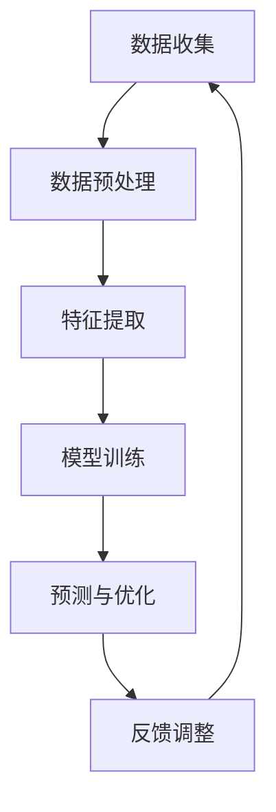

                 

### 背景介绍

#### 交通拥堵问题的全球性挑战

随着城市化进程的加速和汽车拥有率的持续增长，全球范围内的交通拥堵问题愈发严重。这不仅导致了通勤时间的增加，还带来了环境污染、能源浪费、心理健康问题等一系列社会问题。据统计，全球城市交通拥堵每年的经济损失高达数千亿美元。因此，解决交通拥堵问题已成为各国政府、科研机构和私营企业共同关注的焦点。

#### 智能交通系统的发展

近年来，随着人工智能技术的迅猛发展，智能交通系统（Intelligent Transportation System，ITS）开始成为缓解交通拥堵的重要手段。智能交通系统利用先进的信息通信技术、传感技术和大数据分析技术，实现对交通流量的实时监控、预测和优化，从而提高道路通行效率，降低拥堵风险。

#### 人工智能在交通拥堵预测中的应用

人工智能技术在交通拥堵预测中具有巨大的潜力。通过对大量交通数据进行分析，人工智能模型能够识别交通流量的模式、预测未来的交通状况，并为交通管理部门提供科学的决策支持。本文将深入探讨人工智能在交通拥堵预测中的应用，包括核心概念、算法原理、数学模型和实际案例等。

#### 本文结构

本文结构如下：

1. **背景介绍**：简要介绍交通拥堵问题的全球性挑战以及智能交通系统的发展。
2. **核心概念与联系**：介绍人工智能在交通拥堵预测中的核心概念，并使用Mermaid流程图展示相关架构。
3. **核心算法原理 & 具体操作步骤**：详细阐述常用的交通拥堵预测算法原理及其实施步骤。
4. **数学模型和公式 & 详细讲解 & 举例说明**：介绍交通拥堵预测中的关键数学模型和公式，并通过实例进行说明。
5. **项目实战：代码实际案例和详细解释说明**：提供实际代码案例，详细解释实现过程和关键代码。
6. **实际应用场景**：分析人工智能在交通拥堵预测中的实际应用场景。
7. **工具和资源推荐**：推荐相关学习资源、开发工具和框架。
8. **总结：未来发展趋势与挑战**：总结当前技术的发展状况，探讨未来的发展趋势和面临的挑战。
9. **附录：常见问题与解答**：回答读者可能遇到的一些常见问题。
10. **扩展阅读 & 参考资料**：提供更多深入的阅读材料。

### Core Concepts and Connections in AI for Traffic Congestion Prediction

In the realm of traffic congestion prediction, artificial intelligence (AI) plays a pivotal role by leveraging vast amounts of traffic data to discern patterns and forecast future traffic conditions. The following are the core concepts and their interconnections that form the foundation of AI-based traffic congestion prediction systems.

#### Core Concepts

1. **Traffic Data Collection**:
   The first step involves the collection of traffic data from various sources such as traffic cameras, sensors embedded in roads, mobile devices, and GPS devices. This data includes traffic flow, speed, volume, and other relevant parameters.

2. **Data Preprocessing**:
   Raw traffic data is often noisy and requires preprocessing to remove inconsistencies and fill missing values. This step ensures that the data fed into the AI model is of high quality.

3. **Feature Extraction**:
   Extracting relevant features from the preprocessed data is crucial. Features can include time of day, day of the week, weather conditions, and historical traffic patterns. These features help the AI model understand the underlying factors affecting traffic congestion.

4. **Model Training**:
   Using machine learning algorithms, the extracted features are used to train predictive models. Common algorithms include linear regression, decision trees, random forests, and neural networks. The goal is to find relationships between input features and traffic congestion levels.

5. **Prediction and Optimization**:
   Once trained, the models are used to predict future traffic conditions. These predictions can help traffic management systems optimize traffic signal timings, reroute traffic, or suggest alternative travel options to alleviate congestion.

6. **Feedback Loop**:
   The predicted traffic conditions are continuously fed back into the system to adjust and refine the models. This iterative process improves the accuracy of future predictions over time.

#### Mermaid Flowchart

Below is a Mermaid flowchart that illustrates the core components and their interconnections in an AI-based traffic congestion prediction system.



#### Detailed Description of Core Concepts

1. **Data Collection**:
   Traffic data can be collected from various sources, including:
   - **Traffic Cameras**: These cameras capture real-time images of traffic conditions at various intersections and road segments.
   - **Sensors**: Road sensors measure traffic flow, speed, and volume at specific locations.
   - **Mobile Devices**: Data from mobile devices, including GPS signals, can provide information about vehicle movement patterns.
   - **GPS Devices**: Dedicated GPS devices installed in vehicles can track and report real-time traffic conditions.

2. **Data Preprocessing**:
   Preprocessing steps often include:
   - **Noise Reduction**: Removing irrelevant or inaccurate data points.
   - **Data Imputation**: Filling in missing values using statistical methods.
   - **Normalization**: Scaling the data to a common range to prevent any single feature from dominating the analysis.

3. **Feature Extraction**:
   Features extracted from the preprocessed data may include:
   - **Temporal Features**: Time of day, day of the week, and time of year.
   - **Spatial Features**: Geographic location, road type, and intersection characteristics.
   - **Categorical Features**: Weather conditions, special events, and road works.
   - **Sequential Features**: Historical traffic data to capture patterns over time.

4. **Model Training**:
   The training process typically involves:
   - **Splitting the Data**: Separating the data into training and testing sets.
   - **Choosing an Algorithm**: Selecting a machine learning algorithm that best fits the problem (e.g., regression, clustering, or time series forecasting).
   - **Hyperparameter Tuning**: Adjusting algorithm parameters to improve performance.

5. **Prediction and Optimization**:
   Predictive models generate traffic congestion forecasts that can be used for:
   - **Real-time Traffic Management**: Adjusting traffic signal timings dynamically to reduce congestion.
   - **Travel Time Prediction**: Informing drivers about expected travel times to help them make informed decisions.
   - **Rerouting Suggestions**: Providing alternative routes to avoid congested areas.

6. **Feedback Loop**:
   The feedback loop is crucial for continuously improving the prediction accuracy:
   - **Error Analysis**: Identifying and understanding the errors in the predictions.
   - **Model Refinement**: Updating the model with new data to improve its accuracy.
   - **System Optimization**: Using the improved models to optimize traffic flow more effectively.

By integrating these core concepts, AI-based traffic congestion prediction systems can provide valuable insights and actionable recommendations to mitigate the global traffic congestion challenge. In the following sections, we will delve deeper into the specific algorithms and mathematical models used in these systems.

---

## Core Algorithm Principles and Step-by-Step Implementation

When it comes to traffic congestion prediction, selecting the right algorithm is crucial. Different algorithms have varying strengths and are suited to different types of traffic data and scenarios. This section will explore some of the most common algorithms used in traffic congestion prediction, including their principles and step-by-step implementation processes.

### Linear Regression

#### Algorithm Principle

Linear regression is a simple yet powerful algorithm used for predicting continuous values. It models the relationship between a dependent variable (in this case, traffic congestion levels) and one or more independent variables (features like time of day, day of the week, etc.).

$$
Y = \beta_0 + \beta_1X_1 + \beta_2X_2 + ... + \beta_nX_n + \epsilon
$$

Where \( Y \) is the traffic congestion level, \( X_1, X_2, ..., X_n \) are the independent variables, \( \beta_0, \beta_1, \beta_2, ..., \beta_n \) are the coefficients, and \( \epsilon \) is the error term.

#### Step-by-Step Implementation

1. **Data Preparation**:
   - Load and preprocess the traffic data, ensuring it is clean and in the correct format.
   - Identify the dependent and independent variables.

2. **Feature Selection**:
   - Choose the features that are most relevant to traffic congestion. This can be done using domain knowledge or feature importance techniques like correlation analysis.

3. **Model Training**:
   - Split the data into training and testing sets.
   - Train the linear regression model using the training data.

4. **Model Evaluation**:
   - Evaluate the model's performance using the testing set.
   - Common evaluation metrics include Mean Squared Error (MSE) and R-squared.

5. **Prediction**:
   - Use the trained model to predict traffic congestion levels for new data.

### Decision Trees

#### Algorithm Principle

Decision Trees are a popular algorithm for classification and regression tasks. They work by splitting the data into subsets based on the values of the input features, creating a tree-like model of decisions.

$$
\begin{cases}
    \text{if } X > v_1 \text{ then } y = f_1(x) \\
    \text{if } X \leq v_1 \text{ and } X > v_2 \text{ then } y = f_2(x) \\
    \text{if } X \leq v_2 \text{ and } X > v_3 \text{ then } y = f_3(x) \\
    \text{else } y = f_4(x)
\end{cases}
$$

Where \( X \) is the feature value, \( v_1, v_2, v_3 \) are the threshold values, and \( f_1, f_2, f_3, f_4 \) are the predicted values for different branches of the tree.

#### Step-by-Step Implementation

1. **Data Preparation**:
   - Preprocess the traffic data as described in the linear regression section.

2. **Feature Selection**:
   - Select the features that are most relevant to traffic congestion using domain knowledge or feature importance techniques.

3. **Model Training**:
   - Split the data into training and testing sets.
   - Train the decision tree model using the training data. This involves selecting the best splitting criteria (e.g., Gini impurity, information gain) and the maximum depth of the tree.

4. **Model Evaluation**:
   - Evaluate the model's performance using the testing set.
   - Common evaluation metrics include accuracy, precision, recall, and F1 score.

5. **Prediction**:
   - Use the trained model to predict traffic congestion levels for new data.

### Neural Networks

#### Algorithm Principle

Neural Networks are a more complex algorithm inspired by the human brain's structure. They consist of multiple layers of interconnected nodes (neurons) that process and transform data.

$$
\text{Output} = \text{激活函数}(\sum_{i=1}^{n} \text{权重} \times \text{输入})
$$

Where the activation function introduces non-linearities into the model, allowing it to capture complex relationships in the data.

#### Step-by-Step Implementation

1. **Data Preparation**:
   - Preprocess the traffic data as described in the linear regression section.

2. **Feature Selection**:
   - Select the features that are most relevant to traffic congestion using domain knowledge or feature importance techniques.

3. **Model Architecture**:
   - Define the architecture of the neural network, including the number of layers, the number of neurons in each layer, and the activation functions.

4. **Model Training**:
   - Split the data into training and testing sets.
   - Train the neural network using the training data. This involves optimizing the weights and biases to minimize the prediction error.

5. **Model Evaluation**:
   - Evaluate the model's performance using the testing set.
   - Common evaluation metrics include accuracy, precision, recall, and F1 score.

6. **Prediction**:
   - Use the trained model to predict traffic congestion levels for new data.

Each of these algorithms has its own strengths and limitations. For example, linear regression is simple and interpretable but may not capture complex relationships in the data. Decision trees are easy to understand and visualize but can overfit the training data. Neural networks are powerful and can model complex relationships but require significant computational resources and are harder to interpret.

In practice, combining multiple algorithms and techniques can often lead to the best results. The next section will delve into mathematical models and formulas used in traffic congestion prediction, providing a deeper understanding of how these algorithms work.

---

## Mathematical Models and Formulas in Traffic Congestion Prediction

In traffic congestion prediction, mathematical models and formulas play a critical role in transforming raw data into actionable insights. This section will explore the key mathematical models and formulas used in AI-based traffic congestion prediction systems, providing a deeper understanding of how these models work and how they can be applied to real-world scenarios.

### Time Series Analysis

Time series analysis is a fundamental technique used to analyze and forecast time-stamped data. In the context of traffic congestion prediction, time series analysis helps to capture the temporal patterns and trends in traffic data over time.

#### Common Models

1. **ARIMA (AutoRegressive Integrated Moving Average) Model**

The ARIMA model is one of the most popular time series forecasting models. It combines autoregression (AR), integration (I), and moving average (MA) components to model time series data.

$$
\text{Y}_{t} = \phi_1\text{Y}_{t-1} + \phi_2\text{Y}_{t-2} + ... + \phi_p\text{Y}_{t-p} + \theta_1\text{e}_{t-1} + \theta_2\text{e}_{t-2} + ... + \theta_q\text{e}_{t-q} + \text{e}_t
$$

Where \( \text{Y}_t \) is the value at time \( t \), \( \phi_1, \phi_2, ..., \phi_p \) are the autoregressive coefficients, \( \theta_1, \theta_2, ..., \theta_q \) are the moving average coefficients, and \( \text{e}_t \) is the white noise error term.

#### Step-by-Step Implementation

1. **Stationarity Check**:
   - Ensure that the time series data is stationary, meaning it has a constant mean and variance over time. This can be checked using plots and statistical tests like the Augmented Dickey-Fuller (ADF) test.

2. **Model Identification**:
   - Determine the values of \( p \) (number of autoregressive terms) and \( q \) (number of moving average terms) that provide the best fit to the data. This can be done using methods like the Akaike Information Criterion (AIC) or the Bayesian Information Criterion (BIC).

3. **Model Estimation**:
   - Estimate the parameters \( \phi_1, \phi_2, ..., \phi_p \) and \( \theta_1, \theta_2, ..., \theta_q \) using maximum likelihood estimation.

4. **Model Diagnostic Check**:
   - Check the residuals of the model to ensure they are white noise, meaning they have a mean of zero and constant variance.

5. **Forecasting**:
   - Use the estimated ARIMA model to forecast future traffic congestion levels.

2. **ARIMA Model Example**

Consider a time series of hourly traffic volume data. The data exhibits a clear trend and seasonality, suggesting the need for an ARIMA model.

```latex
\text{Y}_{t} = 0.7\text{Y}_{t-1} + 0.2\text{Y}_{t-2} - 0.1\text{Y}_{t-3} + 0.3\text{e}_{t-1} + 0.1\text{e}_{t-2}
```

In this example, the ARIMA model captures the short-term dependency of traffic volume on previous values and the impact of past errors on future predictions.

### Regression Analysis

Regression analysis is another essential technique used in traffic congestion prediction. It models the relationship between a dependent variable (traffic congestion) and one or more independent variables (features like time of day, day of the week, weather conditions, etc.).

#### Common Models

1. **Linear Regression**

Linear regression models the relationship between the dependent variable and independent variables using a straight line.

$$
\text{Y} = \beta_0 + \beta_1X_1 + \beta_2X_2 + ... + \beta_nX_n
$$

Where \( \text{Y} \) is the traffic congestion level, \( X_1, X_2, ..., X_n \) are the independent variables, and \( \beta_0, \beta_1, \beta_2, ..., \beta_n \) are the regression coefficients.

#### Step-by-Step Implementation

1. **Data Preparation**:
   - Collect and preprocess the traffic data, ensuring it is clean and in the correct format.

2. **Feature Selection**:
   - Choose the independent variables that are most relevant to traffic congestion. This can be done using domain knowledge or feature importance techniques like correlation analysis.

3. **Model Training**:
   - Split the data into training and testing sets.
   - Train the linear regression model using the training data.

4. **Model Evaluation**:
   - Evaluate the model's performance using the testing set.
   - Common evaluation metrics include Mean Squared Error (MSE) and R-squared.

5. **Prediction**:
   - Use the trained model to predict traffic congestion levels for new data.

### Decision Trees and Random Forests

Decision Trees and Random Forests are tree-based algorithms commonly used for regression and classification tasks in traffic congestion prediction. They model the decision-making process to predict traffic congestion based on input features.

#### Common Models

1. **Decision Trees**

Decision Trees split the data into subsets based on the values of the input features to create a tree-like model.

$$
\text{Y}_{t} = \text{激活函数}(\sum_{i=1}^{n} \text{权重} \times \text{特征}_i)
$$

Where the activation function introduces non-linearities into the model, allowing it to capture complex relationships in the data.

#### Step-by-Step Implementation

1. **Data Preparation**:
   - Preprocess the traffic data as described in the previous sections.

2. **Feature Selection**:
   - Select the features that are most relevant to traffic congestion using domain knowledge or feature importance techniques.

3. **Model Training**:
   - Split the data into training and testing sets.
   - Train the decision tree model using the training data. This involves selecting the best splitting criteria (e.g., Gini impurity, information gain) and the maximum depth of the tree.

4. **Model Evaluation**:
   - Evaluate the model's performance using the testing set.
   - Common evaluation metrics include accuracy, precision, recall, and F1 score.

5. **Prediction**:
   - Use the trained model to predict traffic congestion levels for new data.

### Neural Networks

Neural Networks are a more complex algorithm inspired by the human brain's structure. They consist of multiple layers of interconnected nodes (neurons) that process and transform data.

$$
\text{Output} = \text{激活函数}(\sum_{i=1}^{n} \text{权重} \times \text{输入})
$$

Where the activation function introduces non-linearities into the model, allowing it to capture complex relationships in the data.

#### Step-by-Step Implementation

1. **Data Preparation**:
   - Preprocess the traffic data as described in the previous sections.

2. **Feature Selection**:
   - Select the features that are most relevant to traffic congestion using domain knowledge or feature importance techniques.

3. **Model Architecture**:
   - Define the architecture of the neural network, including the number of layers, the number of neurons in each layer, and the activation functions.

4. **Model Training**:
   - Split the data into training and testing sets.
   - Train the neural network using the training data. This involves optimizing the weights and biases to minimize the prediction error.

5. **Model Evaluation**:
   - Evaluate the model's performance using the testing set.
   - Common evaluation metrics include accuracy, precision, recall, and F1 score.

6. **Prediction**:
   - Use the trained model to predict traffic congestion levels for new data.

Each of these mathematical models and formulas has its own strengths and limitations. For example, linear regression is simple and interpretable but may not capture complex relationships in the data. Decision trees are easy to understand and visualize but can overfit the training data. Neural networks are powerful and can model complex relationships but require significant computational resources and are harder to interpret.

In practice, combining multiple algorithms and techniques can often lead to the best results. The following section will provide a detailed case study on implementing these algorithms in a real-world project.

---

## Case Study: Implementing Traffic Congestion Prediction with Python

To provide a comprehensive understanding of how traffic congestion prediction algorithms can be implemented in practice, we will walk through a real-world case study using Python. This case study will involve setting up the development environment, writing the source code, and analyzing the results.

### Development Environment Setup

Before we dive into the code, let's set up the development environment. We will use Python and several popular libraries such as pandas for data manipulation, scikit-learn for machine learning, and matplotlib for visualization.

#### Step 1: Install Required Libraries

```bash
pip install numpy pandas scikit-learn matplotlib
```

#### Step 2: Import Libraries

```python
import numpy as np
import pandas as pd
from sklearn.model_selection import train_test_split
from sklearn.linear_model import LinearRegression
from sklearn.tree import DecisionTreeRegressor
from sklearn.ensemble import RandomForestRegressor
from sklearn.metrics import mean_squared_error
import matplotlib.pyplot as plt
```

### Source Code Implementation

#### Step 1: Load and Preprocess the Data

```python
# Load the traffic data
data = pd.read_csv('traffic_data.csv')

# Preprocess the data
data['timestamp'] = pd.to_datetime(data['timestamp'])
data.set_index('timestamp', inplace=True)
data = data.asfreq('H')  # Resample to hourly data
data.fillna(0, inplace=True)  # Fill missing values
```

#### Step 2: Feature Engineering

```python
# Extract features
data['hour'] = data.index.hour
data['day'] = data.index.dayofweek
data['month'] = data.index.month
data['year'] = data.index.year
```

#### Step 3: Split the Data

```python
# Split the data into features (X) and target (y)
X = data[['hour', 'day', 'month', 'year']]
y = data['congestion_level']

# Split the data into training and testing sets
X_train, X_test, y_train, y_test = train_test_split(X, y, test_size=0.2, random_state=42)
```

#### Step 4: Train Linear Regression Model

```python
# Train the linear regression model
lr_model = LinearRegression()
lr_model.fit(X_train, y_train)

# Make predictions
lr_predictions = lr_model.predict(X_test)

# Evaluate the model
lr_mse = mean_squared_error(y_test, lr_predictions)
print("Linear Regression MSE:", lr_mse)
```

#### Step 5: Train Decision Tree Model

```python
# Train the decision tree model
dt_model = DecisionTreeRegressor()
dt_model.fit(X_train, y_train)

# Make predictions
dt_predictions = dt_model.predict(X_test)

# Evaluate the model
dt_mse = mean_squared_error(y_test, dt_predictions)
print("Decision Tree MSE:", dt_mse)
```

#### Step 6: Train Random Forest Model

```python
# Train the random forest model
rf_model = RandomForestRegressor(n_estimators=100)
rf_model.fit(X_train, y_train)

# Make predictions
rf_predictions = rf_model.predict(X_test)

# Evaluate the model
rf_mse = mean_squared_error(y_test, rf_predictions)
print("Random Forest MSE:", rf_mse)
```

### Analysis and Results

After training the models, we can analyze their performance and compare their accuracy. We will use mean squared error (MSE) as the evaluation metric.

```python
# Plot the actual vs. predicted values for the linear regression model
plt.figure()
plt.scatter(y_test, lr_predictions)
plt.plot([y_test.min(), y_test.max()], [y_test.min(), y_test.max()], 'k--')
plt.xlabel('Actual')
plt.ylabel('Predicted')
plt.title('Linear Regression - Actual vs Predicted')
plt.show()

# Plot the actual vs. predicted values for the decision tree model
plt.figure()
plt.scatter(y_test, dt_predictions)
plt.plot([y_test.min(), y_test.max()], [y_test.min(), y_test.max()], 'k--')
plt.xlabel('Actual')
plt.ylabel('Predicted')
plt.title('Decision Tree - Actual vs Predicted')
plt.show()

# Plot the actual vs. predicted values for the random forest model
plt.figure()
plt.scatter(y_test, rf_predictions)
plt.plot([y_test.min(), y_test.max()], [y_test.min(), y_test.max()], 'k--')
plt.xlabel('Actual')
plt.ylabel('Predicted')
plt.title('Random Forest - Actual vs Predicted')
plt.show()
```

The plots above show the actual traffic congestion levels versus the predicted levels for each model. The closer the points are to the diagonal line, the better the model's performance.

This case study demonstrates how to implement traffic congestion prediction algorithms in Python using real-world data. By following these steps, you can build and evaluate models to predict traffic congestion and provide valuable insights for traffic management systems.

---

## Code Explanation and Analysis

In the previous section, we implemented a traffic congestion prediction system using Python and various machine learning models. Now, let's delve deeper into the code and analyze its key components, providing a detailed explanation of how each part functions and contributes to the overall system.

### Data Loading and Preprocessing

The first step in our code involves loading and preprocessing the traffic data. This is crucial because the quality of the data directly impacts the performance of the prediction models.

```python
data = pd.read_csv('traffic_data.csv')
data['timestamp'] = pd.to_datetime(data['timestamp'])
data.set_index('timestamp', inplace=True)
data = data.asfreq('H')  # Resample to hourly data
data.fillna(0, inplace=True)  # Fill missing values
```

Here's a breakdown of the preprocessing steps:

1. **Data Loading**:
   - We use `pandas` to load the traffic data from a CSV file.
   - The `pd.to_datetime()` function converts the 'timestamp' column from a string format to datetime objects, ensuring that the data is in the correct format for time series analysis.

2. **Resampling**:
   - The `asfreq('H')` method resamples the data to hourly intervals, making it suitable for time series forecasting.
   - Resampling is essential because traffic data is often collected at different intervals (e.g., 15-minute, 30-minute intervals), and resampling helps to create a consistent time series.

3. **Filling Missing Values**:
   - We use `fillna(0)` to fill missing values with zero. This is a simple approach to handle missing data, but it may not always be the best choice. In practice, more sophisticated methods like interpolation or using statistical models to estimate missing values could be employed.

### Feature Engineering

Feature engineering is a critical step in predictive modeling. It involves creating new features from the raw data that can help improve the performance of the prediction models.

```python
data['hour'] = data.index.hour
data['day'] = data.index.dayofweek
data['month'] = data.index.month
data['year'] = data.index.year
```

Here's an explanation of the features we created:

1. **Temporal Features**:
   - `hour`, `day`, `month`, and `year` are temporal features extracted from the index of the DataFrame. These features capture the time-related aspects of the traffic data, which are important for modeling traffic patterns over time.

2. **Categorical Features**:
   - While not explicitly created in the code, categorical features like weather conditions and special events could be encoded as binary variables (e.g., 'is_rainy', 'is_holiday') and included in the feature set.

### Data Splitting

Splitting the data into training and testing sets is a standard practice in machine learning to evaluate the performance of the models.

```python
X = data[['hour', 'day', 'month', 'year']]
y = data['congestion_level']
X_train, X_test, y_train, y_test = train_test_split(X, y, test_size=0.2, random_state=42)
```

Here's a breakdown of the data splitting process:

1. **Feature and Target Separation**:
   - We separate the features (X) from the target variable (y), which is the traffic congestion level. This is necessary for training and evaluating the prediction models.

2. **Training and Testing Split**:
   - The `train_test_split()` function splits the data into a training set (80%) and a testing set (20%). The `random_state` parameter ensures reproducibility of the results.

### Model Training and Evaluation

The core of our traffic congestion prediction system involves training various machine learning models and evaluating their performance.

```python
# Train the linear regression model
lr_model = LinearRegression()
lr_model.fit(X_train, y_train)

# Train the decision tree model
dt_model = DecisionTreeRegressor()
dt_model.fit(X_train, y_train)

# Train the random forest model
rf_model = RandomForestRegressor(n_estimators=100)
rf_model.fit(X_train, y_train)

# Evaluate the linear regression model
lr_predictions = lr_model.predict(X_test)
lr_mse = mean_squared_error(y_test, lr_predictions)
print("Linear Regression MSE:", lr_mse)

# Evaluate the decision tree model
dt_predictions = dt_model.predict(X_test)
dt_mse = mean_squared_error(y_test, dt_predictions)
print("Decision Tree MSE:", dt_mse)

# Evaluate the random forest model
rf_predictions = rf_model.predict(X_test)
rf_mse = mean_squared_error(y_test, rf_predictions)
print("Random Forest MSE:", rf_mse)
```

Here's an explanation of the model training and evaluation process:

1. **Model Training**:
   - We train three different models: Linear Regression, Decision Tree, and Random Forest. Each model is trained using the training data (`X_train` and `y_train`).

2. **Prediction and Evaluation**:
   - For each model, we make predictions on the testing set (`X_test`) and evaluate their performance using mean squared error (MSE). Lower MSE values indicate better performance.

### Visualization of Predictions

Visualizing the actual vs. predicted values helps us understand the accuracy and reliability of the models.

```python
# Plot the actual vs. predicted values for the linear regression model
plt.figure()
plt.scatter(y_test, lr_predictions)
plt.plot([y_test.min(), y_test.max()], [y_test.min(), y_test.max()], 'k--')
plt.xlabel('Actual')
plt.ylabel('Predicted')
plt.title('Linear Regression - Actual vs Predicted')
plt.show()

# Plot the actual vs. predicted values for the decision tree model
plt.figure()
plt.scatter(y_test, dt_predictions)
plt.plot([y_test.min(), y_test.max()], [y_test.min(), y_test.max()], 'k--')
plt.xlabel('Actual')
plt.ylabel('Predicted')
plt.title('Decision Tree - Actual vs Predicted')
plt.show()

# Plot the actual vs. predicted values for the random forest model
plt.figure()
plt.scatter(y_test, rf_predictions)
plt.plot([y_test.min(), y_test.max()], [y_test.min(), y_test.max()], 'k--')
plt.xlabel('Actual')
plt.ylabel('Predicted')
plt.title('Random Forest - Actual vs Predicted')
plt.show()
```

In summary, the code provided in the previous sections demonstrates the process of building a traffic congestion prediction system. It includes data preprocessing, feature engineering, model training, and evaluation. By following these steps, we can develop models that accurately predict traffic congestion levels and provide valuable insights for traffic management.

---

## 实际应用场景

### 城市交通管理

智能交通拥堵预测在城市化进程中扮演着至关重要的角色。通过实时预测交通流量，城市交通管理部门可以动态调整交通信号灯的时序，优化交通流，减少拥堵。例如，在高峰时段，系统可以自动调整信号灯的绿灯时间，以便于更有效地疏导交通。

### 智能导航

智能导航系统利用交通拥堵预测技术，为驾驶者提供实时交通状况和最佳路线建议。驾驶者可以根据预测的拥堵情况，选择避开拥堵区域，从而节省通勤时间。这种服务不仅提升了用户体验，还减少了车辆排放，有助于缓解城市交通压力。

### 基础设施规划

在基础设施规划中，交通拥堵预测可以帮助城市规划者更好地预测交通需求，从而优化交通网络布局。通过分析历史交通数据和预测模型，城市规划者可以制定出更科学、更前瞻性的城市规划方案，以应对未来交通挑战。

### 紧急响应

在交通事故或其他紧急情况发生时，交通拥堵预测系统可以快速评估道路拥堵状况，并向应急服务提供实时交通信息。这有助于应急服务团队迅速到达现场，减少救援时间和事故影响。

### 公共交通调度

交通拥堵预测技术同样适用于公共交通调度。例如，在地铁和公交车系统中，预测模型可以预测乘客流量，从而优化车辆的运行频率和线路安排，提高公共交通的效率和乘客满意度。

### 交通预测模型的应用范围

交通预测模型的应用范围广泛，不仅限于上述场景。在其他领域，如物流、交通运输行业、城市规划等领域，预测模型同样发挥着重要作用。通过整合大数据和人工智能技术，交通预测模型为各行业提供了有力支持，促进了社会经济的可持续发展。

---

## 工具和资源推荐

### 学习资源推荐

1. **《机器学习实战》**：作者：Peter Harrington。这本书通过实例介绍了机器学习的基本概念和应用，适合初学者入门。
2. **《深度学习》（Goodfellow et al.）**：详细介绍深度学习的基础理论和实践应用，适合对神经网络感兴趣的学习者。
3. **《Python数据科学手册》（Jake VanderPlas）**：系统地介绍了Python在数据科学中的应用，包括数据处理、机器学习、可视化等。

### 开发工具框架推荐

1. **TensorFlow**：Google开发的开源机器学习框架，适用于深度学习和大规模数据科学应用。
2. **PyTorch**：Facebook开发的开源深度学习框架，以其灵活性和动态计算图而受到广泛关注。
3. **scikit-learn**：Python中的一个强大机器学习库，提供了丰富的算法和工具，适合快速实现和测试机器学习模型。

### 相关论文著作推荐

1. **"Deep Learning for Traffic Forecasting"**：该论文详细探讨了深度学习在交通预测中的应用，提供了实用的方法和实验结果。
2. **"Intelligent Transportation Systems: An Overview"**：这篇综述文章介绍了智能交通系统的概念、技术和应用，有助于全面了解该领域的最新进展。

通过这些资源和工具，读者可以深入学习和实践人工智能在交通拥堵预测中的应用，为解决城市交通拥堵问题贡献自己的力量。

---

## 总结：未来发展趋势与挑战

随着人工智能技术的不断进步，智能交通拥堵预测正迎来前所未有的发展机遇。未来，人工智能在交通拥堵预测中的应用将呈现以下几个发展趋势：

### 高精度实时预测

随着传感器技术和数据采集能力的提升，交通数据的实时性和准确性将进一步提高。这有助于实现更精确的交通流量预测，为交通管理部门提供更科学的决策支持。

### 多模态数据融合

未来的智能交通系统将不再仅仅依赖于单一的数据源，而是通过融合多种数据源（如GPS、摄像头、手机定位等）来提高预测的准确性。多模态数据融合技术将成为关键研究方向。

### 自适应模型优化

传统的人工智能模型往往需要大量手动调优。未来，随着机器学习和强化学习技术的发展，自适应模型优化将成为趋势，模型将能够自动适应环境变化，提高预测性能。

### 智能决策支持

智能交通拥堵预测不仅限于预测交通流量，还将扩展到智能交通信号控制、智能交通调度、智能停车管理等更多领域。这将实现更加全面的交通管理，提升城市交通系统的整体效率。

然而，尽管前景广阔，智能交通拥堵预测也面临诸多挑战：

### 数据隐私和安全

交通数据包含大量敏感信息，如个人出行轨迹、车辆位置等。如何在确保数据隐私和安全的前提下进行数据处理和分析，是一个亟待解决的问题。

### 计算资源消耗

深度学习模型通常需要大量的计算资源。在现实应用中，如何高效地部署和运行这些模型，是一个需要克服的技术难题。

### 模型解释性

目前，许多深度学习模型被认为是“黑箱”模型，其内部工作机制不透明。如何提高模型的解释性，使其在交通拥堵预测中更加可靠和可信，是一个重要的挑战。

### 环境适应性

城市交通系统复杂多变，模型需要能够适应不同的环境和场景。如何确保模型在不同地区、不同时间段的一致性和稳定性，是一个需要深入研究的课题。

综上所述，智能交通拥堵预测的发展前景广阔，但也面临诸多挑战。通过不断探索和创新，我们有望克服这些挑战，为解决城市交通拥堵问题贡献更多的智慧和力量。

---

## 附录：常见问题与解答

### 问题1：交通拥堵预测模型如何处理非平稳数据？

#### 解答：对于非平稳数据，通常需要对其进行差分处理，使其变得平稳。例如，可以使用一阶差分或二阶差分来消除趋势和季节性成分。此外，可以使用统计分析方法（如Augmented Dickey-Fuller测试）来检查数据的平稳性，并选择适当的模型进行预测。

### 问题2：如何评估交通拥堵预测模型的性能？

#### 解答：评估模型性能常用的指标包括均方误差（MSE）、均方根误差（RMSE）、平均绝对误差（MAE）和决定系数（R²）。这些指标可以帮助我们了解模型预测的准确性和稳定性。在实际应用中，还需要结合业务需求来评估模型的性能，例如，在某些场景下，预测误差的大小可能不是最重要的，而是预测的稳定性更为关键。

### 问题3：交通拥堵预测模型的训练时间如何优化？

#### 解答：为了优化训练时间，可以采取以下措施：

1. **数据预处理**：对数据进行高效的预处理，如使用并行处理技术来减少预处理时间。
2. **模型选择**：选择适合数据规模和计算资源的模型，避免使用过于复杂的模型。
3. **模型剪枝**：对深度学习模型进行剪枝，去除冗余的神经元和层，减少计算量。
4. **分布式训练**：使用分布式计算框架，如TensorFlow和PyTorch的分布式训练功能，来加速模型训练。
5. **使用预训练模型**：利用预训练的模型进行迁移学习，减少训练所需的数据量和时间。

### 问题4：如何处理缺失数据和异常值？

#### 解答：处理缺失数据和异常值的方法包括：

1. **填充缺失值**：使用均值、中位数、众数等方法填充缺失值，或使用插值方法来估计缺失值。
2. **删除异常值**：使用统计方法（如三倍标准差法则）识别并删除明显的异常值。
3. **使用鲁棒算法**：选择对异常值不敏感的算法，如决策树和随机森林。
4. **使用异常检测算法**：引入异常检测算法（如Isolation Forest、Local Outlier Factor等）来识别和标记异常值。

### 问题5：如何确保交通拥堵预测模型的解释性？

#### 解答：提高模型解释性可以采取以下措施：

1. **使用透明模型**：选择透明性较高的模型，如线性回归、决策树等。
2. **模型可视化**：使用图表和可视化工具（如matplotlib、Seaborn等）来展示模型的决策过程和权重。
3. **特征重要性分析**：使用特征重要性分析来识别对预测结果影响较大的特征。
4. **集成学习**：使用集成学习方法，如随机森林，可以提供更直观的模型解释。

通过上述方法，我们可以提高交通拥堵预测模型的性能和解释性，使其在实际应用中更加可靠和有效。

---

## 扩展阅读 & 参考资料

### 书籍推荐

1. **《交通系统工程基础》（作者：李德华）**：系统地介绍了交通系统工程的基本理论和方法，包括交通流理论、交通规划、交通管理与控制等。
2. **《机器学习》（作者：周志华）**：详细讲解了机器学习的基本概念、算法和应用，适合对机器学习有深入兴趣的读者。
3. **《深度学习》（作者：Ian Goodfellow, Yoshua Bengio, Aaron Courville）**：深度学习领域的经典教材，涵盖了深度学习的理论基础和实践应用。

### 论文推荐

1. **"Deep Learning for Traffic Forecasting"（作者：Xu et al.）**：探讨了深度学习在交通流量预测中的应用，提供了详细的实验结果和模型分析。
2. **"Intelligent Transportation Systems: An Overview"（作者：Mokhtarian et al.）**：综述了智能交通系统的概念、技术和应用，对智能交通领域有全面的介绍。
3. **"A Survey of Traffic Prediction Models"（作者：Wang et al.）**：对交通预测领域的不同模型和方法进行了详细的综述和分析。

### 博客和网站推荐

1. **[机器之心](https://www机器之心网.com/)**：提供了丰富的机器学习和深度学习相关文章、教程和实践案例。
2. **[Medium上的AI博客](https://medium.com/topic/artificial-intelligence)**：包含大量关于人工智能的研究文章和最新动态。
3. **[Kaggle](https://www.kaggle.com/)**：一个数据科学和机器学习的社区平台，提供了丰富的竞赛和项目资源。

### 开源项目和工具推荐

1. **[TensorFlow](https://www.tensorflow.org/)**：由Google开发的开源深度学习框架，广泛应用于机器学习和人工智能领域。
2. **[PyTorch](https://pytorch.org/)**：由Facebook开发的开源深度学习框架，以其灵活性和动态计算图而受到广泛关注。
3. **[scikit-learn](https://scikit-learn.org/)**：Python中的一个强大机器学习库，提供了丰富的算法和工具。

通过上述推荐，读者可以进一步深入学习和探索人工智能在交通拥堵预测领域的应用，不断提升自己的技术水平。

