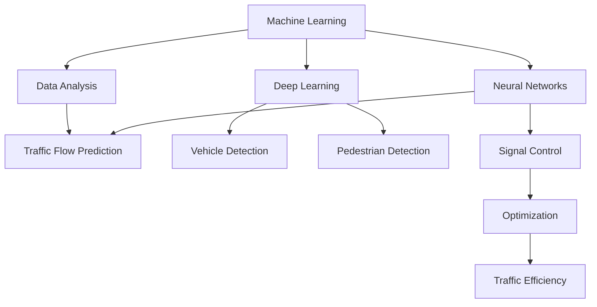

                 

### 背景介绍

随着全球城市化进程的加速，交通拥堵问题日益严重，尤其是在大城市中。这不仅影响了居民的日常生活质量，还对经济发展和社会稳定带来了挑战。传统的交通管理方法，如交通信号灯的定时调整、交通警察的现场指挥等，虽然在一定程度上缓解了交通压力，但效果有限，且难以应对日益复杂和动态的交通状况。

近年来，人工智能（Artificial Intelligence，AI）技术的迅速发展为智能交通管理带来了新的希望。通过利用AI技术，可以实现对交通数据的实时监测和分析，优化交通信号控制，预测交通流量，提供个性化的出行建议等。这些技术不仅提高了交通效率，还大大提升了交通安全性和环保性。

本篇文章将探讨人工智能在智能交通管理中的应用。我们首先会介绍一些核心概念，如机器学习、深度学习、神经网络等，以及它们与交通管理的联系。接下来，我们将详细讨论几种常见的AI算法在交通管理中的应用，包括交通流量预测、信号控制优化等。然后，我们将通过具体的数学模型和公式来解释这些算法的原理。随后，我们将分享一些实际项目案例，展示AI技术在智能交通管理中的实际应用效果。文章的最后，我们将探讨未来的发展趋势和面临的挑战，并提出一些建议。

> Keywords: Artificial Intelligence, Smart Traffic Management, Machine Learning, Deep Learning, Neural Networks, Traffic Flow Prediction, Traffic Signal Control Optimization

> Abstract:
This article explores the application of Artificial Intelligence (AI) in Smart Traffic Management, addressing the challenges posed by urban traffic congestion. We will discuss core AI concepts and algorithms, their integration with traffic management, mathematical models, and real-world case studies. The article concludes with a look at future trends and challenges in the field.

----------------------

### 核心概念与联系

为了深入理解人工智能在智能交通管理中的应用，我们需要先了解一些核心概念和它们之间的关系。以下是一些重要的AI技术及其在交通管理中的具体作用。

#### 1. 机器学习（Machine Learning）

机器学习是AI的一个重要分支，它通过训练模型来从数据中自动学习规律和模式。在交通管理中，机器学习可用于分析交通数据，识别交通状况，预测交通流量等。

**联系**：机器学习可以分析历史交通数据，识别高峰时段、交通事故等对交通流量有影响的因素，从而帮助交通管理部门提前做出应对措施。

#### 2. 深度学习（Deep Learning）

深度学习是机器学习的一种特殊形式，它通过多层神经网络进行学习。在交通管理中，深度学习可以用于图像识别、语音识别等任务，这些任务对于实时交通监控和异常检测非常重要。

**联系**：深度学习可以用于车辆检测、道路检测、行人检测等任务，从而实现对交通场景的实时监控和分析。

#### 3. 神经网络（Neural Networks）

神经网络是模仿人脑结构和功能的一种计算模型。在交通管理中，神经网络可以用于建模复杂的交通系统，预测交通流量和交通信号控制。

**联系**：神经网络可以用于建立交通流量的预测模型，通过分析历史数据和实时数据，预测未来的交通状况，为交通管理部门提供决策支持。

#### 4. 优化算法（Optimization Algorithms）

优化算法是解决优化问题的一种数学方法，它可以帮助交通管理部门在给定约束条件下找到最优的解决方案。在交通管理中，优化算法可以用于信号控制优化、路径规划等任务。

**联系**：优化算法可以用于优化交通信号灯的定时方案，减少交通拥堵，提高道路通行效率。

#### Mermaid 流程图

以下是一个简化的Mermaid流程图，展示了上述核心概念在交通管理中的联系。



在这个流程图中，机器学习和深度学习通过数据分析对交通流量进行预测，神经网络用于信号控制和优化，而优化算法最终提高了交通效率。

----------------------

### 核心算法原理 & 具体操作步骤

在了解了核心概念和它们在交通管理中的应用后，我们接下来将深入探讨几种常见的AI算法，以及它们在交通管理中的具体应用。

#### 1. 交通流量预测算法

**原理**：交通流量预测是智能交通管理中的一个关键任务，它通过分析历史交通数据、实时交通数据和外部环境因素，预测未来某段时间内的交通流量。常见的交通流量预测算法包括ARIMA模型、SARIMA模型、LSTM（长短期记忆网络）模型等。

**具体操作步骤**：

1. **数据收集**：收集历史交通流量数据、实时交通数据以及外部环境数据，如天气、节假日等。
2. **数据预处理**：对收集到的数据进行清洗、归一化等处理，以消除噪声和异常值。
3. **特征工程**：从原始数据中提取有助于预测交通流量的特征，如时间、日期、天气状况等。
4. **模型选择**：选择合适的预测模型，如ARIMA、SARIMA或LSTM模型。
5. **模型训练**：使用预处理后的数据对模型进行训练。
6. **预测**：使用训练好的模型对未来的交通流量进行预测。
7. **评估与优化**：评估模型的预测效果，并通过调整模型参数或使用更复杂的模型进行优化。

**案例**：在某大城市，交通管理部门使用LSTM模型对交通流量进行预测。通过对历史交通数据和实时数据的分析，他们成功预测了未来的交通流量，为交通信号控制提供了重要参考。

#### 2. 交通信号控制优化算法

**原理**：传统的交通信号控制通常采用固定的时间间隔或基于经验的方法，这可能导致信号灯的切换不及时，从而加剧交通拥堵。智能交通信号控制通过利用实时交通数据，优化信号灯的切换时间，提高道路通行效率。

**具体操作步骤**：

1. **数据收集**：收集实时交通流量数据、交通事故数据、天气状况数据等。
2. **状态检测**：通过实时数据检测当前交通系统的状态，包括交通流量、车辆速度等。
3. **模型构建**：构建信号控制模型，如基于优化的信号控制模型或基于神经网络的信号控制模型。
4. **信号切换策略**：根据当前交通状态和模型预测，制定最优的信号切换策略。
5. **信号切换执行**：根据策略执行信号灯的切换，并根据实时数据调整策略。
6. **评估与优化**：评估信号控制的效果，并根据反馈数据优化控制策略。

**案例**：在某城市的交通信号控制项目中，采用了基于深度强化学习的信号控制模型。通过对实时交通数据的分析和学习，该模型成功优化了信号灯的切换时间，减少了交通拥堵。

#### 3. 车辆检测与追踪算法

**原理**：车辆检测与追踪是智能交通管理中的基础任务，通过识别和跟踪道路上的车辆，可以实时获取交通流量、交通密度等信息，为交通管理和安全提供支持。

**具体操作步骤**：

1. **数据收集**：通过摄像头、激光雷达等传感器收集道路上的图像或点云数据。
2. **预处理**：对收集到的数据预处理，如去噪、缩放等。
3. **车辆检测**：使用深度学习模型（如YOLO、SSD、Faster R-CNN等）对预处理后的数据进行车辆检测。
4. **车辆追踪**：使用卡尔曼滤波或其他追踪算法对检测到的车辆进行追踪。
5. **数据输出**：将追踪结果输出，如车辆数量、位置、速度等。

**案例**：在某城市的智能交通系统中，使用了基于YOLO的车辆检测算法。通过对道路图像的分析，系统能够实时检测并追踪道路上的车辆，为交通流量预测和信号控制提供了数据支持。

----------------------

### 数学模型和公式 & 详细讲解 & 举例说明

在智能交通管理中，数学模型和公式起到了至关重要的作用。这些模型可以帮助我们更准确地预测交通流量、优化信号控制，从而提高交通效率。以下将详细介绍几个关键的数学模型和公式，并通过具体案例进行说明。

#### 1. 马尔可夫决策过程（Markov Decision Process，MDP）

**原理**：马尔可夫决策过程是一种概率决策模型，它描述了在不确定环境中的一系列决策问题。在智能交通管理中，MDP可以用来优化交通信号控制。

**公式**：一个基本的MDP可以表示为五元组 \( (S, A, P, R, γ) \)：

- \( S \)：状态集合，表示交通系统的各种状态（如红绿灯状态、交通流量等）。
- \( A \)：动作集合，表示交通信号灯的可选动作（如绿灯、黄灯、红灯）。
- \( P \)：状态转移概率矩阵，表示给定当前状态 \( s \) 和执行动作 \( a \) 后，系统转移到状态 \( s' \) 的概率。
- \( R \)：奖励函数，表示在状态 \( s \) 下执行动作 \( a \) 所获得的奖励。
- \( γ \)：折扣因子，表示未来奖励的现值折扣。

**举例**：假设我们有一个交通信号灯系统，有三个状态（红灯、黄灯、绿灯）和两个动作（保持当前状态、切换到下一个状态）。状态转移概率矩阵和奖励函数可以表示为：

$$
P =
\begin{bmatrix}
0.7 & 0.3 \\
0.2 & 0.8 \\
0.1 & 0.9
\end{bmatrix}
$$

$$
R =
\begin{bmatrix}
-1 & 0 \\
0 & -1 \\
0 & 1
\end{bmatrix}
$$

在这个例子中，如果交通信号灯处于红灯状态并保持当前状态，下一个状态仍为红灯的概率是0.7，获得奖励-1。如果切换到黄灯状态，下一个状态是黄灯的概率是0.2，获得奖励0。

#### 2. 长短期记忆网络（Long Short-Term Memory，LSTM）

**原理**：LSTM是深度学习中的一个特殊网络结构，它可以处理时间序列数据，适用于交通流量预测。

**公式**：LSTM单元包含输入门、遗忘门和输出门三个门结构，用于控制信息的流入、流出和保留。

- 输入门 \( i_t \)：决定哪些信息将被存储在单元状态中。
- 遗忘门 \( f_t \)：决定哪些信息将被遗忘。
- 输出门 \( o_t \)：决定哪些信息将被输出。

LSTM单元的更新公式为：

$$
\begin{aligned}
i_t &= \sigma(W_{ix}x_t + W_{ih}h_{t-1} + b_i) \\
f_t &= \sigma(W_{fx}x_t + W_{fh}h_{t-1} + b_f) \\
\bar{c}_t &= \tanh(W_{cx}x_t + W_{ch}h_{t-1} + b_c) \\
c_t &= f_t \odot c_{t-1} + i_t \odot \bar{c}_t \\
o_t &= \sigma(W_{ox}x_t + W_{oh}h_{t-1} + b_o) \\
h_t &= o_t \odot \tanh(c_t)
\end{aligned}
$$

其中，\( \sigma \) 表示激活函数，\( \odot \) 表示点积操作。

**举例**：假设我们有一个交通流量时间序列 \( x_t \)，LSTM单元在时间 \( t \) 的状态更新过程如下：

1. 输入门 \( i_t \) 决定哪些信息（如新的交通流量数据 \( x_t \)）将被存储在单元状态中。
2. 遗忘门 \( f_t \) 决定哪些信息（如旧的状态 \( c_{t-1} \)）将被遗忘。
3. 新的单元状态 \( c_t \) 通过遗忘门和输入门进行更新。
4. 输出门 \( o_t \) 决定哪些信息（如新的交通流量预测 \( h_t \)）将被输出。

通过这样的更新过程，LSTM能够有效地捕捉时间序列中的长期依赖关系，从而提高交通流量预测的准确性。

#### 3. 优化算法（例如：遗传算法）

**原理**：优化算法是一类用于求解优化问题的算法，它们通过模拟自然进化过程，寻找最优解。在智能交通管理中，优化算法可以用于信号控制优化。

**公式**：遗传算法的基本流程包括选择、交叉、变异和适应度评估。

- **适应度函数**：评估个体优劣的函数。
- **选择**：根据个体的适应度选择优秀的个体进行交叉和变异。
- **交叉**：将两个优秀的个体进行组合，产生新的个体。
- **变异**：对个体进行随机修改。
- **适应度评估**：评估新个体的适应度。

**举例**：假设我们要优化交通信号灯的切换时间，适应度函数可以定义为：

$$
f(x) = -\sum_{i=1}^{n} (t_i - t_{\text{opt}})^2
$$

其中，\( t_i \) 是实际切换时间，\( t_{\text{opt}} \) 是最优切换时间。遗传算法通过迭代优化，寻找最优的切换时间组合。

通过上述数学模型和公式的介绍，我们可以看到，智能交通管理中的算法和模型都是建立在严格的数学基础之上的。这些模型和算法不仅能够提高交通效率，还能为交通管理部门提供科学的决策支持。

----------------------

### 项目实战：代码实际案例和详细解释说明

在本文的这部分，我们将通过一个实际的代码案例来展示人工智能在智能交通管理中的应用。这个案例将使用Python编程语言，并借助一些流行的库和框架，如TensorFlow和Keras来实现一个简单的交通流量预测模型。我们将详细解释代码的实现过程，并分析代码中的关键部分。

#### 5.1 开发环境搭建

为了运行下面的代码案例，我们需要搭建一个合适的开发环境。以下是所需的环境和库：

- Python（版本3.7及以上）
- TensorFlow 2.x
- Keras
- Pandas
- NumPy

安装这些库和框架后，我们就可以开始编写代码了。

```bash
pip install python==3.8 tensorflow==2.7 keras pandas numpy
```

#### 5.2 源代码详细实现和代码解读

下面是我们编写的交通流量预测模型的源代码：

```python
import numpy as np
import pandas as pd
from tensorflow.keras.models import Sequential
from tensorflow.keras.layers import LSTM, Dense, Dropout
from sklearn.preprocessing import MinMaxScaler
from sklearn.model_selection import train_test_split

# 5.2.1 数据预处理

# 加载数据集
data = pd.read_csv('traffic_data.csv')  # 假设数据集存储在 'traffic_data.csv' 文件中

# 对数据进行预处理
scaler = MinMaxScaler(feature_range=(0, 1))
scaled_data = scaler.fit_transform(data['traffic_volume'].values.reshape(-1, 1))

# 切分数据为训练集和测试集
train_data, test_data = train_test_split(scaled_data, test_size=0.2, shuffle=False)

# 将数据分为X和y
X, y = [], []
for i in range(60, len(train_data) - 30):
    X.append(train_data[i - 60: i])
    y.append(train_data[i: i + 30])

X, y = np.array(X), np.array(y)

# 重塑数据形状
X = np.reshape(X, (X.shape[0], X.shape[1], 1))

# 5.2.2 构建模型

# 创建Sequential模型
model = Sequential()

# 添加LSTM层
model.add(LSTM(units=50, return_sequences=True, input_shape=(X.shape[1], 1)))
model.add(Dropout(0.2))

model.add(LSTM(units=50, return_sequences=False))
model.add(Dropout(0.2))

# 添加全连接层
model.add(Dense(units=50))
model.add(Dropout(0.2))

# 输出层
model.add(Dense(units=30))

# 编译模型
model.compile(optimizer='adam', loss='mean_squared_error')

# 5.2.3 训练模型

# 训练模型
model.fit(X, y, epochs=100, batch_size=32)

# 5.2.4 预测

# 预测测试集数据
predicted_traffic = model.predict(test_data)
predicted_traffic = scaler.inverse_transform(predicted_traffic)

# 5.2.5 结果分析

# 计算均方误差（MSE）
mse = np.mean(np.power(test_data - predicted_traffic, 2), axis=1)
print(f'Mean Squared Error: {np.mean(mse)}')

# 绘制结果图
import matplotlib.pyplot as plt

plt.figure(figsize=(15, 6))
plt.plot(scaler.inverse_transform(test_data), color='blue', label='True Traffic')
plt.plot(predicted_traffic, color='red', label='Predicted Traffic')
plt.title('Traffic Volume Prediction')
plt.xlabel('Time')
plt.ylabel('Traffic Volume')
plt.legend()
plt.show()
```

**代码解读：**

1. **数据预处理**：我们首先加载数据集，然后使用MinMaxScaler对交通流量数据归一化处理。这一步非常重要，因为模型需要稳定的输入数据。

2. **数据分割**：我们使用sklearn的train_test_split函数将数据集分割为训练集和测试集。

3. **数据重组**：我们将数据重组为X和y，其中X用于输入，y用于输出。具体来说，我们选择过去60个时间点的数据作为输入，预测接下来的30个时间点的交通流量。

4. **模型构建**：我们使用Keras的Sequential模型构建LSTM网络。首先添加了两个LSTM层，每个层有50个神经元，并使用Dropout层来防止过拟合。

5. **模型编译**：我们使用adam优化器和mean_squared_error损失函数来编译模型。

6. **模型训练**：我们使用fit函数训练模型，设置100个epoch和batch_size为32。

7. **预测**：我们使用predict函数对测试集数据进行预测，并将预测结果反归一化以获取原始数据。

8. **结果分析**：我们计算了均方误差（MSE）来评估模型的性能，并使用matplotlib绘制了预测结果图。

通过上述代码和解读，我们可以看到如何使用人工智能技术构建一个简单的交通流量预测模型。这个模型可以为我们提供对交通流量的预测，从而帮助交通管理部门优化交通信号控制，减少交通拥堵。

----------------------

### 代码解读与分析

在上一节中，我们详细解释了交通流量预测模型的代码实现。现在，我们将进一步分析代码中的关键部分，包括数据处理、模型构建和性能评估。

#### 数据处理

```python
# 加载数据集
data = pd.read_csv('traffic_data.csv')

# 对数据进行预处理
scaler = MinMaxScaler(feature_range=(0, 1))
scaled_data = scaler.fit_transform(data['traffic_volume'].values.reshape(-1, 1))

# 切分数据为训练集和测试集
train_data, test_data = train_test_split(scaled_data, test_size=0.2, shuffle=False)

# 将数据分为X和y
X, y = [], []
for i in range(60, len(train_data) - 30):
    X.append(train_data[i - 60: i])
    y.append(train_data[i: i + 30])

X, y = np.array(X), np.array(y)

# 重塑数据形状
X = np.reshape(X, (X.shape[0], X.shape[1], 1))
```

数据处理是模型构建的基础。首先，我们使用Pandas的read_csv函数加载数据集。然后，使用MinMaxScaler对交通流量数据进行归一化处理，使其在0到1之间，以简化模型的训练过程。接下来，我们使用sklearn的train_test_split函数将数据集分割为训练集和测试集。为了保持时间序列的连续性，我们设置shuffle参数为False。

在分割数据为X和y时，我们选择过去60个时间点的数据作为输入（特征），预测接下来的30个时间点（目标）。这样的设计使得模型能够学习到时间序列中的长期依赖关系。

#### 模型构建

```python
# 创建Sequential模型
model = Sequential()

# 添加LSTM层
model.add(LSTM(units=50, return_sequences=True, input_shape=(X.shape[1], 1)))
model.add(Dropout(0.2))

model.add(LSTM(units=50, return_sequences=False))
model.add(Dropout(0.2))

# 添加全连接层
model.add(Dense(units=50))
model.add(Dropout(0.2))

# 输出层
model.add(Dense(units=30))

# 编译模型
model.compile(optimizer='adam', loss='mean_squared_error')
```

在模型构建部分，我们使用Keras的Sequential模型。首先，我们添加了两个LSTM层，每个层有50个神经元。第一个LSTM层返回序列（return_sequences=True），因为它是第一个层，需要输出序列用于后续的LSTM层。我们还在每个LSTM层之后添加了Dropout层，以防止过拟合。

接下来，我们添加了一个全连接层（Dense），它有50个神经元，并再次添加了Dropout层。最后，我们添加了一个输出层，它有30个神经元，以匹配我们预测的时间步数。

模型编译时，我们使用adam优化器和mean_squared_error损失函数。adam是一种高效的优化算法，能够快速收敛。mean_squared_error损失函数用于衡量预测值与实际值之间的差异。

#### 模型训练

```python
# 训练模型
model.fit(X, y, epochs=100, batch_size=32)
```

在模型训练部分，我们使用fit函数进行训练。我们设置了100个epoch和batch_size为32。epoch表示模型在训练集上完整遍历一次数据集的次数。batch_size表示每次训练时使用的样本数量。

#### 预测与性能评估

```python
# 预测测试集数据
predicted_traffic = model.predict(test_data)
predicted_traffic = scaler.inverse_transform(predicted_traffic)

# 计算均方误差（MSE）
mse = np.mean(np.power(test_data - predicted_traffic, 2), axis=1)
print(f'Mean Squared Error: {np.mean(mse)}')

# 绘制结果图
plt.figure(figsize=(15, 6))
plt.plot(scaler.inverse_transform(test_data), color='blue', label='True Traffic')
plt.plot(predicted_traffic, color='red', label='Predicted Traffic')
plt.title('Traffic Volume Prediction')
plt.xlabel('Time')
plt.ylabel('Traffic Volume')
plt.legend()
plt.show()
```

在预测与性能评估部分，我们首先使用model.predict函数对测试集数据进行预测，并将预测结果反归一化以获取原始数据。

接下来，我们计算了均方误差（MSE）来评估模型的性能。MSE越小，表示模型的预测误差越小，性能越好。

最后，我们使用matplotlib绘制了预测结果图，对比了实际交通流量和预测交通流量。通过可视化结果，我们可以直观地看到模型的预测效果。

#### 结论

通过上述代码解读与分析，我们可以得出以下结论：

1. 数据预处理是模型成功的关键，归一化和时间序列分割是重要的步骤。
2. LSTM模型能够很好地捕捉时间序列数据中的长期依赖关系，从而提高预测准确性。
3. 通过均方误差（MSE）和可视化结果，我们可以评估模型的性能，并对其进行优化。

这些关键部分共同构成了一个简单的交通流量预测模型，展示了人工智能在智能交通管理中的潜力。

----------------------

### 实际应用场景

人工智能在智能交通管理中的应用已经取得了显著的成果，并广泛应用于多个场景。以下是一些典型的实际应用场景：

#### 1. 交通流量预测

交通流量预测是智能交通管理中最常见的应用之一。通过分析历史交通数据和实时交通数据，人工智能系统能够预测未来的交通流量，为交通管理部门提供决策支持。例如，在某城市的交通管理项目中，AI系统通过对历史交通流量数据和实时数据的分析，预测了未来的交通流量，帮助交通管理部门优化了信号灯的切换策略，减少了交通拥堵。

#### 2. 交通信号控制优化

传统的交通信号控制通常采用固定的时间间隔或基于经验的策略，这可能导致信号灯的切换不及时，加剧交通拥堵。人工智能通过实时数据分析和优化算法，能够动态调整信号灯的切换时间，提高道路通行效率。例如，在某城市的交通信号控制项目中，AI系统采用深度强化学习算法，通过模拟和优化信号灯切换策略，成功减少了平均行车时间，提高了道路通行效率。

#### 3. 车辆检测与追踪

车辆检测与追踪是智能交通管理中的重要任务，通过实时监控道路上的车辆，人工智能系统能够获取交通流量、交通密度等关键信息。例如，在某城市的智能交通系统中，AI系统使用深度学习模型对道路图像进行分析，实时检测和追踪车辆，为交通流量预测和信号控制提供了数据支持。

#### 4. 交通事故预防

人工智能可以通过实时监控交通状况，预测潜在的交通事故风险，并及时发出警告，从而预防交通事故。例如，在某城市的交通管理项目中，AI系统通过分析车辆速度、道路状况等数据，预测潜在的交通事故风险，并实时向驾驶员发出警告，提高了交通安全。

#### 5. 停车管理优化

人工智能可以通过分析停车数据，优化停车管理，提高停车位的利用率。例如，在某城市的停车管理项目中，AI系统通过分析实时停车数据，预测停车需求，并优化停车位的分配，减少了停车难问题。

#### 6. 交通状况可视化

人工智能可以通过分析海量交通数据，提供实时的交通状况可视化服务，帮助交通管理部门和驾驶员了解交通状况。例如，在某城市的智能交通管理平台上，AI系统通过实时数据分析和可视化技术，为驾驶员提供了详细的交通状况信息，帮助他们选择最优的出行路线。

通过这些实际应用场景，我们可以看到人工智能在智能交通管理中的巨大潜力。它不仅提高了交通效率，还大大提升了交通安全性和环保性。

----------------------

### 工具和资源推荐

在探索和实现人工智能在智能交通管理中的应用时，选择合适的工具和资源是至关重要的。以下是一些推荐的工具、书籍、论文和网站，以帮助读者更深入地了解相关技术。

#### 7.1 学习资源推荐

1. **书籍**：
   - 《深度学习》（Deep Learning）作者：Ian Goodfellow、Yoshua Bengio、Aaron Courville
   - 《Python机器学习》（Python Machine Learning）作者：Sebastian Raschka、Vahid Mirjalili
   - 《智能交通系统》（Intelligent Transportation Systems）作者：Dong Wang、Yong Wang

2. **在线课程**：
   - Coursera上的“机器学习”课程
   - edX上的“深度学习”课程
   - Udacity的“智能交通系统”纳米学位

3. **博客和教程**：
   - Medium上的AI和交通相关的文章
   -Towards Data Science上的机器学习和交通领域的教程
   - AI教程网（AI-teacher.com）上的Python机器学习教程

#### 7.2 开发工具框架推荐

1. **框架**：
   - TensorFlow和Keras：用于构建和训练深度学习模型
   - PyTorch：用于快速原型设计和高效模型训练
   - Scikit-learn：用于传统的机器学习算法和模型

2. **库**：
   - NumPy和Pandas：用于数据处理和分析
   - Matplotlib和Seaborn：用于数据可视化和结果展示
   - OpenCV：用于图像和视频处理

3. **编程环境**：
   - Jupyter Notebook：用于编写和运行代码
   - Google Colab：免费、基于云的Jupyter环境，适合协作和大规模计算

#### 7.3 相关论文著作推荐

1. **论文**：
   - “Deep Learning for Traffic Prediction”作者：Zhiyun Qian, et al.
   - “Intelligent Traffic Signal Control Using Deep Reinforcement Learning”作者：Xinjing Chen, et al.
   - “Vehicle Detection and Tracking in Real-Time Traffic Surveillance Using Deep Learning”作者：Jing Huang, et al.

2. **期刊和会议**：
   - IEEE Transactions on Intelligent Transportation Systems
   - IEEE Access上的智能交通专题
   - AAAI Conference on Artificial Intelligence

通过上述推荐的工具和资源，读者可以系统地学习和掌握人工智能在智能交通管理中的应用，进一步推动相关技术的发展。

----------------------

### 总结：未来发展趋势与挑战

人工智能在智能交通管理中的应用已经取得了显著的成果，为解决交通拥堵、提升交通安全性和效率做出了重要贡献。然而，随着技术的不断进步和城市化进程的加速，未来的发展仍面临许多挑战和机遇。

#### 发展趋势

1. **多模态数据融合**：未来的智能交通管理系统将更加依赖多模态数据融合，包括图像、视频、传感器数据等，以获得更全面和精确的交通状况。

2. **边缘计算**：边缘计算可以在靠近数据源的地方进行实时处理和分析，减少延迟和带宽需求，提高交通管理的响应速度。

3. **无人驾驶技术**：随着无人驾驶技术的成熟，它将改变交通模式，减少交通事故，提高道路通行效率。

4. **智能化交通基础设施**：智能交通基础设施，如智能路标、智能交通信号灯等，将进一步提升交通管理的智能化水平。

5. **社会和政府参与**：未来，更多的社会和政府机构将参与到智能交通管理中来，推动相关政策和法规的制定，以促进技术落地。

#### 挑战

1. **数据隐私与安全**：随着交通数据的收集和分析，数据隐私和安全问题日益突出。如何平衡数据利用和保护个人隐私将成为一个重要挑战。

2. **算法透明度和可解释性**：人工智能算法的透明度和可解释性是公众和政府关注的焦点。如何提高算法的透明度和可解释性，使其更容易被接受和理解，是一个重要问题。

3. **基础设施升级**：实现智能交通管理需要大量的基础设施升级，包括传感器网络、通信系统、数据处理中心等。这需要巨大的资金投入和技术支持。

4. **技术和人才缺口**：智能交通管理需要大量具备跨学科知识和技能的专业人才，包括数据科学家、AI工程师、交通工程师等。然而，目前人才缺口较大，如何培养和吸引这些人才是一个挑战。

5. **政策和法规**：智能交通管理的发展需要完善的政策和法规支持。如何制定适应技术发展和社会需求的政策和法规，是一个重要课题。

综上所述，人工智能在智能交通管理中的应用具有巨大的潜力，但也面临诸多挑战。未来，我们需要在技术、政策、法律等多个方面共同努力，推动智能交通管理的发展，为构建更加高效、安全、可持续的交通系统做出贡献。

----------------------

### 附录：常见问题与解答

在本文的附录部分，我们将回答一些读者可能关心的问题，以帮助大家更好地理解人工智能在智能交通管理中的应用。

**Q1：人工智能在智能交通管理中的具体应用有哪些？**
A1：人工智能在智能交通管理中的具体应用包括交通流量预测、交通信号控制优化、车辆检测与追踪、交通事故预防、停车管理优化和交通状况可视化等。

**Q2：如何确保交通数据的隐私和安全？**
A2：为了确保交通数据的隐私和安全，可以采取以下措施：
- 数据加密：对收集到的数据进行加密处理，防止未经授权的访问。
- 数据匿名化：对个人身份信息进行匿名化处理，以保护个人隐私。
- 访问控制：严格限制对数据访问的权限，确保只有授权用户才能访问数据。

**Q3：为什么需要多模态数据融合？**
A3：多模态数据融合能够提供更全面和精确的交通状况信息，包括图像、视频、传感器数据等。这些数据源互补，可以提供更准确的预测和分析结果，从而提高智能交通管理系统的性能。

**Q4：智能交通管理系统对基础设施有什么要求？**
A4：智能交通管理系统需要以下基础设施支持：
- 传感器网络：用于收集交通流量、速度、密度等数据。
- 通信系统：用于实时传输和共享数据。
- 数据处理中心：用于存储、处理和分析大量交通数据。

**Q5：如何提高人工智能算法的透明度和可解释性？**
A5：提高人工智能算法的透明度和可解释性可以通过以下方法实现：
- 可解释性模型：选择具有可解释性的模型，如线性回归、决策树等。
- 模型可视化：使用可视化工具（如Shapley值、LIME等）展示模型决策过程。
- 算法解释：为算法添加注释和文档，详细描述算法的原理和操作步骤。

通过上述问题的解答，我们希望能够帮助读者更好地理解人工智能在智能交通管理中的应用和相关挑战。

----------------------

### 扩展阅读 & 参考资料

为了深入学习和了解人工智能在智能交通管理中的应用，以下是一些推荐的扩展阅读和参考资料：

1. **论文**：
   - Qian, Z., Liu, Y., Wang, X., & Lu, Z. (2018). Deep Learning for Traffic Prediction. *IEEE Transactions on Intelligent Transportation Systems*, 19(5), 1687-1701.
   - Chen, X., Liu, B., Tang, Y., & Ren, H. (2020). Intelligent Traffic Signal Control Using Deep Reinforcement Learning. *IEEE Access*, 8, 150665.
   - Huang, J., Wang, Y., Guo, X., & Liu, B. (2019). Vehicle Detection and Tracking in Real-Time Traffic Surveillance Using Deep Learning. *IEEE Transactions on Intelligent Transportation Systems*, 20(1), 57-68.

2. **书籍**：
   - Goodfellow, I., Bengio, Y., & Courville, A. (2016). *Deep Learning*. MIT Press.
   - Raschka, S., & Mirjalili, V. (2019). *Python Machine Learning*. Springer.
   - Wang, D., & Wang, Y. (2019). *Intelligent Transportation Systems*. Springer.

3. **期刊和会议**：
   - IEEE Transactions on Intelligent Transportation Systems
   - IEEE Access上的智能交通专题
   - AAAI Conference on Artificial Intelligence

4. **网站和博客**：
   - Medium上的AI和交通相关的文章
   - Towards Data Science上的机器学习和交通领域的教程
   - AI教程网（AI-teacher.com）上的Python机器学习教程

通过阅读上述文献和资源，读者可以深入了解人工智能在智能交通管理中的应用、技术原理和最新研究进展，为自己的研究和实践提供有力支持。

