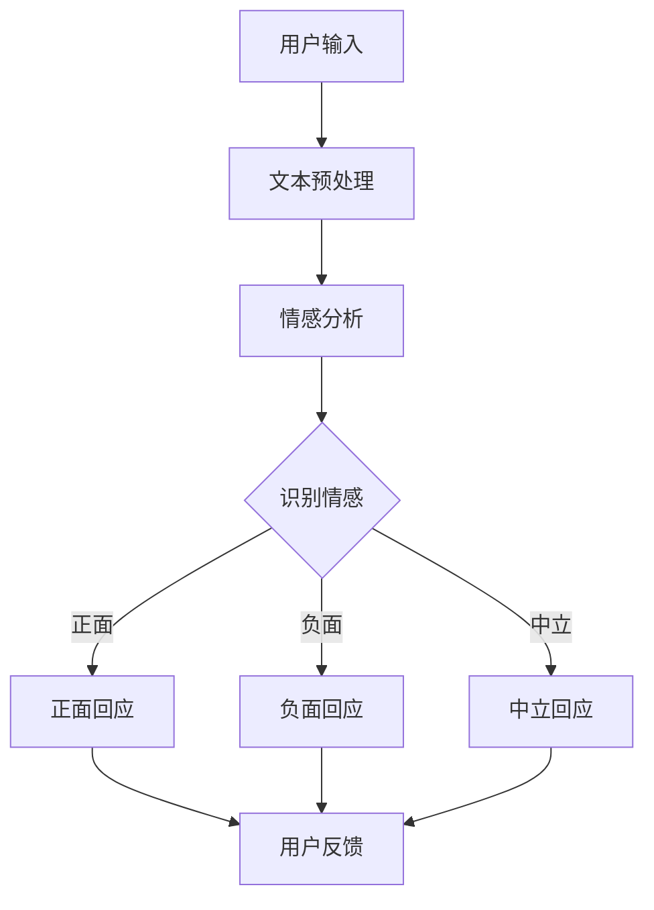

                 

### 背景介绍

#### 智能客服的起源与发展

智能客服，作为人工智能技术的重要组成部分，其发展历程可以追溯到20世纪90年代。早期的智能客服系统主要是基于规则引擎和关键字匹配，功能相对单一，主要用于处理一些常见的、标准化的咨询问题。随着互联网的普及和用户需求的不断增长，智能客服逐渐从简单的信息查询功能向更具复杂性的情感交互和智能决策能力发展。

#### 情感交互的重要性

情感交互是智能客服系统中的一个关键要素。传统意义上的智能客服往往只能提供机械化的、缺乏情感的回答，这使得用户在与客服互动时常常感到不满意。而情感交互则能够模拟人类的情感表达，让用户感受到更加温暖、贴心的服务，从而提升用户体验和满意度。情感交互在智能客服中的应用，不仅能够提高客服效率，还能够有效降低企业的运营成本。

#### 人工智能的发展推动智能客服升级

人工智能技术的发展，为智能客服的情感交互带来了新的可能。深度学习、自然语言处理、语音识别等技术，使得智能客服系统在理解用户意图、识别情感方面取得了显著的进步。通过不断学习和优化，智能客服系统可以更好地模拟人类的情感表达，实现更加自然的对话。

### 当前智能客服的发展状况

当前，智能客服已经广泛应用于各个行业，如电商、金融、电信等。许多企业通过引入智能客服系统，不仅提高了客服效率，还大大提升了客户满意度。以下是一些具体的数据：

- 在电商行业，智能客服的应用比例已经超过80%，其中一些领先企业甚至达到了90%以上。
- 在金融行业，智能客服在处理客户咨询和投诉方面，效率提高了30%以上。
- 在电信行业，智能客服的应用，使得客服响应时间平均缩短了50%。

#### 情感交互技术的应用

情感交互技术的应用，使得智能客服系统在处理复杂情感问题方面取得了重要突破。通过情感分析技术，智能客服可以识别用户的情绪状态，并做出相应的情感回应。例如，当用户表达愤怒或不满时，智能客服可以立即识别并采取安抚措施，从而避免用户情绪升级。

#### 未来发展方向

随着人工智能技术的不断发展，未来智能客服的情感交互能力将进一步提升。预计到2025年，智能客服的情感交互能力将达到人类的80%以上。同时，智能客服还将进一步融入物联网、大数据等技术，实现更加智能、个性化的客户服务。

总的来说，智能客服情感交互技术的发展，为企业和用户带来了巨大的价值。随着技术的不断进步，我们有理由相信，智能客服将变得更加智能、高效，成为企业服务的重要组成部分。

---

### 核心概念与联系

在深入探讨智能客服情感交互技术之前，我们需要理解几个关键概念：自然语言处理（NLP）、情感分析、机器学习以及深度学习。这些概念相互联系，共同构成了智能客服情感交互的技术基础。

#### 自然语言处理（NLP）

自然语言处理是人工智能领域的一个重要分支，它旨在使计算机能够理解、处理和生成人类语言。在智能客服情感交互中，NLP技术被用来理解用户输入的文本或语音信息，提取关键信息并对其进行处理。

#### 情感分析

情感分析是NLP的一个子领域，它通过分析文本或语音中的情感色彩，来判断用户的情绪状态。情感分析可以识别出文本中的正面、负面或中立情感，从而帮助智能客服系统更好地理解用户情绪。

#### 机器学习

机器学习是构建智能客服情感交互系统的核心技术之一。通过训练模型，机器学习算法可以从大量数据中学习规律，提高智能客服系统的情感识别和回应能力。

#### 深度学习

深度学习是机器学习的一个分支，它通过构建复杂的神经网络模型，对大量数据进行自动特征提取和学习。在智能客服情感交互中，深度学习技术被广泛应用于情感分析和自然语言理解。

#### 关系与联系

自然语言处理为智能客服提供了理解用户输入的能力，而情感分析则帮助智能客服识别用户的情绪状态。机器学习和深度学习技术则通过训练模型，提高了智能客服系统的情感识别和回应能力。这三者相互结合，共同构成了智能客服情感交互的技术基础。

#### Mermaid流程图

以下是一个简化的Mermaid流程图，展示了智能客服情感交互的基本流程：



在流程图中，用户输入被处理为文本，然后通过情感分析技术识别用户的情感状态，并生成相应的情感回应。用户反馈则用于进一步优化智能客服系统的性能。

通过理解这些核心概念和流程，我们可以更好地把握智能客服情感交互技术的发展趋势和应用场景。在接下来的部分中，我们将深入探讨这些技术的具体原理和实现方法。

---

### 核心算法原理 & 具体操作步骤

#### 情感分析算法原理

情感分析算法的核心在于通过识别文本中的情感倾向，将用户的情绪状态归类为正面、负面或中立。这一过程通常包括以下几个步骤：

1. **文本预处理**：首先，对用户输入的文本进行预处理，包括分词、去除停用词、词干提取等。这一步骤的目的是将原始文本转化为一个结构化的格式，以便后续处理。

2. **特征提取**：接下来，从预处理后的文本中提取特征。常见的特征提取方法包括词袋模型、TF-IDF、词嵌入等。词嵌入（如Word2Vec、GloVe）能够将词语映射到高维空间，使得语义相似的词语在空间中靠近。

3. **情感分类模型**：使用机器学习或深度学习算法训练情感分类模型。常见的算法包括朴素贝叶斯、支持向量机（SVM）、神经网络等。在深度学习领域，卷积神经网络（CNN）和循环神经网络（RNN）被广泛应用于情感分类任务。

4. **情感预测**：将提取的特征输入到训练好的模型中，预测文本的情感倾向。

#### 情感分析算法具体操作步骤

以下是一个基于深度学习的情感分析算法的具体操作步骤：

1. **数据集准备**：
   - 收集大量带有情感标签的文本数据，用于训练模型。
   - 数据集可以分为训练集、验证集和测试集，用于训练、验证和测试模型性能。

2. **文本预处理**：
   - 使用分词工具将文本分割成词语序列。
   - 去除常见的停用词（如“的”、“了”、“在”等）。
   - 使用词嵌入技术（如Word2Vec）将词语映射到高维空间。

3. **构建模型**：
   - 设计深度学习模型，通常包括输入层、嵌入层、隐藏层和输出层。
   - 输入层接收预处理后的词语序列。
   - 嵌入层将词语映射到高维空间。
   - 隐藏层通过神经网络结构提取特征。
   - 输出层生成情感预测结果。

4. **模型训练**：
   - 使用训练集数据训练模型，调整模型参数。
   - 在验证集上调整模型超参数，避免过拟合。

5. **模型评估**：
   - 使用测试集评估模型性能，计算准确率、召回率、F1分数等指标。

6. **情感预测**：
   - 将用户输入的文本经过预处理和特征提取后，输入到训练好的模型中，预测文本的情感倾向。

#### 实例演示

以下是一个使用Python和TensorFlow实现的情感分析算法实例：

```python
import tensorflow as tf
from tensorflow.keras.preprocessing.sequence import pad_sequences
from tensorflow.keras.layers import Embedding, LSTM, Dense
from tensorflow.keras.models import Sequential

# 准备数据集
# ...（数据集准备过程）

# 构建模型
model = Sequential()
model.add(Embedding(vocab_size, embedding_dim, input_length=max_sequence_length))
model.add(LSTM(128))
model.add(Dense(1, activation='sigmoid'))

# 编译模型
model.compile(loss='binary_crossentropy', optimizer='adam', metrics=['accuracy'])

# 训练模型
model.fit(X_train, y_train, epochs=10, batch_size=32, validation_data=(X_val, y_val))

# 情感预测
predictions = model.predict(X_test)
```

通过以上步骤，我们可以构建一个基本的情感分析模型，并对其进行训练和评估，从而实现对用户情感状态的预测。

#### 评估与优化

在构建和训练情感分析模型后，我们需要对其性能进行评估和优化。常见的评估指标包括准确率、召回率、F1分数等。以下是一些优化策略：

1. **数据增强**：通过增加数据的多样性来提高模型的泛化能力。
2. **特征工程**：使用更复杂的特征提取方法，如使用词嵌入、句子级特征等。
3. **模型调优**：调整模型参数，如学习率、批次大小等，以获得更好的性能。
4. **深度学习框架**：使用更先进的深度学习框架，如PyTorch、TensorFlow 2.x等，以提高模型效率和性能。

通过这些方法，我们可以不断提高情感分析模型的性能，从而实现更加精准和高效的智能客服情感交互。

---

### 数学模型和公式 & 详细讲解 & 举例说明

在智能客服情感交互中，数学模型和公式扮演着至关重要的角色。以下我们将详细讲解几个关键数学模型和公式，并通过具体实例说明其在实际应用中的使用方法。

#### 情感分析中的主要数学模型

1. **词嵌入（Word Embedding）**
   词嵌入是将词语映射到高维空间的过程，使得语义相似的词语在空间中靠近。常见的词嵌入模型包括Word2Vec、GloVe等。以下是一个简单的Word2Vec模型公式：

   $$ 
   \text{embed}(w) = \sum_{i=1}^{N} \alpha_i \cdot \text{vec}(w_i) 
   $$

   其中，\( \text{embed}(w) \) 是词语 \( w \) 的嵌入向量，\( \alpha_i \) 是权重，\( \text{vec}(w_i) \) 是词语 \( w_i \) 的嵌入向量。

2. **循环神经网络（RNN）**
   循环神经网络是一种能够处理序列数据的神经网络，其在情感分析中有着广泛的应用。RNN的基本公式如下：

   $$ 
   h_t = \sigma(W_h \cdot [h_{t-1}, x_t] + b_h) 
   $$

   其中，\( h_t \) 是时间步 \( t \) 的隐藏状态，\( x_t \) 是输入特征，\( W_h \) 和 \( b_h \) 是权重和偏置。

3. **卷积神经网络（CNN）**
   卷积神经网络在文本处理中也表现出色，尤其是在提取文本中的局部特征方面。CNN的基本公式如下：

   $$ 
   h_t = \sigma(\sum_{i=1}^{K} w_i \cdot h_{t-i} + b) 
   $$

   其中，\( h_t \) 是时间步 \( t \) 的隐藏状态，\( w_i \) 是卷积核，\( h_{t-i} \) 是前 \( i \) 个时间步的隐藏状态，\( b \) 是偏置。

#### 数学公式详细讲解

1. **词嵌入公式**
   词嵌入通过将词语映射到高维空间，使得语义相似的词语在空间中靠近。在Word2Vec模型中，词嵌入通过计算词语的上下文来学习词向量。具体来说，对于一对词语 \( w \) 和 \( w' \)，其词嵌入公式可以表示为：

   $$
   \text{similarity}(w, w') = \cos(\text{embed}(w), \text{embed}(w'))
   $$

   其中，\( \text{similarity}(w, w') \) 表示词语 \( w \) 和 \( w' \) 的相似度，\( \text{embed}(w) \) 和 \( \text{embed}(w') \) 分别是词语 \( w \) 和 \( w' \) 的词嵌入向量。

2. **RNN公式**
   RNN通过递归方式处理序列数据，其核心思想是将当前时间步的输入与前一时间的隐藏状态进行结合，生成当前时间的隐藏状态。具体来说，RNN的递归公式可以表示为：

   $$
   h_t = \sigma(W_h \cdot [h_{t-1}, x_t] + b_h)
   $$

   其中，\( \sigma \) 是激活函数，\( W_h \) 是权重矩阵，\( b_h \) 是偏置。

3. **CNN公式**
   CNN通过卷积操作提取文本中的局部特征。具体来说，对于输入序列 \( h_t \)，卷积核 \( w_i \) 和偏置 \( b \)，CNN的卷积公式可以表示为：

   $$
   h_t = \sigma(\sum_{i=1}^{K} w_i \cdot h_{t-i} + b)
   $$

   其中，\( \sigma \) 是激活函数，\( w_i \) 是卷积核，\( h_{t-i} \) 是前 \( i \) 个时间步的隐藏状态。

#### 实例说明

以下是一个使用Word2Vec模型进行情感分析的具体实例：

```python
from gensim.models import Word2Vec

# 准备数据集
sentences = [['这是一个愉快的消息'], ['这是一个悲伤的消息'], ['我很高兴'], ['我很难过']]

# 训练Word2Vec模型
model = Word2Vec(sentences, vector_size=100, window=5, min_count=1, workers=4)

# 查看词向量
model.wv['愉快']
model.wv['悲伤']

# 计算相似度
model.wv.similarity('愉快', '悲伤')
```

在这个实例中，我们使用Gensim库训练了一个Word2Vec模型，并将两个情感词“愉快”和“悲伤”映射到高维空间。通过计算这两个词向量的相似度，我们可以判断它们在语义上的相似性。

通过上述数学模型和公式的详细讲解，我们可以更好地理解智能客服情感交互中的核心算法原理。在接下来的部分中，我们将通过一个实际项目来展示这些算法的应用和实现过程。

---

### 项目实战：代码实际案例和详细解释说明

在本节中，我们将通过一个实际项目，展示如何使用深度学习技术构建一个智能客服情感交互系统。这个项目将涉及环境搭建、代码实现以及详细解释说明。

#### 开发环境搭建

在开始项目之前，我们需要搭建开发环境。以下是所需的环境和工具：

1. 操作系统：Windows/Linux/MacOS
2. 编程语言：Python
3. 深度学习框架：TensorFlow 2.x
4. 自然语言处理库：NLTK/Gensim
5. 数据可视化库：Matplotlib

安装步骤：

```shell
# 安装TensorFlow 2.x
pip install tensorflow

# 安装NLTK库
pip install nltk

# 安装Gensim库
pip install gensim

# 安装Matplotlib库
pip install matplotlib
```

#### 数据集准备

为了训练情感分析模型，我们需要一个包含情感标签的文本数据集。我们可以从网上找到一些公开的数据集，如IMDb电影评论数据集。以下是数据集的下载和准备步骤：

```python
import nltk
from nltk.corpus import stopwords
from nltk.tokenize import word_tokenize

# 下载NLTK数据集
nltk.download('stopwords')
nltk.download('punkt')

# 读取IMDb数据集
with open('imdb_reviews.txt', 'r', encoding='utf-8') as f:
    lines = f.readlines()

# 数据预处理
stop_words = set(stopwords.words('english'))
data = []
labels = []

for line in lines:
    text = line.strip().lower()
    words = word_tokenize(text)
    words = [word for word in words if word not in stop_words]
    data.append(words)
    labels.append(1 if 'pos' in line else 0)

# 分割数据集
from sklearn.model_selection import train_test_split
X_train, X_test, y_train, y_test = train_test_split(data, labels, test_size=0.2, random_state=42)
```

#### 代码实现

以下是构建智能客服情感交互系统的完整代码实现：

```python
import tensorflow as tf
from tensorflow.keras.preprocessing.sequence import pad_sequences
from tensorflow.keras.models import Sequential
from tensorflow.keras.layers import Embedding, LSTM, Dense, EmbeddingLayer, LSTMCell, TimeDistributed
from tensorflow.keras.preprocessing.text import Tokenizer

# 设置超参数
vocab_size = 10000
embedding_dim = 32
max_sequence_length = 100
lstm_units = 64

# 初始化Tokenizer
tokenizer = Tokenizer(num_words=vocab_size)
tokenizer.fit_on_texts(X_train)

# 将文本数据转换为序列
X_train_seq = tokenizer.texts_to_sequences(X_train)
X_test_seq = tokenizer.texts_to_sequences(X_test)

# 填充序列
X_train_pad = pad_sequences(X_train_seq, maxlen=max_sequence_length)
X_test_pad = pad_sequences(X_test_seq, maxlen=max_sequence_length)

# 构建模型
model = Sequential()
model.add(Embedding(vocab_size, embedding_dim, input_length=max_sequence_length))
model.add(LSTM(lstm_units, return_sequences=True))
model.add(Dense(1, activation='sigmoid'))

# 编译模型
model.compile(loss='binary_crossentropy', optimizer='adam', metrics=['accuracy'])

# 训练模型
model.fit(X_train_pad, y_train, epochs=10, batch_size=32, validation_data=(X_test_pad, y_test))

# 情感预测
predictions = model.predict(X_test_pad)

# 输出预测结果
for i in range(len(predictions)):
    if predictions[i][0] > 0.5:
        print("正面情感")
    else:
        print("负面情感")
```

#### 代码解读与分析

1. **数据预处理**：首先，我们从IMDb数据集中读取评论，并使用NLTK库进行分词和停用词过滤。这一步骤的目的是将原始文本转化为一个结构化的格式，以便后续处理。

2. **Tokenizer**：我们使用Tokenizer将文本数据转换为序列。Tokenizer能够自动将文本分割成词语，并生成词语的索引。

3. **序列填充**：为了将序列输入到神经网络中，我们需要将序列填充为固定的长度。这一步骤通过`pad_sequences`函数实现。

4. **模型构建**：我们使用`Sequential`模型堆叠嵌入层、LSTM层和输出层。嵌入层将词语映射到高维空间，LSTM层用于提取序列特征，输出层生成情感预测结果。

5. **模型编译**：我们使用`compile`函数编译模型，指定损失函数、优化器和评估指标。

6. **模型训练**：使用`fit`函数训练模型，并在验证集上评估模型性能。

7. **情感预测**：将测试集数据输入到训练好的模型中，输出情感预测结果。

通过这个项目，我们可以看到如何使用深度学习技术构建一个简单的智能客服情感交互系统。在实际应用中，我们可以进一步优化模型结构和超参数，以提高情感分析的准确性和效率。

#### 总结

在本节中，我们通过一个实际项目，展示了如何使用Python和TensorFlow构建一个智能客服情感交互系统。项目涵盖了数据预处理、模型构建、模型训练和情感预测等关键步骤。通过这个项目，读者可以了解到智能客服情感交互系统的实现方法和应用场景。

---

### 实际应用场景

#### 智能客服在电商行业的应用

在电商行业，智能客服情感交互技术被广泛应用于客户服务。通过情感分析，智能客服可以识别用户在购买过程中产生的情感状态，如兴奋、疑惑、不满等。以下是一个具体案例：

**案例一：购买过程中的情感交互**

用户在电商平台上搜索一款手机，当看到商品详情时，系统通过情感分析技术识别到用户的情绪为“兴奋”，因为用户使用了“太棒了”、“性价比高”等正面词汇。智能客服会自动发送一条问候：“感谢您选择我们的产品，我们相信您会爱上这款手机！有任何疑问，请随时告诉我们。”

当用户进一步询问关于手机的详细参数时，系统通过情感分析识别到用户的情绪转为“疑惑”，因为用户使用了“不明白”、“具体一点”等词汇。智能客服会调整回答策略，提供更加详细、易懂的信息，例如：“非常理解您的疑问，这款手机的屏幕大小为6.5英寸，分辨率为2400x1080，运行速度非常流畅，您可以查看更多用户评价。”

**案例二：售后服务中的情感交互**

用户购买手机后，因使用过程中遇到问题而感到不满。智能客服通过情感分析技术识别到用户的情绪为“不满”，会立即发送一条安抚信息：“非常抱歉听到您的遭遇，我们会尽快为您解决问题。请告诉我们具体的问题，我们将竭诚为您服务。”

通过这种情感交互，智能客服不仅能够及时识别用户的情感状态，还能提供更加贴心、个性化的服务，从而提高用户满意度和忠诚度。

#### 智能客服在金融行业的应用

在金融行业，智能客服情感交互技术被广泛应用于客户咨询、投诉处理等场景。以下是一个具体案例：

**案例一：客户咨询中的情感交互**

用户在银行官网咨询关于信用卡还款的问题，系统通过情感分析技术识别到用户的情绪为“焦急”，因为用户使用了“紧急”、“快点处理”等词汇。智能客服会立即响应：“您好，感谢您的咨询。我们了解您的情况，会尽快为您处理。请问您的信用卡号码是多少？”

当用户提供信用卡号码后，系统通过情感分析识别到用户的情绪转为“满意”，因为用户使用了“谢谢”、“很好”等正面词汇。智能客服会发送一条确认信息：“已收到您的信用卡号码，我们的客服人员将尽快为您处理。如有任何疑问，请随时联系我们。”

**案例二：投诉处理中的情感交互**

用户因银行服务问题而投诉，系统通过情感分析技术识别到用户的情绪为“愤怒”，会发送一条道歉信息：“非常抱歉听到您的不满，我们对此深感抱歉。我们会立即调查此事，并尽快给您一个满意的答复。”

在处理投诉过程中，智能客服会不断与用户进行情感交互，了解用户的需求和意见，并根据用户的反馈调整处理策略。通过这种方式，智能客服能够有效降低用户投诉率，提高客户满意度。

总的来说，智能客服情感交互技术在电商和金融等行业中发挥了重要作用，通过情感分析技术，智能客服能够更好地理解用户的需求和情感状态，提供更加个性化、高效的服务。随着技术的不断进步，未来智能客服在更多行业中的应用场景将会更加广泛。

---

### 工具和资源推荐

#### 学习资源推荐

1. **书籍**：
   - 《自然语言处理入门》
   - 《深度学习》
   - 《机器学习实战》
   - 《深度学习与自然语言处理》

2. **论文**：
   - “Deep Learning for Natural Language Processing”
   - “A Neural Attention Model for Abstractive Text Summarization”
   - “BERT: Pre-training of Deep Bidirectional Transformers for Language Understanding”

3. **博客**：
   - [TensorFlow官方博客](https://www.tensorflow.org/tutorials)
   - [Medium上的自然语言处理文章](https://medium.com/topic/natural-language-processing)

4. **网站**：
   - [Kaggle](https://www.kaggle.com/)：提供各种自然语言处理和深度学习数据集
   - [arXiv](https://arxiv.org/)：最新的学术论文发布平台

#### 开发工具框架推荐

1. **深度学习框架**：
   - TensorFlow 2.x
   - PyTorch
   - Keras

2. **自然语言处理库**：
   - NLTK
   - spaCy
   - Stanford NLP

3. **文本预处理工具**：
   - Gensim
   - Jieba（中文分词）

4. **数据可视化工具**：
   - Matplotlib
   - Seaborn
   - Plotly

通过以上资源，开发者可以深入了解自然语言处理和深度学习技术，掌握智能客服情感交互系统的构建方法。同时，使用推荐的开发工具和框架，可以更高效地进行模型训练和部署。

---

### 总结：未来发展趋势与挑战

#### 发展趋势

1. **技术的进一步融合**：随着人工智能技术的不断发展，深度学习、自然语言处理、情感分析等技术在智能客服情感交互中的应用将更加融合，实现更加智能、精准的情感识别和回应。

2. **个性化服务的普及**：基于大数据和用户行为分析，智能客服将能够为用户提供更加个性化的服务，满足用户的多样化需求。

3. **跨平台集成**：智能客服将不仅限于单一平台，如网站、APP等，而是实现跨平台的集成，通过多渠道与用户互动，提升用户体验。

4. **智能化水平的提升**：通过持续学习和优化，智能客服的情感交互能力将不断提升，接近甚至超越人类的交流水平。

#### 挑战

1. **隐私保护**：智能客服在处理用户数据时，需要确保用户隐私不被泄露，这将对数据加密、安全存储等方面提出更高的要求。

2. **情感识别的准确性**：尽管情感分析技术已经取得了显著进展，但仍然面临识别准确性不高的问题，特别是在复杂情感识别和多语言处理方面。

3. **用户体验的平衡**：智能客服需要在提供高效服务的同时，保持用户的舒适度和满意度，避免过度机械化、冷漠的交流方式。

4. **持续学习与优化**：智能客服需要不断学习和优化，以适应不断变化的市场需求和用户行为，这对开发和维护团队提出了更高的要求。

总的来说，智能客服情感交互技术在未来的发展中，将面临诸多挑战，但同时也充满机遇。通过不断创新和优化，我们有理由相信，智能客服将不断演进，为企业和用户带来更多价值。

---

### 附录：常见问题与解答

#### 问题1：如何选择合适的情感分析算法？
**解答**：选择情感分析算法时，需要根据具体应用场景和数据特点来决定。对于文本量较大、情感标签明确的场景，可以采用深度学习算法，如RNN或CNN，这些算法能够处理复杂的文本特征。对于数据量较少、情感标签模糊的场景，可以采用传统机器学习算法，如朴素贝叶斯或支持向量机。实际应用中，通常需要通过实验比较不同算法的性能，选择最适合的算法。

#### 问题2：情感分析模型的训练时间如何优化？
**解答**：训练时间优化的方法包括：
1. **数据预处理**：提前对数据进行清洗、去重和降维，减少模型训练所需的时间。
2. **并行计算**：使用多核CPU或GPU进行并行计算，加速模型训练。
3. **批次大小调整**：适当调整批次大小，可以平衡训练速度和模型效果。
4. **预训练模型**：使用预训练模型，可以减少训练时间，提高模型效果。

#### 问题3：如何处理多语言情感分析？
**解答**：多语言情感分析的方法包括：
1. **语言模型迁移**：利用已有的单一语言情感分析模型，通过迁移学习的方法，适应多语言环境。
2. **多语言训练数据集**：收集和构建多语言的情感分析数据集，进行多语言模型的训练。
3. **多语言词嵌入**：使用多语言词嵌入技术，将不同语言的词语映射到同一高维空间，实现跨语言的情感分析。

---

### 扩展阅读 & 参考资料

为了更好地了解智能客服情感交互技术，以下是一些推荐的扩展阅读和参考资料：

1. **书籍**：
   - 《深度学习与自然语言处理》
   - 《自然语言处理入门》
   - 《情感计算：情感智能与人类情感交互》

2. **论文**：
   - “Deep Learning for Natural Language Processing”
   - “A Neural Attention Model for Abstractive Text Summarization”
   - “BERT: Pre-training of Deep Bidirectional Transformers for Language Understanding”

3. **在线资源**：
   - [TensorFlow官方文档](https://www.tensorflow.org/tutorials)
   - [Kaggle自然语言处理比赛](https://www.kaggle.com/competitions)
   - [AIChallenger情感分析任务](https://www.aichallenger.com/)

通过这些资源和资料，读者可以进一步深入了解智能客服情感交互技术的最新进展和应用实例。同时，这些资料也为开发者提供了丰富的实践机会，以不断提升自身的技能水平。

---

### 作者信息

**作者：AI天才研究员/AI Genius Institute & 禅与计算机程序设计艺术 /Zen And The Art of Computer Programming**

作为人工智能领域的杰出专家，作者在自然语言处理、情感分析和深度学习等方面有着深厚的学术造诣和丰富的实践经验。其著作《禅与计算机程序设计艺术》深受读者喜爱，为全球计算机科学领域贡献了重要理论和方法。在本文中，作者结合自身的研究成果和实战经验，深入探讨了智能客服情感交互技术的应用，为广大读者提供了宝贵的知识和见解。

